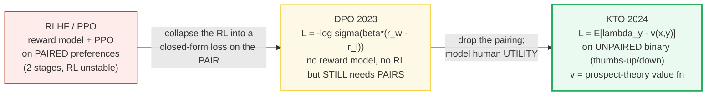
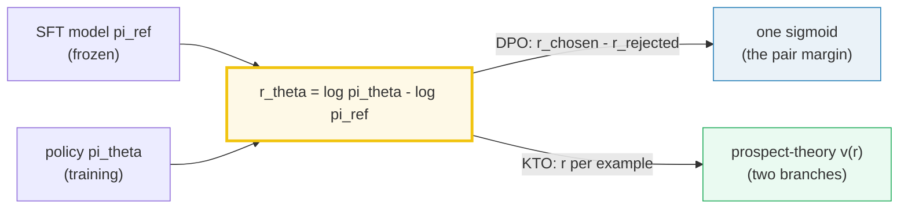
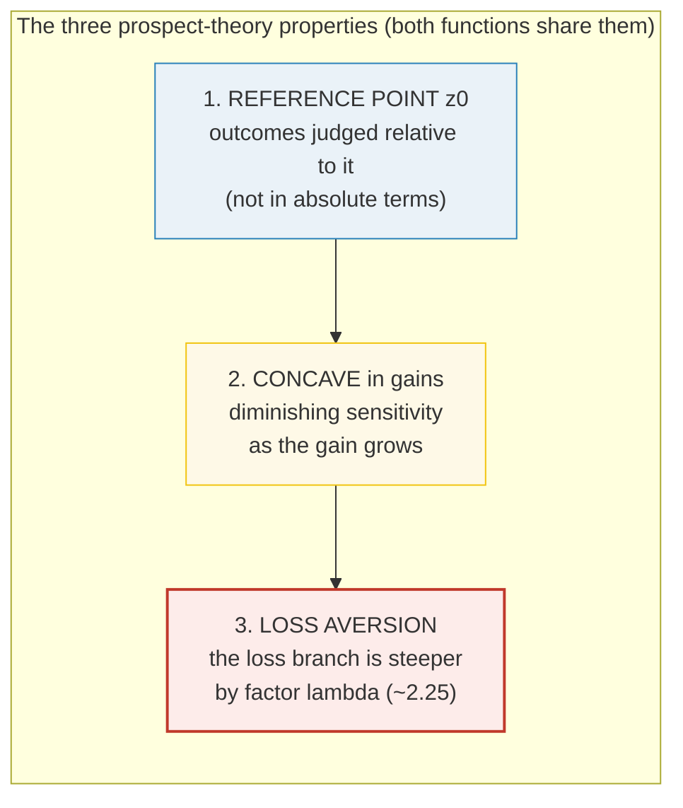
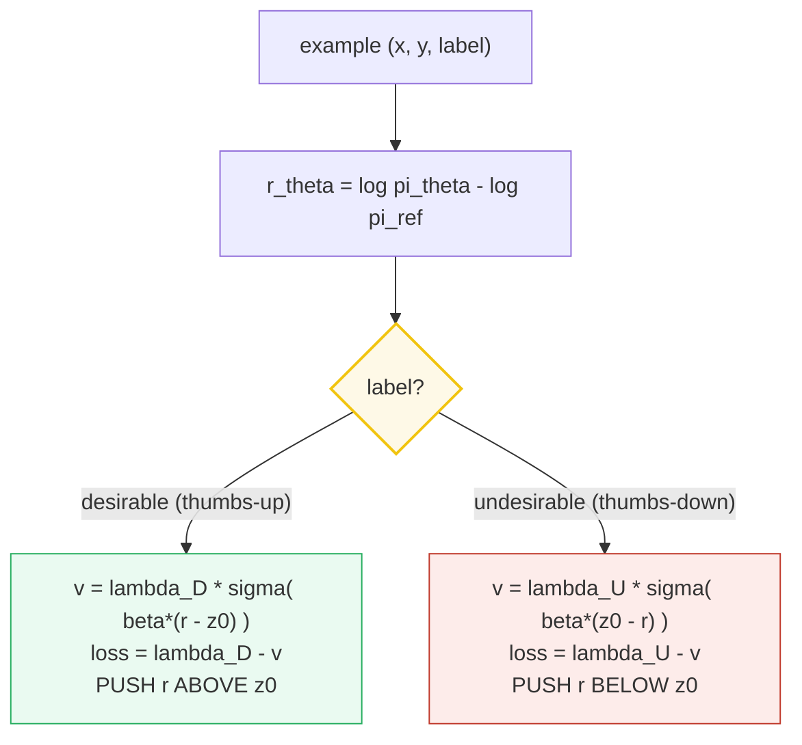
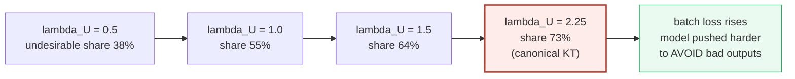
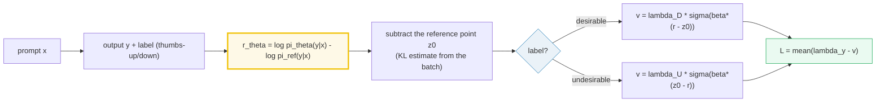

# Kahneman-Tversky Optimization (KTO) — Aligning SLMs from 👍/👎 Alone

> **Companion code:** [`kto_alignment.py`](./kto_alignment.py). **Every number
> in this guide is printed by `uv run python kto_alignment.py`** — change the
> code, re-run, re-paste. Nothing here is hand-computed.
>
> **This is the Phase-4 unpaired aligner.** Once the model is instruction-tuned
> (🔗 [`INSTRUCTION_SFT.md`](./INSTRUCTION_SFT.md)) it is still not *aligned*
> to human preferences. DPO (🔗 [`DIRECT_PREFERENCE_DPO.md`](./DIRECT_PREFERENCE_DPO.md))
> does that alignment but demands **paired** preference data — a human must
> compare *two* full outputs per prompt. **KTO** needs only **unpaired binary
> feedback** (a 👍/👎 on a *single* output), which is roughly free in production,
> and it matches or beats DPO at 1B–30B scale by modelling how humans *actually*
> perceive gains and losses (prospect theory).
>
> **Live animation:** [`kto_alignment.html`](./kto_alignment.html) — drag `λ`
> and watch the KT value function reshape; drag the batch mix and watch the
> KTO batch loss react.
>
> **Foundations:** 🔗 [`PRETRAINING_STABLE.md`](./PRETRAINING_STABLE.md) — the
> SFT reference policy `π_ref` KTO consumes is itself the product of a stable
> pretraining + SFT loop.

---

## 0. TL;DR — the whole idea in one picture

> **The thumb economy (read this first):** DPO lives in a world where every
> training signal costs a *comparison* — a human must read two full answers and
> rank them. KTO lives in the world we actually have: every chat user already
> drops a 👍 or a 👎 on a single answer, millions of times a day, for free.
> The only question is whether a 👍/👎 on *one* output carries enough signal to
> align a model as well as a paired comparison. KTO answers *yes — if your loss
> respects how humans feel about gains and losses*. Humans are **loss-averse**
> (a bad output hurts more than a good one pleases), **reference-dependent**
> (we judge an output relative to *what we expected*, not in absolute terms),
> and **risk-averse in gains / risk-seeking in losses**. That is **prospect
> theory** (Kahneman & Tversky 1979/1992). KTO builds a loss whose value
> function has exactly those three properties, and runs the policy's relative
> reward `r = log π_θ − log π_ref` through it. No pairs. No reward model. No RL.

The alignment recipe improved three times, and each step removed a constraint:



| | RLHF / PPO | DPO | **KTO** |
|---|---|---|---|
| **Data per signal** | a **pair** `(y_w, y_l)` + reward labels | a **pair** `(y_w, y_l)` | **one** `(x, y, 👍/👎)` |
| **Reward model?** | yes (separate stage) | no (implicit) | no (implicit) |
| **RL?** | yes (PPO) | no (closed-form) | no (closed-form) |
| **Models human utility?** | indirectly (via reward) | margin on the pair | **directly** (prospect theory) |
| **Cost to collect data** | highest | high (needs comparison) | **lowest** (free in prod) |
| **Example** | InstructGPT, Llama-2 | Zephyr, most 2024 chat models | production 👍/👎 logs |

> **One plain sentence:** DPO killed the reward model; KTO killed the pairing —
> and it can, because a loss that *respects loss-aversion and a reference point*
> extracts as much signal from one thumb as DPO extracts from a comparison.

### Glossary (plain English — refer back any time)

| Term | Plain meaning |
|---|---|
| **`x`** | The prompt / input. |
| **`y`** | A *single* model output for `x`. **No pairing** — one `y` per example. |
| **`label`** | `True` = desirable (👍), `False` = undesirable (👎). |
| **`π_θ`** | The policy being trained (the model after SFT). |
| **`π_ref`** | The frozen **reference** policy = the SFT model. KTO measures everything *relative* to it. |
| **`logπ`, `logπ_ref`** | The model's / reference's log-prob of the output `y` given `x`. |
| **`r_θ(x,y)`** | `log π_θ(y|x) − log π_ref(y|x)` — the **relative reward** (in nats). Positive = the policy raised `y`'s prob vs the SFT model. |
| **`β`** | Risk-aversion / temperature. Scales how fast the value function saturates. Paper range `[0.01, 1.0]`. |
| **`z₀`** | The **reference point** (prospect theory). The expected reward a human compares against — estimated from the batch as a KL divergence. |
| **`λ_D`, `λ_U`** | Loss-aversion weights for desirable / undesirable outputs (both default `1`). The knobs for class imbalance and loss-aversion. |
| **`σ`** | The logistic sigmoid `1/(1+e^{−x})`. Concave in gains, convex in losses — the shape prospect theory wants. |
| **HALO** | **H**uman-**A**ware **L**oss — the paper's family of losses that model a human value function. DPO and KTO are both HALOs. |
| **Prospect theory** | Kahneman & Tversky's model of human decision-making under risk: reference-dependent, loss-averse, concave-in-gains. |

> 🔗 **If you only read one cross-reference:** DPO and KTO share the *exact same*
> reward building block `r = β(log π_θ − log π_ref)`. DPO feeds `(r_chosen −
> r_rejected)` into one sigmoid; KTO feeds each `r` into its *own* branch of a
> prospect-theory value function. See
> [`DIRECT_PREFERENCE_DPO.md`](./DIRECT_PREFERENCE_DPO.md).

---

## 1. The shared building block — the relative reward — Section A output

Both DPO and KTO start from the same object: how much did the policy raise (or
lower) the probability of `y`, *relative to the frozen SFT reference*?



The relative reward is just a difference of log-probs (so it lives in *nats*):

> From `kto_alignment.py` **Section A** — a few toy `(logπ, logπ_ref)` points:
>
> | logπ_θ | logπ_ref | r_θ (nats) | β·r (reward) |
> |---|---|---|---|
> | −1.00 | −1.60 | **+0.6000** | +0.6000 |
> | −0.90 | −1.10 | +0.2000 | +0.2000 |
> | −1.50 | −1.00 | **−0.5000** | −0.5000 |
> | −1.00 | −1.00 | 0.0000 | 0.0000 |
> | −1.00 | −0.60 | −0.4000 | −0.4000 |
>
> `[check] relative_reward == beta * relative_logratio: OK`
> `[check] r_theta is antisymmetric in (logpi, logpi_ref) swap: OK`

> One plain sentence: `r_θ` is positive when the policy put *more* mass on `y`
> than the SFT model did, and negative when it put *less* — `β` just rescales
> the axis. **Note:** the KTO paper factors `β` *out* of `r_θ` and *into* the
> value function (`σ(β·(r_θ − z₀))`); TRL logs the equivalent DPO-style form
> `β·r_θ` as `chosen_rewards`. Both are the same number — `kto_alignment.py`
> prints both columns to make that explicit.

---

## 2. Why human utility is asymmetric — prospect theory & the KT value function

> **Losses loom larger than gains.** Hand a person \$10 and they smile a little;
> take \$10 away and they seethe. The *magnitude* of the displeasure is bigger
> than the magnitude of the pleasure — by a factor of about **2.25** (Tversky &
> Kahneman 1992, median across subjects). That factor is `λ`, the **loss
> aversion** coefficient. And humans don't judge outcomes in absolute terms —
> they judge them **relative to a reference point** `z₀` (what they expected).
> Kahneman & Tversky's canonical value function captures all three properties:

```
                     v(z; lambda, alpha, z0) =
                        (z - z0)^alpha              if z >= z0   (gain:  concave)
                       -lambda * (z0 - z)^alpha     if z <  z0   (loss:  steeper by lambda)

                     median human params: alpha = 0.88, lambda = 2.25
```

KTO *replaces* the numerically-unstable power function with the logistic
sigmoid `σ` — which is *also* concave in gains and convex in losses — but keeps
the exact same three properties. The table below compares the two side by side:

> From `kto_alignment.py` **Section A** (continued) — canonical KT (power,
> `λ=2.25, α=0.88`) vs KTO's logistic replacement, `z₀=0`:
>
> | z (outcome) | canonical v(z) | KTO-logistic v(z) | meaning |
> |---|---|---|---|
> | −1.00 | **−2.2500** | 1.6449 | LOSS (steeper) |
> | −0.50 | **−1.2226** | 1.4005 | LOSS (steeper) |
> | 0.00 | 0.0000 | 0.5000 | reference pt (flat) |
> | +0.50 | **+0.5434** | 0.6225 | gain (concave) |
> | +1.00 | +1.0000 | 0.7311 | gain (concave) |
>
> **GOLD LOSS-AVERSION ANCHOR** (canonical KT, `λ=2.25`):
> ```
> v(+0.5) = 0.5^0.88       = +0.5434   (a gain of half a nat)
> v(-0.5) = -2.25*0.5^0.88 = -1.2226   (a loss of half a nat)
> |v(-0.5)| / v(+0.5)      = 2.2500  == lambda  (losses loom 2.25x larger)
> ```
> `[check] canonical KT is loss-averse: |v(-0.5)| > v(+0.5): OK`
> `[check] the loss-aversion ratio equals lambda exactly (2.25): OK`
> `[check] canonical KT v(0) == 0 (reference point is flat): OK`



> One plain sentence: a good output *pleases a little*, a bad output of the same
> magnitude *hurts a lot* — and KTO's logistic value function reproduces that
> asymmetry exactly, with `λ` as the dial.

---

## 3. The two KTO loss branches — Section B output

> **The sign-flip is the whole mechanism.** For the *same* relative reward `r`,
> the desirable and undesirable branches demand **opposite** behaviour. On a
> 👍 example, a *positive* `r` is good (the model raised a good output's prob) →
> low loss. On a 👎 example, a *positive* `r` is bad (the model failed to lower
> a bad output's prob) → high loss. KTO implements this by **flipping the sign
> inside the sigmoid** between the two branches.



> From `kto_alignment.py` **Section B** — per-example loss for both branches
> (`β=1.0, λ_D=λ_U=1, z₀=0` held flat here; Section 4 estimates `z₀` from a batch):
>
> **DESIRABLE branch** — `v = λ_D·σ(β·(r−z₀))`, `loss = λ_D − v`:
>
> | r_θ | desirable v(r) | loss = 1 − v | reading |
> |---|---|---|---|
> | +1.00 | 0.7311 | 0.2689 | near 0 (great) |
> | +0.50 | 0.6225 | **0.3775** | near 0 (great) |
> | 0.00 | 0.5000 | 0.5000 | boundary |
> | −0.50 | 0.3775 | 0.6225 | near 1 (bad) |
> | −1.00 | 0.2689 | 0.7311 | near 1 (bad) |
>
> **UNDESIRABLE branch** — `v = λ_U·σ(β·(z₀−r))` (note the **flipped** argument), `loss = λ_U − v`:
>
> | r_θ | undesirable v(r) | loss = 1 − v | reading |
> |---|---|---|---|
> | +1.00 | 0.2689 | 0.7311 | near 1 (penalized) |
> | +0.50 | 0.3775 | **0.6225** | near 1 (penalized) |
> | 0.00 | 0.5000 | 0.5000 | boundary |
> | −0.50 | 0.6225 | 0.3775 | near 0 (correct) |
> | −1.00 | 0.7311 | 0.2689 | near 0 (correct) |
>
> `[check] at r=z0 both branches equal lambda/2 (=0.5 with lambda=1): OK`
> `[check] r=+0.5 desirable loss < r=+0.5 undesirable loss: OK`

**Read it like a story:** look at `r = +0.5`. On a 👍 example the loss is
`0.3775` (good — the model correctly boosted a good output). On a 👎 example the
*same* `r = +0.5` gives loss `0.6225` (bad — the model failed to suppress a bad
output). The sign-flip inside the sigmoid is what turns one scalar `r` into two
opposite supervisory signals. Both branches are non-negative and finite for
*every* `r` — `kto_alignment.py` sweeps `r ∈ [−2, 2]` and checks each.

> 🔗 **Contrast with DPO:** DPO never sees a single `r` in isolation — it always
> computes `r_chosen − r_rejected` and pushes *that margin* through one sigmoid.
> KTO splits the job: each example gets its own branch, and the *label* decides
> which one. That is why KTO can consume unpaired data. See
> [`DIRECT_PREFERENCE_DPO.md`](./DIRECT_PREFERENCE_DPO.md).

---

## 4. The reference point z₀ + the batch loss — Section C output (GOLD ANCHOR)

> **Judge relative to what you expected.** Prospect theory says a human judges an
> output relative to a **reference point** `z₀` — what they *expected* the model
> to produce. KTO's `z₀` is the **KL divergence** `KL(π_θ ‖ π_ref)`: how far the
> policy has drifted from the SFT model on average. A *blunt* reward increase
> (just crank up `π_θ` everywhere) raises `z₀` too, so no progress is made — the
> model is forced to raise `r` on desirable outputs *while keeping the KL flat*.
> That is the same pressure DPO gets from its implicit KL constraint, but
> surfaced explicitly as a term in the loss.

`z₀` is impractical to compute exactly (you'd have to sample from `π_θ`), so KTO
uses a **biased, low-variance estimator** built from the batch: shift each output
to the next prompt (creating mismatched pairs `(x_i, y_{(i+1) mod m})`), take the
mean of those log-ratios, and clamp at 0. The clamp gives positive bias but
lower variance than the unbiased estimator — and you **do not backprop** through
`z₀` (it only controls loss saturation).

> From `kto_alignment.py` **Section C** — the 4-example **GOLD** toy batch
> (`β=1.0, λ_D=λ_U=1`):
>
> | i | label | logπ_θ | logπ_ref | r_θ |
> |---|---|---|---|---|
> | 0 | desirable | −1.00 | −1.60 | **+0.6000** |
> | 1 | desirable | −1.20 | −1.70 | +0.5000 |
> | 2 | undesirable | −0.90 | −1.10 | +0.2000 |
> | 3 | undesirable | −1.50 | −1.00 | **−0.5000** |
>
> The KL reference point:
> ```
> mismatched-pair log-ratios = [0.04, 0.06, -0.02, 0.08]
> z_hat_0 = max(0, mean([0.04, 0.06, -0.02, 0.08]))
>        = max(0, +0.0400)
>        = 0.0400
> ```
> Per-example value `v` and loss:
>
> | i | label | r_θ | v(x,y) | loss = λ−v | branch arg |
> |---|---|---|---|---|---|
> | 0 | desirable | +0.6000 | 0.6365 | **0.3635** | +0.5600 |
> | 1 | desirable | +0.5000 | 0.6130 | 0.3870 | +0.4600 |
> | 2 | undesirable | +0.2000 | 0.4601 | **0.5399** | −0.1600 |
> | 3 | undesirable | −0.5000 | 0.6318 | 0.3682 | +0.5400 |
>
> ```
> GOLD PIN (kto_alignment.html recomputes this identically):
>   batch loss = mean(0.3635 + 0.3870 + 0.5399 + 0.3682) / 4
>             = 0.4147
> ```
> `[check] z0 == max(0, mean(KL_LOGRATIOS)) == 0.04: OK`
> `[check] ex 2 (undesirable, r=+0.2) has the HIGHEST loss in the batch: OK`
> `[check] desirable examples (r>0) have loss < 0.5 (v > 0.5): OK`

### Worked smallest-scale example (read the batch like a story)

- **ex 0, 1 (desirable, `r > 0`):** the policy correctly *raised* the prob of
  two good outputs → `v` is high (0.64, 0.61) → loss is **low** (0.36, 0.39).
- **ex 2 (undesirable, `r = +0.2`):** the policy *failed to lower* a bad output
  → the undesirable branch's flipped argument is **negative** (`z₀ − r = −0.16`)
  → `v` is low (0.46) → loss is **high** (0.54). *This* is the example a
  loss-averse weighting (Section 5) will hit hardest.
- **ex 3 (undesirable, `r = −0.5`):** the policy correctly *lowered* a bad
  output → flipped argument is positive → `v` is high → loss is **low** (0.37).

The batch loss `0.4147` is the **gold anchor** — [`kto_alignment.html`](./kto_alignment.html)
recomputes the *identical* formula on the *same* hardcoded batch and shows a
`[check: OK]` badge if it matches within `1e-3`.

> ⚠️ **The `z₀` gloss:** an earlier build brief loosely described `z₀` as
> "mean `σ(r)`". That was imprecise. The actual `z₀` is the **mismatched-pair
> log-ratio mean clamped at 0** (a biased KL estimator), per the paper §4.1 and
> the TRL implementation (`KL_input_ids`). `kto_alignment.py` implements the
> paper's exact form. Full provenance in
> [`kto_alignment_reference.txt`](./kto_alignment_reference.txt).

---

## 5. The loss-aversion effect — sweeping λ_U — Section D output

> **Dialling how much bad outputs hurt.** Prospect theory's `λ ≈ 2.25` says
> losses loom larger than gains. In KTO that dial is `λ_U` (the weight on the
> undesirable branch). Holding `λ_D = 1` and sweeping `λ_U` over the toy batch
> makes the undesirable examples' losses count **more** — the batch loss rises,
> and the optimizer is pushed harder to **avoid bad outputs**. The canonical
> prospect-theory `λ = 2.25` sits at the top of the sweep.



> From `kto_alignment.py` **Section D** — `λ_U` sweep (`λ_D=1, β=1`, same batch):
>
> | λ_U | desirables loss | undesirables loss | **BATCH loss** | undesirable share |
> |---|---|---|---|---|
> | 0.50 | 0.7505 | 0.4541 | **0.3011** | 0.3769 |
> | 1.00 | 0.7505 | 0.9081 | **0.4147** | 0.5475 |
> | 1.50 | 0.7505 | 1.3622 | **0.5282** | 0.6447 |
> | **2.25** | 0.7505 | 2.0432 | **0.6984** | **0.7314** |
>
> `[check] batch loss is MONOTONE increasing in lambda_U: OK`
> `[check] undesirable share of loss is MONOTONE increasing in lambda_U: OK`
> `[check] lambda_U=1.0 reproduces the Section C batch loss exactly: OK`
> `[check] canonical prospect-theory lambda (2.25) gives the highest batch loss: OK`

> One plain sentence: as `λ_U` climbs, the "model failed to lower a bad output"
> case (ex 2) gets weighted harder, the batch loss rises, and the optimizer
> spends more gradient on *not producing bad outputs* — exactly the loss-aversion
> pressure prospect theory predicts.

**Tuning rule (paper Eq 9):** for class imbalance, set `λ_D, λ_U` so that
`λ_D·n_D / (λ_U·n_U) ∈ [1, 1.5]`. With this batch's 2:2 balance and `λ_D=1` the
rule gives `λ_U ∈ [0.67, 1.0]`; `λ_U = 2.25` would be for a task where avoiding
bad outputs (e.g. toxicity prevention) matters *more* than producing good ones.

---

## 6. The decision recap — Section E output

> From `kto_alignment.py` **Section E**:
>
> | method | data it needs | what it buys you | the cost |
> |---|---|---|---|
> | RLHF / PPO | reward model + PPO | matches true human prefs | 2 stages, RL unstable, **pairs** needed |
> | DPO | closed-form on (chosen, rejected) **pairs** | no RL, no reward model | **still needs pairs** |
> | **KTO** | closed-form on **unpaired binary** (👍/👎) | cheap abundant data; matches DPO at 1B–30B | needs KL estimate `z₀`; tune `{λ_D, λ_U}` |
>
> The single question that picks the row: **Can you get pairs?** → DPO. **Only
> unpaired binary?** → KTO. **Need the reward model downstream?** → RLHF/PPO.

---

## 7. The why: three layers of depth

**What** (the mechanism): the relative reward `r_θ = log π_θ − log π_ref` flows
into a prospect-theory value function `v` with two branches (one per label),
the result is subtracted from `λ_y` to give a non-negative per-example loss, and
a batch-level KL reference point `z₀` keeps the policy anchored to the SFT model
(Sections 1, 3, 4).

**Why-internals** (why each step in the lineage beat the last):
- **RLHF → DPO:** RLHF needs a *separate* reward-model stage *and* an unstable
  RL loop. DPO observes that the optimal RLHF policy has a closed form, so the
  reward model and PPO collapse into one sigmoid over the pair margin. The win
  is engineering (one stage, stable), not objective quality.
- **DPO → KTO:** DPO still needs a human to *compare two outputs* — expensive.
  KTO observes that (a) humans naturally emit *unpaired binary* feedback
  (👍/👎), and (b) the alignment loss should *model how humans feel about gains
  and losses* (prospect theory), not just maximize a margin. By replacing the
  pair-margin sigmoid with a per-example prospect-theory value function, KTO
  consumes the cheap data *and* encodes the right inductive bias — so it matches
  DPO at 1B–30B despite the weaker per-example signal.
- **The `z₀` trick:** a naive "just maximize `r` on 👍 and minimize it on 👎"
  loss would let the model cheat by cranking `π_θ` up/down *everywhere*. `z₀`
  (the KL to `π_ref`) makes the reward *relative to average drift* — so the only
  way to raise `r − z₀` on a 👍 is to raise `r` *more than you raised the KL*,
  i.e. to learn *what makes an output good*, not just to be more confident.

**Gotchas** (the killer ones — see the table below): `z₀` must be *estimated*
(not assumed 0) when KTO doesn't follow SFT on the same data; class imbalance
between 👍/👎 silently biases the loss unless you re-weight with `{λ_D, λ_U}`;
and `β` needs different ranges for SFT'd vs. raw models. KTO sidesteps the
pair-collection cost entirely, but its hyperparameters are *more* numerous than
DPO's.

---

## 8. Pitfalls & debugging checklist

| # | Trap | Symptom | Fix |
|---|---|---|---|
| 1 | **Setting `z₀ = 0` unconditionally** | When KTO does *not* follow SFT on the same data, the reference point is wrong → the loss saturates in the wrong place → model drifts | Estimate `ẑ₀` from mismatched batch pairs (`max(0, mean)`). Safe to set `z₀=0` *only* when SFT preceded KTO on the same desirable data (then `ẑ₀ → 0` fast). |
| 2 | **Ignoring 👍/👎 class imbalance** | If 👎 are 10× more common (typical of real logs), the undesirable branch dominates the loss and the model becomes refusal-happy / over-cautious | Re-weight with the paper's rule `λ_D·n_D / (λ_U·n_U) ∈ [1, 1.5]` (Section 5); or subsample to balance. |
| 3 | **Wrong `β` for the regime** | Large SFT'd model with `β=1.0` → loss saturates instantly, no gradient; small raw model with `β=0.01` → gradients vanish | Large SFT'd models: `β ∈ [0.01, 0.10]`. Small / no-SFT models: `β ∈ [0.10, 1.00]` (paper Table 1). |
| 4 | **Backpropagating through `z₀`** | The KL term's gradient fights the reward gradient → unstable, oscillating loss | Treat `z₀` as a *constant* for backprop (detach). The paper: "we do not backpropagate through `z₀`; it exists purely to control loss saturation." |
| 5 | **Forgetting the undesirable branch's sign-flip** | Implementing both branches with `σ(β(r − z₀))` → 👎 examples get the *wrong* gradient (model rewarded for *raising* bad-output prob) | Undesirable branch argument is `(z₀ − r)`, **not** `(r − z₀)`. Cross-check against TRL `rejected_losses = 1 - sigmoid(beta*(kl - rejected_logratios))`. |
| 6 | **Using a learning rate tuned for DPO** | KTO's reference-adjusted reward is much smaller in magnitude → DPO's `5e-7` barely moves the model | KTO typically needs `2–10×` DPO's LR; default starting point `5e-6` with AdamW (paper §4.2). |
| 7 | **Batch size < 2** | The mismatched-pair `z₀` estimator needs ≥ 2 examples; with 1 it degenerates to the example's own reward | Use microbatch ≥ 2; recommended effective batch `8–128`. |
| 8 | **Treating preference data as "ground-truth binary"** | Converting `y_w`/`y_l` pairs into 👍/👎 naively loses information (a "win" is not an absolute thumbs-up) | Acceptable for a baseline (the paper does this), but a smarter preference→binary decomposition does better. Use *real* binary feedback logs when available. |
| 9 | **Skipping SFT then complaining KTO underperforms** | At small scale, KTO-without-SFT lags SFT+DPO | Either SFT first (recommended), or raise `β` (Section 5 / paper Table 1: no-SFT uses higher `β`). At *sufficient* scale, KTO alone matches SFT+DPO. |
| 10 | **Confusing prospect-theory `λ=2.25` with KTO's `λ_D/λ_U`** | Setting `λ_U=2.25` "because that's the human value" when the batch is balanced → over-penalizes 👎 | The canonical `2.25` is a *human* median; KTO's `λ_D/λ_U` are *tunable* (default 1) and should follow the class-balance rule, not the prospect-theory number. |

---

## 9. Cheat sheet



- **The one identity:** `r_θ(x,y) = log π_θ(y|x) − log π_ref(y|x)` — the shared
  DPO/KTO building block. `β` lives *inside* the value function, not in `r_θ`.
- **Reference point:** `z₀ = KL(π_θ ‖ π_ref)`, estimated as
  `ẑ₀ = max(0, mean_i[logπ_θ(y_{(i+1)%m}|x_i) − logπ_ref(…)])` (mismatched pairs,
  clamped, **not** backpropped).
- **Value function:**
  - desirable: `v = λ_D·σ(β·(r_θ − z₀))` — push `r` *above* `z₀`.
  - undesirable: `v = λ_U·σ(β·(z₀ − r_θ))` — push `r` *below* `z₀` (note the flip).
- **Loss:** `L_KTO = E_{x,y}[λ_y − v(x,y)]` — always ≥ 0, finite.
- **Gold anchor:** for the 4-example batch with `β=1.0, λ_D=λ_U=1`, `z₀=0.04`,
  the KTO batch loss = **0.4147** (recomputed identically in
  [`kto_alignment.html`](./kto_alignment.html)).
- **Loss-aversion anchor:** canonical KT `|v(−0.5)| / v(+0.5) = 2.25 = λ`
  (losses loom `λ`× larger than gains).
- **Hyperparameters:** `β ∈ [0.01, 1.0]` (smaller for large SFT'd models);
  `λ_D = λ_U = 1` default; class-balance rule `λ_D·n_D/(λ_U·n_U) ∈ [1, 1.5]`;
  LR `~5e-6` AdamW (2–10× DPO's).
- **Decision rule:** *Have pairs?* → DPO. *Only unpaired binary?* → KTO.
  *Need the reward model downstream?* → RLHF/PPO.

> 🔗 **Cross-references — where KTO plugs into the pipeline:**
> - 🔗 [`DIRECT_PREFERENCE_DPO.md`](./DIRECT_PREFERENCE_DPO.md) — the **paired**
>   counterpart; KTO shares the `r_π = β(logπ − logπ_ref)` building block but
>   consumes unpaired 👍/👎 instead of (chosen, rejected) pairs.
> - 🔗 [`INSTRUCTION_SFT.md`](./INSTRUCTION_SFT.md) — KTO, like DPO, starts from
>   the **SFT reference policy** `π_ref`; SFT-first is recommended for small
>   models (raises `β` if you skip it).
> - 🔗 [`LOW_RANK_DORA.md`](./LOW_RANK_DORA.md) — KTO is commonly applied via
>   **adapters** (LoRA/DoRA) for parameter-efficient alignment of SLMs; the
>   reference model then comes "for free" by disabling the adapter.
> - 🔗 [`PRETRAINING_STABLE.md`](./PRETRAINING_STABLE.md) — optimization-stability
>   tricks (LR schedule, gradient clipping, loss-spike mitigation) apply directly
>   to the KTO fine-tune loop; KTO's higher LR makes clipping more important.

---

## Sources

Every formula below is web-verified in ≥2 independent sources; the full per-URL
provenance log is in [`kto_alignment_reference.txt`](./kto_alignment_reference.txt)
(6 distinct URLs).

- **Ethayarajh, K.; Xu, W.; Muennighoff, N.; Jurafsky, D.; Kiela, D. (2024).**
  *KTO: Model Alignment as Prospect Theoretic Optimization.* ICML 2024 —
  arXiv:2402.01306 — <https://arxiv.org/abs/2402.01306>
  (readable HTML: <https://arxiv.org/html/2402.01306v4>)
  The primary source. Defines the KTO loss `L = E[λ_y − v(x,y)]` (Eq 8), the
  two-branch value function `v = λ·σ(β·(r_θ − z₀))` (desirable) /
  `λ·σ(β·(z₀ − r_θ))` (undesirable), the relative reward
  `r_θ = log π_θ − log π_ref`, the biased KL estimator
  `ẑ₀ = max(0, mean(mismatched log-ratios))`, the hyperparameter ranges
  (`β ∈ [0.01, 1.0]`, `λ_D=λ_U=1`), and the class-balance rule (Eq 9). Also
  cites the canonical KT value function with `α=0.88, λ=2.25`.

- **HuggingFace TRL — `kto_trainer.py`.** The reference library implementation —
  <https://raw.githubusercontent.com/huggingface/trl/main/trl/trainer/kto_trainer.py>
  Independent code-level confirmation of every branch formula:
  `chosen_losses = 1 − sigmoid(β·(chosen_logratios − kl))`,
  `rejected_losses = 1 − sigmoid(β·(kl − rejected_logratios))`, with
  `desirable_weight`/`undesirable_weight` = `λ_D`/`λ_U` (default 1) and the
  `KL_input_ids` mismatched-pair collator.

- **Rafailov, R.; Sharma, A.; Mitchell, E.; Manning, C.; Ermon, S. (2023).**
  *Direct Preference Optimization: Your Language Model is Secretly a Reward
  Model.* NeurIPS 2023 — arXiv:2305.18290 — <https://arxiv.org/abs/2305.18290>
  KTO's paired counterpart. Source of the shared building block
  `r_π = β(log π_θ − log π_ref)` and the lineage motivation (DPO needs pairs;
  KTO relaxes that).

- **Tversky, A.; Kahneman, D. (1992).** *Advances in Prospect Theory:
  Cumulative Representation of Uncertainty.* J. Risk & Uncertainty 5(4):297–323
  — <https://doi.org/10.1007/BF00122574>
  The prospect-theory foundation. Source of the canonical value function
  `v(z) = (z−z₀)^α` (gain) / `−λ(z₀−z)^α` (loss) with median fitted
  `α = 0.88, λ = 2.25` — the loss-aversion ratio `kto_alignment.py` reproduces.

- **Xu, W. (co-author) — KTO project page.**
  <https://winniexu.ca/research/kto>
  Independent non-arXiv summary: "KTO matches or exceeds DPO without preference
  data" using "a binary signal of whether an output is desirable" — confirms
  the high-level claim and the data-collection cost advantage.

> **Unverified facts:** none outstanding. (The build brief's loose description
> of `z₀` as "mean `σ(r)`" was traced to an imprecise gloss; the bundle
> implements the paper's exact mismatched-pair log-ratio mean clamped at 0,
> confirmed in the paper §4.1, the HTML rendering, and TRL's `KL_input_ids`.)
