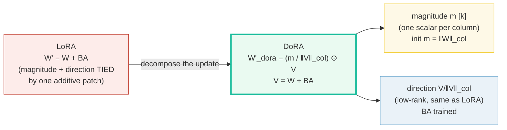
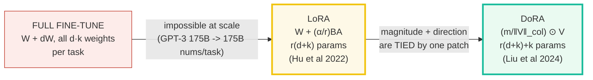
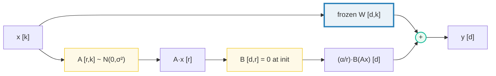
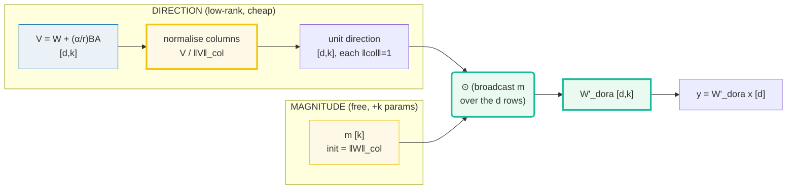
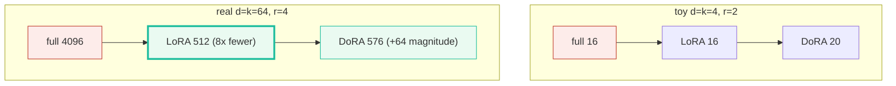
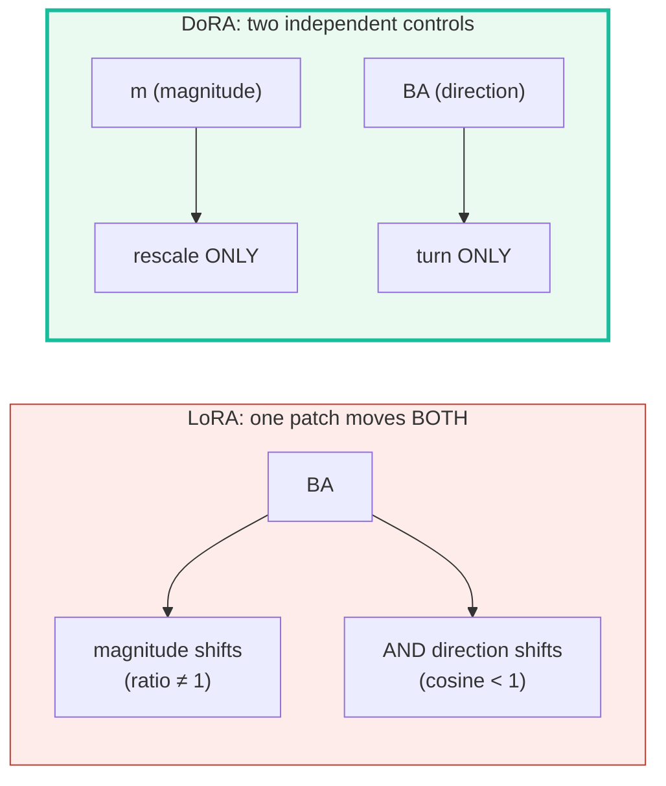
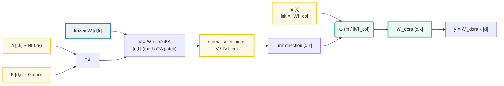

# DoRA (Weight-Decomposed Low-Rank Adaptation) vs LoRA — A Visual, Worked-Example Guide

> **Companion code:** [`low_rank_dora.py`](./low_rank_dora.py). **Every number in
> this guide is printed by `uv run python low_rank_dora.py`** — change the code,
> re-run, re-paste. Nothing here is hand-computed.
>
> **Phase:** Phase 4 — Instruction Tuning & Alignment. The adapters this bundle
> describes are what SFT and DPO actually tune. Sibling bundles:
> 🔗 [`INSTRUCTION_SFT.md`](./INSTRUCTION_SFT.md),
> 🔗 [`DIRECT_PREFERENCE_DPO.md`](./DIRECT_PREFERENCE_DPO.md).
>
> **Lineage source:** 🔗 [`../llm/PEFT_LORA.md`](../llm/PEFT_LORA.md) — the
> LoRA foundations (the `y = W₀x + (α/r)BAx` formula, the `B=0` init, the
> rank-`r` patch, Punica/S-LoRA serving) this guide extends with DoRA's
> magnitude/direction split ([§6](#6-why-decouple-magnitude-and-direction--the-dora-claim)).
>
> **Live animation:** [`low_rank_dora.html`](./low_rank_dora.html) — drag
> `d`, `k`, `r`; watch the live param-count bars and the magnitude ⊗ direction
> decomposition.
>
> **Provenance log:** [`low_rank_dora_reference.txt`](./low_rank_dora_reference.txt)
> — every formula and init convention traced to ≥2 web sources (DoRA paper,
> LoRA paper, weight normalization, HF PEFT, official NVlabs repo).

---

## 0. TL;DR — the whole idea in one picture

> **The "magnitude / direction" analogy (read this first):** Full fine-tuning
> rewrites a weight matrix `W` and, in doing so, changes **two** things about
> every column of `W` at once: **how long** that column is (its *magnitude*,
> the L2 norm) and **which way** it points (its *direction*, the unit vector).
> Standard LoRA only learns a low-rank patch `BA` and adds it: `W' = W + BA`.
> Because a single additive patch must move the *whole* column, LoRA is forced
> to change magnitude and direction **together** — it can lengthen a column,
> but only by also turning it. **DoRA's move: decouple them.** Learn a
> per-column **magnitude** vector `m` and a (low-rank) **direction**
> `V/‖V‖_col` *separately*: `W'_dora = (m / ‖V‖_col) ⊙ V`, where `V = W + BA`
> is the same patch as LoRA. So **"how much"** (`m`, one scalar per output
> column) is freed from **"which way"** (the LoRA-style low-rank direction).
> That is the whole of DoRA: LoRA for the direction, a free magnitude vector
> for the scale.



| | Full fine-tuning | **LoRA** | **DoRA** |
|---|---|---|---|
| **Merged weight** | `W + dW` (all weights) | `W + (α/r)BA` | `(m / ‖V‖_col) ⊙ V`, `V = W + (α/r)BA` |
| **Trainable params** | `d·k` | `r(d+k)` | `r(d+k) + k` |
| **Magnitude / direction** | both move, **independently** | both move, **proportionally** (tied) | **free**: `m` and direction move separately |
| **Init (no-op at step 0)** | — | `B=0` ⇒ `ΔW=0` | `B=0`, `m=‖W‖_col` ⇒ `W'_dora=W` |
| **Inference** | one full copy per task | mergeable (`W+BA`), zero overhead | mergeable, zero overhead |
| **Quality vs full-FT** | the ceiling | below full-FT | **closer to full-FT** (often beats LoRA; matches it at ½ the rank) |

> **One plain sentence:** LoRA updates a weight by adding a low-rank patch, so
> magnitude and direction are yoked together; DoRA splits the update into a
> free per-column magnitude and a low-rank direction, recovering full-FT's
> independent-update behaviour at ~LoRA's cost (just `+k` params).

### Glossary (plain English — refer back any time)

| Term | Plain meaning |
|---|---|
| **`W`** | The FROZEN pre-trained weight of one linear layer, shape `[d, k]`. The forward is `y = W x` with `x ∈ ℝ^k` (input) and `y ∈ ℝ^d` (output): so `k` = input dim, `d` = output dim (the LoRA-paper convention). |
| **`d`** | Output dimension (rows of `W`). |
| **`k`** | Input dimension (columns of `W`). Also the length of DoRA's magnitude vector `m` — one scalar *per column*. |
| **`r` (rank)** | The inner / bottleneck dim of the adapter; `r ≪ min(d,k)` (real use: 8, 16, 64). |
| **`A`** | The down-projection `[r, k]`; init ~ `N(0, σ²)` (random Gaussian). |
| **`B`** | The up-projection `[d, r]`; init = **0** (so the patch `BA = 0` at step 0). |
| **`BA`** | The low-rank patch `[d, k]`; `rank(BA) ≤ r` by construction. |
| **`α` (alpha)** | Scaling hyperparameter; the patch is multiplied by `α/r`. Here `α = r` so the effective scale is `1` and `W' = W + BA` exactly (lets you change `r` without retuning the LR). |
| **`m`** | DoRA's **magnitude** vector, length `k`; `m[j] = ‖W[:,j]‖` (the L2 norm of column `j`) at init. Learned during fine-tuning. |
| **column** | Column `j` of a `[d, k]` matrix is the vector `W[:, j] ∈ ℝ^d` — the weights feeding **output neuron `j`**. `‖W‖_col` stacks the `k` column norms into a length-`k` vector. |
| **direction** | The unit-column matrix `V / ‖V‖_col`; each column has norm 1 (points "which way", no length). |
| **merge** | Fold the adapter into `W` at deploy: LoRA → `W + (α/r)BA`; DoRA → `(m/‖V‖_col) ⊙ V`. Both become a plain linear, **zero added latency**. |

> 🔗 **If you only read one cross-reference:** the LoRA forward
> `y = W₀x + (α/r)·BAx`, the `B=0` init, and the rank-`r` patch all live in
> [`../llm/PEFT_LORA.md`](../llm/PEFT_LORA.md). This bundle takes those as read
> and adds the one idea that is DoRA: the magnitude/direction decomposition.

---

## 1. The lineage: full-FT → LoRA → DoRA



| step | what changed | **WHY** it was needed |
|---|---|---|
| **Full FT** | train every `d·k` weight per task | the only option pre-2021 — does not scale past a few tasks (one full copy each) |
| **→ LoRA** | freeze `W`, train only `(α/r)BA` | GPT-3 175B: ~10,000× fewer trainable params, 3× less VRAM, **zero inference latency** (mergeable). The catch: a single additive patch conflates magnitude and direction. |
| **→ DoRA** | split the update into magnitude `m` + direction `V/‖V‖_col` | LoRA can't mimic how full-FT updates magnitude and direction *independently*. DoRA decouples them at ~LoRA cost (`+k` params) → closer to full-FT quality, often beats LoRA, and matches it at half the rank. |

> **One plain sentence:** full-FT updates everything (expensive); LoRA freezes
> `W` and patches it with a low-rank `BA` (cheap, but ties magnitude to
> direction); DoRA keeps the cheap low-rank direction and adds a free magnitude
> vector, recovering full-FT's *behaviour* at LoRA's *cost*.

---

## 2. LoRA from scratch — the low-rank patch `W' = W + BA` — Section A

> **The low-rank bet.** Pre-training leaves the weights over-parameterised; the
> *adjustment* a downstream task needs lives in a low-dimensional subspace. So
> approximate the full update `ΔW ∈ ℝ^{d×k}` (up to `d·k` numbers) as a product
> `BA` of two thin matrices: `B ∈ ℝ^{d×r}`, `A ∈ ℝ^{r×k}` with `r ≪ min(d,k)`.
> That is **`r(d+k)`** numbers instead of `d·k`. Freeze `W`; train only `A, B`.

The forward and the init (paper, Hu et al 2022 §4.1):

```
y = W x + (α/r) · B (A x)          shapes: W[d,k], x[k], A[r,k], B[d,r], y[d]
ΔW = (α/r) · B · A                  rank(ΔW) ≤ r   (low-rank by construction)
init: A ~ N(0, σ²),  B = 0          => ΔW = 0 on step 0  (model == base)
```

Tiny layer `d=k=4, r=2, α=2` (so `α/r = 1`, `W' = W + BA`). The frozen base `W`
and the patch at init:

> From `low_rank_dora.py` **Section A**:
>
> **frozen base `W`** (shape `(4, 4)`):
>
> | row \ col | j=0 | j=1 | j=2 | j=3 |
> | --- | --- | --- | --- | --- |
> | i=0 | -0.7961 | -0.8148 | -0.1772 | -0.3068 |
> | i=1 | +0.6001 | +0.4893 | -0.2235 | -1.4957 |
> | i=2 | +0.2279 | -0.8933 | +0.2475 | +0.2179 |
> | i=3 | +0.0847 | +0.8752 | +0.7897 | -0.1749 |
>
> At **init** (`B = 0`): the patch `ΔW = (α/r)BA` is all zeros, so the merged
> `W' = W + ΔW` is **identical to `W`** — the LoRA adapter is a **no-op** until
> training moves `B`. This is why LoRA training is stable from step 0.
> `[check] init: delta_W == 0 (B=0): OK`
> `[check] init: merged W' == W: OK`



### The rank-`r` constraint (why "low-rank" buys you something)

Give `B` learned (nonzero) values and the patch `ΔW = BA` genuinely has rank
`≤ r` — provable by counting nonzero singular values:

> From `low_rank_dora.py` **Section A** (trained `B`, same `A`):
>
> **trained `ΔW = (α/r)BA`** (shape `(4, 4)`):
>
> | row \ col | j=0 | j=1 | j=2 | j=3 |
> | --- | --- | --- | --- | --- |
> | i=0 | -0.2490 | +0.0096 | -0.2406 | +0.0541 |
> | i=1 | -0.2039 | +0.2330 | -0.2483 | +0.0309 |
> | i=2 | +0.1652 | -0.0002 | +0.1582 | -0.0363 |
> | i=3 | +0.2716 | +0.3657 | +0.1767 | -0.0814 |
>
> ```
> singular values of delta_W = [0.6284, 0.4307, 0.0, 0.0]
> rank(delta_W) = 2  (<= r = 2 by construction)
> ```
> `[check] rank(trained delta_W) <= r: OK`
> `[check] rank(trained delta_W) == r when B,A are full rank: OK`

A `d×k` matrix factored as `B[d,r] @ A[r,k]` can have **at most `r` nonzero
singular values** — that *is* what "low-rank" buys you. Raise `r` for harder
tasks (LoRA → full-FT as `r → rank(W)`); keep `r ≪ min(d,k)` for the savings.

> **GOLD PIN** (`low_rank_dora.html` recomputes this): `d=4, k=4, r=2` →
> full-FT `= d·k = 16`; LoRA `= r(d+k) = 16`.
> `[check] LoRA params r(d+k) == 16 for d=4,k=4,r=2: OK`

> 🔗 This `y = W₀x + (α/r)BAx`, the `B=0` init, and the `r(d+k)` param math are
> exactly [`../llm/PEFT_LORA.md`](../llm/PEFT_LORA.md) §3 — this guide treats
> them as the foundation DoRA extends.

---

## 3. DoRA from scratch — magnitude ⊗ direction — Section B

> **The decomposition.** Any weight matrix factors as magnitude ⊗ direction:
> `W = m ⊙ (W / ‖W‖_col)`, where `m = ‖W‖_col` (length `k`) and `W/‖W‖_col`
> has **unit columns** (each column is a pure direction). This is Salimans &
> Kingma's **weight normalization** (arXiv:1602.07868) — DoRA reuses it *per
> column*. Then DoRA applies **LoRA to the direction** and trains the
> **magnitude separately**:
>
> ```
> V   = W + (α/r)·B·A           (the SAME patch as LoRA, NOT yet normalised)
> W'_dora = (m / ‖V‖_col) ⊙ V    m ∈ ℝ^k learned (init m = ‖W‖_col)
> ```
> `V/‖V‖_col` is the unit direction per column; `m` rescales it. Trainable
> params: `r(d+k) + k` (the `+k` is the magnitude vector).

Same tiny layer `d=k=4, r=2`. The magnitude vector `m` and the column norms at
init:

> From `low_rank_dora.py` **Section B**:
>
> ```
> Trainable params: A [r,k] + B [d,r] + m [k] = r(d+k) + k
>   = 2*(d+k) + k = 16 + 4 = 20
>
> magnitude vector m [k] (init = ‖W[:,j]‖, the column norms of W):
>   m         = [1.0262, 1.5708, 0.8753, 1.5522]
>   ‖W‖_col  = [1.0262, 1.5708, 0.8753, 1.5522]  (== m at init)
>
> V = W + (α/r)BA  ;  at init B=0 so V = W.
>   ‖V‖_col = [1.0262, 1.5708, 0.8753, 1.5522]  (== ‖W‖_col == m at init)
> ```
>
> At init: `V = W`, so `(m / ‖V‖_col) = m / ‖W‖_col = 1` (all ones), so
> `W'_dora = 1 ⊙ W = W` **EXACTLY**. DoRA, like LoRA, starts as a no-op — but
> it has split the update into a free magnitude vector `m` and a low-rank
> direction `V/‖V‖_col` that can now move independently.
>
> `[check] init: m == ‖W‖_col: OK`
> `[check] init: DoRA W'_dora == W (forward-equivalence at init): OK`



> **GOLD PIN** (`low_rank_dora.html` recomputes this): `d=4, k=4, r=2` →
> DoRA `= r(d+k)+k = 16+4 = 20`.
> `[check] DoRA params r(d+k)+k == 20 for d=4,k=4,r=2: OK`
> `[check] DoRA adds exactly k magnitude params over LoRA (20 vs 16): OK`

> 🔗 The normalisation `V/‖V‖_col` is **weight normalization** (Salimans &
> Kingma 2016) applied per column — the same "decouple length from direction"
> trick, now bolted onto a LoRA patch. See `low_rank_dora_reference.txt` [3].

---

## 4. Forward-pass comparison — all three agree at init — Section C

> **A crucial invariant.** At init both adapters are no-ops (LoRA: `B=0`; DoRA:
> `B=0` *and* `m=‖W‖_col`), so the frozen base, the LoRA layer, and the DoRA
> layer produce **identical** outputs. Training then diverges them. This is why
> you can drop a LoRA/DoRA adapter onto a pretrained model and start training
> immediately, without a loss spike.

> From `low_rank_dora.py` **Section C** — input `x [k=4]` (seeded):
>
> ```
> Input x [k=4] (seeded): [-0.1468, 0.7861, 0.9468, -1.1143]
> ```
>
> | output | values |
> |---|---|
> | y_full = W x       | [-0.3496, 1.7517, -0.7442, 1.6181] |
> | y_lora = W' x      | [-0.3496, 1.7517, -0.7442, 1.6181] |
> | y_dora = W'_dora x | [-0.3496, 1.7517, -0.7442, 1.6181] |
>
> `[check] init: y_lora == y_full: OK`
> `[check] init: y_dora == y_full: OK`
> `[check] init: y_dora == y_lora: OK`

> **One plain sentence:** at step 0 the three forwards are bit-identical; what
> differs is the *expressiveness* of the update each adapter can make from
> there — and that is where DoRA pulls ahead ([§6](#6-why-decouple-magnitude-and-direction--the-dora-claim)).

---

## 5. Param-count + expressiveness — Section D

> **The structural math.** Full-FT grows as `d·k` (quadratic in the width);
> LoRA/DoRA grow as `r(d+k)` (linear in the width). So the savings explode at
> scale: at `d=k=64, r=4`, full `= 4096` but LoRA `= 512` and DoRA `= 576`.
> DoRA costs exactly `k` more params than LoRA (the magnitude vector) — at real
> scale (`d=k=4096, r=8`) that is `+4096` out of `~65536`, ~6%, the ~0.2%
> overhead the DoRA paper reports. Negligible.

> From `low_rank_dora.py` **Section D**:
>
> | d | k | r | full-FT d·k | LoRA r(d+k) | DoRA r(d+k)+k | LoRA/full | DoRA/full |
> |-----|-----|---|-------------|-------------|---------------|-----------|------------|
> | 4   | 4   | 2 |          16 |          16 |            20 |    1.0000 |     1.2500 |
> | 8   | 8   | 2 |          64 |          32 |            40 |    0.5000 |     0.6250 |
> | 8   | 8   | 4 |          64 |          64 |            72 |    1.0000 |     1.1250 |
> | 8   | 8   | 8 |          64 |         128 |           136 |    2.0000 |     2.1250 |
> | 64  | 64  | 2 |       4,096 |         256 |           320 |    0.0625 |     0.0781 |
> | 64  | 64  | 4 |       4,096 |         512 |           576 |    0.1250 |     0.1406 |
> | 64  | 64  | 8 |       4,096 |       1,024 |         1,088 |    0.2500 |     0.2656 |



**Read the table:**
- When `r ≥ min(d,k)` the "low-rank" bet stops paying — LoRA can *exceed*
  full-FT (e.g. `d=k=8, r=8 → 128 > 64`). Real use keeps `r ≪ min(d,k)`.
- DoRA's `+k` overhead shrinks to nothing relative to `r(d+k)` as `d` grows; it
  is the magnitude vector that buys the magnitude/direction decoupling.

> 🔗 The compression story is the same as plain LoRA's
> ([`../llm/PEFT_LORA.md`](../llm/PEFT_LORA.md) §6); DoRA just adds `k` params
> for the magnitude vector on top. Another parameter-economy lever lives in
> [`SHARED_EMBEDDINGS.md`](./SHARED_EMBEDDINGS.md) (weight *tying*).

---

## 6. Why decouple magnitude and direction — the DoRA claim — Section E

> **The deep "why".** Full fine-tuning updates both the magnitude **and** the
> direction of each weight column, and it can move them **independently**
> (rescale a column without turning it; turn a column without rescaling it).
> LoRA's single patch `BA` cannot — adding `BA` to a column shifts its norm
> *and* its angle at once, proportionally. DoRA fixes exactly this: the
> magnitude `m` is a free parameter (touch it → only the scale changes), and
> the direction `V/‖V‖_col` does not depend on `m` at all (touch `BA` → only
> the direction changes). That is the full-FT behaviour, recovered at LoRA cost.

**Step 1 — any weight matrix factors as magnitude ⊙ direction.**
`W = m ⊙ (W / ‖W‖_col)`, with `m = ‖W‖_col` (length `k`) and unit columns:

> From `low_rank_dora.py` **Section E** (Step 1):
>
> **direction `= W / ‖W‖_col`** (unit columns) (shape `(4, 4)`):
>
> | row \ col | j=0 | j=1 | j=2 | j=3 |
> | --- | --- | --- | --- | --- |
> | i=0 | -0.7758 | -0.5188 | -0.2024 | -0.1977 |
> | i=1 | +0.5848 | +0.3115 | -0.2553 | -0.9636 |
> | i=2 | +0.2221 | -0.5687 | +0.2827 | +0.1404 |
> | i=3 | +0.0826 | +0.5572 | +0.9022 | -0.1126 |
>
> ```
> magnitude m = ‖W‖_col = [1.0262, 1.5708, 0.8753, 1.5522]
> ```
> `[check] reconstruction: m ⊙ direction == W (exact): OK`

**Step 2 — LoRA conflates magnitude and direction.** Decompose LoRA's merged
`W' = W + BA` the same way: its single patch shifts **both** the magnitude
(`‖W+BA‖ ≠ ‖W‖`) **and** the direction (cosine `< 1`) at once:

> From `low_rank_dora.py` **Section E** (Step 2):
>
> | col j | ‖W‖ (before) | ‖W+BA‖ (after) | magnitude ratio | direction cosine |
> |-------|---------------|------------------|-----------------|------------------|
> | 0     |        1.0262 |           1.2373 |          1.2057 |           0.9370 |
> | 1     |        1.5708 |           1.8730 |          1.1924 |           0.9836 |
> | 2     |        0.8753 |           1.2229 |          1.3971 |           0.9743 |
> | 3     |        1.5522 |           1.5192 |          0.9788 |           0.9977 |
>
> `[check] LoRA changed magnitude AND direction (both shifted from W): OK`

Every column's magnitude ratio `≠ 1` **and** direction cosine `< 1` — LoRA
cannot rescale a column without also turning it.

**Step 3 — DoRA keeps them independent by construction.**
`direction(V) = V/‖V‖_col` does **not** depend on `m`. So in DoRA:

- moving `m` → rescales each column's **magnitude only** (direction unchanged,
  because `m` never enters `V/‖V‖_col`);
- moving `BA` → changes the **direction only** (low-rank, cheap), then `m`
  re-scales it back to the learned magnitude.

> ```
> [check] direction is invariant to m (rescaling m leaves V/‖V‖ unchanged): OK
> [check] DoRA direction(V) == LoRA direction(W+BA) (same V, same normalise): OK
> ```



### Lineage recap — Section E

> From `low_rank_dora.py` **Section E** (LINEAGE RECAP):
>
> | method  | merged weight                | trainable params | magnitude / direction |
> |---------|------------------------------|------------------|------------------------|
> | full-FT | W + dW  (all weights)        | d·k              | both move, independently |
> | LoRA    | W + (α/r)BA                  | r(d+k)           | both move, PROPORTIONALLY (tied) |
> | DoRA    | (m / ‖V‖_col) ⊙ V            | r(d+k) + k       | magnitude (m) and direction (BA) FREE |

DoRA matches full-FT's *behaviour* (independent magnitude/direction updates) at
~LoRA's *cost* (only `+k` params). Empirically it often beats LoRA at the same
rank, and even matches LoRA at **half** the rank (Liu et al 2024,
arXiv:2402.09353).

---

## 7. Worked smallest-scale example (`d=k=4, r=2`)

One linear layer, three ways to adapt it. All numbers from
[`low_rank_dora.py`](./low_rank_dora.py):

| | full fine-tune | LoRA | DoRA |
|---|---|---|---|
| **merged weight** | `W + dW` | `W + BA` | `(m/‖V‖_col) ⊙ V`, `V=W+BA` |
| **trainable params** | `d·k = 16` | `r(d+k) = 16` | `r(d+k)+k = 20` |
| **init behaviour** | — | `B=0 ⇒ W'=W` (no-op) | `B=0, m=‖W‖ ⇒ W'_dora=W` (no-op) |
| **output `y` at init** | `[-0.3496, 1.7517, -0.7442, 1.6181]` | **identical** | **identical** |
| **`rank(ΔW)`** | up to `min(d,k)=4` | `≤ r = 2` (SVD: `[0.6284, 0.4307, 0, 0]`) | direction `≤ r`; magnitude free |

**Read it like a story:** at `d=k=4` LoRA and full-FT happen to tie on *param
count* (16) — that is a toy artifact of the tiny width (real models have
`r ≪ d`). The interesting comparison is DoRA (+4 params) buying the
magnitude/direction decoupling that lets it track full-FT more closely. At real
scale (`d=k=4096, r=8`) LoRA `= 65,536` vs full `= 16,777,216` (~256× fewer),
and DoRA adds just `+4096` on top.

---

## 8. Pitfalls & debugging checklist

| # | Mistake | Symptom | Fix |
|---|---|---|---|
| 1 | Initializing `B` non-zero (or both `A,B` zero) | `ΔW ≠ 0` at step 0 → training drifts from the base immediately; loss spike | Paper init: `A ~ N(0,σ²)`, **`B = 0`** so `ΔW = BA = 0` ([§2](#2-lora-from-scratch--the-low-rank-patch-w--w--ba--section-a)). Same for DoRA. |
| 2 | DoRA: initialising `m` wrong (e.g. `m=1`, or random) | `W'_dora ≠ W` at step 0 → the adapter changes the model before training | Init `m = ‖W‖_col`; then `V=W` ⇒ `W'_dora = W` exactly ([§3](#3-dora-from-scratch--magnitude--direction--section-b)). |
| 3 | DoRA: forgetting the `+k` magnitude params in the budget | Wrong "trainable params" count; mis-sized adapter | DoRA `= r(d+k) + k`, NOT `r(d+k)` ([§5](#5-param-count--expressiveness--section-d)). |
| 4 | Rank too small for a hard task | LoRA/DoRA under-fit (can't express the needed `ΔW`) | LoRA → full-FT as `r → rank(W)`; raise `r`. DoRA is more rank-robust but still needs room. |
| 5 | DoRA: dividing by `‖V‖_col` when a column is ~0 | NaN (0/0) for a near-dead column | Add a small eps in the normaliser, or skip the column; real pretrained `W` rarely has zero columns. |
| 6 | Merging DoRA at inference *and* trying to batch multi-adapter | Can't swap `(A,B,m)` per task once folded into `W` | Keep `W` frozen + separate `(A_i,B_i,m_i)` for serving; merge only single-task deploy (🔗 [`../llm/PEFT_LORA.md`](../llm/PEFT_LORA.md) §9). |
| 7 | Treating DoRA as "just LoRA + a scalar" | Misses that direction is *renormalised* every step | `W'_dora` is `(m/‖V‖)⊙V`, not `W + BA + m`; the normalisation is the whole point ([§3](#3-dora-from-scratch--magnitude--direction--section-b)). |
| 8 | Forgetting `α/r` scaling when changing `r` | Larger rank trains "harder" by accident | Always multiply the patch by `α/r`; keep `α` fixed (here `α=r` ⇒ scale 1). 🔗 [`../llm/PEFT_LORA.md`](../llm/PEFT_LORA.md) pitfall #2. |

---

## 9. Cheat sheet



- **LoRA:** `W' = W + (α/r)·BA`. `W` frozen; only `A,B` trained. Init `A~N(0,σ²)`,
  **`B=0`** ⇒ `ΔW=0` at step 0. Params `r(d+k)`; `rank(ΔW) ≤ r`.
- **DoRA:** `V = W + (α/r)BA`; `W'_dora = (m / ‖V‖_col) ⊙ V`. Init `m = ‖W‖_col`
  ⇒ `W'_dora = W` at step 0. Params `r(d+k) + k` (the `+k` is `m`).
- **The one idea:** LoRA ties magnitude to direction (one additive patch);
  DoRA frees them — `m` scales, `BA` steers. Full-FT behaviour at LoRA cost.
- **Gold (d=4,k=4,r=2):** full `16`, LoRA `16`, DoRA `20`; `rank(ΔW)=2`
  (SVD `[0.6284, 0.4307, 0, 0]`); at init all three forwards are bit-identical.
- **Merge (deploy):** LoRA `W+(α/r)BA`; DoRA `(m/‖V‖_col)⊙V` → plain linear,
  zero added latency. Or keep adapters separate for multi-task serving.
- **Pitfall #2:** DoRA needs `m = ‖W‖_col` at init (not `1`, not random) or the
  adapter is *not* a no-op at step 0.

---

## Cross-references

- 🔗 [`./INSTRUCTION_SFT.md`](./INSTRUCTION_SFT.md) — SFT is the *task* DoRA/LoRA
  tune; the chat-template construction + loss masking is what feeds these
  adapters during supervised fine-tuning.
- 🔗 [`./DIRECT_PREFERENCE_DPO.md`](./DIRECT_PREFERENCE_DPO.md) — DPO alignment
  also rides on LoRA/DoRA adapters for parameter-efficient preference
  optimisation (one base, many preference profiles).
- 🔗 [`./SHARED_EMBEDDINGS.md`](./SHARED_EMBEDDINGS.md) — the other
  parameter-economy lever: weight *tying* (one matrix, two hats) vs DoRA's
  weight *decomposition* (one update, magnitude + direction).
- 🔗 [`../llm/PEFT_LORA.md`](../llm/PEFT_LORA.md) — the LoRA foundations + the
  Punica/S-LoRA grouped-GEMM / paged-adapter serving this bundle builds on;
  DoRA is a drop-in upgrade of the LoRA adapter pair.

---

## Sources

- **Liu et al. (2024).** *DoRA: Weight-Decomposed Low-Rank Adaptation.* ICML 2024
  (Oral). arXiv:2402.09353 — <https://arxiv.org/abs/2402.09353>.
  Project page: <https://nbasyl.github.io/DoRA-project-page/>. Official code:
  <https://github.com/NVlabs/DoRA>. Defines the DoRA update
  `W'_dora = (m/‖V‖_col) ⊙ V` (`V = W + (α/r)BA`, `m ∈ ℝ^k`), the per-column
  weight-normalisation of the direction, and reports that DoRA matches/beats
  LoRA (and matches it at half the rank). ([§3](#3-dora-from-scratch--magnitude--direction--section-b),
  [§6](#6-why-decouple-magnitude-and-direction--the-dora-claim).)
- **Raschka, S. (2024).** *Improving LoRA: Implementing DoRA from Scratch.*
  <https://magazine.sebastianraschka.com/p/lora-and-dora-from-scratch>
  (code: <https://github.com/rasbt/dora-from-scratch>). Authoritative
  from-scratch PyTorch implementation; verifies the exact DoRA forward
  (`numerator = W + α·(A@B).T`; `denominator = numerator.norm(p=2, dim=0)`;
  `new_weight = m * numerator/denominator`; `m = W.norm(p=2, dim=0)` at init)
  and the "~0.01% more parameters" overhead for `m`. ([§3](#3-dora-from-scratch--magnitude--direction--section-b),
  [§5](#5-param-count--expressiveness--section-d).)
- **Salimans & Kingma (2016).** *Weight Normalization: A Simple
  Reparameterization to Accelerate Training of Deep Neural Networks.* NeurIPS
  2016. arXiv:1602.07868 — <https://arxiv.org/abs/1602.07868>. The
  magnitude/direction reparameterisation (`w = (g/‖v‖)·v`) DoRA reuses per
  column. ([§6](#6-why-decouple-magnitude-and-direction--the-dora-claim).)
- **Hu et al. (2022).** *LoRA: Low-Rank Adaptation of Large Language Models.*
  ICLR 2022. arXiv:2106.09685 — <https://arxiv.org/abs/2106.09685>. The LoRA
  foundation: `h = W₀x + BAx`, init "random Gaussian for `A` and zero for `B`",
  the `α/r` scaling, `rank(ΔW) ≤ r`, ~10,000× fewer params on GPT-3 175B.
  ([§2](#2-lora-from-scratch--the-low-rank-patch-w--w--ba--section-a).)
- **Dettmers et al. (2023).** *QLoRA: Efficient Finetuning of Quantized LLMs.*
  arXiv:2305.14314 — <https://arxiv.org/abs/2305.14314>. The 4-bit-NF4 frozen
  base + fp16 adapters recipe; DoRA is fully compatible (same `A,B` + magnitude
  `m`). Context for the merge/4-bit discussion in the pitfalls table.
- **Malladi et al. (2024).** *The Impact of Initialization on LoRA Finetuning
  Dynamics.* NeurIPS 2024. arXiv:2406.08447 —
  <https://arxiv.org/html/2406.08447v1> (PDF:
  <https://proceedings.neurips.cc/paper_files/paper/2024/file/d4387c37b3b06e55f86eccdb8cd1f829-Paper-Conference.pdf>).
  Independent second source for the `A`-random / `B`-zero init convention and
  the "`ΔW=0` at step 0" no-op property.
- **Hugging Face PEFT — DoRA docs.**
  <https://huggingface.co/docs/peft/main/en/package_reference/lora_variant_dora>.
  Verifies DoRA ships in PEFT as `use_dora=True`, "decomposes the updates of
  the weights into two parts, magnitude and direction … magnitude is [a
  separate trainable vector]."
- **In-repo LoRA reference** — [`../llm/PEFT_LORA.md`](../llm/PEFT_LORA.md) /
  `../llm/peft_lora.py` (derived from the LoRA paper). The `y = W₀x + (α/r)BAx`
  forward, `B=0` init, `r(d+k)` param math, and Punica/S-LoRA serving that this
  bundle extends.

> **Unverified facts:** none outstanding. The LoRA/DoRA formulas, init
> conventions, and forward-equivalence-at-init are asserted numerically in
> `low_rank_dora.py` (Sections A–E, 28 `[check] … OK` lines). The gold integers
> `16` (LoRA `r(d+k)`) and `20` (DoRA `r(d+k)+k`) are printed explicitly in the
> `.py`. The "matches LoRA at half the rank" claim is the DoRA paper's reported
> empirical result, stated as a trend not a guarantee.
