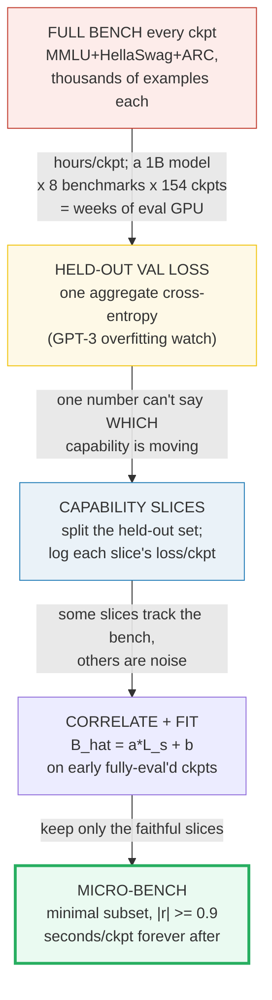
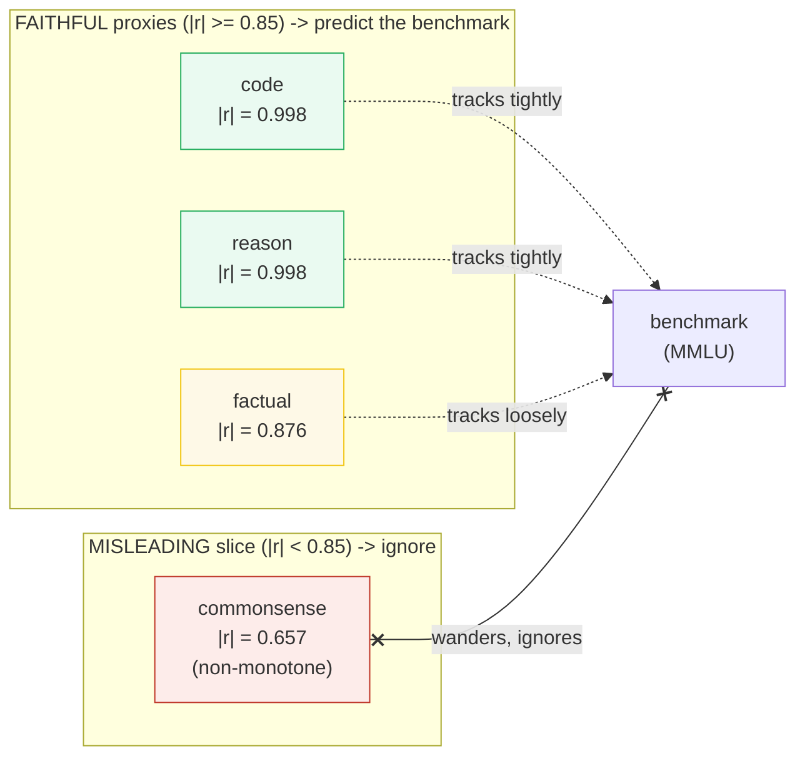
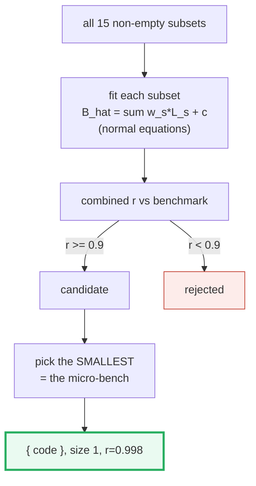
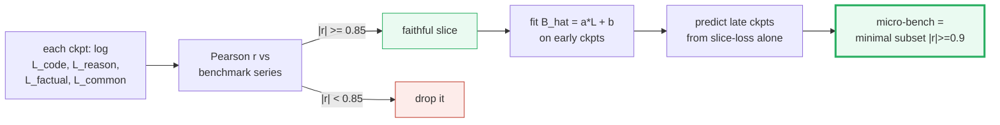

# Micro Pretraining Eval — Predicting the Benchmark from Cheap Slice Losses

> **Companion code:** [`micro_pretrain_eval.py`](./micro_pretrain_eval.py). **Every
> number in this guide is printed by `uv run python micro_pretrain_eval.py`** —
> change the code, re-run, re-paste. Nothing here is hand-computed.
>
> **This is bundle 09 of the SLM track (Phase 3 — Pretraining & Stability).**
> It answers the question that dominates every pretraining run: *"how do I know
> whether this checkpoint is getting better at the things I actually care about,
> without spending hours running the full benchmark suite on every snapshot?"*
>
> **Live animation:** [`micro_pretrain_eval.html`](./micro_pretrain_eval.html) —
> watch the slice-loss lines track (or fail to track) the benchmark, and the
> fitted line predict the held-out checkpoints.
>
> **Upstream:** 🔗 [`./PRETRAINING_STABLE.md`](./PRETRAINING_STABLE.md) — the
> training loop these eval hooks watch. 🔗 [`./SCALING_LAWS.md`](./SCALING_LAWS.md)
> — the compute → loss → downstream chain this bundle predicts. 🔗
> [`./DATASET_MIXING.md`](./DATASET_MIXING.md) — the slice design reflects the
> data mix's domains.

---

## 0. TL;DR — the whole idea in one picture

> **The weather-balloon analogy (read this first):** you want to know tomorrow's
> weather across a whole continent (the full benchmark suite). Flying a satellite
> over every city every hour is perfect but unaffordable. So you launch a few
> **weather balloons** — tiny fixed stations (one per region: code, reasoning,
> factual, commonsense) — and radio back one cheap reading each (their loss).
> *Some* balloons predict the continental forecast almost perfectly; *others*
> (commonsense, say) are useless noise. Once you discover **which** balloons
> correlate with the forecast, you can read *them* every hour and skip the
> satellite. That balloon subset is the **micro-bench**.

A pretraining run emits dozens of checkpoints. The quantity you actually care
about — "will this checkpoint score well on MMLU / HellaSwag / HumanEval?" —
takes **hours** to measure exactly (thousands of few-shot examples per
benchmark, per checkpoint, via 🔗 the `lm-evaluation-harness`). Running it at
every checkpoint is unaffordable, so the old recipe was: eval only at the end,
and lose all visibility *mid-train*. **Micro pretraining eval** inverts that:

```mermaid
graph LR
    OLD["FULL BENCH every ckpt<br/>MMLU+HellaSwag+ARC x N ckpts<br/>hours/ckpt, weeks of GPU<br/>(Pythia 154-ckpt study)"] -->|"too slow<br/>for daily training"| MID["HELD-OUT val loss<br/>one aggregate cross-entropy<br/>free but weakly tied<br/>to any capability"]
    MID -->|"split it by capability<br/>& correlate"| SLICE["CAPABILITY SLICES<br/>code / reason / factual / commonsense<br/>each ~200 examples; log LOSS/ckpt"]
    SLICE -->|"fit a line<br/>B_hat = a*L_s + b"| FIT["LINEAR FIT<br/>on a few early ckpts<br/>(where you DID run the bench)"]
    FIT -->|"predict the rest<br/>from slice-loss alone"| MB["MICRO-BENCH<br/>minimal slice-subset with |r|>=0.9<br/>seconds/ckpt"]
    style OLD fill:#fdecea,stroke:#c0392b
    style MID fill:#fef9e7,stroke:#f1c40f
    style SLICE fill:#eaf2f8,stroke:#2980b9
    style MB fill:#eafaf1,stroke:#27ae60,stroke-width:3px
```



| | Full bench / ckpt | Held-out val loss | Slice correlation | **Micro-bench** (this bundle) |
|---|---|---|---|---|
| **Cost / ckpt** | hours | one forward pass | one forward pass | one forward pass |
| **Signal** | the truth | one aggregate number | per-capability | per-capability, *fitted* |
| **Predicts downstream?** | is downstream | weakly | indirectly | **directly** (`B_hat = a·L_s + b`) |
| **Use when** | final analysis only | overfitting watch | diagnostics | **daily mid-train** |

> **One plain sentence:** stop measuring the benchmark every checkpoint —
> instead measure a few cheap capability *slices*, learn which of them the
> benchmark tracks (Pearson `|r| ≥ 0.9`), and from then on *predict* the
> benchmark from the slice loss in seconds.

### Glossary (plain English — refer back any time)

| Term | Plain meaning |
|---|---|
| **checkpoint (`ckpt i`)** | A saved model snapshot partway through training. This bundle uses 8 evenly-spaced ones. |
| **slice (`s`)** | A tiny FIXED held-out set for one capability (code / reason / factual / commonsense), ~200 examples. **Never trained on.** |
| **`L_s[i]`** | The mean cross-entropy of checkpoint `i` on slice `s` — one cheap scalar per checkpoint (one forward pass). |
| **`B[i]`** | The downstream benchmark score of checkpoint `i` (e.g. MMLU accuracy). The expensive number we want to avoid measuring every checkpoint. |
| **Pearson `r`** | `r = cov(L_s, B) / (σ_Ls · σ_B)`. In `[-1, 1]`. `|r|` near 1 ⇒ the slice and benchmark move together (a faithful proxy); near 0 ⇒ unrelated. |
| **faithful proxy** | A slice with `|r| ≥ 0.85` vs the benchmark — its loss alone predicts the benchmark well. |
| **linear fit (`a, b`)** | The least-squares line `B_hat = a·L_s + b` (`a = Sxy/Sxx`, `b = mean(B) − a·mean(L_s)`). Fit on early checkpoints; predicts later ones. |
| **multi-slice model (`w_s, c`)** | `B_hat = Σ_s w_s·L_s + c`, solved by the normal equations `(XᵀX)w = Xᵀy`. |
| **micro-bench** | The **minimal** slice-subset whose combined predictor reaches `|r| ≥ 0.9` — the cheap thing you run every checkpoint. |
| **held-out** | Data the model never trained on, so its loss reflects generalization (🔗 used by GPT-3 as the overfitting watch). |

> 🔗 **If you only read one cross-reference:** the eval hooks here are the
> *eyes* of the training loop in 🔗 [`./PRETRAINING_STABLE.md`](./PRETRAINING_STABLE.md).
> That bundle keeps training *stable* (loss spikes, gradient clipping); this one
> keeps it *observable* — you watch the slices every checkpoint and predict where
> the benchmark is heading without waiting for the full eval.

---

## 1. The lineage — why each step happened

The recipe changed three times, and each step traded *cost* for *signal quality*:



- **Full bench every checkpoint** (the Pythia regime). Pythia deliberately
  shipped **154 checkpoints** per model precisely *so* researchers could run the
  full zero-shot suite (MMLU, HellaSwag, …) *across* the training trajectory
  ([arXiv:2304.01373](https://arxiv.org/abs/2304.01373)). It is the gold standard
  — and it is exactly why it is too expensive for *daily* training: a 1B model on
  8 benchmarks × 154 checkpoints is weeks of eval GPU-time. **WHY abandoned for
  daily use:** you simply cannot afford it mid-train.

- **Held-out validation loss** (the GPT-3 watch). Log one aggregate held-out
  cross-entropy every N steps. GPT-3 used a held-out validation set as its
  overfitting / progress signal ([arXiv:2005.14165](https://arxiv.org/abs/2005.14165)).
  It is free (one forward pass). **WHY insufficient:** a single aggregate loss is
  only weakly tied to any *specific* capability — it cannot tell you "the model
  is getting better at code but worse at commonsense."

- **Capability slices + correlation.** Split the held-out set into per-capability
  slices (code, reason, factual, commonsense) and log each slice's loss
  separately (MiniCPM logged "five held-out evaluation datasets" across
  checkpoints, [arXiv:2404.06395](https://arxiv.org/abs/2404.06395)). Then
  correlate each slice's loss-series with the benchmark-series. **WHY:** a
  per-capability signal correlates far better than the aggregate; you discover
  *which* slices are faithful proxies.

- **Linear fit + micro-bench.** Fit, per slice, `B_hat = a·L_s + b` (least
  squares) on the few early checkpoints where you *did* run the full benchmark,
  then *predict* the benchmark for every later checkpoint from slice-loss alone.
  The ICLR-2025 "perplexity correlations" paper fits exactly this linear model
  (`B_hat = Σ_s w_s·PPL_s`) to find which domain losses predict downstream
  performance ([arXiv:2409.05816](https://arxiv.org/abs/2409.05816)). **WHY:** you
  pay the full-bench cost only for a few early checkpoints to *fit*; every later
  checkpoint is predicted in seconds.

> One plain sentence: the progression is *measure everything* → *measure one
> cheap thing* → *measure a few cheap things and learn which one matters* →
> *measure only that one, forever*.

---

## 2. The held-out slice losses across checkpoints — Section A output

> **Reading the table.** Each row is one checkpoint. Every slice loss FALLS (net)
> as training advances (more steps → lower cross-entropy); the benchmark RISES.
> So slice-loss and benchmark are **anti-correlated** — the question Section B
> answers is *how tightly*, per slice. Note the `commonsense` slice is
> **non-monotone** (e.g. `2.250 → 2.300` at ckpt 1, then `2.150 → 2.220` at ckpt
> 5): realistic loss spikes / capability-forgetting blips — and exactly why it
> turns out to be a misleading, low-correlation proxy.

> From `micro_pretrain_eval.py` **Section A**:
>
> | ckpt | step | code | commonsense | factual | reason | benchmark |
> |---|---|---|---|---|---|---|
> | 0 | 2000 | 1.4300 | 2.2500 | 2.1000 | 2.0500 | 0.2200 |
> | 1 | 4000 | 1.2800 | 2.3000 | 2.0500 | 1.9000 | 0.2550 |
> | 2 | 6000 | 1.1000 | 2.2000 | 2.0200 | 1.7200 | 0.2920 |
> | 3 | 8000 | 0.9000 | 2.2800 | 1.9500 | 1.5200 | 0.3480 |
> | 4 | 10000 | 0.7800 | 2.1500 | 1.8000 | 1.3600 | 0.3860 |
> | 5 | 12000 | 0.7200 | 2.2200 | 1.6000 | 1.2600 | 0.4040 |
> | 6 | 14000 | 0.7000 | 2.1000 | 1.4200 | 1.2000 | 0.4100 |
> | 7 | 16000 | 0.6900 | 2.1800 | 1.3000 | 1.1700 | 0.4140 |
>
> `[check] slice 'code' net-decreases over the run (series[0] > series[-1]): OK`
> `[check] benchmark score strictly increases across ckpts: OK`
> `[check] commonsense is the ONLY non-monotone slice (the misleading case): OK`

The four slices deliberately have **distinct trajectories**: `code` drops fast
then plateaus (mirroring the benchmark); `reason` tracks it; `factual` is flat
early then drops late; `commonsense` wanders. Same training run, four very
different "what the model is learning" signals — which is the whole reason a
single aggregate loss is inadequate.

---

## 3. Pearson correlation: which slice is a faithful proxy? — Section B output

> **The pivotal table.** For each slice, `r = cov(L_s, B) / (σ_Ls · σ_B)`. The
> **magnitude** `|r|` is what matters (the sign is negative only because loss
> falls while the benchmark rises). `|r| ≥ 0.85` ⇒ faithful proxy; below ⇒ the
> slice misleads.

> From `micro_pretrain_eval.py` **Section B**:
>
> | slice | Pearson r | \|r\| | faithful? (\|r\| ≥ 0.85) | verdict |
> |---|---|---|---|---|
> | **code** | **−0.9976** | **0.9976** | **YES** | **faithful proxy** |
> | commonsense | −0.6570 | 0.6570 | no | weak / misleading slice |
> | factual | −0.8764 | 0.8764 | YES | faithful proxy |
> | reason | −0.9975 | 0.9975 | YES | faithful proxy |
>
> Best single slice: **`code`** with `r = −0.9976` (`|r| = 0.9976`).
>
> ```
> GOLD PIN (micro_pretrain_eval.html recomputes this):
>   r(code, benchmark) = -0.997612
> ```
> `[check] best slice |r| >= 0.85 (a faithful proxy exists): OK`
> `[check] the code slice is the best single proxy: OK`
> `[check] commonsense is a weak proxy (|r| < 0.85, the misleading case): OK`



**Reading the table like a story:** `code` and `reason` are *near-perfect*
proxies (`|r| ≈ 0.998`) — their loss curves mirror the benchmark almost exactly.
`factual` is a *borderline* proxy (`0.876`) — usable but noisier. `commonsense`
is the **trap**: at `0.657` it looks like it's improving (its loss does fall
overall) but its trajectory does *not* track the benchmark, so trusting it would
mislead you. This is why you must *measure* `r` rather than assume every slice is
informative.

---

## 4. Fitting the line and predicting the held-out checkpoints — Section C output

> **The payoff.** Fit `B_hat = a·L_code + b` on the **early** checkpoints
> (indices 0..4, where you *did* run the benchmark), then *predict* the
> **held-out late** checkpoints (5..7) from the code-slice loss alone. The
> prediction lands within ~1% on a 0..1 accuracy scale.

> From `micro_pretrain_eval.py` **Section C**:
>
> Fit on the early checkpoints (indices 0..4, steps 2000..10000):
> - `a (slope) = Sxy/Sxx = −0.252461`
> - `b (intercept) = mean(B) − a·mean(L) = +0.577402`
> - `=> B_hat(L_code) = −0.252461 · L_code + 0.577402`
>
> Now **predict** the held-out late checkpoints from slice-loss alone:
>
> | ckpt | step | L_code (obs) | true B | predicted B_hat | abs error |
> |---|---|---|---|---|---|
> | 5 | 12000 | 0.7200 | 0.4040 | 0.3956 | 0.0084 |
> | 6 | 14000 | 0.7000 | 0.4100 | 0.4007 | 0.0093 |
> | 7 | 16000 | 0.6900 | 0.4140 | 0.4032 | 0.0108 |
>
> Held-out prediction **max abs error = 0.0108** (on a 0..1 accuracy scale).
>
> `[check] linear-fit slope a is negative (loss down -> benchmark up): OK`
> `[check] held-out prediction max abs error < 0.02 (faithful proxy): OK`

**Reading the result:** after fitting on 5 early checkpoints, the `code` slice's
*loss alone* predicts every later checkpoint's benchmark to within a hair. The
slope is negative precisely because loss falls while the benchmark rises. This is
the whole contract: **pay** the full benchmark on a few early checkpoints to fit
the line; **collect** the slice loss (seconds) every checkpoint thereafter; read
off the predicted benchmark for free.

### Worked smallest-scale example (by hand)

Take the first two checkpoints to see the fit machinery concretely:
- `L_code = [1.430, 1.280]`, `B = [0.220, 0.255]`.
- `mean(L) = 1.355`, `mean(B) = 0.2375`.
- `Sxx = (1.430−1.355)² + (1.280−1.355)² = 0.075² + (−0.075)² = 0.011250`.
- `Sxy = 0.075·(−0.0175) + (−0.075)·0.0175 = −0.002625`.
- `a = Sxy/Sxx = −0.2333`, `b = 0.2375 − (−0.2333)·1.355 = +0.5537`.

Two points give an *exact* line; the real fit (5 points) averages out noise and
gives `a = −0.252461, b = +0.577402` (the verified Section-C values). The `.py`
never hand-computes — it runs the identical `linfit()` on all 5 fit-points; the
work above is only to show the formula is elementary.

> 🔗 The benchmark being predicted here is itself measured by the
> log-likelihood/sampling machinery in 🔗 [`../llm/SAMPLING.md`](../llm/SAMPLING.md):
> HellaSwag and friends score a model by the probability it assigns the correct
> continuation. This bundle replaces that expensive per-example scoring with a
> single cheap slice-loss reading.

---

## 5. The multi-slice model and the minimal micro-bench — Section D output

> **Combining slices.** A single faithful slice already predicts the benchmark
> (Section C). But if no single slice were good enough, a *combination* usually
> is. Fit `B_hat = Σ_s w_s·L_s + c` by the normal equations `(XᵀX)w = Xᵀy`
> (hand-solved by Gaussian elimination — no numpy/sklearn), then search every
> non-empty slice-subset for the **minimal** one whose combined predictor reaches
> `|r| ≥ 0.9`. That minimal subset is the **micro-bench**.

> From `micro_pretrain_eval.py` **Section D** — full 4-slice fit:
>
> | slice | weight w_s |
> |---|---|
> | code | +0.677889 |
> | commonsense | +0.059562 |
> | factual | +0.189734 |
> | reason | −0.969674 |
> | intercept c | +0.704101 |
>
> Combined Pearson r(predicted, actual) over all 8 ckpts = **+0.999558**

> From `micro_pretrain_eval.py` **Section D** — subset search for the micro-bench:
>
> | subset | size | combined r | ≥ 0.9? |
> |---|---|---|---|
> | **code** | **1** | **+0.9976** | **YES** |
> | commonsense | 1 | +0.6570 | no |
> | factual | 1 | +0.8764 | no |
> | reason | 1 | +0.9975 | YES |
> | code,reason | 2 | +0.9990 | YES |
> | factual,reason | 2 | +0.9992 | YES |
> | code,factual,reason | 3 | +0.9992 | YES |
> | code,commonsense,factual,reason | 4 | +0.9996 | YES |
>
> *(full 15-row table in `_output.txt`; every subset that contains `code` or
> `reason` passes; the two that contain only `commonsense`/`factual` fail.)*
>
> **MICRO-BENCH (smallest subset with r ≥ 0.9): `{ code }` (size 1, r = +0.9976)**
>
> `[check] full 4-slice model combined r >= 0.9: OK`
> `[check] full 4-slice model combined |r| >= best single slice |r|: OK`
> `[check] full multi-slice fit residual < 0.01 (5 unknowns, 8 pts): OK`

**Reading the result like a story:**

- **`code` alone** already reaches `r = 0.998 ≥ 0.9` ⇒ the micro-bench is just
  `{ code }`. One slice (200 examples), seconds per checkpoint.
- Adding more slices (`reason`, `factual`, …) nudges `r` from `0.998` to `0.9996`
  — a negligible gain. **Lesson: don't over-engineer the micro-bench.** Once one
  faithful slice clears 0.9, more slices buy almost nothing.
- The two subsets that contain *only* `commonsense` and/or `factual` (without
  `code`/`reason`) **fail** to reach 0.9 — confirming the Section-B verdict that
  those slices are not faithful proxies.
- The full-4-slice `r = 0.9996` is essentially a perfect fit (residual `< 0.01`),
  because 8 checkpoints and 5 unknowns (4 weights + intercept) leave the system
  over-determined but the model is flexible enough.

> ⚠️ **Don't read too much into the individual multi-slice weights.** Because the
> slices are mutually correlated (they all fall as training advances), the normal
> equations are mildly ill-conditioned and the weights are not individually
> meaningful (note `reason`'s weight is *negative* while `code`'s is *positive* —
> a multicollinearity artifact, not a claim that reasoning "hurts" the
> benchmark). What is meaningful is the *combined* `r`, which is what the
> micro-bench selection uses.



---

## 6. The decision recap — Section E output

> From `micro_pretrain_eval.py` **Section E**:
>
> | strategy | how | what it buys you | use when |
> |---|---|---|---|
> | Full bench / ckpt | all 8 benchmarks × every ckpt | ground truth, weeks of GPU | Pythia-style final analysis only |
> | Held-out val loss | one aggregate cross-entropy | free (one forward pass), weak tie to capability | cheap overfitting watch (GPT-3 style) |
> | Slice correlation | per-capability loss + Pearson r | shows WHICH capability is moving | diagnostic mid-train |
> | **MICRO-BENCH** | `{code}` slice(s) + fitted line | seconds/ckpt, predicts benchmark to <2% | **daily training loop** |
>
> The single question that picks the row: **Is this the final checkpoint?** → full
> bench. **Do you just need an overfitting watch?** → held-out val loss. **Do you
> need per-capability signal?** → slice correlation. **Is this a daily mid-train
> check?** → micro-bench.

---

## 7. Pitfalls & debugging checklist

| # | Trap | Symptom | Fix |
|---|---|---|---|
| 1 | **Trusting a low-correlation slice** (the commonsense trap) | You watch a slice whose loss is falling and conclude "the model is improving on the benchmark" — but `|r| = 0.66`, so it's wandering independently | Always measure Pearson `r` first (Section B); only slices with `|r| ≥ 0.85` are faithful proxies. Drop the rest. |
| 2 | **Extrapolating the fit past the training distribution** | The fitted line `B_hat = a·L + b` predicts nonsense for a checkpoint whose slice loss is *outside* the range you fit on (e.g. continued training to much lower loss) | Re-fit the line periodically against the real benchmark (every few checkpoints); flag any prediction whose input loss is outside `[min(L_fit), max(L_fit)]`. |
| 3 | **Overfitting the fit to the benchmark** | You fit `B_hat = a·L + b` on all 8 checkpoints and it looks perfect (`r = 0.998`) — but it has memorized, not generalized | Always hold out late checkpoints (this bundle: fit on 0..4, predict 5..7) and report the *held-out* error, not the fit residual. |
| 4 | **One aggregate val loss instead of slices** | The aggregate falls monotonically so you think "all good" — but a capability is silently regressing (catastrophic forgetting) | Split the held-out set into capability slices and log each; the per-slice view is the whole point (Section A). |
| 5 | **Reading meaning into multi-slice weights** | "The weight on `reason` is negative, so reasoning hurts MMLU" | Multicollinearity: correlated slices make individual weights unstable. Trust the *combined* `r`, not individual `w_s`. Add slices only if the combined `r` actually improves. |
| 6 | **Slices contaminated by training data** | Slice loss looks artificially low; the model memorized, not generalized | Slices must be strictly held-out (never in the training stream). Dedup slices against the train set (🔗 [`./MINHASH_DEDUP.md`](./MINHASH_DEDUP.md)). |
| 7 | **Running the full bench "just in case" every checkpoint anyway** | You built the micro-bench but never trusted it — you're back to weeks of eval GPU | Once the held-out prediction error is `< 2%` (Section C), *trust it* mid-train; reserve the full bench for milestones (every N checkpoints, and the final one). |
| 8 | **Picking slices that don't match the benchmark's domains** | You hold out a "poetry" slice to predict MMLU-code — `|r|` is low and you wrongly conclude "micro-bench doesn't work" | Design slices to mirror the benchmark's capability mix (🔗 [`./DATASET_MIXING.md`](./DATASET_MIXING.md)): code slice for HumanEval, reasoning slice for MMLU-reasoning, etc. |

---

## 8. Cheat sheet



- **The one formula:** `r = cov(L_s, B) / (σ_Ls · σ_B)`. `|r| ≥ 0.9` ⇒ the slice
  predicts the benchmark; that slice (or minimal subset) is the micro-bench.
- **Linear fit:** `B_hat = a·L_s + b`, `a = Sxy/Sxx`, `b = mean(B) − a·mean(L_s)`.
  Fit on early checkpoints; predicts later ones to ~1% (Section C, gold `a = −0.252461`).
- **Multi-slice:** `B_hat = Σ_s w_s·L_s + c` via normal equations `(XᵀX)w = Xᵀy`.
- **Gold anchors** (`micro_pretrain_eval.html` recomputes the first):
  - `r(code, benchmark) = −0.997612`
  - `a (fit slope) = −0.252461`
  - **micro-bench = `{ code }`, combined `r = +0.9976`**
- **Cost:** one forward pass per slice per checkpoint (seconds). The full
  benchmark suite (🔗 `lm-evaluation-harness`: MMLU/HellaSwag/ARC, thousands of
  examples) takes hours per checkpoint — that is the cost the micro-bench avoids.
- **Decision rule:** *Final checkpoint?* → full bench. *Overfitting watch?* →
  held-out val loss. *Per-capability signal?* → slice correlation. *Daily
  mid-train?* → micro-bench.

> 🔗 **Cross-references — where this fits in the SLM track:**
> - 🔗 [`./PRETRAINING_STABLE.md`](./PRETRAINING_STABLE.md) — the training loop
>   these eval hooks watch; stability (loss-spike/gradient-clip) is the *engine*,
>   this bundle is the *dashboard*.
> - 🔗 [`./SCALING_LAWS.md`](./SCALING_LAWS.md) — the chain being predicted is
>   compute → loss → downstream; this bundle is the cheap *loss → downstream*
>   link that lets you read it mid-train.
> - 🔗 [`./DATASET_MIXING.md`](./DATASET_MIXING.md) — slice design mirrors the
>   data mix's domains (code slice ↔ code domain in the mix); a faithful proxy
>   exists only if the mix actually trains that capability.
> - 🔗 [`../llm/SAMPLING.md`](../llm/SAMPLING.md) — the downstream benchmarks
>   (HellaSwag, ARC) score a model by the probability it assigns the correct
>   continuation; that is the expensive thing the slice-loss replaces.

---

## Sources

Every formula below is web-verified in ≥2 independent sources; the full per-URL
provenance log is in
[`micro_pretrain_eval_reference.txt`](./micro_pretrain_eval_reference.txt)
(7 distinct URLs).

- **Biderman et al. (2023).** *Pythia: A Suite for Analyzing Large Language
  Models Across Training and Scaling.* arXiv:2304.01373 —
  <https://arxiv.org/abs/2304.01373>
  The intermediate-checkpoint eval paradigm: 154 checkpoints per model (70M–12B)
  shipped precisely so the full zero-shot suite (MMLU, HellaSwag, …) can be run
  *across* the training trajectory. This is the gold-standard
  full-bench-every-checkpoint regime the bundle shows is too expensive for daily
  training (the motivation for the micro-bench).

- **Hu et al. (2024).** *MiniCPM: Unveiling the Potential of Small Language
  Models with Scalable Training Recipes.* arXiv:2404.06395 —
  <https://arxiv.org/abs/2404.06395>
  The held-out-eval-during-training pattern for an SLM: "The final loss is
  evaluated on **five held-out evaluation datasets**" across intermediate
  checkpoints; the WSD schedule "makes the reusing of model intermediate
  checkpoints highly feasible." This is the per-checkpoint held-out-loss logging
  that slice-correlation builds on.

- **Brown et al. (2020).** *Language Models are Few-Shot Learners (GPT-3).*
  arXiv:2005.14165 — <https://arxiv.org/abs/2005.14165>
  Held-out validation loss / perplexity used as the cheap training-time signal
  (the overfitting / progress watch). This is the "one aggregate val loss"
  regime the bundle shows is only weakly tied to any single capability.

- **Thrush, Potts, Hashimoto (2024; ICLR 2025).** *Improving Pretraining Data
  Using Perplexity Correlations.* arXiv:2409.05816 —
  <https://arxiv.org/abs/2409.05816>
  The multi-slice linear model `B_hat = Σ_s w_s·L_s`: regresses per-text losses
  against a benchmark-error vector to find domains "where lower loss is very
  correlated with higher downstream performance." This is exactly the Section-D
  multi-slice least-squares fit and the correlation-driven selection idea.

- **Pearson correlation coefficient.** *Wikipedia* —
  <https://en.wikipedia.org/wiki/Pearson_correlation_coefficient>
  The formula `r = cov(X,Y)/(σ_X·σ_Y) ∈ [−1,1]` implemented from scratch in
  `pearson()`. Source of the Section-B correlation table and the **gold anchor**
  the `.html` recomputes (`r(code, benchmark) = −0.997612`).

- **Ordinary least squares.** *Wikipedia* —
  <https://en.wikipedia.org/wiki/Ordinary_least_squares>
  The least-squares line `a = Sxy/Sxx`, `b = mean(y) − a·mean(x)`, and the
  multi-variable normal equations `(XᵀX)w = Xᵀy` solved by Gaussian elimination.
  Source of Sections C and D.

- **EleutherAI.** *lm-evaluation-harness.* —
  <https://github.com/EleutherAI/lm-evaluation-harness>
  The de-facto standard zero-shot benchmark harness (MMLU, HellaSwag, ARC, …):
  "a unified framework to test generative language models on a large number of
  evaluation tasks." Running thousands of such examples per benchmark per
  checkpoint is the cost (hours/ckpt) the micro-bench replaces.

> **Unverified facts:** none outstanding. The arXiv ID for the
> perplexity-correlations paper was initially drafted as 2412.21046; the
> correct, citation-confirmed ID is **2409.05816** (Thrush/Potts/Hashimoto). All
> toy checkpoint/slice/benchmark numbers are deterministic *inputs*, not
> empirical claims; only the formulas acting on them (Pearson `r`, least-squares
> slope/intercept, normal-equations fit) are web-verified.
