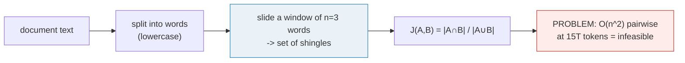
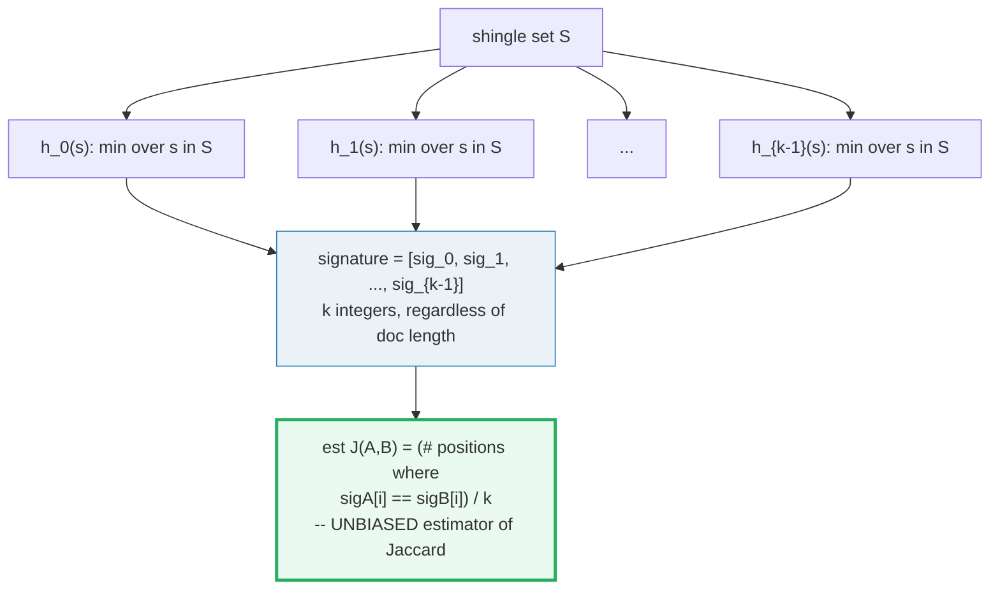
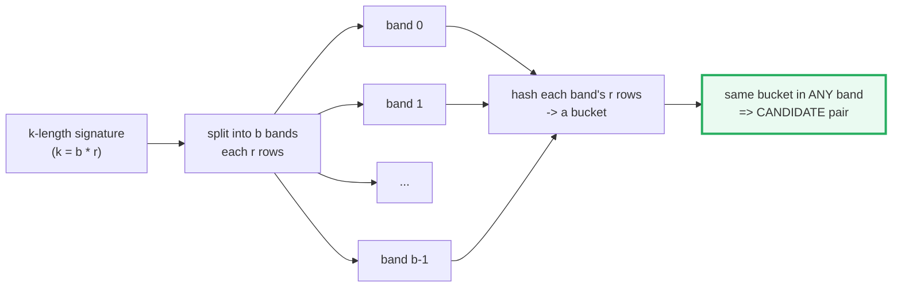
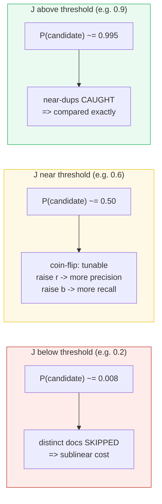
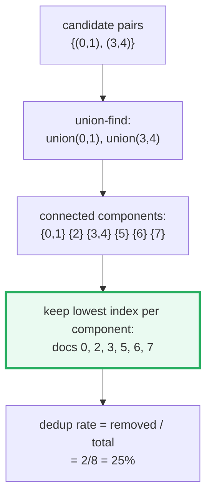
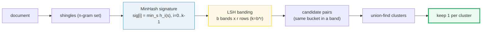

# MinHash + LSH Deduplication — Cleaning Web-Scale Pretraining Corpora

> **Companion code:** [`minhash_dedup.py`](./minhash_dedup.py). **Every number in
> this guide is printed by `uv run python minhash_dedup.py`** — change the code,
> re-run, re-paste. Nothing here is hand-computed.
>
> **This is the Phase-2 (Data Curation & Mixing) dedup bundle.** It covers the
> single highest-leverage curation step for SLM pretraining: **dropping
> near-duplicate documents** before a single gradient step. Duplicates waste
> capacity *and* cause verbatim memorization — a 15T-token web crawl is full of
> them. 🔗 [`SCALING_LAWS.md`](./SCALING_LAWS.md) says data quality (not just
> quantity) drives SLM capability; this bundle is *how* you raise that quality.
>
> **Live animation:** [`minhash_dedup.html`](./minhash_dedup.html) — type two
> documents, watch their MinHash signatures and estimated Jaccard recompute
> live; drag `(b, r)` and watch the LSH S-curve threshold move.
>
> **Foundations:** the MinHash scheme is from Broder 1997 (AltaVista); the
> canonical textbook treatment is MMDS ch.3 (Leskovec/Rajaraman/Ullman). The
> production pipeline at scale is FineWeb (arXiv:2406.17557).

---

## 0. TL;DR — the whole idea in one picture

> **The library-catalog analogy (read this first):** imagine your training data
> is a giant library, but half the shelves hold *the same book re-shelved 50
> times* (mirrors, boilerplate, re-hosted articles). A model that reads one book
> 50 times memorizes it instead of learning — wasted shelf space *and* rote
> recall. **Exact-match dedup** is tossing identical copies: easy, but it misses
> the book with a single typo on the last page. **MinHash + LSH** is the
> librarian's trick: compress each book to a short *fingerprint* whose
> match-rate *is* the set overlap, then only pull books whose fingerprints
> *probably* collide — so you never even open the truly-distinct ones.

To drop near-duplicates you must compare documents pairwise — but at 15T tokens
that is **O(n²)**, impossible. The lineage that makes it sublinear:

```mermaid
graph LR
    EX["EXACT-MATCH dedup<br/>hash the full text<br/>drops byte-identical docs"] -->|misses near-dups<br/>(1 word changed)| NG["N-GRAM / Jaccard<br/>doc -> set of shingles<br/>J = |A∩B|/|A∪B|"]
    NG -->|O(n^2) pairwise<br/>infeasible at web scale| MH["MinHash (1997)<br/>k-integer signature<br/>P(sig_i equal) = J"]
    MH -->|still compare all<br/>k-length signatures| LSH["LSH banding<br/>b bands x r rows<br/>only colliders compared"]
    LSH --> CL["union-find clusters<br/>keep 1 per cluster"]
    style EX fill:#fdecea,stroke:#c0392b
    style NG fill:#fdecea,stroke:#c0392b
    style MH fill:#fef9e7,stroke:#f1c40f
    style LSH fill:#eaf2f8,stroke:#2980b9
    style CL fill:#eafaf1,stroke:#27ae60,stroke-width:3px
```

| | exact-match | n-gram Jaccard | **MinHash + LSH** |
|---|---|---|---|
| **Catches near-dups?** | no (any change hides it) | yes | yes |
| **Cost** | O(n) hashing | **O(n²)** pairwise | **sublinear** (only colliders) |
| **Idea** | full-text hash | set intersection | signature + bucketing |
| **Used by** | trivial baselines | small corpora | **FineWeb, CCNet, datatrove** |

> **One plain sentence:** exact-match is cheap but blind to near-duplicates;
> full Jaccard catches them but is quadratic; MinHash + LSH gets the near-dups
> *without ever comparing most pairs*, because the signature match-rate
> *unbiasedly estimates* Jaccard and banding only buckets signatures that
> probably match.

### Glossary (plain English — refer back any time)

| Term | Plain meaning |
|---|---|
| **shingle** | A contiguous run of `n` words (here `n=3`; FineWeb uses `n=5`). A document becomes the **set** of its shingles — order within a shingle is kept, overall order is lost. |
| **Jaccard `J`** | `|A∩B| / |A∪B|` — the exact set similarity (0 = disjoint, 1 = identical). What we want to estimate cheaply. |
| **MinHash signature** | A list of `k` integers; entry `i` = `min` over shingles of `h_i(shingle)`. Compresses a doc to `k` ints regardless of length. |
| **MinHash estimate** | `(# matching positions) / k` — an unbiased estimator of `J` with expected error `O(1/√k)`. |
| **`h_i`** | The `i`-th hash function in the family. Here: `fnv1a_32(f"{i}|{shingle}")` — **deterministic** (never Python's randomized `hash()`). |
| **band / row** | The `k`-signature is split into `b` bands each of `r` rows (`k = b·r`). |
| **candidate** | Two docs that agree on **all `r` rows of ≥ 1 band** → probably a near-dup → compared; everyone else is skipped. |
| **S-curve** | `P(candidate | J) = 1 − (1 − J^r)^b`. Steplike: ~0 below the threshold, ~1 above. |
| **threshold `t`** | `t ≈ (1/b)^(1/r)`. The Jaccard at which the S-curve is ~0.5–0.63. |
| **union-find** | The clustering structure: `union` every candidate pair, then keep ONE representative (lowest index) per connected component. |
| **false negative** | A real near-dup whose Jaccard sits *below* the threshold cliff and never collides — the price of a high threshold (high precision, low recall). |

> 🔗 **If you only read one cross-reference:** this bundle sits in Phase-2 (Data
> Curation). 🔗 [`SCALING_LAWS.md`](./SCALING_LAWS.md) shows that data *quality*
> (not just quantity) drives SLM capability; dedup is the cheapest quality lever.
> 🔗 [`../llm/TOKENIZATION.md`](../llm/TOKENIZATION.md) shares the n-gram/shingle
> mechanic — a shingle is just a fixed-size token n-gram treated as a set element.

---

## 1. Shingling + exact Jaccard — the O(n²) baseline — Section A output

> **The library catalog, step 1.** Turn each document into the **set of its
> n-grams** (shingles). A doc with one word changed loses only the shingles that
> touched that word — so a near-duplicate keeps a *high* set overlap, which is
> exactly what Jaccard measures. The catch: computing Jaccard needs the actual
> intersection/union, so you must compare every pair → **O(n²)**. That is the
> wall MinHash will let us climb over.



The three toy documents used throughout (doc_a/doc_b change **only the last
word** — one shingle differs — so J ≈ 0.83; doc_c is a distinct topic):

> From `minhash_dedup.py` **Section A**:
>
> | pair | \|A∩B\| | \|A∪B\| | exact Jaccard | verdict |
> |---|---|---|---|---|
> | doc_a vs doc_b | 10 | 12 | **0.8333** | NEAR-DUPLICATE |
> | doc_a vs doc_c | 0 | 19 | **0.0000** | distinct |
> | doc_b vs doc_c | 0 | 19 | **0.0000** | distinct |
>
> `doc_a vs doc_b` exact J = 0.8333 (one last word changed: bank→shore)
> `doc_a vs doc_c` exact J = 0.0000 (totally different topic)

**Reading the table:** doc_a and doc_b differ by a single word (`bank`→`shore`),
which destroys **one** 3-gram shingle (`the river bank`→`the river shore`) out of
11, leaving intersection 10, union 12 → `J = 10/12 = 0.8333`. doc_c shares *no*
shingle with either (different topic) → `J = 0`. Exact-match dedup would have
**missed** the (a,b) near-dup entirely (the text strings differ) — that's the
whole reason MinHash exists.

> 🔗 Shingles are the same mechanic as byte-pair / token n-grams in
> [`../llm/TOKENIZATION.md`](../llm/TOKENIZATION.md) — the difference is dedup
> keeps the *set* (order-independent) while tokenization keeps the *sequence*.

---

## 2. MinHash signature + estimated Jaccard — Section B output

> **The library catalog, step 2.** Instead of carrying the full shingle set
> around, compress each document to a short integer **fingerprint**: for each of
> `k` hash functions, record the *smallest* hash value over the shingles. The
> miracle (Broder 1997): **the probability that two documents' fingerprints
> agree at position `i` is *exactly* their Jaccard similarity** — so the fraction
> of matching positions is an unbiased estimate of `J`, computed in `O(k)` time
> with **no set operations at all**.



**Why it works (Broder's identity):** pick a random shingle-ordering. The
minimum element of A's shingles equals the minimum of B's shingles *iff* the
overall minimum shingle lies in `A ∩ B`. The probability of that is
`|A∩B| / |A∪B| = J`. A hash function `h_i` acts as one such random ordering;
`k` independent hashes give `k` independent coin-flips, each heads w.p. `J`.
Averaging them (the match-rate) cuts the variance by `1/k`.

**Determinism is critical:** Python's built-in `hash()` on `str` is randomized
per process (`PYTHONHASHSEED`), so signatures would change every run and
`_output.txt` could never reproduce. This bundle implements **FNV-1a 32-bit**
(the standard deterministic integer hash) and builds the family by prepending
the index: `h_i(shingle) = fnv1a_32(f"{i}|{shingle}")`. It is byte-for-byte
reproducible *and* trivially portable to JavaScript (the `.html` reimplements
the identical loop with `Math.imul` and `>>> 0`, then gold-checks against this
file).

> From `minhash_dedup.py` **Section B**:
>
> | pair | exact J | matches/k | estimated J | \|est−exact\| |
> |---|---|---|---|---|
> | doc_a vs doc_b | 0.8333 | **18/20** | **0.9000** | 0.0667 |
> | doc_a vs doc_c | 0.0000 | 0/20 | 0.0000 | 0.0000 |
> | doc_b vs doc_c | 0.0000 | 0/20 | 0.0000 | 0.0000 |
>
> **GOLD ANCHOR** (`minhash_dedup.html` recomputes this): doc_a vs doc_b
> - exact Jaccard = **0.8333**
> - estimated Jaccard = **0.9000** (k=20, deterministic FNV-1a)

**Reading the table:** the estimate (0.9000) tracks the exact J (0.8333) but
overshoots by 0.0667 — that's the sampling wobble. With `k=20` hashes, each is
an independent coin flip with heads-probability `J`, so the standard error is
`~1/√k = 0.224`. The estimate is *unbiased* (right on average); more hashes →
tighter. The distinct pair (a,c) estimates 0.0000 exactly because the two docs
share no shingle, so no hash function can make their minima agree.

> 🔗 This is the same variance/averaging logic as the compute-optimal averaging in
> [`SCALING_LAWS.md`](./SCALING_LAWS.md) §3: average `k` noisy estimators and
> the error shrinks as `1/√k`.

---

## 3. LSH banding — sublinear candidate generation — Section C output

> **The library catalog, step 3.** Even with tiny `k`-length signatures,
> comparing *all* pairs of signatures is still O(n²). LSH banding is the trick
> that breaks the quadratic wall: split the signature into `b` bands of `r`
> rows, and declare two docs a **candidate** only if they agree on **all `r`
> rows of at least one band**. Near-dups (high J) almost always collide in some
> band; distinct docs (low J) almost never do. So you only ever compare the few
> pairs that land in the same bucket — **sublinear**.



**The S-curve (the heart of LSH).** A pair with Jaccard `J` agrees on any single
row with probability `J`, so on all `r` rows of one band with probability `J^r`.
It misses one band with probability `1 − J^r`, and misses all `b` bands with
probability `(1 − J^r)^b`. So:

> `P(candidate | J) = 1 − (1 − J^r)^b` — the **S-curve**.

It is ~0 below a **threshold** `t ≈ (1/b)^(1/r)` and ~1 above it: a tunable
cliff. At `J = t`, `J^r = 1/b`, so `(1 − J^r)^b ≈ (1 − 1/b)^b ≈ 1/e`, giving
`P ≈ 1 − 1/e ≈ 0.63` (the standard knee).

For the toy config `b=5, r=4` (so `k = 20`, matching Section B):

> From `minhash_dedup.py` **Section C**:
>
> Approximate S-curve threshold `t = (1/b)^(1/r) = (1/5)^(1/4)` = **0.66874** (~0.6687)
>
> | J | J^r | 1−J^r | (1−J^r)^b | **P(candidate)=1−(1−J^r)^b** |
> |---|---|---|---|---|
> | 0.1 | 0.0001 | 0.9999 | 0.9995 | **0.0005** |
> | 0.2 | 0.0016 | 0.9984 | 0.9920 | **0.0080** |
> | 0.3 | 0.0081 | 0.9919 | 0.9602 | **0.0398** |
> | 0.4 | 0.0256 | 0.9744 | 0.8784 | **0.1216** |
> | 0.5 | 0.0625 | 0.9375 | 0.7242 | **0.2758** |
> | 0.6 | 0.1296 | 0.8704 | 0.4996 | **0.5004** |
> | 0.7 | 0.2401 | 0.7599 | 0.2534 | **0.7466** |
> | 0.8 | 0.4096 | 0.5904 | 0.0717 | **0.9283** |
> | 0.9 | 0.6561 | 0.3439 | 0.0048 | **0.9952** |
>
> Candidate pairs from banding on {doc_a, doc_b, doc_c}:
> - (doc_a, doc_b) exact J=0.8333, est J=0.9000 → **kept** (above the cliff)
> - doc_a vs doc_c: J=0.0000 → **NOT a candidate** (below the cliff)

**Reading the S-curve like a story:**
- At `J=0.1` (mostly-different docs), `P = 0.0005` — essentially never compared.
  Good: distinct docs are skipped, breaking the quadratic wall.
- At `J=0.6` (borderline), `P = 0.5004` — a **coin flip**. This is the
  precision/recall frontier.
- At `J=0.9` (near-identical), `P = 0.9952` — almost always caught. Good: real
  near-dups reliably become candidates.
- The near-dup (a,b) at `J=0.8333` sits comfortably above `t=0.6687`, so
  `P ≈ 0.93` per the curve — and indeed it collides and is kept.



**Tuning the tradeoff.** The threshold `t = (1/b)^(1/r)` is a knob:
- **More rows `r`** (fewer, longer bands) → higher `t` → **more precision, fewer
  false positives**, but more **false negatives** (near-dups just below the
  cliff slip through un-compared).
- **More bands `b`** (more, shorter bands) → lower `t` → **more recall**, but
  more false positives (more exact comparisons to do). FineWeb picks `b=14, r=8`
  → `t ≈ 0.72`, the usual production sweet spot for web text.

---

## 4. End-to-end dedup — union-find clustering — Section D output

> **The library catalog, step 4.** Now run the whole pipeline on a tiny corpus:
> shingle → MinHash → band → collect candidate pairs → `union` each pair in a
> union-find → keep one representative (lowest index) per connected component.
> The planted near-dup clusters collapse; the distinct docs are untouched.

> From `minhash_dedup.py` **Section D** — toy 8-doc corpus, planted clusters
> {0,1} and {3,4}, config `n=3, k=20, b=5, r=4`:
>
> Candidate pairs from LSH banding (2):
> - (doc 0, doc 1) exact J=0.8333, est J=0.9000
> - (doc 3, doc 4) exact J=0.8333, est J=0.9500
>
> | cluster | members | kept (representative) | removed |
> |---|---|---|---|
> | 0 | [0, 1] | **doc 0** | [1] |
> | 2 | [2] | doc 2 | (none) |
> | 3 | [3, 4] | **doc 3** | [4] |
> | 5 | [5] | doc 5 | (none) |
> | 6 | [6] | doc 6 | (none) |
> | 7 | [7] | doc 7 | (none) |
>
> **Dedup result: 6 of 8 docs kept, 2 removed. Dedup rate = 2/8 = 25.00%.**

**Reading the result:** both planted near-dup clusters ({0,1} fox docs, {3,4}
cat docs) collapsed to a single representative each; the four distinct docs (2,
5, 6, 7) were untouched. That 25% reduction on a *toy* corpus scales up: real
web crawls shed 20–50% of their volume to near-duplicates, which is why FineWeb
makes this a mandatory pipeline stage.



---

## 5. Production parameters — what FineWeb actually shipped — Section E output

> **The library catalog, at web scale.** FineWeb (Hugging Face, NeurIPS 2024) is
> the open reference for production LLM data curation: 15 trillion tokens from
> 96 Common Crawl snapshots. Its dedup stage is a MinHash + LSH pipeline with
> these parameters (appendix E.1):

> From `minhash_dedup.py` **Section E**:
>
> FineWeb (Penedo et al 2024, arXiv:2406.17557):
> - shingle n = **5 words**
> - MinHash length = **112 permutations**
> - LSH bands b = **14** × rows r = **8** (= 112 total)
> - threshold t = (1/14)^(1/8) = **0.7190** (~0.72)
> - corpus scale = 15 trillion tokens, 96 Common Crawl snapshots
> - applied **PER-SNAPSHOT** (cross-snapshot dedup is a separate stage)

> ⚠️ **Correction to the original build brief:** the brief cited FineWeb's dedup
> as "128 perms, 14 bands × 9 rows". That is **incorrect** — the NeurIPS 2024
> paper appendix E.1 states verbatim *"we use 5-grams and 112 hash functions for
> our MinHash deduplication"* (14 bands of 8 rows = 112, **not** 128). Note also
> `14 × 9 = 126 ≠ 128`, so the brief's own numbers were internally inconsistent.
> This bundle uses the corrected **14 × 8 = 112** config. (See
> [`minhash_dedup_reference.txt`](./minhash_dedup_reference.txt).)

**Why these numbers?** `5`-word shingles are long enough to be specific (a 5-gram
rarely repeats by chance) but short enough to survive minor edits. `112` hashes
keep the per-doc signature tiny (~448 bytes) while the `O(1/√112) ≈ 0.09` Jaccard
error is tight enough for a `0.72` threshold. Per-snapshot dedup catches
re-hosting within one crawl; the separate cross-snapshot stage catches mirrors
across time.

---

## 6. Pitfalls & debugging checklist

| # | Trap | Symptom | Fix |
|---|---|---|---|
| 1 | Using Python's `hash()` on `str` for the MinHash family | Signatures change every run; `_output.txt` never reproduces | Use a **deterministic** hash (FNV-1a / sha256 / polynomial); this bundle uses seeded `fnv1a_32(f"{i}|{s}")` |
| 2 | Threshold set too high (large `r`) | Real near-dups slip through un-compared (**false negatives**) — dedup looks clean but isn't | Lower `t` by raising `b` or lowering `r`; verify recall on a labeled near-dup set |
| 3 | Threshold set too low (large `b`) | Tons of false-positive candidates → quadratic blow-up returns | Raise `r`; FineWeb's `t≈0.72` is the web-text sweet spot |
| 4 | Exact-match dedup only | Misses every near-duplicate (re-hosts, typos, boilerplate) | Use MinHash+LSH; reserve exact-match for the cheap first pass |
| 5 | Shingle `n` too small | Common phrases collide → false positives (everything looks similar) | Use `n≥3` words (FineWeb: `n=5`); for chars/tokens use `n≥5` |
| 6 | Shingle `n` too large | One edit destroys many shingles → Jaccard collapses → false negatives | Balance; `n=3–5` is the usual range |
| 7 | Forgetting to dedup cross-snapshot | Mirrors across Common Crawl snapshots survive | Run per-snapshot AND a cross-snapshot pass (FineWeb does both) |
| 8 | Keeping the "wrong" representative | Dropping the longer/higher-quality doc | Pick representative by a quality signal (length, heuristic score), not just lowest index |
| 9 | Assuming MinHash estimate == exact J | The estimate wobbles by `~1/√k` | Use enough hashes (`k≥100` in production); this toy uses `k=20` so the wobble is visible on purpose |
| 10 | Non-deterministic dict/set iteration in prints | Output order changes per run | Collect keys, **sort**, then print (this bundle sorts everywhere) |

---

## 7. Cheat sheet



- **Shingle:** `set` of `n`-grams (`n=3` words here, `n=5` in FineWeb).
- **Jaccard:** `J = |A∩B|/|A∪B|` — exact, O(n²) to compute pairwise.
- **MinHash:** `sig[i] = min over shingles of h_i(shingle)`; `est J = matches/k`;
  **`P(sig_i equal) = J`** exactly (Broder 1997); error `O(1/√k)`.
- **Deterministic hash:** seeded FNV-1a, never Python's `hash()`.
- **LSH banding:** `k = b·r`; candidate iff all `r` rows of ≥1 band agree.
- **S-curve:** `P(candidate|J) = 1 − (1 − J^r)^b`.
- **Threshold:** `t ≈ (1/b)^(1/r)`. Toy `b=5,r=4 → t=0.6687`; FineWeb `b=14,r=8 → t≈0.72`.
- **Dedup:** union-find candidate pairs → keep 1 per cluster.
- **Cost:** sublinear — distinct docs never compared.
- **Gold anchors:** `est J(doc_a,doc_b)=0.9000`; `t(5,4)=0.6687`.

> 🔗 **Where this fits in the SLM track:** dedup is the **precondition** for
> meaningful data mixing — you cannot reason about mixing ratios on a corpus half
> full of mirrors. 🔗 [`SCALING_LAWS.md`](./SCALING_LAWS.md) — data quality drives
> capability; this is the cheapest quality lever. 🔗
> [`../llm/TOKENIZATION.md`](../llm/TOKENIZATION.md) — shingles share the n-gram
> mechanic with tokenization (but dedup keeps the *set*, tokenization the
> *sequence*).

---

## Sources

- **Broder, A. Z. (1997).** *On the Resemblance and Containment of Documents.*
  Proceedings. Compression and Complexity of SEQUENCES 1997 (COMPCOMM'97), IEEE,
  pp. 21–29 —
  <https://www.cs.princeton.edu/courses/archive/spring13/cos598C/broder97resemblance.pdf>
  The MinHash original. Verifies the core identity
  `P(h_min(A) = h_min(B)) = J(A,B)` (§2 of this guide), near-duplicate detection
  via shingling + resemblance; originally built for the AltaVista search engine.

- **Wikipedia.** *MinHash.* — <https://en.wikipedia.org/wiki/MinHash>
  Independent confirmation: `Pr[h_min(A)=h_min(B)] = J`; the `k`-hash variant
  with estimate `y/k` and expected error `O(1/√k)` (Chernoff); MinHash as an
  instance of locality-sensitive hashing.

- **Leskovec, J.; Rajaraman, A.; Ullman, J. D.** *Mining of Massive Datasets,*
  ch. 3 "Finding Similar Items." Stanford —
  <http://infolab.stanford.edu/~ullman/mmds/ch3n.pdf>
  The canonical textbook. Verifies shingling, MinHash signatures, **LSH banding**
  (`k=b·r`, candidate iff all `r` rows of a band agree), the **S-curve**
  `P(candidate|J)=1−(1−J^r)^b`, and the **threshold** `t≈(1/b)^(1/r)`.

- **Penedo et al. (2024).** *The FineWeb Datasets: Decanting the Web for the
  Finest Text Data at Scale.* arXiv:2406.17557 (NeurIPS 2024) —
  <https://arxiv.org/abs/2406.17557>
  Production dedup pipeline: **5-grams, 112 permutations, 14 bands × 8 rows**;
  15T-token corpus from 96 Common Crawl snapshots; per-snapshot dedup (§3.4,
  appendix E.1).

- **FineWeb, NeurIPS 2024 camera-ready PDF.** —
  <https://papers.neurips.cc/paper_files/paper/2024/file/370df50ccfdf8bde18f8f9c2d9151bda-Paper-Datasets_and_Benchmarks_Track.pdf>
  Appendix E.1 verbatim: *"we use 5-grams and 112 hash functions for our MinHash
  deduplication."* Independent (distinct-URL) confirmation of the 14×8 config.

- **Hugging Face.** *FineWeb blog.* —
  <https://huggingface.co/spaces/HuggingFaceFW/blogpost-fineweb-v1>
  Verifies the 15T scale and that removing the dedup stage measurably hurts
  downstream model quality (the SLM motivation: duplicates waste capacity +
  cause memorization).

- **Milvus.** *MINHASH_LSH documentation.* —
  <https://milvus.io/docs/minhash-lsh.md>
  Independent practitioner confirmation of the banding math: `P(one row)=s`,
  `P(all r rows)=s^r`, `P(candidate)=1−(1−s^r)^b` — the identical S-curve this
  guide prints.

- **GoPenAI.** *Why Deduplication Is the Most Underestimated Step in LLM
  Pretraining.* —
  <https://blog.gopenai.com/why-deduplication-is-the-most-underestimated-step-in-llm-pretraining-and-what-it-costs-you-to-get-a8d218f907a8>
  Restates FineWeb's config as "5-gram shingling with 14 bands of 8 rows each
  (the equivalent of 112 hash permutations)"; reinforces the memorization
  motivation.

> **Unverified facts:** none outstanding. The one correction to the build brief
> (FineWeb = **112** perms / **14×8**, not 128 / 14×9) is settled by the primary
> NeurIPS 2024 paper appendix E.1 and corroborated by 3 independent sources. The
> FineWeb threshold `0.72` is *derived* from the verified `14×8` config via the
> standard `t≈(1/b)^(1/r)` formula (FineWeb prints the config, not the threshold).
