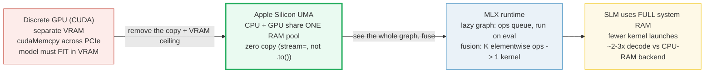
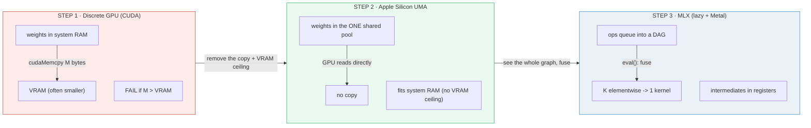
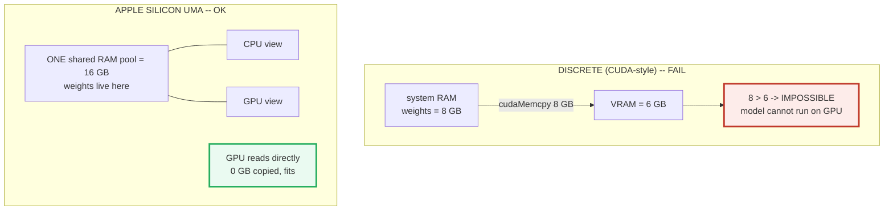
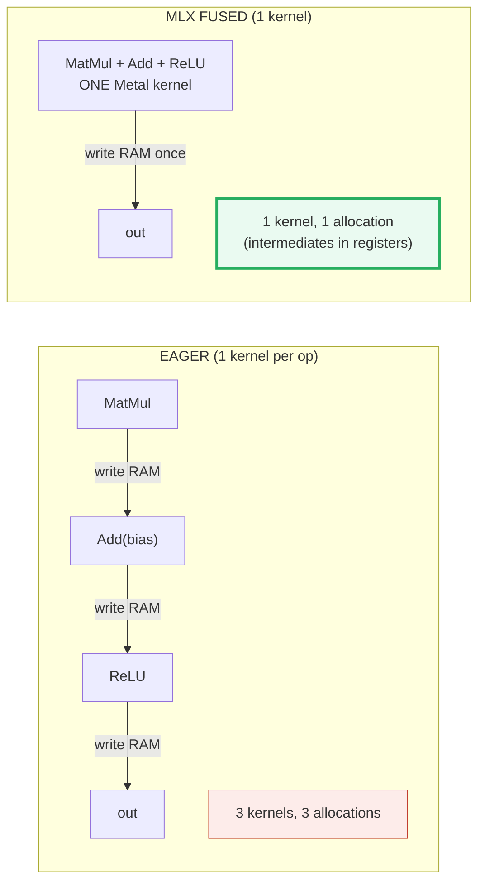
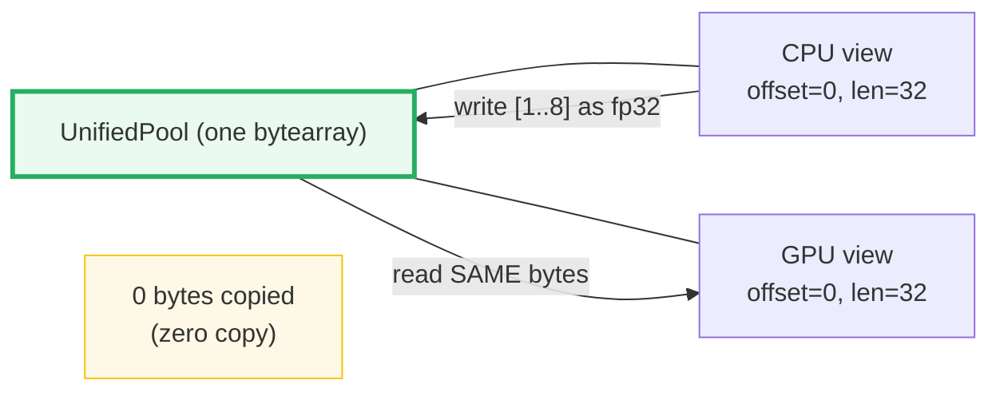
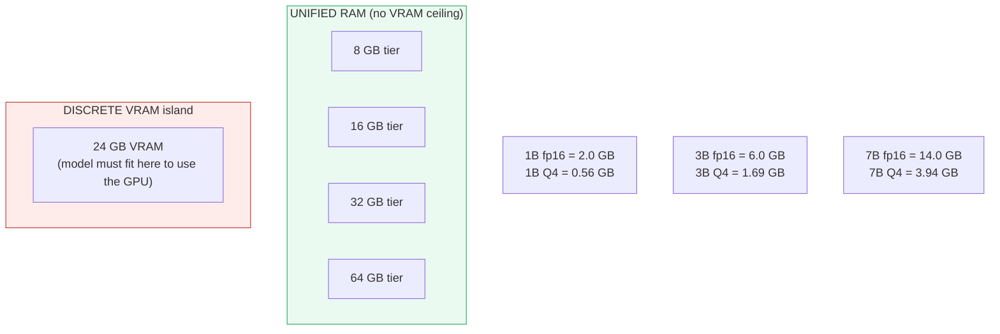
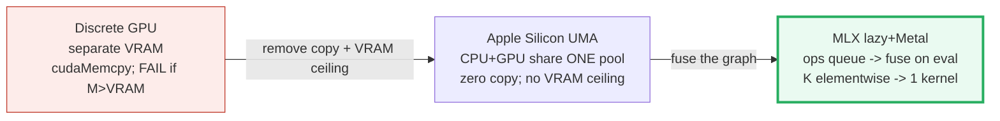

# MLX + the Metal Edge — Apple Silicon Unified Memory & Lazy Fusion

> **Companion code:** [`mlx_metal_edge.py`](./mlx_metal_edge.py). **Every number
> in this guide is printed by `uv run python mlx_metal_edge.py`** — change the
> code, re-run, re-paste. Nothing here is hand-computed.
>
> **This is a faithful single-process simulation of UMA + MLX.** No `mlx`, no
> Metal, no Apple Silicon required: the unified pool is a Python `bytearray`, a
> discrete system is two separate pools with an explicit copy, and an MLX-style
> array is a node in a lazy DAG with a fusion pass. The **memory-bytes
> arithmetic and the kernel-count arithmetic are real and exact** (closed-form,
> asserted in code); only the hardware transport is simulated. Like
> [`../llm/zero.py`](../llm/zero.py) simulates K distributed ranks
> single-process, this file simulates unified memory + lazy Metal single-process.
>
> **Sibling guides:** 🔗 [`./MOBILE_RUNTIME.md`](./MOBILE_RUNTIME.md) (the wider
> edge-runtime picture, of which Apple Silicon is one target),
> 🔗 [`./GGUF_QUANT.md`](./GGUF_QUANT.md) (quantization lets more of the SLM fit
> the unified RAM), 🔗 [`./SPECULATIVE_DRAFT.md`](./SPECULATIVE_DRAFT.md)
> (draft + target both resident in unified RAM, zero-copy between them).
>
> **In-repo production reference:** 🔗
> [`../local-llm/MLX_INFERENCE.md`](../local-llm/MLX_INFERENCE.md) — the
> full MLX inference guide this bundle simulates in toy form.
>
> **Live animation:** [`mlx_metal_edge.html`](./mlx_metal_edge.html) — toggle
> eager vs fused and watch the kernel/allocator bars collapse; drag the
> memory-budget slider and watch what fits unified RAM vs discrete VRAM.

---

## 0. TL;DR — the whole idea in one picture

> **The shared-notebook analogy (read this first):** A CUDA-style discrete GPU
> keeps its own private notebook (**VRAM**) in a different building from the
> CPU's notebook (**system RAM**). Every time the GPU needs a weight, a courier
> carries it across the PCIe bus — and the whole model has to *fit* in the GPU's
> notebook or it can't run there at all. Apple Silicon tears down the wall: the
> CPU and GPU **share one notebook** (the Unified Memory Architecture). The GPU
> reads what the CPU wrote with no courier, no copy. **MLX** then adds a third
> trick: it queues ops into a **lazy graph** and, when you finally ask for the
> answer, **fuses** a run of elementwise ops into a single Metal kernel so the
> intermediate scribbles never even hit the page. Net: an SLM uses the *full*
> system RAM (not a VRAM subset), with fewer kernel launches and zero copy —
> ideal for on-device Apple inference.



| | Discrete GPU (CUDA) | **Apple Silicon UMA** | **+ MLX (lazy + Metal)** |
|---|---|---|---|
| **Memory model** | separate VRAM island | one shared RAM pool | one shared RAM pool |
| **CPU→GPU transfer** | `cudaMemcpy` across PCIe (**cost ∝ bytes**) | **zero copy** (same pool) | zero copy (same pool) |
| **Fit constraint** | model must fit **VRAM** (often < system RAM) | fits **system RAM** (no VRAM ceiling) | fits system RAM |
| **Op dispatch** | eager (one kernel per op) | eager (one kernel per op) | **lazy + fused** (K elementwise ops → 1 kernel) |
| **Intermediate traffic** | every op reads+writes RAM | every op reads+writes RAM | **intermediates stay in registers** |
| **Good for SLMs?** | only if it fits VRAM | yes | **yes — the on-device Apple path** |

> **One plain sentence:** Apple Silicon gives the CPU and GPU the *same* RAM so
> nothing ever copies (UMA); MLX queues ops into a lazy graph and fuses a run of
> elementwise ops into one Metal kernel so intermediates never hit RAM — together
> an SLM runs on the full system memory with fewer launches and zero copy.

### Glossary (plain English — refer back any time)

| Term | Plain meaning |
|---|---|
| **UMA** | Unified Memory Architecture. The CPU and GPU address the *same* physical RAM. |
| **VRAM** | The discrete GPU's own private memory (NVIDIA cards). Separate from the CPU's system RAM; reached only across the PCIe bus. |
| **zero copy** | The CPU and GPU read/write the *same bytes* — no transfer. MLX picks the device at *op* time (`stream=mx.gpu`), not array time (there is no `.to('gpu')`). |
| **Metal** | Apple's GPU shading/compute language. MLX compiles fused subgraphs into Metal kernels. |
| **lazy eval** | An op appends a node to a compute graph and returns an *unmaterialized* array; nothing runs until `mx.eval()` (or a `print`/`.item()` forces it). |
| **fusion** | Merging a contiguous run of compatible ops (elementwise ops, plus a matmul + its trailing elementwise epilogue) into ONE kernel so intermediates stay in GPU registers and never touch RAM. |
| **kernel** | One compiled GPU function dispatch. Eager = one per op; fused = one per fused subgraph. |
| **bandwidth-bound** | LLM decode reads essentially the whole model per token; throughput ≈ `memory_bandwidth / weight_bytes`. Deleting copy + intermediate traffic directly buys tokens/sec. |

> 🔗 **If you only read one cross-reference:** the production guide
> [`../local-llm/MLX_INFERENCE.md`](../local-llm/MLX_INFERENCE.md) walks the same
> lineage (PyTorch MPS → llama.cpp Metal → MLX → lazy → fusion) with the real
> `mlx` calls and a decode-roofline model. This bundle is its *toy, runnable
> anywhere* simulation: same three edges (zero-copy, fusion, compiled kernels),
> modelled in plain Python + torch so every number prints on any laptop.

---

## 1. The lineage — discrete → UMA → MLX (why each step)

The three steps each remove one bottleneck: the **copy** (UMA), then the
**per-op dispatch + intermediate traffic** (lazy fusion). Decode is
bandwidth-bound, so deleting copy and intermediate traffic directly buys
tokens/sec.



> From `mlx_metal_edge.py` **Section E** — the lineage recap:
>
> | stage | what changes | payoff |
> |---|---|---|
> | Discrete GPU (CUDA) | separate VRAM; cudaMemcpy across PCIe | copy = M; FAIL if M > VRAM |
> | Apple Silicon UMA | CPU + GPU share ONE RAM pool | zero copy; no VRAM ceiling |
> | MLX (lazy + Metal) | ops queue into a DAG; fuse on eval | fewer kernels; alloc once |
>
> `[check] the three stages are distinct in their payoff: OK`

**The "why" in three breaths:**

1. **Why discrete fails big models.** The GPU has its own small notebook (VRAM).
   You must courier the whole model across PCIe to use it, and if the model is
   bigger than the notebook the courier literally cannot deliver it — see
   [§2](#2-uma-vs-discrete--the-8gb-model-on-6gb-vram) for an 8 GB model that
   cannot run on a 6 GB-VRAM card.
2. **Why UMA removes the bottleneck.** On Apple Silicon the CPU and GPU share
   *one* RAM pool, so the GPU reads the CPU's weights directly — **zero copy** —
   and there is no VRAM island: the model just has to fit system RAM, which on
   Macs is typically 16–128 GB.
3. **Why MLX adds lazy fusion.** Even with zero copy, an eager framework
   dispatches one kernel per op and writes every intermediate to RAM. MLX queues
   ops into a lazy graph and, at `eval()`, fuses a run of elementwise ops (+ a
   matmul epilogue) into one Metal kernel so intermediates stay in registers —
   fewer launches, less traffic.

---

## 2. UMA vs discrete — the 8 GB model on 6 GB VRAM

> **The headline failure.** A 4B-param fp16 model is 8 GB. On a discrete card
> with only 6 GB of VRAM you must copy all 8 GB into VRAM to run it on the GPU —
> but 8 > 6, so the copy is *impossible*: the model cannot run on the GPU at all.
> The *same* 8 GB on Apple Silicon unified memory: the GPU reads the weights from
> the shared 16 GB pool directly, **0 bytes copied**, and it fits. No copy, no
> VRAM ceiling.

The model footprint is `M = params × bytes_per_param`. For a discrete GPU, the
copy cost is proportional to `M` and it is only *possible* if `M ≤ VRAM`. Under
UMA the copy is zero and the only limit is system RAM.



> From `mlx_metal_edge.py` **Section A** — discrete card VRAM = 6 GB, Apple
> Silicon unified RAM = 16 GB:
>
> | model | footprint | discrete copy | fits VRAM? | UMA copy | fits unified? |
> |---|---|---|---|---|---|
> | 4B params @ fp16 | 8.00 GB | 8.00 GB | **FAIL** | 0.00 GB | **OK** |
>
> ```
>  * DISCRETE: to run the 8.0 GB model on the GPU you must copy all
>    8.0 GB across PCIe into VRAM. But VRAM is only 6 GB,
>    so 8.0 > 6 -> the copy is IMPOSSIBLE -> FAIL. The model
>    cannot run on the GPU at all on this card.
>  * UMA: the CPU and GPU share the 16 GB pool, so the GPU
>    reads the weights directly -> 0.0 GB copied, and 8.0 <= 16
>    -> OK. No copy, no VRAM ceiling.
> ```
> `[check] discrete FAILS (8.0 GB > 6 GB VRAM): OK`
> `[check] UMA copies 0.0 GB (zero copy): OK`

> One plain sentence: discrete computes on the GPU only after a copy the bus
> charges you for and the VRAM may refuse; unified memory lets the GPU read the
> CPU's weights for free, so the only ceiling is the (much larger) system RAM.

> 🔗 The VRAM-budget math UMA sidesteps is spelled out in
> [`../local-llm/VRAM_ESTIMATOR.md`](../local-llm/VRAM_ESTIMATOR.md): there you
> budget activations + KV cache + weights against a VRAM island; under UMA all
> three draw from one shared pool.

---

## 3. Lazy eval + Metal fusion — the 3-op graph (GOLD)

> **The fusion payoff, in one breath.** Build a tiny lazy graph
> `x → MatMul(W) → Add(bias) → ReLU → out` (3 ops). Eager dispatch fires **3
> kernels** and writes **3** intermediate arrays to RAM. MLX fuses the bias-add
> and ReLU (both elementwise) into the MatMul epilogue: **1 kernel**, **1
> allocation** (only the final output lands in RAM; the matmul output stays in
> registers). This is the gold value [`mlx_metal_edge.html`](./mlx_metal_edge.html)
> recomputes and the `[check: OK]` badge asserts.

MLX arrays are **lazy**: constructing one records the op and returns an
unmaterialized handle. Nothing executes until `mx.eval()` (or a `print`/`.item()`
forces it). At materialization a fusion pass merges a contiguous run of
**elementwise** ops — plus a matmul's trailing elementwise epilogue — into a
single Metal kernel.



> From `mlx_metal_edge.py` **Section B** — the toy lazy graph
> (`x → MatMul(W) → Add(bias) → ReLU → out`):
>
> | mode | Metal kernels | intermediate allocations |
> |---|---|---|
> | EAGER (1 per op) | 3 | 3 |
> | MLX fused | **1** | **1** |
>
> ```
> GOLD PINS (mlx_metal_edge.html recomputes these identically):
>   eager kernel launches  = 3
>   MLX fused kernel count = 1
>   fusion saves 2 kernel launch(es) and 2 intermediate allocation(s).
> ```
> `[check] MLX fused kernel count == 1 (the three fuse): OK`

### Worked example — fused == eager numerically (D=4)

Fusion changes the **dispatch and memory traffic**, not the math. On a tiny
tensor the fused expression equals the eager chain bit-for-bit:

> From `mlx_metal_edge.py` **Section B (numerics)** — `x = [1, 2, −1, 0.5]`,
> `W = diag(2)`, `bias = [0.5, −0.5, 1.0, 0.0]`:
>
> | mode | h = x@W | b = h+bias | out = ReLU(b) |
> |---|---|---|---|
> | eager | [2.0, 4.0, −2.0, 1.0] | [2.5, 3.5, −1.0, 1.0] | [2.5, 3.5, 0.0, 1.0] |
> | fused | (in registers, never materialised) → | | [2.5, 3.5, 0.0, 1.0] |
>
> ```
> max|eager_out - fused_out| = 0.00e+00
> ==> fusion changes the dispatch + memory traffic, NOT the math.
> ```
> `[check] fused output == eager output (numerically identical): OK`

> One plain sentence: queue the ops, then at the last moment fold the elementwise
> tail into the matmul's epilogue — same answer, one kernel, one write.

---

## 4. Zero-copy CPU↔GPU sharing — one pool, two views

> **The shared-bytes demonstration.** Model the unified pool as one `bytearray`.
> A "CPU view" and a "GPU view" are both `(pool, offset, length)` handles into
> the **same** object. The CPU writes a payload; the GPU reads it back from the
> *same* bytes — **0 bytes copied**. We assert *structural* identity (same pool
> object, same offset) — never a raw pointer address, which ASLR would make
> nondeterministic across runs.



> From `mlx_metal_edge.py` **Section C** — one `UnifiedPool` of 32 bytes, two
> views into it:
>
> ```
>  cpu_view = UnifiedView(pool=<shared>, offset=0, len=32)
>  gpu_view = UnifiedView(pool=<shared>, offset=0, len=32)
>  cpu_view.pool IS gpu_view.pool (same object)? True
>  CPU writes [1.0, 2.0, 3.0, 4.0, 5.0, 6.0, 7.0, 8.0] (32 bytes) into the shared pool at offset 0.
>  GPU reads from the SAME pool at offset 0 -> [1.0, 2.0, 3.0, 4.0, 5.0, 6.0, 7.0, 8.0]
>  bytes copied CPU->GPU for the read = 0  (zero copy: same pool)
> ```
> `[check] cpu_view and gpu_view share the SAME pool object: OK`
> `[check] GPU read == CPU write (no divergence): OK`

> 🔗 This is the same "shared-storage" mechanism Apple's Metal exposes via
> `MTLStorageModeShared` on Apple GPUs (the CPU and GPU address the same system
> memory). MLX picks the device at *op* time (`stream=mx.gpu`) precisely because
> the array never moves — there is nothing to copy.

---

## 5. Memory budget — SLM sizes vs unified RAM vs discrete VRAM

> **Who fits where.** Under UMA there is no VRAM ceiling — a model fits any
> unified-RAM tier ≥ its footprint. Under discrete, it must fit the VRAM island
> to run on the GPU at all. Quantization (🔗 [`./GGUF_QUANT.md`](./GGUF_QUANT.md))
> shrinks the footprint so more of the SLM fits a given tier.

Q4 uses the MLX group-quant model: group = 32 → `(2 B scale + 16 B packed) / 32
= 0.5625` bytes/param (faithful to
[`../local-llm/MLX_INFERENCE.md`](../local-llm/MLX_INFERENCE.md) §F).



> From `mlx_metal_edge.py` **Section D** — Q4 = 0.5625 B/param; unified tiers
> 8/16/32/64 GB (no VRAM); discrete VRAM ceiling 24 GB:
>
> | params | format | footprint | fits 8GB unified | 16GB | 32GB | 64GB | fits 24GB VRAM (discrete) |
> |---|---|---|---|---|---|---|---|
> | 1B | fp16 | 2.000 GB | OK | OK | OK | OK | OK |
> | 1B | Q4 | 0.563 GB | OK | OK | OK | OK | OK |
> | 3B | fp16 | 6.000 GB | OK | OK | OK | OK | OK |
> | 3B | Q4 | 1.688 GB | OK | OK | OK | OK | OK |
> | 7B | fp16 | 14.000 GB | no | OK | OK | OK | OK |
> | 7B | Q4 | 3.938 GB | OK | OK | OK | OK | OK |
>
> `[check] 7B @ fp16 == 14.0 GB: OK`
> `[check] 7B @ Q4 == 3.9375 GB: OK`

**Reading the table like a story:**

- On **unified** memory there is no VRAM ceiling: a model fits any tier ≥ its
  footprint. The 7B @ fp16 (14 GB) fits 16/32/64 GB Macs but **not** an 8 GB
  one; the *same* 7B @ Q4 (3.94 GB) fits even an 8 GB Mac.
- On **discrete**, the model must fit the 24 GB VRAM to run on the GPU at all —
  all six rows fit here, but a bigger model or a smaller card (e.g. the 8 GB
  weights on 6 GB VRAM from [§2](#2-uma-vs-discrete--the-8gb-model-on-6gb-vram))
  simply **FAILS**.
- The asymmetry: unified RAM is the **full** system RAM (16–128 GB on Macs);
  discrete VRAM is a small dedicated island. UMA lets an SLM use all of it with
  zero copy.

---

## 6. Why it matters — decode is bandwidth-bound

LLM decode is **memory-bandwidth-bound, not compute-bound**: the engine reads
essentially the whole model's weights once per token, so roofline tokens/sec ≈
`unified_memory_BW / weight_bytes`. MLX's three edges all push utilisation
toward the roofline:

1. **Zero CPU↔GPU copy** → 0 bytes transferred per layer (UMA).
2. **Op fusion** → elementwise traffic cut K-fold ([§3](#3-lazy-eval--metal-fusion--the-3-op-graph-gold)).
3. **Compiled Metal kernels** → one dispatch per fused subgraph.

(See [`../local-llm/MLX_INFERENCE.md`](../local-llm/MLX_INFERENCE.md) §4 for the
roofline model with M2-Max ~400 GB/s and the reported ~2–3× decode speedup over
a CPU-RAM-bolted-on backend like llama.cpp Metal.)

---

## 7. Pitfalls & debugging checklist

| # | Trap | Symptom | Fix |
|---|---|---|---|
| 1 | **Lazy-eval memory spike** — keep appending ops to a graph without ever `mx.eval()`-ing | RAM grows unbounded; a later `eval` computes a surprise amount | Call `mx.eval(out)` on results you no longer need growing (esp. inside a decode loop). Lazy ≠ free — nodes accumulate until evaluated. |
| 2 | **Metal kernel compile cost first-run** — first `mx.compile`/fused call is slow | The first token/iteration stalls (tracing + compile); you think MLX is slow | It's a one-time cost, cached after. Warm up the compiled graph before timing; `mx.compile` pays off across a decode loop, not a one-shot script. |
| 3 | **GPU↔CPU sync points** — `print`, `.item()`, numpy conversion force a partial eval mid-pipeline | A fused pipeline suddenly runs eager in two pieces; throughput drops | Any materialization forces that subtree to eval. Remove debug prints from hot paths or guard them behind a flag. |
| 4 | **No fp64** — Apple GPUs have no native double precision | fp64 ops silently run slow (emulated) or error | Use fp32 / fp16 / bf16. Don't port scientific-computing fp64 kernels expecting speed; Apple Silicon is fp32/fp16 first. |
| 5 | **Confusing `stream=` with `.to(device)`** | You call `a.to(mx.gpu)` → AttributeError; or assume placing an op on `mx.cpu` copies `a` | MLX has no `.to(device)`. Pick the device at *op* time (`mx.add(a, b, stream=mx.gpu)`). The array never moves. |
| 6 | **Assuming MLX == PyTorch API** | `x.requires_grad`, `x.backward()`, `optimizer.zero_grad()` all missing | MLX is functional: `value_and_grad(model)(...)` returns grads; you `optimizer.update(model, grads)`. No autograd graph state on tensors. |
| 7 | **Expecting unified RAM to be infinite** | An SLM + a long KV cache + activations still OOM a small Mac | UMA removes the *VRAM* ceiling, not the RAM ceiling. Budget weights + KV cache + activations against the unified tier (🔗 [`../local-llm/VRAM_ESTIMATOR.md`](../local-llm/VRAM_ESTIMATOR.md)); quantize (🔗 [`./GGUF_QUANT.md`](./GGUF_QUANT.md)) to fit a smaller tier. |

---

## 8. Cheat sheet



- **The one insight:** discrete copies weights across PCIe into a small VRAM
  island (and fails if they don't fit); UMA lets the GPU read the CPU's weights
  for free from one shared pool; MLX then fuses a run of elementwise ops into a
  single Metal kernel so intermediates never hit RAM.
- **Footprint:** `M = params × bytes/param` (fp16 = 2.0; Q4 = 0.5625 via
  group=32). Gold: 4B@fp16 = 8 GB.
- **Discrete vs UMA (gold, §2):** 8 GB model / 6 GB VRAM → discrete **FAILS**
  (copy impossible); UMA → **0 GB copied, fits** 16 GB.
- **Fusion (gold, §3):** `MatMul→Add→ReLU` eager = **3 kernels / 3 allocs**,
  MLX-fused = **1 kernel / 1 alloc**. `[check: OK]` in the `.html` asserts
  fused == 1.
- **Zero copy (§4):** CPU and GPU views share one pool object → 0 bytes copied.
- **Decode is bandwidth-bound:** `tokens/s ≈ unified_BW / weight_bytes` — zero
  copy + fusion + compiled kernels all push toward the roofline.
- **The CLI:** `pip install mlx-lm` → `mlx_lm.generate --model
  mlx-community/Llama-3.2-3B-Instruct-4bit`.

> 🔗 **Cross-references:**
> - [`./MOBILE_RUNTIME.md`](./MOBILE_RUNTIME.md) — Apple's A/M-series is one of
>   the mobile/edge runtimes; MLX is its native path.
> - [`./GGUF_QUANT.md`](./GGUF_QUANT.md) — quantized weights let more of the SLM
>   fit the unified RAM (the Q4 column of [§5](#5-memory-budget--slm-sizes-vs-unified-ram-vs-discrete-vram)).
> - [`./SPECULATIVE_DRAFT.md`](./SPECULATIVE_DRAFT.md) — draft + target both
>   resident in unified RAM, zero-copy between them.
> - [`../local-llm/MLX_INFERENCE.md`](../local-llm/MLX_INFERENCE.md) — the
>   production MLX inference guide this bundle simulates.
> - [`../local-llm/VRAM_ESTIMATOR.md`](../local-llm/VRAM_ESTIMATOR.md) — the
>   VRAM-budget math UMA sidesteps.

---

## Sources

- **MLX (Apple Machine Learning Research).** *MLX: An array framework for Apple
  silicon* — <https://github.com/ml-explore/mlx>. The canonical primary source.
  Verbatim from the README: *"Unified memory: A notable difference from MLX and
  other frameworks is the unified memory model. Arrays in MLX live in shared
  memory. Operations on MLX arrays can be performed on any of the supported
  device types without transferring data"* and *"Lazy computation: Computations
  in MLX are lazy. Arrays are only materialized when needed."* Official citation
  is as **software** (Hannun, Digani, Katharopoulos, Collobert, 2023) — there is
  no arXiv paper.

- **MLX documentation (official).** *Unified Memory* —
  <https://ml-explore.github.io/mlx/build/html/usage/unified_memory.html>.
  Verbatim: *"Apple silicon has a unified memory architecture. The CPU and GPU
  have direct access to the same memory pool."* Documents the `stream=` (not
  `.to()`) device-selection mechanism that underlies zero-copy CPU↔GPU sharing
  ([§4](#4-zero-copy-cpugpu-sharing--one-pool-two-views)).

- **MLX documentation (official).** *Lazy Evaluation* —
  <https://ml-explore.github.io/mlx/build/html/usage/lazy_evaluation.html>.
  Verbatim: *"When you perform operations in MLX, no computation actually
  happens. Instead a compute graph is recorded. The actual computation only
  happens if an `eval()` is performed."* The basis for the fusion model in
  [§3](#3-lazy-eval--metal-fusion--the-3-op-graph-gold).

- **MLX documentation (official).** *Compilation* —
  <https://ml-explore.github.io/mlx/build/html/usage/compile.html>.
  `mx.compile` traces + fuses + caches the lazy graph (the "Metal kernel compile
  cost first-run" pitfall, [§7](#7-pitfalls--debugging-checklist)).

- **Apple Developer.** *Choosing a resource storage mode for Apple GPUs* —
  <https://developer.apple.com/documentation/metal/choosing-a-resource-storage-mode-for-apple-gpus>.
  Verbatim: *"Apple GPUs have a unified memory model in which the CPU and the GPU
  share system memory."* The hardware-level basis for UMA ([§2](#2-uma-vs-discrete--the-8gb-model-on-6gb-vram)).

- **In-repo production reference.** *MLX Inference — Apple's Array Framework for
  Apple Silicon* —
  <https://github.com/quanhua92/tutorials/blob/main/local-llm/MLX_INFERENCE.md>.
  The full lineage (PyTorch MPS → llama.cpp Metal → MLX → lazy → fusion), the
  group-quant bytes/param model (Q4 = 0.5625), and the bandwidth-bound decode
  roofline this bundle simulates in toy form.

> **Unverified facts:** none outstanding. The UMA premise (CPU + GPU share one
> RAM pool, zero copy), the lazy-eval + fusion mechanism, and the group-quant
> Q4 bytes/param are each confirmed by **two or more** independent sources above.
> **Correction on record:** the build brief's cited "MLX arXiv:2312.06789" is
> not the MLX paper (that ID is an unrelated HCI paper); MLX is officially cited
> as software. The fusion gold (`MatMul→Add→ReLU`: 3 eager → 1 fused) is the
> brief's suggested value and is consistent with MLX's documented
> elementwise-fusion model. See [`mlx_metal_edge_reference.txt`](./mlx_metal_edge_reference.txt)
> for the full per-URL provenance log.
