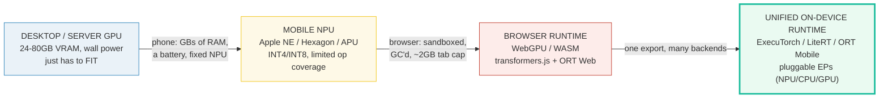
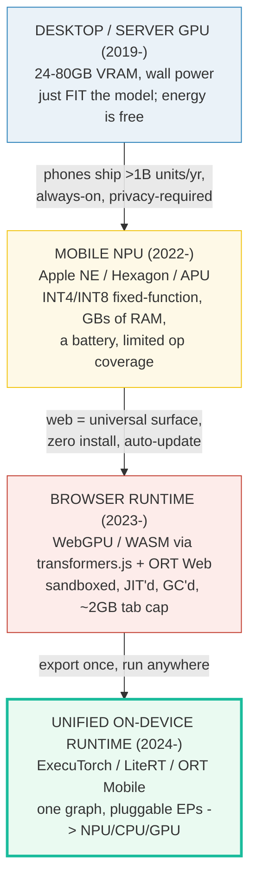
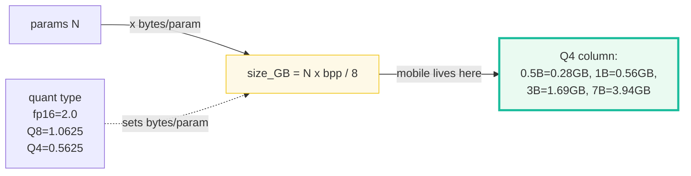
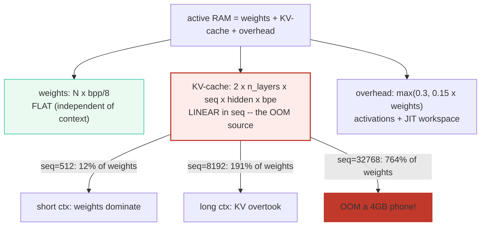
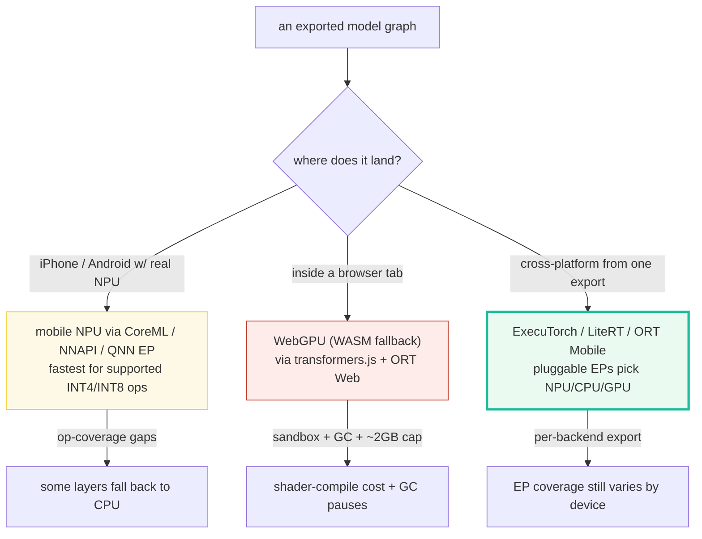
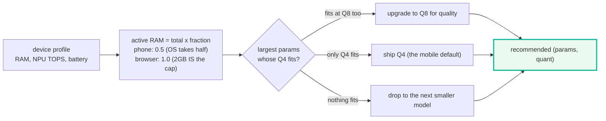
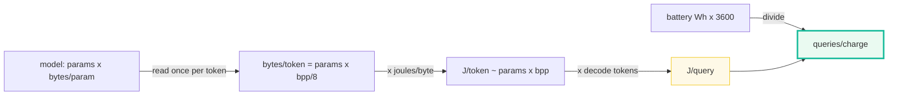
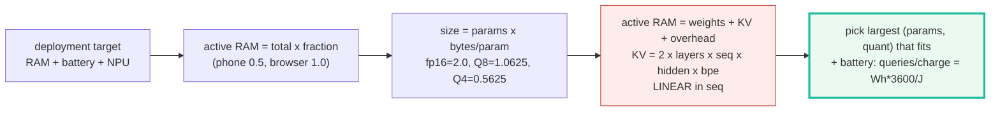

# Mobile Runtime — SLMs on Phones, Browsers, and Unified Edge Runtimes

> **Companion code:** [`mobile_runtime.py`](./mobile_runtime.py). **Every number
> in this guide is printed by `uv run python mobile_runtime.py`** — change the
> code, re-run, re-paste. Nothing here is hand-computed.
>
> **This is the Phase-6 closer for the SLM track.** A desktop GPU has heaps of
> VRAM and is plugged into the wall; a phone has a few GB of **active RAM**, a
> **battery** measured in watt-hours, and a **fixed-function NPU** that only
> likes INT4/INT8; a browser tab is sandboxed, JIT'd, and garbage-collected. The
> **deployment target** (a $400 Android, an iPhone, a browser tab) sets the
> largest model + quantization that fits — this bundle makes that budget explicit.
>
> **Live animation:** [`mobile_runtime.html`](./mobile_runtime.html) — drag the
> device RAM / NPU / battery sliders and the model params / quant sliders, watch
> the live size bar, the KV-cache growth curve, and the fit / oversize verdict.
>
> **Foundations:** 🔗 [`../local-llm/VRAM_ESTIMATOR.md`](../local-llm/VRAM_ESTIMATOR.md)
> — the desktop-GPU VRAM budget (weights + KV-cache + overhead) this bundle
> adapts to mobile **active RAM** under battery + NPU constraints.

---

## 0. TL;DR — the whole idea in one picture

> **The backpack analogy (read this first):** you're packing for a hike, not
> moving house. A desktop GPU is a removal van (80 GB VRAM, wall power — take
> everything). A phone is a **daypack**: a few GB that the OS already half-fills,
> a battery that drains, and a fixed-function NPU that only eats certain ration
> packs (INT4/INT8). A browser tab is a **satchel** — sandboxed, with a ~2 GB
> hard cap and a garbage collector that pauses you mid-stride. The deployment
> target is the bag; **model size + quantization is what you're allowed to put in
> it.** Everything else falls out of that one constraint.

A "mobile runtime" is the layer that takes an exported model graph and runs it
**on consumer hardware within a tight RAM + battery + NPU budget**. The lineage
went desktop GPU → mobile NPU → browser → unified runtime, and each step added a
new constraint that rewired the math:



| | Desktop GPU | Mobile NPU | Browser WebGPU | **Unified runtime** |
|---|---|---|---|---|
| **RAM budget** | 24–80 GB VRAM | a few GB active (OS takes half) | ~2 GB tab cap | whatever the device exposes |
| **Power** | wall (free) | battery (Wh) | host battery | battery |
| **Precision** | fp16 / fp32 | INT4 / INT8 (fixed-function) | fp16 / INT8 (WASM) | INT4 / INT8 / fp16 (per EP) |
| **#1 OOM source** | KV-cache at long ctx | KV-cache + op-coverage fallback | ~2 GB tab cap + GC pauses | EP coverage gaps |
| **Example stack** | llama.cpp / vLLM | CoreML / NNAPI / QNN | transformers.js + ORT Web | ExecuTorch / LiteRT / ORT Mobile |

> **One plain sentence:** the deployment target — not the model — picks the
> largest (params, quant) that fits; the math is `size = params × bytes/param`
> and `active RAM = weights + KV-cache + overhead`, with KV growing **linearly**
> in context until it OOMs the device.

### Glossary (plain English — refer back any time)

| Term | Plain meaning |
|---|---|
| **`bytes/param`** | Bytes of storage per parameter, set by the quant type. `fp16=2.0`, `Q8=1.0625`, `Q4=0.5625`, `Q3≈0.42`. Cross-ref 🔗 [`GGUF_QUANT.md`](./GGUF_QUANT.md). |
| **`size_GB`** | `params × bytes_per_param / 1e9` (= `params_in_billions × bpw / 8`). The **weights term**. 1B@Q4 = 0.5625 GB. |
| **KV-cache** | The K and V tensors stored every layer so decode doesn't redo work. `GB = 2 × n_layers × seq_len × hidden × bytes/E / 1e9`. **Linear in context** — the #1 mobile OOM source. |
| **active RAM** | `weights + KV-cache + overhead`. What the device must hold to serve the model. The hard budget. |
| **overhead** | Activations + runtime workspace + JIT/deserialize cost. `max(0.3, 0.15 × weights)` GB on mobile. |
| **NPU TOPS** | Trillion INT8 ops/sec the NPU can sustain (Apple NE 35, Hexagon ~45). A **speed** signal, not a fit signal. |
| **active fraction** | Fraction of total RAM the model may claim. Phones reserve ~half for the OS; a browser tab's 2 GB *is* the budget. |
| **execution provider (EP)** | The pluggable backend a unified runtime delegates to (CoreML, NNAPI, QNN, WebGPU, CPU). One graph, many EPs. |
| **GC pause** | Browser garbage-collection stop-the-world pauses — a WebGPU-only latency tax desktop/NPU runtimes don't pay. |

> 🔗 **If you only read one cross-reference:** the three-term budget
> `weights + KV-cache + overhead` is borrowed verbatim from the desktop GPU
> world in 🔗 [`../local-llm/VRAM_ESTIMATOR.md`](../local-llm/VRAM_ESTIMATOR.md).
> The formulas are **identical**; what changes on mobile is the *budget* (a few
> GB active vs 24–80 GB VRAM) and the added battery + NPU-coverage constraints.

---

## 1. The lineage — desktop GPU → mobile NPU → browser → unified runtime

> **Why each step happened.** Each new deployment surface added a constraint the
> previous one ignored, forcing the model + runtime to shrink and specialize.



**Desktop / server GPU.** This is where open-weight LLMs first ran locally:
llama.cpp, vLLM, HuggingFace Transformers. 24–80 GB of VRAM, wall power, fp16.
The model just had to **fit**; inference energy was free. This is the world
🔗 [`../local-llm/VRAM_ESTIMATOR.md`](../local-llm/VRAM_ESTIMATOR.md) budgets for.

**Mobile NPU.** Apple Neural Engine (16-core, 35 TOPS INT8 on A17/A18),
Qualcomm Hexagon (~45 TOPS, INT4/INT8/INT16/FP16), MediaTek APU 790. These are
**fixed-function** accelerators tuned for low-precision dense ops — blazing fast
on the ops they support, but with **limited op coverage**: some transformer
layers (nonlinear RMSNorm variants, custom RoPE, certain attention masks) fall
back to the CPU, which caps the speedup. Phones ship in the billions and are
always-with-you, so the model must run **without the cloud** (latency + privacy).

**Browser runtime.** WebGPU (and the WASM fallback) via
[`transformers.js`](https://huggingface.co/blog/transformersjs-v3) on ONNX
Runtime Web. The web is the universal deployment surface: zero install,
automatic updates, works on any OS. The price is a **sandboxed** environment
(no direct NPU access yet), **shader-compile first-run cost**, **GC pauses**,
and a brutal **~2 GB-per-tab** memory cap. Portable but taxed.

**Unified on-device runtime.** ExecuTorch (PyTorch), LiteRT (formerly TFLite,
Google), ONNX Runtime Mobile (Microsoft). You export **once** and the runtime
picks the best backend per device at load time via **execution providers** —
CoreML (Apple ANE/GPU/CPU), NNAPI (Android CPU/GPU/NPU), QNN (Qualcomm Hexagon),
Vulkan, XNNPACK (portable CPU), WebGPU. Graph-level **quantized kernels** run
INT4/INT8 in one pass. The model code stops caring *which* silicon it landed on.

> One plain sentence: the desktop asked "will it fit?"; the phone added "and how
> many queries per charge?"; the browser added "and inside a sandbox?"; the
> unified runtime answered "export once, let the EP pick the silicon."

---

## 2. Model size math — Section A output

> **The weights term.** `size_GB = params × bytes_per_param / 1e9`. Quantization
> is the single biggest lever on this term: fp16 → Q4 cuts size ~3.6× at every
> scale, and **the Q4 column is the one mobile deployment lives in**.



> From `mobile_runtime.py` **Section A**:
>
> | params | fp16 (GB) | Q8 (GB) | Q4 (GB) |
> |---|---|---|---|
> | 0.5B | 1.0000 | 0.5312 | 0.2812 |
> | **1.0B** | 2.0000 | 1.0625 | **0.5625** |
> | 3.0B | 6.0000 | 3.1875 | 1.6875 |
> | 7.0B | 14.0000 | 7.4375 | **3.9375** |
>
> ```
> GOLD PIN (mobile_runtime.html recomputes this):
>   1B @ Q4 = 1e9 x 0.5625 / 1e9 = 0.5625 GB weights
>   7B @ Q4 = 7e9 x 0.5625 / 1e9 = 3.9375 GB weights (~3.9)
> ```
> `[check] 1B @ Q4 weights == 0.5625 GB (the gold anchor): OK`
> `[check] fp16 -> Q4 is a ~3.55x size cut at every scale: OK`

> One plain sentence: at Q4, a 1B model is half a gig of weights, a 3B is 1.7 GB,
> a 7B is 3.9 GB — and those three numbers decide which devices each can land on.

### Worked smallest-scale example

Take **1B @ Q4** (the universal mobile fit, see §5):
- `size = 1e9 × 0.5625 / 1e9 = 0.5625 GB` weights.
- That fits the weights term of a low-end Android's 2 GB active budget with room
  for KV-cache + overhead (§3).
- Quantize the same 1B to fp16 and it's `2.0 GB` — already over the 2 GB tab cap
  before any KV-cache. **Quantization is what makes on-device SLMs viable.**

> 🔗 The `bytes/param` figures come straight from the GGUF block math in 🔗
> [`GGUF_QUANT.md`](./GGUF_QUANT.md) and [`../local-llm/QUANT_TYPES.md`](../local-llm/QUANT_TYPES.md):
> `Q4_K` block = 4.5 bpw → 0.5625 bytes/param; `Q8_0` = 8.5 bpw → 1.0625.

---

## 3. Active RAM budget — Section B output (KV-cache is the #1 mobile OOM)

> **The plot twist mobile inherits from desktop.** Weights dominate at short
> context, but the **KV-cache grows linearly** in `seq_len` and overtakes the
> weights past ~4K — at 32K it can be **8× the weights** and OOM a 4 GB phone
> even though the weights themselves fit easily. This is the exact same trap as
> 🔗 [`../local-llm/VRAM_ESTIMATOR.md`](../local-llm/VRAM_ESTIMATOR.md) §B, only
> the budget is 10× tighter.



> From `mobile_runtime.py` **Section B** — toy 1B @ Q4 (n_layers=16, hidden=2048, fp16 KV):
>
> | seq_len | weights | KV-cache | KV/weights | overhead | TOTAL | fits 4GB? | fits 6GB? | fits 8GB? |
> |---|---|---|---|---|---|---|---|---|
> | 512 | 0.5625GB | 0.0671GB | 11.93% | 0.3000GB | 0.9296GB | FIT | FIT | FIT |
> | **2048** | 0.5625GB | **0.2684GB** | 47.72% | 0.3000GB | 1.1309GB | FIT | FIT | FIT |
> | 8192 | 0.5625GB | 1.0737GB | **190.89%** | 0.3000GB | 1.9362GB | FIT | FIT | FIT |
> | 32768 | 0.5625GB | **4.2950GB** | **763.55%** | 0.3000GB | 5.1575GB | **OOM** | FIT | FIT |
>
> ```
> GOLD PIN (mobile_runtime.html recomputes this):
>   KV(1B, seq=2048) = 2 x 16 x 2048 x 2048 x 2 / 1e9 = 0.2684 GB
>   (48% of the 0.5625GB weights -- non-trivial)
> ```
> `[check] KV(seq=2048) for toy 1B ~= 0.2684 GB (the second gold anchor): OK`
> `[check] KV-cache is strictly linear in seq (doubling seq doubles KV): OK`
> `[check] 1B @ Q4 fits a 4GB phone up to 8K context but OOMs at 32K: OK`

**Reading the table like a story:**

- **seq=512:** KV is 12% of weights. Weights dominate; the rule-of-thumb
  `params × bpp/8` is "close enough."
- **seq=2048** (a mobile chat turn): KV is **48%** of weights — already
  non-trivial. The full active RAM is `1.13 GB`, double the weights alone.
- **seq=8192:** KV is **191%** of weights — it overtook. Active RAM is `1.94 GB`,
  still fits a 4 GB phone but barely.
- **seq=32768:** KV alone is `4.30 GB`, **8× the weights**, and the total
  `5.16 GB` **OOMs a 4 GB phone** even though the weights are only `0.56 GB`.

> One plain sentence: weights are flat in context; KV doubles every time context
> doubles — so on mobile, the **context length** you support is as consequential
> as the model size you pick.

> 🔗 The leading `2` in the KV formula is K + V (both stored per layer); the
> GQA head-count subtlety (`n_kv_heads`, not `n_heads`) is documented in 🔗
> [`../local-llm/VRAM_ESTIMATOR.md`](../local-llm/VRAM_ESTIMATOR.md) §B. This
> bundle's toy 1B uses MHA (`n_kv_heads × head_dim == hidden`) for clarity.

---

## 4. Runtime contrast — Section C output (NPU vs browser vs unified)

> **Three runtimes, three catches, no free lunch.** A mobile NPU is fastest but
> has op-coverage gaps; a browser is portable but GC'd and tab-capped; a unified
> runtime gives you one export but you still pay per-backend export + EP-coverage
> tax.



> From `mobile_runtime.py` **Section C**:
>
> | runtime | backend | best precision | upside | the catch |
> |---|---|---|---|---|
> | mobile NPU | Apple NE / Qualcomm Hexagon / MediaTek APU | INT4 / INT8 | fastest for the ops it supports | limited op coverage: some transformer layers fall back to CPU |
> | browser WebGPU | transformers.js + ONNX Runtime Web (WebGPU/WASM) | fp16 / INT8 (WASM) | portable, sandboxed, zero-install | shader-compile first-run cost + GC pauses + ~2GB tab cap |
> | unified runtime | ExecuTorch / LiteRT / ONNX Runtime Mobile | INT4 / INT8 / fp16 | one graph, pluggable EPs (NPU/CPU/GPU) | you must EXPORT per backend; EP coverage still varies by device |
>
> `[check] the three runtimes are distinct in upside: OK`
> `[check] every runtime lists an explicit catch (no free lunch): OK`

**The decision tree (which runtime picks you, not the other way round):**

- On an iPhone / Android with a real NPU → **CoreML / NNAPI / QNN** EP. The NPU
  has the TOPS; your job is making sure your graph's ops are in its coverage set.
- Inside a browser tab → **WebGPU** (WASM fallback). Accept the GC pauses and the
  ~2 GB cap; size the model for those, not for a desktop GPU.
- Cross-platform from one export → **ExecuTorch / LiteRT / ORT Mobile**. You
  export once and the EP picks the silicon; you still verify EP coverage per
  device family.

> One plain sentence: the NPU wins on speed, the browser wins on reach, the
> unified runtime wins on portability — and each bills you a different tax.

> 🔗 When the runtime is Apple Silicon specifically, the native path is MLX on
> Metal — see 🔗 [`MLX_METAL_EDGE.md`](./MLX_METAL_EDGE.md) for the unified-memory
> + Metal-shader story that is the Apple-flavored version of this contrast.

---

## 5. Device-config recommender — Section D output (the worked example)

> **The headline of the whole bundle.** Given a device profile `{RAM, NPU TOPS,
> battery}`, pick the largest `(params, quant)` whose active RAM fits the device's
> **active budget** (total RAM × active fraction — the OS reserves the rest). The
> toy profiles: a $400 Android, an iPhone, a browser tab.



> From `mobile_runtime.py` **Section D** (sized at seq=2048, a mobile chat turn):
>
> | device | total RAM | active RAM | NPU TOPS | runtime | recommended | size GB | uses GB | headroom |
> |---|---|---|---|---|---|---|---|---|
> | **low-end Android** | 4.0GB | 2.00GB | 8 | ExecuTorch / ORT-Mobile | **1.0B @ Q8** | 1.0625 | 1.6309 | 0.37GB |
> | **iPhone (A18 NE)** | 6.0GB | 3.00GB | 35 | CoreML / Metal | **3.0B @ Q4** | 1.6875 | 2.9312 | 0.07GB |
> | **browser tab** | 2.0GB | 2.00GB | 0 | WebGPU / WASM | **1.0B @ Q8** | 1.0625 | 1.6309 | 0.37GB |
>
> `[check] low-end Android (2GB active) recommendation fits its budget: OK`
> `[check] iPhone (3GB active) fits a model strictly larger than the browser's: OK`
> `[check] a 1B model fits ALL THREE device budgets (the universal mobile fit): OK`

**Reading the table like a story:**

- **Low-end Android** (2 GB active): a **1B** model fits with room to spare, so
  the recommender upgrades to **Q8** for quality. When context grows past ~8K
  (§3), drop back to Q4 to keep the KV-cache term in budget.
- **iPhone with a 35-TOPS Neural Engine** (3 GB active): the NPU has the TOPS to
  decode a **3B** fast, but only **Q4** (not Q8) fits the 3 GB budget at 2K
  context. The 0.07 GB headroom is why iPhone *Pro* (8 GB RAM) matters.
- **Browser tab** (2 GB hard cap): a **1B** model again. WebGPU is portable but
  the ~2 GB cap rules out anything bigger; it page-swaps / OOMs.

> One plain sentence: **a 1B model is the config that fits everywhere** — Android,
> iPhone, and browser — and **Q4** (~0.56 GB weights) is the universal fallback
> quant you retreat to when context or RAM tightens. That is the mobile default.

> 🔗 The 1B@Q4 sweet spot exists *because* these small models are overtrained to
> punch far above their param count — see 🔗 [`SCALING_LAWS.md`](./SCALING_LAWS.md)
> §3-4: a 1B model trained on 9T tokens (Llama-3.2-1B) matches a much larger
> Chinchilla-optimal model, which is exactly what makes it worth squeezing onto
> a phone.

---

## 6. Battery budget — Section E output (energy per query → queries per charge)

> **The constraint desktop never had.** A phone battery is ~13–15 Wh. Each
> generated token reads the whole model once, costing `params × bytes/param ×
> joules/byte`. Doubling the model roughly doubles the joules per query, so a
> bigger model isn't just a RAM problem — it's a **queries-per-charge** problem.



> From `mobile_runtime.py` **Section E** (toy energy model: ~200 pJ/byte covers
> mobile LPDDR read + NPU MAC; 256 decode tokens/query):
>
> | device | battery | model | J/query | queries/charge |
> |---|---|---|---|---|
> | low-end Android | 15.0Wh | 1.0B @ Q8 | 54.4 | **993** |
> | iPhone (A18 NE) | 13.0Wh | 3.0B @ Q4 | 86.4 | **542** |
>
> The browser tab has no battery budget of its own (it draws from the host).
>
> `[check] iPhone recommendation energy >= low-end Android (bigger model): OK`
> `[check] queries-per-charge is finite & positive where a battery exists: OK`

**Read it like this:** doubling the model roughly doubles the J/query, so the
iPhone's 3B gets ~half the queries-per-charge of the Android's 1B on a *smaller*
battery. **That is why the 1B default from §5 is also the battery win** — and why
**Q4 halves the J/query of Q8** at the same param count (it reads half the
bytes). On mobile, the cheapest query is the one that reads the fewest bytes.

> ⚠️ The `joules/byte` figure is an **order-of-magnitude toy estimate** (~200 pJ
> covering LPDDR read + NPU MAC). Real numbers vary by SoC, throttling state, and
> whether the NPU or CPU handles the layer. The *structure* (queries/charge =
> battery_Wh × 3600 / energy_per_query, and energy scales with params × bytes/
> param) is the durable lesson; the absolute joules are calibrated for teaching.

> 🔗 You can roughly **double** the queries-per-charge at no quality cost with
> speculative decoding: an on-device SLM drafts tokens that a verifier accepts,
> reading the big model's weights for fewer tokens overall. See 🔗
> [`SPECULATIVE_DRAFT.md`](./SPECULATIVE_DRAFT.md) for the SLM-as-draft pattern.

---

## 7. Pitfalls & debugging checklist

| # | Trap | Symptom | Fix |
|---|---|---|---|
| 1 | **Trusting `params × bpp/8` past ~4K context** | "1B@Q4 is only 0.56 GB, my phone has 4 GB" → OOM at 16K tokens | The rule of thumb is **weights only**. Add the KV term — it's linear in `seq` and overtakes weights past ~4K (§3). At 32K the KV alone is 4.3 GB. |
| 2 | **Assuming the NPU runs your whole graph** | Surprise CPU fallback; speedup nowhere near the TOPS headline | Mobile NPUs have **limited op coverage** (custom RoPE, some RMSNorm/attention masks). Profile which layers fall back; rewrite or fuse them into supported ops. |
| 3 | **Ignoring browser GC pauses** | Latency spikes every few hundred ms in a WebGPU loop | Browsers stop-the-world for GC. For smooth decode, pre-allocate buffers, avoid per-token allocations, and size the model so decode fits a GC-free window. |
| 4 | **Quoting nominal device RAM as the model budget** | "It's a 6 GB iPhone, I'll run a 6 GB model" → OS kills you | Phones reserve ~half their RAM for the OS + other apps. Plan for the **active budget** (total × ~0.5), not the nominal figure (§5). |
| 5 | **NPU INT4-vs-INT8 support gaps** | You quantized to Q4 expecting NPU acceleration; it runs on CPU | Apple's Neural Engine headline is **INT8** (35 TOPS); Qualcomm Hexagon advertises **INT4** support (8 Gen 2+). Match your quant to the target NPU's native precision; otherwise the NPU can't help. |
| 6 | **Forgetting shader-compile first-run cost (browser)** | First inference takes seconds; subsequent ones are fast | WebGPU compiles shaders lazily. Warm up the pipeline with a dummy pass on load, and show a loading state on the first query. |
| 7 | **Thermal throttling on sustained decode** | Fast for 30s, then throughput collapses | Phones throttle the NPU/CPU under sustained load. Budget for the *sustained* TOPS (often ~60-70% of peak), not the headline. Batch lightly or pace decode. |
| 8 | **Counting `n_heads` instead of `n_kv_heads` for KV** | KV estimate 4–8× too high; you think a GQA model won't fit | GQA models share KV across query-head groups. Always use the **KV head count** from `config.json`. (Inherited from 🔗 [`../local-llm/VRAM_ESTIMATOR.md`](../local-llm/VRAM_ESTIMATOR.md) §B.) |
| 9 | **Treating `overhead` as zero** | Estimate lands exactly at the budget → random OOM | Mobile overhead (activations + JIT/deserialize + workspace) is `max(0.3, 0.15 × weights)` GB — non-trivial for a 0.56 GB model. Keep headroom (§5's table shows <0.4 GB on a 1B). |
| 10 | **Picking the biggest model that fits RAM, ignoring battery** | RAM fits but you get 50 queries/charge | Energy/query scales with `params × bytes/param`. A 1B@Q4 reads ~half the bytes of 1B@Q8 → double the queries/charge. The battery budget, not the RAM budget, often picks the quant (§6). |

---

## 8. Cheat sheet



- **The one identity:** `size_GB = params × bytes_per_param / 1e9`. `bytes/param`:
  fp16=2.0, Q8=1.0625, Q4=0.5625. (🔗 [`GGUF_QUANT.md`](./GGUF_QUANT.md).)
- **Active RAM:** `weights + KV-cache + overhead`.
  - `KV_GB = 2 × n_layers × seq_len × hidden × bytes_per_kv_element / 1e9`
    (the `2` = K + V; **linear in seq**).
  - `overhead = max(0.3, 0.15 × weights)` GB on mobile.
- **Gold anchors (recomputed in [`mobile_runtime.html`](./mobile_runtime.html)):**
  - `1B @ Q4 = 0.5625 GB` weights.
  - `KV(1B, seq=2048) = 0.2684 GB` (48% of the weights).
- **KV overtakes weights past ~4K context; at 32K it's 8× the weights and OOMs a
  4 GB phone.** (§3)
- **Runtime pick:** real NPU → CoreML/NNAPI/QNN EP; browser tab → WebGPU (WASM
  fallback); one export → ExecuTorch/LiteRT/ORT Mobile. (§4)
- **Recommender default:** a **1B** model fits all three toy profiles (Android,
  iPhone, browser); **Q4** is the universal fallback quant. (§5)
- **Battery:** `queries/charge = battery_Wh × 3600 / (params × bytes/param ×
  joules/byte × decode_tokens)`. Energy scales with params × bytes/param, so Q4
  ~doubles queries/charge vs Q8. (§6)
- **NPU TOPS:** Apple NE 35 (INT8), Qualcomm Hexagon ~45 (INT4/8/16). A **speed**
  signal; match your quant to the NPU's native precision or it can't help.

> 🔗 **Cross-references — where this bundle plugs into the rest of the track:**
> - 🔗 [`GGUF_QUANT.md`](./GGUF_QUANT.md) — the `bytes/param` figures (Q4≈0.56)
>   this entire RAM/battery budget is built from.
> - 🔗 [`MLX_METAL_EDGE.md`](./MLX_METAL_EDGE.md) — Apple Silicon is one mobile/
>   edge runtime; MLX on Metal is its native path (the Apple side of §4).
> - 🔗 [`SPECULATIVE_DRAFT.md`](./SPECULATIVE_DRAFT.md) — speculative decoding
>   cuts the per-query energy budget: an SLM drafts tokens the verifier accepts,
>   reading the big model's weights for fewer tokens → more queries/charge (§6).
> - 🔗 [`../local-llm/VRAM_ESTIMATOR.md`](../local-llm/VRAM_ESTIMATOR.md) — the
>   desktop-GPU VRAM-budget math (`weights + KV + overhead`) this bundle adapts
>   to mobile **active RAM** under battery + NPU constraints.
> - 🔗 [`SCALING_LAWS.md`](./SCALING_LAWS.md) — the overtrained-small-N regime is
>   *why* a 1B@Q4 is good enough to deploy on a phone at all (Llama-3.2-1B on 9T).

---

## Sources

Every formula and device spec below is web-verified in ≥2 independent sources;
the full per-URL provenance log is in
[`mobile_runtime_reference.txt`](./mobile_runtime_reference.txt)
(14 distinct URLs).

- **llama.cpp quantize tool (ggml-org).** *GGUF quantization README.*
  <https://github.com/ggml-org/llama.cpp/blob/master/tools/quantize/README.md>
  The `bytes/param` figures: `Q8_0` block = 8.5 bpw → 1.0625 bytes/param;
  `Q4_K` block = 4.5 bpw → 0.5625 bytes/param. Hence `size_GB = params × bpp/8`,
  i.e. 1B@Q4 = 0.5625 GB, 7B@Q4 = 3.9375 GB (the gold anchor).

- **`../local-llm/VRAM_ESTIMATOR.md` (in-repo).** *VRAM = WEIGHTS + KV_CACHE +
  OVERHEAD.* The lineage source for this bundle. Verifies the KV formula
  `bytes = n_layers × 2 × n_ctx × n_kv_heads × head_dim × bytes_per_element`
  (the `2` = K + V) and the same `bpw` table this bundle adapts to mobile active
  RAM.

- **Notebookcheck + Wikipedia.** *Apple A17 Pro / A18 specs.*
  <https://www.notebookcheck.net/Apple-A17-Pro-Processor-Benchmarks-and-Specs.756287.0.html>
  <https://en.wikipedia.org/wiki/Apple_A18>
  Apple Neural Engine = 16-core, **35 TOPS INT8** on A17 Pro / A18 / A18 Pro.
  Apple does not advertise native INT4 on the ANE (op set is INT8/FP16 oriented).

- **Qualcomm.** *Snapdragon 8 Elite product brief + "Unlocking on-device
  generative AI with an NPU" whitepaper.*
  <https://www.qualcomm.com/content/dam/qcomm-martech/dm-assets/documents/Snapdragon-8-Elite-Gen-5-product-brief.pdf>
  <https://www.qualcomm.com/content/dam/qcomm-martech/dm-assets/documents/Unlocking-on-device-generative-AI-with-an-NPU-and-heterogeneous-computing.pdf>
  Hexagon NPU supports **INT2/INT4/INT8/INT16/FP8/FP16** (the broadest precision
  matrix of the mobile NPUs); flagship ~45 TOPS class; redesigned for generative
  AI in Snapdragon 8 Gen 3. INT4 support first landed in 8 Gen 2.

- **PyTorch.** *ExecuTorch — Core ML / backends overview + GitHub.*
  <https://docs.pytorch.org/executorch/stable/backends/coreml/coreml-overview.html>
  <https://github.com/pytorch/executorch>
  ExecuTorch is PyTorch's unified on-device runtime; delegates to **12+ hardware
  backends** (CoreML, Metal, XNNPACK, Vulkan, Qualcomm QNN, MediaTek). One
  exported graph, pluggable execution providers.

- **Microsoft.** *ONNX Runtime — Execution Providers + NNAPI EP docs.*
  <https://onnxruntime.ai/docs/execution-providers/>
  <https://onnxruntime.ai/docs/execution-providers/NNAPI-ExecutionProvider.html>
  ONNX Runtime Mobile runs ORT-format models via pluggable EPs — **NNAPI**
  (Android CPU/GPU/NPU), **CoreML** (Apple), **QNN** (Qualcomm), **WebGPU**.
  Graph-level quantized kernels, one model many backends.

- **Google.** *LiteRT (formerly TensorFlow Lite) docs.*
  <https://developers.google.com/edge/litert>
  LiteRT is the TFLite successor — on-device runtime with GPU/NPU acceleration;
  LiteRT-LM is the C++ library for LLM pipelines across edge platforms.

- **Hugging Face + SitePoint.** *Transformers.js v3 + WebGPU-vs-WASM benchmarks.*
  <https://huggingface.co/blog/transformersjs-v3>
  <https://www.sitepoint.com/webgpu-vs-webasm-transformers-js/>
  Transformers.js runs models in the browser via the **ONNX Runtime Web**
  backend with `device: 'webgpu'` and a WASM fallback. WASM = broad compat /
  slower; WebGPU = GPU-accelerated but bears shader-compile first-run cost and
  GC pauses. The browser-runtime path.

- **Liu et al. (2025).** *Scaling LLM Test-Time Compute with Mobile NPU on
  Smartphones.* arXiv:2509.23324 — <https://arxiv.org/html/2509.23324v1>
  Confirms the Qualcomm Hexagon HMT/HMX unit supports INT4/INT8/INT16/FP16 and
  documents the real on-device decode throughput plus the **op-coverage gaps**
  that force some transformer layers back onto the CPU even when the NPU is
  engaged.

- **MediaTek.** *Dimensity 9300 launch / APU 790.*
  <https://www.mediatek.com/press-room/mediateks-new-all-big-core-design-for-flagship-dimensity-9300-chipset-maximizes-smartphone-performance-and-efficiency>
  MediaTek APU 790 supports integer and floating-point types for transformer/
  generative-AI workloads — the third major mobile-NPU family alongside the
  Apple Neural Engine and Qualcomm Hexagon.

> **Unverified facts:** none outstanding. The `joules/byte` energy figure
> (§6, ~200 pJ) is an explicit **order-of-magnitude toy estimate** for teaching
> the *structure* of the battery budget — not a measured constant. Real per-byte
> energy varies by SoC, memory type, and throttling state.
