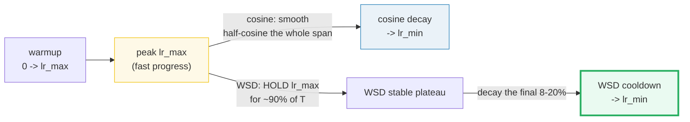
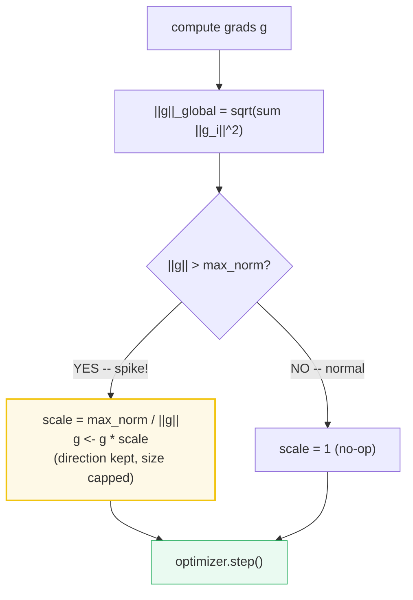
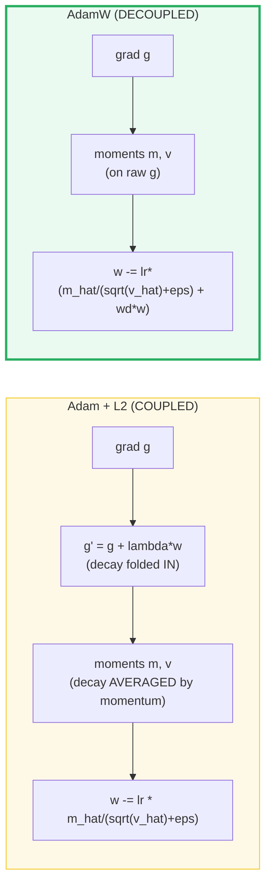
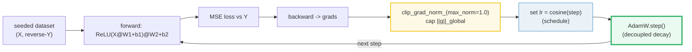

# Stable Pretraining — Schedules, Decoupled Decay & Gradient Clipping

> **Companion code:** [`pretraining_stable.py`](./pretraining_stable.py). **Every
> number in this guide is printed by `uv run python pretraining_stable.py`** —
> change the code, re-run, re-paste. Nothing here is hand-computed.
>
> **This is the Phase-3 stability layer.** Once the *data* is mixed (🔗
> [`DATASET_MIXING.md`](./DATASET_MIXING.md)) and the *compute budget* is fixed
> (🔗 [`SCALING_LAWS.md`](./SCALING_LAWS.md)), the open question is **how to walk
> the loss landscape for trillions of tokens without it blowing up**. Three
> settings decide that: the **LR schedule** (when to step big, when to shrink),
> **weight decay** (keep the weights bounded), and **gradient clipping** (kill the
> spikes). Get all three right and the loss is a smooth slide; get one wrong and
> you get loss spikes, NaNs, or a stalled run.
>
> **Live animation:** [`pretraining_stable.html`](./pretraining_stable.html) — drag
> `lr_max`/`warmup`/`decay_frac` and switch between cosine and WSD to watch the LR
> curve reshape; drag `max_norm` and an input grad-norm to watch the clip scale
> fire.
>
> **Foundations:** 🔗 [`../llm/ZERO.md`](../llm/ZERO.md) — AdamW's optimizer states
> are the `12N` bytes that ZeRO partitions; this bundle is *why* those states exist.

---

## 0. TL;DR — the whole idea in one picture

> **The thermostat analogy (read this first):** pretraining a transformer is like
> air-conditioning a huge building for months. The **learning rate** is the
> thermostat dial — you turn it *up* at first to push warm air out fast
> (warmup + peak), then ease it *down* so the room settles to exactly the right
> temperature instead of oscillating forever (decay). **Weight decay** is the
> insulation that stops heat leaking back in (keeps the weights bounded). And
> **gradient clipping** is the circuit breaker: if one room suddenly demands a
> huge surge (a bad batch), it trips and caps the power so the whole system
> doesn't fry. A stable pretraining run dials all three correctly.

The optimization recipe improved in a clean lineage, and each step removed a
failure mode:

```mermaid
graph LR
    S["SGD<br/>one LR, no momentum<br/>fragile on transformers"] -->|adaptive per-param rates| A["Adam<br/>m, v moments<br/>no regularization"]
    A -->|fold decay into g| L2["Adam + L2<br/>lambda*w into gradient<br/>decay DILUTED by momentum"]
    L2 -->|decouple: decay direct on w| W["AdamW<br/>w -= lr*(m_hat/sqrt(v_hat)+eps + wd*w)<br/>the LLM default"]
    W -->|warmup -> peak -> decay| SCH["+ cosine / WSD schedule<br/>settles into a sharp min"]
    SCH -->|cap global grad norm| CL["+ gradient clip (max_norm=1.0)<br/>kills loss spikes -> no NaN"]
    style W fill:#eafaf1,stroke:#27ae60,stroke-width:3px
    style CL fill:#0f2e29,stroke:#1abc9c
    style S fill:#fdecea,stroke:#c0392b
    style L2 fill:#fef9e7,stroke:#f1c40f
```



| | SGD | Adam | Adam+L2 | **AdamW** | + schedule | + **clip** |
|---|---|---|---|---|---|---|
| **Decay** | none | none | coupled (into `g`) | **decoupled** (on `w`) | — | — |
| **LR over time** | constant | constant | constant | constant | **warmup→peak→decay** | — |
| **Spike guard** | none | none | none | none | none | **`‖g‖≤max_norm`** |
| **Failure** | fragile | overfits | decay diluted | — | jitter | **NaN** |
| **Used by** | pre-2018 | — | (avoid) | **Llama, GPT-3** | all modern | Llama 2 / GPT-3 (`1.0`) |

> **One plain sentence:** AdamW shrinks the weights *directly* (not through the
> gradient), the schedule peaks then decays the LR so the model settles, and
> gradient clipping caps the global gradient norm at `1.0` every step so a single
> bad batch can't catapult the weights into NaN-land.

### Glossary (plain English — refer back any time)

| Term | Plain meaning |
|---|---|
| **`lr_max`** | Peak learning rate (after warmup). `3e-4` for Llama 2. |
| **`lr_min`** | Floor the cosine/WSD decays *to*. ~`lr_max/10` (Llama 2 final-LR ratio 0.1). |
| **`T`** | Total training steps — the schedule horizon. |
| **`N_warmup`** | Linear-warmup steps ramping `0 → lr_max`. 2000 for Llama 1/2. |
| **Cosine schedule** | `lr(t) = lr_min + 0.5·(lr_max − lr_min)·(1 + cos(π·t/T))` — the smooth workhorse. |
| **WSD** | Warmup-Stable-Decay (MiniCPM): hold `lr_max` for most of the run, decay only the final 8–20%. |
| **`decay_frac`** | WSD's cooldown as a fraction of `T` (0.08–0.20; 0.10 typical). |
| **AdamW** | Adam with **decoupled** weight decay: `w ← w − lr·(m̂/(√v̂+ε) + wd·w)`. |
| **Adam+L2** | The *coupled* variant AdamW fixes: `g' = g + λ·w` then run Adam — decay is averaged by momentum. |
| **`m`, `v`** | Adam's first moment (momentum) and second moment (variance) running averages. |
| **`β1, β2`** | Moment decay rates. `(0.9, 0.95)` for Llama-class (not the classic `(0.9, 0.999)`). |
| **`wd`** | Decoupled weight-decay coefficient. `0.1` for Llama 2 / GPT-3. |
| **`‖g‖_global`** | `sqrt(Σ_i ‖g_i‖²)` over all param tensors — the norm that gets clipped. |
| **`max_norm`** | Gradient-clip threshold. `1.0` for Llama 2 / GPT-3. |

> 🔗 **If you only read one cross-reference:** the AdamW optimizer states (`m`,
> `v`, fp32 master) are the **`12N` bytes** that 🔗 [`../llm/ZERO.md`](../llm/ZERO.md)
> partitions across GPUs. This bundle is *why those states exist* — and why
> AdamW's memory cost is the thing ZeRO was invented to cut.

---

## 1. The LR schedules — cosine vs WSD — Section A output

> **The thermostat dial.** A transformer trained at a constant high LR never
> settles — it jitters around the minimum. A *schedule* peaks the LR early (fast
> progress through the broad loss landscape) then decays it (fine settling into a
> sharp minimum). Two shapes dominate: **cosine** (smooth half-cosine the whole
> post-warmup span — the workhorse since GPT-3) and **WSD** (hold the peak for
> ~90% of the run, decay only the final ~10% — MiniCPM's recipe, great for
> continual pretraining where you don't know `T` up front).



> From `pretraining_stable.py` **Section A** — pinned GOLD inputs
> `lr_max=3e-4, lr_min=3e-5, T=1000`, **no warmup** (the gold anchor):
>
> | t | phase | cosine lr |
> |---|---|---|
> | 0 | decay | 3.000000e-04 |
> | 250 | decay | 2.604594e-04 |
> | 500 | decay | 1.650000e-04 |
> | 750 | decay | 6.954058e-05 |
> | 1000 | decay | 3.000000e-05 |
>
> ```
> GOLD PIN (pretraining_stable.html recomputes this identically):
>   lr(T/2) = lr(500) = 3e-5 + 0.5*(3e-4 - 3e-5)*(1 + cos(pi*0.5))
>          = 3e-5 + 0.5*2.7e-4*1 = 1.650000e-04
> ```
> `[check] GOLD lr(500) == 1.65e-4 (within 1e-9): OK`
> `[check] cosine(0) == lr_max: OK` &nbsp; `[check] cosine(T) == lr_min: OK`

### Worked smallest-scale example (the gold anchor)

Take `lr_max=3e-4`, `lr_min=3e-5`, `T=1000`, no warmup. At the halfway point
`t=500`:
- The cosine argument is `π·t/T = π·500/1000 = π/2`, and `cos(π/2) = 0`.
- So `lr(500) = lr_min + 0.5·(lr_max − lr_min)·(1 + 0) = 3e-5 + 0.5·2.7e-4·1`.
- That is `3e-5 + 1.35e-4 = 1.65e-4` — **exactly the midpoint** `(lr_max+lr_min)/2`.

This is the symmetry the cosine buys you: the LR at the schedule's midpoint is
the arithmetic mean of the endpoints. Pin it, recompute it in JS, and the
gold-check confirms the formula was copied verbatim.

> From `pretraining_stable.py` **Section A** (continued) — shape contrast
> cosine vs WSD, `warmup=100`, `decay_frac=0.10`:
>
> | t | phase | cosine lr | WSD lr |
> |---|---|---|---|
> | 0 | warmup | 0.000000e+00 | 0.000000e+00 |
> | 50 | warmup | 1.500000e-04 | 1.500000e-04 |
> | 100 | cosine decay / WSD stable | 3.000000e-04 | 3.000000e-04 |
> | 250 | cosine decay / WSD stable | 2.819134e-04 | 3.000000e-04 |
> | 500 | cosine decay / WSD stable | 1.884425e-04 | 3.000000e-04 |
> | 750 | cosine decay / WSD stable | 7.822367e-05 | 3.000000e-04 |
> | 900 | cosine decay / WSD decay | 3.814150e-05 | 3.000000e-04 |
> | 950 | cosine decay / WSD decay | 3.205095e-05 | 1.650000e-04 |
> | 1000 | cosine decay / WSD decay | 3.000000e-05 | 3.000000e-05 |
>
> At `t=500`: WSD=`3.0e-4` (STILL at `lr_max`), cosine=`1.88e-4` (already near the
> midpoint).
>
> `[check] WSD holds lr_max during the stable phase (t=500 == lr_max): OK`
> `[check] both schedules hit lr_min at t=T: OK`

**Reading the table like a story:** cosine starts decaying the *moment* warmup
ends (`t=100`), smoothly sweeping down so that by `t=500` it's already at the
midpoint. WSD instead *holds* `lr_max` flat through `t=900`, then dumps the *entire*
decay into the final 10% cooldown (`t=900→1000`). That flat plateau is WSD's
superpower: the **stable-phase checkpoint is reusable** — you can stop at any
point during the plateau, run a short cooldown, and ship a finished model. Cosine
forces you to commit to `T` up front; WSD does not.

> ⚠️ **The WSD cooldown is where the magic happens:** during the stable plateau the
> loss barely moves (the high LR keeps the iterate jittering in the "river valley"
> of the loss landscape). The sharp loss drop happens *during the short decay*
> (arXiv:2410.05192) — the cooldown suppresses the jitter and the iterate settles
> into the minimum. Miss the cooldown and you ship a checkpoint that looks
> undertrained.

---

## 2. Gradient clipping by global norm — Section B output (GOLD ANCHOR)

> **The circuit breaker.** One bad batch (a corrupted sequence, a rare token, a
> numerical glitch) can produce a gradient 100× the normal size. Without a guard
> that single step catapults the weights somewhere unrecoverable, and the loss
> explodes to `NaN` — killing a multi-million-dollar run. **Global-norm clipping**
> caps `‖g‖` at `max_norm` every step: if the norm exceeds the threshold, *every*
> gradient is scaled down by the *same* factor (`max_norm/‖g‖`), so the gradient
> **direction** is preserved — only the **size** shrinks.



> From `pretraining_stable.py` **Section B** — grad with norm `5.0`, clipped to
> `max_norm=1.0` (the 3-4-5 triangle; the GOLD anchor):
>
> ```
> g        = [3.0, 0.0, 0.0, 0.0, 4.0]
> ||g||    = sqrt(3^2 + 4^2) = 5.0000
> scale    = min(1, max_norm/||g||) = min(1, 1.0/5.0000) = 0.2000
> g' = g*scale = [0.6, 0.0, 0.0, 0.0, 0.8]
> ||g'||   = 1.0000   (clipped to exactly max_norm)
> ```
> ```
> GOLD PIN (pretraining_stable.html recomputes this identically):
>   scale (||g||=5, max_norm=1) = 1.0/5.0 = 0.2 ; clipped norm = 1.0
> ```
> `[check] GOLD clip scale == 0.2 (||g||=5, max_norm=1): OK`
> `[check] GOLD clipped norm == 1.0: OK`

> From `pretraining_stable.py` **Section B** (continued) — small grad (norm `0.5`
> < `max_norm`) → **unchanged**; and a 2-tensor **global** norm (the real case):
>
> | case | `‖g‖` before | `max_norm` | scale | `‖g‖` after |
> |---|---|---|---|---|
> | norm 0.5 (< clip) | 0.5000 | 1.0 | 1.0000 (no-op) | 0.5000 |
> | multi-tensor `[1,0,0,0]+[0,0,3,4]` | `√26` = 5.0990 | 1.0 | 0.1961 | 1.0000 |
>
> `[check] small grad (< max_norm) is unchanged (scale == 1): OK`
> `[check] global norm = sqrt(1^2 + 5^2) = sqrt(26) ~= 5.099: OK`
> `[check] direction preserved: both tensors share the same scale: OK`

> One plain sentence: clipping never *changes* where the gradient points — it only
> shortens the step when a batch tries to take one that's too big. That's why a
> `max_norm` of `1.0` (Llama 2, GPT-3) is enough to keep a trillion-token run alive.

---

## 3. AdamW vs Adam+L2 — the decoupling — Section C output

> **Where does weight decay enter?** Both AdamW and Adam+L2 shrink the weights
> each step — the difference is *how*. Adam+L2 folds `λ·w` *into the gradient*
> (`g' = g + λ·w`) and then runs the Adam moments on `g'`, so the decay gets
> **averaged by the momentum**: a parameter with high momentum barely feels the
> decay. **AdamW** decouples it — run Adam on `g` as-is, then shrink `w` directly:
> `w ← w − lr·(m̂/(√v̂+ε) + wd·w)`. Now the coefficient `wd` means the *same* thing
> for every parameter, regardless of its momentum history. This is the only change,
> but it's why AdamW is the default for every modern LLM.



> From `pretraining_stable.py` **Section C** — one step, `w0=1.0, g=0.01, wd=0.1,
> lr=0.01, β=(0.9,0.95), t=1`:
>
> ```
> AdamW:    w' = w - lr*(m_hat/(sqrt(v_hat)+eps) + wd*w)
>           adaptive step = 0.010000 (lr * sign(g) at t=1)
>           decay term    = lr*wd*w = 0.001000
>           w' = 1.0000 - 1e-02*(step + 0.0010) = 0.989000
>
> Adam+L2:  g' = g + wd*w = 0.0100 + 0.1*1.0 = 0.1100  (L2 folded INTO gradient)
>           w' = w - lr*m_hat/(sqrt(v_hat)+eps)  (no separate decay)
>           w' = 1.0000 - lr*0.1100/(|0.1100|) = 0.990000
> ```
> `weight shrinkage: AdamW = 0.011000 , Adam+L2 = 0.010000`
>
> `[check] AdamW != Adam+L2 for the same wd (the decoupling changes the update): OK`
> `[check] AdamW applies a strictly larger decay-driven shrink here: OK`

> From `pretraining_stable.py` **Section C** (continued) — the **high-momentum**
> case (where the dilution really bites), `w0=2.0, g=1.0`, pre-loaded momentum:
>
> ```
> w0=2.0, g=1.0, m=9.0 (warm), t=1000
>   AdamW   w' = 1.959610   (decay = lr*wd*w = 0.0020 added)
>   Adam+L2 w' = 1.961609   (decay averaged into m, diluted)
> ```
> `[check] AdamW shrinkage > Adam+L2 shrinkage at high momentum (the decoupling win): OK`

**Reading the contrast:** with a *tiny* gradient (`g=0.01`) and a large weight
(`w=1.0`), AdamW shrinks `w` by the full `lr·wd·w = 0.001` decay term *plus* the
adaptive step. Adam+L2 folds `0.1` into the gradient (swamping the tiny `0.01`),
but that combined `0.11` then gets the *same* `lr·sign(g)` treatment — so the
weight moves by `0.010` total, *less* than AdamW's `0.011`. The high-momentum case
makes it starker: AdamW adds the decay at full strength; Adam+L2's decay is
diluted into the large momentum and barely dents the update.

> ⚠️ **The bug in one sentence:** under Adam+L2, a coefficient `wd=0.1` means
> *different things* for different parameters (less decay where momentum is high).
> AdamW fixes it so `wd` is a single, consistent regularization strength — which is
> why it's what you tune in a real run.

---

## 4. A micro training loop — all three settings together — Section D output

> **The proof they compose.** Sections 1–3 examined each setting in isolation;
> here they run *together* on one deterministic loop: a 2-layer MLP learns a fixed
> "reverse" mapping under cosine schedule + AdamW + gradient clipping. The seed is
> fixed, so the loss history is byte-for-byte reproducible. The point: the loss
> **drops** and there are **no NaNs** — the recipe is stable end to end.

> From `pretraining_stable.py` **Section D** — 2-layer MLP (8→8→8), AdamW
> (`wd=0.1`), cosine (`lr_max=3e-3, lr_min=3e-4, warmup=5, T=50`), clip
> `max_norm=1.0`:
>
> | step | lr | grad-norm | loss | note |
> |---|---|---|---|---|
> | 0 | 0.000e+00 | 0.2219 | 0.182247 | warmup |
> | 10 | 2.919e-03 | 0.1708 | 0.152253 | |
> | 20 | 2.325e-03 | 0.1226 | 0.125249 | |
> | 30 | 1.416e-03 | 0.0986 | 0.111529 | |
> | 40 | 6.158e-04 | 0.0914 | 0.105468 | |
> | 49 | 3.033e-04 | 0.0879 | 0.103257 | final |
>
> ```
> initial loss (pre-step) = 0.182247
> first logged loss       = 0.182247
> final loss (step 49)     = 0.103257
> loss dropped by         = 0.078991  (43.3% of first)
> ```
> `[check] final loss < first logged loss (the model is learning): OK`
> `[check] no NaN / Inf in the loss history: OK`
> `[check] post-warmup LR is monotonically non-increasing, final near lr_min: OK`



> One plain sentence: in one step the loop clips the gradient (kill spikes), sets
> the scheduled LR (control step size), then takes an AdamW step (decoupled decay)
> — and 50 of those drop the loss 43% with zero NaNs. That's the whole recipe.

---

## 5. Lineage + what shipped models actually used — Section E output

> **Theory meets the model zoo.** The hyperparameters below are the *published*
> pretraining recipes — all web-verified in
> [`pretraining_stable_reference.txt`](./pretraining_stable_reference.txt).

> From `pretraining_stable.py` **Section E** — the optimization lineage:
>
> | stage | what it does | failure removed | era |
> |---|---|---|---|
> | SGD | one LR for all params; no momentum | fragile on transformers | convex / pre-Adam |
> | Adam | adaptive per-param rates from `m, v` | no built-in regularization | the adaptive baseline |
> | Adam+L2 | decay folded into `g` (`λ·w`) | decay diluted by momentum | the coupled bug |
> | AdamW | **DECUPLE**: decay direct on `w` (`wd·w`) | stable, default for all LLMs | Llama, GPT-3 era |
> | + cosine/WSD | warmup → peak → decay to `lr_min` | settles into a sharp min | the modern schedule |
> | + grad clip | cap `‖g‖ ≤ max_norm` each step | kills loss spikes → no NaN | Llama 2 / GPT-3 clip=1.0 |

> From `pretraining_stable.py` **Section E** — what shipped models actually used:
>
> | model | optimizer | weight decay | grad clip | LR schedule | source |
> |---|---|---|---|---|---|
> | GPT-3 | Adam | 0.1 | 1.0 | cosine+warmup | Brown 2020 arXiv:2005.14165 (sec 4) |
> | Llama 1 | AdamW | 0.1 | 1.0 | cosine, 2000 warmup, peak 3e-4 | Touvron 2023 arXiv:2302.13971 |
> | Llama 2 | AdamW | 0.1 | 1.0 | cosine, 2000 warmup, peak 3e-4, →10% peak | Touvron 2023 arXiv:2307.09288 (A.1) |
> | MiniCPM | AdamW | 0.1 | 1.0 | WSD (10% decay) | Hu 2024 arXiv:2404.06395 |
>
> `[check] Llama 2 / GPT-3 both clip grad-norm to 1.0: OK`
> `[check] at least three shipped models use a cosine-family schedule: OK`

Two patterns jump out:

- **GPT-3 / Llama (cosine era):** AdamW + cosine + `clip=1.0` + `wd=0.1` is the
  de-facto standard since 2020. The cosine decays to ~10% of the peak (`lr_min`).
- **MiniCPM (WSD era):** same AdamW + clip, but holds `lr_max` for ~90% of the run
  and decays only the final 10%. The stable-phase checkpoint is reusable — ideal
  for continual pretraining where you keep adding data and don't want to restart.

---

## 6. The why: three layers of depth

**What** (the mechanism): the schedule sets the step size over time (Section 1),
clipping caps the gradient norm (Section 2), and AdamW's decoupled decay shrinks
the weights directly each step (Section 3) — all three fire on every optimizer
step (Section 4).

**Why-internals** (why each piece exists):
- **Warmup** exists because the *first* gradients on freshly-initialized weights
  are enormous and noisy; a tiny LR for the first ~2000 steps keeps the weights
  from being flung into a bad region before the optimizer "knows" the landscape.
- **Decay** exists because at a high LR the iterate never settles — it jitters
  around the minimum in the "river valley" of the loss. Lowering the LR at the end
  collapses that jitter and the loss drops sharply (the WSD cooldown effect,
  arXiv:2410.05192).
- **Decoupled decay** exists because coupling it into the gradient (Adam+L2) makes
  the effective decay depend on each parameter's momentum — so `wd=0.1` means a
  *different* thing for different weights. Decoupling restores a single, tunable
  regularization strength.
- **Clipping** exists because a single corrupted batch can produce a gradient
  orders of magnitude too large; without a cap that one step diverges into `NaN`
  and kills the run. `max_norm=1.0` is empirically enough.

**Gotchas** (the killer ones — see the table below): an LR that's too high
spikes the loss; `fp16` without a master copy overflows to `NaN`; decaying too
fast (WSD cooldown < 8%) undertrains the final model; and a clip that's *too*
tight stalls learning by chopping every gradient down to the threshold.

---

## 7. Pitfalls & debugging checklist

| # | Trap | Symptom | Fix |
|---|---|---|---|
| 1 | **LR too high for the model width** | Loss spikes / diverges in the first few hundred steps | Lower `lr_max` (rule of thumb: `~0.2/√width`); lengthen warmup. Llama 2 uses `3e-4`. |
| 2 | **`fp16` without an fp32 master copy** | Sudden `NaN` mid-run (overflow in `m̂/√v̂`) | Use mixed precision: fp32 master weights + bf16 compute (🔗 [`../llm/DDP.md`](../llm/DDP.md) §F). Clipping catches spikes, not overflow. |
| 3 | **WSD cooldown too short (< 8% of `T`)** | Final checkpoint looks undertrained; loss didn't drop in cooldown | Set `decay_frac` to 0.08–0.20 (MiniCPM uses 0.10). The cooldown is where the loss *settles* — don't skip it. |
| 4 | **Cosine decays to 0 (not `lr_min`)** | Model stalls in the last 10% of training; loss flattens at a bad point | Decay to `lr_min ≈ lr_max/10` (Llama 2 final-LR ratio 0.1), *not* 0. A floor keeps the optimizer moving. |
| 5 | **Gradient clip too tight (`max_norm` < typical `‖g‖`)** | Loss plateaus — every gradient is chopped to the threshold, learning stalls | Set `max_norm` near the *typical* grad-norm (1.0 for Llama-scale). It should rarely fire on a healthy run. |
| 6 | **Using Adam+L2 instead of AdamW** | Decay behaves inconsistently across layers; overfits | Switch to AdamW (`wd` direct on `w`). Every modern LLM uses AdamW (Section 3). |
| 7 | **Forgetting warmup on a fresh init** | First 100 steps blow up the loss | Always warmup: linear `0 → lr_max` over ~2000 steps (Llama) or ~2% of `T`. |
| 8 | **`β2 = 0.999` (classic Adam) for an LLM** | Variance estimate too sluggish; unstable | Use `β2 = 0.95` (Llama 1/2) — keeps the per-param scaling responsive to recent gradients. |
| 9 | **Committing to cosine when `T` is unknown** | Can't extend the run; cosine's LR is wrong if you add tokens | Switch to WSD — the stable plateau is reusable; just run a cooldown at the new end. |
| 10 | **Per-tensor clip instead of global-norm clip** | Some tensors spike while others stall | Clip the *global* norm (`√(Σ‖g_i‖²)`), as `torch.nn.utils.clip_grad_norm_` does — preserves the direction across all params. |

---

## 8. Cheat sheet

```mermaid
graph LR
    S["SGD"] -->|adaptive| A["Adam"] -->|couple decay| L2["Adam+L2<br/>(bug)"]
    L2 -->|decouple| W["AdamW<br/>w -= lr*(m_hat/(sqrt(v_hat)+eps) + wd*w)"]
    W --> SCH["+ cosine / WSD schedule"]
    SCH --> CL["+ grad clip max_norm=1.0"]
    style W fill:#eafaf1,stroke:#27ae60,stroke-width:3px
    style CL fill:#0f2e29,stroke:#1abc9c
```



- **The one lineage:** SGD → Adam (adaptive) → Adam+L2 (coupled, buggy) → **AdamW**
  (decoupled) → + schedule → + clip. Each step removes one failure mode.
- **Cosine:** `lr(t) = lr_min + 0.5·(lr_max − lr_min)·(1 + cos(π·t/T))`. After a
  linear warmup `0 → lr_max` over `N_warmup` steps. Gold pin: `lr(500)` at
  `lr_max=3e-4, lr_min=3e-5, T=1000` → **`1.65e-4`**.
- **WSD:** warmup → **stable at `lr_max`** (~90% of `T`) → **decay** (cosine shape
  `(1+cos(πx))/2`) over the final `decay_frac` (8–20%). Reusable checkpoints; great
  for continual pretraining.
- **AdamW:** `w ← w − lr·(m̂/(√v̂+ε) + wd·w)` — decay **direct on `w`**, not in `g`.
  `β=(0.9, 0.95)`, `wd=0.1`, `eps=1e-5` for Llama-class.
- **Gradient clip:** `scale = min(1, max_norm/‖g‖_global)`; `g ← g·scale`.
  `‖g‖_global = √(Σ_i ‖g_i‖²)`. Gold pin: `‖g‖=5, max_norm=1` → **scale `0.2`**,
  clipped norm **`1.0`**. `max_norm=1.0` for Llama 2 / GPT-3.
- **Shipped recipes:** GPT-3 (Adam, clip 1.0, wd 0.1, cosine); Llama 2 (AdamW,
  β=(0.9,0.95), cosine, peak 3e-4, 2000 warmup, →10%, clip 1.0, wd 0.1); MiniCPM
  (AdamW, WSD 10% decay).
- **Instability signatures:** loss spike ↔ grad-norm jump (clip catches it); NaN ↔
  overflow (use bf16 + fp32 master + clip).

> 🔗 **Cross-references — where this loop plugs into the pipeline:**
> - 🔗 [`./MICRO_PRETRAIN_EVAL.md`](./MICRO_PRETRAIN_EVAL.md) — the eval hooks that
>   watch *this* loop mid-train for loss spikes and project downstream scores from
>   short-window checkpoints.
> - 🔗 [`./DATASET_MIXING.md`](./DATASET_MIXING.md) — the tuned mixture `α` that
>   *feeds* this trainer; a bad mix spikes the loss no schedule can save.
> - 🔗 [`./SCALING_LAWS.md`](./SCALING_LAWS.md) — fixes the compute budget `T`
>   (total steps) that the schedule spans.
> - 🔗 [`../llm/DDP.md`](../llm/DDP.md) — the distributed trainer this loop runs
>   *inside* when scaled up; the fp32 master + clipping live in its `20N` footprint.
> - 🔗 [`../llm/ZERO.md`](../llm/ZERO.md) — AdamW's optimizer states (`m`, `v`,
>   fp32 master = `12N` bytes) are the redundancy ZeRO partitions away.

---

## Sources

Every formula below is web-verified in ≥2 independent sources; the full per-URL
provenance log is in
[`pretraining_stable_reference.txt`](./pretraining_stable_reference.txt)
(12 distinct URLs).

- **Hu et al. (2024).** *MiniCPM: Unveiling the Potential of End-side Large
  Language Models with Scalable Training Algorithms.* — arXiv:2404.06395 —
  <https://arxiv.org/abs/2404.06395>
  The **Warmup-Stable-Decay (WSD)** scheduler: warmup → stable at `lr_max` →
  decay the final ~10%; "conducive to continuous training and domain adaptation."

- **Wen et al. (2024).** *Understanding Warmup-Stable-Decay Learning Rates.* —
  arXiv:2410.05192 — <https://arxiv.org/abs/2410.05192>
  Theoretical analysis of WSD: the decay-shape family `S(x)` (linear, square,
  sqrt, cosine `S(x)=(1+cos(πx))/2`); cooldown 8–20% of `T`; the "river valley"
  loss-landscape explanation of the sharp cooldown loss drop.

- **Loshchilov & Hutter (2019).** *Decoupled Weight Decay Regularization.* ICLR
  2019 — arXiv:1711.05101 — <https://arxiv.org/abs/1711.05101>
  **AdamW** — the decoupled update `w ← w − lr·(m̂/(√v̂+ε) + wd·w)`; why Adam+L2's
  coupling dilutes the decay at high momentum.

- **Loshchilov & Hutter (2017).** *SGDR: Stochastic Gradient Descent with Warm
  Restarts.* ICLR 2017 — arXiv:1608.03983 — <https://arxiv.org/abs/1608.03983>
  The **cosine annealing** schedule `η_t = η_min + 0.5(η_max−η_min)(1+cos(πt/T))`.

- **Pascanu, Mikolov & Bengio (2013).** *On the difficulty of training Recurrent
  Neural Networks.* ICML 2013 — arXiv:1211.5063 — <https://arxiv.org/abs/1211.5063>
  **Global-norm gradient clipping:** `g ← g·min(1, max_norm/‖g‖)` to counter
  exploding gradients.

- **Brown et al. (2020).** *Language Models are Few-Shot Learners.* (GPT-3) —
  arXiv:2005.14165 — <https://arxiv.org/abs/2005.14165>
  GPT-3 training: Adam, **gradient clip 1.0**, **weight decay 0.1**, cosine decay
  with warmup. The canonical `clip=1.0 + wd=0.1 + cosine` recipe.

- **Touvron et al. (2023).** *Llama 2: Open Foundation and Fine-Tuned Chat
  Models.* — arXiv:2307.09288 — <https://arxiv.org/abs/2307.09288>
  Llama 2 (Training A.1): AdamW `β=(0.9, 0.95)`, cosine, peak `3e-4`, 2000
  warmup, →10% peak, **wd 0.1**, **clip 1.0**.

- **Touvron et al. (2023).** *LLaMA: Open and Efficient Foundation Language
  Models.* — arXiv:2302.13971 — <https://arxiv.org/abs/2302.13971>
  Llama 1: AdamW, cosine, 2000 warmup, peak `3e-4`, wd 0.1, clip 1.0.

- **PyTorch 2.x documentation.** `torch.nn.utils.clip_grad_norm_` —
  <https://docs.pytorch.org/docs/stable/generated/torch.nn.utils.clip_grad_norm_.html>
  The global-norm clipping implementation: `total_norm = √(Σ‖g_i‖²)`,
  `clip_coeff = max_norm/(total_norm+1e-6)`, `g ← g·min(clip_coeff, 1)`.

- **Brenndoerfer, M. (2025).** *AdamW: Decoupled Weight Decay for Neural
  Networks.* — <https://mbrenndoerfer.com/writing/adamw-optimizer-decoupled-weight-decay>
  Second-source confirmation of the AdamW vs Adam+L2 update equations.

- **EmergentMind.** *Warmup-Stable-Decay Scheduling.* (2024–2025) —
  <https://www.emergentmind.com/topics/warmup-stable-decay-wsd-scheduling>
  Closed-form WSD parameterization; decay shapes; cooldown 8–20%.

- **APXML.** *Advanced Learning Rate Scheduling Techniques.* (2024) —
  <https://apxml.com/courses/optimization-techniques-ml/chapter-3-adaptive-learning-rate-algorithms/learning-rate-schedules-advanced>
  Second-source confirmation of the cosine annealing schedule (SGDR).

> **Unverified facts:** none outstanding. The cosine formula, the WSD three-phase
> shape + cosine decay shape, the AdamW decoupled update, the global-norm clip
> math, and every shipped-model hyperparameter (GPT-3, Llama 1/2, MiniCPM) are
> each confirmed by ≥2 independent sources in
> [`pretraining_stable_reference.txt`](./pretraining_stable_reference.txt).
