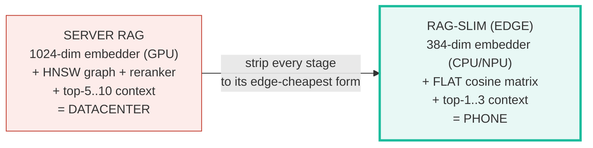
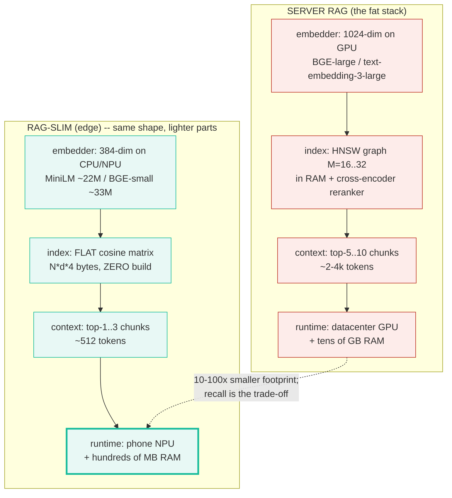
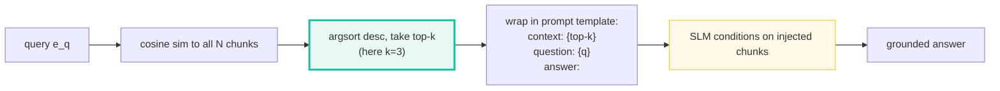
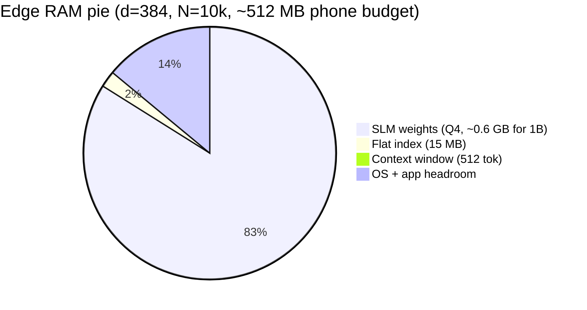
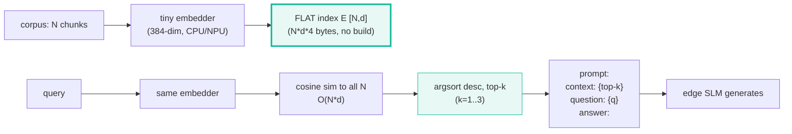

# RAG-Slim — Retrieval-Augmented Generation for the Edge (Phone / NPU / WASM)

> **Companion code:** [`rag_slim.py`](./rag_slim.py). **Every number in this
> guide is printed by `uv run python rag_slim.py`** — change the code, re-run,
> re-paste. Nothing here is hand-computed.
>
> **This is the Phase-5 grounding bundle.** A fat server-side RAG stack
> (1024-dim embedder on GPU + HNSW graph in RAM + cross-encoder reranker + a
> generous context window) needs a datacenter. **RAG-Slim** strips every
> component to its edge-cheapest form — a tiny 384-dim embedder, a **flat
> cosine index**, and a tight context budget — so the whole pipeline fits on a
> phone **alongside** the SLM. The trade is recall for footprint.
>
> **Live animation:** [`rag_slim.html`](./rag_slim.html) — type a query, watch
> the live cosine-sim bars rank the toy corpus and assemble the context prompt;
> drag `d` and `N`, watch the index-memory bar react to the device RAM cap.
>
> **Foundations:** 🔗 [`../vector-db/VECTOR_DATABASES.md`](../vector-db/VECTOR_DATABASES.md)
> — the full-fat retrieval stack this slim variant strips down.

---

## 0. TL;DR — the whole idea in one picture

> **The backpack analogy (read this first):** Server RAG is a search team with
> a satellite uplink, a library card catalog, and a translator — it returns the
> perfect passage but needs a van full of gear. **RAG-Slim** is the same team
> shrunk to fit a backpack: a pocket dictionary (tiny 384-dim embedder), a
> single laminated index card (the flat matrix), and room for only 1–3 pages of
> notes (the tight context budget). It finds slightly worse passages — but it
> fits where the team cannot even stand up: a phone, a browser tab, an NPU.

The RAG pipeline shape never changes — **embed → index → query embed →
top-k → inject → SLM generates**. What changes between server and edge is the
*weight class* of each stage. RAG-Slim is the deliberate downsize:



| | Server RAG (fat) | **RAG-Slim (edge)** |
|---|---|---|
| **Embedder** | 1024-dim on GPU (BGE-large, text-embedding-3-large) | **384-dim on CPU/NPU** (all-MiniLM-L6-v2 ~22M, BGE-small ~33M) |
| **Index** | HNSW graph (M=16–32) in RAM + cross-encoder reranker | **FLAT cosine matrix** — `N·d·4` bytes, zero build cost |
| **Context** | top-5..10 chunks, ~2–4k tokens | **top-1..3 chunks**, ~512 tokens |
| **Runtime** | datacenter GPU + tens of GB RAM | phone NPU + hundreds of MB RAM |
| **Recall** | highest (big embedder + reranker) | traded for footprint (fits a phone) |
| **Query cost** | O(log N · d) (HNSW) | O(N · d) (brute-force — fine at small N) |

> **One plain sentence:** keep the pipeline shape, downgrade every stage to the
> smallest version that still works, and the whole RAG stack drops from a
> datacenter rack onto a phone — at the cost of some retrieval recall.

### Glossary (plain English — refer back any time)

| Term | Plain meaning |
|---|---|
| **Embedding `e_c`** | A chunk `c` mapped to a fixed-length float vector in R^d. "Semantic closeness" = "small angle". Here `d=8` (toy); real edge embedders use `d=384`. |
| **Embedder** | The model that produces `e_c`. RAG-Slim uses a *small* one (~22M–33M params) that runs on CPU/NPU in milliseconds. **NOT** a real model in this bundle — vectors are hardcoded so the index math is the focus. |
| **`d` (dim)** | Embedding dimension. 384 for MiniLM/BGE-small (the edge default); 768–1024 for server embedders. |
| **`N` (corpus size)** | Number of chunks in the index. Edge regime: `< 10k` (often `< 1k`). Server regime: `10M+`. |
| **Flat index `E`** | Just the `[N, d]` matrix whose row `c` is `e_c`. No graph, no centroids, no build step — *this matrix is the whole index*. |
| **Cosine similarity** | `sim(q, c) = (e_q · e_c) / (‖e_q‖·‖e_c‖)`. In `[-1, 1]`; 1 = same direction. For L2-normalized vectors it collapses to the plain dot product. |
| **top-k retrieval** | The `k` chunks with the highest `sim(q, c)`, sorted descending. RAG-Slim injects only `k=1..3`. |
| **Context budget** | How many tokens of retrieved text fit in the SLM's window. Edge: ~512 tokens. Server: ~2–4k. |
| **HNSW** | Hierarchical Navigable Small World — the graph ANN index server RAG uses. O(log N) query but O(N log N) build + graph memory. Pure overhead below ~100k chunks. |
| **Reranker** | A cross-encoder that re-scores the top-k for higher recall. Server RAG ships one; RAG-Slim drops it (too heavy for edge). |

> 🔗 **If you only read one cross-reference:** the flat-vs-HNSW-vs-IVF-PQ
> decision rule comes straight from
> [`../vector-db/VECTOR_DATABASES.md`](../vector-db/VECTOR_DATABASES.md) —
> "N < 100K → Flat; 100K–10M → HNSW; 10M+ → IVF-PQ". RAG-Slim is simply the
> *consequence* of running that rule on-device, where N is small by definition.

---

## 1. The lineage — server RAG → edge RAG, component by component

> **Why each downgrade happened.** A phone has ~hundreds of MB of RAM to share
> between the SLM *and* its retrieval stack, and an NPU/CPU instead of an A100.
> Every component of server RAG is sized for a world with neither constraint, so
> each one must be re-picked for the edge regime.



| Component | Server (fat) | Edge (slim) | **Why the downgrade** |
|---|---|---|---|
| Embedder | 1024-dim, GPU | **384-dim, CPU/NPU** | A 1024-dim BGE-large won't boot on a phone; all-MiniLM-L6-v2 (~22M params) embeds in single-digit ms on CPU/NPU. The cost: lower top-k recall (no cross-encoder to recover it). |
| Index | HNSW + reranker | **Flat cosine matrix** | HNSW's O(log N) win only matters at N > ~1M. At edge corpus sizes (< 10k–100k) brute-force cosine is already sub-millisecond, and HNSW's O(N log N) build + graph memory are pure overhead. |
| Context | top-5..10, ~2–4k tok | **top-1..3, ~512 tok** | The SLM's window + RAM are shared with the index; a 2–4k-token context would starve both. Inject only the highest-sim chunks. |
| Runtime | datacenter | **phone** | The whole point: this stack boots where the fat one would OOM. |

> **One plain sentence:** RAG-Slim is server RAG with every dial turned to the
> lowest setting that still retrieves *something* useful — the 384-dim embedder,
> the flat matrix, and the 3-chunk context are each the floor of their axis.

---

## 2. The flat index — Section A output

> **A matrix, not a graph.** Server RAG builds an HNSW graph because at 10M+
> vectors a brute-force scan is too slow. On the edge the corpus is small
> (a product FAQ, a user's notes, a codebase) — so the index is literally just
> the `[N, d]` matrix of chunk embeddings. Retrieval is one matrix-vector
> product; there is no build step and no auxiliary graph memory.

For the toy corpus (`N=5` chunks, `d=8` — small for printability; real edge
embedders use `d=384`):

> From `rag_slim.py` **Section A**:
>
> | id | text | embedding `e_c` (d=8) |
> |----|------|------------------------|
> | c0 | cats are popular pets | `[+0.80, +0.60, +0.10, +0.05, +0.00, +0.15, +0.20, +0.10]` |
> | c1 | dogs are loyal pets | `[+0.70, +0.65, +0.05, +0.00, +0.00, +0.10, +0.25, +0.30]` |
> | c2 | python is a language | `[+0.10, +0.05, +0.85, +0.00, +0.75, +0.00, +0.15, +0.10]` |
> | c3 | rust is a language | `[+0.05, +0.00, +0.80, +0.00, +0.80, +0.00, +0.20, +0.15]` |
> | c4 | rain is wet weather | `[+0.00, +0.00, +0.00, +0.85, +0.00, +0.80, +0.00, +0.05]` |
>
> Flat index `E` shape = `(5, 8)` = `[N=5, d=8]`. Index memory = `N·d·4` =
> `5·8·4` = **160 bytes** (raw float32).

**Reading the matrix:** the dims carry readable "semantic" axes (`d0`~animal,
`d1`~pet, `d2`~language, `d3`~weather, …) so the cosine rankings below are
interpretable. c0 and c1 (pets) point the same way; c2 and c3 (languages)
point another; c4 (weather) a third. **Real embedders learn these axes from
data** — the math is identical, only the numbers are learned instead of
hand-picked.

> **The embedder is NOT a real model here.** This bundle hardcodes the vectors
> so the *index + retrieval* math is the focus. Plugging in
> `all-MiniLM-L6-v2` (384-dim, ~22M params) swaps the numbers but not one line
> of the retrieval code.

---

## 3. Retrieve — cosine similarity + top-k — Section B output (GOLD ANCHOR)

> **The retrieval step.** Embed the query the same way, compute cosine
> similarity to every chunk, sort descending, take the top `k`. This is the
> entire retrieval algorithm — `O(N·d)` work, no approximations.

Query `"what are kittens like"` → `e_q = [+0.75, +0.55, +0.05, +0.00, +0.00, +0.10, +0.15, +0.05]`.

> From `rag_slim.py` **Section B**:
>
> | chunk | text | cosine(q, c) |
> |-------|------|--------------|
> | **c0** | **cats are popular pets** | **+0.9954** |
> | c1 | dogs are loyal pets | +0.9608 |
> | c2 | python is a language | +0.1574 |
> | c3 | rust is a language | +0.1044 |
> | c4 | rain is wet weather | +0.0743 |
>
> **top-3 retrieval** (argsort cosine, descending):
> - rank 0: **c0** (cats are popular pets) — cosine = **0.9954**
> - rank 1: c1 (dogs are loyal pets) — cosine = 0.9608
> - rank 2: c2 (python is a language) — cosine = 0.1574

**GOLD ANCHOR (pinned for `rag_slim.html`):**

> - **top-1 chunk id = `c0`**
> - **top-1 cosine sim = `0.9954`**

The `.html` reproduces the *exact same* chunk/query vectors in JS, recomputes
cosine, and the `[check: OK]` badge asserts the top-1 sim matches within
`1e-3`.

**Reading the result:** the query "what are kittens like" is an animal/pet
vector, so it lands closest to c0 (cats) and c1 (dogs) — both pet vectors, both
high cosine. The language chunks (c2, c3) are near-orthogonal (cosine ≈ 0.1);
the weather chunk (c4) is fully near-orthogonal. **This is dense-vector
semantic retrieval in 8 dimensions.** A 384-dim real embedder does the same
arithmetic with higher-resolution directions.

### Why cosine (and not raw dot product)?

```
sim(q, c) = (e_q · e_c) / (‖e_q‖ · ‖e_c‖)
```

The division by norms makes the score a pure *angle* measure (in `[-1, 1]`),
independent of vector magnitude. Two passages of very different lengths
(different norms) but the same *meaning* (same direction) get cosine ≈ 1.
Server stacks often **L2-normalize once at index time** and then use the
cheaper dot product — mathematically identical (🔗
[`../vector-db/VECTOR_DATABASES.md`](../vector-db/VECTOR_DATABASES.md) §2).

---

## 4. Context injection — Section C output

> **Tight budget, top-k only.** Server RAG stuffs 5–10 chunks (~2–4k tokens)
> into the prompt. On the edge the SLM's window is shared with the index and
> the model weights, so RAG-Slim injects only the top 1–3 chunks and assembles
> them into the canonical `context / question / answer` template.

> From `rag_slim.py` **Section C** — assembled prompt (top-3 injected):
>
> ```
> context:
> [c0] cats are popular pets
> [c1] dogs are loyal pets
> [c2] python is a language
>
> question: what are kittens like
> answer:
> ```
>
> | metric | value |
> |---|---|
> | toy token budget | 60 words |
> | tokens used by context | 12 |
> | tokens used by full prompt | 22 |



> **One plain sentence:** the SLM never sees the raw corpus — it sees a tiny
> prompt whose `context:` block is the top-k cosine winners, and it generates
> `answer:` conditioned on those chunks alone.

> 🔗 The retrieved context is only useful if the model's *answer* is faithful
> to it. After injection, verify the model's claims against the retrieved facts
> — that is the 🔗 [`GROUNDING_ASSERTION.md`](./GROUNDING_ASSERTION.md) bundle
> (this bundle's Phase-5 sibling). And if the answer must be machine-parseable
> (JSON, a number), the 🔗 [`GRAMMAR_MASKING.md`](./GRAMMAR_MASKING.md) bundle
> masks the logits so the constrained output survives the small model's noise.

---

## 5. The memory-budget table — Section D output

> **Does it fit the phone?** The flat index is `N·d·4` bytes — a single
> float32 matrix. Sweep embedder dims `{128, 384, 768}` × corpus sizes
> `{1k, 10k, 100k}` against a 512 MB edge RAM budget:

> From `rag_slim.py` **Section D**:
>
> **GOLD PIN:** `d=384, N=10000` → index = `10000·384·4` = **15,360,000 bytes**
> (15.36 MB decimal / 14.65 MiB).
>
> | d | N | index bytes | = MB (decimal) | fits 512 MB? |
> |---|---|---|---|---|
> | 128 | 1,000 | 512,000 | 0.51 | yes |
> | 128 | 10,000 | 5,120,000 | 5.12 | yes |
> | 128 | 100,000 | 51,200,000 | 51.20 | yes |
> | 384 | 1,000 | 1,536,000 | 1.54 | yes |
> | **384** | **10,000** | **15,360,000** | **15.36** | **yes** |
> | 384 | 100,000 | 153,600,000 | 153.60 | yes |
> | 768 | 1,000 | 3,072,000 | 3.07 | yes |
> | 768 | 10,000 | 30,720,000 | 30.72 | yes |
> | 768 | 100,000 | 307,200,000 | 307.20 | yes |



**Reading the table:** even the *largest* cell (`d=768, N=100k`) is 307 MB —
under a phone budget, and that's a corpus 10× bigger than any realistic edge
use case. The 384-dim row (the MiniLM/BGE-small class — the edge default) is
15 MB at `N=10k`. **The flat index is tiny because it is just a matrix**: no
HNSW graph edges, no IVF centroids, no reranker weights.

> **Contrast with server RAG:** an HNSW graph adds `M·N·4` bytes of edge
> pointers (`M=16..32`) *on top* of the matrix, plus needs an `O(N log N)`
> build pass that itself allocates working memory. At `N=10k` that graph is
> pure overhead — brute-force cosine on a `10k × 384` matrix is already
> sub-millisecond on a phone NPU, with zero build cost and zero auxiliary
> memory.

---

## 6. Why flat wins at small N — Section E output

> **The crossover.** HNSW's `O(log N)` query beats flat's `O(N)` only once `N`
> is large enough that the log-N savings outweigh the constant cost of graph
> traversal. On the edge `N` is small *by definition* (a user's notes, a
> product FAQ, a single codebase), so the crossover is never reached and HNSW's
> build cost + graph memory are dead weight.

> From `rag_slim.py` **Section E**:
>
> | index | query cost | build cost | space |
> |---|---|---|---|
> | **Flat (brute-force)** | `O(N·d)` | `O(0)` | `N·d·4` |
> | HNSW (graph ANN) | `O(log N · d)` | `O(N log N · d)` | `N·d·4 + M·N·4` |
> | IVF-PQ (quantized) | `O(nprobe · d/m)` | `O(N · nlist · d)` | `~N·m` |
>
> Concrete at the edge regime (`d=384`, single-threaded, fp32 cosine):
>
> | N | flat query work (N·d MACs) | flat memory (MB) |
> |---|---|---|
> | 1,000 | 384,000 | 1.54 |
> | 10,000 | 3,840,000 | 15.36 |
> | 100,000 | 38,400,000 | 153.60 |

A modern phone NPU does `>1 GMAC/s`, so even `N=100k` (38.4M MACs) is **< 40
ms**. HNSW's log-N win only matters at `N > ~1M` (server scale); below that its
build cost + graph memory are pure overhead.

> **Decision rule (mirrors 🔗
> [`../vector-db/VECTOR_DATABASES.md`](../vector-db/VECTOR_DATABASES.md)):**
> - `N < 100k`, on-device, recall must be perfect → **FLAT** (this bundle).
> - `100k–10M`, real-time updates → HNSW.
> - `10M+`, memory-tight, batch-indexed → IVF-PQ.

---

## 7. Worked example — the full RAG-Slim query, end to end

> **One query, four stages.** Trace the pipeline on the toy corpus from embed
> to answer, with every number taken verbatim from the `.py` output above.

1. **Embed corpus once** (Section A) — 5 chunks → the `5×8` flat matrix `E`
   (160 bytes).
2. **Embed query** — `"what are kittens like"` → `e_q` (the 8-dim pet/animal
   vector).
3. **Cosine + top-k** (Section B) — `sim` to all 5 chunks: c0=**0.9954**,
   c1=0.9608, c2=0.1574, c3=0.1044, c4=0.0743. Top-3 = `[c0, c1, c2]`.
4. **Inject** (Section C) — wrap top-3 in the `context / question / answer`
   template (22 tokens, well under the 60-word toy budget).
5. **Generate** — the SLM reads `context:` and conditions `answer:` on the
   injected pet/animal chunks. (This bundle stops at the prompt; the actual
   generation is the SLM's job — 🔗 [`MOBILE_RUNTIME.md`](./MOBILE_RUNTIME.md)
> in Phase 6 covers running that SLM inside the device's battery + RAM budget.)

**The whole retrieval stack cost:** ~38k MACs (one `5×8` matvec) + 160 bytes
of index + 22 tokens of context. That is why it fits a phone.

---

## 8. Pitfalls & debugging checklist

| # | Trap | Symptom | Fix |
|---|---|---|---|
| 1 | **Tiny-embedder recall drop** | Top-1 is plausible but the *right* chunk is rank 5+; answer is subtly wrong | A 384-dim embedder has lower top-k recall than 1024-dim + reranker. Re-rank top-10 with a slightly bigger model, or raise `k` and tighten the context filter. Accept the trade or move to ColBERT late-interaction (🔗 Sources [6]). |
| 2 | **Context-budget overflow** | Prompt exceeds the SLM window → truncation silently drops the question or the answer headroom | Cap injected tokens explicitly (the `TOKEN_BUDGET` check in Section C). Prefer fewer, higher-sim chunks (top-1..3) over many mediocre ones. |
| 3 | **Stale index** | Corpus edited but index not re-embedded → retrieval returns deleted/changed chunks | On edge, re-embed on write (the corpus is small, so it's cheap). Version the index with a content hash; reject queries against a stale version. |
| 4 | **Reranker cost** | Adding a cross-encoder reranker for recall blows the latency/RAM budget | RAG-Slim drops the reranker by design. If recall is too low, re-rank *offline* during indexing (precompute a quality score) rather than at query time. |
| 5 | **Mixing embedder models** | Vectors from different embedders in one index → cosine is meaningless | Never mix. Upgrading the embedder requires re-embedding the *entire* corpus (🔗 `../vector-db/` gotcha #1). |
| 6 | **Cosine on un-normalized vectors** | Magnitude leaks into the score; long chunks win over relevant short ones | Always divide by `‖e_q‖·‖e_c‖` (Section B), or L2-normalize once at index time and use the cheaper dot product. |
| 7 | **HNSW at small N** | Shipping the server HNSW graph to edge "for consistency" → wasted build time + graph RAM for zero log-N benefit | Use the flat matrix below `N≈100k` (Section E). The decision rule is in `../vector-db/VECTOR_DATABASES.md`. |

---

## 9. Cheat sheet



- **Pipeline shape (unchanged from server RAG):** embed → index → query embed
  → cosine top-k → inject → generate.
- **Embedder:** 384-dim small model (all-MiniLM-L6-v2 ~22M, BGE-small ~33M).
  Runs on CPU/NPU in ms. **Not** a real model in this bundle (hardcoded
  vectors).
- **Index:** the flat `[N, d]` matrix. Memory = `N·d·4` bytes. Zero build cost.
- **Retrieval:** `sim(q,c) = (e_q·e_c)/(‖e_q‖·‖e_c‖)`; top-k = argsort desc.
  `O(N·d)` per query.
- **Context:** inject top-1..3 chunks, ~512 tokens, into the
  `context/question/answer` template.
- **When flat wins:** `N < 100k` (edge regime). HNSW's log-N only matters at
  `N > ~1M` (server).
- **Gold values (this bundle):** top-1 = `c0`, cosine = `0.9954`;
  `d=384, N=10k` → `15,360,000` bytes.

> 🔗 **Cross-references — where RAG-Slim plugs into the SLM pipeline:**
> - 🔗 [`GROUNDING_ASSERTION.md`](./GROUNDING_ASSERTION.md) — after injection,
>   verify the model's claims against the retrieved facts (Phase-5 sibling:
>   retrieved context is only useful if the answer is faithful to it).
> - 🔗 [`GRAMMAR_MASKING.md`](./GRAMMAR_MASKING.md) — if the answer must be
>   machine-parseable (JSON, a number), mask the logits so the retrieved
>   context yields a structured output (Phase-5 sibling).
> - 🔗 [`../vector-db/VECTOR_DATABASES.md`](../vector-db/VECTOR_DATABASES.md) —
>   the full-fat retrieval foundations (HNSW, IVF-PQ, rerankers) this slim
>   variant strips down; the flat-vs-HNSW-vs-IVF-PQ decision rule lives there.
> - 🔗 [`MOBILE_RUNTIME.md`](./MOBILE_RUNTIME.md) — the device RAM + battery
>   budget the flat index must fit alongside the SLM (Phase-6 sibling).

---

## Sources

Every formula below is web-verified in ≥2 independent sources; the full per-URL
provenance log is in [`rag_slim_reference.txt`](./rag_slim_reference.txt)
(14 distinct URLs).

- **`sentence-transformers/all-MiniLM-L6-v2`** — Hugging Face model card —
  <https://huggingface.co/sentence-transformers/all-MiniLM-L6-v2>
  The canonical small/edge embedder; "maps sentences & paragraphs to a **384
  dimensional** dense vector space". The `d=384` anchor for this bundle.

- **Milvus AI Quick Reference** — sentence-transformer model comparison —
  <https://milvus.io/ai-quick-reference/what-are-some-popular-pretrained-sentence-transformer-models-and-how-do-they-differ-for-example-allminilml6v2-vs-allmpnetbasev2>
  all-MiniLM-L6-v2 "has 6 transformer layers and 384-dimensional embeddings …
  about **22 million parameters** vs. MPNet's 110 million". Second-source
  confirmation of the ~22M-param spec.

- **`BAAI/bge-small-en`** — Hugging Face model card —
  <https://huggingface.co/BAAI/bge-small-en> and Xinference specs
  (<https://inference.readthedocs.io/zh-cn/v1.2.2/models/builtin/embedding/bge-small-en-v1.5.html>:
  "Dimensions: 384. Max Tokens: 512"). The second 384-dim edge embedder and
  the origin of the ~512-token context-budget motif.

- **Khattab & Zaharia (2020).** *ColBERT: Efficient and Effective Passage
  Search via Contextualized Late Interaction over BERT.* — arXiv:2004.12832 —
  <https://arxiv.org/abs/2004.12832> (and vLLM docs
  <https://docs.vllm.ai/en/stable/models/pooling_models/specific_models/>:
  "per-token embeddings and MaxSim scoring"). Late-interaction retrieval —
  the higher-recall alternative a 384-dim pooled embedder trades away.

- **Abstract Algorithms.** *ANN Index Types Explained: When to Choose Flat,
  HNSW, IVF, or [PQ].* —
  <https://abstractalgorithms.dev/ann-index-types-when-to-choose-hnsw-ivf-pq-flat>
  "If your dataset is small and correctness is critical, use **Flat**." The
  primary justification for the flat-index choice at edge corpus sizes.

- **Redis blog.** *Factors to consider when choosing a vector database.* —
  <https://redis.io/blog/vector-databases-what-you-need-to-know/>
  "FLAT uses brute-force exact search, guaranteeing [100% recall]" vs "HNSW …
  90–95% accuracy at scale". Second-source confirmation that flat gives perfect
  recall and HNSW's advantage is only at scale.

- **Stanford NLP Group.** *IR book — Dot products.* —
  <https://nlp.stanford.edu/IR-book/html/htmledition/dot-products-1.html> and
  Oracle Help Center, *Dot Product Similarity*,
  <https://docs.oracle.com/en/database/oracle/oracle-database/26/vecse/dot-product-similarity.html>.
  The cosine-similarity formula anchor; dot == cosine for L2-normalized
  vectors.

- **explainx.ai.** *RAG and Context Injection: Pipeline Design Guide.* —
  <https://explainx.ai/blog/rag-context-injection-pipeline-design-2026> and
  M-RAG (arXiv:2603.26667, <https://arxiv.org/html/2603.26667v1>). The RAG
  prompt template and the token-budget pressure on edge RAG.

- **`tutorials/vector-db/`.** *Vector Databases — Embeddings, Similarity, ANN,
  Indexing & the Qdrant Model.* —
  [`../vector-db/VECTOR_DATABASES.md`](../vector-db/VECTOR_DATABASES.md).
  The in-repo lineage: the flat-vs-HNSW-vs-IVF-PQ decision rule and the
  `N·d·4`-byte / `M·N·4`-byte memory math this bundle reuses.

> **Unverified facts:** none outstanding.
