# SLM Engineering — Concept Bundles Master Plan

> **Master Plan for Autonomous Agents**
>
> This document defines a 20-bundle curriculum mapping the end-to-end engineering of Small Language Models (SLMs) (models under 5B parameters optimized for edge and domain deployment). Each bundle is structured under the **Four-File Law**: a runnable `.py` simulation, a conceptual `.md` guide, an interactive `.html` visualization, and a captured `_output.txt` verification.
>
> Tightly integrated with the existing algorithms in [`llm/`](file:///Users/quan/workspace/tutorials/llm) and the local runtime configurations in [`local-llm/`](file:///Users/quan/workspace/tutorials/local-llm), this curriculum is designed for autonomous AI agents to construct, verify, and document systematically.

---

## 🗺️ The Map: 20 SLM Bundles Across 6 Phases

```mermaid
graph TD
    subgraph P1["Phase 1: Architecture & Parameter Budgeting"]
        direction LR
        SCL[01. scaling_laws]
        VCR[02. vocab_rationalization]
        DWS[03. depth_vs_width]
        SHE[04. shared_embeddings]
    end
    subgraph P2["Phase 2: Data Curation & Mixing"]
        direction LR
        MHD[05. minhash_dedup]
        SYC[06. synthetic_curation]
        MXG[07. dataset_mixing]
    end
    subgraph P3["Phase 3: Pretraining & Stability"]
        direction LR
        PST[08. pretraining_stable]
        MPE[09. micro_pretrain_eval]
    end
    subgraph P4["Phase 4: Instruction Tuning & Alignment"]
        direction LR
        SFT[10. instruction_sft]
        DRA[11. low_rank_dora]
        DPO[12. direct_preference_dpo]
        KTO[13. kto_alignment]
    end
    subgraph P5["Phase 5: Constrained Outputs & Grounding"]
        direction LR
        GMS[14. grammar_masking]
        RSL[15. rag_slim]
        GDA[16. grounding_assertion]
    end
    subgraph P6["Phase 6: Edge Deployment & Runtimes"]
        direction LR
        GQT[17. gguf_quant]
        SPD[18. speculative_draft]
        MLX[19. mlx_metal_edge]
        MRT[20. mobile_runtime]
    end

    P1 --> P2
    P2 --> P3
    P3 --> P4
    P4 --> P5
    P5 --> P6

    style P1 fill:#eaf2f8,stroke:#2980b9
    style P2 fill:#fdf2e9,stroke:#e67e22
    style P3 fill:#eafaf1,stroke:#27ae60
    style P4 fill:#f5eef8,stroke:#8e44ad
    style P5 fill:#f9ebf2,stroke:#c2185b
    style P6 fill:#f5f5f5,stroke:#7f8c8d
```

---

## 📚 Bundle Specifications

### Phase 1: Architecture & Parameter Budgeting
*Focused on optimizing the raw parameter budget where every million parameters counts.*

#### 01. `scaling_laws`
* **Concept**: Kaplan vs. Chinchilla scaling laws applied to small models. Analyzing the overtraining regime where a model (e.g., Llama-3.2-1B, SmolLM2-1.7B) is trained on tokens far beyond the Chinchilla compute-optimal point to minimize downstream inference cost.
* **Lineage**: Reuses [llm/README.md](file:///Users/quan/workspace/tutorials/llm/README.md) foundations.
* **Files**:
  * `scaling_laws.py`: Computes optimal parameters ($N$) and token budget ($D$) given a target FLOP budget. Simulates overtraining curves showing downstream loss evolution when training models up to 100x their compute-optimal token limits.
  * `SCALING_LAWS.md`: Explains the math of compute-optimal frontier curves and why inference cost considerations dictate overtraining for SLMs.
  * `scaling_laws.html`: Slider-driven calculator showing the trade-offs between pretraining compute, model size, and lifetime inference compute savings.

#### 02. `vocab_rationalization`
* **Concept**: The vocabulary parameter tax. Sizing tokenizer vocabularies (e.g., Llama's 128k vs. SmolLM's 49k) under a strict parameter budget.
* **Lineage**: Reuses [llm/TOKENIZATION.md](file:///Users/quan/workspace/tutorials/llm/TOKENIZATION.md).
* **Files**:
  * `vocab_rationalization.py`: Measures the parameter count occupied by embedding and LM head projection layers. Computes the percentage of the model consumed by vocabulary across dimensions (e.g., 2048 vs. 4096 hidden size).
  * `VOCAB_RATIONALIZATION.md`: Documents the vocabulary size sweet spot for 1B-3B models, showing how larger vocabularies steal parameter capacity from self-attention and MLP blocks.
  * `vocab_rationalization.html`: Interactive visualization showing vocabulary parameters vs hidden layers across popular model architectures (SmolLM, Gemma, Llama).

#### 03. `depth_vs_width`
* **Concept**: Optimal layer configuration (depth vs. width) for memory bandwidth on low-power devices. Investigating parameter sharing (e.g., MobileLLM layer-sharing patterns).
* **Lineage**: Reuses [llm/ROPE.md](file:///Users/quan/workspace/tutorials/llm/ROPE.md).
* **Files**:
  * `depth_vs_width.py`: Implements a standard transformer block alongside a layer-shared block (sharing query/key weights or MLP weights across adjacent steps). Simulates memory access volume during decoding.
  * `DEPTH_VS_WIDTH.md`: Compares the runtime bottleneck of deep, narrow models vs. shallow, wide models on memory-bandwidth-constrained edge devices.
  * `depth_vs_width.html`: Visualizes layers of shared weight matrices, showing activation progression through recurrent blocks.

#### 04. `shared_embeddings`
* **Concept**: Re-tying the input embeddings and output linear projection layers (LM Head) to retrieve parameter budget for smaller models.
* **Lineage**: Reuses [llm/NORMALIZATION.md](file:///Users/quan/workspace/tutorials/llm/NORMALIZATION.md).
* **Files**:
  * `shared_embeddings.py`: Implements a minimal model in PyTorch demonstrating weight typing (binding `lm_head.weight = embed_tokens.weight`). Asserts that backpropagation updates both layers simultaneously.
  * `SHARED_EMBEDDINGS.md`: Details the structural savings of embedding tying (saving 100M+ parameters in a 1.5B model) and the trade-offs in gradient dynamics.
  * `shared_embeddings.html`: Interactive node representation showing matrix sharing in memory space.

---

### Phase 2: Data Curation & Mixing
*Data is the single most important lever for SLM capability.*

#### 05. `minhash_dedup`
* **Concept**: Web-scale text deduplication using MinHash and Locality-Sensitive Hashing (LSH) to clean pretraining corpora.
* **Files**:
  * `minhash_dedup.py`: Implements MinHash signature generation and LSH bucket matching on a set of text documents. Deduplicates redundant text datasets and prints clean similarity scores.
  * `MINHASH_DEDUP.md`: Compares the efficiency of n-gram set-based deduplication against hashing schemes.
  * `minhash_dedup.html`: Interactive playground allowing input of text strings to watch MinHash signature creation and Jaccard distance calculation.

#### 06. `synthetic_curation`
* **Concept**: Pipelines for high-quality synthetic textbook and code dataset generation (similar to the Cosmopedia recipe).
* **Files**:
  * `synthetic_curation.py`: Simulates a seed topic distribution system, building system prompts with customizable persona and style elements, generating mock synthetic textbooks, and measuring vocabulary density.
  * `SYNTHETIC_CURATION.md`: Analyzes target prompt curation, domain coverage, and safety constraints when generating synthetic pretraining data.
  * `synthetic_curation.html`: Visualizes a structured generation pipeline showing text transforming from a dry topic list into rich educational content.

#### 07. `dataset_mixing`
* **Concept**: Data mixture optimization. Balancing natural web datasets (e.g., FineWeb-Edu), code repositories, and synthetic textbook data across pretraining epochs.
* **Files**:
  * `dataset_mixing.py`: Implements a multi-source dataloader that dynamically adjusts mixing ratios based on validation perplexity curves of different domains.
  * `DATASET_MIXING.md`: Focuses on training curriculum strategies and dataset mixture ratios that yield the highest downstream benchmark accuracy.
  * `dataset_mixing.html`: Interactive pie chart and line graphs displaying validation curves as mixing parameters change.

---

### Phase 3: Pretraining & Stability
*Ensuring convergence when scaling training to trillions of tokens.*

#### 08. `pretraining_stable`
* **Concept**: Optimization settings, learning rate decay schedules (Cosine with warmup vs. WSD - Warmup-Stable-Decay), decoupled weight decay, and gradient clipping for stable training.
* **Files**:
  * `pretraining_stable.py`: Runs a micro-training loop over a simple dataset. Simulates learning rate schedules and gradient clipping limits, logging metric histories.
  * `PRETRAINING_STABLE.md`: Explains common pretraining instabilities (loss spikes, gradient explosion) and mitigation steps.
  * `pretraining_stable.html`: Interactive chart mapping gradient norms and learning rate curves under different scheduling variables.

#### 09. `micro_pretrain_eval`
* **Concept**: Designing rapid evaluation loops during training. Selecting high-correlation validation sets to predict MMLU/HellaSwag performance without running full suites.
* **Files**:
  * `micro_pretrain_eval.py`: Simulates a pretraining run where a validation hook computes loss on specific token slices (code, reasoning, factual) and projects downstream test performance.
  * `MICRO_PRETRAIN_EVAL.md`: Outlines diagnostic metrics that hint at alignment and reasoning potential before pretraining finishes.
  * `micro_pretrain_eval.html`: Line plot showing predicted downstream metrics based on short-window checkpoint evaluations.

---

### Phase 4: Instruction Tuning & Alignment
*Enabling chat features and human preference alignment at low-parameter scales.*

#### 10. `instruction_sft`
* **Concept**: Supervised Fine-Tuning (SFT) format packaging. Multi-turn chat templates (ChatML, Jinja) and calculating loss solely on target assistant responses.
* **Files**:
  * `instruction_sft.py`: Formats instruction datasets into sequence buffers. Implements label masking (`labels = -100` for user/system tokens) so loss backpropagates only on the assistant's output.
  * `INSTRUCTION_SFT.md`: Compares ChatML formats, explaining why masking system tokens prevents model degradation.
  * `instruction_sft.html`: Interactive parser showing text input mapping to token streams with color-coded loss mask status.

#### 11. `low_rank_dora`
* **Concept**: Weight-Decomposed Low-Rank Adaptation (DoRA) vs. standard LoRA. Fine-tuning models by decoupling weight updates into magnitude and direction components.
* **Lineage**: Reuses [llm/PEFT_LORA.md](file:///Users/quan/workspace/tutorials/llm/PEFT_LORA.md).
* **Files**:
  * `low_rank_dora.py`: Implements a DoRA layer from scratch in PyTorch, executing forward passes and comparing mathematical parameters against standard LoRA.
  * `LOW_RANK_DORA.md`: Highlights how DoRA mimics full-parameter learning capacity better than LoRA at small scales.
  * `low_rank_dora.html`: Comparative graph demonstrating vector decomposition of weight matrices.

#### 12. `direct_preference_dpo`
* **Concept**: Direct Preference Optimization (DPO) on small models. Aligning output distributions using paired chosen/rejected datasets.
* **Files**:
  * `direct_preference_dpo.py`: Implements the DPO loss function, taking policy and reference models, computing log probabilities of chosen and rejected prompts, and returning optimization loss.
  * `DIRECT_PREFERENCE_DPO.md`: Discusses why RLHF is parameter-inefficient and how DPO achieves alignment directly on target parameters.
  * `direct_preference_dpo.html`: Interactive comparison of policy probability shifts after chosen vs. rejected training runs.

#### 13. `kto_alignment`
* **Concept**: Kahneman-Tversky Optimization (KTO) for unpaired binary feedback data (thumbs-up/thumbs-down), modeling loss based on human utility functions.
* **Files**:
  * `kto_alignment.py`: Implements the KTO loss function, tracking utility metrics over unpaired binary data distributions.
  * `KTO_ALIGNMENT.md`: Focuses on preference alignment using easy-to-gather binary data rather than expensive paired outputs.
  * `kto_alignment.html`: Chart showing model utility values adapting as thumbs-up/down distributions change.

---

### Phase 5: Constrained Outputs & Grounding
*Making small models reliable by preventing hallucinations and enforcing structure.*

#### 14. `grammar_masking`
* **Concept**: Enforcing structured output (e.g., JSON schemas) during decoding. Masking logits dynamically using Context-Free Grammars (GBNF) or regex state machines.
* **Lineage**: Reuses [llm/SAMPLING.md](file:///Users/quan/workspace/tutorials/llm/SAMPLING.md) and links to [local-llm/GRAMMAR_OUTPUT.md](file:///Users/quan/workspace/tutorials/local-llm/GRAMMAR_OUTPUT.md).
* **Files**:
  * `grammar_masking.py`: Implements a regex state machine constraint. Modifies candidate token log probabilities at each step, allowing only characters that conform to the target schema.
  * `GRAMMAR_MASKING.md`: Details how dynamic token masking transforms a small model's schema reliability from 60% to 100%.
  * `grammar_masking.html`: Autoregressive text generator displaying candidate token probabilities updated in real-time by a JSON grammar mask.

#### 15. `rag_slim`
* **Concept**: Low-overhead retrieval systems for edge devices. Optimization of small embedding models and on-device indexing.
* **Lineage**: Integrates with [vector-db/](file:///Users/quan/workspace/tutorials/vector-db).
* **Files**:
  * `rag_slim.py`: Builds a lightweight index in Python using cosine similarity search. Embeds document texts and injects context into local SLM prompts.
  * `RAG_SLIM.md`: Evaluates context window management, compression of retrieval facts, and semantic ranking under memory limits.
  * `rag_slim.html`: Interactive query simulator demonstrating retrieval index querying and context injection.

#### 16. `grounding_assertion`
* **Concept**: Hallucination detection and post-processing verification. Testing generated facts and metrics against ground-truth tables before presentation.
* **Files**:
  * `grounding_assertion.py`: Implements a post-generation parser that scans numerical tokens and cross-references them with a retrieved fact sheet, asserting exact alignment.
  * `GROUNDING_ASSERTION.md`: Discusses strict data usage policies for domain-specific tasks where incorrect calculations are unacceptable.
  * `grounding_assertion.html`: Trace viewer highlighting matched facts vs. unverified statements in model outputs.

---

### Phase 6: Edge Deployment & Runtimes
*Running models natively on target platforms with minimal resource footprint.*

#### 17. `gguf_quant`
* **Concept**: GGUF integer quantization (Q4_K_M, Q8_0) and dequantization math.
* **Lineage**: Links to [local-llm/quant_types.py](file:///Users/quan/workspace/tutorials/local-llm/quant_types.py).
* **Files**:
  * `gguf_quant.py`: Implements block-wise quantizing of weight matrices into 4-bit block schemas with scale factor and offset, measuring quantization error.
  * `GGUF_QUANT.md`: Breaks down quantization formulas and dequantization processes that run on CPU/SIMD engines.
  * `gguf_quant.html`: Interactive grid comparing original weight values with 4-bit quantized alternatives.

#### 18. `speculative_draft`
* **Concept**: Using an SLM as a draft model to accelerate inference of a larger target model.
* **Lineage**: Links to [llm/SPECULATIVE_DECODING.md](file:///Users/quan/workspace/tutorials/llm/SPECULATIVE_DECODING.md).
* **Files**:
  * `speculative_draft.py`: Simulates speculative decoding by generating draft tokens autoregressively and executing parallel target verification passes.
  * `SPECULATIVE_DRAFT.md`: Documents speedup profiles and token acceptance criteria on edge environments.
  * `speculative_draft.html`: Interactive visualization of proposal steps, accept/reject logs, and generation speedups.

#### 19. `mlx_metal_edge`
* **Concept**: Apple Silicon Unified Memory Architecture and MLX runtime optimizations (Metal kernels, lazy execution).
* **Lineage**: Links to [local-llm/MLX_INFERENCE.md](file:///Users/quan/workspace/tutorials/local-llm/MLX_INFERENCE.md).
* **Files**:
  * `mlx_metal_edge.py`: Simulates Metal kernel execution pathways. Traces array operations and showcases zero-copy memory transfers between CPU and GPU blocks.
  * `MLX_METAL_EDGE.md`: Breaks down Apple Silicon's memory advantages and Metal shading compilation for model inference.
  * `mlx_metal_edge.html`: Visualization of unified RAM allocations under inference load.

#### 20. `mobile_runtime`
* **Concept**: Running SLMs on consumer hardware (mobile NPUs, WebAssembly, ONNX Runtime Mobile).
* **Lineage**: Links to [local-llm/VRAM_ESTIMATOR.md](file:///Users/quan/workspace/tutorials/local-llm/VRAM_ESTIMATOR.md).
* **Files**:
  * `mobile_runtime.py`: Calculates model size requirements based on target device configurations (battery, active system memory, NPU availability).
  * `MOBILE_RUNTIME.md`: Focuses on runtime memory budgets, garbage collection in web engines, and optimization targets for mobile devices.
  * `mobile_runtime.html`: Slider layout of target hardware configurations recommending optimal parameter ranges and quantization scales.

---

## 🛠️ Instructions for Future AI Subagents

When you are invoked to construct these bundles, adhere to the following workflow:

1. **Verify Lineage**: Ensure that references link correctly back to matching modules in [`llm/`](file:///Users/quan/workspace/tutorials/llm) or [`local-llm/`](file:///Users/quan/workspace/tutorials/local-llm).
2. **Execute Assertions**: The `.py` implementation must run standalone and verify output metrics with strict assertions (no external dependencies beyond standard scientific libraries).
3. **Draft Guide**: The `.md` file must contain exact callouts mapping back to the variables and print statements outputted by the `.py` script.
4. **Build Visualization**: The `.html` visualization must implement the dark/neon theme, avoid external JS imports, and render responsive sliders and metric badges.
