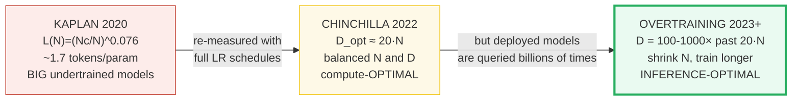
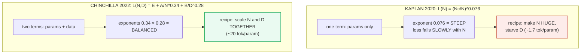
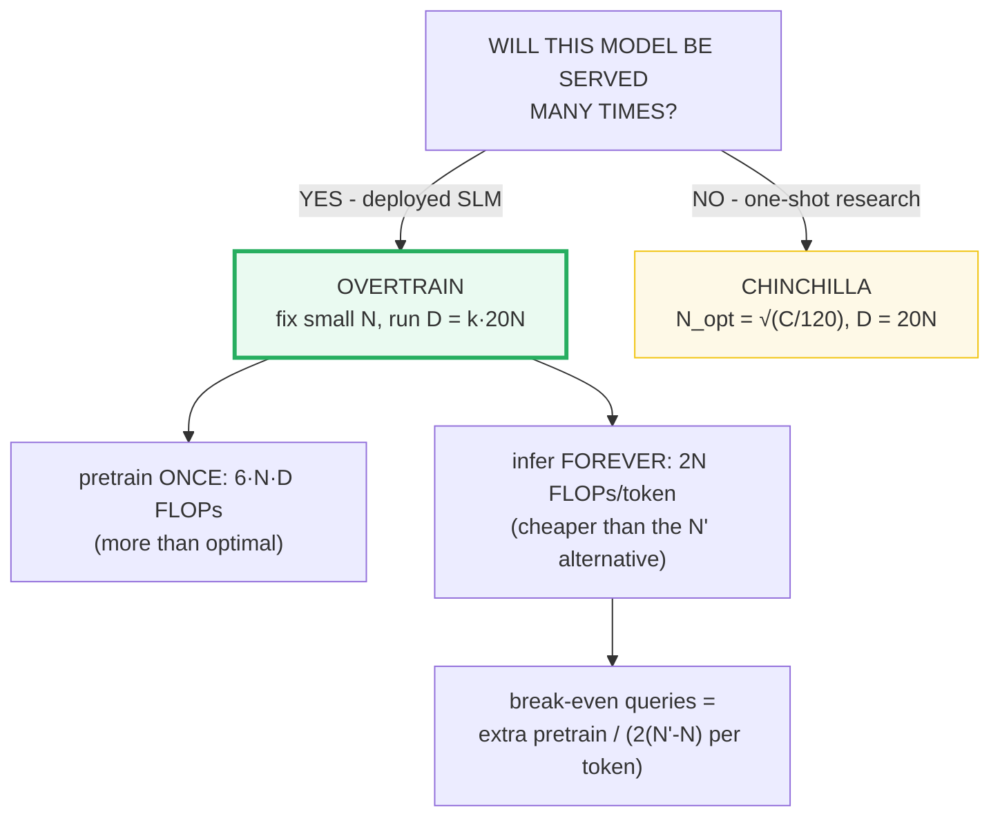
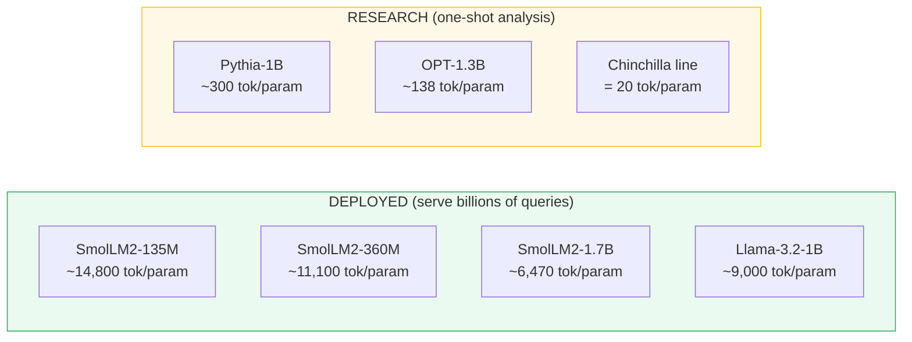
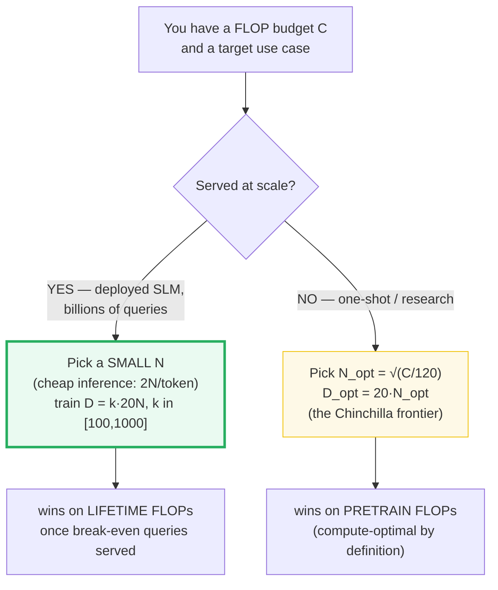
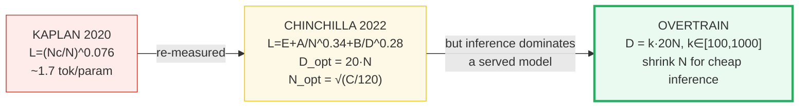

# Scaling Laws for Small Models — Kaplan → Chinchilla → Overtraining

> **Companion code:** [`scaling_laws.py`](./scaling_laws.py). **Every number in
> this guide is printed by `uv run python scaling_laws.py`** — change the code,
> re-run, re-paste. Nothing here is hand-computed.
>
> **This is the Phase-1 opener for the SLM track.** It sets the single most
> important budget an SLM engineer controls: **how many parameters `N` vs how many
> training tokens `D`**. Every later bundle spends that budget (🔗
> [`VOCAB_RATIONALIZATION.md`](./VOCAB_RATIONALIZATION.md), 🔗
> [`DEPTH_VS_WIDTH.md`](./DEPTH_VS_WIDTH.md), 🔗
> [`SHARED_EMBEDDINGS.md`](./SHARED_EMBEDDINGS.md)).
>
> **Live animation:** [`scaling_laws.html`](./scaling_laws.html) — drag a FLOP
> budget, watch the Chinchilla-optimal `N_opt` vs `D_opt` split; drag an overtrain
> factor, watch the lifetime-compute break-even.
>
> **Foundations:** 🔗 [`../llm/README.md`](../llm/README.md) — the large-model
> training/serving curriculum this builds on (these laws were first measured on
> models up to 16B+; here we apply them *below* 5B, where they bend in a surprising
> direction: **overtraining**).

---

## 0. TL;DR — the whole idea in one picture

> **The study-hours analogy (read this first):** you have a fixed number of study
> hours (compute `C`) for an exam. You can buy a **thick textbook** (big model `N`)
> and skim it once, or a **concise guide** (small model) and study it deeply over
> and over (more tokens `D`). Kaplan (2020) told everyone to buy the thickest
> textbook and skim — GPT-3 read ~1.7 pages per chapter. Chinchilla (2022) proved
> you learn more by studying ~20 pages per chapter with a smaller book. **SLM
> engineering goes further still**: for a book you'll be *queried by billions of
> people*, you study a tiny book tens of thousands of times — because at deployment,
> *being small* (cheap to query) matters more than *training cheaply once*.

A **scaling law** is a power-law recipe that answers: *for a training-compute budget
`C` FLOPs, how do I split it between model size `N` (parameters) and data `D`
(tokens)?* The answer changed three times, and each change rewired how models are
built:



| | Kaplan 2020 | Chinchilla 2022 | **Overtraining** (this track) |
|---|---|---|---|
| **Recipe** | ~1.7 tokens/param | **~20 tokens/param** | 100–1000× past 20 |
| **Loss exponent** | `α_N=0.076` (params only) | `α=0.34, β=0.28` (params+data) | same Chinchilla law, off-frontier |
| **Optimizes** | (mis-)predicted big models win | **pretraining** FLOPs | **lifetime** FLOPs (pretrain + inference) |
| **Example** | GPT-3 (175B / 300B) | Chinchilla (70B / 1.4T) | SmolLM2-135M (135M / **2T**) |
| **Use when** | obsolete for training | one-shot research runs | **deployed SLMs** |

> **One plain sentence:** Kaplan said "build big and starve data"; Chinchilla said
> "scale size and data together, ~20 tokens per parameter"; deployed SLMs say
> "spend extra pretraining FLOPs *once* to shrink `N`, because the per-query
> inference savings repay it across billions of queries."

### Glossary (plain English — refer back any time)

| Term | Plain meaning |
|---|---|
| **`N`** | Non-embedding parameter count — the "model size." Every scaling law is a function of this. |
| **`D`** | Number of training tokens the model has seen. |
| **`C`** | Training-compute budget in FLOPs. The workhorse identity is **`C ≈ 6·N·D`** (2 FLOPs/param/token forward × 3 for forward+backward). |
| **`k`** | **Overtrain factor** = `D / (20·N)`. `k=1` is Chinchilla-optimal; `k=3000` is SmolLM2-135M-scale. |
| **Kaplan law** | `L(N) = (N_c/N)^0.076`. A power law in parameters *only*; the steep (small) exponent misled the field into undertraining. |
| **Chinchilla law** | `L(N,D) = E + A/N^α + B/D^β` with `α=0.34, β=0.28`. Balanced exponents ⇒ scale `N` and `D` together ⇒ **`D_opt ≈ 20·N`**. |
| **Compute-optimal** | The `(N, D)` that minimizes loss for a *fixed training budget* `C`. Chinchilla's answer: `N_opt = √(C/120)`, `D_opt = 20·N_opt`. |
| **Overtraining** | Training a *fixed* `N` on `k·(20·N)` tokens — past the compute-optimal point. Loses pretraining-FLOP efficiency, wins on inference cost. |
| **Inference FLOPs** | ≈ `2·N` per generated token (one forward pass). This is the quantity overtraining shrinks. |
| **Break-even queries** | How many queries a deployed overtrained model must serve before its inference savings repay the extra pretraining FLOPs. |

> 🔗 **If you only read one cross-reference:** the param budget `N` that these laws
> tell you to pick is *spent* by the rest of Phase 1. 🔗
> [`VOCAB_RATIONALIZATION.md`](./VOCAB_RATIONALIZATION.md) shows the vocabulary head
> stealing a chunk of `N` (so effective capacity is smaller than it looks); 🔗
> [`SHARED_EMBEDDINGS.md`](./SHARED_EMBEDDINGS.md) recovers params by tying the
> input/output embeddings, letting a *smaller* `N` suffice — which is exactly what
> the overtraining regime wants.

---

## 1. The two loss formulas — Section A output

> **Two power laws, one divergence.** Kaplan (2020) fit loss as a power of
> parameters *alone*, with a steep exponent `α_N = 0.076` — loss falls slowly with
> `N`, so to halve loss you need `N^(1/0.076) ≈ N^13` more parameters. That pushed
> the field toward huge, undertrained models. Chinchilla (2022) re-measured with a
> param **and** a data term, found similar exponents (`α=0.34` vs `β=0.28`), and
> concluded `N` and `D` should grow *together* at ~20 tokens per parameter.



> From `scaling_laws.py` **Section A**:
>
> | quantity | value | meaning |
> |---|---|---|
> | Kaplan `α_N` | **0.076** | steep; loss falls slowly with `N` → favors big models |
> | Kaplan `N_c` | **8.8e13** | critical parameter count |
> | Chinchilla `E` | **1.69** | irreducible entropy floor (no scaling beats this) |
> | Chinchilla `A`, `α` | **406.4**, **0.34** | param term `A/N^α` |
> | Chinchilla `B`, `β` | **410.7**, **0.28** | data term `B/D^β` |
>
> Sample at `N=1B, D=20B`:
> - Kaplan `L(1B) = 2.3756` (ignores data entirely)
> - Chinchilla `L(1B, 20B) = 2.5800` (the 20:1 optimal point)
>
> `[check] Kaplan exponent 0.076 < Chinchilla param exponent 0.34: OK`
> `[check] Chinchilla optimal tokens/param ratio in [15, 25]: OK`

> One plain sentence: Kaplan's single steep exponent made "more params" look like
> the only lever; Chinchilla's balanced two-term fit revealed that data is an
> equally powerful lever — and that almost everyone had been pulling the wrong one.

**Why did Kaplan get it "wrong"?** Three reasons (all documented in the Chinchilla
paper): (1) Kaplan's experiments clustered at *small* scales, so the power-law fit
extrapolated poorly; (2) Kaplan used short learning-rate schedules not tuned for the
full training length, which *underestimated* how much extra data helps; (3) the
param-only functional form masked the data term. Chinchilla trained 400+ models
(70M–16B) with full cosine schedules over a wider compute range and got balanced
exponents. The practical consequence: GPT-3, Gopher, and Megatron-Turing NLG were all
trained at ~1–2 tokens/param and were, in retrospect, severely undertrained.

---

## 2. The compute-optimal frontier — Section B output (the KEY table)

> **The headline of the whole bundle.** Given a FLOP budget `C`, Chinchilla says the
> optimal split is `N_opt = √(C/120)` parameters and `D_opt = 20·N_opt` tokens — a
> flat **20:1** ratio at every scale. The `120 = 6 × 20` comes from combining
> `C ≈ 6·N·D` with `D = 20·N`.


> From `scaling_laws.py` **Section B**:
>
> | FLOP budget C | N_opt (params) | D_opt (tokens) | D/N | check C≈6ND |
> |---|---|---|---|---|
> | 1e+18 | 9.129e+07 (~91M) | 1.826e+09 (~1.8B) | 20.0 | 1.28e-16 |
> | 1e+19 | 2.887e+08 (~289M) | 5.774e+09 (~5.8B) | 20.0 | 0.00e+00 |
> | **1e+20** | **9.129e+08 (~913M)** | **1.826e+10 (~18.3B)** | **20.0** | 1.64e-16 |
> | 1e+21 | 2.887e+09 (~2.9B) | 5.774e+10 (~57.7B) | 20.0 | 0.00e+00 |
> | 1e+22 | 9.129e+09 (~9.1B) | 1.826e+11 (~183B) | 20.0 | 2.10e-16 |
>
> ```
> GOLD PIN (scaling_laws.html recomputes this): C = 1e20 FLOPs
>   N_opt = sqrt(1e20 / 120) = 9.129e+08  (~913M params)
>   D_opt = 20 * N_opt       = 1.826e+10  (~18.3B tokens)
> ```
> `[check] C=1e20 -> N_opt ~= 9.1287e8 (913M): OK`
> `[check] C=1e20 -> D_opt ~= 1.8257e10 (18.3B): OK`
> `[check] every budget sits at the 20:1 ratio: OK`

> One plain sentence: the optimal token count is always twenty times the parameter
> count, no matter how big your budget — and both grow as `√C`, so 4× the compute
> only doubles the model.

### Worked smallest-scale example

Take `C = 1e18` FLOPs (a tiny laptop-scale run):
- `N_opt = √(1e18/120) = √(8.33e15) ≈ 9.13e7` → **~91M parameters**.
- `D_opt = 20 × 9.13e7 ≈ 1.83e9` → **~1.8B tokens**.
- Sanity: `6 × 9.13e7 × 1.83e9 ≈ 1.00e18` ✓ (the table's check column is ~1e-16).

Notice the scaling: each decade of extra compute (`1e18 → 1e19 → …`) grows `N_opt`
and `D_opt` by `√10 ≈ 3.16×`, and the **20:1 ratio never moves**. That flatness is
Chinchilla's central empirical claim.

### Contrast: what Kaplan would have built at the same budget

> From `scaling_laws.py` **Section B** (continued):
>
> At the **same** `C=1e20`, Kaplan's ~1.7 tokens/param recipe would build a
> `3.131e+09`-param (~3.1B) model on only `5.323e+09` (~5.3B) tokens — a big
> **undertrained** brain. Chinchilla's `9.129e+08` (~913M) on `1.826e+10` (~18.3B)
> beats it on loss for the **same** compute (verified empirically by Hoffmann 2022:
> Chinchilla-70B uniformly outperformed the larger Gopher-280B at equal compute).
>
> `[check] Kaplan-style N (1.7:1) > Chinchilla N_opt (20:1) at equal C: OK`

---

## 3. The overtraining curve — Section C output (why deployed SLMs break the rule)

> **The plot twist.** Chinchilla optimizes *pretraining* FLOPs only. But a deployed
> model is queried billions of times, and each generated token costs ≈ `2·N` FLOPs
> at inference. So **inference compute, not pretraining compute, dominates a served
> model's lifetime bill.** That inverts the optimization: spend *extra* pretraining
> FLOPs *once* to shrink `N`, because a smaller `N` is cheaper *forever*. We model
> this by fixing `N` (SmolLM2-135M's 135M), sweeping the overtrain factor `k =
> D/(20·N)`, and asking: *how big a Chinchilla-optimal model `N'` would match this
> loss, and how many queries must we serve before the inference savings repay the
> extra pretrain FLOPs?*



> From `scaling_laws.py` **Section C** — fixed `N = 1.35e8` (SmolLM2-135M),
> inference `≈ 2N` FLOPs/token, `1024` tokens/query:
>
> | k (overtrain) | D (tokens) | modeled loss | equiv Chinchilla N' | extra pretrain FLOPs | break-even query-tokens | break-even queries |
> |---|---|---|---|---|---|---|
> | 1 | 2.7e+09 | 3.3284 | 1.35e+08 (135M) | 0 | 0 | 0 |
> | 5 | 1.35e+10 | 2.9877 | 2.897e+08 (290M) | 8.616e+17 | 2.784e+09 | 2.719e+06 (~2.7M) |
> | 50 | 1.35e+11 | 2.7033 | 6.527e+08 (653M) | 5.823e+19 | 5.624e+10 | 5.492e+07 (~55M) |
> | 300 | 8.1e+11 | 2.5794 | 1.002e+09 (1.0B) | 5.356e+20 | 3.088e+11 | 3.015e+08 (~300M) |
> | 3000 | 8.1e+12 | 2.4891 | 1.426e+09 (1.4B) | 6.317e+21 | 2.446e+12 | 2.389e+09 (~2.4B) |
>
> `[check] loss strictly decreases as overtrain factor k grows: OK`
> `[check] k=1 break-even is 0 (the optimal point is free): OK`
> `[check] k=3000 matches an N' strictly larger than N: OK`

**Reading the table like a story:**

- **`k=1`** (Chinchilla-optimal for 135M): train on 2.7B tokens. No advantage, no
  extra cost. This is the right answer *if you never deploy*.
- **`k=5`**: 5× more data drops loss from 3.33 → 2.99, matching a **290M**
  Chinchilla model. You'd break even after only **~2.7M queries** — trivially worth
  it for anything shipped.
- **`k=3000`** (SmolLM2-135M-scale): the 135M model, trained on 8.1T tokens, matches
  a **~1.4B** Chinchilla-optimal model on loss. You now serve a model ~10× smaller,
  saving ~`2×(1.4B−135M)` FLOPs per generated token. The one-time extra pretraining
  cost (~6.3e21 FLOPs) is repaid after **~2.4 billion queries** — large, but well
  within the lifetime of a widely-deployed edge model (ChatGPT served that many in
  its first week).

> One plain sentence: overtraining is the deliberate,quantified trade of "spend more
> training compute once to spend less inference compute forever" — and it pays off
> precisely when "forever" means billions of queries.

> 🔗 **Where the inference-FLOP number comes from:** the `≈ 2N` per-token figure is
> the forward pass (2 FLOPs per parameter per token). The full pretraining identity
> `C ≈ 6ND` is forward (2) + backward (4). See 🔗 [`../llm/README.md`](../llm/README.md)
> for the large-model serving context where inference cost dominates.

---

## 4. What shipped SLMs actually trained on — Section D output

> **Theory meets the model zoo.** Compute-optimal says ~20 tokens/param. Real
> *deployed* SLMs run **hundreds to thousands** past that; *research* baselines stay
> near it. The split is not accidental — it tracks exactly whether the model is meant
> to be **served** (overtrain) or **studied once** (Chinchilla).

> From `scaling_laws.py` **Section D**:
>
> | model | params (N) | tokens (D) | tok/param (D/N) | overtrain factor k | regime |
> |---|---|---|---|---|---|
> | **SmolLM2-135M** | 1.35e+08 (135M) | 2e+12 (2T) | 14814.8 | 740.7 | OVERTRAINED (deployed) |
> | **SmolLM2-360M** | 3.6e+08 (360M) | 4e+12 (4T) | 11111.1 | 555.6 | OVERTRAINED (deployed) |
> | **SmolLM2-1.7B** | 1.7e+09 (1.7B) | 1.1e+13 (11T) | 6470.6 | 323.5 | OVERTRAINED (deployed) |
> | **Llama-3.2-1B** | 1e+09 (1B) | 9e+12 (9T) | 9000.0 | 450.0 | OVERTRAINED (deployed) |
> | Pythia-1B | 1e+09 (1B) | 3e+11 (300B) | 300.0 | 15.0 | near-Chinchilla (research) |
> | OPT-1.3B | 1.3e+09 (1.3B) | 1.8e+11 (180B) | 138.5 | 6.9 | near-Chinchilla (research) |
>
> `[check] every deployed SLM (SmolLM2, Llama-3.2) is overtrained >= 100x: OK`
> `[check] research baselines (Pythia, OPT) are within 20x of Chinchilla: OK`



> One plain sentence: look at the `tok/param` column — the deployed SLMs are all in
> the *thousands*, the research baselines hug the Chinchilla line at ~20–300; the gap
> is the fingerprint of "will this be queried forever?"

> ⚠️ **Two corrections worth flagging** (both verified against the primary SmolLM2
> paper, arXiv:2502.02737): **SmolLM2-135M trained on ~2T tokens** (not 4T — the 360M
> variant is the one on 4T), and **Llama-3.2-1B trained on ~9T** (not 15T — the 15T
> figure is the Llama 3 *8B/70B/405B* foundation corpus; the 1B edge model was
> distilled from a pruned 8B on 9T). Full provenance in
> [`scaling_laws_reference.txt`](./scaling_laws_reference.txt).

---

## 5. The decision recap — Section E output

> From `scaling_laws.py` **Section E**:
>
> | law | recipe | what it says to do | use when |
> |---|---|---|---|
> | Kaplan 2020 | 1.7 tok/param | funnel compute into big models | obsolete for training |
> | Chinchilla 2022 | 20 tok/param | scale N and D together | research / one-shot runs |
> | **Overtraining** | 100–1000× past 20 | shrink N, train longer | **DEPLOYED SLMs (billions of queries)** |
>
> The single question that picks the row: **Will this model be served many times?**
> → overtrain. **Is it a one-shot research checkpoint?** → Chinchilla.



---

## 6. Lifetime-compute: why overtraining wins (the FLOP accounting)

Chinchilla minimizes **pretraining** FLOPs `C = 6·N·D`. A deployed model's
**lifetime** FLOPs are:

```
lifetime = pretrain (once)  +  inference (per query × Q queries)
         = 6·N·D            +  Q · (tokens/query) · 2·N
```

The overtraining regime **trades** these two terms:

- **Overtrained** (small `N`, large `D = k·20N`): pretrain = `6·N·k·20N = 120·k·N²`
  (bigger than Chinchilla-optimal for this `N`), but inference = `2·N`/token (cheap).
- **Equivalent bigger Chinchilla model** `N'` (matches the same loss at `D'=20N'`):
  pretrain = `120·N'²` (smaller than the overtrained spend), but inference =
  `2·N'`/token (expensive).

The overtrained model wins on lifetime FLOPs once the inference savings accumulate
past the extra pretraining spend — i.e. once you have served:

```
break-even tokens  =  (120·k·N²  −  120·N'²)  /  (2·(N' − N))
```

For SmolLM2-135M at `k=3000`, that is **~2.4×10⁹ queries** (Section C). For a model
serving a chat product, that is days to weeks of traffic. The math is why *every*
shipped small model since 2023 is overtrained — and why the Chinchilla "20:1" rule,
while still the correct *compute-optimal* answer, is no longer the *deployment*
answer.

> 🔗 This lifetime-vs-pretrain trade is the SLM analogue of the large-model serving
> story in 🔗 [`../llm/README.md`](../llm/README.md): there, paged attention / KV
> cache / quantization attack the *per-query* inference cost; here, overtraining
> attacks it by shrinking `N` at the source.

---

## 7. Pitfalls & debugging checklist

| # | Trap | Symptom | Fix |
|---|---|---|---|
| 1 | **Applying Chinchilla 20:1 to a model you'll deploy** | A 1B model on only 20B tokens — 5–50× worse than SmolLM2/Qwen3 peers at equal size | If serving at scale, overtrain: aim for 100–1000× past 20:1 (Section C). Reserve 20:1 for one-shot research. |
| 2 | **Applying Kaplan 1.7:1 to anything** | Severely undertrained giant model (the GPT-3 / Gopher failure mode) | Kaplan's law is obsolete for *training* decisions. Use it only to understand the history. |
| 3 | **Forgetting `C ≈ 6ND`** | Can't sanity-check a training run's FLOPs | Multiply params × tokens × 6. A 1B model on 1T tokens is ~6e21 FLOPs. Cross-check against your GPU-hours. |
| 4 | **Confusing "compute-optimal" with "deployment-optimal"** | Picking `N_opt = √(C/120)` for a product model and then paying huge inference bills | Chinchilla optimizes *pretraining* only. For deployed models, minimize *lifetime* FLOPs (pretrain + inference × queries) — Section 6. |
| 5 | **Quoting Llama-3.2-1B as "15T tokens"** | Wrong; conflates the edge model with the Llama 3 foundation corpus | Llama-3.2-1B was distilled on **~9T** tokens. The **15T** is Llama 3 *8B/70B/405B*. (SmolLM2-135M is **2T**, not 4T.) |
| 6 | **Counting OPT's 300B as unique tokens** | Overstates the corpus | OPT saw **180B unique** tokens (300B total presentations with repetition). Use the unique figure for tokens/param ratios. |
| 7 | **Expecting overtraining to be free** | Spending 1000× Chinchilla compute and assuming it always pays off | It pays off only *after* the break-even query count (Section C). For a model that won't be served that much, Chinchilla is still cheaper. |
| 8 | **Treating `D_opt ≈ 20N` as a physical constant** | Surprised when newer laws (Mosaic 190:1, Llama-3 1875:1) disagree | 20:1 is *compute-optimal*; the higher ratios are *inference-optimal* and depend on expected query volume and data quality. |
| 9 | **Comparing param counts across architectures** | Mismatched losses at "equal N" | `N` is *non-embedding* params. Tied embeddings / shared weights (🔗 [`SHARED_EMBEDDINGS.md`](./SHARED_EMBEDDINGS.md)) change effective `N`. |
| 10 | **Ignoring the vocab tax when budgeting `N`** | Model smaller than the scaling law predicts | A large vocab head steals capacity from the transformer body. See 🔗 [`VOCAB_RATIONALIZATION.md`](./VOCAB_RATIONALIZATION.md). |

---

## 8. Cheat sheet



- **The one identity:** `C ≈ 6·N·D`. Along the Chinchilla line `D=20N`, this collapses
  to `C = 120·N²`, so `N_opt = √(C/120)` and `D_opt = 20·N_opt`.
- **Kaplan (2020):** `L(N) = (N_c/N)^0.076`, `N_c = 8.8e13`. Steep exponent → favored
  big undertrained models. **Obsolete for training**, useful for the history.
- **Chinchilla (2022):** `L(N,D) = 1.69 + 406.4/N^0.34 + 410.7/D^0.28`. Balanced
  exponents → `D_opt ≈ 20·N`. **Use for one-shot / research runs.**
- **Gold anchor (`C=1e20`):** `N_opt = 9.13e8` (~913M), `D_opt = 1.83e10` (~18.3B).
  (Recomputed identically in [`scaling_laws.html`](./scaling_laws.html).)
- **Overtraining:** fix `N`, train `D = k·20N` with `k ∈ [100, 1000]`. Loses
  pretraining-FLOP efficiency, **wins on lifetime FLOPs** for served models. Break-even
  after `~2.4e9` queries for SmolLM2-135M at `k=3000`.
- **Inference FLOPs:** ≈ `2·N` per generated token. This is the quantity overtraining
  shrinks.
- **Real models:** SmolLM2-135M (2T, ~14,800 tok/param), SmolLM2-1.7B (11T, ~6,470),
  Llama-3.2-1B (9T, ~9,000) — all overtrained. Pythia-1B (300B, ~300), OPT-1.3B
  (180B, ~138) — research baselines near Chinchilla.
- **Decision rule:** *Will it be served many times?* → overtrain. *One-shot?* →
  Chinchilla. *Don't* use Kaplan.

> 🔗 **Cross-references** — where the param budget `N` goes next:
> - 🔗 [`VOCAB_RATIONALIZATION.md`](./VOCAB_RATIONALIZATION.md) — the vocabulary head
>   *steals* a chunk of `N` (a 49k vocab on a 135M model is a big tax). Read this to
>   understand why "effective" `N` is smaller than the headline param count.
> - 🔗 [`DEPTH_VS_WIDTH.md`](./DEPTH_VS_WIDTH.md) — once you've picked `N`, how do you
>   *shape* it? Depth vs width trades quality for training stability at fixed `N`.
> - 🔗 [`SHARED_EMBEDDINGS.md`](./SHARED_EMBEDDINGS.md) — tying the input/output
>   embeddings recovers params so a *smaller* `N` suffices — compounding the
>   overtraining win.
> - 🔗 [`../llm/README.md`](../llm/README.md) — the large-model foundations
>   (FlashAttention, KV cache, quantization) this SLM track builds on and inverts:
>   they make inference cheaper *per query*; overtraining makes it cheaper *per
>   parameter*.

---

## Sources

Every formula below is web-verified in ≥2 independent sources; the full per-URL
provenance log is in [`scaling_laws_reference.txt`](./scaling_laws_reference.txt)
(10 distinct URLs).

- **Hoffmann et al. (2022).** *Training Compute-Optimal Large Language Models.*
  arXiv:2203.15556 — <https://arxiv.org/abs/2203.15556>
  The Chinchilla paper. Compute-optimal split scales `N` and `D` equally;
  `D_opt/N_opt ≈ 20`; `C ≈ 6ND`; Chinchilla itself = 70B on 1.4T (exactly 20:1);
  "current large language models are significantly undertrained."

- **Brenndoerfer, M. (2025).** *Chinchilla Scaling Laws: Compute-Optimal LLM
  Training.* (Language AI Handbook) —
  <https://mbrenndoerfer.com/writing/chinchilla-scaling-laws-compute-optimal-llm-training>
  Authoritative secondary analysis. Verifies the parametric loss
  `L(N,D)=E + A/N^α + B/D^β` with `E=1.69, A=406.4, B=410.7, α=0.34, β=28`; and the
  **gold anchor**: `C=1e20 → N_opt = 912.9M, D_opt = 18.3B` (independent confirmation
  of `N_opt = √(C/120)`).

- **Kaplan et al. (2020).** *Scaling Laws for Neural Language Models.*
  arXiv:2001.08361 — <https://arxiv.org/abs/2001.08361>
  The original param-only power law `L(N) = (N_c/N)^α_N`.

- **Clark et al. (2022).** *Unified Scaling Laws for Routed Language Models.*
  ICML 2022 — <https://proceedings.mlr.press/v162/clark22a/clark22a.pdf>
  Independent confirmation of the exact Kaplan coefficients: `α_N = 0.076`,
  `N_c = 8.8e13` (cited verbatim).

- **Ben Allal et al. (2025).** *SmolLM2: When Smol Goes Big.*
  arXiv:2502.02737 — <https://arxiv.org/abs/2502.02737>
  SmolLM2-1.7B on ~11T tokens; **SmolLM2-360M on 4T, SmolLM2-135M on 2T** (§6);
  the overtraining philosophy (§4); **Llama-3.2-1B distilled on 9T** (§4).

- **Dubey et al. (2024).** *The Llama 3 Herd of Models.*
  arXiv:2407.21783 — <https://arxiv.org/abs/2407.21783>
  Llama 3 foundation models (8B/70B/405B) pretrained on ~15T tokens — the corpus the
  3.2 edge models derive from.

- **OPT Training Log (Tian et al., ACL 2023).** *Training Trajectories of Language
  Models Across Scales.* — <https://aclanthology.org/2023.acl-long.767.pdf>
  "All OPT models are trained with 300B tokens, of which **180B are unique**."
  OPT-1.3B ≈ 138 tokens/param (near-Chinchilla research baseline).

- **Biderman et al. (2023).** *Pythia: A Suite for Analyzing Large Language Models…*
  arXiv:2304.01373 — <https://arxiv.org/abs/2304.01373>
  Pythia suite (incl. Pythia-1B) trained on 300B tokens of the Pile (~300 tok/param).

- **Thompson, A. D. (2023, updated 2026).** *Chinchilla data-optimal scaling laws: In
  plain English.* LifeArchitect.ai — <https://lifearchitect.ai/chinchilla/>
  Independent aggregator: Kaplan ≈ 1.7:1, Chinchilla = 20:1, and the overtraining
  trend (Mosaic 190:1, Tsinghua 192:1, Llama 3 up to 1,875:1).

> **Unverified facts:** none outstanding. Two figures from the original brief were
> corrected against the primary SmolLM2 paper (§6/§4): SmolLM2-135M = **2T** tokens
> (not 4T) and Llama-3.2-1B = **9T** (not 15T). OPT's token count is the **180B
> unique** figure (300B total presentations); the bundle uses 180B for consistency.
