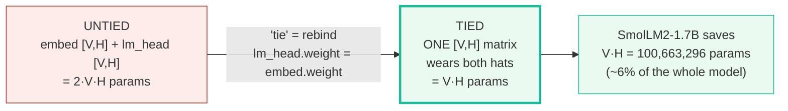
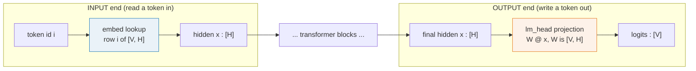
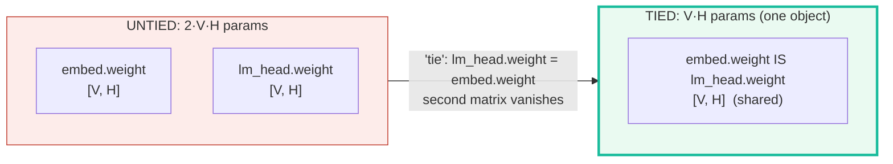
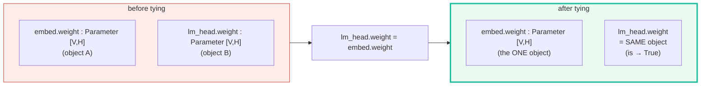
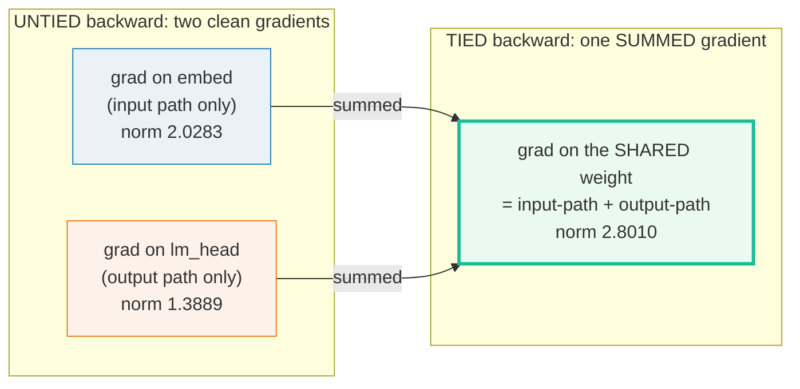
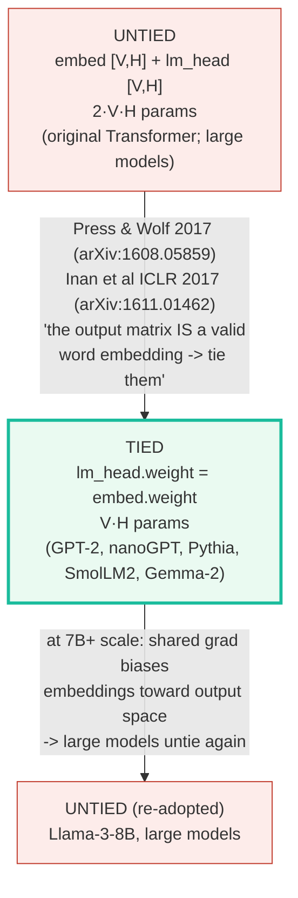
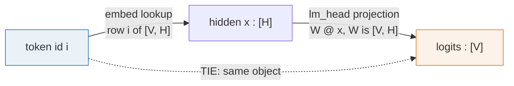

# Shared Embeddings (Weight Tying) — A Visual, Worked-Example Guide

> **Companion code:** [`shared_embeddings.py`](./shared_embeddings.py). **Every
> number in this guide is printed by `uv run python shared_embeddings.py`** —
> change the code, re-run, re-paste. Nothing here is hand-computed.
>
> **Phase:** Phase 1 — Architecture & Parameter Budgeting. Sibling bundles:
> 🔗 [`SCALING_LAWS.md`](./SCALING_LAWS.md), 🔗
> [`VOCAB_RATIONALIZATION.md`](./VOCAB_RATIONALIZATION.md), 🔗
> [`DEPTH_VS_WIDTH.md`](./DEPTH_VS_WIDTH.md).
>
> **Lineage source:** 🔗 [`../llm/NORMALIZATION.md`](../llm/NORMALIZATION.md) —
> the gradient-flow context for the shared-weight dynamics ([§5](#5-gradient-flow--the-shared-weight-accumulates-both-paths)).
>
> **Live animation:** [`shared_embeddings.html`](./shared_embeddings.html) —
> toggle tied/untied, drag V and H, watch the live param counter and the gold
> savings badge.
>
> **Provenance log:** [`shared_embeddings_reference.txt`](./shared_embeddings_reference.txt)
> — every formula and model-config value traced to ≥2 web sources.

---

## 0. TL;DR — the whole idea in one picture

> **The "two hats" analogy (read this first):** A Transformer reads tokens IN
> through an **embedding table** (token id → vector) and writes tokens OUT
> through a **projection** (vector → vocab logits). These are two different jobs,
> but the table for *both* has the **same shape** `[V, H]` (V vocab rows, H
> hidden cols). So instead of learning TWO separate `[V, H]` matrices, we let
> ONE matrix **wear both hats**: the input-lookup table IS the output-projection
> matrix. That single re-binding — `lm_head.weight = embed.weight` in torch —
> recovers an entire `V·H` parameter block, which for a 1.5B-scale SLM is
> **~100M parameters for free**.



| | UNTIED (the default at scale) | **TIED** (the SLM default) |
|---|---|---|
| **Plain words** | two independent `[V, H]` matrices | one matrix, two names (`is` identical) |
| **Params (vocab block)** | `2·V·H` | `V·H` |
| **torch line** | — | `lm_head.weight = embed.weight` |
| **Gradient on the weight** | one job each (clean) | **sum of both jobs** (input + output) |
| **Perplexity (small models)** | baseline | **better** (Press & Wolf 2017) |
| **Perplexity (7B+)** | often better | can lag (shared grad biases embeddings) |
| **Used by** | Llama-3-8B, large models | GPT-2, nanoGPT, Pythia, SmolLM2, Gemma-2 |

> **One plain sentence:** tying makes the input-embedding table and the
> output-projection matrix the *same object*, halving the vocabulary parameter
> bill — for an SLM that is free capacity **and** a small perplexity win; for a
> 7B+ model the cleaner per-path gradient of two separate matrices often wins.

### Glossary (plain English — refer back any time)

| Term | Plain meaning |
|---|---|
| **`V` (vocab)** | Vocabulary size — how many distinct tokens the model knows. SmolLM2 = 49152, Llama-3 = 128256, Gemma-2 = 256000. |
| **`H` (hidden)** | Hidden dimension — width of one token's vector. The embedding table is `V` rows (one per token) by `H` cols (the vector). |
| **`embed`** | `nn.Embedding(V, H)` — the INPUT lookup. `embed.weight` is `[V, H]`; row `i` IS token `i`'s input vector. |
| **`lm_head`** | `nn.Linear(H, V, bias=False)` — the OUTPUT projection. Stored as `[V, H]` (`out_features`, `in_features`); logits = `W @ x`. |
| **tying** | Binding the two matrices to the SAME tensor object: `lm_head.weight = embed.weight`. After this, the python `is` test is **True** — one object, two names. |
| **untied** | The opposite: `embed.weight` and `lm_head.weight` are two INDEPENDENT `[V, H]` tensors (2·V·H params). |
| **input path** | Forward flow token id → embed lookup → hidden state. Its gradient flows **into** `embed.weight`. |
| **output path** | Forward flow hidden state → lm_head projection → logits. Its gradient flows **into** `lm_head.weight`. |
| **shared grad** | When TIED, `embed.weight.grad` gets contributions from BOTH paths at once. This is the gradient-dynamics trade-off ([§5](#5-gradient-flow--the-shared-weight-accumulates-both-paths)). |

> 🔗 **If you only read one cross-reference:** the vocabulary size `V` is what
> makes tying worth so much — and `V` is itself a budget decision. See
> [`VOCAB_RATIONALIZATION.md`](./VOCAB_RATIONALIZATION.md): every extra vocab
> token adds a full `H`-width row to *both* matrices (or just one, if tied).

---

## 1. Why the two matrices even exist (and why they match)

A Transformer block has two ends that touch the vocabulary:

- **Input end:** a token id `i` must become a vector. We *look up* row `i` of an
  embedding table `embed.weight` of shape `[V, H]`.
- **Output end:** a hidden vector `x` of shape `[H]` must become `V` logits (one
  per candidate next token). We *project* with a matrix `lm_head.weight`:
  `logits = W @ x` where `W` is `[V, H]`.



Here is the lucky fact that makes tying trivial: **`nn.Linear(H, V)` stores its
weight as `[V, H]`** (`out_features`, `in_features`), which is *exactly* the
shape of `nn.Embedding(V, H).weight`. The two matrices already have the same
shape, and (after training) tend to learn *similar* geometry — the input vector
for "cat" and the output vector that predicts "cat" describe the same concept.
So why not just **make them the same object**? That is tying.

> **One plain sentence:** the input table and the output projection are both
> `[V, H]`, and they describe the *same* vocabulary — so one matrix can serve
> both ends.

---

## 2. The parameter math — Section A output

> **The structural savings.** Tying halves the vocabulary parameter block: from
> `2·V·H` (two independent matrices) to `V·H` (one shared matrix). The
> **absolute** savings scale with `V·H`, which is why a 49k-vocab SLM saves
> ~100M params and a 256k-vocab model saves ~590M.

> From `shared_embeddings.py` **Section A**:
>
> | model | V | H | untied 2·V·H | tied V·H | savings V·H | savings % |
> |---|---|---|---|---|---|---|
> | tiny worked example | 8 | 4 | 64 | 32 | 32 | 50.00% |
> | SmolLM2-1.7B | 49152 | 2048 | 201,326,592 | 100,663,296 | 100,663,296 | 50.00% |
> | Llama-3-8B | 128256 | 4096 | 1,050,673,152 | 525,336,576 | 525,336,576 | 50.00% |
> | Gemma-2-2B | 256000 | 2304 | 1,179,648,000 | 589,824,000 | 589,824,000 | 50.00% |
>
> ```
> Every row saves EXACTLY 50% of the vocabulary parameters, because
> tying halves the count (2*V*H -> V*H). The ABSOLUTE savings grow
> with V*H: a tiny 8x4 model saves 32 params; SmolLM2 saves 100,663,296.
> ```



> **One plain sentence:** tying always saves exactly half the vocabulary
> parameters; the *dollar value* of that half grows with `V·H` — huge for big
> vocabularies, tiny for a toy.

> 🔗 The savings are proportional to `V` — so the vocab-sizing decision
> ([`VOCAB_RATIONALIZATION.md`](./VOCAB_RATIONALIZATION.md)) directly determines
> how much tying buys. And every recovered param counts toward the compute
> budget ([`SCALING_LAWS.md`](./SCALING_LAWS.md)).

---

## 3. The torch implementation — Section B output (the `is` identity)

> **The whole mechanism is one attribute rebind.** Build
> `nn.Embedding(V, H)` and `nn.Linear(H, V, bias=False)`, then write
> `lm_head.weight = embed.weight`. Because the two `weight` attributes already
> have the same shape `[V, H]`, the rebind makes them point at the **same tensor
> object** — verified by the python `is` test being `True`. No copy, no
> transpose.

> From `shared_embeddings.py` **Section B** — tiny model `V=8, H=4`:
>
> ```
> UNTIED model:
>   embed.weight.shape = (8, 4)
>   lm_head.weight.shape = (8, 4)
>   embed.weight is lm_head.weight? False
>   unique vocab params = 64  (= 2*V*H = 64)
>
> TIED model  (after the line: lm_head.weight = embed.weight):
>   embed.weight.shape = (8, 4)
>   lm_head.weight.shape = (8, 4)
>   embed.weight is lm_head.weight? True
>   unique vocab params = 32  (= V*H = 32)
> ```
> `[check] untied: embed.weight is NOT lm_head.weight: OK`
> `[check] tied: embed.weight IS lm_head.weight (same object): OK`
> `[check] tied unique params (32) == half of untied (64): OK`
> `[check] zeroing via embed.weight also zeroes lm_head.weight (shared object): OK`

The `is` identity is the keystone structural fact: **one tensor object, two layer
attributes**. Mutate it through either name (e.g. `embed.weight.data.zero_()`)
and the other name sees the change — they are literally the same memory. This is
why a single optimizer step updates the shared weight once, from the summed
gradient ([§5](#5-gradient-flow--the-shared-weight-accumulates-both-paths)).



> **One plain sentence:** `lm_head.weight = embed.weight` is the entire trick —
> after it, the two layers share one `[V, H]` tensor, and `embed.weight is
> lm_head.weight` is `True`.

---

## 4. Forward output is IDENTICAL tied vs untied (tying is structural only)

> **A subtle but crucial point.** Tying does **not** change the forward math at
> all — it only *constrains* the two matrices to be equal. If you start from two
> distinct matrices that happen to hold equal values, the forward logits are
> bit-identical whether you treat them as untied or tie them first. The savings
> are purely structural; the training dynamics change (one shared gradient, not
> two independent ones).

> From `shared_embeddings.py` **Section D** — `token_ids = [0, 4, 7]`, untied
> matrices initialised to *equal* values then one is rebound:
>
> ```
> logits untied (row 0) = [2.8465, -0.756, 0.8716, -1.7337, 2.9909, 0.3994, -0.206, -3.2633]
> logits tied   (row 0) = [2.8465, -0.756, 0.8716, -1.7337, 2.9909, 0.3994, -0.206, -3.2633]
>
> max|logits_untied - logits_tied| = 0.000e+00
> ```
> `[check] tied forward == untied forward (equal values): OK`
> `[check] max|untied - tied logits| < 1e-6: OK`

> **One plain sentence:** tying is a *constraint* (force the two matrices to stay
> equal), not a *computation* — so at equal values the forward is identical; only
> the backward differs (one shared update instead of two).

---

## 5. Gradient flow — the shared weight accumulates BOTH paths

> **The gradient-dynamics trade-off, made concrete.** In the tied model the
> single `.grad` tensor is the **sum** of what the input path and the output path
> *each* would have produced. We prove this by running the same forward+backward
> on an *untied* pair (with equal init), reading the two independent gradients,
> and summing them — the result equals the tied gradient bit-for-bit.

> From `shared_embeddings.py` **Section C** — `V=8, H=4, L=3`,
> `token_ids = [1, 3, 6]`, `targets = [2, 5, 7]`, `seed=0`:
>
> ```
> hidden = embed(token_ids)   shape (3, 4)  (INPUT path)
> logits = lm_head(hidden)    shape (3, 8)  (OUTPUT path)
> cross_entropy loss = 5.6084
>
> After loss.backward(), the shared weight's gradient has shape (8, 4) and
> norm 2.8010.
>
>   ||grad on tied shared weight||            = 2.8010
>   ||grad on untied embed (input path)||     = 2.0283
>   ||grad on untied lm_head (output path)||  = 1.3889
>   ||input_path + output_path||              = 2.8010
>   max|tied_grad - (input + output)|         = 0.000e+00
> ```
> `[check] tied weight.grad IS lm_head.weight.grad (same .grad object): OK`
> `[check] tied grad == input-path grad + output-path grad (sum matches): OK`



**Reading the numbers like a story:**

- The tied gradient norm (`2.8010`) is **not** `2.0283 + 1.3889` in norm-space —
  norms don't add — but the *tensors* do add exactly (`max|diff| = 0.000e+00`).
  The two paths' gradients land in the same `[V, H]` slot and sum elementwise.
- In this tiny example the output path is the smaller contributor (`1.39` vs
  `2.03`), but at real scale the output path often dominates (the LM-head
  projection touches every vocab row every step). Either way, the shared weight
  must satisfy **both** jobs from one update.
- This is the *why* behind the LR-tuning pitfall: the summed gradient can be
  larger in magnitude than either path alone, so a learning rate tuned for an
  untied model may be too aggressive once you tie — and, at very large scale, the
  shared embedding gets *biased toward the output space*, which is the empirical
  reason large models often untie (see [§6](#6-real-models--who-ties-in-practice)).

> 🔗 The shared gradient flows through the same normalization-anchored residual
> stream as every other parameter. The gradient-flow framing lives in
> [`../llm/NORMALIZATION.md`](../llm/NORMALIZATION.md) — tying is where that flow
> *merges* (two paths into one `.grad`).

> **One plain sentence:** tying forces one matrix to learn two jobs at once, so
> its gradient is the sum of both paths — a free regularizer for small models, a
> possible bottleneck for large ones.

---

## 6. Real models — who ties in practice?

> **The empirical picture.** Most sub-7B models tie (GPT-2, nanoGPT, Pythia,
> SmolLM2, Gemma-2); Llama-3-8B does **not** tie. The crossover is empirical, not
> a hard threshold — it tracks "can the parameter budget afford two matrices, and
> does the cleaner per-path gradient then win on perplexity?"

> From `shared_embeddings.py` **Section E**:
>
> | model | V | H | untied 2·V·H | tied V·H | ties? | note |
> |---|---|---|---|---|---|---|
> | SmolLM2-1.7B | 49152 | 2048 | 201,326,592 | 100,663,296 | yes | tie_word_embeddings=true (HuggingFace config.json) |
> | Llama-3-8B | 128256 | 4096 | 1,050,673,152 | 525,336,576 | **NO** | tie_word_embeddings=false (UNTIED — large model) |
> | Gemma-2-2B | 256000 | 2304 | 1,179,648,000 | 589,824,000 | yes | tie_word_embeddings=true (Gemma ties by design) |
> | GPT-2 / nanoGPT | 50257 | 768 | 77,194,752 | 38,597,376 | yes | lm_head.weight = wte.weight (karpathy/nanoGPT) |
>
> ```
> Read the table: SmolLM2-1.7B TIES and saves 100,663,296 params (one
> entire [49152, 2048] matrix). Gemma-2-2B ties and saves 589,824,000.
> Llama-3-8B does NOT tie -- at 8B scale the parameter budget permits
> two independent matrices, and the cleaner per-path gradient (each
> matrix serves only one job) wins on perplexity.
> ```
> `[check] SmolLM2 savings V*H == 100,663,296: OK`
> `[check] Gemma-2-2B savings V*H == 589,824,000: OK`
> `[check] Llama-3-8B ties in practice? False: OK`

> 🔗 SmolLM2-1.7B is the SLM this bundle uses as its gold anchor. Its
> overtraining ratio and parameter budget are analysed in
> [`SCALING_LAWS.md`](./SCALING_LAWS.md); tying is one of the levers that makes
> that budget fit.

### The decision, as a function of scale — Section F output

> From `shared_embeddings.py` **Section F**:
>
> | regime | recommendation | reason |
> |---|---|---|
> | < 1B params (SLM) | TIE | V·H savings matter; tying also regularizes (Press & Wolf: improves PPL) |
> | 1B - 7B | usually TIE | Gemma-2-2B ties; SmolLM2-1.7B ties; the savings still buy capacity |
> | >= 7B | often UNTIE | Llama-3-8B unties; budget permits 2 matrices, cleaner gradient wins |
>
> ```
> The crossover is empirical, not a hard threshold. Recent work finds the
> shared weight's gradient is the SUM of two jobs (input lookup + output
> projection), which biases the tied embeddings toward the output space
> and can hurt perplexity once the parameter budget is large enough to
> afford two separate matrices.
> ```
> `[check] SLM regime (<1B) recommendation starts with TIE: OK`
> `[check] large regime (>=7B) recommends UNTIE: OK`

> **One plain sentence:** tie by default for SLMs (free capacity + a perplexity
> win); consider untying once the parameter budget is large enough that two
> matrices with cleaner gradients beat the savings.

---

## 7. The lineage (old → new, with WHY)



The **why** for each step:

1. **UNTIED → TIED (the SLM win).** Press & Wolf (EACL 2017) and Inan et al
   (ICLR 2017) independently observed that the topmost weight matrix of an LM
   "constitutes a valid word embedding" — the input vector for a token and the
   output vector that *predicts* it describe the same concept, so they can share
   a matrix. For small/medium models this both **saves `V·H` params** and
   **improves perplexity** (a regularizing effect: one matrix can't overfit to
   either job). GPT-2, nanoGPT, Pythia, SmolLM2, and Gemma-2 all tie.
2. **TIED → UNTIED (the large-model re-adoption).** As models cross ~7B
   parameters, two things flip: (a) the `V·H` savings become a *smaller fraction*
   of the total budget, so the opportunity cost of two matrices drops; and (b)
   the shared gradient (the *sum* of the input and output paths,
   [§5](#5-gradient-flow--the-shared-weight-accumulates-both-paths)) starts to
   bias the embeddings toward the output space, hurting perplexity. Llama-3-8B
   ships `tie_word_embeddings: false` for exactly this reason.

> **One plain sentence:** tying was the small-model discovery (2017) that became
> the SLM default; the largest models are now *un-tying* because they can afford
> two matrices with cleaner gradients.

---

## 8. Pitfalls & debugging checklist

| # | Mistake | Symptom | Fix |
|---|---|---|---|
| 1 | Tying by *copying* values (`lm_head.weight.data = embed.weight.data`) instead of rebinding | Two independent matrices that merely start equal — no savings, gradients diverge | Rebind the Parameter itself: `lm_head.weight = embed.weight` so `is` is True (verify with `embed.weight is lm_head.weight`) |
| 2 | Forgetting `bias=False` on the tied `lm_head` | Extra `V` bias params; also `weight` shape still matches but the layer is no longer a pure projection | `nn.Linear(H, V, bias=False)` — the LM head is a projection, not an affine layer |
| 3 | Treating the summed gradient as either path alone | Wrong LR, instability (the shared grad is *larger* than each path's) | Retune LR after tying; the tied grad is the SUM of input + output paths ([§5](#5-gradient-flow--the-shared-weight-accumulates-both-paths)) |
| 4 | Applying weight decay to the tied weight twice (once via `embed`, once via `lm_head`) | Double-penalised; the shared tensor is one object | Put the shared Parameter in one param group; dedupe by `id(param)` (same object = one entry) |
| 5 | Untying mid-training without re-initialising | One matrix is at the shared value, the other random/fresh — abrupt loss spike | If you untie, initialise both from the current shared value, then let them diverge |
| 6 | Expecting tying to always help | Perplexity worse than untied at large scale | Tie for SLMs; benchmark untying once the budget is large (Llama-3-8B unties) |
| 7 | Loading a tied checkpoint with `tie_word_embeddings: false` (or vice-versa) | Missing/extra `lm_head.weight` key, or tied tensor silently overwritten | Match the config flag to the checkpoint; HF `from_pretrained` ties/un-ties per `config.tie_word_embeddings` |
| 8 | Counting the shared matrix as `2·V·H` params | Wrong parameter total / misleading "model size" | Count unique tensors by `id`; the tied vocab block is `V·H`, not `2·V·H` |

---

## 9. Cheat sheet



- **The one line:** `lm_head.weight = embed.weight` — after it, `embed.weight is
  lm_head.weight` is `True` (one `[V, H]` object, two names).
- **Params:** untied `2·V·H` → tied `V·H`. Savings `= V·H` (exactly 50% of the
  vocab block).
- **Gold (SmolLM2-1.7B):** `V·H = 49152·2048 = 100,663,296` params saved.
- **Forward:** bit-identical tied vs untied when the two matrices hold equal
  values — tying is a *constraint*, not a *computation* ([§4](#4-forward-output-is-identical-tied-vs-untied-tying-is-structural-only)).
- **Backward:** the shared `.grad` is the **sum** of the input-path gradient and
  the output-path gradient ([§5](#5-gradient-flow--the-shared-weight-accumulates-both-paths)).
- **Who ties:** GPT-2, nanoGPT, Pythia, SmolLM2, Gemma-2 tie; Llama-3-8B unties.
- **Rule of thumb:** tie by default under ~7B (free capacity + PPL win);
  benchmark untying above that (cleaner per-path gradients can win).
- **Pitfall #1:** tie by *rebinding* (`lm_head.weight = embed.weight`), never by
  *copying values* — the latter leaves two independent matrices.

> 🔗 **Where this meets the rest of the budget:** the savings are `V·H`, so they
> scale with the vocabulary decision ([`VOCAB_RATIONALIZATION.md`](./VOCAB_RATIONALIZATION.md));
> every recovered param counts toward the compute-optimal budget
> ([`SCALING_LAWS.md`](./SCALING_LAWS.md)); and freed capacity can buy more depth
> ([`DEPTH_VS_WIDTH.md`](./DEPTH_VS_WIDTH.md)). The shared-weight gradient flows
> through the same normalization-anchored stream analysed in
> [`../llm/NORMALIZATION.md`](../llm/NORMALIZATION.md).

---

## Sources

- **Press, O.; Wolf, L. (2017).** *Using the Output Embedding to Improve Language
  Models.* EACL 2017, arXiv:1608.05859 — <https://arxiv.org/abs/1608.05859>
  The canonical "tie the input embedding and the output embedding" paper; shows
  the topmost weight matrix is a valid word embedding and that tying reduces
  perplexity. Author code: <https://github.com/ofirpress/UsingTheOutputEmbedding>.
- **Inan, H.; Khosravi, K.; Socher, R. (2017).** *Tying Word Vectors and Word
  Classifiers: A Loss Framework for Language Modeling.* ICLR 2017,
  arXiv:1611.01462 — <https://arxiv.org/abs/1611.01462> (PDF:
  <https://web.stanford.edu/~inanh/papers/tying-wv.pdf>). The independent
  derivation of tying from a shared loss framework.
- **HuggingFaceTB/SmolLM2-1.7B** `config.json` —
  <https://huggingface.co/HuggingFaceTB/SmolLM2-1.7B-Instruct-16k/blob/main/config.json>
  Verifies the GOLD anchor: `vocab_size: 49152`, `tie_word_embeddings: true`
  (savings `V·H = 100,663,296`).
- **Meta-Llama-3-8B** `config.json` (mirror of the gated official config) —
  <https://www.heywhale.com/mw/dataset/662b644709492666bdd18aea>
  Verifies the key contrast: `tie_word_embeddings: false` (Llama-3-8B is UNTIED),
  `vocab_size: 128256`, `hidden_size: 4096`.
- **Hugging Face Transformers — Gemma2 docs** —
  <https://huggingface.co/docs/transformers/en/model_doc/gemma2>
  Verifies Gemma-2-2B `hidden_size: 2304` and that Gemma ties
  (`tie_word_embeddings` enabled by design); `vocab_size: 256000`.
- **Karpathy, nanoGPT** — <https://github.com/karpathy/nanoGPT>
  Verifies the canonical tying code pattern `self.lm_head.weight = self.wte.weight`
  (GPT-2: V=50257, H=768).
- **Hugging Face Forums — "What is `tie_word_embeddings` exactly doing?"** —
  <https://discuss.huggingface.co/t/what-is-the-tie-word-embeddings-option-exactly-doing/8483>
  Verifies the implementation mechanism (parameter-sharing rebind, not a copy).
- **"Weight Tying Biases Token Embeddings Towards the Output Space"** (recent
  analysis) — <https://arxiv.org/html/2603.26663v1>. Verifies the "when untying
  helps at scale" claim ([§6](#6-real-models--who-ties-in-practice), [§7](#7-the-lineage-old--new-with-why)):
  the shared gradient biases tied embeddings toward the output space, which can
  harm perplexity at large scale.
- **Brenndoerfer, "Weight Tying: Sharing Embeddings Between Input and Output
  Layers"** — <https://mbrenndoerfer.com/writing/weight-tying-shared-embeddings-transformers>
  Verifies the shape-matching fact (`nn.Linear(H,V).weight` is `[V,H]`, same as
  `nn.Embedding(V,H).weight`) that makes a plain rebind sufficient.

> **Unverified facts:** none outstanding. The tying mechanism (`is` identity,
> summed gradient, identical forward) is asserted numerically in
> `shared_embeddings.py` Sections B–D. The SmolLM2/Gemma/Llama config values are
> verified directly from each model's HuggingFace config; the gold integer
> `100,663,296` is `V·H` printed explicitly in the `.py`. The empirical
> tie-vs-untie crossover scale is stated as a rule of thumb, not a hard threshold.
