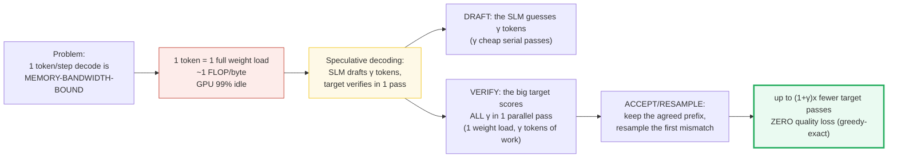
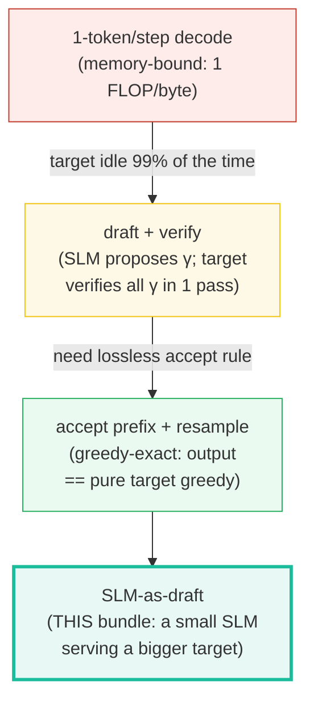
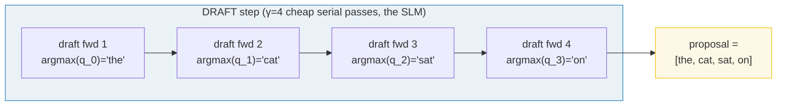
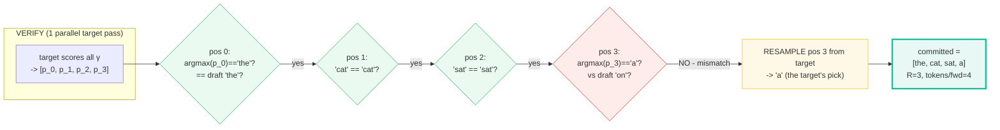
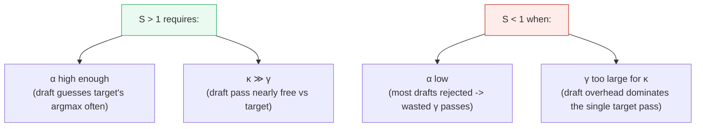
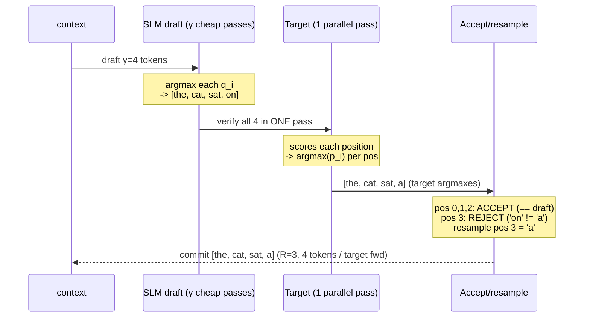
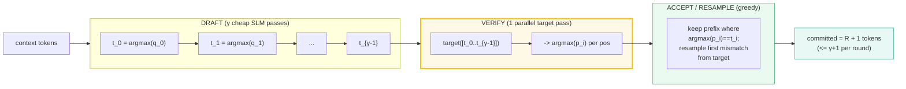

# Speculative Decoding with an SLM Draft — A Worked-Example Guide

> **Companion code:** [`speculative_draft.py`](./speculative_draft.py). **Every
> number in this guide is printed by `uv run python speculative_draft.py`** —
> change the code, re-run, re-paste. Nothing here is hand-computed.
>
> **Sibling guide (the INVERSE):** [`../llm/SPECULATIVE_DECODING.md`](../llm/SPECULATIVE_DECODING.md)
> — the big-model version. THERE a large model speculatively decodes *itself*
> (the focus is the rejection-sampling math that preserves the full distribution
> `p`); HERE the **SLM is the DRAFT model** that accelerates a *bigger* target.
> The accept/resample loop is structurally identical; only the perspective flips.
> Cross-references are marked 🔗 throughout.
>
> **Live animation:** [`speculative_draft.html`](./speculative_draft.html) — drag
> sliders for γ / α, watch the draft→verify→accept timeline.
>
> **Phase:** Phase 6 (Edge Deployment & Runtimes).

---

## 0. TL;DR — the whole idea in one picture

> **The apprentice analogy (read this first):** A master craftsman (the **target
> model**, e.g. 7B) can stamp one perfect token per second — but 99% of that
> second is spent *waiting for the warehouse to deliver their heavy toolbox*
> (reading weights from RAM): one weight-load, one token of useful work. A fast
> **apprentice** (the **SLM draft model**, e.g. 0.5B-1B) carries a tiny toolbox
> and can sketch ahead cheaply. **Speculative decoding** lets the apprentice
> sketch γ tokens, then the master verifies *all γ sketches in a single pass*
> — turning the master's idle memory-wait into useful compute. We keep the
> longest prefix where the master **agrees** with the apprentice (target argmax
> == draft token) and **resample** the first disagreement from the master. Cost
> drops from (γ target passes) to (γ cheap draft passes + 1 target pass). The
> SLM's whole job: be a **cheap, accurate proposer** for a bigger target.

The core problem this bundle solves: **autoregressive decode is
memory-bandwidth-bound.** Generating one token reads the entire target's weights
once for ~1 FLOP/byte. An SLM is small enough that reading *its* weights is
cheap — so let it guess ahead, and let the target verify in bulk:



> One plain sentence: **the SLM guesses ahead so the big target does γ tokens of
> useful work per weight-load instead of 1 — and an accept/resample rule makes
> the output indistinguishable from the target alone.**

| | Autoregressive decode (1 token/step) | Speculative decoding (SLM draft) |
|---|---|---|
| **Tokens per target forward** | 1 | up to γ + 1 |
| **Target weight-loads per token** | 1 | ≈ 1/(R+1) |
| **Arithmetic intensity** | ~1 FLOP/byte | ~(R+1) FLOP/byte |
| **Who proposes?** | the target (1 at a time) | the **SLM** (γ at a time) |
| **Output (greedy variant)** | target greedy | **exactly** target greedy |
| **Quality loss** | — | **None** (greedy-exact, §3) |

> 🔗 **If you only read one cross-reference:** [`../llm/SPECULATIVE_DECODING.md`](../llm/SPECULATIVE_DECODING.md)
> is the big-model inverse. THERE the focus is the rejection-sampling math that
> preserves the *full* target distribution `p` (accept iff `u ≤ min(1, p/q)`,
> resample from `max(0, p−q)/Z`). HERE we implement the simpler **greedy
> variant** (accept iff `target_argmax == draft_token`), which preserves the
> *greedy* target output exactly. Same loop, two distribution contracts.

---

### Glossary (plain English — refer back any time)

| Term | Plain meaning |
|---|---|
| **target model** | The big, expensive model whose output we want (e.g. 7B). |
| **draft model** | The small, cheap **SLM** that proposes tokens (e.g. 0.5B–1B). Must be "order(s) of magnitude smaller", share the target's vocab, and ideally be trained on the same data. |
| **γ (gamma)** | Number of draft tokens proposed per speculative round (4–8; here γ=4). |
| **V (vocab)** | Number of possible next tokens (here a tiny 8-token vocab). |
| **logits** | `[V]` raw preference scores from an LM head. |
| **softmax** | Turns logits into probabilities that sum to 1. |
| **q_i / p_i** | `[V]` draft / target probability distribution at position *i*. |
| **argmax** | The token id with the highest logit (the greedy pick). |
| **draft_token_i** | `argmax(q_i)` — the SLM's greedy pick at position *i*. |
| **target_argmax_i** | `argmax(p_i)` — what the target would have picked. |
| **accepted prefix (R)** | The longest run from position 0 where `target_argmax == draft_token`. |
| **resample** | At the first mismatch, take the target's own greedy token. |
| **bonus token** | The `+1` committed token — spec always emits ≥1 token/round. |
| **committed tokens** | `R` accepted + 1 resampled/bonus = `R + 1` per round. |
| **α (alpha)** | Per-position agreement rate `P[target_argmax == draft_argmax]`. |
| **κ (kappa)** | `draft_speed_advantage` — how many times cheaper a draft pass is than a target pass (κ=8 ⇒ draft pass costs 1/8 of a target pass). |
| **causal mask** | Lets position *i* attend only to `0..i` — what makes the parallel verify correct. 🔗 [`../llm/CAUSAL_MASK.md`](../llm/CAUSAL_MASK.md). |

---

## 1. The lineage — why each step happened

> **From wasteful to amortized.** Plain autoregressive decode pays the full
> memory cost of reading the target's weights for *one* token. Speculative
> decoding splits the work: a cheap SLM does the guessing (its weights are tiny,
> so each guess is nearly free), and the expensive target does the *verifying*
> — but verifies γ tokens in the same single pass that would otherwise emit 1.



> From `speculative_draft.py` **Section E** — the lineage table:
>
> | stage | what it does | win / cost | where |
> |---|---|---|---|
> | 1-token/step decode | target emits 1 token per forward; reads ALL weights once for 1 token | ~1 FLOP/byte, GPU 99% idle; memory-bandwidth-bound | ../llm/SPECULATIVE_DECODING.md Section A |
> | draft + verify (parallel) | small DRAFT proposes GAMMA tokens; TARGET verifies all GAMMA in 1 pass | 1 target weight-load does GAMMA tokens of work (K FLOP/byte) | Leviathan 2023 arXiv:2211.17192 |
> | SLM-as-draft (this bundle) | an SLM is the DRAFT serving a bigger TARGET; accept prefix + resample | up to (1+GAMMA)x fewer target passes; greedy-exact (zero quality loss) | ../llm/SPECULATIVE_DECODING.md (the big-model inverse) |

**Reading the lineage like a story:**

- **Stage 1 (the problem).** Each decode step loads *every* target weight from
  RAM to do ~2 FLOPs of math per byte. The math units run at <1% of peak — the
  GPU starves waiting on memory. 🔗 [`../llm/SPECULATIVE_DECODING.md`](../llm/SPECULATIVE_DECODING.md)
  §1 quantifies this ("arithmetic intensity ≈ 1 FLOP/byte").
- **Stage 2 (the fix).** Split the work. A small draft model autoregressively
  proposes γ tokens (γ cheap passes — its weights are tiny); the target then
  scores *all γ* in **one** parallel forward pass (one expensive weight-load,
  γ positions of useful work). The arithmetic intensity rises from ~1 to ~γ
  FLOP/byte — same memory cost, γ× the useful math. (Leviathan et al. 2023.)
- **Stage 3 (this bundle's lens).** Reframe stage 2 around the SLM: *the SLM is
  the draft*. Its entire purpose is to be a cheap, accurate proposer for a
  bigger target. The accept/resample loop is structurally identical to the
  big-model version; only the perspective flips from "preserve `p`" (stochastic)
  to "preserve the greedy target" (this guide).

> One plain sentence: stage 1 wastes the target's memory bandwidth on 1 token;
> stage 2 amortizes it over γ by letting a cheap draft guess ahead; stage 3
> recognizes that *the SLM is that cheap draft*.

---

## 2. The draft step — the SLM proposes γ tokens — Section A output

> **The apprentice sketches.** The SLM runs γ serial forward passes — one per
> proposed token — each producing a `[V]` logit vector. Its greedy pick at each
> position is `argmax` of that vector. Because the draft's weights are tiny (an
> SLM is "order(s) of magnitude smaller" than the target, e.g. 68M draft for a
> 7B target), each pass is nearly free.

For the toy (γ=4, V=8), each position has its own draft logit vector (modelling
a real autoregressive draft where each step's distribution depends on the tokens
emitted so far):

> From `speculative_draft.py` **Section A**:
>
> | pos | draft logits [V=8] | argmax | token | q(argmax) |
> |---|---|---|---|---|
> | 0 | [3.0, 2.0, 0.5, 1.5, 0.3, 1.8, 0.7, 1.2] | 0 | the | 0.4335 |
> | 1 | [2.0, 3.0, 0.5, 1.5, 0.3, 1.8, 0.7, 1.2] | 1 | cat | 0.4335 |
> | 2 | [1.0, 2.0, 0.5, 3.5, 0.3, 1.8, 0.7, 1.2] | 3 | sat | 0.5749 |
> | 3 | [1.0, 2.0, 0.5, 1.5, 0.3, 3.5, 0.7, 1.2] | 5 | on | 0.5910 |
>
> Draft tokens (the SLM's greedy proposal): `[0, 1, 3, 5]` → `['the', 'cat', 'sat', 'on']`



> One plain sentence: the SLM cheaply runs γ forwards and hands the target a
> γ-token guess — `['the', 'cat', 'sat', 'on']` here.

**Why the draft must be small and synced:** production speculative servers
require the draft to be *order(s) of magnitude smaller* than the target, to
share the *same vocabulary*, and ideally to be *trained on the same data*
(UCSD CSE291A lecture). A 68M draft for a 7B target is a typical pairing.
🔗 [`./SCALING_LAWS.md`](./SCALING_LAWS.md) explains why an *overtrained* small
model makes a particularly good draft — its loss is low for its size.

---

## 3. The verify + accept/resample loop — Section B & C output

> **The master checks all γ sketches at once, then commits the agreed prefix.**
> The target runs **one** parallel forward pass over the γ draft tokens (a causal
> mask makes position *i* attend only to `0..i`, so each position gets the
> target's *true* conditional). Then we walk left-to-right: ACCEPT while
> `target_argmax == draft_token`; at the first mismatch RESAMPLE that position
> by taking the target's own greedy pick. Always append one bonus/resample
> token, so a round commits exactly `R + 1` tokens.

### The verify step (target scores all γ in 1 pass)

> From `speculative_draft.py` **Section B**:
>
> | pos | draft token | q(draft) | p(draft) | target argmax | agree? |
> |---|---|---|---|---|---|
> | 0 | the (0) | 0.4335 | 0.6753 | the (0) | YES |
> | 1 | cat (1) | 0.4335 | 0.5865 | cat (1) | YES |
> | 2 | sat (3) | 0.5749 | 0.6904 | sat (3) | YES |
> | 3 | on (5) | 0.5910 | 0.0517 | a (6) | no (REJECT) |
>
> Agreement: target matches draft on **3/4** positions.

### The accept/resample decision (greedy variant — the GOLD anchor)

> From `speculative_draft.py` **Section C** — per-position decision:
>
> | pos | draft t_i | target argmax | decision | committed so far |
> |---|---|---|---|---|
> | 0 | the | the | ACCEPT (the == the) | ['the'] |
> | 1 | cat | cat | ACCEPT (cat == cat) | ['the', 'cat'] |
> | 2 | sat | sat | ACCEPT (sat == sat) | ['the', 'cat', 'sat'] |
> | 3 | on | a | REJECT -> resample = a | ['the', 'cat', 'sat', 'a'] |
>
> - Accepted-prefix length **R = 3** (positions 0..2 accepted)
> - Resample/bonus token = **a** (from the target)
> - Committed this round = `[0, 1, 3, 6]` → `['the', 'cat', 'sat', 'a']`
>   = 3 accepted + 1 resampled = **4 tokens**
> - **Tokens per target forward = 4**



### Why this is lossless (greedy-exact)

**The greedy variant preserves the GREEDY target output exactly.** The proof is
one line: on every accepted position the draft token *equals* the target's
argmax (that's the accept condition), and on the resample position we take the
target's argmax directly. So every committed token *is* the target's greedy
pick at its position — the sequence is byte-for-byte what pure-target greedy
decoding would emit. vLLM's docs state this guarantee explicitly: *"greedy
sampling with speculative decoding matches greedy sampling without it."*

> From `speculative_draft.py` **Section C** — greedy-exactness check:
>
> ```
> committed[:R+1]   = [0, 1, 3, 6]  ['the', 'cat', 'sat', 'a']
> pure-target greedy= [0, 1, 3, 6]  ['the', 'cat', 'sat', 'a']
> [check] committed[:R+1] == pure-target greedy over the same positions: OK
> [check] accepted-prefix length R == 3 (the GOLD pin): OK
> [check] committed == ['the','cat','sat','a']: OK
> [check] tokens per target forward == R + 1 == 4: OK
> ```

> 🔗 **The stochastic variant** (preserve the *full* distribution `p`, not just
> the greedy mode): instead of `target_argmax == draft_token`, accept iff a
> uniform `u ~ U[0,1]` satisfies `u ≤ min(1, p(t)/q(t))`, and on rejection
> resample from `max(0, p − q)/Z`. The algebra proves `P(output=x) = p(x)`
> *exactly*. That is the focus of [`../llm/SPECULATIVE_DECODING.md`](../llm/SPECULATIVE_DECODING.md)
> §3–§4. This guide implements the simpler greedy variant because it is what
> most production code-completion / edge deployments use (deterministic,
> `temperature=0`).

---

## 4. The speedup — when does the SLM draft actually help? — Section D output

> **The speedup depends on two knobs: the agreement rate α (how often the draft
> guesses the target's argmax) and the draft cost ratio κ (how many times
> cheaper a draft pass is).** For the greedy variant, the expected tokens
> committed per target forward is a geometric series; the speedup divides that
> by the total cost (1 target pass + γ draft passes, each at 1/κ of a target
> pass).

```
E[tokens / target forward] = 1 + α + α² + ... + α^γ      (R+1, in expectation)
                           = (1 − α^(γ+1)) / (1 − α)

S (speedup over plain 1-token/step decode)
  = E[tokens/forward] / (1 + γ/κ)
  = (1 − α^(γ+1)) / ((1 − α) · (1 + γ/κ))
```

- **Numerator** = expected tokens committed per round (the `+1` is the
  bonus/resample token; at α=1 it equals γ+1).
- **Denominator** = target-pass-equivalents per round: 1 target pass + γ draft
  passes, each costing `1/κ` of a target pass.

> From `speculative_draft.py` **Section D** — expected tokens per target forward:
>
> | α | γ=2 | γ=4 | γ=8 | γ=8 @ α=1 |
> |---|---|---|---|---|
> | 0.3 | 1.39 | 1.43 | 1.43 | 9.00 |
> | 0.5 | 1.75 | 1.94 | 2.00 | 9.00 |
> | 0.7 | 2.19 | 2.77 | 3.20 | 9.00 |
> | 0.9 | 2.71 | 4.10 | 6.13 | 9.00 |
> | 1.0 | 3.00 | 5.00 | 9.00 | 9.00 |
>
> Speedup `S = E[tokens/forward] / (1 + γ/κ)`, κ=8 (draft 8× cheaper):
>
> | α | γ=2 | γ=4 | γ=8 |
> |---|---|---|---|
> | 0.3 | 1.11 | 0.95 | 0.71 |
> | 0.5 | 1.40 | 1.29 | 1.00 |
> | 0.7 | 1.75 | 1.85 | 1.60 |
> | 0.9 | 2.17 | 2.73 | 3.06 |



**Rules of thumb** (cross-checked against Leviathan 2023 and the UCSD lecture):

- The draft must be **cheap** relative to the target (κ ≫ γ). With κ=8, γ=4, the
  round costs `1 + 4/8 = 1.5` target-pass-equivalents — spec wins once
  `E[tokens] > 1.5`, i.e. once α ≳ 0.4.
- The draft must be **accurate** (α high). At α=0.5, γ=4 gives only 1.29× —
  barely worth it. At α=0.9 it gives 2.73×. Agreement is highest at
  `temperature ≈ 0` (both models pick the same top token), which is exactly why
  the greedy variant is the common deployment.
- **Increasing γ** helps when α is high (more accepted tokens per round) but
  *hurts* when α is low (more wasted draft passes). At α=0.3, γ=8 gives S=0.71
  — *slower* than plain decode.
- **Published (labelled, not measured here):** Leviathan et al. 2023: 2×–3× on
  T5-XXL. EAGLE (arXiv:2401.15077): 2.7×–3.5× on LLaMA2-Chat 70B. vLLM spec
  decode: 1.4×–1.6× typical (greedy equality preserved).

> 🔗 The agreement rate α depends on how well the SLM's distribution `q` aligns
> with the target's `p`. An *overtrained* small model (more tokens than
> Chinchilla-optimal) has unusually low loss for its size — making it an
> unusually accurate draft. See [`./SCALING_LAWS.md`](./SCALING_LAWS.md).

---

## 5. The worked example (γ=4, R=3) — the GOLD centerpiece

> **The gold trace, end to end.** A complete speculative round with the fixed
> toy distributions. The SLM drafts `['the','cat','sat','on']`; the target
> agrees on the first three and resamples the fourth to `'a'`; the round
> commits 4 tokens in a single target forward.



**Pinned GOLD values** (the `.html` recomputes and gold-checks these):

> From `speculative_draft.py` **GOLD RECAP**:
>
> ```
> GAMMA                                = 4
> draft greedy tokens                  = [0, 1, 3, 5]
> target argmax per pos                = [0, 1, 3, 6]
> accepted-prefix length R (GOLD)      = 3
> committed tokens                     = [0, 1, 3, 6]
> tokens per target forward (GOLD)     = 4  (= R + 1)
> => ~4x fewer target passes than plain decode (this round)
> greedy-exact: committed == pure-target greedy over the same positions
> ```

**The 4× in one breath:** plain decode needs **4 target forwards** to emit 4
tokens; speculative decode needs **1 target forward** (plus 4 cheap SLM passes)
to emit the same 4 tokens. That is the entire payoff — `(R+1)` tokens per
target pass instead of 1.

> 🔗 After this round, the target's KV cache holds `prefill + R` agreed tokens
> plus the resample. On rejection, the γ−R disagreeing draft positions' KV
> entries must be torn out before the next step — see
> [`../llm/SPECULATIVE_DECODING.md`](../llm/SPECULATIVE_DECODING.md) §6 (`rewind`).

---

## 6. Pitfalls & debugging checklist

| # | Trap | Symptom | Fix |
|---|---|---|---|
| 1 | **Draft too weak (α low)** | Most drafts rejected; speedup S ≈ 1 or < 1 | Use a better-aligned SLM (overtrained, same data); lower γ; consider EAGLE-style feature-level draft (🔗 ../llm §7) |
| 2 | **γ too large for κ** | Draft overhead dominates the single target pass; S < 1 | Tune γ to α: large γ only when α is high; keep κ ≫ γ (draft much cheaper than target) |
| 3 | **Forgetting the bonus/resample token** | Round sometimes commits 0 tokens (deadlock) | Always append `+1`: committed = R accepted + 1 resampled/bonus (§3) |
| 4 | **Greedy vs stochastic confusion** | Expecting distribution preservation but getting only greedy-exact | Greedy variant preserves the *greedy* target; for full-`p` preservation use rejection sampling `u ≤ min(1, p/q)` + resample `max(0,p−q)/Z` (🔗 ../llm §3) |
| 5 | **Draft & target vocab / tokenizer mismatch** | Garbage or crash; argmax ids refer to different tokens | Draft must share the target's *exact* vocabulary/tokenizer (UCSD lecture) |
| 6 | **KV cache desync on rejection** | Stale entries corrupt the next round | `rewind(γ − R)` to tear out the disagreeing draft positions' K,V (🔗 ../llm §6) |
| 7 | **Sequential verification instead of parallel** | No speedup (γ serial target passes) | Verify ALL γ in ONE forward with the causal mask (🔗 ../llm §2) |
| 8 | **Draft not trained on target's data** | Low α even with a small fast draft | Train/finetune the SLM draft on the target's distribution so `q ≈ p` |

---

## 7. Cheat sheet



- **Variant:** greedy / argmax verification — preserves the **greedy target**
  output exactly (vLLM: "greedy == greedy").
- **Accept rule:** accept position *i* iff `argmax(p_i) == t_i` (target's top
  pick equals the draft token); resample the first mismatch from the target.
- **Committed per round:** `R + 1` (R accepted + 1 bonus/resample); always ≥ 1.
- **Tokens per target forward (expected):** `(1 − α^(γ+1)) / (1 − α)`.
- **Speedup:** `S = (1 − α^(γ+1)) / ((1 − α)·(1 + γ/κ))`. Need κ ≫ γ and α high.
- **Draft sizing:** order(s) of magnitude smaller than target; same vocab; same
  data (e.g. 68M draft for a 7B target).
- **Gold (this guide):** draft `[the,cat,sat,on]` → accept 3, reject `on` →
  resample `a` → committed `[the,cat,sat,a]`, **R=3, tokens/forward=4**.

> 🔗 **Cross-references:**
> - [`../llm/SPECULATIVE_DECODING.md`](../llm/SPECULATIVE_DECODING.md) — the
>   big-model inverse; this bundle is its SLM-as-draft reframing.
> - [`./GGUF_QUANT.md`](./GGUF_QUANT.md) — quantize both draft + target so they
>   co-fit edge RAM.
> - [`./MLX_METAL_EDGE.md`](./MLX_METAL_EDGE.md) — the unified-memory runtime
>   where draft + target share RAM.
> - [`./SCALING_LAWS.md`](./SCALING_LAWS.md) — the overtrained small N is what
>   makes a good cheap draft model (high α at low cost).
> - [`./PRETRAINING_STABLE.md`](./PRETRAINING_STABLE.md) — the draft model is a
>   trained SLM; this is how it got its distribution `q`.

---

## Sources

- **Leviathan, Y.; Kalman, M.; Matias, Y. (2023).**
  *Fast Inference from Transformers via Speculative Decoding.*
  ICML 2023 Oral. arXiv:2211.17192 — https://arxiv.org/abs/2211.17192
  The foundational paper. Establishes that "decoding K tokens takes K serial
  runs of the model" (the memory-wall motivation, [§1](#1-the-lineage--why-each-step-happened)),
  introduces the draft+verify pipeline ([§2](#2-the-draft-step--the-slm-proposes-γ-tokens--section-a-output),
  [§3](#3-the-verify--acceptresample-loop--section-b--c-output)), and demonstrates
  "a 2X-3X acceleration" on T5-XXL "with identical outputs". Author's ICML talk:
  https://yanivle.github.io/ai/2023/07/25/speculative-decoding-icml.html

- **../llm/SPECULATIVE_DECODING.md** (in-repo sibling guide).
  The big-model inverse of this bundle. Verifies the parallel verify + causal
  mask ([§2](#2-the-draft-step--the-slm-proposes-γ-tokens--section-a-output)),
  the stochastic rejection-sampling accept rule `u ≤ min(1, p/q)` and resample
  `max(0, p−q)/Z` that preserves the *full* distribution `p` (the variant
  contrasted in [§3](#3-the-verify--acceptresample-loop--section-b--c-output)),
  the KV-cache `rewind` on rejection ([§5](#5-the-worked-example-γ4-r3--the-gold-centerpiece)),
  and the speedup bound used in [§4](#4-the-speedup--when-does-the-slm-draft-actually-help--section-d-output).

- **Abhyankar, R. "Speculative Decoding" (UCSD CSE291A lecture, Fall 2025).**
  https://cseweb.ucsd.edu/~yiying/cse291a-fall25/reading/spec-decoding.pdf
  Walks the drafting → verification pipeline. Verifies the draft must be
  "order(s) of magnitude smaller" (e.g. "LLM = 7B, SSM = 68M"), share "the same
  vocabulary size as the LLM", and be "ideally trained on the same data"
  ([§2](#2-the-draft-step--the-slm-proposes-γ-tokens--section-a-output)).
  Confirms "2-3x speedup depending on token acceptance rate (TAR)" and the
  γ-too-large / α-too-low pitfalls ([§4](#4-the-speedup--when-does-the-slm-draft-actually-help--section-d-output),
  [§6](#6-pitfalls--debugging-checklist)).

- **vLLM Documentation — "Speculative Decoding".**
  https://docs.vllm.ai/en/latest/features/speculative_decoding/
  Verifies the **greedy variant** this bundle implements: explicitly lists
  "Greedy Sampling Equality: Confirms that greedy sampling with speculative
  decoding matches greedy sampling without it" — the exact claim asserted in
  [§3](#3-the-verify--acceptresample-loop--section-b--c-output).

- **Leviathan, Y. "Looking back at speculative decoding" (Google Research Blog).**
  https://research.google/blog/looking-back-at-speculative-decoding/
  A second, independent statement from the paper's first author confirming
  speculative decoding is "an effective technique for faster and cheaper
  inference from LLMs without compromising quality" (the lossless-speedup
  claim of [§0](#0-tldr--the-whole-idea-in-one-picture)).

- **Li, Y.; Wei, F.; Zhang, C.; Zhang, H. (2024).**
  *EAGLE: Speculative Sampling Requires Rethinking Feature Uncertainty.*
  arXiv:2401.15077 — https://arxiv.org/abs/2401.15077
  A draft-model variant (a lightweight autoregressive head on the
  second-to-top-layer features). Verifies the realistic speedup ceiling:
  "2.7×–3.5× latency speedup on LLaMA2-Chat 70B with doubled throughput"
  ([§4](#4-the-speedup--when-does-the-slm-draft-actually-help--section-d-output)).

> The full per-URL provenance log (with `Verifies:` lines) lives in
> [`speculative_draft_reference.txt`](./speculative_draft_reference.txt).
