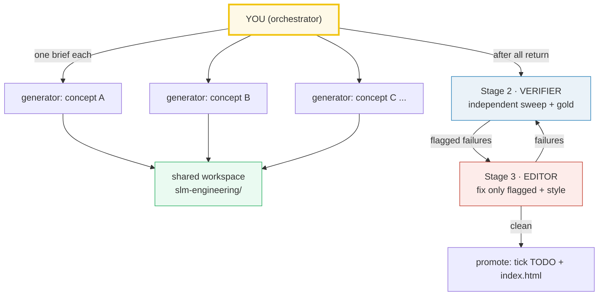

# SUBAGENTS_RESEARCH_GUIDE — Delegating Bundle-Building at Scale (SLM Engineering)

> A note from past-me to future-me: **how to spin up many `slm-engineering/`
> concept bundles in parallel using subagents, without losing rigor.**
>
> This sits **above** [`HOW_TO_RESEARCH.md`](./HOW_TO_RESEARCH.md) (per-bundle
> workflow) and [`HOW_TO_ANIMATE.md`](./HOW_TO_ANIMATE.md) (the `.html` recipe).
> Those two define *what* a bundle is and *how* to build one by hand. This guide
> defines *how to delegate* that work to many agents at once. The 20-bundle plan
> lives in [`RESEARCH.md`](./RESEARCH.md); the per-bundle queue in
> [`TODO.md`](./TODO.md).



---

## 0. The 3-stage pipeline (coordinator-only)

The coordinator writes briefs, launches subagents, reads reports, and sequences
stages — it does **NOT** write bundle code. All bundle work happens in three stages:

| Stage | Who | Does |
|---|---|---|
| **1 · generators** | N subagents (one per bundle, parallel, ≤4/batch) | build the 5-file bundle per its brief; self-verify `[check]` passes; web-check every formula → `_reference.txt` |
| **2 · verifier** | 1 subagent (or the coordinator running the sweep) | independent re-run: `uv run python`, `node --check`, runtime smoke, gold value vs `.py`, `_reference.txt` present; report per-bundle pass/fail |
| **3 · editor** | 1 subagent | fix ONLY what the verifier flagged; backport house style; cross-link siblings; **never alter a computed number** |

**Non-negotiable rules:**
- Coordinator = briefs + sequencing + reports only. No bundle code from the coordinator.
- Generators own **disjoint** 5-path file sets → safe parallel writes.
- Verifier is **independent** — it re-runs everything; it does not trust generator self-reports.
- Editor edits **only** flagged items; computed numbers are ground truth.

---

## 1. When to use this mode

Use subagent delegation when you need **≥3 concept bundles** built to a uniform
bar. For 1–2 bundles, build by hand (follow `HOW_TO_RESEARCH.md`). The moment
you're doing a whole phase, delegate. **The trap it prevents:** building many
things in one session fills context, quality drifts, later bundles get sloppy.
Subagents each get a fresh context, so bundle #20 is as rigorous as bundle #1.

---

## 2. Coordination rules (keep the swarm safe)

1. **Disjoint file ownership.** Each generator writes only its 5 files
   (`{name}.py`, `{name}_output.txt`, `{name}_reference.txt`, `{NAME}.md`,
   `{name}.html`). State the exact paths in the brief and forbid edits elsewhere.
   This is what makes parallel writes safe in the shared `slm-engineering/` dir.
2. **No dependency/manifest edits.** `pyproject.toml` / `uv.lock` are read-only to
   generators. torch is pre-installed and suffices for everything. If a generator
   "needs" another lib, it must implement from scratch (more educational anyway).
3. **Launch in parallel.** Send all generator `Task` calls in ONE message.
   Independent file ownership = safe concurrency = max throughput.
4. **Max 4 generators per batch.** Sweep, then the next batch. Small batches =
   observable, recoverable failures.
5. **One concept per generator.** Never two — context splits and both degrade.

---

## 3. The standard worker preamble (send this, filled in)

Every generator gets this preamble verbatim, then a per-concept "brief" (§4). The
preamble is constant across all generators — that's what keeps the bundles uniform.
Only the brief block changes.

```text
You are building ONE "concept bundle" for the SLM-Engineering learning repo. Work
ENTIRELY inside /Volumes/data/workspace/tutorials/slm-engineering/. Do NOT touch
any file that is not part of your assigned bundle, and do NOT edit pyproject.toml,
uv.lock, HOW_TO_RESEARCH.md, HOW_TO_ANIMATE.md, SUBAGENTS_RESEARCH_GUIDE.md,
TODO.md, RESEARCH.md, index.html, or any other bundle.

=== STEP 0: ABSORB THE WORKFLOW (mandatory, do first, in order) ===
1. Read /Volumes/data/workspace/tutorials/slm-engineering/HOW_TO_RESEARCH.md IN FULL.
   It is the law: the 5-file bundle = {name}.py (ground truth) + {name}_output.txt
   (captured stdout) + {name}_reference.txt (web provenance) + {NAME}.md (guide)
   + {name}.html (interactive companion).
2. Read /Volumes/data/workspace/tutorials/slm-engineering/HOW_TO_ANIMATE.md IN FULL.
3. Study the canonical model bundles and COPY THEIR STYLE EXACTLY (these are in the
   sibling ../llm/ section — they are the proven green reference for this exact
   discipline):
   - ../llm/rope.py + ../llm/ROPE.md + ../llm/rope.html
   - ../llm/zero.py + ../llm/ZERO.md + ../llm/zero.html
   Match: the doc-comment header; the banner()/sectionBanner()/check() helpers;
   the section_*() print structure of the .py; the "> From {name}.py Section X:"
   verbatim callouts + mermaid + pitfalls table + cheat sheet + ## Sources in the
   .md; the dark palette + slider + [check: OK] gold-badge + rope.html header
   structure (badges + guide-callout) in the .html. NOTE: those ../llm/ bundles
   predate the _reference.txt convention (they have ## Sources in the .md only);
   YOUR bundle adds {name}_reference.txt as a 5th file.

=== STEP 1: MINE THE LINEAGE SOURCE ===
Read the bundle's lineage cited in RESEARCH.md and quote real code/formulas from:
{CITE_LINEAGE_FILES_HERE}

=== STEP 2: FACT-CHECK VIA WEB SEARCH (mandatory, do NOT skip) ===
For every formula, year, author, signature, and behavioral claim: web-search the
original paper(s) on arXiv and >=1 other authoritative source. Verify the EXACT
fact in >=2 places. NEVER guess a formula, signature, or number. If you cannot
verify a fact, search until you can, or flag it explicitly in your final report.
Start your searches at: {WEB_ANCHORS_HERE}

LOG every reference into {name}_reference.txt (a committed provenance file), one
entry per URL, in this exact format so the sweep can grep it:
    [1] <full URL>
        <source name + authority, e.g. "Hoffmann et al 2022 Chinchilla (official)">
        Verifies: <the exact claim/formula/value this source supports>
    [2] <full URL>
        ...
Distinct URLs >= 2. THEN mirror a trimmed URL list into the "## Sources" section
at the bottom of {NAME}.md (the reader-facing summary). _reference.txt is the full
log with per-URL provenance; ## Sources is its public face. BOTH are mandatory.

=== HARD RULES ===
- NEVER hand-compute. The .py prints every value. The .md pastes values verbatim
  under "> From {name}.py Section X:" callouts. The .html recomputes with the
  IDENTICAL formula and gold-checks against one known .py value. No orphan numbers.
- Use torch ONLY. Run scripts with `uv run python {name}.py` from the
  slm-engineering/ dir. DO NOT modify pyproject.toml or uv.lock; DO NOT add any
  dependency (no numpy, no transformers, no datasets). Implement every algorithm
  (BPE, MinHash, DPO loss, Q4 quant, etc.) from scratch in pure Python/torch.
- DETERMINISM (or _output.txt won't reproduce across runs):
  * dict/set iteration is randomized -> collect keys into a list, SORT, then print.
  * thread/async output is nondeterministic -> collect, SORT, print from main().
  * Seeded RNG only (fixed torch.Generator/manual_seed or random.seed). NEVER
    derive a printed value from wall-clock (time.now / Date.now / unseeded rand).
  * Never print a raw pointer/address as a value (ASLR) — assert structural facts.
  * Floats: print to fixed precision (e.g. torch.set_printoptions(precision=4)).
- NO raw assert(): use a check(description, ok) helper that prints
  "[check] description: OK" and raises/exits non-zero on failure (so the sweep
  catches it). Plain assert is compiled out under -O.
- Tiny-but-complete dims (V=49152 or 2048, D=8 or 128, L=4) so every number prints
  while every behavior shows.
- Lint: `ruff check {name}.py` must pass (fix the cause; do not suppress).

=== {name}.html HARD RULES ===
- Single self-contained file (zero deps, inline <style>+<script>, opens from
  file://). Dark palette (--bg:#0d1117; --panel:#161b22; --ink:#e6edf3) with the
  SECTION ACCENT teal #1abc9c. JS recomputes with the IDENTICAL formula; a
  [check: OK] badge gold-checked against a known .py value.
- HEADER MIRRORS ../llm/rope.html EXACTLY (see HOW_TO_ANIMATE.md §2):
  * back-button -> ../index.html (the repo-root tutorials dashboard)
  * .badge.md (teal) + .badge.py (orange) -> FULL GitHub URLs
    (https://github.com/quanhua92/tutorials/blob/main/slm-engineering/{NAME}.md
     and .../{name}.py)
  * .guide-callout div right after the header, linking the .md (full GitHub URL)
  * sibling "compare with…" link is RELATIVE: ./vocab_rationalization.html
- Every <table> wrapped in <div style="overflow-x:auto;min-width:0">.

=== DELIVERABLES (exact paths) ===
- /Volumes/data/workspace/tutorials/slm-engineering/{name}.py
- /Volumes/data/workspace/tutorials/slm-engineering/{name}_output.txt
    (produce via: cd slm-engineering && uv run python {name}.py > {name}_output.txt 2>/dev/null)
- /Volumes/data/workspace/tutorials/slm-engineering/{name}_reference.txt
    (web provenance log from STEP 2; one [N] entry per URL + a "Verifies:" line; >=2 URLs)
- /Volumes/data/workspace/tutorials/slm-engineering/{NAME}.md
- /Volumes/data/workspace/tutorials/slm-engineering/{name}.html

{NAME}.md MUST contain: the lineage old->new with WHY each step happened; mermaid
diagrams (>=1; ALL diagrams mermaid fenced blocks — never ASCII art or images);
"> From {name}.py Section X:" verbatim tables; a worked smallest-scale example; a
pitfalls table (trap | symptom | fix); a cheat sheet; the why/internals analysis;
cross-references to sibling bundles (each link with a one-line WHY it matters,
including ../llm/ and ../local-llm/ siblings where the RESEARCH.md lineage cites
them); and a "## Sources" section (mirrors {name}_reference.txt; URLs, web-verified
>=2).

=== VERIFICATION (do ALL of these, then report) ===
Run from /Volumes/data/workspace/tutorials/slm-engineering/ :
1. `uv run python {name}.py` runs clean; every "[check] ... OK" passes (count > 0).
2. `uv run python {name}.py > /tmp/x.out 2>/dev/null` -> {name}_output.txt is
   non-empty AND byte-identical on a 2nd run (determinism).
3. `ruff check {name}.py` passes.
4. Extract the <script> from {name}.html, `node --check` it (must pass), AND run
   the DOM-mock runtime smoke test (node --check is syntax-only — it misses
   runtime crashes like undefined access / wrong arg count).
5. The .html gold-check value equals the .py value (badge says [check: OK], teal).
6. {name}_reference.txt exists, non-empty, every entry has a URL line AND a
   "Verifies:" line; distinct URLs >= 2.

=== REPORT BACK (your final message) ===
- The 5 file paths created.
- Check result: how many "[check] ... OK" printed, the ruff verdict, the
  node --check + runtime-smoke verdict, the gold-check verdict.
- Web sources used (count; the full provenance list is in {name}_reference.txt).
- Any fact you could NOT verify (do not hide uncertainty).

=== YOUR CONCEPT BRIEF ===
Bundle name: {name} / {NAME}
Phase: {PHASE_N} ({PHASE_THEME})
Lineage (old -> new / why): {LINEAGE}
Anchor formulas/concepts (verify on web, implement from-scratch in torch, assert):
  {ANCHOR_CONCEPTS}
Suggested .py sections: {SECTION_LIST}
Suggested .html panels: {PANEL_LIST}
Suggested mermaid in .md: {MERMAID_IDEAS}
A concrete value the runnable must print (gold anchor for the .html check):
  {PINNED_VALUE_OR_HOW_TO_DERIVE_IT}
Cross-references to wire up: {SIBLING_LINKS}
```

---

## 4. Filling the brief — the per-concept fields

The coordinator fills these for each generator (5 min each — this is where
orchestrator judgment lives):

| Field | What to put |
|---|---|
| `{CITE_LINEAGE_FILES}` | The lineage files from RESEARCH.md, e.g. `../llm/TOKENIZATION.md`, `../llm/ROPE.md` |
| `{WEB_ANCHORS}` | Original papers (arXiv IDs) + a search phrase |
| `{ANCHOR_CONCEPTS}` | The exact math/behavior, so the generator knows what to verify & assert |
| `{SECTION_LIST}` / `{PANEL_LIST}` | Suggested teachable points (A: formula, B: table, C: worked example, D: contrast…) |
| `{MERMAID_IDEAS}` | Diagrams the .md should contain |
| `{PINNED_VALUE}` | A concrete number the .py must print & the .html must reproduce |
| `{SIBLING_LINKS}` | Which 🔗 bundles to reference, each with a one-line why |

**Rule of thumb:** if you can't fill `{ANCHOR_CONCEPTS}` and `{PINNED_VALUE}`, you
don't understand the concept well enough to delegate — research it first.

---

## 5. The verification sweep (Stage 2 — run after ALL generators return)

Generators self-verify, but the verifier independently re-checks the whole batch.
This catches silent failures (a generator that reported OK but shipped a bug):

```bash
cd /Volumes/data/workspace/tutorials/slm-engineering
for name in scaling_laws vocab_rationalization depth_vs_width shared_embeddings; do
  echo "===== $name ====="
  uv run python $name.py > /tmp/$name.out 2>/tmp/$name.err \
    && echo "  py: ran" || { echo "  py: FAILED"; cat /tmp/$name.err; }
  grep -c "\[check\]" /tmp/$name.out | xargs -I{} echo "  checks printed: {}"
  ruff check $name.py >/dev/null 2>&1 && echo "  ruff: OK" || echo "  ruff: FAIL"
  test -s "${name}_output.txt" && echo "  output.txt: present" || echo "  output.txt: MISSING"
  test -s "${name}_reference.txt" && echo "  reference.txt: present" || echo "  reference.txt: MISSING"
  grep -c "Verifies:" ${name}_reference.txt 2>/dev/null | xargs -I{} echo "  reference entries: {}"
  python3 -c "import re;h=open('$name.html').read();open('/tmp/$name.js','w').write(re.search(r'<script>(.*)</script>',h,re.S).group(1))" \
    && node --check /tmp/$name.js && echo "  html JS syntax: OK" || echo "  html JS syntax: FAIL"
done
# Then the DOM-mock runtime smoke test (node --check is NOT enough):
#   node /tmp/html_runtime_check.js /Volumes/data/workspace/tutorials/slm-engineering
```

Then spot-check: open 2–3 `.html` in a browser, confirm `[check: OK]` is teal and a
couple of on-screen numbers match `_output.txt`; open 2–3 `.md` and confirm the
`> From … Section X:` callouts match `_output.txt` byte-for-byte.

**Re-spawn failures (Stage 3 editor):** any bundle that fails — re-launch ONE
worker for just that bundle, paste its prior output + the failing check, ask it to
fix ONLY the failure. Don't rewrite from scratch unless the whole bundle is wrong.

---

## 6. Common failure modes (and the fix)

| Generator symptom | Cause | Fix |
|---|---|---|
| `py: FAILED` / NaN / crash | wrong formula or dtype | re-spawn with correct `{ANCHOR_CONCEPTS}` + exact signature |
| `ruff: FAIL` | unformatted / unused var | fix the cause; never suppress (`# noqa`) without a noted reason |
| `_output.txt` differs on re-run | nondeterminism (dict order, unseeded RNG, wall-clock) | re-spawn citing the DETERMINISM hard rules |
| `[check]` count is 0 | generator skipped invariants | re-spawn: "add a check(...) for every invariant" |
| `node --check` fails on `<script>` | JS typo (unbalanced brace) | usually 1-line; re-spawn with the error |
| `.html` white-screen but `node --check` passes | **runtime** error (undefined access, wrong arg count) `node --check` can't see | run the DOM-mock smoke test; fix flagged files |
| `[check: FAIL]` badge in .html | JS formula drifted from .py | re-spawn: copy the .py formula verbatim into JS |
| Numbers in .md ≠ `_output.txt` | generator hand-typed a table | regenerate via capture, paste verbatim under callouts |
| No `_reference.txt` / no `## Sources` | generator skipped web search | re-spawn, make Step 2 non-optional |
| No pitfalls table | junior tutorial, no expert payoff | re-spawn, cite the three-layer depth rule |
| Relative links wrong in .html | badges not full GitHub URLs / sibling not relative / back-button not ../index.html | re-spawn citing HOW_TO_ANIMATE.md §2 |
| Generator edited another bundle/manifest | brief was loose | restore from git; tighten the "do NOT touch" clause |

---

## 7. The batch-run checklist (coordinator pre-flight)

Before launching a swarm:
- [ ] `uv run python -c "import torch"` works in `slm-engineering/`.
- [ ] Each generator's 5 file paths are disjoint from every other generator's.
- [ ] Each brief has `{WEB_ANCHORS}` (real arXiv IDs), `{ANCHOR_CONCEPTS}`, and a
      concrete `{PINNED_VALUE}`.
- [ ] The sweep script (§5) is ready with this batch's stem list.

After the swarm returns:
- [ ] Stage 2 sweep green for all bundles in the batch.
- [ ] Spot-checked 2–3 `.html` in a browser; 2–3 `.md` callouts vs `_output.txt`.
- [ ] Re-spawned (Stage 3) any failures.
- [ ] Ticked `TODO.md`; added cards to `index.html`.

---

## 8. Why this works (and where it breaks)

- **Fresh context per bundle** → bundle #20 is as rigorous as #1.
- **Disjoint file ownership** → safe parallel writes; no merge conflicts.
- **The constant preamble** → uniform style without micromanaging each generator.
- **The brief is the leverage** → your judgment is concentrated in 5-minute
  briefs, not 50-minute hand-writes.

Where it breaks: if a brief is vague, the generator guesses; if you skip the
verification sweep, silent bugs ship. **The brief + the sweep are non-negotiable.**
