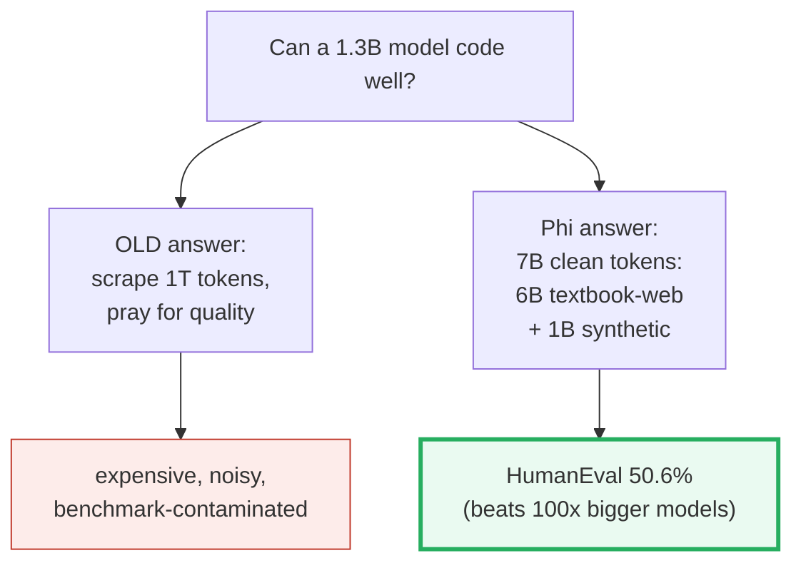
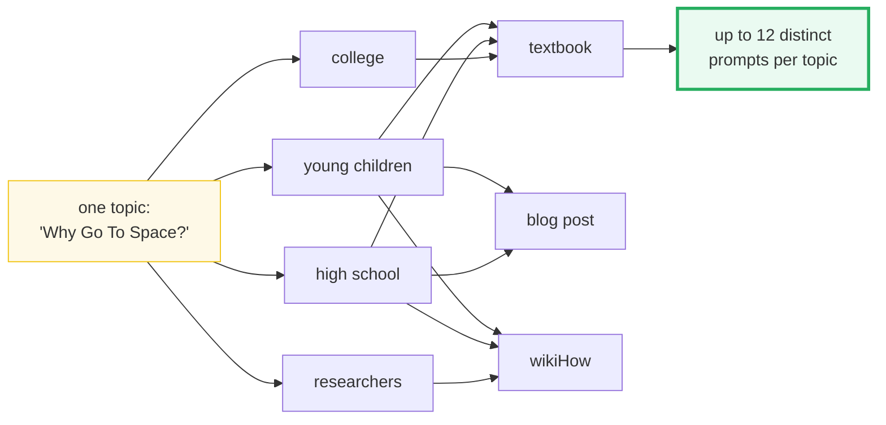

# Synthetic Curation — the Cosmopedia Pipeline (Synthetic Textbooks for SLMs)

> **Companion code:** [`synthetic_curation.py`](./synthetic_curation.py). **Every
> number in this guide is printed by `uv run python synthetic_curation.py`** —
> change the code, re-run, re-paste. Nothing here is hand-computed.
>
> **Live animation:** [`synthetic_curation.html`](./synthetic_curation.html) —
> open in a browser, pick a (topic, persona, style), watch the dry seed expand
> into a structured mock textbook, with a live type-token-ratio meter.
>
> **Phase:** Phase 2 — Data Curation & Mixing. *Data is the single biggest lever
> for SLM capability.* This bundle is *how* the highest-quality slice of that
> data gets manufactured, not scraped.

---

## 0. TL;DR — the whole idea in one picture

> **The textbook insight (read this first):** A small model trained on a *small*
> amount of extremely high-quality "textbook" data beats a giant model trained
> on a mountain of raw web. Phi-1 — **1.3B parameters, 7B tokens** (6B filtered
> "textbook-quality" web + 1B synthetic GPT-3.5 textbooks) — scored **50.6% on
> HumanEval**, beating models 100× its size. The lesson: **data quality, not
> quantity, is the dominant lever at the small-parameter scale.** The
> **Cosmopedia** pipeline is the open recipe that manufactures that quality at
> scale: *cluster real web → seed a topic distribution → attach a persona +
> style prompt → generate → quality-filter + decontaminate + dedup*.

```mermaid
graph LR
    Web["scraped web<br/>(noisy, contaminated)"] -->|filter for quality| Phi["Phi 'textbooks'<br/>6B filtered web<br/>+ 1B synthetic"]
    Phi -->|replicate openly| Cosmo["Cosmopedia pipeline"]
    Cosmo --> S1["cluster web<br/>-> seed topics"]
    S1 --> S2["persona + style<br/>system prompt"]
    S2 --> S3["generate<br/>(Mixtral-8x7B)"]
    S3 --> S4["filter + decontam<br/>+ dedup"]
    S4 --> Out["25B+ tokens of<br/>synthetic textbooks"]
    Out --> SLM["SLM pretraining mix<br/>(SmolLM, cosmo-1b)"]

    style Web fill:#fdecea,stroke:#c0392b
    style Phi fill:#fef9e7,stroke:#f1c40f
    style Out fill:#eafaf1,stroke:#27ae60,stroke-width:3px
    style SLM fill:#eaf2f8,stroke:#2980b9
```



> One plain sentence: instead of scraping *more* text, you *manufacture* the
> textbook you wish the web already were — grounded in real topics, voiced for a
> real audience, and scrubbed of benchmark leaks.

| | scraped web (the old way) | synthetic textbooks (Phi / Cosmopedia) |
|---|---|---|
| **Source** | Common Crawl dumps (RefinedWeb, FineWeb) | LLM-generated from curated prompts |
| **Quality** | Noisy, uneven, ads/SEO spam | "Textbook quality" by construction |
| **Coverage** | Whatever the web happens to contain | Driven by a *seeded topic distribution* |
| **Contamination** | Benchmark questions leak in | Decontaminated (10-gram + SequenceMatcher) |
| **Cost** | Cheap to collect, expensive to clean | Expensive to generate (~10k GPU-hr), clean |
| **Scale** | Trillions of tokens available | 25–28B tokens (Cosmopedia v1/v2) |
| **Who ships it** | Everyone (Llama, Falcon) | Phi-1/1.5/2, SmolLM, cosmo-1b |

---

### Glossary (plain English — refer back any time)

| Term | Plain meaning |
|---|---|
| **seed sample** | A real web or curated page used to *ground* a synthetic generation, keeping it on-topic. Cosmopedia conditions on one ~50% of the time. |
| **topic** | The subject a textbook is about — a cluster label (v1) or a BISAC book-classification category (v2). |
| **cluster** | A group of similar web documents; its label *becomes* a seed topic. Cosmopedia v1 made 145 clusters from RefinedWeb, kept 112. |
| **persona** | The "voice" generating the text (professor, storyteller, tutor). Cosmopedia uses **4 audiences**: young children, high school, college, researchers. |
| **style** | The output FORMAT — **3 styles** in Cosmopedia: textbook, blog post, wikiHow. |
| **prompt multiplication** | 4 audiences × 3 styles = **12 distinct prompts per topic** → more diversity from one seed, without extra seed data. |
| **generation** | Producing the textbook text from the prompt. In Cosmopedia: **Mixtral-8x7B-Instruct**. *In this bundle: a deterministic template (we model the pipeline, not free text).* |
| **TTR** | Type-token ratio = `unique_tokens / total_tokens`. A vocabulary-density proxy: a richer persona → more distinct words → higher TTR. |
| **coverage** | Fraction of seed topics the generated corpus actually touches. Low coverage → the model sees a skewed world. |
| **decontamination** | Removing benchmark questions (MMLU, HellaSwag, …) that leaked into seed samples, so eval scores reflect *real* capability, not memorization. |
| **dedup** | Removing near-duplicate generations (mode collapse). Cosmopedia targets **<1% duplicates**. 🔗 [`MINHASH_DEDUP.md`](./MINHASH_DEDUP.md). |

---

## 1. Why synthetic data — the "textbooks" bet

The default assumption in scaling-laws thinking is "more tokens = better model"
(🔗 [`SCALING_LAWS.md`](./SCALING_LAWS.md)). That is true *on average* and
*holding quality fixed*. But at the small-parameter scale, two things break:

1. **Quality variance dominates.** A 1.3B model cannot smooth over a pile of SEO
   spam, ads, and duplicated forum threads the way a 70B model can. Garbage in is
   *proportionally* more costly when there is little capacity to filter at
   inference.
2. **Benchmarks leak.** Raw web dumps contain MMLU / HellaSwag / ARC questions.
   Train on them and your benchmark scores *inflate without any real gain in
   capability* — the model memorized the test.

Phi's bet ([1]): instead of fighting the noise in scraped web, *manufacture* a
small, clean, textbook-grade corpus. Phi-1 trained on just **7B tokens** — 6B of
heavily filtered "textbook-quality" web plus 1B of synthetic textbooks and
exercises written by GPT-3.5 — and reached **HumanEval 50.6% / MBPP 55.5%**, a
result that, at the time, only models 100× larger achieved. A 350M sibling
(phi-1-small) still hit 45% on HumanEval.



> One plain sentence: when the model is small, you cannot buy your way out of bad
> data with volume — you have to *manufacture* quality.

---

## 2. The Cosmopedia pipeline (open replication of Phi-1.5)

Phi's synthetic datasets were never released and the reports left out the curation
details — sparking debate about whether the gains were real or benchmark
overfitting. Cosmopedia ([3]) is Hugging Face's *open* answer: the full pipeline,
prompts, dataset, and a reference 1B model (cosmo-1b) trained on it. The pipeline
is **six stages**, each simulated deterministically in `synthetic_curation.py`:

```mermaid
graph TD
    A["1. CLUSTER real web<br/>(RefinedWeb -> 145 clusters)"] --> B["2. SEED topics<br/>(label clusters; v2: 34k BISAC)"]
    B --> C["3. PROMPT<br/>topic + seed sample<br/>+ persona/style"]
    C --> D["4. GENERATE<br/>(Mixtral-8x7B-Instruct)<br/>-- simulated here --"]
    D --> E["5. DECONTAMINATE<br/>(10-gram + SequenceMatcher<br/>vs MMLU/HellaSwag/ARC...)"]
    E --> F["6. DEDUP<br/>(target <1% duplicates)"]
    F --> G["25-28B tokens of<br/>synthetic textbooks"]

    style A fill:#eaf2f8,stroke:#2980b9
    style C fill:#fef9e7,stroke:#f1c40f,stroke-width:2px
    style D fill:#0f2e29,stroke:#1abc9c,stroke-width:3px
    style G fill:#eafaf1,stroke:#27ae60,stroke-width:3px
```



The two most consequential design choices both live in **stage 3 (the prompt)**.
Everything downstream is just running a generator and cleaning up.

### 2.1 The prompt has exactly three components

A Cosmopedia prompt is *not* free-form. It is a structured triple, verified in the
official blog ([3]):

> 1. **the TOPIC** — a cluster label (v1) or a BISAC category (v2).
> 2. **the SEED SAMPLE** — a real web/curated page that grounds the generation
>    and keeps it on-topic.
> 3. **the GENERATION STYLE** — the target audience *and* the output format.

The seed sample is the anti-hallucination anchor: instead of asking the generator
to write about "chemistry" from memory (where it may invent facts), you hand it a
real chemistry page and ask it to *rewrite it as a textbook*. RAG-for-pretraining.

### 2.2 Persona × style = prompt multiplication

One topic gives you one textbook — but you need *millions* of prompts to reach
20B+ tokens, and you do **not** want them to be near-duplicates (mode collapse).
Cosmopedia's diversity trick: repurpose each topic across multiple **audiences**
and **styles** before ever touching new seed data.



**4 audiences × 3 styles = 12× distinct prompts per topic**, verified at ([3]):
*"By targeting four different audiences … and leveraging three generation styles
… we can get up to 12 times the number of prompts."* In SmolLM's v2 ([4]) the mix
was tuned to 40% middle-school / 30% college / 30% other. The multiplication is
what lets 20K topics seed 20M+ prompts.

> From `synthetic_curation.py` **Section B**:
>
> A Cosmopedia prompt has THREE components:
> (1) the TOPIC (2) the SEED SAMPLE (3) the GEN. STYLE
>
> Cosmopedia prompt multiplication: 4 audiences × 3 styles = 12 prompts/topic.
> `[check] Cosmopedia prompt multiplication is 4x3=12: OK`
>
> The toy taxonomy used in this bundle (3 personas × 2 styles):
>
> | persona | style |
> |---|---|
> | baseline_bot | academic_textbook |
> | baseline_bot | blog_post |
> | patient_professor | academic_textbook |
> | patient_professor | blog_post |
> | engaging_storyteller | academic_textbook |
> | engaging_storyteller | blog_post |
>
> → 3 personas × 2 styles = 6 (topic, persona, style) tuples per topic.
>
> Full example prompt — `(biology, patient_professor, academic_textbook)`:
>
> ```
> [system] You are a patient professor. Write a rigorous academic textbook section.
> [user]   Topic: biology. Seed sample: <a grounded web excerpt on biology>. Audience: patient professor. Style: a rigorous academic textbook.
>          Produce an intro, a definition, an example, and an exercise.
> ```

---

## 3. Stage 1 — clustering real web into a topic distribution

You cannot prompt a generator on a topic you have not *named*. Cosmopedia v1 got
its topic list by **clustering millions of RefinedWeb documents into 145
clusters**, then asking Mixtral to label each cluster from 10 random samples ([3]).
After dropping 33 clusters of low educational value (celebrity gossip,
obituaries, adult content), **112 topics** remained and drove >80% of the 23M
web-based prompts.

v2 ([4]) swapped the unsupervised clustering for a **predefined list of 34,000
BISAC book-classification topics** (the standard libraries use to shelve books) —
more control, more educational focus — and used a search tool to retrieve 1,000
relevant FineWeb pages per topic from 520M samples.

**Why a *distribution* matters:** the topic mix *is* the model's worldview. If you
generate 90% of your textbooks on celebrity news, your model becomes a celebrity
expert. The seed weights explicitly steer coverage.

> From `synthetic_curation.py` **Section A** — a toy 8-topic distribution + a
> seeded 40-draw sample:
>
> | topic | weight | share |
> |---|---|---|
> | algebra | 12 | 13.8% |
> | biology | 14 | 16.1% |
> | world_history | 9 | 10.3% |
> | computer_science | 16 | 18.4% |
> | civics | 7 | 8.0% |
> | geometry | 10 | 11.5% |
> | chemistry | 11 | 12.6% |
> | literature | 8 | 9.2% |
>
> Seeded sample (n=40, seed=42):
>
> | topic | drawn |
> |---|---|
> | algebra | 12 |
> | biology | 6 |
> | world_history | 6 |
> | computer_science | 4 |
> | civics | 4 |
> | geometry | 2 |
> | chemistry | 3 |
> | literature | 3 |
>
> coverage = 8/8 topics touched = **100.0%**
> `[check] coverage is 100% (all topics sampled at least once): OK`

> One plain sentence: clustering turns "whatever the web happens to contain" into
> a *controllable* topic distribution you can weight toward the domains you want
> the model to master.

---

## 4. Stage 4 — generation (simulated), and why the persona drives vocabulary

Here is the honest caveat for this bundle: **we do not call Mixtral.** A real
Cosmopedia run spends ~10k GPU-hours generating 25B tokens with Mixtral-8x7B
([3]). That is a deployment exercise, not a teachable concept. What *is*
teachable is the **pipeline shape** and the **quality metrics** you compute over
its output — and those we model exactly, with a deterministic template that fills
a fixed scaffold from each persona's adjective pool:

```
slot i  =  pool[(seed + i) % len(pool)]      # deterministic, JS-portable
scaffold:
  "{intro} {topic}.
   {Topic} is a {s0}, {s1} subject.
   Its {s2} and {s3} features matter.
   Students find the {s4}, {s5} parts clear.
   Exercise: review the {s6} and {s7} sections."
```

The scaffold is **identical across personas** — the only thing that changes is
the adjective pool. A persona with a *small* pool (`baseline_bot`, 4 adjectives)
cycles and repeats words; a persona with a *rich* pool
(`patient_professor`, 8 adjectives) uses distinct words. **That contrast *is* the
lesson**: richer prompting begets a richer vocabulary in the synthetic corpus,
which is *measurable* as type-token ratio (Section 5).

> From `synthetic_curation.py` **Section C** — three personas over the same topic
> (`algebra`, seed=42):
>
> | persona | pool size | sample generation (truncated) |
> |---|---|---|
> | baseline_bot | 4 | Here is info on algebra. Algebra is a common, general subject.… |
> | patient_professor | 8 | Let us explore algebra. Algebra is a foundational, nuanced sub… |
> | engaging_storyteller | 8 | Picture the world of algebra. Algebra is a curious, bright sub… |

### Worked example — the GOLD anchor (pinned for the `.html`)

Fix `(topic=photosynthesis, persona=patient_professor, style=academic_textbook,
seed=42)`. The deterministic expansion produces:

```
"Let us explore photosynthesis. Photosynthesis is a foundational, nuanced subject.
Its systematic and comprehensive features matter. Students find the profound,
elaborate parts clear. Exercise: review the intricate and rigorous sections."
```

Tracing the slots: `pool = [intricate, rigorous, foundational, nuanced,
systematic, comprehensive, profound, elaborate]` (8 words), seed=42.
`slot i = pool[(42+i) % 8]` → `foundational, nuanced, systematic, comprehensive,
profound, elaborate, intricate, rigorous`. All 8 distinct → high TTR.

> tokens = **30**, unique = **27**, **TTR = 0.9000**.
>
> This exact text and this exact TTR are recomputed by `synthetic_curation.html`
> and the gold-check badge asserts they match. `[check: OK]`.

---

## 5. Stage 5/6 — quality metrics & decontamination

Once you have generated billions of tokens, you must *measure* whether they are
any good before mixing them into pretraining (🔗 [`DATASET_MIXING.md`](./DATASET_MIXING.md)).
Cosmopedia tracks diversity (low duplicate rate, broad coverage) and *scrubs*
benchmark contamination. This bundle computes four metrics you can read off any
generated corpus:

| metric | formula | what it catches |
|---|---|---|
| **TTR** (type-token ratio) | `unique_tokens / total_tokens` | vocabulary density — mode collapse / persona poverty |
| **avg sentence length** | `mean(tokens per sentence)` | style drift (too terse ↔ too rambling) |
| **topic coverage** | `topics_touched / topics_seeded` | a skewed corpus → a skewed model |
| **contamination flag** | regex match on benchmark names | leaked test questions inflating evals |

> From `synthetic_curation.py` **Section D.1** — TTR across personas (topic=algebra, seed=42):
>
> | persona | pool | tokens | unique | TTR |
> |---|---|---|---|---|
> | baseline_bot | 4 | 31 | 23 | 0.7419 |
> | patient_professor | 8 | 30 | 27 | **0.9000** |
> | engaging_storyteller | 8 | 31 | 27 | 0.8710 |
>
> `patient_professor TTR = 0.9000`, `baseline_bot TTR = 0.7419`,
> delta = **+0.1581** (richer pool → higher vocabulary density).
> `[check] TTR(patient_professor) > TTR(baseline_bot): OK`

The headline invariant — **a richer persona yields a measurably higher TTR** — is
exactly the kind of thing you assert before shipping a synthetic corpus. If your
"college" persona doesn't beat your "terse bot" baseline on vocabulary density,
your prompt is broken.

> From `synthetic_curation.py` **Section D.2/D.3** — average sentence length and
> full-corpus coverage:
>
> | persona | avg sentence len |
> |---|---|
> | baseline_bot | 6.20 |
> | patient_professor | 6.00 |
> | engaging_storyteller | 6.20 |
>
> corpus coverage (one section per topic, one persona): topics touched = **8/8 = 100.0%**
> `[check] corpus coverage is 100% (every seed topic generated): OK`

### 5.1 Benchmark decontamination (the silent score-inflater)

Cosmopedia's decontamination is the step that keeps synthetic data *honest*. Both
the seed web samples *and* the generator's own training data can contain
benchmark questions. Train on them and your MMLU score goes up — but you learned
nothing. Cosmopedia's pipeline ([3]):

1. **10-gram overlap** to retrieve candidate contaminated samples.
2. **`difflib.SequenceMatcher`** to compare each candidate against the benchmark.
3. **Discard** if `len(matched) / len(benchmark_sample) > 0.5`.

Applied across MMLU, HellaSwag, PIQA, SIQA, Winogrande, OpenBookQA, ARC-Easy,
ARC-Challenge, BoolQ. This bundle simulates the *fast first pass* — a regex
blocklist on benchmark names — which catches the headline case (a sample that
literally says "MMLU") deterministically.

> From `synthetic_curation.py` **Section D.4** — benchmark decontamination:
>
> blocklist = `[MMLU, HellaSwag, PIQA, ARC, WinoGrande, OpenBookQA, HumanEval,
> MBPP, BoolQ, SIQA, TruthfulQA]`
>
> - clean synthetic section → `is_contaminated = False`
> - sample containing "MMLU" → `is_contaminated = True`
>
> `[check] clean synthetic section is NOT flagged: OK`
> `[check] sample containing 'MMLU' is flagged contaminated (True): OK`
> `[check] PIQA / WinoGrande / ARC also caught by the blocklist: OK`

---

## 6. The lineage, end to end

> From `synthetic_curation.py` **Section E** — the stage-by-stage recap:
>
> | stage | what it does |
> |---|---|
> | scraped web | noisy, uneven, benchmark-contaminated |
> | Phi textbooks | curated 'textbook-quality' + synthetic (7B tok) |
> | cluster topics | group web docs → seed-topic distribution |
> | persona+style | 4 audiences × 3 styles = 12× prompt mult. |
> | generate | Mixtral-8x7B → 25B+ tokens (simulated here) |
> | filter+dedup | decontaminate benchmarks; <1% duplicates |

```mermaid
graph LR
    A["scraped web<br/>(noisy, contaminated)"] -->|filter + synthesize| B["Phi textbooks<br/>(7B clean tokens,<br/>HumanEval 50.6%)"]
    B -->|open replication| C["Cosmopedia<br/>(Mixtral-8x7B,<br/>25-28B tokens)"]
    C --> D["SmolLM-Corpus<br/>(Cosmopedia v2 28B<br/>+ FineWeb-Edu 220B<br/>+ Python-Edu 4B)"]
    D --> E["SmolLM / SmolLM2<br/>(135M / 360M / 1.7B)"]
    style A fill:#fdecea,stroke:#c0392b
    style B fill:#fef9e7,stroke:#f1c40f
    style C fill:#0f2e29,stroke:#1abc9c,stroke-width:2px
    style E fill:#eafaf1,stroke:#27ae60,stroke-width:3px
```



The pay-off is concrete: SmolLM-1.7B ([4]), trained on a mix that is
**Cosmopedia v2 (28B synthetic) + FineWeb-Edu dedup (220B) + Python-Edu (4B)**,
outperforms Phi-1.5 and Qwen2-1.5B of comparable size — with a vocab of just
**49,152** (🔗 [`VOCAB_RATIONALIZATION.md`](./VOCAB_RATIONALIZATION.md)) and tied
embeddings (🔗 [`SHARED_EMBEDDINGS.md`](./SHARED_EMBEDDINGS.md)). In SmolLM2 ([5])
the synthetic Cosmopedia-v2 share settled to ~4% of the final mix — small in
*percentage*, but it is the slice that does the heavy lifting on reasoning
quality. Synthetic is one (large) source among several — the mixing is a separate
art (🔗 [`DATASET_MIXING.md`](./DATASET_MIXING.md)).

---

## 7. Pitfalls & debugging checklist

| # | Trap | Symptom | Fix |
|---|---|---|---|
| 1 | **Benchmark contamination** in seed samples | Eval scores (MMLU/HellaSwag/ARC) inflate with no real capability gain; model "memorized the test" | Decontaminate: 10-gram overlap + SequenceMatcher ratio > 0.5 → discard ([3]). Assert `is_contaminated == False` on a clean sample. |
| 2 | **PII / private data** leaking via seed web pages | Generator regurgitates emails, phone numbers, keys from the seed | PII regex filter on seeds *and* generations before mixing; prefer curated sources over raw crawl. |
| 3 | **Repetition / mode collapse** | Generator reuses the same intro phrase ("Once upon a time", "The sun hung low") across millions of docs; TTR collapses | Explicitly instruct the model to *avoid* stock phrases ([3]); enforce **<1% duplicates** via MinHash dedup (🔗 [`MINHASH_DEDUP.md`](./MINHASH_DEDUP.md)). |
| 4 | **Persona drift** | Persona adjectives are ignored; "college" and "young children" outputs look identical | Make audience/style a *first-class* structured prompt field (Section 2.1); measure TTR per persona and assert the ordering you expect. |
| 5 | **Skewed topic coverage** | Model becomes an expert in whatever topic you over-generated on | Weight the seed distribution (Section 3); assert coverage ≈ 100% across the intended domains. |
| 6 | **Hallucinated facts** (the generator invents) | Confidently wrong textbook content (dates, math, history) | Ground every prompt on a real **seed sample** (~RAG); Cosmopedia notes Mixtral hallucinates most on AutoMathText/KhanAcademy ([3]). |
| 7 | **Generator model bias** | Output inherits Mixtral's biases / training-cutoff knowledge | Compare generations across multiple open models; prefer grounded (seeded) prompts over open-ended ones. |
| 8 | **Treating synthetic as free** | ~10k GPU-hours per 25B-token run blown on a broken prompt | Iterate prompts on HuggingChat/100-sample runs *before* the full generation sweep ([3]). |

---

## 8. Cheat sheet

```mermaid
graph TD
    A["scraped web<br/>(noisy)"] -->|cluster + filter| B["seed-topic distribution<br/>(weighted, coverage-checked)"]
    B --> C["prompt = topic + seed sample<br/>+ persona + style"]
    C --> D["generate<br/>(Mixtral-8x7B / simulated)"]
    D --> E["measure:<br/>TTR, sentence len,<br/>coverage, contamination"]
    E --> F["decontaminate + dedup<br/>(<1% duplicates)"]
    F --> G["mix into pretraining<br/>(🔗 DATASET_MIXING)"]
    style C fill:#fef9e7,stroke:#f1c40f
    style D fill:#0f2e29,stroke:#1abc9c,stroke-width:3px
    style G fill:#eafaf1,stroke:#27ae60,stroke-width:3px
```



- **The bet:** a small model on *clean* data beats a big model on dirty data
  (Phi-1: 1.3B params / 7B tokens → HumanEval 50.6%).
- **The pipeline:** cluster web → seed topics → persona+style prompt → generate →
  decontaminate + dedup. (`synthetic_curation.py` simulates every stage.)
- **The prompt:** exactly 3 parts — **topic + seed sample + generation style**.
  The seed sample is the anti-hallucination anchor.
- **The diversity trick:** **4 audiences × 3 styles = 12× prompts/topic** before
  needing new seed data.
- **The metrics:** TTR (`unique/total`, persona quality), avg sentence length
  (style), coverage (worldview skew), contamination flag (honesty).
- **The gold pin (this bundle):** `(photosynthesis, patient_professor, seed=42)`
  → 30 tokens, 27 unique, **TTR = 0.9000**. Recomputed & checked in the `.html`.
- **The rule of thumb:** *quality, not quantity, is the dominant lever at the SLM
  scale.* Synthetic is how you manufacture that quality on purpose.

> 🔗 [`./MINHASH_DEDUP.md`](./MINHASH_DEDUP.md) — Cosmopedia's <1%-duplicate target
> is enforced by MinHash/LSH dedup; this bundle assumes that step is done.
>
> 🔗 [`./DATASET_MIXING.md`](./DATASET_MIXING.md) — synthetic textbooks are *one*
> (large) source in the pretraining mix alongside FineWeb-Edu and code; the
> mixture ratio (e.g. Cosmopedia-v2 at ~4% in SmolLM2) is tuned separately.
>
> 🔗 [`./SCALING_LAWS.md`](./SCALING_LAWS.md) — scaling laws hold quality *fixed*;
> synthetic curation is precisely how you move the quality constant. Overtraining
> a small model only pays off if the data is clean.
>
> 🔗 [`../llm/TOKENIZATION.md`](../llm/TOKENIZATION.md) — the TTR / coverage
> metrics here operate at the token level; they build directly on how a tokenizer
> splits text. SmolLM's 49,152-token vocab is the same one whose tax is analyzed
> in [`VOCAB_RATIONALIZATION.md`](./VOCAB_RATIONALIZATION.md).

---

## Sources

Every claim above is web-verified in ≥2 sources. The full per-URL provenance log
lives in [`synthetic_curation_reference.txt`](./synthetic_curation_reference.txt);
this is its reader-facing summary.

- **Gunasekar et al. (2023).** *Textbooks Are All You Need.* arXiv:2306.11644 —
  https://arxiv.org/abs/2306.11644
  Phi-1: 1.3B params, 6B "textbook-quality" web + 1B synthetic GPT-3.5 textbooks
  (= 7B tokens); HumanEval 50.6%, MBPP 55.5%; phi-1-small (350M) → 45% HumanEval.
  The founding evidence for the "clean data > more data" bet at SLM scale.

- **Li et al. (2023).** *Textbooks Are All You Need II: phi-1.5 technical report.*
  arXiv:2309.05463 — https://arxiv.org/abs/2309.05463
  ~20B synthetic tokens seeded from ~20K curated topics, with web samples used
  for prompt diversity — the exact seed-topic → synthetic-textbook stage the
  Cosmopedia pipeline replicates.

- **Ben Allal et al. (2024).** *Cosmopedia: how to create large-scale synthetic
  data for pre-training.* Hugging Face Blog —
  https://huggingface.co/blog/cosmopedia
  The open pipeline. Verifies: Mixtral-8x7B generator (30M files / 25B tokens);
  the 3-component prompt (topic + seed sample + style); 4×3=12 prompt
  multiplication; 145→112 web clusters driving >80% of 23M prompts; benchmark
  decontamination via 10-gram + SequenceMatcher (ratio > 0.5) across
  MMLU/HellaSwag/PIQA/SIQA/Winogrande/OpenBookQA/ARC; <1% duplicate target;
  ~10k GPU-hours.

- **Ben Allal et al. (2024).** *SmolLM — blazingly fast and remarkably powerful.*
  Hugging Face Blog — https://huggingface.co/blog/smollm
  Cosmopedia v2 (28B tokens / 39M docs); 34,000 BISAC topics; v2 audience mix
  (40% middle-school / 30% college / 30% other); SmolLM-Corpus = Cosmopedia v2
  (28B) + Python-Edu (4B) + FineWeb-Edu dedup (220B); 49,152-token vocab;
  SmolLM-1.7B beats Phi-1.5 / Qwen2-1.5B.

- **Allal et al. (2025).** *SmolLM2: When Smol Goes Big — Data-Centric Training
  of a Small Language Model.* arXiv:2502.02737 —
  https://arxiv.org/html/2502.02737v1
  SmolLM2 (1.7B); Cosmopedia v2 at ~4% of the final mix — synthetic is one
  (sizeable) source among several in a modern SLM data mix.

- **Hugging Face.** *cosmopedia* (open end-to-end pipeline code). GitHub —
  https://github.com/huggingface/cosmopedia
  Confirms the stage order simulated here: cluster → seed-topic → persona+style
  prompt → generate (llm-swarm) → decontaminate → dedup (datatrove).
