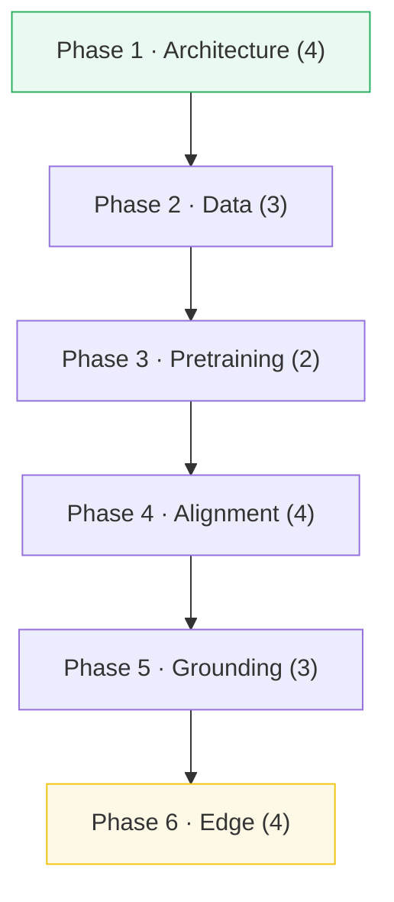

# TODO.md — the SLM Engineering build queue

> Companion to [`RESEARCH.md`](./RESEARCH.md) (the 20-bundle master plan) and
> [`SUBAGENTS_RESEARCH_GUIDE.md`](./SUBAGENTS_RESEARCH_GUIDE.md) (delegation canon).
>
> Each bundle = **5 files**: `{name}.py` + `_output.txt` + `_reference.txt` +
> `{NAME}.md` + `{name}.html`. Status: `☐ todo` · `🚧 building` · `✅ green`.

---

## Progress

| Phase | Bundles | Status |
|---|---|---|
| 1 · Architecture & Parameter Budgeting | 4 | ✅ green |
| 2 · Data Curation & Mixing | 3 | ✅ green |
| 3 · Pretraining & Stability | 2 | ✅ green |
| 4 · Instruction Tuning & Alignment | 4 | ✅ green |
| 5 · Constrained Outputs & Grounding | 3 | ✅ green |
| 6 · Edge Deployment & Runtimes | 4 | ✅ green |
| **Total** | **20** | **20 / 20 green** |

---

## Phase 1 · Architecture & Parameter Budgeting
*Every million parameters counts.*

| # | Bundle | Lineage (old → new, WHY) | Key source | Visual hook (the `.html`) | Status |
|---|---|---|---|---|---|
| 01 | `scaling_laws` | Chinchilla compute-optimal → **overtraining** regime (Llama-3.2-1B, SmolLM2 trained 100× past optimal to cut inference cost) | Hoffmann 2022 arXiv:2203.15556; Kaplan 2020 arXiv:2001.08361 | slider: FLOP budget → optimal N,D; overtraining curve vs inference cost | ✅ |
| 02 | `vocab_rationalization` | Llama 128k vocab → **SmolLM 49k** under a strict param budget (embedding tax) | ../llm/TOKENIZATION.md; SmolLM arXiv:2404.10453; Gemma report | bar chart: vocab params vs hidden, across SmolLM/Gemma/Llama | ✅ |
| 03 | `depth_vs_width` | Shallow-wide → **deep-narrow + layer-sharing** (MobileLLM recurrent blocks) for memory-bandwidth-bound edge | ../llm/ROPE.md; MobileLLM arXiv:2402.14905 | shared-weight matrix layers, activation recurrence | ✅ |
| 04 | `shared_embeddings` | Untied embed+lm_head → **weight tying** (bind lm_head.weight = embed.weight) to recover ~100M params | ../llm/NORMALIZATION.md; Press & Wolf 2017 arXiv:1608.05859 | node graph: shared matrix in memory; backprop updates both | ✅ |

## Phase 2 · Data Curation & Mixing
*Data is the single most important lever for SLM capability.*

| # | Bundle | Lineage (old → new, WHY) | Key source | Visual hook | Status |
|---|---|---|---|---|---|
| 05 | `minhash_dedup` | Exact/n-gram dedup too slow → **MinHash + LSH** band-bucket dedup at web scale | Broder 1997; FineWeb arXiv:2406.17557 | playground: text → signature → Jaccard; band collisions | ✅ |
| 06 | `synthetic_curation` | Scraped web → **Cosmopedia-style** synthetic textbooks (persona + style + seed-topic) | Cosmopedia arXiv:2406.08464 | pipeline: dry topic list → rich textbook; vocab density | ✅ |
| 07 | `dataset_mixing` | Single corpus → **multi-source mix** (FineWeb-Edu + code + synthetic) with perplexity-driven ratios | DoReMi arXiv:2305.10429; Chinchilla | pie + curves: val perplexity as mix ratio changes | ✅ |

## Phase 3 · Pretraining & Stability
*Ensuring convergence when scaling to trillions of tokens.*

| # | Bundle | Lineage (old → new, WHY) | Key source | Visual hook | Status |
|---|---|---|---|---|---|
| 08 | `pretraining_stable` | Plain SGD → **cosine+WSD schedule + decoupled wd + grad clip** for spike-free training | WSD arXiv:2404.06395; AdamW | chart: LR curve + grad-norm under clipping | ✅ |
| 09 | `micro_pretrain_eval` | Full MMLU too slow → **micro-bench hooks** (code/reason/factual slices) predicting downstream | ..; mini-bench correlation studies | line plot: predicted downstream from short-window ckpts | ✅ |

## Phase 4 · Instruction Tuning & Alignment
*Enabling chat + human-preference alignment at low-parameter scales.*

| # | Bundle | Lineage (old → new, WHY) | Key source | Visual hook | Status |
|---|---|---|---|---|---|
| 10 | `instruction_sft` | Plain LM → **SFT chat templates** (ChatML) with **loss masking** on assistant tokens only | ChatML; ../llm docs | parser: tokens color-coded by loss-mask (user=-100, assistant=loss) | ✅ |
| 11 | `low_rank_dora` | LoRA (low-rank ΔW) → **DoRA** (decouple magnitude ∥ + direction V) | DoRA arXiv:2402.09353; LoRA arXiv:2106.09685 | vector decomposition of ΔW = magnitude·direction | ✅ |
| 12 | `direct_preference_dpo` | RLHF (reward+PPO) → **DPO** direct on policy/ref logprobs of chosen/rejected pairs | DPO arXiv:2305.18290 | policy-prob shift after chosen vs rejected | ✅ |
| 13 | `kto_alignment` | DPO (needs pairs) → **KTO** on unpaired binary (👍/👎) via Kahneman-Tversky utility | KTO arXiv:2402.01306 | utility curve adapting as 👍/👎 distribution shifts | ✅ |

## Phase 5 · Constrained Outputs & Grounding
*Making small models reliable — preventing hallucinations, enforcing structure.*

| # | Bundle | Lineage (old → new, WHY) | Key source | Visual hook | Status |
|---|---|---|---|---|---|
| 14 | `grammar_masking` | Free sampling → **CFG/regex logit masking** so output conforms to JSON schema (60%→100% reliable) | ../llm/SAMPLING.md; ../local-llm/GRAMMAR_OUTPUT.md; GBNF | autoregressive decode: candidate probs masked by JSON grammar | ✅ |
| 15 | `rag_slim` | Fat server RAG → **edge RAG**: small embedder + on-device cosine index + context injection | ../vector-db/; ColBERT/XLAM | query simulator: index lookup + context injection | ✅ |
| 16 | `grounding_assertion` | Trust the model → **post-gen fact-check** (parse numerics, assert vs a fact sheet) | ..; verification literature | trace viewer: matched facts (green) vs unverified (red) | ✅ |

## Phase 6 · Edge Deployment & Runtimes
*Running natively on target platforms with minimal footprint.*

| # | Bundle | Lineage (old → new, WHY) | Key source | Visual hook | Status |
|---|---|---|---|---|---|
| 17 | `gguf_quant` | FP16 weights → **GGUF block-quant** (Q4_K_M, Q8_0) with scale+offset + dequant math | ../local-llm/quant_types.py; llama.cpp block-quants | grid: original vs 4-bit-quantized weights; error | ✅ |
| 18 | `speculative_draft` | Big model decodes 1 tok/step → **SLM drafts γ, big verifies** in one forward | ../llm/SPECULATIVE_DECODING.md; Leviathan 2023 arXiv:2211.17192 | timeline: draft chain, parallel verify, accept/reject | ✅ |
| 19 | `mlx_metal_edge` | CUDA-only → **Apple Silicon unified mem + MLX** (Metal kernels, lazy eval, zero-copy) | ../local-llm/MLX_INFERENCE.md; MLX docs | unified-RAM allocation under inference load | ✅ |
| 20 | `mobile_runtime` | Desktop GPU → **mobile NPU / WASM / ONNX Runtime Mobile** within battery+RAM budget | ../local-llm/VRAM_ESTIMATOR.md; ExecuTorch/ONNX | sliders: device specs → recommended params + quant | ✅ |

---

## Anchor concepts & pinned values (brief seeds)

> Coordinator fills these into each generator's `{ANCHOR_CONCEPTS}` / `{PINNED_VALUE}`.

- **01 scaling_laws**: Chinchilla `N_opt≈20·D` (tokens≈20×params at compute-optimal); `C≈6·N·D` FLOPs. PIN: a 1.5B model at Chinchilla-optimal trains on ~30B tokens; SmolLM2-1.7B on 11T ≈ 6500× (overtrained).
- **02 vocab_rationalization**: embed params = `V·H`; for H=2048,V=128k → 263M (≈17% of 1.5B). PIN: V=49152,H=2048 → ~100M.
- **03 depth_vs_width**: MobileLLM shares MLP/attn weights across adjacent blocks → fewer unique params, same depth. PIN: 2 shared blocks → ~1.5× effective depth per unique param.
- **04 shared_embeddings**: tying `lm_head.weight = embed_tokens.weight` removes one `V·H` block. PIN: V=49152,H=2048 → saves ~100M.
- **05 minhash_dedup**: MinHash signature via `h_k = min(hash(k-gram))` over k hash fns; Jaccard ≈ fraction of matching signature positions. PIN: two docs sharing 8/10 signature positions → Jaccard≈0.8.
- **06 synthetic_curation**: persona+style+topic → seeded generation; measure type-token ratio. PIN: persona "patient professor" raises TTR vs baseline.
- **07 dataset_mixing**: perplexity-weighted sampling across domains. PIN: a 70/20/10 mix's weighted perplexity.
- **08 pretraining_stable**: cosine+WSD; `clip(g, max_norm)`. PIN: a grad-norm of 5.0 clipped at 1.0 → 1.0.
- **09 micro_pretrain_eval**: linear projection `MMLU ≈ a·loss_code + b·loss_reason + c`. PIN: fit coefficients on toy data.
- **10 instruction_sft**: `labels = -100` on user/system tokens. PIN: 12-token ChatML turn → 4 assistant tokens carry loss.
- **11 low_rank_dora**: `W' = (m / ∥V∥) · (W + BA)` where m is magnitude, BA low-rank. PIN: rank-2 DoRA params on a 4×4 layer.
- **12 direct_preference_dpo**: `L = -log σ(β(logπ(chosen)-logπ_ref(chosen)) - β(logπ(rejected)-logπ_ref(rejected)))`. PIN: L on a toy chosen/rejected pair.
- **13 kto_alignment**: KTO loss on unpaired 👍/👎 via KT utility. PIN: loss on a 60%-👍 batch.
- **14 grammar_masking**: regex/CFG state → allowed-token-set per step. PIN: a JSON-number regex accepts digits and one `.` only.
- **15 rag_slim**: cosine `sim = a·b/(∥a∥∥b∥)`; top-k inject. PIN: top-1 of 3 toy docs.
- **16 grounding_assertion**: parse numeric tokens, assert membership in fact table. PIN: 1 of 3 numbers ungrounded → flagged.
- **17 gguf_quant**: Q4 block: `q = round(x/s) + 8`, `s = (max-min)/15`. PIN: quant error on a 32-element block.
- **18 speculative_draft**: γ draft tokens, 1 target verify, accept prefix; speedup ≈ `γ·accept_rate / (γ+1)`. PIN: accept 3/4 → speedup.
- **19 mlx_metal_edge**: unified mem (no CPU↔GPU copy), lazy eval graph. PIN: a 3-op graph fused vs 3 separate.
- **20 mobile_runtime**: size = params·bytes/param; RAM budget = size + KV-cache. PIN: 1B@Q4 ≈ 0.6 GB weights.

---

## How a bundle gets built (the 3-stage loop per batch)

1. **Coordinator** fills the brief (`{WEB_ANCHORS}`, `{ANCHOR_CONCEPTS}`,
   `{PINNED_VALUE}` from the table above) — §3 of SUBAGENTS_RESEARCH_GUIDE.md.
2. **Stage 1 generators** (≤4 parallel) build the 5-file bundle.
3. **Stage 2 verifier** runs the §5 sweep; flags failures.
4. **Stage 3 editor** fixes only flagged items.
5. Tick the row above `☐ → ✅`; add the card to `index.html`.
