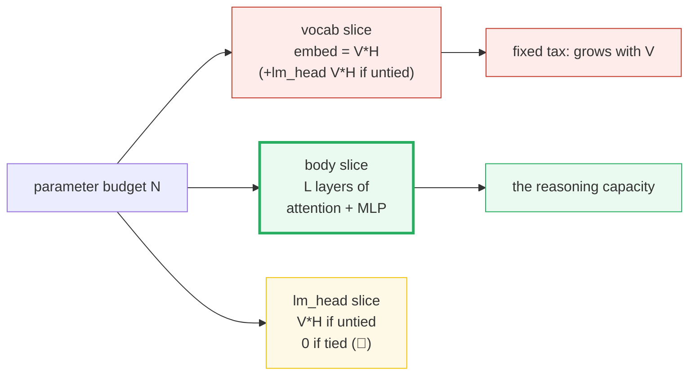
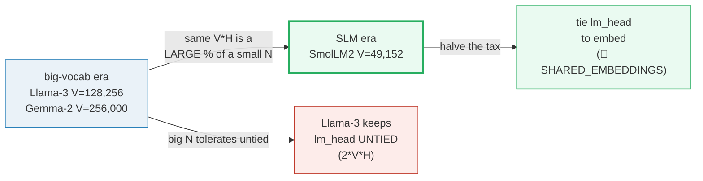
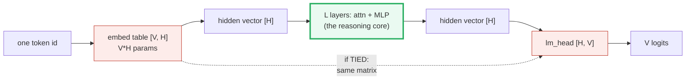
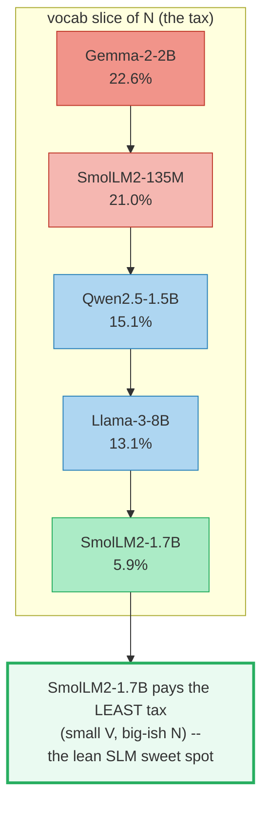
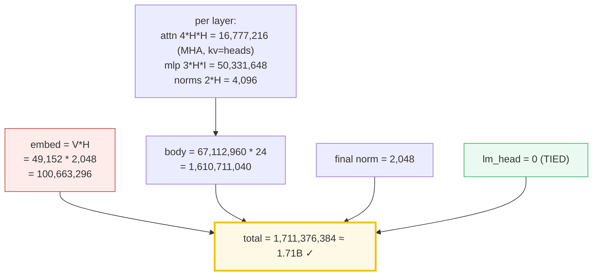
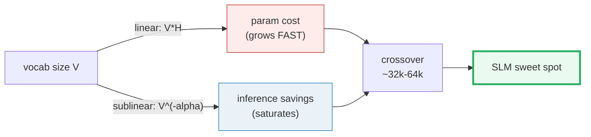
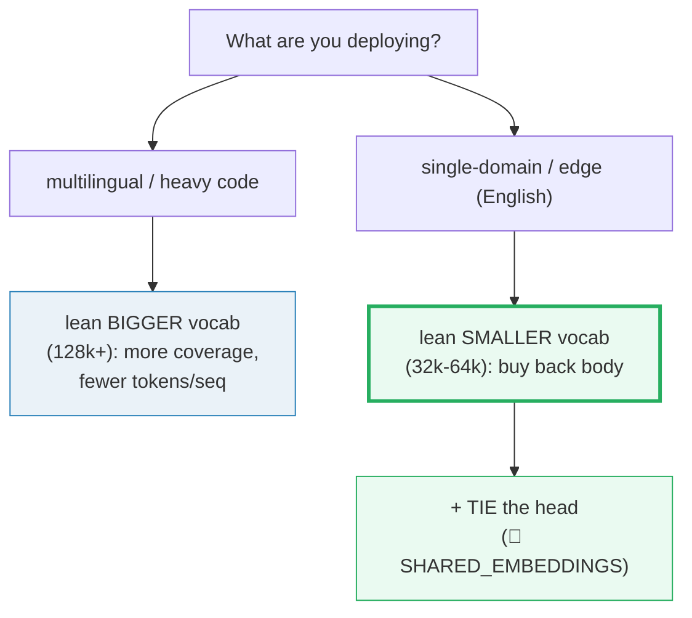
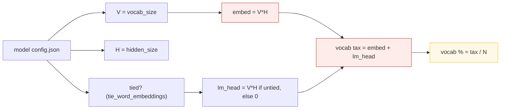

# Vocabulary Rationalization — The Parameter Tax (V·H vs the Budget)

> **One-sentence intuition:** every Transformer pays a **fixed tax** of `V·H`
> parameters for its vocabulary table (and another `V·H` if the output head is
> untied) — and in a small model that tax *dominates* the budget, so SLMs
> deliberately keep the vocabulary **small** (SmolLM2 = 49,152) to buy back
> capacity for attention and MLP.
>
> **Companion code:** [`vocab_rationalization.py`](./vocab_rationalization.py).
> **Every number in this guide is printed by `uv run python vocab_rationalization.py`**
> — change the code, re-run, re-paste. Nothing here is hand-computed.
>
> **Live animation:** [`vocab_rationalization.html`](./vocab_rationalization.html)
> — drag `V` and `H`, watch the vocab tax eat a 1.5B model live; bar chart across
> the five real models.
>
> **Sibling guides (🔗):** the total budget `N` this tax is carved out of is
> [`SCALING_LAWS.md`](./SCALING_LAWS.md); the tying trick that halves the tax is
> [`SHARED_EMBEDDINGS.md`](./SHARED_EMBEDDINGS.md); what the freed params could buy
> (depth) is [`DEPTH_VS_WIDTH.md`](./DEPTH_VS_WIDTH.md); and the BPE mechanics that
> *produce* the vocab are [`../llm/TOKENIZATION.md`](../llm/TOKENIZATION.md).
>
> **Lineage source:** [`../llm/TOKENIZATION.md`](../llm/TOKENIZATION.md) — the
> tokenizer that emits the vocabulary whose size we tax here.

---

## 0. TL;DR — the vocab tax in one picture

> **The pie analogy.** A Transformer's parameter budget `N` is a pie cut into three
> slices: **vocab** (the `embed` table, `V·H`), **body** (`L` layers of attention +
> MLP — the part that actually reasons), and **lm_head** (`V·H` again, unless
> *tied*). For a *big* model the vocab slice is a sliver; for a *small* model the
> same `V·H` table can swallow a quarter of the pie. Sizing `V` under a strict `N`
> is therefore an SLM's first architectural decision.

One plain sentence per family: **a big model (Llama-3-8B) can afford a 128k vocab
and even *untie* its head — 1.05B of pure vocab is only 13% of 8B. A small model
(Gemma-2-2B) ties its head but the 256k vocab still eats 22.6% of its budget. An
SLM (SmolLM2-1.7B) keeps the vocab at 49k so the tax is just 5.9% — leaving 94% for
reasoning.** Same `V·H` math, three very different pies.

| | big model (Llama-3-8B) | heavy-multilingual (Gemma-2-2B) | **SLM (SmolLM2-1.7B)** |
|---|---|---|---|
| **V** | 128,256 | 256,000 | **49,152** |
| **H** | 4,096 | 2,304 | **2,048** |
| **tied?** | no (untied) | yes | yes |
| **vocab slice of N** | 13.1% | 22.6% | **5.9%** |
| **why this V** | big N tolerates the tax + needs coverage | must cover many scripts/code | **lean: free capacity for the body** |

> 🔗 **If you only read one cross-reference:** the *total* budget `N` that the vocab
> slice is carved out of is set by the scaling laws. Read
> [`SCALING_LAWS.md`](./SCALING_LAWS.md) for how `N` is chosen; this bundle is about
> how much of that `N` the vocab steals.

---

### Glossary (plain English — refer back any time)

| Term | Plain meaning |
|---|---|
| **V (vocab_size)** | How many tokenizer tokens the model knows (e.g. SmolLM2 = 49,152). |
| **H (hidden_size)** | The width of every hidden vector = the embedding dimension (e.g. 2,048). |
| **embed table** | The `[V, H]` matrix that turns a token id into a vector. Costs `V·H` params. |
| **lm_head** | The `[H, V]` matrix that turns a vector into `V` logits. Costs `V·H` params. |
| **tied** | `lm_head.weight` *is* the embed table (transposed) → only **one** `V·H` table. |
| **untied** | `lm_head` is a separate matrix → **two** `V·H` tables (`2·V·H` total tax). |
| **L (layers)** | Number of decoder blocks (depth). 🔗 [`DEPTH_VS_WIDTH.md`](./DEPTH_VS_WIDTH.md) |
| **I (intermediate)** | MLP inner dim (SwiGLU/GeGLU), typically ~3–4× H. |
| **N (total)** | Total parameter count of the model. |
| **body** | The `L` layers of attention + MLP — where reasoning capacity lives. |

---

## 1. The lineage — big vocab → small vocab, and WHY

**Old → new, with the WHY at each step:**

1. **Big vocabularies (Llama-3 = 128,256; Gemma-2 = 256,000).** A large vocabulary
   covers more languages and code, and compresses text into **fewer tokens per
   sequence** → fewer inference steps for the same content. The cost (`V·H`) is
   bearable because the model is *big*: in Llama-3-8B the whole 128k vocab (even
   *untied*, 2 tables = 1.05B) is just **13.1%** of 8.03B.
2. **→ Smaller vocabularies for SLMs (SmolLM2 = 49,152).** The *same* `V·H` table
   becomes a *large* fraction of a small `N`. At H=2,048, dropping V from 128k to
   49k frees **~162M params** (~2.4 layers worth) for attention/MLP. A
   single-language edge SLM trades a little token-compression for a lot more
   reasoning core. The sweet spot for 1–3B models is **~32k–64k**.
3. **→ Weight tying (🔗 [`SHARED_EMBEDDINGS.md`](./SHARED_EMBEDDINGS.md)).** Whether
   the vocab is big or small, *tying* the `lm_head` to the embed table recovers one
   whole `V·H` table (halves the tax). Nearly all modern SLMs tie; Llama-3 (a big
   model that can afford not to) is the conspicuous untied example.

> One plain sentence: the vocabulary is a **fixed parameter toll** — the bigger your
> model, the less the toll hurts; the smaller your model, the more aggressively you
> must shrink the vocab (and tie the head) to keep the toll off the reasoning core.

---

## 2. The `V·H` formula — Section A output

One embedding table holds `V` rows of `H` numbers — that's `V·H` parameters, and it
is the irreducible vocab tax. The output head costs *another* `V·H` unless the
weights are tied.

> From `vocab_rationalization.py` **Section A** — embed params (one table) across a
> `(V, H)` grid:
>
> | V \ H | H=2048 | H=3072 | H=4096 |
> |---|---|---|---|
> | V=49152 | **100.66M** | 150.99M | 201.33M |
> | V=128256 | 262.67M | 394.00M | 525.34M |
> | V=256000 | 524.29M | 786.43M | 1.05B |
>
> **GOLD ANCHOR** (the `.html` recomputes and gold-checks this):
> `V=49152, H=2048 → embed = 49152·2048 = 100,663,296` (~100.66M).

**Tied vs untied** — the `lm_head` doubles the tax unless the weights are tied:

> From `vocab_rationalization.py` **Section A** — tied (1 table) vs untied (2 tables):
>
> | V | H | tied (1 table) | untied (2 tables) | untied/tied |
> |---|---|---|---|---|
> | 49152 | 2048 | 100,663,296 | 201,326,592 | 2.0× |
> | 128256 | 4096 | 525,336,576 | 1,050,673,152 | 2.0× |
> | 256000 | 2304 | 589,824,000 | 1,179,648,000 | 2.0× |
> | 151936 | 1536 | 233,373,696 | 466,747,392 | 2.0× |

**The absurd headline:** a nominally-1.5B model with H=2048 and an *untied* 256k
vocab would spend `2 × 524,288,000 = 1,048,576,000` (1.05B) on vocab **alone** —
**70%** of the budget, leaving almost nothing for attention/MLP. Nobody ships that.

> 🔗 Tying recovers exactly one `V·H` table. The full mechanics (gradient sharing,
> the `lm_head.weight = embed_tokens.weight` binding) live in
> [`SHARED_EMBEDDINGS.md`](./SHARED_EMBEDDINGS.md). This bundle only measures the tax.

---

## 3. The real-models table — Section B output (the centerpiece)

This is the key table. Every config (`V`, `H`, `I`, `L`, heads, kv-heads, tied) is
taken **directly from each model's `config.json`** (see
[`vocab_rationalization_reference.txt`](./vocab_rationalization_reference.txt)), and
the total `N` is **counted** from the config — no marketing numbers. The fact that
the counted totals reproduce each model's size class (135M / 1.7B / 2.6B / 8B /
1.5B) cross-validates the param counter.

> From `vocab_rationalization.py` **Section B** — the vocab tax across 5 models:
>
> | model | V | H | tied | embed (V·H) | total N | vocab cost | vocab % |
> |---|---|---|---|---|---|---|---|
> | SmolLM2-135M | 49,152 | 576 | True | 28,311,552 | 134,515,008 | 28,311,552 | **21.0%** |
> | SmolLM2-1.7B | 49,152 | 2048 | True | 100,663,296 | 1,711,376,384 | 100,663,296 | **5.9%** |
> | Gemma-2-2B | 256,000 | 2304 | True | 589,824,000 | 2,614,222,080 | 589,824,000 | **22.6%** |
> | Llama-3-8B | 128,256 | 4096 | False | 525,336,576 | 8,030,261,248 | 1,050,673,152 | **13.1%** |
> | Qwen2.5-1.5B | 151,936 | 1536 | True | 233,373,696 | 1,543,656,960 | 233,373,696 | **15.1%** |

**Read it like a story:**

- **Gemma-2-2B (V=256k, tied):** embed alone = **589.8M → 22.6%** of 2.61B. Its
  vocab table is *bigger than all of SmolLM2-1.7B*. That is the tax Google pays for
  256k-token multilingual/code coverage at a small width — and note it still *ties*
  the head; untied it would be 45%.
- **Llama-3-8B (V=128k, untied):** 2 tables = 1.05B → 13.1% of 8.03B. A big model
  can afford to **untie** (separate head often trains marginally better); an SLM
  cannot. Llama-3 is the conspicuous untied example.
- **SmolLM2-1.7B (V=49k, tied):** embed = 100.7M → only **5.9%** of 1.71B. The 49k
  vocab is *why* it is a lean SLM, not a vocab-heavy one — 94% of its budget is the
  reasoning body.
- **Qwen2.5-1.5B (V=152k, tied):** 15.1% — Qwen *must* cover Chinese + code, so it
  pays a bigger tax than SmolLM2 even at a similar size. Coverage vs capacity.
- **SmolLM2-135M (V=49k, tied):** 21.0% — even the *small* 49k vocab is a big slice
  of a 135M model. The vocab tax is a **fixed cost**: it hurts most at the smallest
  scales, which is exactly why sub-100M models are so hard to make good.

---

## 4. The param-budget pie — Section C output

Hold the **total** budget `N` fixed and ask: as you grow `V`, how much capacity is
*stolen* from the attention+MLP body? This is the SLM designer's core tradeoff.

> From `vocab_rationalization.py` **Section C** — fixed N=1.5B, H=2048, L=24:
>
> | V | vocab (tied) | vocab % | body budget | per-layer budget | vs V=49k body |
> |---|---|---|---|---|---|
> | 32,768 | 67,108,864 | 4.5% | 1,432,891,136 | 59,703,797 | 1.02× |
> | 49,152 | 100,663,296 | 6.7% | 1,399,336,704 | 58,305,696 | 1.00× |
> | 65,536 | 134,217,728 | 8.9% | 1,365,782,272 | 56,907,595 | 0.98× |
> | 128,256 | 262,668,288 | 17.5% | 1,237,331,712 | 51,555,488 | 0.88× |
> | 256,000 | 524,288,000 | 35.0% | 975,712,000 | 40,654,667 | 0.70× |

- V=49k leaves **1.40B** for the body; V=256k leaves only **975.7M** — it **eats
  ~423.62M** (≈6 transformer layers worth of attention+MLP at H=2048).
- If the model were **untied**, double the vocab slice: a 256k untied 1.5B model
  spends 1.05B (70%) on tables, leaving a starved 0.45B body — which is why nobody
  ships that.

**The real-model pies** (embed / body / lm_head slices of N):

> From `vocab_rationalization.py` **Section C** — per-model budget slices:
>
> | model | embed % | body % | lm_head % |
> |---|---|---|---|
> | SmolLM2-135M | 21.0% | 79.0% | 0.0% |
> | SmolLM2-1.7B | 5.9% | 94.1% | 0.0% |
> | Gemma-2-2B | 22.6% | 77.4% | 0.0% |
> | Llama-3-8B | 6.5% | 86.9% | 6.5% |
> | Qwen2.5-1.5B | 15.1% | 84.9% | 0.0% |

> 🔗 The **body budget** freed by shrinking `V` is what buys depth. Read
> [`DEPTH_VS_WIDTH.md`](./DEPTH_VS_WIDTH.md) for why SLMs spend recovered params on
> *more layers* (depth) rather than wider vectors — the memory-bandwidth argument.

---

## 5. Worked example — counting SmolLM2-1.7B by hand

To make the counter concrete, walk SmolLM2-1.7B (V=49,152, H=2,048, I=8,192, L=24,
32 heads = 32 kv-heads, head_dim=64, **tied**):

- **embed** = 49,152 × 2,048 = **100,663,296** (the one `V·H` table).
- **per layer** = attention `4·H²` = 16,777,216 (SmolLM2-1.7B is plain MHA, so
  `kv = heads` and attention is `4·H·H`) + MLP `3·H·I` = 50,331,648 + norms 4,096
  = **67,112,960**.
- **body** = 67,112,960 × 24 = **1,610,711,040**.
- **lm_head** = 0 (**tied** — this is the half-the-tax win).
- **total** = 100,663,296 + 1,610,711,040 + 2,048 = **1,711,376,384 ≈ 1.71B** ✓.

Vocab slice = 100,663,296 / 1,711,376,384 = **5.9%**. The remaining **94.1%** is the
reasoning body — that is what a small, tied-vocab SLM buys you.

---

## 6. The throughput tradeoff — Section D output (why *anyone* uses a big vocab)

If a big vocab is so expensive, why do Llama-3 and Gemma-2 use 128k/256k? Because a
bigger vocabulary **compresses text into fewer tokens** — fewer tokens per sequence
means fewer inference steps and less compute for the same content. The catch: param
cost grows **linearly** with V, while compression grows only **sublinearly**. So
cost outruns benefit, and there is a crossover / sweet spot.

> From `vocab_rationalization.py` **Section D** — param cost vs inference
> compression (illustrative deterministic model, `alpha = 0.40`):
>
> | V | embed params | embed vs V0 | tokens vs V0 | savings/seq | cost grows faster? |
> |---|---|---|---|---|---|
> | 32,768 | 67,108,864 | 1.00× | 1.000 | 0.0% | no (still worth it) |
> | 49,152 | 100,663,296 | 1.50× | 0.850 | 15.0% | YES (tax > savings) |
> | 65,536 | 134,217,728 | 2.00× | 0.758 | 24.2% | YES (tax > savings) |
> | 128,256 | 262,668,288 | 3.91× | 0.579 | 42.1% | YES (tax > savings) |
> | 256,000 | 524,288,000 | 7.81× | 0.439 | 56.1% | YES (tax > savings) |

> ⚠️ **Honesty note:** the `tokens(V) = tokens(V0)·(V0/V)^alpha` curve with
> `alpha=0.40` is an **illustrative deterministic model** (clearly labelled in the
> `.py`), *not* a measured tokenizer fertility. Its `[check]`s validate internal
> consistency (sublinear compression, linear param cost). The qualitative claim —
> bigger vocab → fewer tokens with diminishing returns, while the param tax grows
> linearly — is the well-established BPE behavior; the specific `alpha` is an
> assumption.

**The punchline:** you capture *most* of the compression of a 128k vocab at a
*fraction* of the param tax by stopping around 49k–65k. That is exactly the SLM
sweet spot SmolLM2 lands on.

---

## 7. The SLM vocab decision — Section E output

> From `vocab_rationalization.py` **Section E** — lineage quantified (H=2048, tied):
>
> | era | model | V | embed | rationale |
> |---|---|---|---|---|
> | big-model era | Llama-3-8B | 128,256 | 525.3M* | 128k vocab cheap at 8B; untied |
> | SLM era | SmolLM2-1.7B | 49,152 | 100.7M | smaller vocab frees body capacity |
>
> (*525.3M is one table at H=4096; the SmolLM2 row is at H=2048.)

- **SmolLM2-1.7B vocab slice = 5.9% of N.** Gemma-2-2B vocab slice = **22.6% of N.**
  Same `V·H` math, ~4× difference in how much of the pie the vocab eats.
- **Rule of thumb:** 1–3B SLMs run `V` ~49k–152k; 7B+ models can afford 128k–256k.
  Qwen2.5 picks 152k *because it must cover Chinese + code*; SmolLM2 picks 49k
  *because it is English-focused and wants a fat body*.

---

## 8. Pitfalls & debugging checklist

| # | Mistake | Symptom | Fix |
|---|---|---|---|
| 1 | Sizing V for a 1B model as if it were an 8B model | 15–25%+ of the budget eaten by tables; starved body | keep `V·H ≲ ~8–10%` of `N`; for 1–3B that means `V` ~32k–64k |
| 2 | Leaving the lm_head **untied** in an SLM | silently doubles the vocab tax (e.g. 49k/2048: 100M → 201M) | set `tie_word_embeddings=True`; 🔗 [`SHARED_EMBEDDINGS.md`](./SHARED_EMBEDDINGS.md) |
| 3 | Reporting the "8B" name as the param count | hides the real breakdown | **count** from `config.json` (the `.py` does this); marketing names round |
| 4 | Forgetting GQA in the per-layer count | over-counts attention (assumes MHA `4·H²`) | use `2·H·q_dim + 2·H·kv_dim`; `kv_dim = n_kv_heads·head_dim` |
| 5 | Comparing vocab% across models of wildly different N | misleading (135M and 8B aren't comparable pies) | compare within a size class, or report absolute `V·H` |
| 6 | Treating bigger-V compression as linear | over-estimates inference savings | compression is sublinear (`V^-alpha`); diminishing returns set in fast |
| 7 | Picking V without the deployment in mind | wrong tradeoff (multilingual vs edge) | multilingual/code → bigger V; single-domain edge → smaller V + tied |
| 8 | Counting only `embed`, forgetting the untied `lm_head` | under-counts the tax by up to 2× | `vocab cost = embed + (lm_head if untied else 0)` |

---

## 9. Cheat sheet

- **Embed table** = `V·H` params (the irreducible tax).
- **lm_head** = another `V·H` if **untied**, `0` if **tied** (🔗
  [`SHARED_EMBEDDINGS.md`](./SHARED_EMBEDDINGS.md)).
- **Total `N`** (decoder-only, GQA-aware) =
  `V·H` (embed) + `L·(2·H·q_dim + 2·H·kv_dim + 3·H·I + 2·H)` (body) + `H` (final
  norm) + `(V·H if untied else 0)` (lm_head).
- **SLM sweet spot:** `V` ~32k–64k for 1–3B English-focused models (SmolLM2 = 49,152);
  bigger if multilingual/code (Qwen2.5 = 151,936).
- **Gold anchor:** `V=49152, H=2048 → embed = 100,663,296` (~100.66M) — the value the
  `.html` recomputes and gold-checks.
- **Decision:** multilingual/code → lean bigger V; single-domain edge → lean smaller V
  **and tie the head**.

> 🔗 Want the budget `N` the tax is carved out of? Read
> [`SCALING_LAWS.md`](./SCALING_LAWS.md). Want to halve the tax? Read
> [`SHARED_EMBEDDINGS.md`](./SHARED_EMBEDDINGS.md). Want to spend the recovered
> params on depth? Read [`DEPTH_VS_WIDTH.md`](./DEPTH_VS_WIDTH.md). Want the BPE
> mechanics that *make* the vocab? Read [`../llm/TOKENIZATION.md`](../llm/TOKENIZATION.md).

---

## Sources

Provenance log (full per-URL detail):
[`vocab_rationalization_reference.txt`](./vocab_rationalization_reference.txt). Every
config is taken from the model's own `config.json` and cross-checked in ≥2 sources.

- **[1]** SmolLM2-1.7B `config.json` — https://huggingface.co/HuggingFaceTB/SmolLM2-1.7B/raw/main/config.json
  (V=49152, H=2048, L=24, I=8192, 32/32 heads, tied).
- **[2]** SmolLM2-135M `config.json` — https://huggingface.co/HuggingFaceTB/SmolLM2-135M/raw/main/config.json
  (V=49152, H=576, L=30, 9/3 heads, tied).
- **[3]** HuggingFace SmolLM blog — https://huggingface.co/blog/smollm
  ("vocab size of 49152"; "all three models we use embedding tying").
- **[4]** Qwen2.5-1.5B `config.json` — https://huggingface.co/Qwen/Qwen2.5-1.5B/raw/main/config.json
  (V=151936, H=1536, L=28, 12/2 heads, tied).
- **[5]** HuggingFace Qwen2 docs — https://huggingface.co/docs/transformers/en/model_doc/qwen2
  (vocab_size default 151936).
- **[6]** Gemma-2-2B `config.json` (unsloth mirror) — https://huggingface.co/unsloth/gemma-2-2b/raw/main/config.json
  (V=256000, H=2304, L=26, I=9216, 8/4 heads, head_dim 256).
- **[7]** HuggingFace Gemma2 docs — https://huggingface.co/docs/transformers/en/model_doc/gemma2
  (defaults V=256000, H=2304, I=9216, L=26, 8/4 heads, head_dim 256; **tie_word_embeddings defaults True**).
- **[8]** Gemma 2 report — Gemma Team (2024), arXiv:2408.00118 — https://arxiv.org/abs/2408.00118
  (2B/9B/27B family; GQA; distillation for 2B/9B).
- **[9]** Llama-3-8B `config.json` (unsloth mirror) — https://huggingface.co/unsloth/llama-3-8b/blob/main/config.json
  (V=128256, **tie_word_embeddings: false**).
- **[10]** APX model card, Llama 3 8B — https://apxml.com/models/llama-3-8b
  (H=4096, 32 layers, V=128,256, GQA 32Q/8KV).
- **[11]** APX model card, Gemma 2 2B — https://apxml.com/models/gemma-2-2b
  (~2.6B params, 26 layers, GQA).
- **[13]** Press & Wolf (2017), "Using the Output Embedding to Improve Language
  Models", arXiv:1608.05859 — https://arxiv.org/abs/1608.05859 (weight tying).
- **[14]** SLM survey — arXiv:2501.05465 — https://arxiv.org/abs/2501.05465
  (SmolLM2 vocab 49,152).
- **[15]** Towards AI, "Understanding Tokenization in LLMs" — https://pub.towardsai.net/understanding-tokenization-in-large-language-models-25402f51461e
  (49,152 "sweet spot for English-focused models").
- **[18]** Lineage source: [`../llm/TOKENIZATION.md`](../llm/TOKENIZATION.md)
  (the BPE/SentencePiece mechanics that produce the vocabulary).
