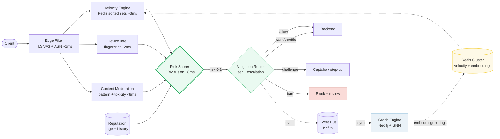
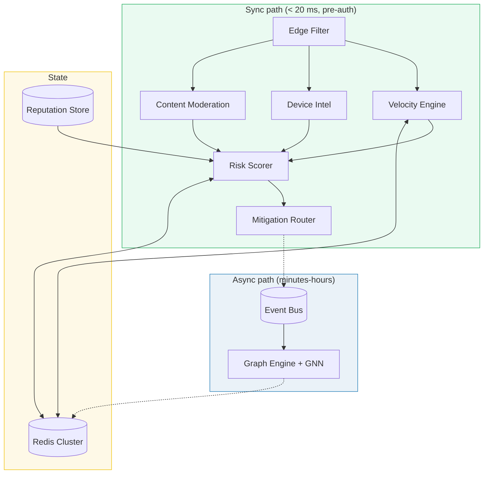

# Design an Abuse Detection System

> **Companion code:** [`abuse_detection.py`](https://github.com/quanhua92/tutorials/blob/main/systemdesign/abuse_detection.py).
> **Live demo:** [`abuse_detection.html`](./abuse_detection.html) — open in a browser.

---

## 0. TL;DR — the one idea

> **The analogy:** abuse detection is a multi-signal smoke alarm with a dial. No single
> reading (how fast you type, how old your account is, whether your message contains a
> swear word) is enough to call the fire department on its own. So you fuse several
> cheap, independent readings into one calibrated **risk score**, then a **mitigation
> router** maps that score to a tier of friction — and a couple of deterministic **hard
> rules** short-circuit the dial when the signals are unambiguous.



Every request walks a **sync path** (edge → velocity → device → content → score →
mitigation) that must finish inside the login latency SLO (~20 ms p99). Slow, deep
work — graph ring detection, GNN embedding training — runs on the **async path** and
writes its results back into Redis, where the next sync request picks them up.

---

## 1. Requirements

### Functional
- **Detect credential stuffing & account takeover** on the login path in real time.
- **Identify bot traffic** — headless browsers, scrapers, automated scripts.
- **Enforce velocity limits** per entity (IP, device, user, ASN) across rolling windows.
- **Moderate content** — flag spam, toxicity, and policy-violating text.
- **Score reputation** per account from age, history, and engagement.
- **Apply tiered mitigations** calibrated to risk and user segment, with progressive
  escalation for repeat offenders.

### Non-Functional
- **Sync path latency:** pre-auth risk decision in **< 20 ms p99** (inside login SLO).
- **Throughput:** **100 K+ velocity checks/sec** at peak; **100 M+ daily logins**.
- **False-positive budget:** < 0.5 % challenge rate on legitimate users (0.5 % of 100 M
  = 500 K users interrupted daily — a direct churn driver).
- **Adversarial robustness:** attackers A/B-test defenses; static rules decay in days.
- **Label sparsity:** chargebacks arrive 30–90 days late, starving models of positives.

---

## 2. Scale Estimation

> From `abuse_detection.py` Section 7:

| Metric | Value |
|---|---|
| Daily logins (login path) | 100,000,000 |
| Peak velocity-check QPS | 100,000 /s |
| Entities checked per login | 4 (ip, device, user, asn) |
| Windows per entity | 4 (1m, 10m, 1h, 24h) |
| Pipelined Redis lookups per login | **16 (one roundtrip)** |
| Velocity memory (sorted sets) | **2.00 GB** (10 M keys × 200 B) |
| Hot embedding cache (128-dim, 24h TTL) | **5.12 GB** (10 M × 128 × 4 B) |
| Ingress bandwidth @ peak | 204.8 MB/s (100 K req/s × 2 KB) |

**Sync-path latency budget (p99 < 20 ms):**

| Stage | Cost |
|---|---|
| Edge filter (TLS/JA3 + ASN blocklist) | 1 ms |
| Velocity engine (pipelined Redis) | 3 ms |
| Device intelligence (fingerprint) | 2 ms |
| Risk scorer (GBM, ~50 features) | 8 ms |
| Network + queueing slack | 6 ms |
| **Total** | **20 ms** |

Anything slower (graph traversal, GNN embedding, ring clustering) must move to the
**async path**: results cached back into Redis, consumed on the next request.

---

## 3. Architecture



### Key Components

| Component | Technology | Why |
|---|---|---|
| Edge Filter | TLS/JA3/JA4 fingerprint + ASN blocklist | cheapest gate (~1 ms); drops datacenter bots before any expensive lookup |
| Velocity Engine | **Redis sorted sets** (`ZADD`/`ZCOUNT`), pipelined | sub-5 ms rolling-window counts across 4 entities × 4 windows in one roundtrip |
| Device Intelligence | canvas/WebGL/font hash, `navigator.webdriver`, CDP artifacts | computed once per session, cached; distinguishes headless browsers |
| Content Moderation | regex pattern catalog + toxicity classifier (transformer) | catches message shapes velocity can never see |
| Risk Scorer | LightGBM over ~50 features | calibrated 0–1 risk; the fusion brain of the pipeline |
| Mitigation Router | tier mapper + per-actor offense counter | maps risk → action; applies "warn before you ban" escalation |
| Graph Engine (async) | Neo4j/Neptune + GraphSAGE GNN | fraud-ring detection via connected components; 128-dim embeddings cached in Redis |
| Event Bus | Kafka | every scored request + abuse reports → async graph + retraining |

---

## 4. Key Design Decisions

### The scoring model — what the `.py` actually computes

> From `abuse_detection.py` Sections 1–5:

```
risk = 0.30·velocity + 0.25·pattern + 0.20·(1−reputation) + 0.25·toxicity
```

| Signal | What it measures | Weight |
|---|---|---|
| **velocity** | requests/window blended across 1m(0.5)/10m(0.3)/1h(0.2) | 0.30 |
| **pattern** | weighted regex catalog (url, free-money, spam keywords, repeats, all-caps, $) | 0.25 |
| **reputation** | `1 − trust`, trust from age + engagement + verified + history | 0.20 |
| **toxicity** | severity-weighted toxic lexicon (transformer in production) | 0.25 |

**Two hard rules override the score** (deterministic, never depend on a calibrated
threshold):

| Rule | Condition | Action |
|---|---|---|
| Coordinated spam | `velocity ≥ 0.95 AND pattern ≥ 0.80` | BAN |
| Severe toxicity | `toxicity ≥ 0.95` | BAN |

### The 7-scenario trace (verbalize this in the interview)

> From `abuse_detection.py` Section 5:

| Account | vel | pat | rep | tox | risk | action | basis |
|---|---|---|---|---|---|---|---|
| alice (trusted, clean) | 0.19 | 0.00 | 0.95 | 0.00 | **0.066** | ALLOW | score |
| bob (chatty, crypto word) | 0.75 | 0.35 | 0.29 | 0.00 | **0.455** | WARN | score |
| carol (new, bursty spam) | 0.92 | 0.90 | 0.23 | 0.00 | **0.655** | THROTTLE | score |
| frank (fast + abusive) | 0.96 | 0.35 | 0.21 | 0.80 | **0.733** | CHALLENGE | score |
| spambot (coordinated) | 1.00 | 1.00 | 0.12 | 0.00 | **0.727** | BAN | hard-rule |
| dave (trusted, toxic) | 0.46 | 0.00 | 0.77 | 1.00 | **0.433** | BAN | hard-rule |
| eve (borderline) | 0.38 | 0.35 | 0.42 | 0.00 | **0.316** | WARN | score |

**The key insight:** `frank` and `spambot` have nearly identical risk (~0.73) but
different actions. `frank` has high velocity (0.96) but low pattern (0.35) → the
coordinated-spam hard rule needs **both** signals, so frank gets a CHALLENGE while
spambot gets a BAN. **Velocity alone is never a ban.**

And `dave` is trusted (reputation 0.77) but posts severe toxicity → BAN via the
toxicity hard rule. **Reputation cannot buy your way past toxicity.**

### Progressive escalation (warn before you ban)

> From `abuse_detection.py` Section 6:

A per-actor offense counter bumps the response **one tier per prior offense**. `eve`'s
borderline message (base WARN, risk 0.316) escalates across four repeats:

| Offense # | Base tier | → Final action |
|---|---|---|
| 1 | WARN | WARN |
| 2 | WARN | THROTTLE |
| 3 | WARN | CHALLENGE |
| 4 | WARN | BAN |

The score never changes — only the response does. The counter resets after a clean
cooldown window. This is the product discipline that keeps false positives from
becoming permanent bans.

### Decision table

| Decision | Option A | Option B | Winner | Why |
|---|---|---|---|---|
| Velocity storage | sorted sets (`ZCOUNT`) | HyperLogLog (`PFCOUNT`) | **sorted sets** | need exact windowed counts, not just cardinality; HLL for distinct-user-per-IP on the side |
| Scoring | pure rules | GBM + hard rules | **GBM + hard rules** | model handles the gray zone; rules guarantee egregious cases never miss |
| Mitigation first step | visible CAPTCHA | invisible challenge | **invisible** | reCAPTCHA-v3 score fused as a feature, not a hard gate; ~5 % abandon on visible |
| Sync vs async | do everything inline | split boundary | **split** | graph/GNN work is minutes; only velocity+device+GBM fit in 20 ms |
| Step-up auth | SMS OTP | FIDO2/passkeys | **passkeys** | NIST SP 800-63B deprecates SMS (SS7/SIM-swap); passkeys make credential stuffing impossible |

---

## 5. Data Model

| Table | Columns | Notes |
|---|---|---|
| `account_risk` | `account_id` PK, `risk_score` FLOAT, `risk_embedding` BLOB(512), `device_fingerprint_hash` VARCHAR(64), `first_seen`, `last_updated` | cached sync-path state; embedding = 128-dim GNN vector |
| `velocity_windows` (Redis) | `entity_type` (ip/device/user/asn), `entity_id` (hashed), `action_type`, `window` (1m/10m/1h/24h), sorted-set of timestamps | TTL = max window; hash IDs to prevent enumeration |
| `graph_edges` | `source_account`, `target_account`, `edge_type` (shares_device/ip/phone/referral), `weight`, `detected_at` | fraud-ring input; union-find for connected components |

---

## 6. API Endpoints

| Method | Path | Description |
|---|---|---|
| POST | `/api/auth/login` | login with inline risk check (sync velocity + device + GBM) |
| GET | `/api/risk/{account_id}` | cached risk score + embedding |
| POST | `/api/risk/challenge` | submit CAPTCHA / step-up result, update risk state |
| GET | `/api/velocity/{entity_type}/{entity_id}` | rolling-window counts for an entity |
| POST | `/api/report/abuse` | user-reported abuse event (async label ingestion) |
| GET | `/api/graph/ring/{cluster_id}` | accounts in a detected fraud ring (admin) |

---

### Killer Gotchas
- **Blocking starves the label stream.** Once you hard-block, you stop seeing the
  negative outcomes that train the model. Mitigation: **shadow scoring** (score but
  don't enforce) + honeypot accounts for clean positive labels.
- **Velocity alone is noise.** A shared office NAT or a VPN exit node looks like a bot
  to pure rate-based detection — that's why velocity is only 0.30 of the score and the
  spam hard rule requires pattern ≥ 0.80 too.
- **The 1-minute window dominates** (weight 0.5) because bursts are the strongest
  single signal — but a slow-drip attacker (under the 1m limit) is only caught by the
  10m/1h windows or the graph path.
- **Reputation is a lagging indicator.** A compromised trusted account (like `dave`)
  has high reputation *until the moment it misbehaves* — which is exactly why toxicity
  has its own hard rule independent of reputation.
- **Hash entity IDs in Redis key names** to prevent enumeration attacks that probe
  which IPs/devices you're tracking.
- **Adversarial decay:** attackers A/B-test against your defenses, so static regex
  rules decay in days. Reserve the catalog for high-precision signatures; let the model
  absorb the rest and retrain frequently.
