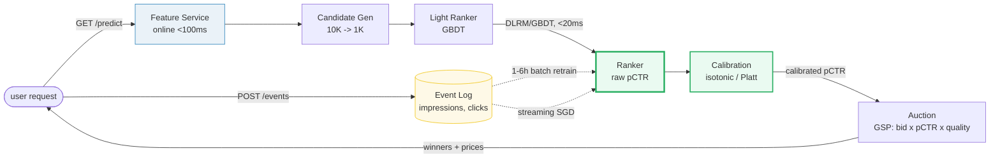
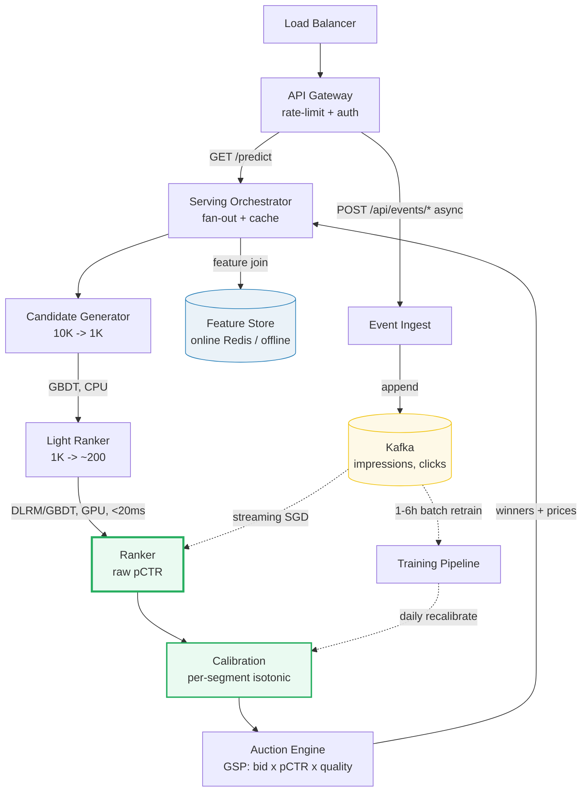

# Design an Ad Click Prediction System

> **Companion code:** [`ad_click_prediction.py`](https://github.com/quanhua92/tutorials/blob/main/systemdesign/ad_click_prediction.py).
> **Live demo:** [`ad_click_prediction.html`](https://github.com/quanhua92/tutorials/blob/main/systemdesign/ad_click_prediction.html) — open in a browser.

---

## 0. TL;DR — the one idea

> **The analogy:** an ad system is a **calibrated probability machine bolted onto an
> auction**. It predicts `pCTR` — the probability a user clicks a given ad — feeds
> that probability into `score = bid × pCTR × quality`, and the auction picks
> winners. Everything else (feature engineering, calibration, online learning,
> A/B testing) exists to make that one number *accurate*, *fresh*, and *unbiased*.

The hard part is not the model — it is **estimating a tiny probability (1–5%) on
a single impression under a 50 ms deadline**, with billions of impressions a day,
delayed labels, and an auction whose *revenue* depends on the prediction being
calibrated (not just ranked).



---

## 1. Requirements

### Functional
- **Predict click probability (pCTR)** for each ad impression in real time.
- **Score thousands of candidate ads per request** and feed calibrated scores into a GSP auction.
- **Calibrate** raw model outputs so predicted probabilities match realized click rates (COEC ≈ 1.0).
- **Handle delayed feedback** — conversion labels arrive hours to days after the impression.
- **A/B test** ranking models and serve multiple ad surfaces (feed, search, stories).

### Non-Functional
- **Inference latency** p99 < 50 ms end-to-end for the full predict → auction path.
- **Scale** to billions of impressions/day (~46 M candidate scores/s).
- **Calibration accuracy** per-segment COEC close to 1.0; recomputed daily.
- **Model freshness** via online learning (streaming updates) layered on batch retraining.
- **Robustness** to distribution shift, feedback loops, and position bias.

---

## 2. Scale Estimation

> From `ad_click_prediction.py` **Section 6** (2B impressions/day, 5% network CTR):

| Metric | Value |
|---|---|
| Impressions / day | 2,000,000,000 |
| Ads shown / request | 5 |
| Candidates scored / request | 10,000 |
| Page-load requests /s | 4,629 /s |
| **Candidate ad scores /s** | **46,296,296 /s** |
| Clicks logged / day | 100,000,000 |

> From `ad_click_prediction.py` **Section 6** — storage:

| Storage metric | Value |
|---|---|
| Impression log / day (~100 B/row) | 200.00 GB /day |
| Impression log / year | 73.00 TB /year |
| **DLRM embedding tables** (50 cats × 10M vocab × 128-dim × 4 B) | **256.00 GB** (sharded, PQ-shrunk 10–100×) |

> From `ad_click_prediction.py` **Section 6** — latency budget (p99 < 50 ms):

| Stage | Budget |
|---|---|
| Feature fetch (online) | < 8 ms |
| Candidate retrieval | < 7 ms |
| Ranker (DLRM/GBDT) | < 20 ms |
| Calibration + auction | < 5 ms |
| Network + queueing | < 10 ms |
| **Total** | **< 50 ms** |

---

## 3. Architecture



### Key Components

| Component | Technology | Why |
|---|---|---|
| Serving Orchestrator | stateless Go/Java | Fans out to candidate gen + ranker, joins features, returns winners + prices. Cached per (user, surface). |
| **Ranker** | **GBDT (LightGBM) or DLRM** | **The pCTR engine.** GBDT is the v1 baseline (cheap, fast iteration); DLRM learns feature interactions via a dot-product layer for better AUC at 10–100× the serving cost. |
| **Calibration** | **Isotonic regression / Platt scaling** | **Per-segment** (vertical × placement × cohort). Raw pCTR breaks auction economics if systematically miscalibrated; isotonic cuts calibration RMSE 30–50% vs a single global map. |
| Auction Engine | GSP with quality factor | `score = bid × pCTR × quality`; winner pays `score_next / (pCTR × quality)`. Reserve price = opportunity cost of organic content. |
| Feature Store | online (Redis, <100ms) + offline (daily) | Online: session context, last-click category. Offline: historical CTR, user/item embeddings. Same code path for train + serve (no skew). |
| Event Bus | Kafka / Pulsar | Impressions, clicks, conversions — the training signal. ~100M clicks/day. |
| Training Pipeline | batch (hourly/daily) + online (streaming SGD) | Batch for stability; online SGD for freshness under drift. |

---

## 4. Key Design Decisions

### 4.1 CTR estimation: raw rate vs Beta-Binomial smoothing

> From `ad_click_prediction.py` **Section 1** (Beta(1,19) prior, mean 5.0%):

| Decision | Option A | Option B | Winner | Why |
|---|---|---|---|---|
| **CTR estimate** | **Beta-Binomial smoothed** | Raw clicks/impressions | **Smoothed** | Raw CTR is a maximum-likelihood estimate that is wildly noisy on small samples (3 impressions → 33%). Smoothing `= (clicks + α)/(impressions + α + β)` shrinks low-data ads toward the network prior (5%). Demo: ad_E (3 imp) raw 33.3% → **smoothed 8.70%**; ad_A (1000 imp) stays 5.00%. Without this, noisy winners hijack the auction. |

- **Network COEC** (click-over-expected-click) = realized clicks / expected clicks =
  309 / (6113 × 0.05) = **1.011** — the toy inventory is ~calibrated against the
  5% prior. Production tracks COEC *per stratum* as a launch gate.

### 4.2 Feature engineering: one-hot + bucketing + hash trick

> From `ad_click_prediction.py` **Section 2**:

| Decision | Option A | Option B | Winner | Why |
|---|---|---|---|---|
| **Categorical** | **One-hot (drop baseline)** | Label encoding | **One-hot** | Linear models can't see ordinality in label-encoded categories. Demo: `tech+mobile+search` → `[1,1,0,1,1]` (bias, is_tech, is_fashion, is_mobile, is_search). |
| **High-cardinality** | **Hash trick** | Full one-hot vocab | **Hash trick** | `user_id` has 100M+ values — can't one-hot. `FNV-1a(id) mod N` maps to a fixed-size embedding table. Collisions cost <0.1% AUC. Demo: 6 user IDs → slots `{2,7,4,1,1,1}` (collision on slot 1). |
| **Numerical** | **Bucketing (binning)** | Raw scalar | **Bucketing** | Captures non-linearity without splines; reduces noise. Demo: `hour=14` → bucket `afternoon`. |

### 4.3 Model: logistic regression (the interpretable baseline)

> From `ad_click_prediction.py` **Section 3** (full-batch GD, 72 impressions, 25 clicks):

| Feature | Learned weight (logit) |
|---|---|
| bias | −2.1282 |
| **is_search** | **+2.3354** (strongest driver) |
| is_fashion | −1.3589 |
| is_tech | +0.6992 |
| is_mobile | +0.5228 |

| Decision | Option A | Option B | Winner | Why |
|---|---|---|---|---|
| **v1 model** | **Logistic regression** | DLRM / deep network | **LR for v1** | LR is interpretable (weights = feature importance), cheap to serve, easy to debug. Demo: search dominates (+2.34), fashion hurts (−1.36); predicted pCTR `food+desktop+feed` = 10.6%, `tech+mobile+search` = 80.7%. Graduate to GBDT/DLRM only when LR plateaus on AUC. |

- **Calibration check:** mean predicted pCTR = **0.3472**, actual CTR = **0.3472**,
  gap **0.0000** — LR is calibrated on its training distribution. In production,
  drift breaks this → Platt/isotonic post-hoc, recomputed daily per segment.

### 4.4 Online vs batch learning (concept drift)

> From `ad_click_prediction.py` **Section 4** (drift: search ad fatigue):

| Decision | Option A | Option B | Winner | Why |
|---|---|---|---|---|
| **Freshness** | **Batch + online (SGD)** | Batch-only | **Batch + online** | Batch is stale between retrains; online catches drift in seconds. Demo: after search CTR collapses, online `w_search` falls **2.3354 → 1.6926** (4 search misses), while batch stays frozen at 2.3354. Held-out log-loss on the drift stream: online **0.799** vs batch **1.039**. |

### 4.5 Launch gate: A/B test

> From `ad_click_prediction.py` **Section 5** (two-proportion z-test):

| Decision | Option A | Option B | Winner | Why |
|---|---|---|---|---|
| **Ship call** | **A/B + z-test + effect-size gate** | Offline metric only | **A/B** | Offline AUC lift must translate to online CTR lift. Demo: Model A (batch) 4.50% vs Model B (online) 5.40% → z = **2.9339**, p = **0.00335**, **+20% relative** → significant, ship B. But at billions of impressions/day *everything* is significant — gate on effect size + revenue, and run an A/A test first. |

### 4.6 Calibration strategy

| Decision | Option A | Option B | Winner | Why |
|---|---|---|---|---|
| **Calibration** | **Per-segment isotonic** | Single global map | **Per-segment** | A global map hides tail-segment drift (e.g., one vertical systematically over-predicted). Per-segment (vertical × placement × cohort) isotonic cuts calibration RMSE 30–50% at the cost of routing latency. |

---

## 5. Data Model

### Impressions / clicks / conversions

| Table | Columns | Notes |
|---|---|---|
| `impressions` | `impression_id`, `user_id`, `ad_id`, `placement`, `predicted_pctr`, `shown_at` | PK = Snowflake ID; `predicted_pctr` frozen at serve time for backtesting. |
| `clicks` | `click_id`, `impression_id` (FK), `clicked_at` | Joined to impressions for the click label. |
| `conversions` | `conversion_id`, `click_id` (FK), `value`, `converted_at` | Delayed labels (hours–days); attribution window 7d/30d. |
| `calibration_buckets` | `segment_key`, `isotonic_mapping` (BLOB), `updated_at` | `segment_key` = vertical × placement × cohort. |

### Feature store

| Store | Contents | Notes |
|---|---|---|
| Online (Redis) | session context, last-click category, recency | <100 ms freshness; drives real-time preference shift. |
| Offline (daily) | historical CTR, user/item embeddings | 256 GB embedding tables, sharded; PQ-shrunk 10–100×. |

---

## 6. API Endpoints

| Method | Path | Response | Notes |
|---|---|---|---|
| `POST` | `/api/predict` | `{ad_scores:[{ad_id, pctr, calibrated_pctr}]}` | Compute-heavy, latency-critical; batch of candidates. |
| `GET` | `/api/auction` | `{winners:[{ad_id, price, rank}]}` | GSP over scored candidates; read, latency-critical. |
| `POST` | `/api/impressions` | `{impression_id}` | Async write; append to event bus. |
| `POST` | `/api/clicks` | `{click_id}` | Async; the click label. |
| `POST` | `/api/conversions` | `{conversion_id}` | Delayed; attribution window applies. |
| `GET` | `/api/calibration/status` | `{segments:[{key, coec}]}` | Per-segment calibration health; COEC ≈ 1.0 target. |

---

## 7. Deep dives

- **GSP auction pricing.** `score = bid × pCTR × quality`; winner pays
  `price = score_next / (pCTR × quality) + ε`. Because price divides by pCTR,
  a miscalibrated pCTR directly leaks or burns revenue — calibration is an
  *economic* requirement, not just an ML nicety.
- **Feedback loops.** Serving on CTR predictions changes which ads get
  impressions, which changes future CTR estimates — the training distribution is
  *endogenous* to the model. Mitigate with a 1–3% exploration budget and
  propensity-weighted training.
- **Position bias.** Ads in slot 1 get inflated CTR. Correct via inverse
  propensity weighting, or add a position feature that is ablated (zeroed) at
  inference time.
- **ESMM / CTCVR.** Pure CVR models suffer sample-selection bias (trained only on
  clicks). Model `pCTCVR = pCTR × pCVR` with shared embeddings so every impression
  contributes gradient; auction score becomes `bid × pCTCVR × quality`.
- **Negative downsampling.** Train on a subsample of negatives (clicks are rare),
  then correct predicted probabilities back at serve time via the sampling rate.

---

### Killer Gotchas

- **Raw CTR on small samples is junk.** 3 impressions → 33% CTR. Always smooth
  with a Beta prior (demo ad_E: 33.3% → 8.70%); the alternative is noisy winners
  hijacking the auction.
- **Miscalibration leaks revenue.** GSP price = `score_next / (pCTR × quality)`.
  If pCTR is systematically off, the auction over- or under-charges advertisers
  directly. Per-segment isotonic is mandatory, not optional.
- **Position bias inflates CTR.** Slot-1 ads look great because of *where* they
  are, not *what* they are. Ablate the position feature at inference or use
  inverse propensity weighting.
- **Batch models go stale fast.** The demo shows batch log-loss **1.039** vs
  online **0.799** after a single drift episode. Layer streaming SGD on batch
  retraining; retrain hourly, not daily.
- **At web scale everything is "significant".** The demo z-test hits p = 0.003 on
  10K impressions. At billions/day, gate on **effect size** and revenue, not the
  p-value, or you'll ship noise.
- **Train-serve skew silently degrades quality.** If the feature path differs
  between training and serving, the model sees different inputs at serve time.
  Use one shared feature library; A/A tests catch the drift.

---

### Reproduce

```bash
python3 ad_click_prediction.py          # prints all sections + [check] OK
```

> From `ad_click_prediction.py` **Section 7 — GOLD CHECK** (values pinned for `ad_click_prediction.html`):

```
smooth_ad_A_1k50           = 0.05
smooth_ad_C_10_2           = 0.1
smooth_ad_E_3_1            = 0.087
network_coec               = 1.011
onehot_tech_mobile_srch    = 11011
bucket_hour14              = afternoon
hash_slot_user1            = 2
lr_w_bias                  = -2.1282
lr_w_is_tech               = 0.6992
lr_w_is_fashion            = -1.3589
lr_w_is_mobile             = 0.5228
lr_w_is_search             = 2.3354
lr_pctr_food_search        = 0.5516
lr_pctr_food_feed          = 0.1064
lr_pctr_tech_mobile_srch   = 0.8068
lr_train_logloss           = 0.4848
online_w_search_batch      = 2.3354
online_w_search_after      = 1.6926
online_logloss_drift       = 0.799
batch_logloss_drift        = 1.0388
ab_z_stat                  = 2.9339
ab_p_value                 = 0.00335
ab_lift_rel_pct            = 20.0
scale_req_qps              = 4629.63
scale_score_qps            = 46296296.0
scale_emb_table_gb         = 256.0
```

`[check] GOLD reproduces from smoothing + logreg + online + z-test? OK` — the gold
badge `check: OK` at the bottom of
[`ad_click_prediction.html`](https://github.com/quanhua92/tutorials/blob/main/systemdesign/ad_click_prediction.html)
re-implements **Beta-Binomial smoothing**, **one-hot/bucketing/hash feature
engineering**, **full-batch logistic regression**, **streaming-SGD online
learning**, and the **two-proportion z-test** in **pure JavaScript**, and confirms
they match the `.py` exactly (ad_E smoothed 0.087, `is_search` weight +2.3354,
online `w_search` 2.3354 → 1.6926, z = 2.9339, p = 0.00335, emb table 256 GB).
