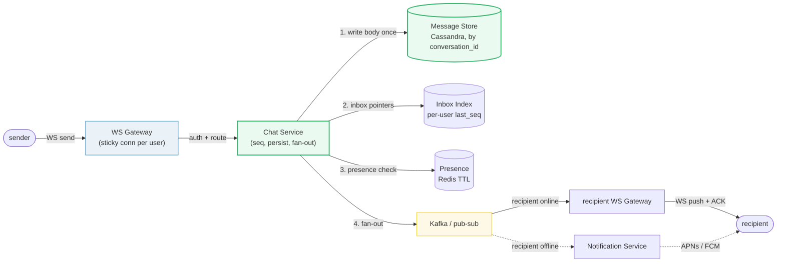
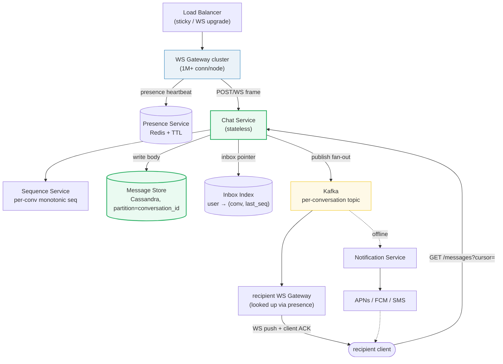

# Design a Chat System

> **Companion code:** [`chat_system.py`](https://github.com/quanhua92/tutorials/blob/main/systemdesign/chat_system.py).
> **Live demo:** [`chat_system.html`](https://github.com/quanhua92/tutorials/blob/main/systemdesign/chat_system.html) — open in a browser.

---

## 0. TL;DR — the one idea

> **The analogy:** a chat system is a **push pipeline over persistent WebSocket connections**
> where one message must fan out to N recipients, arrive in causal order, and report its
> delivery status — all backed by a conversation store that is the single source of truth on
> reconnect.

The whole system reduces to one hard problem: **take one message and make it appear, ordered
and acknowledged, in N devices in real time.** Everything else (presence, push notifications,
fan-out strategy, sequence numbering) hangs off that single fan-out operation.



---

## 1. Requirements

### Functional
- **Send & receive** real-time 1:1 and **group** messages.
- Show **online / offline / typing** presence indicators.
- **Ordered** delivery within a conversation (causal order).
- **Delivery receipts**: sent → delivered → read.
- **Message history** with cursor pagination on reconnect.
- **Push notifications** for offline recipients (APNs / FCM).
- Optional: media attachments, message edit/delete, end-to-end encryption.

### Non-Functional
- **Low latency**: end-to-end delivery `< 200 ms` p99.
- **High availability**: 99.99% on the messaging path.
- **Scale**: ~50M DAU, **~5M concurrent WebSocket connections**.
- **Reliability**: at-least-once delivery; no message loss on reconnect.
- **Ordering**: messages appear in causal order per conversation.

---

## 2. Scale Estimation

> From `chat_system.py` **Section 7** (50M DAU, 40 msg/user/day, 1 KB/msg, 5× peak):

| Metric | Value |
|---|---|
| Daily active users | 50,000,000 |
| Messages / day | 2,000,000,000 (2.0 B) |
| Avg message QPS | 23,148.1 /s |
| Peak message QPS (5×) | 115,741 /s |
| **Storage / day** (body only) | **2.05 TB** |
| **Storage / year** | **747.52 TB** |
| Avg bandwidth (payload) | 23.70 MB/s |
| Peak bandwidth (5×) | 118.52 MB/s |
| Concurrent WS connections (10% of DAU) | 5,000,000 |
| WS gateway RAM (@ ~20 KB/conn) | 102.40 GB |

> From `chat_system.py` **Section 6** — group fan-out write amplification:

| Group size | Rows written / message (on-WRITE) | WS pushes / message |
|---|---|---|
| 2 (1:1) | 2 | 2 |
| 100 | 100 | 100 |
| 1000 | 1000 | 1000 |

> A single 1000-member group at 1 msg/s burns **1000×** the writes of a 1:1 chat. WhatsApp
> caps groups at ~1024 members; Telegram supergroups shard the fan-out.

---

## 3. Architecture



### Key Components

| Component | Technology | Why |
|---|---|---|
| WS Gateway | Netty / Go (gorilla) | Holds millions of sticky long-lived connections; routes frames to Chat Service. Stateless routing via Presence. |
| Chat Service | stateless Go/Java | Assigns per-conversation seq, persists message body, publishes fan-out. Horizontally scalable. |
| Message Store | Cassandra | Partition by `conversation_id`; time-series writes at 23K/s; linear scalable; tunable consistency. |
| Inbox Index | Redis / ScyllaDB | `user_id → [(conversation_id, last_seq)]` for O(1) inbox view on app open / reconnect. |
| Presence Service | Redis (TTL keys) | `user_id → gateway_id` with TTL = 2× heartbeat; online/offline + typing state. |
| Sequence Service | per-shard counter / Snowflake | Monotonic seq per conversation for causal ordering (see Section 4.3). |
| Kafka | pub-sub, per-conv topic | Decouples send from delivery; durable buffer during recipient reconnect. |
| Notification Service | APNs / FCM bridge | Push to offline recipients; triggers client reconnect + catch-up. |

---

## 4. Key Design Decisions

### 4.1 Fan-out-on-write vs fan-out-on-read

> From `chat_system.py` **Section 1** (mixed traffic 80% 1:1 / 15% grp-8 / 5% grp-200 → avg
> **12.95 rows/msg** on-WRITE vs 1 row/msg on-READ):

| Decision | Option A | Option B | Option C | Winner | Why |
|---|---|---|---|---|---|
| **Message fan-out** | On-WRITE (push to all inboxes) | On-READ (store once, scan) | **HYBRID** | **Hybrid** | Pure on-WRITE amplifies writes by group size (1000-member group = 1000× writes). Pure on-READ makes every inbox view an O(N) scan. Hybrid: write body once + fan out a tiny inbox pointer. |

**Hybrid detail:** the message body is written once per conversation (Cassandra, partitioned
by `conversation_id`). A lightweight pointer `(conversation_id, last_seq)` is fanned out to
each recipient's inbox index. Inbox load is O(1); message fetch is a direct partition scan.

### 4.2 1:1 vs group chat scaling

| Decision | Option A | Option B | Winner | Why |
|---|---|---|---|---|
| **Group delivery** | One fan-out per message to all members | Shard fan-out across workers for very large groups | **Both, by size** | 1:1 and small groups (<100): direct fan-out is fine. Large groups (200+): shard the fan-out across Kafka consumer workers to avoid a single hot writer; cap group size (WhatsApp ~1024). |

### 4.3 Message ordering

> From `chat_system.py` **Section 2** — client receives messages in delivery order `[3,1,2,5,4]`
> but a per-conversation **seq buffer restores causal order `1,2,3,4,5`**.

| Decision | Option A | Option B | Option C | Winner | Why |
|---|---|---|---|---|---|
| **Ordering** | Per-conversation seq counter | Global Snowflake timestamp | Logical clocks (Lamport/vector) | **Per-conversation seq** | Simple, single-writer contention per conversation is acceptable (shard by conversation). Snowflake gives global uniqueness + cross-conv order but only ms granularity. Clients buffer and reorder on gaps using seq. |

### 4.4 Delivery transport

| Decision | Option A | Option B | Option C | Winner | Why |
|---|---|---|---|---|---|
| **Real-time transport** | WebSocket | Long polling | Server-Sent Events | **WebSocket** | Full-duplex, low per-message overhead, the only option for true push at 5M concurrent connections. Long polling as graceful fallback when WS is blocked (corporate proxies). |

### 4.5 Delivery guarantee

| Decision | Option A | Option B | Winner | Why |
|---|---|---|---|---|
| **Delivery guarantee** | At-most-once (fire and forget) | **At-least-once** (Kafka + client ACK + idempotent seq) | **At-least-once** | A lost chat message is unacceptable. Kafka durably buffers; clients ACK by `seq`; dedup on `message_id`. Exactly-once is overkill and adds 2PC cost. |

---

## 5. Data Model

### `messages` (Cassandra — partition key `conversation_id`)

| Column | Type | Notes |
|---|---|---|
| `conversation_id` | VARCHAR | **Partition key**. All messages of one chat colocated. |
| `seq` | BIGINT | **Clustering key**, monotonic per conversation (Section 4.3). |
| `message_id` | VARCHAR | Global id (Snowflake / ULID), used for dedup. |
| `sender_id` | VARCHAR | Sender user id. |
| `content` | TEXT | Message body (avg 1 KB). |
| `message_type` | ENUM | text / image / file / system. |
| `created_at` | TIMESTAMP | Server-assigned send time. |

### `conversations` (metadata)

| Column | Type | Notes |
|---|---|---|
| `conversation_id` | VARCHAR | **PK**. |
| `type` | ENUM | dm / group. |
| `created_at` | TIMESTAMP | — |
| `last_message_seq` | BIGINT | Denormalized for inbox preview. |

### `conversation_participants` (membership)

| Column | Type | Notes |
|---|---|---|
| `conversation_id` | VARCHAR | **PK** (FK → conversations). |
| `user_id` | VARCHAR | Participant. |
| `joined_at` | TIMESTAMP | — |
| `last_read_seq` | BIGINT | Drives unread badge + read receipts. |

### `inbox_index` (Redis hash — `user_id` → convs)

| Field | Value | Notes |
|---|---|---|
| key | `user_id` | — |
| member | `conversation_id` | — |
| score / value | `last_seq` | O(1) inbox view on app open. |

### `presence` (Redis — TTL keys)

| Key | Value | TTL |
|---|---|---|
| `presence:{user_id}` | `gateway_id` | 2 × heartbeat (20 s) |

---

## 6. API Endpoints

| Method | Path | Body / Response | Notes |
|---|---|---|---|
| `GET` | `/ws` | WebSocket upgrade | Persistent conn; subscribe with `last_seq` per conversation. |
| `POST` | `/api/conversations` | `{participants, type}` → `{conversation_id}` | Create 1:1 or group. |
| `GET` | `/api/conversations` | → `[{conversation_id, last_message, unread}]` | Reads inbox index (O(1)). |
| `POST` | `/api/conversations/{id}/messages` | `{content, type}` → `{message_id, seq}` | HTTP fallback when WS down. |
| `GET` | `/api/conversations/{id}/messages?cursor=&limit=50` | → `[messages]` | Cursor pagination by `seq`. |
| `PUT` | `/api/conversations/{id}/read` | `{last_read_seq}` | Updates `last_read_seq`, fires read receipt. |
| WS event | `message.new` | `{conversation_id, seq, ...}` | Server → client push. |
| WS event | `message.ack` | `{seq}` | Client → server delivery ACK. |
| WS event | `presence.update` | `{user_id, status}` | Online/offline/typing broadcast. |

---

## 7. Deep dives

### WebSocket connection lifecycle (Section 5)
> States: `CONNECTING → CONNECTED → ACTIVE(heartbeat) → DISCONNECTED → RECONNECTING →
> CONNECTED(catch-up) → DRAINING → CLOSED`. Reconnect catch-up is driven by the persisted
> `last_seq` pointer against the conversation store, **not** TCP keepalive — so a client that
> was offline for minutes just replays `last_seq+1 … current` from Cassandra on resume.

### Presence at scale (Section 4)
> Heartbeat every 10 s, Redis key TTL = 20 s (2× heartbeat). Miss two beats → key expires →
> offline. Presence changes broadcast over a Redis pub/sub channel to interested WS gateways
> (the user's contacts), not fanned to every server.

### Group chat fan-out (Section 6)
> Write cost is **linear** in group size. A 1000-member group at 1 msg/s = 1000 inbox writes/s
> + 1000 WS pushes/s. Mitigations: (1) cap group size, (2) shard the fan-out across Kafka
> consumer workers, (3) coalesce back-to-back messages into one push batch per recipient.

---

### Killer Gotchas

- **Fan-out-on-write blows up for large groups** — a 1000-member group multiplies writes 1000×.
  Use the hybrid model (one body + lightweight pointers) and shard the fan-out for big groups.
- **Don't rely on TCP keepalive for message catch-up.** A user offline for an hour needs the
  *conversation store* (Cassandra) as the source of truth, replayed from `last_seq+1`. The
  WS connection is just the live tail.
- **Ordering needs a per-conversation seq, not wall-clock.** Clock skew across Chat Service
  nodes breaks timestamp ordering; use a monotonic per-conversation counter (or Snowflake +
  client reorder buffer) so seq 3 is never rendered before seq 2.
- **Backwards status transitions corrupt receipts.** `read → delivered` must be rejected; the
  state machine only advances forward (sent → delivered → read). Otherwise a late delivery
  ACK overwrites a read receipt.
- **Presence TTL must be 2× heartbeat, not 1×.** A single dropped heartbeat (network jitter)
  would otherwise flicker the user offline/online. 2× gives one beat of grace.
- **WS gateways are stateful** (they hold connections). Deployment must **drain** connections
  (send `GoAway`, let clients reconnect to a healthy node) — never hard-kill a gateway, or
  millions of clients reconnect simultaneously (thundering herd).
- **At-least-once means dedup.** Kafka redelivery + client retries can deliver a message twice;
  dedup on `message_id` / `seq` on the client, never render the same seq twice.
- **Read receipts are a privacy feature.** Support a "don't send read receipts" user setting —
  it directly affects the `last_read_seq` update flow.

---

### Reproduce

```bash
python3 chat_system.py          # prints all sections + [check] OK
```

> From `chat_system.py` **Section 8 — GOLD CHECK** (values pinned for `chat_system.html`):

```
total_msgs_day               = 2000000000
avg_qps                      = 23148.1
peak_qps_5x                  = 115741
storage_per_year_tb          = 747.52
write_amp_1to1               = 2
write_amp_group_100          = 100
hybrid_pointer_rows_avg      = 3.2
concurrent_ws_connections    = 5000000
heartbeat_ttl_seconds        = 20
```

`[check] GOLD reproduces from scale constants + fan-out formulas? OK` — the gold badge
`check: OK` at the bottom of [`chat_system.html`](https://github.com/quanhua92/tutorials/blob/main/systemdesign/chat_system.html)
recomputes the fan-out amplification, per-conversation seq ordering, delivery state machine,
and scale math in JavaScript and confirms it matches the `.py` exactly.
