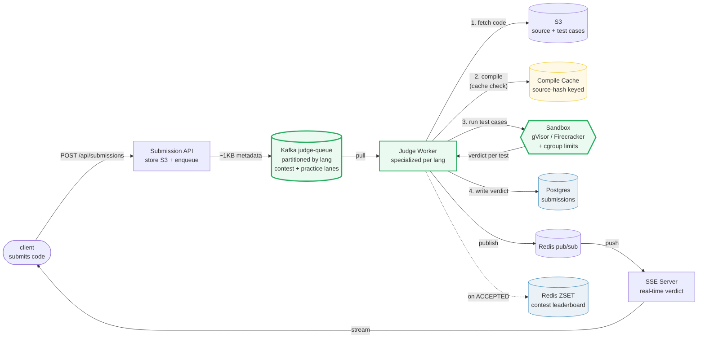
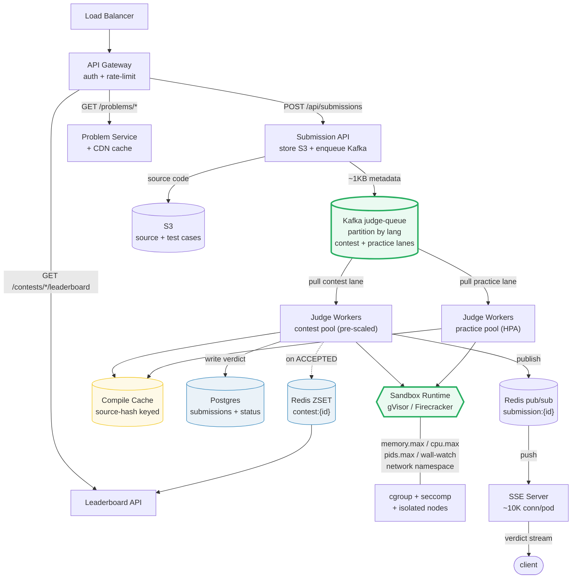

# Design a Coding Platform (LeetCode)

> **Companion code:** [`coding_platform.py`](https://github.com/quanhua92/tutorials/blob/main/systemdesign/coding_platform.py).
> **Live demo:** [`coding_platform.html`](https://github.com/quanhua92/tutorials/blob/main/systemdesign/coding_platform.html) — open in a browser.

---

## 0. TL;DR — the one idea

> **The analogy:** an online judge is an **assembly line for untrusted code** — every
> submission enters a **priority queue**, a specialized **worker** pulls it, runs it
> inside a **locked-down sandbox** (gVisor/Firecracker + cgroups), feeds it **test
> cases** one by one (compile → run → compare output), and emits one of six
> **verdicts**. Contests add a **leaderboard** ranked by problems solved then penalty
> time, backed by a single Redis sorted set.

The whole system reduces to **one write** (`enqueue submission`) and **one
read-back** (`GET submission/{id}/events` SSE stream → verdict). Every other concern
— sandbox isolation, cgroup limits, compilation cache, verdict precedence, contest
priority lanes, leaderboard scoring — hangs off that pipeline.



---

## 1. Requirements

### Functional
- **Submit code** in 20+ languages; compile and execute against 30–200 test cases.
- **Secure sandbox isolation** — untrusted code must not escape or access the host.
- **Return one of six verdicts**: ACCEPTED, WRONG_ANSWER, TLE, MLE, RE, CE.
- **Real-time submission status** feedback to the client (no polling).
- **Contest leaderboard** ranked by problems solved then penalty time (5 min/wrong).
- **Problem management** — descriptions, visible/hidden test cases, editorials.

### Non-Functional
- **Judge latency**: p50 ~3–5s at normal load; p99 ~30s during contest peaks.
- **Throughput**: ~200 submissions/sec practice; ~2,000/sec contest peak (30–60 min).
- **Availability**: 99.9% general; 99.99% contest infrastructure.
- **Security**: sandbox escape must not compromise host or neighbors.

---

## 2. Scale Estimation

> From `coding_platform.py` **Section 6** (2M submissions/day, ~5KB metadata, 100 tests/problem):

| Metric | Value |
|---|---|
| Submissions / day | 2,000,000 |
| Metadata / submission | 5,000 B (source code in S3, ~100KB max) |
| Test cases / problem (avg) | 100 |
| **Practice peak QPS** | **200 /s** |
| **Contest peak QPS** | **2,000 /s** (10× practice, 30–60 min burst) |
| Sandbox executions / day | 200,000,000 (subs × 100 tests) |

> From `coding_platform.py` **Section 6** — Postgres metadata storage:

| Storage metric | Value |
|---|---|
| Metadata / day | 10.00 GB |
| **Metadata / year** | **3.65 TB** |

> From `coding_platform.py` **Section 6** — sandbox fleet sizing (contest peak):

| Fleet metric | Value |
|---|---|
| Concurrent sandboxes needed | 6,000 (peak_qps × wall_per_sub = 2,000 × 3s) |
| Pre-scale window | 30 min before contest (K8s node provisioning takes 2–5 min) |

---

## 3. Architecture



### Key Components

| Component | Technology | Why |
|---|---|---|
| Submission API | stateless pods | Receives code, stores in S3 (~100KB max), enqueues ~1KB metadata to Kafka. Returns `submission_id` immediately. |
| **Judge Queue (Kafka)** | **partitioned by language** | Workers specialize per language (only load one runtime image). Two consumer groups per partition: contest (priority 0, pre-scaled) + practice (priority 1, HPA on lag). |
| Judge Workers | stateless pods | Pull from Kafka, fetch code from S3, compile (cache check), run test cases in sandbox, emit verdict. Horizontally scalable. |
| **Sandbox Runtime** | **gVisor / Firecracker** | gVisor (user-space kernel, ~10ms startup, 20% overhead) for practice; pre-warmed Firecracker (KVM microVM, ~10ms amortized, 1.5% overhead) for contests. Docker alone shares the host kernel — insufficient. |
| cgroup + seccomp | kernel primitives | `memory.max` (256MB→MLE), `cpu.max` (2s→TLE), `pids.max=1` (fork-bomb), wall-clock watchdog (sleep-evasion→TLE), network namespace (no egress). |
| Compile Cache | Redis / local disk | Keyed by `sha256(lang+source)`; skips 0.8–3s recompile on resubmit. Saves 2,000ms per C++ cache hit. |
| Postgres | persistent store | Append-only `submissions` table + `user_problem_status` upserted on every verdict. Source of truth. |
| Redis pub/sub + SSE | real-time push | Worker publishes verdict → SSE server pushes to client. Eliminates 50K Postgres reads/sec at peak. SSE is unidirectional + one-shot — perfect for this pattern. |
| Redis ZSET | leaderboard | Composite score `solved×1e9 − penalty` packs two sort keys into one float; `ZREVRANGE` returns solved-DESC then penalty-ASC in O(log N + K). |

---

## 4. Key Design Decisions

### 4.1 Sandbox isolation: gVisor vs Firecracker vs Docker

> From `coding_platform.py` **Section 2** (SANDBOX_RUNTIMES):

| Decision | Option A | Option B | Winner | Why |
|---|---|---|---|---|
| **Sandbox runtime** | **gVisor (practice) + pre-warmed Firecracker (contest)** | Docker containers | **gVisor + Firecracker** | Docker shares the host kernel — kernel exploits escape containers. gVisor intercepts ~200 syscalls in a user-space kernel (~10ms startup, 20% overhead) — ideal for practice where fast startup matters. Firecracker gives a separate kernel per execution via KVM (~125ms cold, ~10ms pre-warmed, 1.5% overhead) — strongest isolation for untrusted contest code. Pre-warming a VM pool amortizes the cold start. |

| Runtime | Startup | CPU overhead | Isolation | Use case |
|---|---|---|---|---|
| gVisor | 10ms | 20.0% | user-space kernel | practice (fast startup) |
| Firecracker | 125ms | 1.5% | KVM microVM | cold start |
| Firecracker (pre-warmed) | 10ms | 1.5% | KVM microVM | contest (amortized) |

- **Defense in depth**: sandbox runtime + cgroup limits + seccomp-BPF syscall filter +
  network namespace (no routes → ENETUNREACH) + isolated worker nodes + daily node
  rotation.

### 4.2 cgroup resource limits (mandatory even with a sandbox)

> From `coding_platform.py` **Section 2** (cgroup constants):

| Limit | Value | Breach → verdict |
|---|---|---|
| `memory.max` | 256 MB (262,144 KB) | OOM kill → **MLE** |
| `cpu.max` | 2,000 ms (2.0 s) | CPU budget exhausted → **TLE** |
| `pids.max` | 1 | fork bomb killed → **RE** |
| wall-clock watchdog | 4,000 ms (cpu + 2s) | sleep-evasion → **TLE** |
| network namespace | no egress | any socket → ENETUNREACH |

- The wall-clock watchdog is **external to cgroup** — a `sleep()` loop burns no CPU
  but the watchdog still kills it at cpu_max + 2s.

### 4.3 Judge queue: partitioned by language + priority lanes

> From `coding_platform.py` **Section 1** (JudgeQueue pull order):

| Decision | Option A | Option B | Winner | Why |
|---|---|---|---|---|
| **Queue partitioning** | **Kafka partitioned by language** | Single global queue | **By language** | Workers specialize — a python worker never loads the cpp toolchain. Auto-scale independently per language. Two consumer groups per partition: contest (priority 0, pre-scaled) + practice (priority 1, HPA on consumer lag). |

- Demo: 6 submissions across python/cpp/java with mixed contest/practice lanes.
  Python partition pulls `S3, S6, S1` — contest submissions S3/S6 jump the practice
  S1 even though S1 arrived first.
- Source code in **S3** (~100KB max); the Kafka message carries only ~1KB metadata
  (`submission_id`, `problem_id`, `lang`, `s3_key`, `lane`).

### 4.4 Test runner: verdict precedence + stop-on-first-failure

> From `coding_platform.py` **Section 3** (judge_program):

| Decision | Option A | Option B | Winner | Why |
|---|---|---|---|---|
| **Verdict aggregation** | **Stop on first non-AC test** (precedence CE > TLE > MLE > RE > WA) | Run all tests, report worst | **Stop on first failure** | Real judges don't waste sandbox slots on a submission that already failed. Precedence ensures the *most severe* fault is reported if multiple fire on one test. |

- **Precedence**: `CE > TLE > MLE > RE > WA > AC` — compile error stops everything
  before execution; among execution faults, TLE outranks MLE outranks RE outranks WA.
- Demo: 6 programs against the "Two Sum" problem (5 test cases):

| program | verdict | first failing test | reason |
|---|---|---|---|
| `correct` | **ACCEPTED** | — | passes all 5 |
| `off_by_one` | **WRONG_ANSWER** | test 1 | output mismatch |
| `slow` | **TIME_LIMIT_EXCEEDED** | test 1 | 3000ms > 2000ms limit |
| `hungry` | **MEMORY_LIMIT_EXCEEDED** | test 1 | 300MB > 256MB limit |
| `crash` | **RUNTIME_ERROR** | test 1 | segfault / div-by-zero |
| `broken` | **COMPILE_ERROR** | — | syntax error, no execution |

### 4.5 Compilation cache: source-hash keyed

> From `coding_platform.py` **Section 4** (CompileCache):

| Decision | Option A | Option B | Winner | Why |
|---|---|---|---|---|
| **Compile caching** | **`sha256(lang + source)` keyed artifact store** | Recompile every submission | **Cache** | Users resubmit near-identical code dozens of times. C++ pays 2,000ms per compile; a cache hit returns 0ms. Demo: first submit misses (2,000ms), second submit hits (0ms) — **2,000ms saved**. Python is interpreted (~0ms) so the cache is a no-op there. |

| Language | Compile time |
|---|---|
| rust | 3,000 ms |
| cpp | 2,000 ms |
| java | 1,500 ms |
| go | 800 ms |
| python | 0 ms (interpreted) |

### 4.6 Leaderboard: composite-score sorted set

> From `coding_platform.py` **Section 5** (compute_standings + SortedSet):

| Decision | Option A | Option B | Winner | Why |
|---|---|---|---|---|
| **Ranking store** | **Redis ZSET with composite score `solved×1e9 − penalty`** | Postgres `ORDER BY solved DESC, penalty ASC` | **Redis ZSET** | A B-tree `ORDER BY` rescans on every read — unacceptable at 2K writes/sec. The composite score packs two sort keys into one float so `ZREVRANGE` returns solved-DESC then penalty-ASC in O(log N + K). `ZADD` is O(log N) per update. |

- **Penalty**: 5 min (300s) per wrong submission, **only counted if the problem is
  eventually accepted**. Dave's P1 WA@10 is free because dave never solved P1.
- **Tie-break demo** (5-user, 3-problem contest):

| rank | user | solved | penalty | zset score |
|---|---|---|---|---|
| 1 | alice | 3 | 1,800s | 2,999,998,200 |
| 2 | carol | 3 | 4,500s | 2,999,995,500 |
| 3 | bob | 2 | 3,300s | 1,999,996,700 |
| 4 | dave | 1 | 2,400s | 999,997,600 |
| 5 | eve | 1 | 3,000s | 999,997,000 |

- Alice & carol both solved 3, but alice's penalty (1,800s) < carol's (4,500s) →
  alice ranks #1. The higher score wins under `ZREVRANGE`.

### 4.7 Real-time feedback: SSE + Redis pub/sub

| Decision | Option A | Option B | Winner | Why |
|---|---|---|---|---|
| **Verdict delivery** | **SSE + Redis pub/sub** | WebSocket / polling | **SSE** | The verdict is unidirectional + one-shot — SSE is simpler than WebSocket. Client opens SSE → server subscribes to Redis `submission:{id}` → worker publishes → SSE pushes. Eliminates 50K Postgres reads/sec at peak. ~10K SSE connections per pod; 5–10 pod fleet. |

---

## 5. Data Model

### Postgres `submissions` (append-only)

| Column | Type | Notes |
|---|---|---|
| `id` | UUID | PK |
| `user_id` | BIGINT | NOT NULL |
| `problem_id` | BIGINT | NOT NULL |
| `contest_id` | BIGINT | NULL for practice |
| `language` | VARCHAR(20) | python3, cpp17, java21, etc. |
| `status` | VARCHAR(20) | PENDING / ACCEPTED / WA / TLE / MLE / RE / CE |
| `source_code_s3_key` | TEXT | Code stored in S3 (~100KB max) |
| `runtime_ms` | INT | Execution time |
| `memory_kb` | INT | Peak memory |
| `submitted_at` | TIMESTAMPTZ | Server receipt (for fairness) |
| `judged_at` | TIMESTAMPTZ | Verdict time |

Indexes: `(user_id, problem_id, status)`, `(contest_id, user_id)`, `(problem_id, status)`.

### Postgres `user_problem_status` (materialized view, upserted per verdict)

| Column | Type | Notes |
|---|---|---|
| `user_id` | BIGINT | PK (composite) |
| `problem_id` | BIGINT | PK (composite) |
| `best_status` | VARCHAR(20) | ACCEPTED if ever accepted |
| `attempt_count` | INT | Total attempts |
| `last_submitted_at` | TIMESTAMPTZ | Last activity |

### Redis ZSET (contest leaderboard)

| Key | Member | Score | Notes |
|---|---|---|---|
| `contest:{id}` | `user_id` | `solved×1e9 − penalty` | `ZADD` O(log N); `ZREVRANGE` O(log N + K). 7-day TTL; snapshot to Postgres at contest close. |

### S3

| Key | Content | Notes |
|---|---|---|
| `submissions/{id}/source` | source code | ~100KB max per submission |
| `problems/{id}/testcases` | test case I/O | ~100KB each; worker-side local disk caching |

---

## 6. API Endpoints

| Method | Path | Description |
|---|---|---|
| `POST` | `/api/submissions` | Submit code → store S3 + enqueue Kafka → `{submission_id, status: PENDING}` |
| `GET` | `/api/submissions/{id}/events` | SSE stream for real-time verdict |
| `GET` | `/api/submissions/{id}` | Get submission result |
| `GET` | `/api/problems` | List problems (paginated, CDN-cached) |
| `GET` | `/api/problems/{id}` | Problem description + visible test cases |
| `GET` | `/api/contests/{id}/leaderboard` | Contest leaderboard (Redis ZSET-backed) |
| `POST` | `/api/contests/{id}/submit` | Contest submission (rate-limited: 1/problem/10s) |

---

## 7. Deep dives

- **Language-specific time multipliers**: Python ~5×, Java ~2×, JS ~3× relative to
  the C++ baseline. The `cpu.max` limit is scaled per language so a Python solution
  isn't unfairly TLE'd against an equivalent C++ solution.
- **Fairness via server-side timestamping**: contest penalty is scored at **queue
  entry time**, not judge completion time — a slow worker can't penalize a fast
  submitter.
- **Stuck submission recovery**: background job scans `PENDING > 60s`, re-enqueues
  once, then marks `JUDGE_ERROR` to avoid infinite retries.
- **Rate limiting during contests**: Redis token bucket
  `SET contest:{id}:ratelimit:{uid}:{pid} 1 EX 10 NX` → HTTP 429 if the key exists.
- **Sandbox fleet pre-scaling**: K8s scheduled scale-up 30 min before known contests
  (node provisioning takes 2–5 min; reactive HPA cannot meet the 2K/s burst).
- **Leaderboard CDN cache**: top-100 page cached 5s TTL; a user's own rank bypasses
  the CDN for freshness. Final rankings snapshotted to Postgres at contest close.

---

### Killer Gotchas

- **Docker alone is insufficient.** It shares the host kernel; kernel exploits escape
  containers. Always layer a sandbox runtime (gVisor/Firecracker) + cgroup limits +
  seccomp-BPF + network namespace + isolated worker nodes.
- **`sleep()` evades cgroup CPU limits.** A `while True: sleep(0.1)` loop burns no
  CPU, so `cpu.max` never fires. An **external wall-clock watchdog** (cpu_max + 2s)
  is mandatory to kill it.
- **Wrong submissions only penalize if the problem is eventually accepted.** Dave's
  P1 WA@10 is free because he never solved P1. Don't add penalty on every WA
  blindly — you'll penalize users who gave up on a problem.
- **Source code goes in S3, not in the Kafka message.** A Kafka message carrying
  100KB of code balloons broker storage and slows consumers. Keep messages ~1KB
  (metadata only); workers fetch code from S3.
- **Verdict precedence matters.** CE stops everything before execution; among
  execution faults TLE > MLE > RE > WA. If you check WA before TLE, a timing-out
  program that also produces wrong output gets misreported as WA.
- **The composite score must keep penalty << 1e9.** With `solved×1e9 − penalty`,
  penalty values (max ~31,000s for a 2-hour contest) are dwarfed by the 1e9 gap
  between solved counts — the packing never collides.
- **Server-side timestamp for contest fairness.** Score at queue entry time, not
  judge completion. A backed-up queue must not penalize a user who submitted early.
- **Pre-scale before contests.** K8s node provisioning takes 2–5 min; the 2K/s
  contest burst arrives in seconds. Reactive HPA is too slow — schedule the scale-up
  30 min before known contests.

---

### Reproduce

```bash
python3 coding_platform.py          # prints all sections + [check] OK
```

> From `coding_platform.py` **Section 7 — GOLD CHECK** (values pinned for `coding_platform.html`):

```
queue_n_submissions          = 6
queue_python_pull            = S3,S6,S1
queue_cpp_pull               = S5,S2
queue_java_pull              = S4
sandbox_gvisor_ms            = 10
sandbox_firecracker_ms       = 125
sandbox_prewarmed_ms         = 10
sandbox_mem_max_mb           = 256
sandbox_cpu_max_ms           = 2000
verdict_precedence           = COMPILE_ERROR,TIME_LIMIT_EXCEEDED,MEMORY_LIMIT_EXCEEDED,RUNTIME_ERROR,WRONG_ANSWER,ACCEPTED
verdict_correct              = ACCEPTED
verdict_off_by_one           = WRONG_ANSWER
verdict_slow                 = TIME_LIMIT_EXCEEDED
verdict_hungry               = MEMORY_LIMIT_EXCEEDED
verdict_crash                = RUNTIME_ERROR
verdict_broken               = COMPILE_ERROR
compile_cache_saved_ms       = 2000
lb_top3                      = alice,carol,bob
lb_alice_penalty_sec         = 1800
lb_bob_penalty_sec           = 3300
lb_alice_score               = 2999998200
storage_per_year_tb          = 3.65
contest_peak_qps             = 2000
sandbox_exec_per_day         = 200000000
```

`[check] GOLD reproduces from queue + sandbox + runner + cache + lb? OK` — the gold
badge `check: OK` at the bottom of
[`coding_platform.html`](https://github.com/quanhua92/tutorials/blob/main/systemdesign/coding_platform.html)
re-implements the **priority queue**, **verdict decision tree**, **compilation
cache**, and **composite-score sorted set** in **pure JavaScript**, and confirms they
match the `.py` exactly (python-pull `S3,S6,S1`, all six verdicts, 2000ms cache save,
leaderboard top-3 `alice,carol,bob`, alice score 2999998200).
