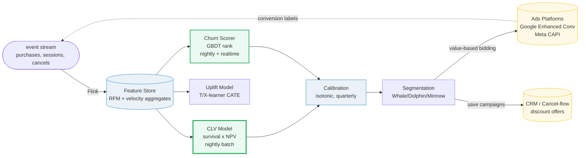
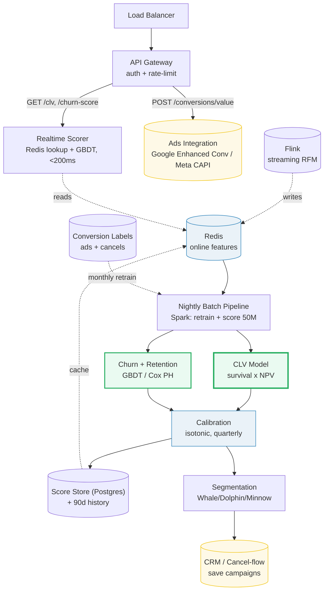

# Design a Customer Lifetime Value (CLV) System

> **Companion code:** [`customer_ltv.py`](https://github.com/quanhua92/tutorials/blob/main/systemdesign/customer_ltv.py).
> **Live demo:** [`customer_ltv.html`](https://github.com/quanhua92/tutorials/blob/main/systemdesign/customer_ltv.html) — open in a browser.

---

## 0. TL;DR — the one idea

> **The analogy:** CLV is a **survival-weighted net-present-value** calculation. A
> customer is worth the *discounted sum of every future payment they'll ever make,
> each weighted by the probability they're still around to make it*. Three things
> must be modeled *separately and correctly*: the **retention curve** (are they still
> alive at month *t*?), the **cash flow** (how much do they spend per period?), and
> the **discount rate** (a dollar in year 3 is not a dollar today). Get any one wrong
> and you systematically mis-bid for every customer on Google and Meta.

Two ideas make the rest fall into place:

- **Churn scoring ≠ retention prediction ≠ CLV.** They are three different outputs
  with three different calibration needs. *Churn score* is a relative rank for save
  campaigns (AUC). *Retention* is a calibrated P(active in T days) for revenue
  forecasting (Brier). *CLV* is a calibrated dollar amount for bidding (MAE in $) —
  the only one where a 30% systematic bias directly causes 30% overbidding.
- **The discount rate is a lever, not a constant.** CLV =
  Σ ARPU×gm×S(t)/(1+r)ᵗ. At r=20% a month-36 dollar is worth $0.58; at r=0 it's a
  full dollar. Sticky cohorts (premium: **D90 retention 0.5383**) are *far* more
  discount-sensitive than churny ones (trial: **D90 0.0358**) — their value lives
  further out in time.

---

## 1. Requirements

### Functional
- **Estimate per-customer CLV** as a calibrated dollar amount with uncertainty intervals (p10/p50/p90).
- **Compute churn scores** (relative risk rank) and **retention predictions** (calibrated P(active in T days)) as *distinct* outputs.
- **Segment** the base by LTV tier (Whale / Dolphin / Minnow) to drive bid levels and CRM targeting.
- **Feed downstream systems**: value-based bidding (Google/Meta), CRM send frequency, credit-line decisions.
- **Handle cold-start** for new users with one session (hierarchical pooling across channel/geo/tier).

### Non-Functional
- **Nightly batch** scoring for all customers (CRM, capacity planning) — 50M customers in ~4h.
- **Sub-200ms real-time** scoring for in-session interventions (cancel-flow discount offers).
- **Calibrated dollar output** for bidding — systematic 30% overestimate ⇒ systematic 30% overbidding.
- **Monthly retrain** with drift monitoring (PSI on features); quarterly isotonic recalibration.
- **Right-censoring awareness** — young customers have unknown horizons; must not bias toward churned users.

---

## 2. Scale Estimation

> From `customer_ltv.py` **Section 7** (50M customers, 40 features, 6 score values):

| Metric | Value |
|---|---|
| Active customers | 50,000,000 |
| Features / customer | 40 (RFM + velocity aggregates) |
| Score values / customer | 6 (clv, p10/p50/p90, churn, retention) |
| Nightly batch window | ~4 h → **3,472 customers/s** |
| Realtime cancel-flow QPS | 1,000 /s (<200ms) |

> From `customer_ltv.py` **Section 7** — storage:

| Storage metric | Value |
|---|---|
| **Feature store (Redis)** | **16.00 GB** (50M × 40 feats × 8 B) |
| **Current scores (Postgres)** | **2.40 GB** (50M × 6 vals × 8 B) |
| **90-day score history** | **216.00 GB** (archive to S3 Parquet) |

> From `customer_ltv.py` **Section 7** — the latency budget:

| Path | Latency |
|---|---|
| Realtime CLV/churn lookup (Redis + cached score) | < 5 ms |
| Realtime GBDT rescore (cancel-flow offer) | < 150 ms |
| **Total cancel-flow** | **< 200 ms** budget |
| Nightly batch retrain + score (Spark, full 50M) | ~4 h |

---

## 3. Architecture

### Key Components

| Component | Technology | Why |
|---|---|---|
| **CLV Model** | **Weibull/BG-NBD survival × Gamma-Gamma spend × DNN residual** | **The dollar output.** Survival curve gives P(active at month t) — the weight on each future cash flow; NPV discounts it. Production runs a probabilistic baseline + DNN residual for lift. Demo: premium cohort D90 retention **0.5383** vs trial **0.0358** drives the whole CLV gap. |
| Feature Store | Redis (online) + Flink (streaming) | RFM aggregates + velocity windows, same registry for train+serve ⇒ no skew. Real-time lookups ~5ms. |
| **Churn Scorer** | **LightGBM (GBDT)** | Relative risk *ranking* for save campaigns (AUC, precision@k). Low calibration need. Distinct from retention. |
| Calibration | Isotonic regression, quarterly | A CLV model that's right on average but 30% high in the top decile causes 30% overbidding on whales. Recalibrate by decile on rolling holdout, not aggregate RMSE. |
| **Segmentation** | **LTV:CAC tiers** | Whale (LTV:CAC≥3), Dolphin (≥1), Minnow (<1). Maps straight to bid levels. Demo: **5% whales hold 62.4% of LTV** (12.5× concentration). |
| Ads Integration | Server-side conversions (Google Enhanced, Meta CAPI) | Fires predicted CLV as the conversion *value* for value-based bidding. Privacy-first: SKAdNetwork buckets to 6-bit; only upload post-calibration values. |
| Score Store | Postgres + 90d history → S3 Parquet | Current scores hot in Postgres (2.4GB); time-series for drift analysis archived (216GB/90d). |

---

## 4. Key Design Decisions

### 4.1 Survival-weighted NPV vs historical-revenue regression

> From `customer_ltv.py` **Section 1** (retention curves) + **Section 4** (predictive NPV):

| Decision | Option A | Option B | Winner | Why |
|---|---|---|---|---|
| **CLV formula** | **Σ ARPU×gm×S(t)/(1+r)ᵗ (survival × NPV)** | Regress historical revenue-to-date | **Survival × NPV** | Regressing revenue-to-date *leaks the future* and ignores the time-value of money. Survival-weighted NPV is forward-looking and discount-aware. Demo: premium historical CLV **$283.48** → predictive **$217.18** (10% rate, 36mo) — a **23.4%** gap that bidding *must* account for; for trial the gap is only **1.3%** ($1.62 → $1.60). |

### 4.2 Churn scoring vs retention prediction vs CLV

> From `customer_ltv.py` **Section 2** (churn LR) vs **Section 1** (retention):

| Output | Use case | Calibration | Cadence | Metric |
|---|---|---|---|---|
| **Churn score** | save-campaign *ranking* | low (rank only) | nightly batch | AUC, precision@k |
| **Retention P(active in T)** | revenue forecasting | high | weekly batch | Brier score |
| **CLV ($)** | **acquisition bidding** | **critical** | nightly batch | **MAE in $**, policy sim |

Demo churn scorer (logistic, pure stdlib): learned weights **tenure −10.6162, recency +7.1535, tickets +3.4628**; long-tenure premium customer P(churn) **0.0000**, short-tenure high-recency customer **0.9926**. Signs match intuition — but this is a *rank*, not a dollar.

### 4.3 Discount rate: lever vs constant

> From `customer_ltv.py` **Section 5** (discount sensitivity, standard cohort, 36mo):

| Annual rate | CLV |
|---|---|
| 0% | $27.45 |
| 10% | $26.47 |
| 20% | $25.64 |
| 30% | $24.92 |

| Decision | Option A | Option B | Winner | Why |
|---|---|---|---|---|
| **Discount rate** | **Tuned per cohort / use case** | Fixed 10% everywhere | **Tuned** | The rate is a lever: overestimating undervalues loyal customers and underbids. CLV drops **9%** from r=0 to r=30% on a churny cohort, but the effect is *far larger* on sticky premium cohorts whose value lives further out. Set r from your cost of capital, then stress-test. |

### 4.4 Segmentation: LTV:CAC tiers vs raw percentile

> From `customer_ltv.py` **Section 6** (segmentation):

| Tier | Customers | %cust | %LTV | avg CLV | LTV:CAC |
|---|---|---|---|---|---|
| **Whale** | 50,000 | 5.0% | **62.4%** | $169.40 | **6.78** |
| Dolphin | 120,000 | 12.0% | 25.0% | $28.24 | 1.13 |
| Minnow | 830,000 | 83.0% | 12.6% | $2.05 | 0.08 |

| Decision | Option A | Option B | Winner | Why |
|---|---|---|---|---|
| **Tier boundaries** | **LTV:CAC thresholds (3 / 1)** | CLV percentile (p90/p50) | **LTV:CAC** | Tiers map straight to bid decisions (bid up to 3× CAC on whales, defend dolphins, *don't acquire* minnows at LTV:CAC<1) and avoid atomic-block straddling. **5% of customers hold 62.4% of LTV — a 12.5× concentration.** |

### 4.5 Model family by business type

| Business type | Model | Why |
|---|---|---|
| **Non-contractual** (e-commerce, apps) | BG/NBD (repeat purchases + latent dropout) + Gamma-Gamma (spend) | Encodes generative assumptions; beats RFM regression on sparse data. |
| **Contractual** (subscriptions) | Cox PH / Weibull survival | Observable cancel events; handles right-censoring via partial likelihood. |
| **Production path** | Probabilistic baseline + DNN residual | Interpretability from baseline, lift from DNN. |

### 4.6 Batch vs realtime scoring

| Decision | Option A | Option B | Winner | Why |
|---|---|---|---|---|
| **Scoring path** | **Both: nightly batch + realtime** | One path | **Both** | CLV is rank-stable → nightly batch (full features, Spark, 4h). Cancel-flow needs <200ms → realtime GBDT on pre-aggregated features (Redis lookup 5ms + rescore 150ms). Different latency budgets, different feature sets. |

---

## 5. Data Model

### customer_scores (the scored entity)

| Column | Type | Notes |
|---|---|---|
| `customer_id` | BIGINT | PK. |
| `clv_estimate` | DECIMAL | Predicted discounted future spend (the bid value). |
| `clv_p10` / `p50` / `p90` | DECIMAL | Uncertainty quantiles. |
| `churn_score` | FLOAT | Risk rank 0–100 (nightly, for save campaigns). |
| `retention_prob` | FLOAT | Calibrated P(active in T days). |
| `segment_id` | ENUM | `WHALE` / `DOLPHIN` / `MINNOW` (by LTV:CAC). |
| `model_version` | VARCHAR | Pin version for ads integration + rollback. |
| `score_timestamp` | TIMESTAMP | When the score was computed. |

### Feature store (Redis, hot)

| Key | TTL | Notes |
|---|---|---|
| `rfm:{customer_id}` | 24h | Recency, frequency, monetary aggregates. |
| `vel:{customer_id}:sessions_30d` | 24h | 30-day session count (velocity). |
| `cohort:{customer_id}` | – | Acquisition channel / tier for partial pooling (cold-start). |

---

## 6. API Endpoints

| Method | Path | Description |
|---|---|---|
| GET | `/api/customers/{id}/clv` | Predicted CLV with p10/p50/p90 (batch-precomputed + cached). |
| GET | `/api/customers/{id}/churn-score` | Churn risk rank 0–100 (nightly batch). |
| GET | `/api/customers/{id}/retention` | Calibrated P(active in T days). |
| POST | `/api/customers/{id}/treatment-uplift` | CATE for a given treatment (cancel-flow discount). |
| POST | `/api/campaigns/allocate` | Allocate treatment budget under LTV:CAC + cap constraints. |
| POST | `/api/conversions/value` | Fire predicted CLV as conversion value to ads platforms. |

---

### Killer Gotchas
- **Three outputs, three calibrations.** Churn rank (AUC), retention (Brier), and CLV ($) need *different* calibration. A model right on average but 30% high in the top decile causes 30% overbidding on whales — recalibrate *by decile*, not aggregate RMSE.
- **Label leakage.** Regressing revenue-to-date leaks the future. The label is *future spend from t₀ forward*; all features must be point-in-time snapshots at t₀.
- **Right-censoring.** Young customers have unknown horizons. Excluding them biases toward churned users; include them in the likelihood but not the response variable.
- **The discount rate is a lever.** CLV is highly discount-sensitive for sticky cohorts. Overestimating r undervalues loyal customers and underbids; stress-test r against your cost of capital.
- **Bid-algorithm shock.** A retrain that shifts CLV mean 20% shocks the bidder. Pin model version, ramp new models over 2-week windows, only upload post-calibration values to ads platforms.
- **Privacy-first integration (2024–2026).** Apple SKAdNetwork buckets CLV to 6-bit log-scaled values; Google Privacy Sandbox loses per-user values entirely → shift to audience targeting with high-CLV lookalike seeds.
- **Cold-start.** New users need a score from day one. Use hierarchical Bayesian partial pooling across channel/geo/tier as a shrinkage prior — defaulting to the global mean over-bids on low-value channels.
