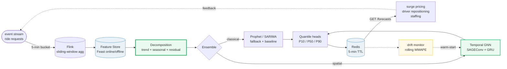
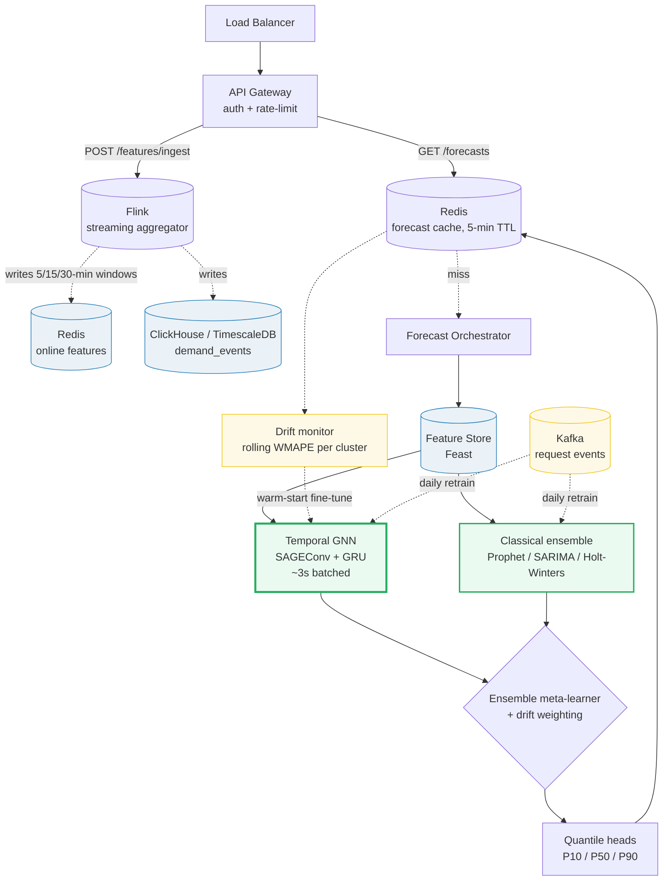

# Design a Demand Forecasting System

> **Companion code:** [`demand_forecasting.py`](https://github.com/quanhua92/tutorials/blob/main/systemdesign/demand_forecasting.py).
> **Live demo:** [`demand_forecasting.html`](https://github.com/quanhua92/tutorials/blob/main/systemdesign/demand_forecasting.html) — open in a browser.

---

## 0. TL;DR — the one idea

> **The analogy:** demand forecasting is **decompose, model each piece, reassemble**.
> Every demand series is the sum of a *trend* (are we growing?), a *seasonality*
> (the repeating weekly/daily shape), and a *residual* (everything else). Split the
> signal into those three layers, forecast each layer with the right tool, and add
> them back. *The forecast is only as good as the decomposition* — if you feed raw
> seasonal data to a trend model, it will mistake every Sunday trough for a
> recession.

Three ideas make the rest fall into place:

- **Decompose before you forecast.** Classical additive decomposition
  `y(t) = Trend(t) + Seasonal(t) + Residual(t)` extracts the trend via a centered
  moving average, then reads off the seasonal index per day-of-week. Our 8-week
  demo recovers the true Saturday index `+31.88` (true `+30`) and Sunday `-41.57`
  (true `-40`) from noisy data — accurate to ~2 units.
- **Beat the seasonal-naive baseline or don't ship.** "Tomorrow ≈ last week's same
  day" (`y(t-7)`) is a brutally strong floor. In our holdout the unseasonal Holt
  method scores **WMAPE 13.93%** while seasonal-naive scores **7.46%** — because
  Holt's train window ended on a Sunday trough, its trend estimate went *negative*
  (-2.64) and it forecast a declining line. A real model must clear the baseline.
- **WMAPE, not MAPE.** MAPE divides per-point by actual demand, so a 3 AM zone with
  demand 0.1 vs forecast 0.2 is "50% error" — identical to 500 vs 1000 at rush hour.
  WMAPE = `Σ|y−ŷ| / Σ|y|` is volume-weighted, robust to zero-demand, and mirrors
  business impact (total missed units). Production target: **WMAPE < 10% (1h)**,
  **< 20% (24h)**.

---

## 1. Requirements

### Functional
- **Forecast demand per zone** at 5-minute buckets for a 1-hour horizon (real-time) and 24-hour horizon (staffing).
- **Produce multi-quantile forecasts** (P10 / P50 / P90) for risk-aware supply decisions.
- **Ingest real-time features**: recent demand, driver supply, weather, events, surge state.
- **Decompose** each zone's history into trend + seasonality + residual and persist seasonal indices.
- **Feed downstream systems**: surge pricing, driver repositioning, staffing scheduler.

### Non-Functional
- **Latency**: full-city forecast refresh (< 5,000 zones) within 5 seconds per 5-min cycle.
- **Accuracy**: WMAPE < 10% for 1h-ahead, < 20% for 24h-ahead.
- **Online adaptation**: adjust to distribution shifts within hours, not days.
- **Spatial fairness**: no zone type with MAE > 2× the global average.
- **Scale**: 5,000+ zones per city, ~50 cities, refreshing every 5 minutes.

---

## 2. Scale Estimation

> From `demand_forecasting.py` **Section 7** (5,000 zones/city, 50 cities, 5-min buckets):

| Metric | Value |
|---|---|
| Zones per major city | 5,000 (H3 res-8, ~0.74 km²) |
| Cities | 50 |
| **Zones globally** | **250,000** |
| Forecast buckets / day | 288 (5-min interval) |
| **Predictions / day** | **72,000,000** (250K × 288) |
| Ride requests / city / day | 1,000,000 |

> From `demand_forecasting.py` **Section 7** — storage:

| Storage metric | Value |
|---|---|
| **Demand time-series / day** | **2.50 GB** (250K zones × 10 KB) |
| **Demand time-series / year** | **912.50 GB** (~900 GB, archive to S3/Parquet) |

> From `demand_forecasting.py` **Section 7** — the 5-second refresh budget:

| Stage | Latency |
|---|---|
| Feature fetch (Feast) | < 500 ms |
| GNN batched inference (5K zones / GPU) | < 3,000 ms |
| Ensemble + quantile heads | < 500 ms |
| Write forecasts to Redis | < 500 ms |
| **Total refresh** | **< 5,000 ms** (5-min cycle) |

---

## 3. Architecture

### Key Components

| Component | Technology | Why |
|---|---|---|
| **Stream Processor** | **Flink** | Computes 5/15/30-min sliding-window demand aggregates from the ride-request event stream into Redis counters (~ms lookups at inference). |
| Feature Store | Feast (online + offline) | Single feature registry for train + serve → no skew. Point-in-time joins prevent leakage. |
| Time-Series Store | ClickHouse / TimescaleDB | Fast range scans on `(zone_id, timestamp)` for history pulls and batch retraining. |
| **Temporal GNN** | **SAGEConv + GRU** | **Primary model.** H3 zones = graph nodes, edges = neighbors. SAGEConv aggregates neighbor demand (spatial spillover), GRU captures temporal dynamics, multi-quantile heads emit P10/P50/P90. |
| Classical Ensemble | Prophet / SARIMA / Holt-Winters | Robust fallback during extreme events and a strong interpretable baseline. Seasonal-naive `y(t-7)` is the sanity floor. |
| Drift Monitor | rolling WMAPE per zone cluster | When error exceeds ~1.5× recent average, triggers warm-start fine-tuning (10–100× faster than full retrain). |
| Forecast Cache | Redis (5-min TTL) | Every zone needs a fresh forecast every 5 min — cache the last inference batch for hot reads. |

---

## 4. Key Design Decisions

### 4.1 Decompose first vs model the raw series end-to-end

> From `demand_forecasting.py` **Section 2** (additive decomposition):

| Decision | Option A | Option B | Winner | Why |
|---|---|---|---|---|
| **Forecasting approach** | **Decompose → model each component** | One black-box end-to-end model on raw y | **Decompose** | Splitting `y = Trend + Seasonal + Residual` lets each layer use the right tool and makes the model *interpretable* (you can see the Saturday bump). Demo recovers true Sat index `+31.88` (true `+30`), Sun `-41.57` (true `-40`) — accurate to ~2 units despite noise. The trend (CMA) and seasonal index are cheap, online-updateable, and feed every downstream model. |

### 4.2 Spatial modeling: per-zone vs joint graph

> From `demand_forecasting.py` **Section 4** (seasonal index is zone-local); discussion.md (spillover):

| Decision | Option A | Option B | Winner | Why |
|---|---|---|---|---|
| **Spatial model** | **Temporal GNN on H3 graph** | Independent per-zone models (ARIMA/Prophet each) | **GNN** | A concert spike in zone A spills into adjacent zones B, C. Per-zone models can't see neighbors; the GNN's SAGEConv aggregates 1-hop/2-hop demand and transfers to brand-new zones via graph connectivity. Per-zone classical models stay as the ensemble fallback and long-horizon baseline. |

### 4.3 Accuracy metric: WMAPE vs MAPE

> From `demand_forecasting.py` **Section 6** (metrics on held-out week):

| Decision | Option A | Option B | Winner | Why |
|---|---|---|---|---|
| **Primary metric** | **WMAPE = Σ\|y−ŷ\| / Σ\|y\|** | MAPE = mean(\|y−ŷ\|/\|y\|) | **WMAPE** | MAPE is undefined at y=0 and inflates errors for low-demand zones (3 AM zone 0.1 vs 0.2 = "50%"). WMAPE is volume-weighted, robust to zero demand, and mirrors business impact. Demo: Holt WMAPE **13.93%** vs MAPE 13.13% — close here because no near-zero points, but WMAPE diverges sharply on real 24h zones. |

### 4.4 Online learning strategy

| Decision | Option A | Option B | Winner | Why |
|---|---|---|---|---|
| **Adaptation** | **Drift-triggered warm-start fine-tuning** | Hourly full retrain / continuous online GD | **Warm-start** | Full GNN retrain is expensive; continuous online GD risks catastrophic forgetting. Monitor rolling WMAPE per cluster; on drift (>1.5× recent avg) warm-start from prior weights with a few gradient steps (10–100× faster). Separate short-horizon and long-horizon models to prevent forgetting. |

### 4.5 The forecast-pricing feedback loop

| Decision | Option A | Option B | Winner | Why |
|---|---|---|---|---|
| **Feedback loop** | **Train on requests + holdout zones** | Train on completed rides | **Requests + holdouts** | Forecast → surge → lower observed demand → biased training data → oscillation. Mitigate: train on *requests* (not completions), include the surge multiplier as an explicit feature, and maintain holdout zones with no pricing intervention for causal ground truth. |

---

## 5. Data Model

### `demand_events` (the raw signal, time-series store)

| Column | Type | Notes |
|---|---|---|
| `zone_id` | STRING | H3 hex ID (res-8). |
| `timestamp` | TIMESTAMP | 5-min bucket. |
| `request_count` | INT | Ride requests in the bucket (the forecast target). |
| `completion_count` | INT | Completed rides (affected by supply/surge). |
| `surge_multiplier` | FLOAT | Active surge — a feature, to debias the loop. |

### `zone_features` (spatial graph)

| Column | Type | Notes |
|---|---|---|
| `zone_id` | STRING | PK, H3 hex. |
| `zone_type` | STRING | Airport / residential / commercial / … |
| `neighbor_ids` | ARRAY<STRING> | Adjacent H3 cells (graph edges). |
| `seasonal_index` | JSON | Per-day-of-week / per-hour seasonal profile. |

### `forecasts` (served predictions, cached in Redis)

| Column | Type | Notes |
|---|---|---|
| `zone_id` | STRING | H3 hex. |
| `forecast_time` | TIMESTAMP | Target bucket. |
| `p10` / `p50` / `p90` | FLOAT | Quantile forecasts. |
| `model_version` | STRING | GNN version (reproducibility / rollback). |
| `generated_at` | TIMESTAMP | When the forecast was produced. |

---

## 6. API Endpoints

| Method | Path | Description |
|---|---|---|
| GET | `/api/v1/forecasts/{zone_id}?horizon=60min` | Demand forecast for one zone → `{p50, p10, p90, model_version}`. |
| GET | `/api/v1/forecasts/city/{city_id}?horizon=60min` | Forecasts for all zones (high QPS, cached 5 min). |
| POST | `/api/v1/features/ingest` | Ingest a real-time feature update (streaming, high QPS). |
| GET | `/api/v1/monitoring/drift` | Drift status + rolling WMAPE per zone cluster. |
| GET | `/api/v1/monitoring/wmape` | Accuracy metrics by zone and horizon. |

---

### Killer Gotchas
- **Beat the seasonal-naive baseline.** `y(t-7)` ("last week's same day") is a devastatingly strong floor. In the demo it scores **WMAPE 7.46%** vs Holt's **13.93%** — because Holt's window ended on a Sunday trough and its trend went negative. Any model that can't clear `y(t-7)` is worse than copy-paste.
- **The trend follows the window.** Holt/EMA trend estimates are dominated by the tail of the training window. Ending training on a seasonal extreme (Sunday trough) flips the trend sign. Always deseasonalize *before* fitting a trend, or use a seasonal model.
- **MAPE lies near zero.** A 3 AM zone with demand 0.1 vs forecast 0.2 is "50% MAPE." Use WMAPE (volume-weighted) or quantile/pinball loss when under-/over-forecast costs are asymmetric.
- **Temporal leakage.** Strict point-in-time feature joins (Feast). If offline WMAPE ≫ online WMAPE, you have leakage — a future feature leaked into training.
- **The forecast-pricing loop.** Training on surge-suppressed *completions* creates oscillation (forecast high → surge → low observed → forecast drops → no surge → high observed). Train on *requests*, include surge as a feature, keep holdout zones.
- **Cold start for new zones.** No history → transfer via the H3 graph (neighbor embeddings + zone-type priors), not a blank per-zone model.
