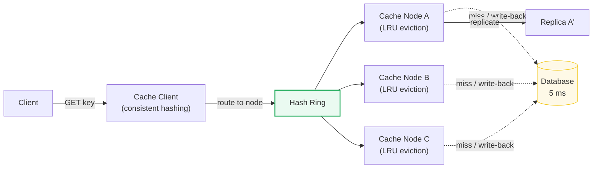
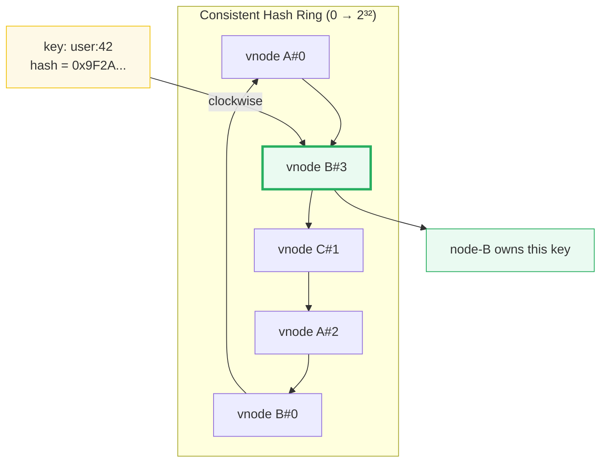
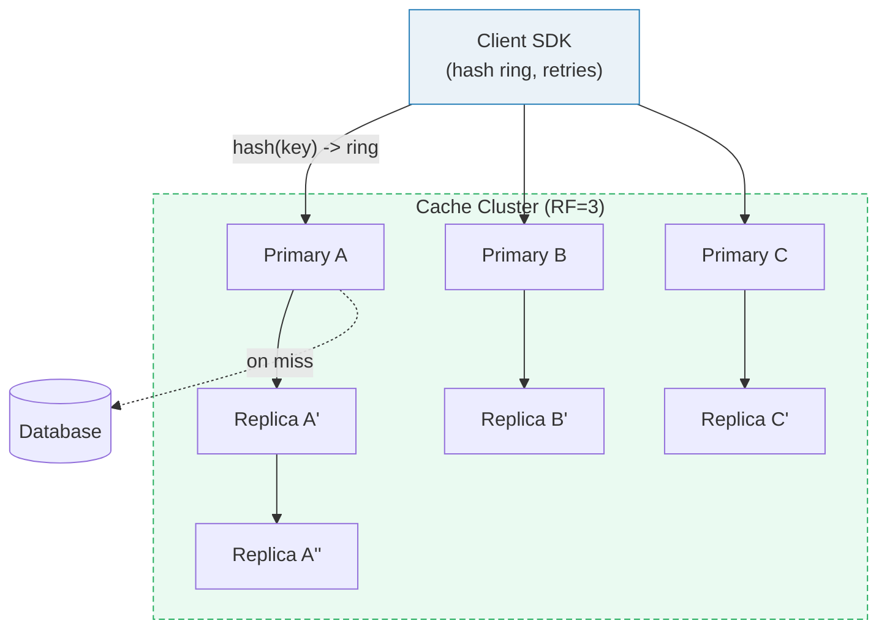

# Design a Distributed Cache

> **Companion code:** [`distributed_cache.py`](https://github.com/quanhua92/tutorials/blob/main/systemdesign/distributed_cache.py).
> **Live demo:** [`distributed_cache.html`](./distributed_cache.html) — open in a browser.
> Every number in this guide is printed by `python3 distributed_cache.py` — nothing hand-computed.

---

## 0. TL;DR — the one idea

> **The analogy:** A distributed cache is a wall of Post-it notes in front of
> a filing cabinet. The cabinet (database) has everything but takes 5 ms to
> open. The Post-its (cache nodes) hold only what you look up often and
> answer in 0.25 ms. Two problems dominate the design: **which Post-it holds
> a given note** (partitioning) and **which note to throw away when a Post-it
> is full** (eviction).



**The four problems every distributed cache must solve:**

| Problem | Solution | Where |
|---|---|---|
| Which node owns a key? | **Consistent hashing** + virtual nodes | Section 3 |
| What to evict when full? | **LRU** (HashMap + doubly-linked list) | Section 4 |
| How to stay consistent with DB? | **Write-through / cache-aside / write-behind** | Section 4 |
| Hot key expiry → thundering herd | **Probabilistic early expiration** | Killer Gotchas |

---

## 1. Requirements

### Functional
- `GET(key)` → value or miss, in under 1 ms.
- `PUT(key, value, ttl?)` → store with optional time-to-live.
- `DELETE(key)` → invalidate a key explicitly.
- Automatic partitioning of keys across nodes (transparent to the client).
- Configurable eviction when a node's memory is full (LRU / LFU / FIFO).
- Replication: survive node failure without data loss (replication factor 3).
- Dynamic membership: add/remove nodes with minimal key movement.

### Non-Functional
- **Latency:** sub-millisecond reads (p99 < 1 ms).
- **Throughput:** millions of ops/sec across the cluster (single node ~100 K ops/s).
- **Availability:** tolerate node failure via replicas; no single point of failure.
- **Scalability:** add nodes linearly increases capacity.
- **Consistency:** configurable — eventual (cache-aside) or strong (write-through).

---

## 2. Scale Estimation

> From `distributed_cache.py` Section F:

| Metric | Value |
|---|---|
| Daily active users | 10 M |
| Keys in cache | 100 M |
| Read : Write ratio | 10 : 1 (9000 reads / 1000 writes per 10 K ops) |
| Avg value size | 1 KB |
| Replication factor | 3 |
| Raw storage (keys × val × RF) | **0.31 TB** |
| With 15% metadata overhead | **0.35 TB** |
| Per-node ops/sec (Redis-like) | ~100 K |
| Target read QPS | **1 M reads/s** |
| Nodes for throughput | **10** |
| Nodes for memory (256 GB/node) | **2** |
| **Provision (max of both)** | **10 nodes** (throughput-bound) |

> **Key insight:** this cluster is **throughput-bound, not memory-bound**. The
> 0.35 TB of data fits comfortably in 2 fat nodes, but 1 M reads/s demands 10
> nodes at 100 K ops/s each. Cache clusters almost always scale for QPS, not GB.

### Hit rate → effective latency

> From `distributed_cache.py` Section F:

| Hit rate | Effective latency | Speedup vs raw DB |
|---|---|---|
| 50% | 2.750 ms | 1.8× |
| 80% | 1.250 ms | 4.0× |
| 90% | 0.750 ms | 6.7× |
| 95% | 0.500 ms | 10.0× |
| **99%** | **0.300 ms** | **16.7×** |
| 99.9% | 0.255 ms | 19.6× |

Formula: `effective = hit_rate × 0.25 ms + miss_rate × (0.25 + 5.0) ms`.

A 99% hit rate gives a 16.7× speedup; dropping to 90% halves it to 6.7×.
**Every percentage point of hit rate matters** when the miss penalty is 20×
the hit cost.

---

## 3. Architecture

### Consistent Hashing Ring



Each physical node gets **150 virtual nodes** (vnodes) scattered around the
ring. A key hashes to a position, then walks clockwise to the first vnode;
that vnode's physical node owns the key. This gives three properties:

1. **Even distribution** — 150 vnodes per node averages out hot arcs.
2. **Minimal movement on add** — adding node-D only steals keys from the arcs
   between node-D's vnodes and their predecessors. No other node is affected.
3. **Minimal movement on remove** — removing a node redistributes only its
   keys to the next node clockwise.

> From `distributed_cache.py` Section A:

| Operation | Keys moved | % of 10 K | Ideal |
|---|---|---|---|
| **Consistent hashing**: add node-D (3 → 4) | **2409** | **24.09%** | 25% |
| **Consistent hashing**: remove node-B (4 → 3) | 2151 | 21.51% | 25% |
| **Hash modulo N**: add node-D (3 → 4) | **7525** | **75.25%** | — |

> **Modulo hashing moves 3.1× more keys.** `hash(key) % 3` and `hash(key) % 4`
> agree for only ~25% of keys; consistent hashing only reassigns the arc
> between the new node and its predecessor.

**3-node distribution (150 vnodes each):**

| Node | Keys | Share |
|---|---|---|
| node-A | 3471 | 34.7% |
| node-B | 3107 | 31.1% |
| node-C | 3422 | 34.2% |

### Key Components

| Component | Technology | Why |
|---|---|---|
| Client SDK | Smart client (hash ring cached locally) | Routes keys without a proxy hop; avoids SPOF |
| Cache nodes | Redis / Memcached instances | In-memory, single-threaded core ~100 K ops/s |
| Hash ring | Consistent hashing + 150 vnodes/node | Even spread, O(K/N) movement on topology change |
| Replication | Async replication to RF=3 | Durability; promote replica on primary failure |
| Eviction engine | LRU per node (HashMap + doubly-linked list) | O(1) get/put; evicts cold data when memory full |
| Membership | Gossip / SWIM protocol | Decentralized failure detection, no central coordinator |
| Monitoring | Hit rate, p99 latency, eviction rate, memory | Alerts on degradation before users notice |



---

## 4. Key Design Decisions

### 4a. Eviction Policy

| Decision | LRU | LFU | FIFO | Winner |
|---|---|---|---|---|
| O(1) get/put | Yes (HashMap + DLL) | Yes (freq buckets) | Yes (queue) | All tie |
| Handles scan resistance | Poor (scan flushes hot set) | Good (freq counters survive) | Worst | LFU |
| Handles frequency shift | Good (recency self-heals) | Poor (stale counters pollute) | N/A | LRU |
| Memory overhead | 2 ptrs per entry | counter per entry | 1 ptr per entry | FIFO |
| **Production default** | **Most common** (Redis ~LRU, Memcached) | W-TinyLFU (Caffeine) | Rarely used | **LRU** |

> **LRU wins for general workloads** because recency is a strong predictor of
> future access, and the implementation is simple. W-TinyLFU (hybrid LRU+LFU
> with sketch-based frequency) is the modern best-in-class (Caffeine, Ristretto).

**LRU trace (capacity=3):**

> From `distributed_cache.py` Section B:

```
sequence: A B C A D B E

op   result  evicted  cache (MRU → LRU)
A    MISS    -        A
B    MISS    -        B A
C    MISS    -        C B A
A    HIT     -        A C B          ← A promoted to MRU
D    MISS    B        D A C          ← B evicted (LRU)
B    MISS    C        B D A          ← C evicted (now LRU)
E    MISS    A        E B D          ← A evicted
```

**Eviction simulation (80/20 skewed workload):**

> From `distributed_cache.py` Section C:

| Capacity | Hits | Hit rate | Evictions |
|---|---|---|---|
| 10 | 20 | 0.4% | 4970 |
| 50 | 100 | 2.0% | 4850 |
| 100 | 196 | 3.9% | 4704 |
| 150 | 296 | 5.9% | 4554 |
| **200** | **4040** | **80.8%** | 760 |
| 500 | 4680 | 93.6% | 0 |
| 1000 | 4680 | 93.6% | 0 |

> Hit rate is **flat until capacity approaches the working set (~200)**, then
> jumps to 80%. Doubling capacity from 200 to 1000 gains only 13 percentage
> points. **Size the cache to fit the working set, not all keys.**

### 4b. Write Strategy

| Decision | Cache-aside | Write-through | Write-behind | Winner |
|---|---|---|---|---|
| Write latency | DB only (cache untouched) | Cache + DB (2 hops) | Cache only (DB async) | Write-behind |
| Read consistency | Stale until TTL/invalidation | Always fresh | Always fresh (if read from cache) | Write-through |
| Data loss risk | None (DB is source of truth) | None | **High** (crash before DB flush) | Cache-aside |
| Cache pollution | Low (only read keys cached) | High (write keys cached even if never read) | High | Cache-aside |
| Complexity | Simplest | Simple | Complex (write queue, durability) | Cache-aside |
| **Use case** | Read-heavy, tolerate staleness | Strong consistency needed | Write-heavy, tolerate loss | **Cache-aside** (default) |

> From `distributed_cache.py` Section D — 10 K ops (1 K writes, 9 K reads):

| Strategy | DB writes | DB reads | Cache writes | Cache reads |
|---|---|---|---|---|
| cache-aside | 1000 | 1800 | 1800 | 9000 |
| write-through | 1000 | 0 | 1000 | 9000 |
| write-behind | 1000 | 0 | 1000 | 9000 |

> Cache-aside pays **1800 DB reads** (on 20% misses); write-through pays **0
> DB reads** but double-writes on every PUT. Write-behind is fastest but risks
> data loss on crash between `cache.put` and async `DB.put`.

### 4c. Partitioning Strategy

| Decision | Consistent hashing | Hash modulo N | Range-based |
|---|---|---|---|
| Movement on add/remove | **O(K/N)** (~25%) | O(K) (~75%) | O(K/N) |
| Distribution evenness | Good (with vnodes) | Good | Hot spots on sequential keys |
| Range queries | No | No | Yes |
| Complexity | Medium (ring + vnodes) | Simple | Medium |
| **Winner** | **Yes** (Redis Cluster, Dynamo, Cassandra) | No | Only for range workloads |

---

## 5. Data Model

There is no persistent table — the cache is an in-memory key-value store. Each
node maintains:

| Structure | Contents | Purpose |
|---|---|---|
| HashMap | `{key → (value, ttl, version)}` | O(1) lookup |
| Doubly-linked list | Same keys, ordered MRU → LRU | O(1) eviction |
| Hash ring metadata | `{vnode_position → physical_node}` | Key routing (client-side) |
| Replication log | `{key → [primary, replica1, replica2]}` | Failover |

| Data Field | Type | Notes |
|---|---|---|
| key | String, ≤ 250 bytes | Used for hash ring placement |
| value | Binary blob, ≤ 1 MB | The cached payload |
| ttl | Optional int (seconds) | Expire at `set_time + ttl` |
| version | Optional int | Optimistic concurrency (compare-and-swap) |

---

## 6. API Endpoints

| Method | Path | Semantics |
|---|---|---|
| GET | `/cache/{key}` | Return value + 200, or 404 (miss). Client SDK transparently routes via hash ring; on miss, caller fetches from DB and back-fills. |
| PUT | `/cache/{key}` | Body: `{value, ttl?}`. Stores on primary, async-replicates to RF-1 replicas. Returns 200. |
| DELETE | `/cache/{key}` | Invalidate key on primary + all replicas. Returns 200 (idempotent — deleting a non-existent key is OK). |
| CAS | `/cache/{key}` | Body: `{value, expected_version}`. Conditional write — fails with 409 if `version ≠ expected_version`. Prevents lost updates. |
| STATS | `/cache/_stats` | Internal: hit rate, eviction rate, memory used, p99 latency. |

---

## Killer Gotchas

### 1. Cache stampede (thundering herd)

When a hot key's TTL expires, **all concurrent readers miss simultaneously**
and flood the database. With a 5-second DB fetch latency, every reader
arriving within that window piles up:

> From `distributed_cache.py` Section E:

| Strategy | DB fetches (of 200 readers) | Reduction |
|---|---|---|
| Naive (no protection) | **66** | — |
| Probabilistic early expiration | **2** | **97%** |

**Fix — probabilistic early expiration (PEE):** in the soft window
`[0.9 × TTL, TTL]`, each reader independently refreshes the cache with
probability `P = (t - soft) / (TTL - soft)`. Early arrivers refresh rarely;
late arrivers refresh almost always. The refresh lands **before** the herd,
so by the time TTL hits, the cache is already warm. Deployed by Instagram
(2014) and Facebook Memcache (via `lease` tokens / single-flight).

### 2. Hot keys

1% of keys get 80% of traffic. A single node owning a hot key becomes a
bottleneck. **Mitigations:** client-side L1 caching (absorb repeats without a
network hop), key splitting (replicate the same key under N aliases, route
round-robin), or consistent hashing with higher vnode counts for hot nodes.

### 3. Consistency on write

Cache-aside leaves the cache stale until TTL or explicit invalidation. If the
application writes to the DB but the cache still serves the old value, users
see stale data. **Fix:** invalidate (DELETE) the cache key after every DB
write, or use write-through. For read-after-write consistency, use
**read-your-owns** (route the writer's next read to the primary, not a replica).

### 4. Replication lag

Async replication means a replica can lag behind the primary. A read from a
stale replica returns an old value. **Fix:** quorum reads (`R + W > N`),
session stickiness (route a user's reads to the same replica that served their
last write), or read-from-primary for strong-consistency reads.

### 5. Cold start / cache warming

A brand-new cluster or a node after restart has an empty cache. If it takes
full traffic immediately, every request misses → effective DB load = 100%.
**Fix:** gradually ramp traffic to new nodes (10% → 50% → 100%), pre-load
hot keys from a snapshot, or let replicas serve reads while the primary warms up.

### 6. Memory fragmentation

Long-running cache nodes fragment memory as keys are added/evicted at
different sizes. **Fix:** Redis uses jemalloc (low fragmentation); Memcached
uses slabs (fixed-size classes). Monitor `mem_fragmentation_ratio` and restart
if it exceeds 1.5.

---

## References

- Karger et al. 1997, "Consistent Hashing and Random Trees" — the original
  consistent hashing paper (TOCS).
- Nishtala et al. 2013, "Scaling Memcache at Facebook" (NSDI) — production
  cache architecture, lease tokens for stampede, regional pools.
- Liu et al. 2014 (Instagram Engineering) — probabilistic early expiration.
- Redis Cluster Specification — consistent hashing with hash slots (16,384).
- Megiddo & Modha 2003, "ARC" — adaptive eviction (see `arc_cache.py`).
