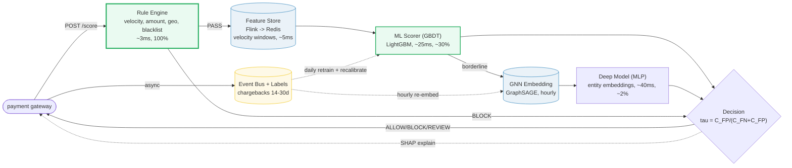
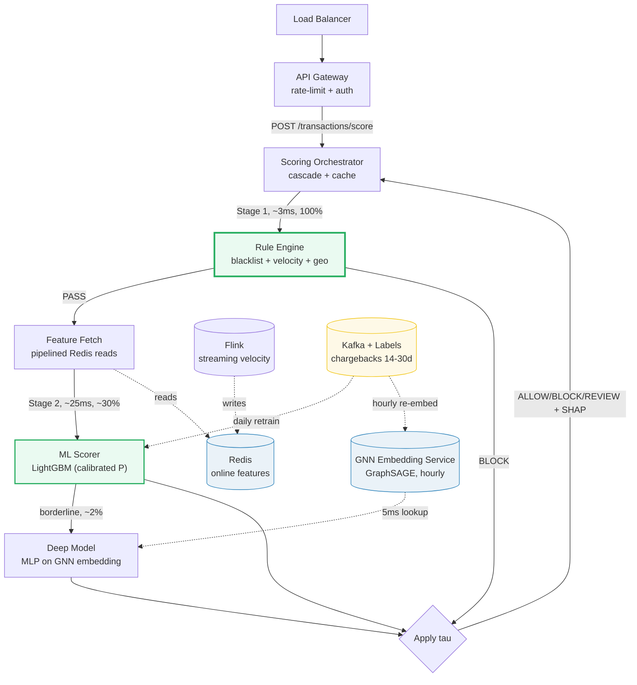

# Design a Fraud Detection System

> **Companion code:** [`fraud_detection.py`](https://github.com/quanhua92/tutorials/blob/main/systemdesign/fraud_detection.py).
> **Live demo:** [`fraud_detection.html`](https://github.com/quanhua92/tutorials/blob/main/systemdesign/fraud_detection.html) — open in a browser.

---

## 0. TL;DR — the one idea

> **The analogy:** fraud detection is a **multi-stage cascade** that applies the
> *cheapest possible judgment first* and escalates to expensive models only on the
> few transactions that survive. *Block the obvious deterministically, score the
> ambiguous statistically, and only pay for a deep model on the ~2% that are
> genuinely borderline.* You cannot run a 40ms neural network on all 5K
> transactions/second — so every real system narrows
> `100% → rules → ~30% → ML → ~2% → deep`, each stage a costlier judgment on fewer
> candidates, all inside a 100ms budget.

Two ideas make the rest fall into place:

- **Rules + ML, not one or the other.** Rules catch *known* fraud patterns
  deterministically (blacklists, velocity limits, impossible travel) in ~3ms and
  short-circuit the ML scorer entirely. ML catches *evolving* patterns the rules
  don't encode. Production systems run both in a cascade.
- **The threshold is a cost decision, not an accuracy decision.** Never use
  `0.5`. Fraud has asymmetric costs — a missed fraud (C_FN ≈ $535) costs ~5× a
  wrongful block (C_FP ≈ $100). The cost-optimal threshold is
  `τ = C_FP / (C_FN + C_FP) ≈ 0.1575`: block anything with P(fraud) > 15.7%.

---

## 1. Requirements

### Functional
- **Score every transaction** for fraud probability in real time and emit `ALLOW` / `BLOCK` / `REVIEW`.
- **Block, allow, or review** based on a configurable, cost-based threshold.
- **Explain** every decline (SHAP) — a regulatory requirement (PCI-DSS, consumer protection).
- **Learn continuously** from confirmed fraud labels (chargebacks, analyst reviews, rule triggers).
- **Detect coordinated fraud rings** via entity-relationship graphs (shared device/IP/card).

### Non-Functional
- **End-to-end latency** p99 < 100ms (some networks require 50ms).
- **Scale** 1K–5K TPS typical e-commerce; up to 24K TPS at Visa scale.
- **Handle extreme class imbalance** (~0.1% base fraud rate, 1 in 1000).
- **Resist adversarial drift** — fraudsters actively evade the model.
- **Auditability** — every decision reproducible with its features, model version, and explanation.

---

## 2. Scale Estimation

> From `fraud_detection.py` **Section 7** (1K avg TPS, 5K peak, 500 B/tx, 10M accounts):

| Metric | Value |
|---|---|
| Avg TPS | 1,000 /s |
| Peak TPS | 5,000 /s (Visa scale ~24K) |
| Transactions / day (1K × 86,400) | 86,400,000 |
| Base fraud rate | 0.1% (1 in 1000) |
| Fraud / day | 86,400 |

> From `fraud_detection.py` **Section 7** — storage:

| Storage metric | Value |
|---|---|
| **Transaction log / year (~500 B/row)** | **15.768 TB** (archive to S3 Parquet) |
| **Feature store (Redis)** | **4.00 GB** (10M accounts × 50 feats × 8 B) |

> From `fraud_detection.py` **Section 5** — the latency budget (p99 < 100ms):

| Stage | Latency | Traffic | Avg contribution |
|---|---|---|---|
| Rules engine | 3 ms | 100% | 3.0 ms |
| ML scorer (GBDT) | 25 ms | 30% | 7.5 ms |
| Deep model (borderline) | 40 ms | 2% | 0.8 ms |
| **Avg latency / tx** | | | **11.3 ms** |
| **p99 (all stages)** | | | **68.0 ms** (32ms slack) |

---

## 3. Architecture

### Key Components

| Component | Technology | Why |
|---|---|---|
| **Rule Engine** | **in-memory hash tables / Bloom filters** | **Stage 1.** Blacklists, velocity limits, amount caps, impossible-travel (geo-velocity). Catches *known* fraud deterministically in ~3ms and short-circuits the ML cascade. |
| Feature Store | Redis (online) + Flink (streaming) | Velocity counters (`tx_count_1h`, `amount_sum_1h`) maintained by a Flink job into Redis. Same registry for train + serve → no skew. |
| **ML Scorer** | **LightGBM (GBDT)** | **Stage 2.** Primary scorer on tabular + velocity features, ~25ms on CPU. Beats deep learning: faster, naturally calibrated, handles NaN, fast SHAP for regulators. |
| GNN Embedding Service | GraphSAGE, hourly batch | Entity graph (cards, devices, IPs, accounts, merchants) → embeddings pre-computed hourly, stored in Redis for ~5ms lookup. Catches fraud rings invisible per-tx. |
| Deep Model | shallow MLP on CPU | Stage 3, only for borderline scores. ~2% of traffic → CPU is 30× cheaper than GPU and fast enough. |
| Decision + Explain | threshold τ + SHAP | Applies τ = C_FP/(C_FN+C_FP), emits decision + SHAP explanation per decline (regulatory). |
| Event + Labels | Kafka | Transactions + delayed labels (chargebacks 14–30d, analyst reviews, rule triggers). Never evaluate on the last 30 days. |
| Training Pipeline | daily retrain + Platt recalibration | Batch. Daily GBDT + GNN retrain with `scale_pos_weight` for the 0.1% base rate; champion/challenger canary on precision degradation. |

---

## 4. Key Design Decisions

### 4.1 Cascade vs single model

> From `fraud_detection.py` **Section 5** (3-stage cascade):

| Decision | Option A | Option B | Winner | Why |
|---|---|---|---|---|
| **Scoring path** | **Multi-stage cascade** | Single GBDT/DNN on every tx | **Cascade** | A single 40ms deep model on all 5K tx/s blows the budget (~200ms) and wastes GPU on obvious cases. Cascade: rules filter 100%→ in 3ms, GBDT scores ~30% in 25ms, deep model handles ~2% borderline in 40ms. **Avg 11.3ms/tx, p99 68ms** — both under budget. |

### 4.2 Rules + ML vs ML-only

> From `fraud_detection.py` **Section 1** (rule engine) + **Section 3** (ML scorer):

| Decision | Option A | Option B | Winner | Why |
|---|---|---|---|---|
| **Detection strategy** | **Rules + ML (cascade)** | ML-only | **Rules + ML** | Rules catch *known* patterns deterministically (impossible travel → **BLOCK** in 3ms, no model needed) and provide an auditable, editable fast path. ML catches *evolving* patterns. Rules also supply immediate (if noisy) labels. Demo: the teleport tx ($1200, 2785 km/h) is **BLOCK** by the geo rule before ML runs; the coffee tx ($45) **PASS**es to ML. |

- **Rule thresholds** (from the simulation): `amount > 4000`, `velocity_1h > 6`,
  `velocity_amt_1h > 15000`, `geo > 900 km/h` (impossible travel), `new device + amount ≥ 1500 → REVIEW`.

### 4.3 Primary scorer: GBDT vs deep learning

| Decision | Option A | Option B | Winner | Why |
|---|---|---|---|---|
| **Primary scorer** | **LightGBM (GBDT)** | Deep neural net | **GBDT** | For tabular + velocity features GBDTs win: ~10ms vs ~30ms inference, naturally well-calibrated probabilities (critical for the cost threshold), native NaN handling, fast reliable SHAP, trains on 100M rows in <30min. Deep nets take over only for entity embeddings (Stage 3). |

### 4.4 Decision threshold: cost-based vs 0.5

> From `fraud_detection.py` **Section 4** (optimal threshold):

| Decision | Option A | Option B | Winner | Why |
|---|---|---|---|---|
| **Threshold** | **Cost-based τ** | 0.5 (accuracy-optimal) | **Cost-based τ** | `0.5` assumes equal costs and balanced classes — both false in fraud. With C_FN = $535, C_FP = $100: **τ = 100 / (535 + 100) = 0.1575** → block if P(fraud) > 15.7%. Requires calibrated probabilities (Platt/isotonic). On the train set, τ-cost ≤ 0.5-cost. |

### 4.5 Graph features: GraphSAGE vs transaction-only

> From `fraud_detection.py` **Section 6** (account connectivity):

| Decision | Option A | Option B | Winner | Why |
|---|---|---|---|---|
| **Fraud rings** | **GNN (GraphSAGE) 2-hop aggregation** | Transaction-level features only | **GNN** | A new card looks clean in isolation, but 2-hop links to confirmed-fraud accounts reveal a ring. Demo: account **A1** (risk 0.10, clean alone) shares a device/card with **A2, A3, A6** (1-hop), which link to confirmed-fraud **A4, A5** (2-hop). **2 fraud accounts within 2 hops** → strong ring signal. A1's 1-hop mean risk = 0.30, 2-hop mean = 0.6333. |

### 4.6 Label delay handling

| Decision | Option A | Option B | Winner | Why |
|---|---|---|---|---|
| **Labels** | **Hard eval cutoff + 3 label sources** | Train on all recent data | **Cutoff** | Chargebacks arrive 14–30 days late → labels for the last 30 days are incomplete. Never evaluate on them. Three label sources with different latency/confidence: chargebacks (14–30d, high confidence), analyst reviews (same-day, expensive), rule triggers (immediate, noisy). Dollar-weight training: a $50K wire fraud matters 4000× a $12 coffee. |

---

## 5. Data Model

### Transactions (the scored entity)

| Column | Type | Notes |
|---|---|---|
| `transaction_id` | STRING | PK, unique per payment attempt. |
| `user_id` | STRING | Account making the transaction. |
| `amount` | DECIMAL | Transaction amount. |
| `merchant_id` | STRING | Merchant + category code. |
| `fraud_score` | FLOAT | Model output P(fraud). |
| `decision` | ENUM | `ALLOW`, `BLOCK`, `REVIEW`. |
| `model_version` | STRING | For reproducibility / rollback. |
| `features_snapshot` | JSON | The exact feature vector scored (audit). |
| `label` | ENUM | `CONFIRMED_FRAUD`, `CONFIRMED_LEGIT`, `UNLABELED`. |
| `label_source` | ENUM | `CHARGEBACK`, `ANALYST`, `RULE_TRIGGER`. |
| `label_updated_at` | TIMESTAMP | When label last changed (14–30d after tx). |

### Velocity features (Redis, hot)

| Key | TTL | Notes |
|---|---|---|
| `vel:{user_id}:count_1h` | 1h | Sliding-window tx count. |
| `vel:{user_id}:amount_1h` | 1h | Sliding-window amount sum. |
| `beh:{user_id}:avg_30d` | 24h | Behavioral baseline, recomputed nightly. |

---

## 6. API Endpoints

| Method | Path | Description |
|---|---|---|
| POST | `/api/transactions/score` | Score a transaction for fraud (real-time, latency-critical, <100ms). |
| GET | `/api/transactions/{id}/explain` | SHAP explanation for a decline (async, low QPS). |
| POST | `/api/rules` | Create/update a fraud rule (admin, low QPS). |
| GET | `/api/models/performance` | Current model metrics: PR-AUC, recall, dollar-weighted recall, calibration. |
| POST | `/api/labels` | Submit confirmed fraud label (chargeback or analyst review). |

---

### Killer Gotchas
- **Never use threshold 0.5.** Use the cost-based τ = C_FP/(C_FN+C_FP) ≈ 0.157, and only on *calibrated* probabilities. Recalibrate monthly (Platt/isotonic).
- **Suppression bias.** The model's own blocks suppress ground-truth labels for those txs, compounding selection bias over time. Mitigate with an exploration budget: approve ~0.1% of borderline declines with monitoring to generate counterfactual labels.
- **Label delay.** Never evaluate on transactions from the last 30 days — chargebacks haven't arrived yet. Enforce a hard eval cutoff.
- **Class imbalance distorts ROC-AUC.** At 0.1% base rate ROC-AUC looks great while PR-AUC is poor. Track **PR-AUC** and **dollar-weighted recall** instead.
- **Training-serving skew.** Velocity features must be computed identically at train and serve — share one feature registry (Flink→Redis), shadow-deploy new models first.
- **Geo-velocity is a killer feature but needs real distance.** NYC→London in 2h needs 2785 km/h — physically impossible. One of the highest single-feature signals, but compute great-circle distance, not coordinate deltas.
