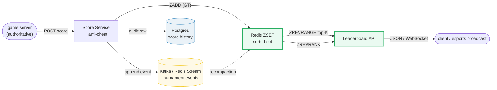
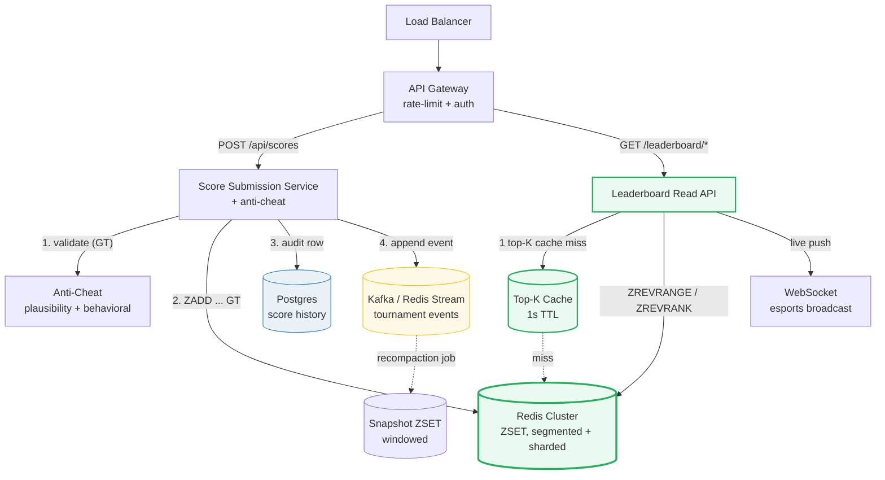

# Design a Gaming Leaderboard

> **Companion code:** [`gaming_leaderboard.py`](https://github.com/quanhua92/tutorials/blob/main/systemdesign/gaming_leaderboard.py).
> **Live demo:** [`gaming_leaderboard.html`](https://github.com/quanhua92/tutorials/blob/main/systemdesign/gaming_leaderboard.html) — open in a browser.

---

## 0. TL;DR — the one idea

> **The analogy:** a leaderboard is a **sorted set keyed by score** — every
> player is a member, their score is the sort key, and "who's winning?" is just
> "read the top of the sorted set." Redis' **ZSET** is *purpose-built* for this:
> a skip list (sorted by score, O(log N) ops) married to a hash table (member →
> score, O(1) lookup). Rank, top-K, and percentile all collapse to one data
> structure.

The whole system reduces to **one write** (`ZADD` a score) and **three reads**
(`ZREVRANGE` top-K, `ZREVRANK` my-rank, `ZREVRANGE rank-5 rank+5` around-me).
Every other concern — segmentation by region/mode/season, tier buckets, the GT
modifier, tournament sliding windows, anti-cheat — hangs off those four ops.



---

## 1. Requirements

### Functional
- **Submit / update** a player's score (idempotent, server-authoritative).
- **Get top-K** players (top 100) with scores, paginated.
- **Get a player's rank** + score + percentile ("you're top 10%").
- **Get players around a player** (5 above, 5 below — the "neighbors" view).
- **Segmented leaderboards**: per region, game mode, skill tier, season.
- **Tournament leaderboards**: a sliding time window (e.g., last 7 days).

### Non-Functional
- **Submit latency**: p99 < 50 ms.
- **Read latency**: p99 < 20 ms (Redis is sub-ms; budget is the network).
- **Throughput**: 100K–1M score updates/sec at tournament peak.
- **Sub-second update visibility** (live esports broadcasts).
- **Availability** 99.95%; Redis rebuilt from Postgres on cold-start.

---

## 2. Scale Estimation

> From `gaming_leaderboard.py` **Section 6** (10M MAU, 5 games/day, ~100 B / entry):

| Metric | Value |
|---|---|
| Monthly active players | 10,000,000 |
| Score updates / day (10M × 5) | 50,000,000 |
| Leaderboard views / day | 100,000,000 |
| **Daily read : write ratio** | **2 : 1** |
| Avg write QPS | 578.7 /s |
| Avg read QPS | 1,157.4 /s |
| Peak write QPS (tournament weekend) | 100,000 /s (~173× avg) |
| Peak read QPS (live finals, top-K polling) | 100,000 /s |

> From `gaming_leaderboard.py` **Section 6** — Redis ZSET RAM (~100 B / entry):

| Memory metric | Value |
|---|---|
| **10M-player leaderboard** | **1.00 GB** (single-node ceiling ~ here) |
| Per regional shard (100K players) | 10.00 MB |
| Shards for 10M players | 100 |

> From `gaming_leaderboard.py` **Section 6** — Postgres score-history (~100 B / event row):

| Storage metric | Value |
|---|---|
| Events / year | 18,250,000,000 (**18.25 B**) |
| Storage / year | 1.82 TB (archive old seasons to S3 Parquet) |

---

## 3. Architecture



### Key Components

| Component | Technology | Why |
|---|---|---|
| Game Server | authoritative | Computes the score server-side; the client **never** submits directly — this is the foundational anti-cheat layer. |
| Score Submission Service | stateless Go/Java pods | Validates plausibility, runs `ZADD ... GT`, appends to the event stream, writes the Postgres audit row. Horizontally scalable. |
| **Redis Cluster (ZSET)** | **skip list + hash table** | The core primitive. O(log N) insert/rank, O(log N + K) top-K. Segmented by region/mode/season; hash-sharded within a segment. |
| Leaderboard Read API | stateless pods | Resolves top-K / rank / around-me; reads the 1s top-K cache first, then ZSET. Pushes live updates over WebSocket. |
| Top-K Cache | Redis / in-memory | Cached top-100 with 1s TTL absorbs the massive read skew during finals (XFetch early refresh prevents stampede). |
| Kafka / Redis Stream | event log | Stores individual game results for **tournament sliding windows**; a recompaction job sums the window into a snapshot ZSET. |
| Postgres | persistent store | Authoritative score history + audit trail. Source of truth Redis is rebuilt from on cold-start. |
| S3 Parquet | cold archive | Archived seasons; analytics queries run there. |

---

## 4. Key Design Decisions

### 4.1 Redis ZSET vs a database `ORDER BY`

> From `gaming_leaderboard.py` **Section 1** (SortedSet = skip list + hash table):

| Decision | Option A | Option B | Winner | Why |
|---|---|---|---|---|
| **Ranking store** | **Redis ZSET** | Postgres `ORDER BY score DESC` | **Redis ZSET** | A B-tree `ORDER BY` rescans and re-sorts on every query → O(N log N) per read, unacceptable at 100K reads/sec. ZSET is a *dual structure* (skip list + hash table) purpose-built for rank/top-K: `ZADD` O(log N), `ZREVRANGE` O(log N + K), `ZREVRANK` O(log N), all sub-ms. Postgres stays as the audit/source-of-truth behind it. |

- **Worked demo** (from the simulation): `ZADD` five players with two ties →
  `ZREVRANGE 0 2` returns `carol, alice, eve` (ties broken by member ascending,
  reversed on descending read — exactly Redis' rule).
- `ZREVRANK alice = 1`, `ZREVRANK dave = 4` — both O(log N).

### 4.2 Sharding: segmented leaderboards vs one global ZSET

> From `gaming_leaderboard.py` **Section 3** (100 shards × 100K players):

| Decision | Option A | Option B | Winner | Why |
|---|---|---|---|---|
| **Sharding** | **Segmented** — one ZSET per region/mode/season | One global ZSET | **Segmented** | A single global ZSET breaks at ~100M+ players (10 GB+ RAM on one node, single-threaded writes, slow failover). Segmentation wins because **almost every query is within one segment** ("top-100 in NA solo"). For a very large segment, hash-shard it across N nodes; a global top-K then queries each shard for its top-K and merges: **O(N·log K)**. |

- Segment key: `leaderboard:{region}:{mode}:{season}` e.g. `leaderboard:na:solo:2024Q4`.
- **Cross-shard top-K merge**: each shard returns its top-K; feed all N·K entries
  through a size-K min-heap → O(N·K·log K). Demo (8 shards × K=100): global #1 is
  shard-0 player-0 (score 100000).
- **Hierarchical global top-1000**: a separate ZSET recomputed from segments
  removes the per-query merge for the hot top-K (cached, 1s TTL). Below rank 1000
  you fall back to the segment query.

### 4.3 Real-time vs periodic refresh

| Decision | Option A | Option B | Winner | Why |
|---|---|---|---|---|
| **Top-K freshness** | **1s TTL cache + stale-while-revalidate + WebSocket for esports** | Always read ZSET directly | **Cached top-K + live push** | At 100K reads/sec during finals, hitting the ZSET for every top-K view wastes the read skew. A 1s-TTL cache absorbs it; XFetch probabilistic early refresh prevents stampede. For live broadcasts, push deltas over WebSocket so the on-screen leaderboard is instant. |

### 4.4 Score model: monotone-best (GT) vs last-write-wins

> From `gaming_leaderboard.py` **Section 5** (GT modifier):

| Decision | Option A | Option B | Winner | Why |
|---|---|---|---|---|
| **Update semantics** | **`ZADD ... GT`** (only update if score increases) | Last-write-wins | **GT** | A buggy submitter or a replay attack sending `0` must **never** lower a real score. `GT` (Redis 6.2+) enforces monotone-best atomically, no read-modify-write. Demo: `alice=9500`, `ZADD GT 8000` → rejected (still 9500); `ZADD GT 9800` → accepted. For *tournament totals* (lower-is-better lap times, or sum-of-points), use a separate windowed ZSET instead. |

### 4.5 Tournament / sliding-window leaderboards

> From `gaming_leaderboard.py` **Section 5** (windowed recompaction):

| Decision | Option A | Option B | Winner | Why |
|---|---|---|---|---|
| **Windowed rank** | **Event stream + periodic recompaction into a snapshot ZSET** | TTL-expire individual scores | **Recompaction** | A TTL on ZSET members can't sum points or slide a window. Store per-game events in Kafka/Redis Stream; a recompaction job sums events inside the window into a snapshot ZSET. Hybrid: incremental update on new event + periodic recompaction to fix drift. |

- Cadence vs window: **1h window → 1min**, **1d window → 10min**, **7d window → nightly**.
- Demo (window days 1..7): alice's day-9 score is **excluded**; dave (day 2) is
  in. Windowed top is dave 3000, carol 2900, alice 2300, bob 1700.

### 4.6 Tier buckets (platinum / gold / silver / bronze)

> From `gaming_leaderboard.py` **Section 4** (10K-player deterministic sim):

| Decision | Option A | Option B | Winner | Why |
|---|---|---|---|---|
| **Tier ranking** | **Tiered ZSETs** — a player competes only within their tier | One flat global ZSET | **Tiered** | Casual players never see the pros 10M points ahead and quit. Tier buckets are themselves segmented ZSETs (`leaderboard:na:solo:gold`), so bronze #1 and platinum #1 are both "first place." Promotions run nightly. |

- 10K-player sim distribution: **platinum 10.0%** (997), gold 15.0%, silver
  25.0%, bronze 50.0%.

---

## 5. Data Model

### Redis ZSET (hot path)

| Key | Member | Score | Notes |
|---|---|---|---|
| `leaderboard:{region}:{mode}:{season}` | `player_id` | `score` | Monotone-best; `ZADD ... GT`. |
| `leaderboard:{region}:{mode}:{tier}` | `player_id` | `score` | Tier bucket (platinum/gold/silver/bronze). |
| `leaderboard:global:top1000` | `player_id` | `score` | Hierarchical, recomputed from segments; 1s-TTL cache in front. |
| `leaderboard:tournament:{id}` | `player_id` | `windowed_score` | Recompacted snapshot from the event stream. |

### Postgres `scores` (persistent)

| Column | Type | Notes |
|---|---|---|
| `score_id` | BIGINT | PK, Snowflake ID. |
| `player_id` | BIGINT | FK to `players`. |
| `score` | INT | Submitted score. |
| `game_id` | BIGINT | FK to the game session. |
| `submitted_at` | TIMESTAMP | Submission time. |
| `status` | ENUM | `pending`, `verified`, `rejected`, `quarantined`. |
| `submission_id` | UUID | Idempotency key. |

### Postgres `players`

| Column | Type | Notes |
|---|---|---|
| `id` | BIGINT | PK. |
| `username` | VARCHAR | Display name. |
| `region` | VARCHAR | `na` / `eu` / `apac` … |
| `skill_tier` | ENUM | Platinum / gold / silver / bronze; updated nightly. |

---

## 6. API Endpoints

| Method | Path | Response | Notes |
|---|---|---|---|
| `POST` | `/api/scores` | `{submission_id, status}` | Server-authoritative; anti-cheat; `ZADD ... GT`; idempotent via `submission_id`. |
| `GET` | `/api/leaderboard/top?k=100&segment=na:solo` | `[{player_id, score, rank}]` | 1s-TTL cache first; paginated by `ZREVRANGE offset offset+k-1`. |
| `GET` | `/api/leaderboard/rank/{player_id}` | `{rank, score, percentile}` | `ZREVRANK`; percentile = `(rank+1)/total*100`. |
| `GET` | `/api/leaderboard/around/{player_id}?neighbors=5` | `[{player_id, score, rank}]` | `ZREVRANGE rank-5 rank+5`, O(log N + K). |
| `GET` | `/api/leaderboard/tournament/{id}?window=7d` | `[{player_id, score}]` | Reads the recompacted snapshot ZSET. |
| `WS` | `/stream/leaderboard/{segment}` | live deltas | Push top-K changes to esports broadcasts. |

---

## 7. Deep dives

- **Cross-shard top-K merge** — each shard returns its top-K; stream all N·K
  entries through a size-K min-heap → O(N·K·log K). A hierarchical global
  top-1000 ZSET (recomputed from segments) removes the merge for the hot path.
- **Around-me (`ZREVRANGE rank-5 rank+5`)** — one skip-list seek + 10 steps,
  O(log N + K). Cheap even at 10M players.
- **Percentile** — `ZREVRANK` is 0-indexed; `top_percent = (rank+1)/total*100`
  (lower = better; #1 → ~0%). For a 5-player set: dave (rank 4) → top 100%.
- **Write amplification** — one score update fans out to N leaderboards (global,
  regional, tier, friend, seasonal). Use Redis pipelining + batched per-key
  updates so a single submit = one round-trip.
- **Top-K cache stampede** — 1s TTL with XFetch probabilistic early refresh +
  stale-while-revalidate; the ZSET is the fallback, never the thundering-herd
  target.

---

### Killer Gotchas

- **Ties are broken by member, not insertion order.** Equal scores are ordered
  by member ascending in the natural order and **descending** under `ZREVRANGE`.
  Demo: carol ranks above alice at score 9500. If you store numeric `player_id`
  strings, lexicographic order (`"10" < "2"`) surprises you — zero-pad or sort
  by a secondary field explicitly.
- **Last-write-wins is a foot-gun.** A regression/replay submitting `0` will
  clobber a real high score. Always use `ZADD ... GT` (monotone-best) for
  higher-is-better leaderboards; reserve a windowed ZSET for sum-of-points.
- **A single global ZSET doesn't scale.** ~100 B/entry × 100M players ≈ 10 GB on
  one node, single-threaded writes, slow failover. Segment by region/mode/season
  first; hash-shard only the segments that are still too big.
- **Tournament windows need recompaction, not TTL.** TTL on ZSET members can't
  *sum* points or *slide* a window. Use an event stream + a periodic recompaction
  job into a snapshot ZSET (hybrid: incremental + periodic to fix drift).
- **Client-submitted scores are an open cheat vector.** The game server must be
  authoritative — clients only report results for the server to *compute* the
  score. Add plausibility checks (max score / min, kill-ratio bounds) + behavioral
  ML (input cadence, aim accuracy) + quarantine-and-review for top-N.
- **Read skew during finals is brutal.** Millions polling top-K simultaneously.
  A 1s-TTL cache with XFetch early refresh + WebSocket push is mandatory;
  reading the ZSET directly for every view falls over.
- **Cheater at #1 poisons the broadcast.** Quarantine-and-review for top-N
  (don't publish suspicious scores immediately); `ZREM` on confirmation, cascade
  by shared IP/device fingerprint.

---

### Reproduce

```bash
python3 gaming_leaderboard.py          # prints all sections + [check] OK
```

> From `gaming_leaderboard.py` **Section 7 — GOLD CHECK** (values pinned for `gaming_leaderboard.html`):

```
demo_n_players         = 5
demo_top3_members      = carol,alice,eve
demo_top3_scores       = 9500,9500,8700
demo_alice_revrank     = 1
demo_dave_top_pct      = 100.0
tier_sim_n             = 10000
tier_platinum_count    = 997
tier_platinum_pct      = 10.0
players_total          = 10000000
write_qps_avg          = 578.7
read_qps_avg           = 1157.4
read_qps_peak          = 100000
ram_per_lb_gb          = 1.0
events_per_year_b      = 18.25
n_shards               = 100
```

`[check] GOLD reproduces from SortedSet + tier/scale formulas? OK` — the gold
badge `check: OK` at the bottom of
[`gaming_leaderboard.html`](https://github.com/quanhua92/tutorials/blob/main/systemdesign/gaming_leaderboard.html)
re-implements the **sorted set (skip list + hash table)**, the **Knuth-hash tier
sim**, and the scale formulas in **pure JavaScript**, and confirms they match the
`.py` exactly (top-3 with the lexicographic tie-break, alice reverse rank 1,
platinum 997 / 10.0%, QPS, RAM).
