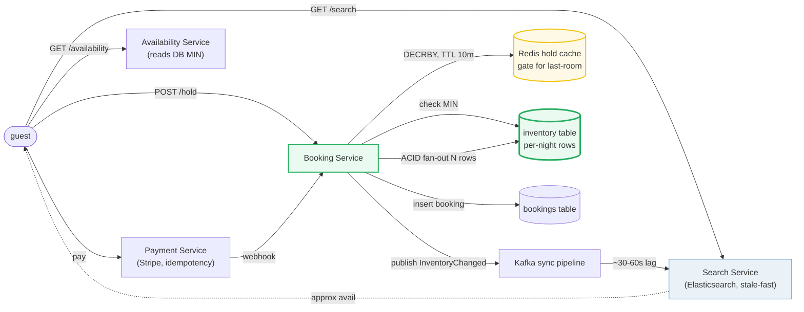
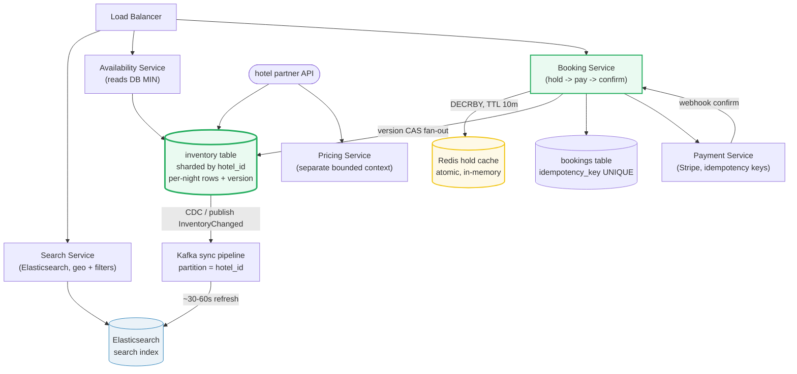

# Design a Hotel Booking System

> **Companion code:** [`hotel_booking.py`](https://github.com/quanhua92/tutorials/blob/main/systemdesign/hotel_booking.py).
> **Live demo:** [`hotel_booking.html`](https://github.com/quanhua92/tutorials/blob/main/systemdesign/hotel_booking.html) — open in a browser.

---

## 0. TL;DR — the one idea

> **The analogy:** hotel inventory is a **grid of per-night rows** — one cell per
> `(hotel_id, room_type_id, date)`. Availability for a stay is just `MIN(available_rooms)`
> across the nights, an O(nights) lookup that never grows with booking history. The hard part
> is **concurrency on the last room**: 10K users all want the final night, so a **Redis
> `DECRBY` gate** resolves the thundering herd in memory and only the single winner touches the
> database's ACID fan-out.

The whole system reduces to one hard problem: **sell date-range inventory atomically under a
thundering herd, never oversell, and tolerate a ~10-minute checkout window without holding
database locks.** Everything else (search, overbooking, dynamic pricing, fan-out atomicity)
hangs off the per-night inventory row + Redis hold decision.



---

## 1. Requirements

### Functional
- **Search** hotels by location, date range, guest count, amenities, and price range (reads
  Elasticsearch; stale-but-fast).
- **Check real-time availability** for a date range — exact, no false positives (reads the
  relational `inventory` table's `MIN(available_rooms)`).
- **Temporary hold** on rooms during payment (Redis TTL, ~10 min).
- **Confirm booking** after successful payment with idempotent writes and an audit trail.
- **Cancel** bookings and process refunds per policy; restore inventory.
- **Hotel partner API** to manage room counts, pricing, and availability blocks.
- **Dynamic pricing** adjusting rates by forward occupancy / demand (separate bounded context).

### Non-Functional
- **Latency:** search `p99 < 300 ms`; booking `p99 < 2 s` end-to-end.
- **Availability:** search 99.9 % (stale data tolerable); booking path 99.99 % (no lost
  reservations).
- **Zero oversell:** never exceed `max_bookable_rooms` on any date.
- **Scale:** 28M listings, ~1.5M room-nights/day avg, ~10× peak on holidays, 50–100× on hot
  shards.
- **Durability:** confirmed bookings replicated across 3 AZs.

---

## 2. Scale Estimation

> From `hotel_booking.py` **Section 8** (28M listings, 3 room-types/listing, 1.5M room-nights/day,
> 3-night avg stay, 365-day window, 100 B/row):

| Metric | Value |
|---|---|
| Total listings | 28,000,000 |
| (room_type, date) pairs / day | 84,000,000 |
| **Inventory rows (365-day window)** | **30,660,000,000** |
| Storage raw | 3.07 TB |
| Storage w/ 3 replicas + indexes (~8×) | 24.53 TB |
| Room-nights / sec (avg) | 17.4 /s |
| Row updates / sec (avg, ×3 nights) | 52.1 /s |
| Bookings / day | 500,000 |
| Search QPS avg / peak | 520 / 5,000 |
| Inventory read : write ratio | 1000 : 1 |
| Sync pipeline partitions (by hotel_id) | ~500 (one per ~56K hotels) |

> The headline insight: the **read:write ratio of ~1000:1** justifies splitting the data model —
> Elasticsearch for high-QPS search (stale tolerated), relational DB for the exact booking path.
> A single hot hotel on a peak night can draw 10K concurrent bookers on one room — exactly where
> naive locking collapses and the Redis gate wins.

---

## 3. Architecture



### Key Components

| Component | Technology | Why |
|---|---|---|
| Search Service | Elasticsearch | Optimized for geo-queries, amenity/price filters, full-text. Refresh ~1 s; cannot participate in ACID transactions. Serves stale-but-fast results. |
| Availability Service | stateless + relational DB | Reads authoritative `MIN(available_rooms)` across nights. O(nights), always small. The exact check before payment. |
| Booking Service | stateless workers | Orchestrates hold → payment → confirm → release with ACID guarantees. Enforces idempotency on both hold and confirm keys. |
| Inventory Service / table | PostgreSQL, sharded by `hotel_id` | One row per `(hotel_id, room_type_id, date)` with `available_rooms`, `max_bookable`, `version`. Authoritative source of truth; transactional fan-out decrements. |
| Pricing Service | separate bounded context | Date / channel / demand-based pricing. Same room has different prices per OTA; never embedded in inventory rows. |
| Payment Service | Stripe integration | Idempotency keys + webhook confirmation. Orphaned PaymentIntents detected by a compensation job and refunded. |
| Hold Cache | Redis | Temporary room holds with TTL (~10 min). Atomic `DECRBY` for thundering-herd prevention; only winners reach the DB. |
| Sync Pipeline | Kafka → ES | Eventual-consistency bridge. Partition key = `hotel_id`; ~30–60 s lag accepted (false positives tolerated; false negatives are revenue loss). |

---

## 4. Key Design Decisions

### 4.1 Inventory data model (the central decision)

> From `hotel_booking.py` **Section 1** — availability for nights 5..8 is `MIN(available_rooms)`
> over **3 per-night rows**, constant regardless of how many bookings accumulated. A
> booking-overlap scan would read 10,000+ rows for the same query and degrade forever.

| Decision | Option A | Option B | Winner | Why |
|---|---|---|---|---|
| **Inventory model** | Booking-overlap scan (count overlapping bookings) | **Per-night rows** (`(hotel, room_type, date)` → `available_rooms`) | **B (per-night)** | Overlap scans grow with booking history — a 5-year-old property's availability check reads millions of rows. Per-night rows make availability a constant O(nights) `MIN` query. The tradeoff: a booking becomes a **fan-out write** (N nights = N row updates), but those updates are gated by Redis so only winners hit the DB. |

### 4.2 Reservation / locking strategy (the concurrency decision)

> From `hotel_booking.py` **Section 4** — 10,000 users hit the last room on the same night.
> **Pessimistic** `SELECT FOR UPDATE` serializes 10,000 × 10 s = **100,000 s** and exhausts the
> connection pool. **Optimistic CAS** generates 1 winner + 29,997 retry ops. **Redis `DECRBY`**
> resolves all 10,000 in memory; **1 winner** reaches the DB.

| Decision | Option A | Option B | Option C | Winner | Why |
|---|---|---|---|---|---|
| **Locking** | Pessimistic (`SELECT FOR UPDATE`) | Optimistic CAS (version retry) | **Redis `DECRBY` + DB CAS** | **C (Redis gate)** | The checkout window (~10 s) is far too long for row locks — pessimistic convoys and exhausts pools. Optimistic CAS works but every loser retries (retry storm, ~40K DB ops). Redis gates the DB: 10K atomic in-memory `DECRBY` ops resolve in <100 ms; the single winner does the ACID fan-out. This is the Booking.com-scale pattern. |

### 4.3 Search vs booking data model split

> From `hotel_booking.py` **Section 2** — search returns approximate results (stale tolerated);
> the binding-constraint night (H1/KING night 6 dropped to 12) shows the authoritative `MIN` is
> always recomputed from the DB before payment.

| Decision | Option A | Option B | Winner | Why |
|---|---|---|---|---|
| **Search vs booking** | One store for both | **Elasticsearch (search) + relational DB (booking)** | **Split** | With a 1000:1 read:write ratio, forcing geo/faceted search and ACID fan-out through one store compromises both. ES gives sub-300 ms search; the DB gives exact inventory. **False positives in search are tolerated; false negatives are revenue loss** — so the final availability check always reads the DB `MIN`. A Kafka CDC pipeline bridges the two (~30–60 s lag). |

### 4.4 Overbooking buffer

> From `hotel_booking.py` **Section 5** — `max_bookable = total + floor(total × pct)`, capped at
> 10 % platform-wide. 200 rooms @ 5 % → **210**; 200 @ 15 % requested → capped to **220**. The
> no-show z-score alerts at 110 % over (z = −3.7) but not at 105 % (z = −1.1).

| Decision | Option A | Option B | Winner | Why |
|---|---|---|---|---|
| **Overbooking** | Never oversell (hard cap = physical rooms) | **Configurable buffer per property, platform-capped** | **B (buffer)** | Hotels legally oversell based on historical no-show rates (2–5 % leisure). Storing `total_rooms`, `available_rooms`, and `max_bookable` separately lets each property tune its buffer while the platform enforces a max (e.g., 10 %). A binomial z-score on expected shows trips a walk-risk alert before capacity is breached. |

### 4.5 Fan-out write atomicity

> From `hotel_booking.py` **Section 6** — a 3-night booking must update exactly 3 rows; if night 7
> is oversold mid-fan-out (2/3 touched), the touched rows roll back — **no half-booked state**.

| Decision | Option A | Option B | Winner | Why |
|---|---|---|---|---|
| **Fan-out atomicity** | Best-effort per-night updates | **Atomic N-row transaction + `rowsAffected == nights` check + rollback** | **B (atomic)** | A partial booking (some nights decremented, others not) is worse than no booking — the guest gets a confirmation for a stay that doesn't exist. The fan-out runs in one transaction; `rowsAffected != nights_count` triggers rollback and retry. Shard inventory by `hotel_id` so all date rows for one booking live on one shard. |

### 4.6 Dynamic pricing

> From `hotel_booking.py` **Section 7** — `price = base × (1 + surge)` with occupancy tiers.
> $200 base at 80 % → **$250**, at 95 % → **$360**, at 40 % → **$200**.

| Decision | Option A | Option B | Winner | Why |
|---|---|---|---|---|
| **Pricing** | Single static rate per room | **Occupancy-tier surge, separate service** | **B (dynamic)** | Static rates leave revenue on the table during peak demand. Surge tiers keyed on forward occupancy capture willingness-to-pay. Pricing is a **separate bounded context** — the same room has different prices per OTA channel, so embedding price in inventory rows couples two independent change rates. |

---

## 5. Data Model

### `inventory` (PostgreSQL — sharded by `hotel_id`) — **source of truth**

| Column | Type | Notes |
|---|---|---|
| `hotel_id` | UUID | **Shard key + PK part.** All date rows for a hotel colocated. |
| `room_type_id` | UUID | **PK part.** FK → room_types. |
| `date` | DATE | **PK part.** One row per night. |
| `available_rooms` | INT | Current bookable count. Availability = `MIN` across nights. |
| `max_bookable` | INT | `total_rooms + floor(total_rooms × overbooking_pct)`, platform-capped. |
| `version` | BIGINT | Optimistic-locking counter for CAS fan-out. |

> Composite PK `(hotel_id, room_type_id, date)`. Shard by `hotel_id` so an N-night booking
> touches rows on a single shard — the fan-out is a one-shard ACID transaction.

### `bookings`

| Column | Type | Notes |
|---|---|---|
| `booking_id` | UUID | **PK.** |
| `hotel_id` / `room_type_id` / `user_id` | UUID | Foreign keys. |
| `check_in` / `check_out` | DATE | `check_out` is **exclusive** (nights = check_out − check_in). |
| `status` | TEXT | HELD / CONFIRMED / CANCELLED. |
| `idempotency_key` | TEXT | **UNIQUE.** Prevents double-booking on webhook retry. |
| `payment_ref` | TEXT | Stripe PaymentIntent ID. |

### `room_types`

| Column | Type | Notes |
|---|---|---|
| `room_type_id` | UUID | **PK.** |
| `hotel_id` | UUID | FK → hotels. |
| `name` | TEXT | "King Deluxe", "Double Standard". |
| `total_rooms` | INT | Physical room count. |
| `amenities` | JSONB | `{"wifi": true, "pool": true}`. |

---

## 6. API Endpoints

| Method | Path | Body / Response | Notes |
|---|---|---|---|
| `GET` | `/api/hotels/search?location=&check_in=&check_out=&guests=` | → `[{hotel, room_type, price, approx_avail}]` | High QPS; reads Elasticsearch (stale tolerated). |
| `GET` | `/api/hotels/{id}/availability?check_in=&check_out=` | → `[{room_type, available_rooms}]` | Moderate QPS; reads DB `MIN` (exact). |
| `POST` | `/api/bookings/hold` | `{idem_key, hotel_id, room_type_id, check_in, check_out}` → `{hold_id, expires_at}` | Writes Redis hold (10 min TTL). Atomic `DECRBY`. |
| `POST` | `/api/bookings/{id}/confirm` | `{idem_key, payment_ref}` → `{booking_id, status: CONFIRMED}` | ACID fan-out N rows + insert booking. Idempotent. |
| `POST` | `/api/bookings/{id}/cancel` | → `{status: CANCELLED, refund_amount}` | Restore inventory; refund per policy. |
| `GET` | `/api/bookings/{id}` | → booking details + status | — |

---

## 7. Deep dives

### Inventory data model (`hotel_booking.py` Section 1)
> Per-night rows make availability `MIN(available_rooms)` over the nights — **O(nights)**,
> constant regardless of booking history. A booking-overlap scan reads every overlapping booking
> and degrades forever (10K+ rows for an old property). The tradeoff: a booking becomes a fan-out
> write (N row updates), accepted because the Redis gate means only winners hit the DB.

### Last-room concurrency (`hotel_booking.py` Section 4)
> The three strategies on 10K concurrent bookers for 1 room: **pessimistic** serializes 100,000 s
> and exhausts the pool; **optimistic CAS** generates ~40K DB ops via retry storm; **Redis
> `DECRBY`** resolves all 10K atomically in memory with **1 winner** reaching the DB. The Redis
> gate is what makes peak-season spikes survivable.

### Overbooking + no-show alert (`hotel_booking.py` Section 5)
> `max_bookable = total + floor(total × pct)` with a 10 % platform cap. At 110 % over capacity
> the binomial z-score of expected shows vs physical rooms is −3.7 (ALERT — walk risk); at 105 %
> it's −1.1 (buffer absorbs). Hotels oversell legally against 2–5 % historical no-show rates.

### Fan-out atomicity (`hotel_booking.py` Section 6)
> An N-night booking updates exactly N inventory rows in one transaction. If night 7 is oversold
> mid-fan-out (2/3 touched), the touched rows roll back — **no half-booked state**. The
> `rowsAffected == nights_count` check is the guard.

---

### Killer Gotchas

- **Pessimistic locks never belong on the checkout path.** A ~10 s checkout window × 10K
  concurrent bookers serializes into ~28 hours and exhausts the connection pool. Use the Redis
  `DECRBY` gate; let only winners reach the DB.
- **Optimistic CAS causes retry storms on the last room.** Every loser retries — 10K bookers
  generate ~40K DB ops. Redis resolves the herd in memory so the DB sees one winner.
- **`check_out` is exclusive.** A 3-night stay (check_in=5, check_out=8) decrements nights
> 5, 6, 7. Off-by-one here double-charges or under-charges inventory silently.
- **Partial fan-out is worse than no booking.** Always check `rowsAffected == nights_count` and
  roll back the touched rows. A guest with a confirmation for nights that don't exist is a
  chargeback waiting to happen.
- **Search may lie; the DB never does.** Elasticsearch serves stale approximate availability
  (false positives tolerated). The final availability check before payment always reads the DB
  `MIN` — false negatives are direct revenue loss.
- **Idempotency keys are namespaced per operation.** A hold key dedupes double-clicks; a confirm
  key dedupes webhook retries. Sharing one key across operations short-circuits the confirm.
- **Payment-DB inconsistency needs a compensation job.** If payment succeeds but the DB fan-out
  fails, the webhook retries idempotently; a background job detects orphaned PaymentIntents and
  issues refunds.
- **Pre-check TTL before submitting to the payment gateway.** If the Redis hold TTL < 60 s, fail
  early — a hold expiring mid-payment leaves an orphaned charge.
- **Hot shards concentrate 80 % of holiday traffic on ~50 hotels.** Detect via monitoring, move
  hot properties to dedicated shards, and apply per-hotel application-level rate limiting.

---

### Reproduce

```bash
python3 hotel_booking.py          # prints all sections + [check] OK
```

> From `hotel_booking.py` **Section 9 — GOLD CHECK** (values pinned for `hotel_booking.html`):

```
total_listings                 = 28000000
inventory_rows_365             = 30660000000
inventory_storage_tb           = 3.07
room_nights_per_sec            = 17.4
row_updates_per_sec            = 52.1
bookings_per_day               = 500000
search_qps_peak                = 5000
overbook_200_at_5pct           = 210
overbook_100_at_10pct          = 110
overbook_100_at_5pct           = 105
overbook_z_at_110pct           = -3.7
overbook_z_at_105pct           = -1.1
last_room_users                = 10000
pessimistic_serial_sec         = 100000
optimistic_total_db_ops        = 39997
redis_db_ops                   = 1
fanout_rows_for_3_nights       = 3
dynamic_price_occ_40pct        = 200
dynamic_price_occ_80pct        = 250
dynamic_price_occ_95pct        = 360
```

`[check] GOLD reproduces from scale constants + hotel formulas? OK` — the gold badge
`check: OK` at the bottom of [`hotel_booking.html`](https://github.com/quanhua92/tutorials/blob/main/systemdesign/hotel_booking.html)
recomputes the inventory model, last-room concurrency, overbooking z-scores, fan-out atomicity,
dynamic pricing, and scale math in JavaScript and confirms it matches the `.py` exactly.
