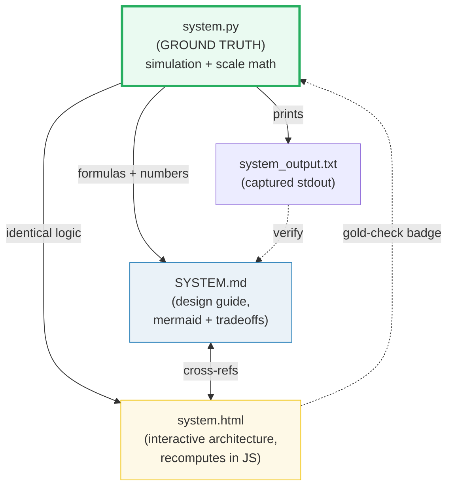
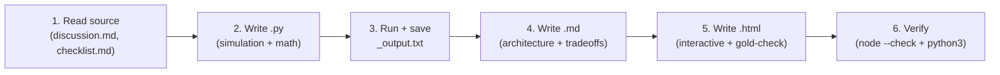

# HOW_TO_RESEARCH — System Design "Concept-as-a-Bundle" Workflow

> Adapted from `interview/HOW_TO_RESEARCH.md`. Same discipline, different domain.

## 0. The one rule

> **Every concept is a bundle of files that cite each other, all deriving from ONE
> ground-truth `.py`. Nothing is ever hand-computed.**

A **concept bundle** = `{name}.py` + `{name}_output.txt` + `{NAME}.md` + `{name}.html`.



## 1. Focus

This folder covers **system design interview topics**: the classic "design X" problems
(URL shortener, rate limiter, chat system, distributed cache, etc.). Each bundle teaches
ONE system with its architecture, key design decisions, scale calculations, and data model.

**26 bundles covering classic system design problems.**

**Python only** — no external dependencies. The `.py` simulates system behavior
(throughput math, hash distribution, encoding, capacity planning).

## 2. Source material

The interview-prep repo at `/Users/quan/workspace/interview-prep/system_design/`:

```
system_design/
  ├── url_shortener/         checklist.md, discussion.md
  ├── rate_limiter/          checklist.md, discussion.md
  ├── chat_system/           checklist.md, discussion.md
  ├── ... (26 topics total)
```

Each topic folder contains:
- **`discussion.md`** — deep design guide (requirements, scale, components, tradeoffs, data model)
- **`checklist.md`** — interview verbalization checklist

Also: web search for real-world architectures, scaling numbers, and tradeoff data.

## 3. The four roles of each file

| File | Role | Hard rules |
|---|---|---|
| **`name.py`** | Ground truth. Simulates system behavior: key generation, hash distribution, throughput math, capacity calculations. | Pure Python, no external deps. `if __name__ == "__main__"` with `===` banners. Deterministic inputs. |
| **`name_output.txt`** | Captured stdout. | `python3 name.py > name_output.txt 2>/dev/null` |
| **`NAME}.md`** | Design guide. Requirements → scale → architecture → tradeoffs → data model → API. Mermaid diagrams + decision tables. | Every number under a `> From name.py Section X:` callout. Architecture mermaid diagram. Tradeoff decision table. |
| **`name.html`** | Interactive companion. Architecture diagram with clickable components, tradeoff sliders, capacity calculators. Gold-checked against `.py`. | Single file, zero deps, opens from `file://`. Dark palette. Emerald accent `#2ecc71`. |

## 4. The `.md` structure (MUST follow this template)

```markdown
# Design a [System Name]

> **Companion code:** [`name.py`](https://github.com/quanhua92/tutorials/blob/main/systemdesign/name.py).
> **Live demo:** [`name.html`](./name.html) — open in a browser.

---

## 0. TL;DR — the one idea

> **The analogy:** [plain-English mental model of the system]

[mermaid architecture diagram showing all components + data flow]

---

## 1. Requirements

### Functional
- [requirement 1]
- [requirement 2]

### Non-Functional
- [NFR 1]
- [NFR 2]

## 2. Scale Estimation

> From name.py Section X:

| Metric | Value |
|---|---|
| Daily active users | ... |
| Read:write ratio | ... |
| Storage/year | ... |
| Bandwidth | ... |

## 3. Architecture

[mermaid component diagram with arrows]

### Key Components
| Component | Technology | Why |
|---|---|---|

## 4. Key Design Decisions

| Decision | Option A | Option B | Winner | Why |
|---|---|---|---|---|

## 5. Data Model

| Table | Columns | Notes |
|---|---|---|

## 6. API Endpoints

| Method | Path | Description |
|---|---|---|

---

### Killer Gotchas
- [gotcha 1]
- [gotcha 2]
```

## 5. The `.html` style (follow existing `dsa/*.html` and `algo/*.html`)

- **Dark palette:** `--bg:#0d1117; --panel:#161b22; --ink:#e6edf3`
- **Accent:** emerald `#2ecc71` (this section's identity color)
- **Interactive architecture diagram:** clickable boxes showing data flow
- **Tradeoff explorer:** sliders/toggles that change parameters and show impact
- **Capacity calculator:** input fields for users/requests → compute storage/bandwidth
- **`[check: OK]` gold badge** — recompute a known value in JS, compare to `.py`
- **Links to `.md` and `.py`** in the header
- **`← all tutorials`** link to `./index.html` (the systemdesign dashboard, NOT `../index.html`)
- **`.md` and `.py` links** must use full GitHub URLs: `https://github.com/quanhua92/tutorials/blob/main/systemdesign/<STEMUP>.md` and `.../systemdesign/<stem>.py` (NOT relative links)
- **Zero external dependencies** — vanilla JS, inline CSS/SVG
- **Interactive:** user can explore the architecture, change parameters, see tradeoffs

## 6. The workflow (step by step)



### Step 1 — Read the source
- Read `/Users/quan/workspace/interview-prep/system_design/{topic}/discussion.md`
- Read `checklist.md`
- Web search for real-world architecture details if needed

### Step 2 — Write the `.py`
- Simulate the core system behavior (key generation, hash distribution, rate limiting)
- Calculate scale numbers (storage, bandwidth, QPS)
- End with `[check] ... OK` assertions

### Step 3 — Run & capture
```bash
cd systemdesign
python3 name.py > name_output.txt 2>/dev/null
```

### Step 4 — Write the `.md`
- Follow the template in section 4 above
- Paste tables **verbatim** from `_output.txt`
- Mermaid architecture diagram (boxes + arrows showing data flow)
- Tradeoff decision tables
- Scale estimation tables

### Step 5 — Write the `.html`
- Dark palette, emerald accent
- Interactive architecture diagram with clickable components
- Tradeoff explorer or capacity calculator
- Gold-check badge: recompute in JS, compare to `.py` output
- `node --check` must pass on extracted `<script>`

### Step 6 — Verify
```bash
python3 name.py > /dev/null 2>&1 && echo "PY OK"
python3 -c "import re;open('/tmp/_j.js','w').write(re.search(r'<script>(.*)</script>',open('name.html').read(),re.S).group(1))"
node --check /tmp/_j.js && echo "JS OK"
```

## 7. Bundle catalog (the 26 bundles)

### Tier 1 — Core Infrastructure (6 bundles)

| # | Stem | System | Key Simulation |
|---|---|---|---|
| 01 | `url_shortener` | URL Shortener | Base62 encoding, key generation, collision detection |
| 02 | `rate_limiter` | Rate Limiter | Token bucket, sliding window counter |
| 03 | `distributed_cache` | Distributed Cache | Consistent hashing, LRU eviction |
| 04 | `key_value_store` | Key-Value Store | LSM tree, SSTable, WAL |
| 05 | `pastebin` | Pastebin | Content storage, expiration, text dedup |
| 06 | `web_crawler` | Web Crawler | URL frontier, BFS crawl, politeness |

### Tier 2 — Communication & Media (6 bundles)

| # | Stem | System | Key Simulation |
|---|---|---|---|
| 07 | `chat_system` | Chat System | Message fan-out, WebSocket delivery, ordering |
| 08 | `news_feed` | News Feed | Fan-out vs fan-out-on-read, ranking |
| 09 | `search_autocomplete` | Search Autocomplete | Trie, typeahead, ranking suggestions |
| 10 | `notification_service` | Notification Service | Multi-channel delivery, fan-out |
| 11 | `video_conferencing` | Video Conferencing | SFU/MCU, WebRTC signaling, bitrate adaptation |
| 12 | `news_aggregator` | News Aggregator | RSS polling, dedup, ranking |

### Tier 3 — Commerce & Gaming (5 bundles)

| # | Stem | System | Key Simulation |
|---|---|---|---|
| 13 | `online_auction` | Online Auction | Real-time bidding, eventual consistency |
| 14 | `gaming_leaderboard` | Gaming Leaderboard | Sorted sets, Redis ZSET, top-K |
| 15 | `hotel_booking` | Hotel Booking | Inventory locking, concurrency, search |
| 16 | `ticket_booking` | Ticket Booking | Seat locking, idempotency, overbooking |
| 17 | `recommender_system` | Recommender System | Collaborative filtering, embeddings |

### Tier 4 — Platform & ML (5 bundles)

| # | Stem | System | Key Simulation |
|---|---|---|---|
| 18 | `coding_platform` | Coding Platform (LeetCode) | Judge queue, sandboxing, test runner |
| 19 | `fraud_detection` | Fraud Detection | Rule engine, anomaly scoring, feature pipeline |
| 20 | `abuse_detection` | Abuse Detection | Rate + pattern + reputation scoring |
| 21 | `search_ranking` | Search Ranking | TF-IDF, BM25, learning-to-rank pipeline |
| 22 | `customer_ltv` | Customer LTV | Cohort retention, churn prediction math |

### Tier 5 — Advanced (4 bundles)

| # | Stem | System | Key Simulation |
|---|---|---|---|
| 23 | `ad_click_prediction` | Ad Click Prediction | CTR estimation, feature engineering pipeline |
| 24 | `demand_forecasting` | Demand Forecasting | Time-series, seasonal decomposition |
| 25 | `ai_agent_platform` | AI Agent Platform | Tool routing, memory, multi-agent orchestration |
| 26 | `rag_system` | RAG System | Chunking, embedding, retrieval, reranking |

## 8. Verification discipline (do not skip)

1. **`.py` runs clean:** `python3 name.py` exits 0, all `[check] OK`
2. **`_output.txt` matches:** `python3 name.py 2>/dev/null | diff - name_output.txt`
3. **JS syntax:** extract `<script>`, run `node --check`
4. **Gold-check:** `.html` has `[check: OK]` badge that passes in browser

## 9. Common bugs to AVOID

- **`const` reassignment:** NEVER do `const x = []; x = x.concat(...)`. Use `let` or `x.push()`.
- **Array `.join(", ")` spaces:** gold-check comparisons need `.join(",")` without spaces.
- **Float comparison:** use `.toFixed(1)` on both sides when comparing floats.
- **Missing property names:** trace objects in `.py` and `.html` must use identical property names.
- **Relative links:** `.md` and `.py` links MUST be full GitHub URLs, not relative paths.
- **Back-link:** `.html` must link to `./index.html` (systemdesign dashboard), NOT `../index.html`.
