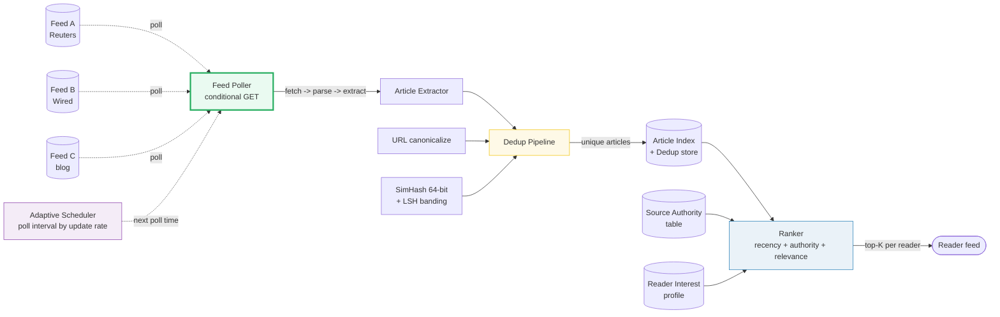
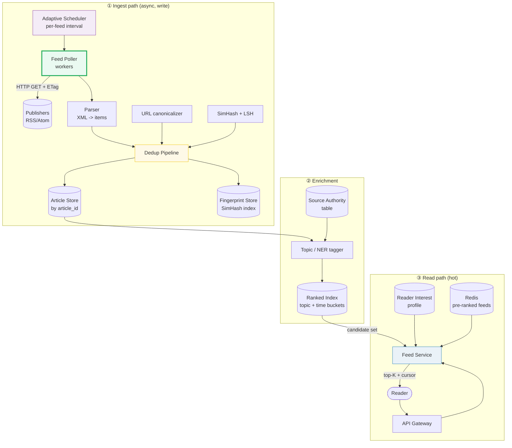

# Design a News Aggregator

> **Companion code:** [`news_aggregator.py`](https://github.com/quanhua92/tutorials/blob/main/systemdesign/news_aggregator.py).
> **Live demo:** [`news_aggregator.html`](./news_aggregator.html) — open in a browser.

---

## 0. TL;DR — the one idea

> **The analogy:** a news aggregator is a newspaper wire desk. Hundreds of
> thousands of publishers each emit a stream of articles via RSS/Atom feeds.
> Your job is to fetch every feed often enough to be **fresh** (but not so often
> you hammer publishers), collapse the 20 near-identical copies of "the AP ran a
> story" into **one** article, and **rank** the survivors so each reader sees the
> stories that matter *to them*. The whole system is one big **merge of many
> noisy streams into one clean, ranked list**.

The **poller** pulls each feed on an adaptive schedule (set by the **scheduler**
from each feed's observed update rate), using conditional GET so unchanged feeds
answer `304` cheaply. Extracted articles pass through a two-layer **dedup
pipeline** (URL canonicalization for mirrors, SimHash + LSH banding for
rewrites). Survivors land in the **article index**. At read time, the **ranker**
scores candidates per reader (`recency + authority + relevance`) and returns a
personalized top-K.

---

## 1. Requirements

### Functional
- **Ingest** news from ~100K RSS/Atom sources on a configurable schedule.
- **Deduplicate** near-identical articles (wire copy, syndication, scrapes) into
  one canonical story.
- **Rank** articles by recency, source authority, and relevance to the reader.
- **Serve personalized feeds**: each reader sees a top-K list shaped by their
  interest profile and subscribed sources.
- **Category / topic pages** (e.g. "Top AI stories") and a global front page.
- Support **search** and **trending** (clusters of articles about one event).

### Non-Functional
- **Freshness:** a new article appears in feeds within minutes of publication.
- **Read-heavy:** feed reads dominate writes (read:write ≈ 100:1).
- **Scale:** 100K sources, ~5M new articles/day, ~50M readers.
- **Latency:** feed generation < 200 ms p99 (pre-computed / cached).
- **Availability:** 99.9%; a poller stall must not block reads (stale feed OK).

---

## 2. Scale Estimation

> From `news_aggregator.py` Section F:

| Metric | Value |
|---|---|
| RSS / Atom sources | 100,000 |
| Avg new articles / source / day | 50 |
| **Articles ingested / day** | **5,000,000** |
| Avg article size | 50 KB |
| Article storage / day | 238 GB |
| Article storage / year | ~85 TB |
| SimHash dedup index / day (8 B/article) | 38.1 MB |
| SimHash dedup index / year | ~14 GB (tiny) |
| Ingest bandwidth (bodies, avg) | 0.02 Gbps (~0.12 peak) |
| Polls / day (avg interval 120m, 60% 304) | 1,200,000 |
| Poll bandwidth / day | ~115 GB |

**The dedup story is asymmetric:** the article body store (~85 TB/yr) dominates,
while the SimHash fingerprint index is negligible (~14 GB/yr — 8 bytes × 5M
articles/day). This is *why* near-duplicate detection is cheap to run on every
incoming article.

> From `news_aggregator.py` Section D (adaptive scheduling payoff):

| Polling strategy | Polls/day (3 feeds) | Bandwidth/day |
|---|---|---|
| Naive "poll every feed every 15 min" | 288 | 72.0 MB |
| Adaptive (interval ∝ update rate) + conditional GET | 110 | 13.8 MB |
| **Reduction** | **62%** | **81%** |

---

## 3. Architecture

### Key Components

| Component | Technology | Why |
|---|---|---|
| Adaptive Scheduler | small service + per-feed state | sets poll interval from update rate; cuts polls/bandwidth ~80% |
| Feed Poller | worker pool + HTTP client with ETag/`If-Modified-Since` | conditional GET → unchanged feeds answer 304 cheaply |
| Parser | streaming XML (SAX/expat) | extract title, url, published_at, summary, body |
| Dedup Pipeline | URL canonicalizer + SimHash + LSH banding | mirrors collapse exactly; rewrites caught by hamming distance |
| Article Store | **Cassandra** / DynamoDB (by `article_id`, time-ordered) | write-scalable; 85 TB/yr |
| Fingerprint Store | **Redis** sorted set / KV (SimHash → article_id) | tiny (~14 GB/yr); O(1) bucket lookup |
| Topic Tagger | NER / classifier (categories + keywords) | drives the `relevance` ranking signal |
| Source Authority | small editable table (Reuters 0.95, blog 0.30) | editorial credibility weight |
| Ranked Index | Elasticsearch / inverted index by topic + time | candidate retrieval for a reader's interests |
| Feed Service | stateless read tier + **Redis** pre-ranked feeds | sub-ms reads; per-reader top-K |
| Reader Profile | KV store (reader → interest vector) | the personalization input |

### Request flows

**Ingest (write path):**
1. Scheduler picks the feed whose next-poll-time is due.
2. Poller issues a conditional GET (`If-None-Match: <etag>`).
3. **304** → skip (record 0.5 KB); **200** → parse items, extract fields.
4. For each item: canonicalize URL (exact mirror check), compute SimHash.
5. LSH-bucket the fingerprint; if a near-duplicate exists (hamming ≤ 3), **merge**
   into the canonical story; else insert a new article.
6. Enrich: tag topics, attach source authority; write to Article Store + Index.

**Read (hot path):**
1. Reader opens feed → Feed Service.
2. Retrieve candidate set from the Ranked Index (reader's topics + subscribed
   sources, last N hours).
3. Score each: `w_rec·recency + w_auth·authority + w_rel·relevance` using the
   reader's profile.
4. Sort desc, return top-K with a cursor. Cache the result in Redis (TTL ~1 min).

---

## 4. Key Design Decisions

### 4a. Deduplication strategy

> From `news_aggregator.py` Section B (URL canonicalization + SimHash + LSH):

| Decision | Exact hash (SHA) of body | URL canonicalization only | **SimHash + LSH** |
|---|---|---|---|
| Catches exact copies | yes | yes (mirrors) | yes |
| Catches light rewrites | **no** (one word changes it) | no | **yes** (hamming ≤ 3) |
| Catches re-orderings | no | no | yes (order-invariant) |
| Scale cost | O(n) | O(n) | **O(n)** with LSH banding |
| False positives | none | none | rare (tunable threshold) |
| **Winner for** | exact dup | mirror URLs | **near-dup news (the winner)** |

**Winner: SimHash + LSH banding.** News syndication produces *rewrites*, not
byte-identical copies — exact hashing misses them. SimHash (Charikar 2002)
hashes each token to 64 bits, then takes a per-bit **majority vote** across all
tokens, yielding an order-invariant fingerprint. Two fingerprints with a small
**hamming distance (≤ 3 over 64 bits)** are the same story. LSH banding (split
the 64 bits into 4×16-bit bands) means you only compare articles that share a
band → **O(n) candidate pairs instead of O(n²) all-pairs**.

> From `news_aggregator.py` Section B: a 2-word rewrite of a GPT-5 article has
> **hamming distance 3** (≤ threshold → duplicate, shares 1/4 LSH bands); a
> totally different Fed article has **hamming 25** (not a duplicate, 0/4 bands).

### 4b. Ranking algorithm

> From `news_aggregator.py` Section C (signal breakdown for a tech reader):

| Decision | Chronological | Authority-only | **Recency + Authority + Relevance** |
|---|---|---|---|
| Personalization | none | none | **yes (reader profile)** |
| Stale handling | none | none | exponential decay (half-life 6h) |
| Source quality | ignored | only signal | weighted in |
| Latency | trivial | trivial | cheap (a few multiplies/article) |
| **Winner for** | live blog | editorial picks | **news feed (the winner)** |

**Winner: weighted sum.** `score = 0.45·recency + 0.25·authority + 0.30·relevance`,
with `recency = 0.5^(age/6h)`. Weights sum to 1.0 and decompose cleanly into a
per-article table (see below). Real systems layer an ML ranker on top, but this
is the correct interview answer because it names the three signals that matter.

> From `news_aggregator.py` Section C — tech reader, ranked order
> `a1, a2, a6, a4, a3, a5`:

| art | source | auth | age | recency | relevance | **score** |
|---|---|---|---|---|---|---|
| a1 | Reuters | 0.95 | 1.0h | 0.8909 | 0.5667 | **0.8084** |
| a2 | TechBlog | 0.50 | 2.0h | 0.7937 | 0.7667 | **0.7122** |
| a6 | Wired | 0.70 | 3.0h | 0.7071 | 0.7000 | **0.7032** |
| a4 | BlogSpot | 0.30 | 0.5h | 0.9439 | 0.5000 | **0.6497** |
| a3 | Bloomberg | 0.90 | 5.0h | 0.5612 | 0.1000 | **0.5076** |
| a5 | Reuters | 0.95 | 10.0h | 0.3150 | 0.1000 | **0.4092** |

**The key ranking insight:** a fresh low-authority blog (a4, 0.5h) **beats** a
high-authority but stale-and-irrelevant Reuters fed story (a3, 5h) for the tech
reader — recency + relevance overcome a4's low authority. Authority alone would
put a5 (Reuters) near the top; the decay term (age 10h → recency 0.315) sinks it.

### 4c. Crawl scheduling

> From `news_aggregator.py` Section D:

| Feed | updates/day | interval | polls/day | % 304 |
|---|---|---|---|---|
| wire (Reuters) | 48 | 15m (MIN clamp) | 96 | 50% |
| tech (Wired) | 6 | 120m | 12 | 50% |
| blog (personal) | 1 | 720m | 2 | 50% |

`raw_interval = (1440 / updates_per_day) × 0.5`, clamped to [15, 1440] min. Poll
~2× the update rate to stay fresh; the rest of the polls return 304 and cost
almost nothing. Combined with conditional GET this cuts bandwidth **81%** vs the
naive "poll everything every 15 min". The exponential rush-in/back-off rule
(`new → interval/=2`; `unchanged → interval*=2`) converges a fast wire to the
15-min floor and a dead blog to the 1440-min ceiling.

### 4d. Personalization

> From `news_aggregator.py` Section E (same pool, two readers):

| Reader | top-3 |
|---|---|
| Tech enthusiast (ai, openai, llm heavy) | a1 (0.808), a2 (0.712), a6 (0.703) |
| Finance analyst (fed, rates, economy heavy) | a3 (0.728), a1 (0.658), a5 (0.619) |

**Identical candidate pool, different top-3:** the fed stories (a3, a5) surface
for the finance reader but sink for the tech reader. Personalization is a
**read-time re-scoring** of the shared article index — you do not duplicate
storage per reader.

---

## 5. Data Model

### articles (canonical, by `article_id`)

| Column | Type | Notes |
|---|---|---|
| `article_id` | BIGINT | PK, Snowflake ID (time-ordered → sortable) |
| `canonical_url` | TEXT | canonicalized URL (mirror collapse) |
| `source_id` | BIGINT | FK → sources |
| `title` / `summary` / `body` | TEXT | extracted content |
| `published_at` | TIMESTAMP | from feed `<pubDate>` |
| `topics` | LIST<TEXT> | category/keyword tags (drives relevance) |
| `simhash` | BIGINT | 64-bit near-dup fingerprint |
| `cluster_id` | BIGINT | groups near-duplicates into one story |

### fingerprints (dedup index)

| Column | Type | Notes |
|---|---|---|
| `band_{0..3}` | INT | 16-bit LSH band → indexed for bucket lookup |
| `article_id` | BIGINT | FK |
| `simhash` | BIGINT | full 64-bit fingerprint (hamming compare) |

### sources

| Column | Type | Notes |
|---|---|---|
| `source_id` | BIGINT | PK |
| `feed_url` | TEXT | RSS/Atom URL |
| `name` | TEXT | e.g. "Reuters" |
| `authority` | FLOAT | [0,1] editorial weight (Reuters 0.95) |
| `update_rate` | FLOAT | observed updates/day (drives scheduling) |
| `etag` / `last_modified` | TEXT | conditional GET state |

### reader_profiles

| Column | Type | Notes |
|---|---|---|
| `reader_id` | BIGINT | PK |
| `interests` | MAP<TEXT,FLOAT> | topic → weight (the relevance input) |
| `subscriptions` | LIST<BIGINT> | subscribed source_ids |

---

## 6. API Endpoints

| Method | Path | Description |
|---|---|---|
| GET | `/api/feed?cursor=<id>&limit=20` | personalized ranked feed, cursor-paginated |
| GET | `/api/topic/{topic}` | top articles for a category |
| GET | `/api/articles/{id}` | single article (hydration) |
| GET | `/api/trending` | clustered trending stories |
| POST | `/api/subscriptions` | subscribe to a source |
| PUT | `/api/profile/interests` | update reader interest vector |

**Cursor design:** the cursor encodes the last `(rank_score, article_id)`. The
next page queries `WHERE score < cursor.score` — stable across newly-arrived
articles (offset pagination drifts on a moving target).

---

## 7. Killer Gotchas

- **Syndication breaks exact dedup:** the same story appears as 20 lightly
  rewritten copies. SHA of the body misses them; **SimHash (hamming ≤ 3)** is
  specifically for rewrites. Threshold is corpus-tuned — set it from a labeled
  validation set, not a textbook (`.py` Section B).
- **SimHash needs LSH to scale:** comparing every pair is O(n²). Band the
  fingerprint (4×16-bit) and only hamming-compare within a shared bucket → O(n).
  A near-dup at hamming 3 still shares ≥1 band; a different story (hamming 25)
  shares none (`.py` Section B).
- **Polling can hammer publishers:** naive "every 15 min" on 100K feeds is 9.6M
  polls/day. Adaptive scheduling (interval ∝ update rate) + conditional GET cuts
  bandwidth **81%** (`.py` Section D). Respect `<ttl>` and per-domain crawl-delay.
- **Conditional GET is non-negotiable:** always send `If-None-Match`/`If-Modified-
  Since`; an unchanged feed must answer `304` (~0.5 KB), not re-download 250 KB.
- **Authority can mislead:** a stale high-authority story (a5, Reuters, 10h) sinks
  below a fresh relevant blog because recency decay (0.315) crushes it. Don't
  claim "Reuters always ranks high" — decay + relevance dominate (`.py` Section C).
- **Personalization is read-time:** don't materialize a feed per reader (50M
  readers × re-scoring). Store one shared index; re-score the candidate set at
  read time and cache the result briefly (`.py` Section E).
- **OFFSET pagination drifts:** new articles arriving mid-scroll shift offsets →
  duplicates/skips. Always use **cursor (keyset)** pagination on `(score, id)`.
- **Fingerprint collisions vs false positives:** SimHash near-dup is a *probably*,
  not a certainty. On a hit, verify with a second check (e.g. Jaccard on
  shingles) before merging, to avoid collapsing distinct-but-similar stories.
- **Poller stall ≠ outage:** if the scheduler/poller falls behind, reads serve
  from the stale Ranked Index / Redis cache. Alert on poll lag and freshness,
  not on read errors.

---

## 8. Follow-Up Questions

- **Real-time breaking news?** Add a fast path: a publisher ping (WebSub/PubSubHubbub)
  or frequent high-priority polling for a curated set of breaking-news wires,
  bypassing the adaptive interval.
- **Multilingual dedup?** Language-detect first; compute SimHash within a
  language; for cross-language near-dups use semantic embeddings (cosine), not
  SimHash (which is lexical).
- **Trending / clustering?** Group near-duplicate articles (same `cluster_id`)
  into an event; rank clusters by momentum (new articles/hour) for a "trending"
  feed.
- **Cold-start for a new reader?** Default interest vector from onboarding
  category picks; decay toward observed click behavior over time (exponential
  moving average).
- **Spam / low-quality sources?** Authority is editable and decays for sources
  flagged by moderation; a source below a floor is de-prioritized or dropped.
