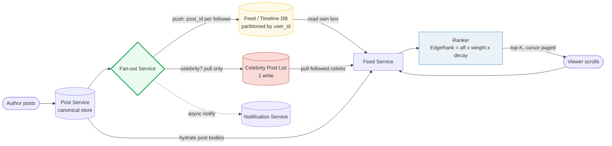
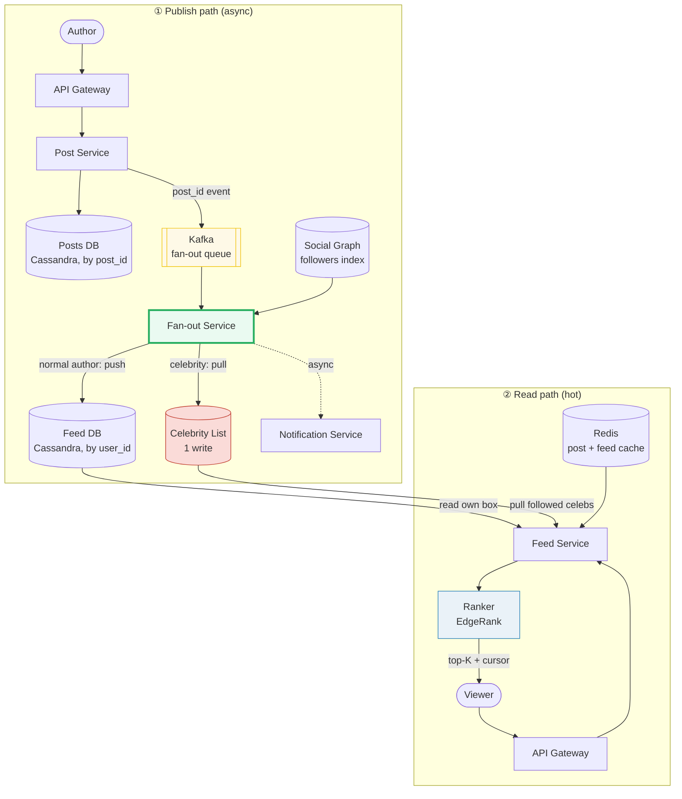

# Design a News Feed

> **Companion code:** [`news_feed.py`](https://github.com/quanhua92/tutorials/blob/main/systemdesign/news_feed.py).
> **Live demo:** [`news_feed.html`](./news_feed.html) — open in a browser.

---

## 0. TL;DR — the one idea

> **The analogy:** a news feed is a personalised newspaper. The interesting
> design question is not *what* is in it (posts from people you follow) but
> *when* the work of assembling it happens. **Fan-out-on-write (push)** runs
> around and drops a copy into every follower's box at publish time — instant
> reads, but one celebrity post means a million writes. **Fan-out-on-read
> (pull)** stores a post once and gathers copies at scroll time — cheap writes,
> but every scroll fires hundreds of fetches. Real hyperscale systems use a
> **hybrid**: push for normal authors, pull for celebrities, then a ranker
> reorders everything by personal relevance.

The publish path writes the post once, then the **Fan-out Service** decides per
author: push the `post_id` into every follower's feed box (cheap reads later),
or — for celebrities — write once to a celebrity list and let followers pull.
The read path merges the viewer's pre-pushed box with their followed
celebrities' recent posts, hydrates the post bodies, runs the **Ranker**, and
returns the top-K with a cursor for the next page.

---

## 1. Requirements

### Functional
- Users can **create posts** (text, images, video, links).
- Users can **follow / unfollow** other users (social graph).
- Users see a **personalised, ranked feed** of posts from people they follow.
- Users can **like, comment, and share** posts (engagement signals).
- Feed supports **infinite scroll** (cursor pagination) and **near real-time**
  updates (a new post from a friend appears within seconds).

### Non-Functional
- **Feed generation under 200–500 ms** (p99) — it is the product's front door.
- **Read-heavy:** read:write ratio ≈ 100:1 (scrolls dominate posts).
- **Scale:** 1B users, 200M DAU, 100M new posts/day, avg 500 followers/post.
- **Freshness:** a pushed post reaches follower feeds in seconds.
- **Availability:** 99.9%+; a fan-out queue stall must not block reads (the
  pre-computed feed box still serves, slightly stale).

---

## 2. Scale Estimation

> From `news_feed.py` Section G:

| Metric | Value |
|---|---|
| Total users | 1,000,000,000 |
| Daily active users | 200,000,000 |
| New posts/day | 100,000,000 |
| Avg followers per post (fan-out factor) | 500 |
| Read : write ratio | 100 : 1 |
| **Push feed-list writes/day** | **50,000,000,000** |
| Push writes/sec (avg) | 578,704 |
| Feed fetches/day (~100× writes) | 10,000,000,000 |
| Feed fetches/sec (avg) | 115,741 |
| Post storage/year (~1 KB/post) | ~34 TB |
| Feed-list hot set (7-day TTL, 16 B/entry) | ~5,215 GB (Redis) |

**The celebrity hotspot (why pure push is dangerous):**

> From `news_feed.py` Section C:

| Source | Writes/day | % of all push writes |
|---|---|---|
| 1,000 celebrities × 5 posts/day × 2M followers | 10,000,000,000 | 20.0% |
| Everyone else (100M posts × 500 followers) | 50,000,000,000 | 80.0% |

A vanishingly small slice of users (0.001%) generates a fifth of all fan-out
work. One viral account can saturate the fan-out queue and **delay normal
users' posts** from reaching feeds — the core argument for the hybrid model.

---

## 3. Architecture

### Key Components

| Component | Technology | Why |
|---|---|---|
| Post Service | stateless + **Cassandra** (by `post_id`) | write-scalable; post bodies hydrated on read |
| Social Graph | **Roaring bitmap / adjacency list** in a graph store (TAO) | fast `getFollowers(author)` and `getFollowees(viewer)` |
| Fan-out Service | workers off a **Kafka** queue | decouples publish from fan-out; retries on failure |
| Feed DB (push) | **Cassandra**, partitioned by `user_id`, clustered by `created_at desc` | each user's feed is one partition — O(1) range read |
| Celebrity List | small table / Redis set | pull at read time; avoids 1M writes per celeb post |
| Feed Service | stateless read tier | merges pushed box + celebrity pulls, calls Ranker |
| Ranker | scoring service (EdgeRank → ML model) | orders candidate set by personal relevance |
| Feed Cache | **Redis** (post metadata + per-user feed box) | sub-ms reads; TTL ~5 min; absorbs DB load |
| Notification Service | async, multi-channel | push/online signals, decoupled from feed |

### Request flows

**Publish (write path):**
1. Author posts → API Gateway → Post Service stores the canonical post in
   Cassandra and emits a `post_id` event to Kafka.
2. Fan-out Service consumes the event, asks the Social Graph for the author's
   follower count.
3. **If followers < threshold (e.g. 1M):** push the `post_id` into every
   follower's Feed DB box (one append each). Invalidate each box's Redis cache.
4. **Else (celebrity):** write the `post_id` once to the Celebrity List. Do
   **not** fan out.
5. (Async) Notification Service pings online followers.

**Read (hot path):**
1. Viewer scrolls → Feed Service.
2. Read the viewer's pushed box (Feed DB / Redis) → pushed candidates.
3. Pull recent posts from each celebrity the viewer follows (~5 fetches) →
   celebrity candidates.
4. Merge, hydrate post bodies from Post Service / cache.
5. **Ranker** scores the candidate set, sorts desc, returns top-K with a cursor.

---

## 4. Key Design Decisions

### 4a. Fan-out strategy

> From `news_feed.py` Sections A–D (push / pull / hybrid, same scenario):

| Decision | Fan-out-on-WRITE (push) | Fan-out-on-READ (pull) | Hybrid |
|---|---|---|---|
| **Write cost (normal author)** | 500 writes/post | 1 write/post | 500 writes/post |
| **Write cost (celebrity)** | **1,000,000 writes/post** | 1 write/post | **1 write/post** |
| **Read cost** | 1 (own box) | 505 (all followees) | **6 (box + 5 celeb pulls)** |
| **Freshness** | instant (pre-computed) | computed on demand | instant + on-demand celeb |
| **Failure mode** | queue stall = stale feed | graph storm = slow feed | best-of-both |
| **Complexity** | low | medium | high (two paths) |
| **Best for** | Twitter-style (read-heavy, few celebs handled separately) | Facebook news-feed generation | **hyperscale (the winner)** |

**Winner: Hybrid.** It keeps push's near-free read for the 99.99% normal case
and collapses celebrity write cost from 1,000,000 to 1, at the price of a tiny
fixed read tax (one fetch per celebrity followed). The hybrid saves **999,999
writes per celebrity post** while adding only ~5 fetches to the read path.

> From `news_feed.py` Section D: `CELEB_THRESHOLD = 1,000,000`. Celebrity write
> = 1 (pull list); viewer read = 1 (own box) + 5 (celeb pulls) = **6 ops**.

### 4b. Ranking algorithm

> From `news_feed.py` Section E (EdgeRank decomposition):

| Decision | Chronological | EdgeRank (affinity × weight × decay) | ML personalisation |
|---|---|---|---|
| **Signal** | post time only | personal graph + type + age | hundreds of features + embeddings |
| **Engagement** | none | type-weight only (video>photo>status) | popularity + session history |
| **Latency** | trivial | cheap (3 multiplies/post) | needs feature pipeline + model serving |
| **Cold start** | fine | fine | needs data |
| **Winner for** | stories / live | **baseline news feed** | ad-optimised hyperscale feeds |

**Winner: EdgeRank as the baseline.** `score = affinity(viewer, author) ×
weight(post) × decay(age)`, with `decay(age) = 0.5 ** (age / 12h)`. It is cheap,
explainable, and encodes the three signals that matter most. Real systems layer
an ML ranker on top, but EdgeRank is the correct interview answer because it
shows you understand the *shape* of the problem.

**The key ranking insight:** EdgeRank is multiplicative, so a **best friend's
2-hour-old photo (affinity 0.9) outranks a celebrity's 1-hour-old video
(affinity 0.2)** despite the celebrity having 50,000 likes. In the base
formula, engagement *volume* is not a multiplier — personal affinity dominates.
(See `.py` Section E: p1 score 1.2027 > p4 score 0.3775.)

| Signal | Meaning | Source |
|---|---|---|
| affinity | viewer–author closeness [0,1] | interaction history (likes/comments/views over time) |
| weight | post-type multiplier | video=2.0, photo=1.5, link=1.0, status=0.5 |
| decay | time discount | `0.5 ** (age_hours / 12)` — half-life 12h |

### 4c. Pagination

| Decision | Offset-based | Cursor-based (keyset) |
|---|---|---|
| Consistency | drifts (new posts shift offsets) | **stable** (resume from last id+score) |
| Cost | deep pages get slow | O(1) per page |
| **Winner** | — | **Cursor** — feeds are a moving target; offset returns duplicates/skips |

---

## 5. Data Model

### Posts (canonical, by `post_id`)

| Column | Type | Notes |
|---|---|---|
| `post_id` | BIGINT | PK, **Snowflake ID** (time-ordered → sortable) |
| `author_id` | BIGINT | FK → users |
| `content` | TEXT | post body |
| `media_urls` | LIST<TEXT> | attached media (S3/CDN URLs) |
| `ptype` | VARCHAR | `video` / `photo` / `link` / `status` (drives weight) |
| `created_at` | TIMESTAMP | creation time |
| `like_count` | INT | **denormalized** counter (eventually consistent) |
| `comment_count` | INT | denormalized counter |

### Feed / Timeline (push model, partitioned by `user_id`)

| Column | Type | Notes |
|---|---|---|
| `user_id` | BIGINT | **partition key** — one partition = one user's feed |
| `post_id` | BIGINT | clustering key (desc) |
| `created_at` | TIMESTAMP | clustering key (desc) — for range reads |
| `rank_score` | FLOAT | precomputed for fast re-sort |

Partitioning by `user_id` makes a feed fetch a **single-partition range read** —
O(1) partition lookup, then a descending slice. Old entries age out via TTL.

### Social Graph (follow edges)

| Table | Columns | Notes |
|---|---|---|
| `follows` | `follower_id`, `followee_id`, `created_at` | composite PK; supports `getFollowers` and `getFollowees` |
| `user_meta` | `user_id`, `follower_count`, `is_celebrity` | drives the push/pull decision in fan-out |

### Celebrity List (pull model)

| Column | Type | Notes |
|---|---|---|
| `celeb_id` | BIGINT | PK |
| `post_id` | BIGINT | recent posts (TTL'd ring buffer) |
| `created_at` | TIMESTAMP | for "recent" window |

---

## 6. API Endpoints

| Method | Path | Description |
|---|---|---|
| POST | `/api/posts` | create a post → `{"post_id", "created_at"}` (triggers fan-out) |
| GET | `/api/feed?cursor=<id>&limit=20` | ranked feed, cursor-paginated |
| GET | `/api/posts/{id}` | single post (hydration) |
| POST | `/api/posts/{id}/like` | like → `{"likes": n}` (async counter update) |
| POST | `/api/posts/{id}/comments` | add a comment |
| POST | `/api/users/{id}/follow` | follow → updates social graph + user_meta |

**Cursor design:** the cursor encodes the last-returned `(post_id, rank_score)`
or `(created_at, post_id)`. The next page queries `WHERE score < cursor.score`
(or `created_at < cursor.ts`) — stable across newly-arrived posts.

---

## 7. Killer Gotchas

- **Celebrity fan-out storm:** one celebrity post under pure push = **1,000,000
  feed-list writes**; 1,000 celebrities = 20% of the entire push budget
  (`.py` Section C). Fix: **hybrid** — celebrities are pulled, never pushed.
  Threshold `>= 1M followers`.
- **Push read latency vs pull scatter-gather:** push reads are O(1) but pulls
  fire `O(followees)` = 500 graph fetches per scroll (`.py` Section B). Without
  a fan-in cache, pull's read path becomes a scatter-gather storm. Cache
  followee recent-posts in Redis to cap it.
- **Affinity dominates engagement in basic EdgeRank:** a friend's photo beats a
  celebrity's viral video (`.py` Section E). Don't claim "likes drive ranking"
  without naming affinity — interviewers catch this.
- **OFFSET pagination drifts:** new posts arriving mid-scroll shift offsets,
  causing duplicates/skips. Always use **cursor (keyset)** pagination; encode
  `(created_at, post_id)` or `(rank_score, post_id)` in the cursor.
- **Denormalized counters are eventually consistent:** `like_count` is updated
  async via a counter service / CRDT. Two concurrent likes can briefly show
  stale counts — acceptable for feeds, unacceptable for billing.
- **Post deletion propagation:** deleting a post must invalidate it in every
  pre-pushed feed box (push model). Use a tombstone + lazy filter at read, or a
  background sweeper; do not synchronously rewrite millions of boxes.
- **Fan-out queue stall ≠ outage:** if Kafka/fan-out workers fall behind,
  reads still serve from the stale pre-computed box. Acceptable staleness (tens
  of seconds); alert on queue lag, not on read errors.
- **Snowflake IDs for sortability:** `post_id` must be time-ordered so
  `ORDER BY post_id DESC` ≈ chronological without a separate timestamp index.
- **Cache stampede on cold feed boxes:** a user returning after days has an
  empty/cold Redis box; concurrent rebuilds thunder the DB. Use request
  coalescing / single-flight or a short mutex per `user_id`.

---

## 8. Follow-Up Questions

- **50,000 followees?** Pure pull fires 50k fetches — cache each followee's
  recent-posts window in Redis and cap the candidate merge. Consider push for
  power users too, or a tiered hybrid.
- **Mixing friends + pages (different ranking)?** Score by source type: friends
  use affinity; pages/creators use popularity + recency. Merge two ranked lists
  with an interleaving policy.
- **Ephemeral "stories"?** Separate store with a hard 24h TTL; no fan-out — pull
  at view time; ranking is purely chronological-by-friend.
- **Post deletion across cached feeds?** Tombstone the post; the read path
  filters tombstoned ids; a background sweeper eventually purges boxes.
- **Real-time live updates?** WebSocket / Server-Sent Events push new pushed
  post_ids to online viewers; the ranker re-scores only the delta.
