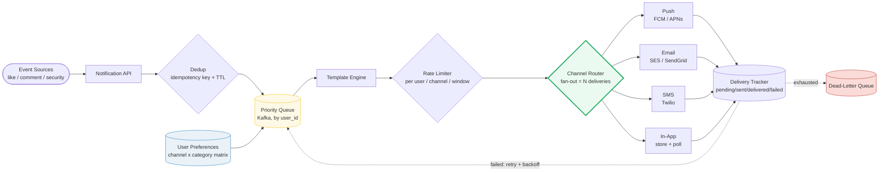
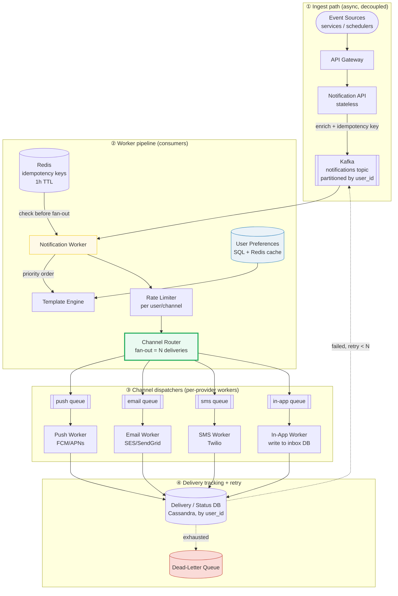

# Design a Notification Service

> **Companion code:** [`notification_service.py`](https://github.com/quanhua92/tutorials/blob/main/systemdesign/notification_service.py).
> **Live demo:** [`notification_service.html`](./notification_service.html) — open in a browser.

---

## 0. TL;DR — the one idea

> **The analogy:** a notification service is a **smart mailroom**. An event arrives
> ("Alice liked your photo"), and the mailroom answers five questions in order:
> *who* gets it, *which channels* (the user picks, via a per-channel per-category
> preference matrix), *how urgent* (a security alert jumps the queue and bypasses
> quiet hours), *is it a duplicate* (idempotency key collapses a 10x/sec burst to
> 1), and *did it actually arrive* (at-least-once, retried with backoff,
> dead-lettered on exhaustion). The trap that catches everyone: **fan-out
> multiplies work** — one notification × 3 channels × 1.5 retry multiplier =
> 4.5B downstream channel attempts/day, so the push/email/SMS dispatchers — not
> your API — are the real throughput bottleneck.

An event enters at the **Notification API**, is collapsed by **Dedup**
(idempotency key in Redis with a short TTL), ordered by the **Priority Queue**
(Kafka, partitioned by `user_id`), filtered against the user's **Preferences**,
rendered by the **Template Engine**, throttled by the **Rate Limiter**, then
fanned out by the **Channel Router** into one delivery per channel. Each delivery
is tracked end-to-end (`pending → sent → delivered | failed`); failures retry
with exponential backoff and, on exhaustion, land in the **Dead-Letter Queue**.

---

## 1. Requirements

### Functional
- Send notifications across **multiple channels** (push, email, SMS, in-app).
- Trigger from **event sources** (likes, comments, follows, system/security
  alerts, marketing).
- **Respect user preferences** — opt-in/out per channel AND per category
  ("push for DMs, email for mentions, nothing for marketing").
- **Deduplicate** identical notifications within a time window (idempotency).
- **Guarantee at-least-once delivery** for every notification; retry transient
  failures; dead-letter the rest.
- Support **priority levels** (urgent / high / normal / low); urgent bypasses
  quiet hours and rate limits.

### Non-Functional
- **Low latency:** push delivered in <1 s; email within minutes.
- **High availability:** 99.99% for critical alerts — no notification loss.
- **Throughput:** ~100K notifications/sec at peak; fan-out × 3 channels × 1.5
  retry = **~450K channel attempts/sec at peak**.
- **Asynchronous:** triggering a notification must never block the calling
  service (event → queue → workers).
- **Idempotent receivers:** a retried push may arrive twice; the device dedups
  on `notification_id`.

---

## 2. Scale Estimation

> From `notification_service.py` Section G:

| Metric | Value |
|---|---|
| Total users | 500,000,000 |
| Daily active users | 100,000,000 |
| Notifications/day | 1,000,000,000 |
| Avg channels per notification (fan-out factor) | 3 |
| Retry multiplier (at-least-once) | 1.5× |
| Peak notifications/sec | 100,000 |
| **Delivery attempts/day** (notif × channels) | **3,000,000,000** |
| **Total channel attempts/day** (× 1.5 retry) | **4,500,000,000** |
| Notifications/sec (avg) | 11,574 |
| **Attempts/sec (peak)** | **450,000** |
| Notification log storage/year (~500 B/log) | ~182 TB |
| Preferences (all users, ~1 KB/user) | ~512 GB (SQL/Redis) |
| Dedup keys (1 h TTL at peak, ~40 B/key) | ~360M keys → ~14.4 GB (Redis) |

**The fan-out trap (why dispatchers, not the API, are the bottleneck):**

> From `notification_service.py` Section A:

A notification requesting 3 channels becomes **3 delivery attempts**; with the
1.5× retry multiplier (at-least-once) that is **4.5 attempts per logical
notification**. At 1B notifications/day the push/email/SMS dispatchers see
**4.5B channel attempts/day** — the API only ever sees 1B. Every capacity plan
must size the *dispatchers*, the third-party provider quotas (FCM/APNs/SES/
Twilio), and the per-channel queues, not the ingress API.

---

## 3. Architecture

### Key Components

| Component | Technology | Why |
|---|---|---|
| Notification API | stateless service | validates + enriches events, never blocks callers |
| Priority Queue | **Kafka**, partitioned by `user_id` | per-user ordering; priority = message weight consumed highest-first |
| Dedup Store | **Redis SET** with 1 h TTL | idempotency key `(notif_id, user, type)`; sub-ms membership check |
| User Preferences | **SQL** + Redis cache | relational matrix (channel × category); strong consistency, low write volume, cached hot |
| Template Engine | stateless render service | one event body → per-channel formatted payloads (push JSON, email HTML, SMS text) |
| Rate Limiter | **Redis sliding-window** counters | per-user × per-channel × per-window; urgent bypass flag |
| Channel Router | fan-out logic in the worker | splits one notification into N `Delivery` rows |
| Channel Dispatchers | per-provider workers off per-channel Kafka topics | isolate provider failures (an APNs outage must not stall email) |
| Delivery / Status DB | **Cassandra**, partitioned by `user_id` | high write throughput for status updates; one partition per user inbox |
| Dead-Letter Queue | Kafka DLQ topic + alerting | deliveries that exhausted retries; paged by on-call |

### Request flows

**Send (write path, async):**
1. A service emits an event → API Gateway → Notification API.
2. API enriches it (resolves `user_id`, category, priority), assigns/derives the
   idempotency key, and publishes to the Kafka notifications topic.
3. Notification Worker consumes in **priority order** (urgent first).
4. **Dedup:** check the key in Redis; if seen within the TTL window, drop.
5. **Preferences:** intersect requested channels with the user's allowed matrix →
   effective channels (may be empty → notification suppressed).
6. **Template Engine** renders per-channel payloads; **Rate Limiter** checks the
   per-user/channel window (urgent bypasses).
7. **Channel Router** fans out → one `Delivery` per effective channel, each
   enqueued on its per-channel topic.

**Deliver + track:**
8. Each Channel Dispatcher calls its provider (FCM/APNs/SES/Twilio/inbox write),
   updates the Delivery status.
9. On failure with attempts < MAX: re-enqueue for retry after backoff.
10. On exhaustion: move to the **Dead-Letter Queue** + alert.

**Read (user inbox, moderate QPS):**
1. `GET /api/notifications` → read the user's inbox partition (Cassandra by
   `user_id`), cached in Redis.

---

## 4. Key Design Decisions

### 4a. Priority queue (not FIFO)

> From `notification_service.py` Section B (weights urgent=4, high=3, normal=2, low=1):

| Decision | FIFO queue | Priority queue (per-message weight) |
|---|---|---|
| Ordering | arrival order | **highest priority first**, stable within a tier |
| Security alert behind marketing burst | buried | **leap-frogs to front** |
| Urgent bypass of rate limit / quiet hours | no | **yes** |
| Implementation | trivial | Kafka + consumer-side priority, or separate urgent topic |
| **Winner** | — | **Priority** — a FIFO queue makes urgent alerts wait behind low-priority digests |

> From `notification_service.py` Section B: 7 events arrive; after dedup, the
> urgent security alert (`n2`, arrived 2nd) is processed **first**. Processing
> order = `n2,n3,n1,n5,n6,n4`.

### 4b. Delivery semantics — at-least-once

> From `notification_service.py` Section D:

| Decision | At-most-once | At-least-once | Exactly-once |
|---|---|---|---|
| Reliability | may drop | **never silently drop** (retry) | never dup |
| Cost | low | medium (retries, idempotent receivers) | very high (2PC / txn) |
| Duplicate risk | none | **possible** (retried delivery lands twice) | none |
| Requires | — | **idempotent receivers** (client dedups on `notification_id`) | distributed txns across provider |
| **Winner** | — | **At-least-once** — correctness/efficiency sweet spot | impractical across third-party providers |

> From `notification_service.py` Section D: of 9 deliveries, **8 delivered, 1
> failed → DLQ**, total **12 attempts** (avg 1.33/delivery), success rate
> **88.9%**. `n3` email fails on attempt 1, retries after 1 s, delivers on
> attempt 2; `n5` sms fails all 3 attempts → dead-lettered. Backoff before
> retries = `[1, 2]` s (`2^(n-1)`).

### 4c. Templating (one event → N channel payloads)

| Decision | Inline string formatting in worker | Dedicated Template Engine |
|---|---|---|
| Channel-specific formatting | tangled | **push JSON / email HTML / SMS text** cleanly separated |
| Localization (i18n) | hard | **template per locale + channel** |
| A/B testing content | no | **versioned templates, pick by experiment** |
| Render cost | trivial | one extra hop (cache rendered output) |
| **Winner** | — | **Template Engine** — keeps providers' payload quirks out of dispatch logic |

### 4d. User preferences — channel × category matrix

> From `notification_service.py` Section C:

| Decision | Single on/off per channel | **Channel × category matrix** |
|---|---|---|
| "Push for DMs, email for mentions, nothing for marketing" | impossible | **expressible** |
| Storage | 4 booleans/user | small relational table, cached |
| Effective channels | requested ∩ channel-on | **requested ∩ allowed(user, channel, category)** |
| **Winner** | — | **Matrix** — a single boolean cannot express per-category opt-outs |

> From `notification_service.py` Section C: `n4` (marketing email to U3) is
> **suppressed entirely** — U3 allows email only for `{mention, system}`, so
> effective channels = `[]`. The matrix filters, not just the worker.

### 4e. Deduplication — idempotency key + TTL

> From `notification_service.py` Section E:

| Decision | Idempotency key in DB (unique constraint) | Bloom filter | **Redis SET + TTL (time-windowed)** |
|---|---|---|---|
| Reliability | exact | probabilistic (small false-positive) | **exact within window** |
| Speed | DB lookup | fast, in-memory | **sub-ms, in-memory** |
| Memory | unbounded growth | tiny | **bounded (TTL auto-expires)** |
| **Winner** | — | — | **Redis SET + TTL** — fast, bounded, exact within the dedup window |

> From `notification_service.py` Section E: 7 events → **1 deduped → 6 unique**.
> **Dedup ≠ retry** — retry re-sends a failed delivery; dedup prevents the *same
> logical event* from entering the pipeline twice (producer double-fire).

---

## 5. Data Model

### notifications (canonical, by `notif_id`)

| Column | Type | Notes |
|---|---|---|
| `notif_id` | VARCHAR | PK, UUID / **Snowflake** (time-ordered) |
| `user_id` | BIGINT | target user (partition key in inbox) |
| `category` | VARCHAR | `dm` / `mention` / `security` / `marketing`... |
| `priority` | VARCHAR | `urgent` / `high` / `normal` / `low` |
| `payload` | JSON | rendered per-channel content (or template ref) |
| `created_at` | TIMESTAMP | creation time |

### deliveries (status tracking, partitioned by `user_id`)

| Column | Type | Notes |
|---|---|---|
| `user_id` | BIGINT | **partition key** — one partition = one user's deliveries |
| `notif_id` | VARCHAR | clustering key |
| `channel` | VARCHAR | `push` / `email` / `sms` / `in_app` |
| `status` | VARCHAR | `pending` / `sent` / `delivered` / `failed` |
| `attempts` | INT | current attempt count |
| `idempotency_key` | VARCHAR | unique constraint (dedup) |
| `updated_at` | TIMESTAMP | last status change |

### user_preferences (channel × category matrix)

| Column | Type | Notes |
|---|---|---|
| `user_id` | BIGINT | partition of the matrix |
| `channel` | VARCHAR | `push` / `email` / `sms` / `in_app` |
| `category` | VARCHAR | `dm` / `security` / ... (or `*` = all) |
| `enabled` | BOOLEAN | opt-in flag |
| `quiet_hours` | JSON | do-not-disturb window | 
| | | composite PK (`user_id`, `channel`, `category`) |

### notification_templates

| Column | Type | Notes |
|---|---|---|
| `template_id` | VARCHAR | PK |
| `category` | VARCHAR | e.g. `like`, `security` |
| `channel` | VARCHAR | push / email / sms / in_app |
| `locale` | VARCHAR | i18n |
| `body` | TEXT | template with `{{placeholders}}` |

---

## 6. API Endpoints

| Method | Path | Description |
|---|---|---|
| POST | `/api/notifications` | send a notification → `{"notif_id"}` (async) |
| GET | `/api/notifications?cursor=&limit=20` | user's notification inbox (cursor-paginated) |
| GET | `/api/notifications/{id}/status` | delivery status per channel |
| PATCH | `/api/notifications/{id}/read` | mark as read |
| PUT | `/api/notifications/preferences` | update preference matrix |
| POST | `/api/notifications/{id}/retry` | manually retry a dead-lettered delivery |

**Idempotency:** clients send an `Idempotency-Key` header (or it's derived from
`event_id + user_id + category`); a repeat within the TTL window returns the
original `notif_id` without re-fanning-out.

---

## 7. Killer Gotchas

- **Fan-out multiplies work, not the API:** 1 notification × 3 channels × 1.5
  retry = **4.5B channel attempts/day** (`.py` Section G). Size the dispatchers
  and the third-party provider quotas, not the ingress API.
- **Priority is a separate axis from channel:** an urgent security alert must
  **leap-frog** a backlog of low-priority digests AND **bypass** rate limits and
  quiet hours (`.py` Sections B, F). A FIFO queue buries it.
- **Preferences are a matrix, not a boolean:** "push for DMs, nothing for
  marketing" requires a channel × category matrix; a single on/off cannot express
  it (`.py` Section C). `n4` marketing email to U3 is suppressed to 0 channels.
- **At-least-once ⇒ receivers MUST be idempotent:** a retried push can land
  twice. The device/client dedups on `notification_id` (`.py` Section D).
- **Dedup ≠ retry:** retry re-sends a *failed delivery*; dedup prevents the *same
  logical event* from entering the pipeline twice. Key = `(notif_id, user,
  category)`, TTL'd in Redis (`.py` Section E).
- **Per-provider isolation:** an APNs/FCM outage must NOT stall email or SMS. Use
  **separate per-channel Kafka topics + independent worker pools** so a slow
  provider backpressures only its own channel.
- **Urgent must bypass the rate limiter:** without the bypass, a flooded user
  misses security alerts. Rate limiting is per-user × per-channel × per-window,
  with an urgent escape hatch (`.py` Section F: 50/h push limit, +1 urgent
  bypass = 51 delivered).
- **Token rotation for push:** device tokens (APNs/FCM) rotate and expire.
  Track valid tokens per device; handle `InvalidRegistration` by retiring the
  token and falling back to email.
- **Backoff needs jitter:** pure exponential backoff (1s, 2s) without jitter
  causes thundering-herd retries after a provider outage. Add random jitter.
- **DLQ is an operational surface, not a black hole:** dead-lettered deliveries
  must be alerted on and paged — a growing DLQ means a provider is down or a
  template is broken.
- **Notification grouping / digest:** batch similar notifications ("5 people
  liked your post") to avoid spamming; this is a separate aggregation stage
  before fan-out, with its own window.

---

## 8. Follow-Up Questions

- **Provider outage (APNs/FCM down)?** Fail over to a backup provider, or
  degrade gracefully (queue + email fallback for urgent). Never silently drop.
- **Batching / digest emails?** A pre-fan-out aggregation stage coalesces events
  of the same category within a window, then renders one digest notification.
- **Notification grouping / smart summaries?** Rank + cluster the pending set per
  user, surface a summary instead of N raw rows (a mini feed-ranking problem).
- **A/B testing content/timing?** Versioned templates in the Template Engine;
  pick a template variant by experiment assignment; track open/click rates per
  variant.
- **Quiet hours / do-not-disturb?** A `quiet_hours` field per user preference;
  non-urgent notifications are held until the window ends (urgent still bypasses).
- **Idempotency at the receiver?** Each rendered notification carries a stable
  `notif_id`; the device keeps a short LRU of seen ids and drops duplicates.
