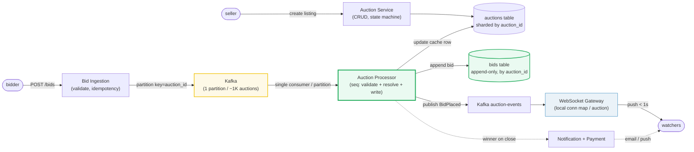
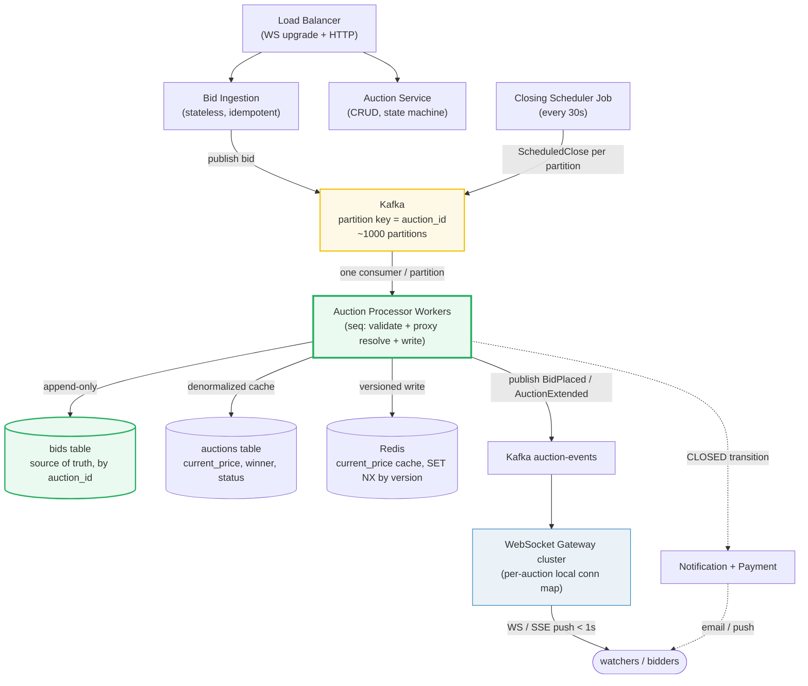

# Design an Online Auction System

> **Companion code:** [`online_auction.py`](https://github.com/quanhua92/tutorials/blob/main/systemdesign/online_auction.py).
> **Live demo:** [`online_auction.html`](https://github.com/quanhua92/tutorials/blob/main/systemdesign/online_auction.html) — open in a browser.

---

## 0. TL;DR — the one idea

> **The analogy:** an online auction is a **single-threaded state machine per auction** — every
> bid flows through one Kafka partition keyed by `auction_id`, so concurrent bids become a strict
> sequential log instead of a locking fight. Exactly one processor owns each auction at any moment,
> just like a stock-exchange matching engine.

The whole system reduces to one hard problem: **accept concurrent bids on a hot auction, keep
exactly one winner, and never lose a higher bid to a lower one that arrived later.** Everything
else (proxy bidding, anti-sniping, reserve, broadcast, close) hangs off that single
per-auction serialization decision.



---

## 1. Requirements

### Functional
- **Submit a bid** on an active auction; bid must clear `current_price + min_increment`; atomic,
  `p99 < 200 ms`.
- **Proxy bidding**: auto-bid incrementally up to a bidder's stated max; resolve multi-proxy races.
- **Anti-sniping extension**: extend `end_time` by a fixed window when a bid lands in the final
  minutes (cap total extension).
- **Real-time broadcast**: push every accepted bid to all watchers via WebSocket/SSE within 1 s.
- **Reserve price** enforcement: hidden reserve; show "Reserve not met" without revealing the amount.
- **Auction state machine**: `UPCOMING → ACTIVE → CLOSING → CLOSED` (+ `CANCELLED`, `NO_SALE`).
- **Bid history**: append-only, queryable per auction (~50 bids avg, up to ~500 on hot items).

### Non-Functional
- **Latency**: bid acceptance `p99 < 200 ms`; broadcast `< 1 s`.
- **Scale**: ~1 M active auctions concurrently; ~10 K bids/sec system-wide peak; ~100 bids/sec on a
  single viral auction at close.
- **Consistency**: exactly one winning bid per auction; no split-brain on close.
- **Availability**: 99.99 % on the bid-submission path; eventual consistency acceptable for watcher
  broadcasts.

---

## 2. Scale Estimation

> From `online_auction.py` **Section 7** (1 M active auctions, 50 bids/auction, 200 B/bid, 7-day avg
> duration, 10 K bids/sec peak):

| Metric | Value |
|---|---|
| Active auctions (concurrent) | 1,000,000 |
| Auctions closing / day | 142,857 |
| Bids / day | 7,142,857 |
| Avg bids / sec | 82.7 /s |
| Peak bids / sec (system-wide) | 10,000 /s |
| Viral auction (single) | 100 bids/sec on ONE auction |
| Peak avg per auction | 0.0100 bids/sec/auction (low contention) |
| **Storage / cycle** (1 M auctions) | **10.00 GB** |
| Storage / day | 1.43 GB |
| Storage / year | 521.43 GB |
| Kafka partitions | 1,000 (1 M auctions / ~1K per partition) |
| Concurrent WebSocket watchers | 50,000 |
| Gateway servers / connections per gateway | 10 / 5,000 |

> The headline insight: **per-auction contention is tiny** (0.01 bids/sec at peak average), but a
> single viral auction can spike to **100 bids/sec** — exactly where naive locking collapses and the
> per-auction partition shines.

---

## 3. Architecture



### Key Components

| Component | Technology | Why |
|---|---|---|
| Bid Ingestion | stateless Go/Java | Validates basic constraints + idempotency (`bid_id`), publishes to Kafka. No DB writes — keeps the hot path lock-free. |
| Kafka (per-auction partition) | Kafka, partition key = `auction_id` | Converts concurrent bids into a strict sequential log per auction. One consumer per partition = no locking, no CAS retries. Throughput scales by adding partitions. |
| Auction Processor | stateless workers, one consumer/partition | The serialized brain per auction: validates increment, resolves proxy bids, writes the bid, updates the cache row, publishes `BidPlaced`. Must be **idempotent** (dedup on `bid_id`). |
| Bids table | Cassandra / Scylla, partition = `auction_id` | **Append-only source of truth.** Never updated or deleted. If the `auctions` cache row is corrupted, recompute from here. |
| Auctions table | sharded SQL / Scylla, by `auction_id` | Denormalized cache: `current_price`, `current_winner_id`, `status`, `version`. ~10K writes/sec peak. |
| Redis | versioned cache | `current_price` for fast reads; `SET NX` with a version counter rejects stale writes on crash replay. |
| WebSocket Gateway | Netty / Go, ~5K conn/server | Fans out `BidPlaced` / `AuctionExtended` to connected watchers. Per-server in-memory `{auction_id: [conns]}` map — no cross-server coordination. |
| Closing Scheduler | periodic job (every 30s) | Publishes `ScheduledClose` to each auction's partition so close work spreads across all processor workers — no single bottleneck at peak (~100 closes/sec). |
| Notification + Payment | async consumer | Triggered on `CLOSED` transition: winner email/push, payment/escrow initiation. |

---

## 4. Key Design Decisions

### 4.1 Bid contention strategy (the central decision)

> From `online_auction.py` **Section 3** — three bids arrive concurrently (Bob $130, Dave $125,
> Carol $110-lowest-last). **Last-write-wins** picks Carol $110 and **loses the seller $20**;
> highest-bid-wins picks Bob $130 but skips increment/proxy rules; **Kafka partition** processes
> sequentially and rejects bids that don't clear the running price → Bob $130, correct.

| Decision | Option A | Option B | Option C | Winner | Why |
|---|---|---|---|---|---|
| **Bid contention** | Pessimistic lock (`SELECT FOR UPDATE`) | Optimistic CAS (version retry) | **Kafka per-auction partition** | **C (partition)** | Pessimistic locking convoys at 10+ concurrent bids and exhausts connection pools on viral auctions. Optimistic CAS causes retry storms (more total DB work than pessimistic). The partition pattern makes each auction single-threaded — no locks, no retries, no split-brain — and throughput scales horizontally by adding partitions. This is the eBay-scale answer. |

### 4.2 Real-time push

> From `online_auction.py` **Section 6** — broadcast is **eventually consistent** (may lag <1 s);
> the `CLOSING` state drains bids already in the partition so none are dropped at close.

| Decision | Option A | Option B | Winner | Why |
|---|---|---|---|---|
| **Real-time push** | WebSocket (full-duplex) | HTTP long polling | **WebSocket + SSE** | WebSocket for active bidders (bid submission + live updates on one socket); SSE for read-only watchers (simpler, HTTP-friendly). Polling burns bandwidth and adds latency; the auction close countdown needs true push. |

### 4.3 Bid serialization / consistency model

| Decision | Option A | Option B | Winner | Why |
|---|---|---|---|---|
| **Consistency** | Strong (2PC / synchronous) | **Per-auction sequential + eventual broadcast** | **Sequential + eventual** | Strong consistency across shards costs 2PC latency the 200 ms budget can't afford. Instead: strong consistency *within one auction* (Kafka partition ordering) + eventual consistency for the broadcast fan-out (watchers see the update within 1 s). Exactly-one-winner is still guaranteed because close runs in the same partition. |

### 4.4 Proxy bidding resolution

> From `online_auction.py` **Section 4** — Alice (max $200) vs Bob (max $150), start $100, $5
> increment → Alice wins at **$155** (one increment over Bob's max, capped at her own max).
> Watchers see only the final price, never intermediate proxy ticks.

| Decision | Option A | Option B | Winner | Why |
|---|---|---|---|---|
| **Proxy resolution** | Publish every proxy increment as a separate event | **Resolve in memory, publish only the final price** | **Resolve then publish** | Intermediate proxy ticks spam watchers and leak bidding strategy. The processor runs the Vickrey-ish resolution loop in memory and emits one `BidPlaced` event with the resolved price. |

### 4.5 Anti-sniping (popcorn bidding)

> From `online_auction.py` **Section 4** — bid at t=295 (5 s before end) extends `end_time` from 300
> to 330 (+30 s); a follow-up bid at t=320 extends to 360. Hard cap = `original_end +
> max_extension` = 900 prevents infinite auctions.

| Decision | Option A | Option B | Winner | Why |
|---|---|---|---|---|
| **Anti-sniping** | Hard close at `end_time` | **Extend `end_time` by N when a bid lands in the final N minutes** | **Extend (popcorn)** | A hard close rewards snipers who bid in the last second. The extension window lets out-bid users respond; capping the total extension keeps auctions finite. Always use **server timestamps**, never client `bid_timestamp`. |

---

## 5. Data Model

### `bids` (Cassandra — partition key `auction_id`) — **source of truth**

| Column | Type | Notes |
|---|---|---|
| `auction_id` | VARCHAR | **Partition key.** All bids of one auction colocated. |
| `bid_id` | UUID | **Client-generated** for idempotency on crash replay / retry. |
| `bidder_id` | VARCHAR | Bidder user id. |
| `bid_amount` | INT | Accepted amount. |
| `proxy_max` | INT | Nullable; never exposed in API responses. |
| `bid_type` | ENUM | MANUAL / PROXY / SNIPE_PROTECTION / DRAINED. |
| `bid_timestamp` | TIMESTAMP | **Server-assigned.** Never trust client time for anti-snipe. |

> Append-only: never updated or deleted. If the denormalized `auctions` row is corrupted, recompute
> `current_price` / `current_winner_id` from this table.

### `auctions` (sharded — by `auction_id`) — denormalized cache

| Column | Type | Notes |
|---|---|---|
| `auction_id` | VARCHAR | **PK.** |
| `seller_id` | VARCHAR | Owner. |
| `item_id` | VARCHAR | FK → items. |
| `start_price` | INT | Opening price. |
| `reserve_price` | INT | **Hidden** from bidders. |
| `current_price` | INT | Denormalized from highest bid. |
| `current_winner_id` | VARCHAR | Denormalized. |
| `bid_count` | INT | Denormalized. |
| `start_time` / `end_time` / `original_end_time` | TIMESTAMP | `end_time` mutates on anti-snipe; `original_end_time` is immutable. |
| `status` | ENUM | UPCOMING / ACTIVE / CLOSING / CLOSED / CANCELLED / NO_SALE. |
| `version` | INT | Optimistic guard for cache writes; `WHERE current_price < :new` on update. |

### `auction_watchers` (for close notifications — NOT WebSocket state)

| Column | Type | Notes |
|---|---|---|
| `auction_id` | VARCHAR | **PK.** |
| `user_id` | VARCHAR | Watcher. |
| `notification_channel_id` | VARCHAR | Email / push target. |

### `items` (CDN-cacheable)

| Column | Type | Notes |
|---|---|---|
| `item_id` | VARCHAR | **PK.** |
| `seller_id` | VARCHAR | — |
| `title` / `description` / `category` | TEXT | — |
| `images_json` | JSON | Image URLs in S3 / object storage; served via CDN. |

---

## 6. API Endpoints

| Method | Path | Body / Response | Notes |
|---|---|---|---|
| `POST` | `/api/auctions` | `{item_id, start_price, reserve_price, end_time}` → `{auction_id}` | Create listing (low QPS). |
| `GET` | `/api/auctions/{id}` | → `{current_price, status, end_time, bid_count, reserve_met}` | High read QPS; served from Redis cache. **Never** returns `reserve_price`. |
| `POST` | `/api/auctions/{id}/bids` | `{bid_id, bidder_id, bid_amount, proxy_max?}` → `{accepted, current_price}` | Idempotent on `bid_id`; publishes to Kafka partition. |
| `GET` | `/api/auctions/{id}/bids?cursor=` | → `[{bidder_id, bid_amount, bid_timestamp}]` | Append-only history, cursor-paginated. |
| `POST` | `/api/auctions/{id}/watch` | `{user_id}` → `{channel_id}` | Subscribe to close notifications. |
| `WS` | `/ws/auctions/{id}` | push: `BidPlaced`, `AuctionExtended`, `AuctionClosed` | Live updates to watchers (< 1 s). |
| `DELETE` | `/api/auctions/{id}` | → `{cancelled}` | Only before any bids (`bid_count == 0`). |

---

## 7. Deep dives

### Auction state machine (`online_auction.py` Section 1)
> Six states. `UPCOMING → ACTIVE` at `start_time`; `ACTIVE → CLOSING` at `end_time` (drains pending
> bids); `CLOSING → CLOSED` when the winner clears reserve, else `NO_SALE`. `CANCELLED` only before
> any bids. The **`CLOSING` state is critical** — it drains bids already in the Kafka partition at
> close time so in-flight bids are not silently dropped.

### Concurrent bid conflict (`online_auction.py` Section 3)
> The same three bids resolved three ways: **last-write-wins** underprices the auction (Carol's
> $110 overwrites Bob's $130 → seller loses $20); **highest-bid-wins** gets the price right but
> skips increment/proxy rules and is ambiguous on ties; **Kafka partition** processes strictly in
> arrival order, enforces `current + min_increment`, and rejects bids that don't clear the running
> price — exactly one winner, no locks.

### Eventual consistency + CLOSING drain (`online_auction.py` Section 6)
> Bid acceptance and watcher broadcast are decoupled by Kafka. Bids already in the partition when
> `end_time` hits are **drained** during `CLOSING` (2–5 s grace); bids arriving after return
> `AUCTION_CLOSED`. Server timestamps only — client `bid_timestamp` is never trusted for anti-snipe.

### Close traffic spike (~100 closes/sec at peak)
> The `Closing Scheduler` job runs every 30 s and publishes a `ScheduledClose` message to each
> ending auction's partition. Close processing is distributed across **all** processor workers —
> no single bottleneck. Stagger listing `start_time`s with randomization for natural spreading.

---

### Killer Gotchas

- **Last-write-wins loses real money.** A lower bid that arrives last (network lag) overwrites a
  higher one — the seller is paid less than the market offered. Serialize per auction via Kafka
  partition; never let concurrent writers race on `current_price`.
- **The `CLOSING` state exists to drain in-flight bids.** Without it, a bid sitting in the Kafka
  partition when `end_time` hits is silently dropped — the bidder is cheated. The 2–5 s grace
  window honors every bid enqueued before close.
- **Never trust client `bid_timestamp` for anti-snipe.** A sniper forges a timestamp just before
  `end_time` to dodge the extension window. Always use the server-assigned enqueue time.
- **`bids` is append-only; `auctions.current_price` is a cache.** If the cache row is corrupted by
  a crash-replay race, recompute `current_price` / `current_winner_id` from the `bids` table. Guard
  cache writes with `WHERE current_price < :new_price` + a version counter.
- **The processor must be idempotent.** Kafka consumer rebalance replays from the last committed
  offset; dedup on `bid_id` so a replayed bid isn't counted twice.
- **Never expose `proxy_max`.** Only `current_price` is shown to other bidders; the resolution loop
  runs in the processor's memory and emits one event with the final price.
- **`end_time` mutates, `original_end_time` does not.** Anti-sniping extends `end_time`, but the
  hard cap (`original_end_time + max_extension`) is computed from the immutable original — otherwise
  a bidding war could extend an auction forever.
- **Reserve is hidden but enforced.** Show only "Reserve met / not met"; revealing the reserve
  amount lets bidders anchor on it. At close, `current_price < reserve` → `NO_SALE` (seller keeps
  the item).

---

### Reproduce

```bash
python3 online_auction.py          # prints all sections + [check] OK
```

> From `online_auction.py` **Section 8 — GOLD CHECK** (values pinned for `online_auction.html`):

```
active_auctions                = 1000000
peak_bids_per_sec              = 10000
avg_bids_per_sec               = 82.7
storage_per_cycle_gb           = 10.0
kafka_partitions               = 1000
watchers_per_gateway           = 5000
viral_auction_bids_per_sec     = 100
min_bid_threshold_dollars      = 105
lww_revenue_loss_dollars       = 20
proxy_resolved_price           = 155
anti_snipe_extension_seconds   = 30
```

`[check] GOLD reproduces from scale constants + auction formulas? OK` — the gold badge
`check: OK` at the bottom of [`online_auction.html`](https://github.com/quanhua92/tutorials/blob/main/systemdesign/online_auction.html)
recomputes the state machine, bid processing, concurrent-conflict resolution, proxy bidding,
anti-sniping, and scale math in JavaScript and confirms it matches the `.py` exactly.
