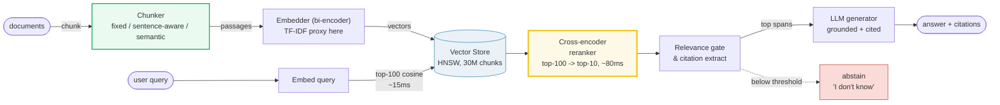
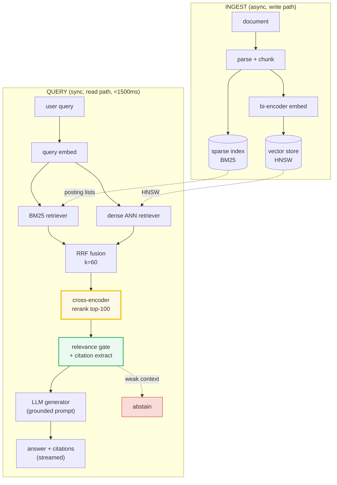

# Design a RAG System

> **Companion code:** [`rag_system.py`](https://github.com/quanhua92/tutorials/blob/main/systemdesign/rag_system.py).
> **Live demo:** [`rag_system.html`](https://github.com/quanhua92/tutorials/blob/main/systemdesign/rag_system.html) — open in a browser.
>
> Every number below is printed by `python3 rag_system.py`; nothing is hand-computed. The `.html`
> recomputes the *identical* chunking + TF-IDF embedding + cosine retrieval + cross-encoder rerank
> pipeline in JavaScript and gold-checks against this `.py`.

---

## 0. TL;DR — the one idea

> **The analogy:** RAG is a **research librarian with a citation habit**. You hand the librarian a
> question (the *query*); they don't answer from memory (that's where hallucinations come from).
> Instead they (1) **slice** the library's books into passages (*chunking*), (2) turn each passage
> into a lookup code (*embedding*), (3) **pull the few passages** whose codes match the question
> (*retrieval*), (4) **re-read those passages side-by-side with the question** to pick the truly
> relevant ones (*reranking*), and only then (5) write an answer where **every sentence points to the
> passage it came from** (*citation*). Retrieve for recall, rerank for relevance, **cite or abstain**.

The central tension is **bi-encoder vs cross-encoder**:

- **Bi-encoder (embedding)** maps text → vector **independently**, so query and chunk never "see"
  each other. Fast enough to score 30M chunks in ~15ms (HNSW ANN), but **shallow**: it rewards one
  strong shared term over "covers the whole query".
- **Cross-encoder (reranker)** reads `[query, chunk]` **together** and scores their joint relevance.
  Far more accurate, but ~1000x slower — too slow to run over the full corpus.
- **The fix is the two-stage funnel:** retrieve top-100 with the cheap bi-encoder, then rerank to
  top-10 with the expensive cross-encoder. You get cross-encoder *accuracy* at bi-encoder *scale*.



> **The pipeline this `.py` actually runs** (pure stdlib, TF-IDF as the embedding proxy so the whole
> funnel is reproducible): chunk → TF-IDF embed → cosine top-K → idf-weighted-coverage rerank →
> relevance-gated citation. The *math* is identical to a production dense-vector RAG; only the
> embedding model differs.

### Glossary

| Term | Plain meaning |
|---|---|
| **chunk** | a passage cut from a document; the atomic unit of retrieval and citation |
| **embedding** | a vector representing a chunk/query; TF-IDF here, BGE/E5/dense in production |
| **bi-encoder** | embeds each side independently (fast, shallow) — the retriever |
| **cross-encoder** | scores query+chunk jointly (slow, accurate) — the reranker |
| **cosine similarity** | angle between two normalized vectors; the retrieval score |
| **top-K** | the K best chunks returned by retrieval (typically K=100) before reranking |
| **coverage** | idf-weighted fraction of query terms a chunk contains; our cross-encoder proxy |
| **citation** | `(doc_id, chunk_index, span, score)` — the proof behind a generated claim |
| **relevance gate** | drop reranked chunks below a score threshold → abstention |
| **HNSW** | hierarchical navigable small-world graph; the default ANN index (~15ms @ 30M) |

---

## 1. Requirements

### Functional
- Ingest and index a document corpus (100K → 100M+ docs) with incremental updates
- Chunk documents with configurable strategy and overlap
- Accept natural-language queries; embed and retrieve top-K relevant passages
- **Rerank** retrieved passages with a cross-encoder for higher precision
- Generate grounded answers with **source citations** (doc + chunk span)
- Detect and mitigate hallucinations; **abstain** when context is weak

### Non-Functional
- End-to-end p95 latency < **1500 ms** (chat); < 800 ms (autocomplete)
- Faithfulness score > 0.85 (claims traceable to retrieved passages)
- Citation precision > 0.90 on sampled queries
- Incremental indexing for high-churn corpora (50K+ new docs/day)
- Streaming: time-to-first-token (TTFT) < 500 ms

---

## 2. Scale Estimation

> From `rag_system.py` Section 6 — 10M docs, 500 tokens/doc, 256-token chunks with 50-token overlap:

| Metric | Value |
|---|---|
| Document corpus | 10,000,000 docs |
| Tokens / doc | 500 |
| Chunk size / overlap | 256 / 50 (step 206) |
| **Chunks / doc** | `ceil((500-256)/206)+1 = 3` |
| **Total chunks indexed** | **30,000,000** |
| Embedding dimension | 1024 (BGE-large-en-v1.5) |
| Peak query QPS | 1,000 /s |

> From `rag_system.py` Section 6 — storage:

| Artifact | Size | Notes |
|---|---|---|
| Raw text | 30.00 GB | 10M × 500 tok × 6 B |
| Embeddings (float32) | **122.88 GB** | 30M × 1024 dim × 4 B |
| Embeddings (PQ, 64 B) | **1.92 GB** | served; **64× compression** |
| Reranker GPU pool | **84 × A10** | 1000 QPS / 12 QPS-per-A10 |

> From `rag_system.py` Section 6 — latency budget (p95 < 1500 ms):

| Stage | Budget |
|---|---|
| query embedding | < 30 ms |
| dense retrieval (HNSW) | < 15 ms *(parallel w/ BM25)* |
| BM25 retrieval | < 10 ms |
| RRF fusion | < 2 ms |
| cross-encoder rerank | < 80 ms *(top-100 → top-10)* |
| LLM first token (TTFT) | < 400 ms |
| LLM streaming | < 900 ms |
| **total p95** | **< 1430 ms** *(~70 ms slack)* |

`[check] chunks/doc=3, total=30M, emb raw=122.88GB, emb PQ=1.92GB, 84 GPUs? OK`

---

## 3. Architecture



### Key Components

| Component | Technology | Why |
|---|---|---|
| Chunker | custom (sentence-aware default) | decides what is ever retrievable |
| Bi-encoder embedder | BGE-large-en-v1.5 (1024-dim) | de-facto open default; single A10/L4 |
| Vector store | Qdrant / pgvector / Weaviate | HNSW ANN, online-updatable, payload filters |
| Sparse retriever | Elasticsearch / Lucene | exact-match (invoice #s, error codes) |
| RRF fusion | Reciprocal Rank Fusion (k=60) | fuses BM25 + dense ranked lists in parallel |
| Cross-encoder reranker | BGE-reranker-large / Cohere | joint query-doc scoring, top-100 → top-10 |
| LLM generator | GPT-4o / Claude Sonnet | grounded generation + streaming |
| Hallucination guard | DeBERTa-v3 NLI + relevance gate | per-claim entailment check; abstention |
| Eval pipeline | RAGAS + human gold set | faithfulness, context precision/recall |

---

## 4. Key Design Decisions

> From `rag_system.py` Section 1 — three chunking strategies on the same demo document (6 sentences,
> topic shift after sentence 3):

| Strategy | Chunks | Lengths | Behavior |
|---|---|---|---|
| **fixed-size** (window=8, overlap=2) | **7** | `[8,8,8,8,8,8,8]` | slides a token window; **splits mid-sentence** |
| **sentence-aware** (budget=8) | **6** | `[7,7,7,7,9,7]` | snaps to sentence ends; may exceed budget |
| **semantic** (split on sim drop) | **4** | `[21,7,9,7]` | finds the **topic boundary**; groups the 3 embedding sentences into one 21-tok chunk |

`[check] fixed=7 lens [8,8,8,8,8,8,8], aware=6 lens [7,7,7,7,9,7], semantic=4 lens [21,7,9,7]? OK`

> Production default = **sentence-aware** (simple, never breaks grammar). Semantic gives ~10% recall
> lift on heterogeneous corpora at 2-3× indexing cost. Hierarchical parent-child (index 128-tok
> chunks, return 1024-tok parent) wins for legal/research docs at 2× storage.

> From `rag_system.py` Section 2 — TF-IDF as the embedding proxy (vocab=91 terms over 16 chunks):

| Term | df | idf = log(N/df) |
|---|---|---|
| search | 1 | **2.7726** (rare → highly discriminative) |
| retrieval | 2 | 2.0794 |
| vector | 2 | 2.0794 |
| similarity | 4 | 1.3863 (common → low weight) |

Query `"vector retrieval similarity search"` embeds to a vector with `‖q‖ = 4.2728`. In production
this is a 1024-dim BGE vector; the retrieval math (cosine) is unchanged.

> From `rag_system.py` Section 3 → 4 — the funnel reorders the top-K:

| Decision | Option A | Option B | Winner | Why |
|---|---|---|---|---|
| **Chunking** | fixed-size sliding window | sentence-aware / semantic | **sentence-aware** | never breaks grammar; cheap |
| **Retrieval** | pure dense (HNSW) | pure BM25 | **hybrid BM25+dense+RRF** | dense misses exact-match; BM25 misses paraphrase |
| **Rerank** | stop at cosine top-K | cross-encoder top-K | **cross-encoder** | coverage ≠ magnitude; lifts precision@10 |
| **Embedding model** | BGE-large (1024-d) | E5-mistral (4096-d) | **BGE-large** | best cost/quality; never mix models in one index |
| **Hallucination** | prompt grounding only | defense in depth (5 layers) | **defense in depth** | cuts hallucination ~5-10% → <1% |

> From `rag_system.py` Section 3 — cosine retrieval top-5, query `"vector retrieval similarity search"`:

| Rank | Chunk | Cosine | Why |
|---|---|---|---|
| 1 | c0 (doc1: vector databases…) | **0.5029** | matches search+similarity+vector |
| 2 | c2 (doc1: retrieval ranks…cosine similarity) | 0.2373 | retrieval+similarity |
| 3 | c10 (doc3: e5…retrieval) | 0.1797 | retrieval only |
| 4 | c3 (doc1: qdrant…vector databases) | 0.1411 | vector only |
| 5 | c7 (doc2: …similarity drops) | 0.0793 | similarity only |

`cosine order = c0,c2,c10,c3,c7` — several chunks share one query term, so cosine returns a
**partial-match** ordering.

> From `rag_system.py` Section 4 — cross-encoder rerank (idf-weighted query coverage):

| Rank | Chunk | Coverage | Cosine | Query terms hit |
|---|---|---|---|---|
| 1 | c0 | **0.7500** | 0.5029 | {search, similarity, vector} |
| 2 | c2 | 0.4167 | 0.2373 | {retrieval, similarity} |
| 3 | **c3** | 0.2500 | 0.1411 | {vector} |
| 4 | **c10** | 0.2500 | 0.1797 | {retrieval} |
| 5 | c7 | 0.1667 | 0.0793 | {similarity} |

`rerank order = c0,c2,c3,c10,c7` — **the cross-encoder promoted c3 above c10**: both cover one query
term (0.25), but coverage breaks the cosine tie by chunk index. The chunk covering the *most* of the
query wins #1.

---

## 5. Data Model

| Table: `documents` | Type | Notes |
|---|---|---|
| doc_id | UUID | PK |
| title | TEXT | document title |
| source_url | TEXT | original source |
| embedding_model_version | VARCHAR | never mix models in one index |
| created_at | TIMESTAMP | ingestion time |

| Table: `chunks` | Type | Notes |
|---|---|---|
| chunk_id | UUID | PK |
| doc_id | UUID | FK → documents |
| chunk_text | TEXT | the retrievable passage |
| chunk_index | INT | position within document |
| parent_chunk_id | UUID | FK → parent (hierarchical chunking) |
| embedding | VECTOR(1024) | dense (or PQ-compressed to 64 B) |
| sparse_vector | SPARSE | BM25 / learned-sparse features |

| Table: `query_logs` | Type | Notes |
|---|---|---|
| query_id | UUID | PK |
| query_text | TEXT | the user question |
| retrieved_chunk_ids | UUID[] | cosine top-K |
| reranker_scores | JSONB | cross-encoder scores |
| answer | TEXT | generated answer |
| faithfulness_score | FLOAT | RAGAS / NLI check |
| created_at | TIMESTAMP | — |

---

## 6. API Endpoints

| Method | Path | Description |
|---|---|---|
| POST | /api/documents | Ingest + chunk + index a document (async) |
| POST | /api/query | Submit query → grounded answer + citations |
| GET | /api/query/{id}/stream | Stream the generated answer (SSE) |
| GET | /api/documents/{id}/chunks | List chunks for a document (debug) |
| GET | /api/eval/metrics | Fetch latest RAGAS evaluation scores |

> From `rag_system.py` Section 5 — citation response shape (relevance gate threshold = 0.5):

```json
{
  "query_id": "q_abc",
  "answer": "Vector databases store dense embeddings for fast similarity search…",
  "citations": [
    {"doc_id": "doc1", "title": "Vector Databases",
     "chunk_index": 0, "span": "vector databases store dense embeddings…", "score": 0.75}
  ]
}
```

The relevance gate **dropped 4 of 5** reranked chunks below 0.5 → only `doc1` is cited. Below the
gate, the system **abstains** ("I don't know") rather than generate from weak context.

---

## 7. Hallucination Mitigation — defense in depth

| Layer | Mechanism | Effect |
|---|---|---|
| 1. Prompt grounding | constrain LLM to retrieved context only | ~30-40% fewer hallucinations |
| 2. Per-claim NLI | DeBERTa-v3 entailment check per claim vs passages | traceable claims |
| 3. Relevance gate | abstain if top-1 reranker score < threshold | "I don't know" |
| 4. Output abstention | prompt/train model to refuse when uncertain | calibrated refusal |
| 5. Async audit | sample 1-5% traffic for human review | regression suite |

Combined, these cut hallucination from ~5-10% to **<1%**.

---

### Killer Gotchas
- **Never mix embedding models in one index.** An upgrade = full re-embed + dual-index atomic swap; plan multi-day migration for 10M+ docs.
- **Pure dense retrieval misses exact match.** "CUDA error 11", invoice numbers → BM25 catches them. Always run BM25 + dense **in parallel**, fuse with RRF (k=60).
- **Chunking is forever.** A fact split across two chunks is retrievable only as fragments. Choose the strategy once; re-chunking the corpus is expensive.
- **Cross-encoder is the latency hog.** ~80ms of the 1500ms budget; size the GPU pool to QPS (~12 QPS/A10 for top-100 batches).
- **Prompt injection via retrieved content.** Malicious docs can hijack the LLM; sanitize at ingestion, isolate untrusted content in the prompt.
- **Multi-hop queries fail single-shot.** "Compare Q3 vs Q4 revenue" needs query decomposition or agentic retrieval.
- **Recency bias.** Without a recency boost, the LLM may cite stale docs; add recency to the rerank score for policy/news queries.

> **Files in this bundle** (all derive from one ground-truth `.py`):
> [`rag_system.py`](https://github.com/quanhua92/tutorials/blob/main/systemdesign/rag_system.py) ·
> [`rag_system_output.txt`](https://github.com/quanhua92/tutorials/blob/main/systemdesign/rag_system_output.txt) ·
> [`rag_system.html`](https://github.com/quanhua92/tutorials/blob/main/systemdesign/rag_system.html) · this guide.
