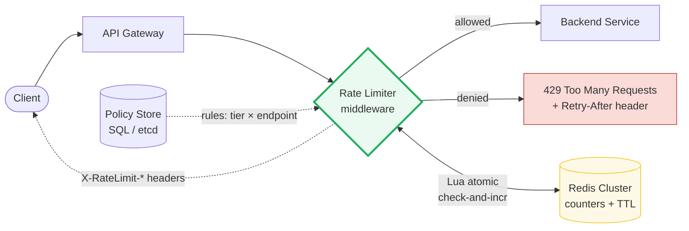
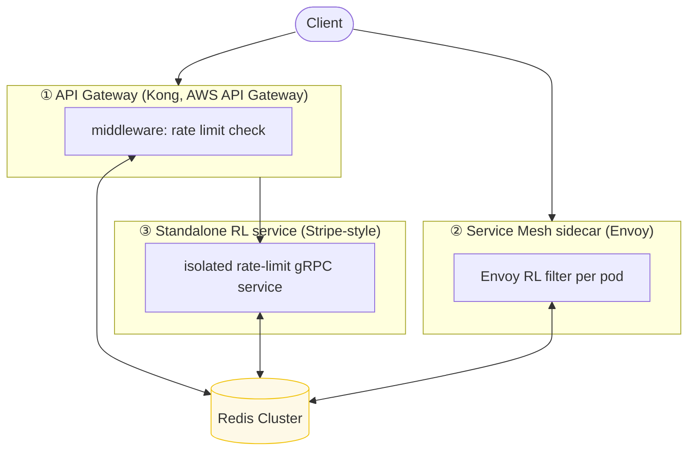

# Design a Rate Limiter

> **Companion code:** [`rate_limiter.py`](https://github.com/quanhua92/tutorials/blob/main/systemdesign/rate_limiter.py).
> **Live demo:** [`rate_limiter.html`](./rate_limiter.html) — open in a browser.

---

## 0. TL;DR — the one idea

> **The analogy:** a rate limiter is a bouncer with a clipboard. Before each
> request enters, the bouncer checks a rule ("max N per minute per user") and
> either lets it in or returns `429 Too Many Requests`. The interesting design
> question is *how the bouncer counts* — four classic algorithms trade off
> simplicity, memory, accuracy, and burst tolerance differently.



The rate limiter sits as **middleware** between the client and the backend. It
extracts a key (user_id / IP / api_key), checks a counter in Redis via an
**atomic Lua script**, and either forwards the request or returns `429`. The
response always carries `X-RateLimit-Remaining` and `X-RateLimit-Reset` headers
so well-behaved clients can self-throttle.

---

## 1. Requirements

### Functional
- Limit requests per **user / IP / API key** within a time window.
- Return **HTTP 429 Too Many Requests** when the limit is exceeded, with a
  `Retry-After` header indicating when to retry.
- Support **configurable rate-limit policies** per endpoint and client tier
  (free: 100 req/min; pro: 1000 req/min; enterprise: 10000 req/min).
- Allow **short bursts** above the sustained rate, up to a configurable ceiling.
- Attach rate-limit metadata to **every** response:
  `X-RateLimit-Limit`, `X-RateLimit-Remaining`, `X-RateLimit-Reset`.

### Non-Functional
- **Low latency:** the rate-limit check must add **< 5 ms** per request
  (it is on the hot path of every API call).
- **High availability:** a rate-limiter outage must NOT block all traffic
  (fail-open for public APIs; fail-closed for billing/login).
- **Scalability:** handle **millions of requests per second** across distributed
  gateway nodes with a shared counter store.
- **Accuracy:** minimise false positives (blocking valid requests) and false
  negatives (allowing over-limit). Distributed settings tolerate small overshoot.
- **Minimal memory:** counters for active windows only; auto-expire via Redis TTL.

---

## 2. Scale Estimation

> From `rate_limiter.py` Section G:

| Metric | Value |
|---|---|
| Daily active users | 10,000,000 |
| Peak QPS | 100,000 |
| Active keys (5-min window, 10% of users) | 1,000,000 |
| Memory — fixed window (52 B/key) | **49.6 MB** |
| Memory — sliding log (8 B × 100 req/key) | 763 MB |
| Bandwidth (1 KB/req @ peak) | 97.7 MB/s |
| Redis shards (single shard ~100K INCR/s) | 1 (cluster for HA) |

**QPS tiers and their architecture:**

| Tier | Peak QPS | Architecture |
|---|---|---|
| startup | 1,000 | single Redis primary, in-process fallback |
| mid-market | 50,000 | 3-node Redis cluster, hash-sharded by key |
| large | 500,000 | Redis cluster + local token bucket per pod |
| hyperscale | 5,000,000 | edge rate limit (CDN) + tiered backends |

**Memory per active key** (the algorithm choice directly drives memory cost):

| Algorithm | Bytes/key | Notes |
|---|---|---|
| Fixed window | ~52 | key + int counter + TTL metadata |
| Sliding window counter | ~64 | two counters + window_id |
| Token bucket | ~72 | tokens (float) + last_refill (float) |
| Sliding window log | 8 × N | one timestamp per request — expensive at high rates |

---

## 3. Architecture

### Three deployment topologies



### Key Components

| Component | Technology | Why |
|---|---|---|
| Rate-limit middleware | in-process library (bucket4j, go-rate) or gateway plugin | sub-ms check; no network hop for the counter decision |
| Counter store | **Redis Cluster** | atomic `INCR`/`EXPIRE`, sub-ms latency, hash-sharded |
| Atomicity | **Lua script** | Redis is single-threaded → a Lua script is a linearized CAS |
| Policy store | SQL / etcd | per-tier, per-endpoint rules; low QPS, strong consistency |
| Local fallback | in-process token bucket | first line of defense; absorbs Redis outages (fail-open) |
| Metrics | Prometheus | track 429 rate, Redis latency, per-key utilisation |

### Request flow (end-to-end)

1. Request arrives at the **API Gateway**.
2. Middleware extracts the **rate-limit key** (user_id / IP / api_key).
3. Middleware runs a **Lua script** in Redis: `check counter → if under limit, INCR → return {allowed, remaining}`. All atomic.
4. If `allowed` → forward to backend; attach `X-RateLimit-Remaining` header.
5. If `denied` → return **429** with `Retry-After` and `X-RateLimit-Reset`.

---

## 4. Key Design Decisions

> From `rate_limiter.py` Sections A–E (the side-by-side comparison):

### 4a. Algorithm choice

| Decision | Token Bucket | Sliding Window Counter | Fixed Window | Leaky Bucket |
|---|---|---|---|---|
| **Burst tolerance** | ✅ up to capacity | ⚠️ smoothed | ❌ 2× at boundary | ❌ forces constant rate |
| **Memory/key** | ~72 B (2 floats) | ~64 B (2 ints) | ~52 B (1 int) | ~72 B (queue) |
| **Redis ops** | 1 Lua (HMGET+HMSET) | 1 Lua (2 INCRs) | 1 INCR + EXPIRE | 1 Lua |
| **Accuracy** | smooth rate, burst-cap | approx (< 1% error) | coarse (boundary burst) | exact constant rate |
| **Side-by-side result** (39 reqs, 10/s, burst 20) | 39 allowed | 31 allowed | 34 allowed | 39 allowed |
| **Best for** | **public APIs (Stripe, AWS)** | general-purpose | simplest / cheapest | traffic shaping |

**Winner: Token Bucket** for most API use-cases. The decoupling of `capacity`
(burst tolerance) from `refill_rate` (sustained throughput) is the key insight —
you can allow a client to burst 20 requests at login, then enforce 10/s steady.
**Sliding window counter** is the runner-up when you need strict accuracy with
minimal memory (two integers per key).

**Fixed window is rejected** for anything user-facing because of the boundary
exploit: at the seam between two windows, **2× the rate can slip through** (see
Section C of the `.py` — 20 reqs in 0.2 s under a 10/s limit all pass).

### 4b. Distributed coordination

| Decision | Option A | Option B | Winner |
|---|---|---|---|
| **Counter store** | Redis Cluster (shared, atomic) | local counters + periodic sync | **Redis** — atomicity matters; sync drift causes overshoot |
| **Atomicity** | Lua script (check-and-incr in one op) | naive GET-then-INCR | **Lua** — naive is racy (100% overshoot in worst case) |

> From `rate_limiter.py` Section F: 100 concurrent requests, limit=50.
> **Naive (GET then INCR):** 100 allowed (100% overshoot). **Atomic (Lua):** 50 allowed (exact).

### 4c. Failure strategy

| Workload | Strategy | Rationale |
|---|---|---|
| Public API | **fail-open** | availability > correctness; log + alert |
| Billing / payment | **fail-closed** | correctness > availability; don't overcharge |
| Login / auth | **fail-closed** | security first; block on RL failure |
| Streaming | **fail-open** | degrade quality rather than cut the user off |

---

## 5. Data Model

### Redis counter keys (hot path — in-memory, TTL-expired)

| Key pattern | Type | Fields | TTL |
|---|---|---|---|
| `rl:tb:{user_id}:{endpoint}` | Hash | `tokens` (float), `last` (float) | 60 s |
| `rl:fw:{user_id}:{window_id}` | String (int) | counter | window_sec |
| `rl:sw:{user_id}:{window_id}` | Hash | `cur`, `prev` | 2 × window_sec |

Key naming: `rl:{algorithm}:{scope_key}:{window_or_endpoint}`. The TTL ensures
counters for inactive clients are garbage-collected automatically — no manual
cleanup needed.

### Policy store (cold path — SQL / etcd)

| Column | Type | Notes |
|---|---|---|
| `policy_id` | VARCHAR | PK |
| `name` | VARCHAR | human-readable policy name |
| `limit` | INT | max requests in window |
| `window_sec` | INT | window size (1, 60, 3600) |
| `burst` | INT | token-bucket capacity (≥ limit) |
| `scope` | VARCHAR | `user`, `ip`, `api_key` |
| `endpoint_pattern` | VARCHAR | glob: `/api/v1/*`, `/billing/*` |
| `tier` | VARCHAR | `free`, `pro`, `enterprise` |

---

## 6. API Design

### Middleware headers (attached to every response)

| Header | Example | Meaning |
|---|---|---|
| `X-RateLimit-Limit` | `1000` | max requests per window for this key |
| `X-RateLimit-Remaining` | `942` | requests remaining in the current window |
| `X-RateLimit-Reset` | `1719506460` | Unix timestamp when the window resets |
| `Retry-After` | `12` | seconds to wait before retrying (only on 429) |

### Admin endpoints

| Method | Path | Description |
|---|---|---|
| GET | `/api/v1/check` | check current rate-limit status for the caller |
| GET | `/api/v1/policies` | list all rate-limit policies |
| PUT | `/api/v1/policies/{id}` | update a policy (limit, window, burst) |
| POST | `/api/v1/policies` | create a new policy |

### Canonical Redis Lua script (atomic token bucket)

> From `rate_limiter.py` Section F:

```lua
-- KEYS[1] = bucket key   ARGV = {capacity, refill_rate, now, cost}
local b     = redis.call('HMGET', KEYS[1], 'tokens', 'last')
local tokens= tonumber(b[1]) or tonumber(ARGV[1])
local last  = tonumber(b[2]) or tonumber(ARGV[3])
local delta = math.max(0, tonumber(ARGV[3]) - last)
tokens      = math.min(tonumber(ARGV[1]), tokens + delta*ARGV[2])
local allowed = 0
if tokens >= tonumber(ARGV[4]) then
  tokens = tokens - tonumber(ARGV[4]); allowed = 1
end
redis.call('HMSET', KEYS[1], 'tokens', tokens, 'last', ARGV[3])
redis.call('EXPIRE', KEYS[1], 60)
return {allowed, tokens}
```

Redis executes Lua scripts **atomically** (single-threaded) — no other client
can interleave between the check and the increment.

---

## 7. Killer Gotchas

- **Boundary burst (fixed window):** 100 req/min at t=59 + 100 at t=61 all pass
  under a 100/min limit. The counter resets at the window seam. Use **sliding
  window counter** or **token bucket** to avoid this. (See `.py` Section C.)
- **Race condition (naive distributed):** `GET` then `INCR` is NOT atomic. In
  the worst case (full concurrency), 100% of requests read the pre-increment
  value and all pass. Fix: **Lua script** (single-threaded in Redis).
- **Clock skew:** in a distributed setting, different gateway nodes may have
  slightly different clocks, causing window_id mismatches. Use **server time**
  (the Redis node's clock for TTL), never client time. For sliding window,
  derive `window_id` from `now` consistently.
- **Thundering herd on reset:** if all clients hit the limit simultaneously and
  retry exactly at `Reset`, they synchronise into a burst. Add **jitter** to
  `Retry-After` (e.g. `reset + random(0, 2) seconds`).
- **Redis as single point of failure:** a Redis outage takes down the shared
  counter. Mitigate with: (a) Redis Cluster (replication + failover), (b)
  in-process local token bucket as fallback, (c) explicit fail-open/fail-closed
  policy per workload.
- **Hot keys:** a single `api_key` hammered across all gateway nodes creates a
  Redis hot shard. Shard by key hash; for extreme cases, use **local + global
  two-level limiting** (each pod gets a local quota, periodically replenished
  from the global Redis quota).
- **Memory blow-up (sliding log):** storing every request timestamp costs
  `8 B × N` per key. At 1000 req/min this is 8 KB/key — 1 M keys = 8 GB. Use
  **sliding window counter** (two ints) instead.
- **Stale counters after failover:** Redis Cluster failover may lose the last
  few seconds of counter writes (async replication). Post-failover, a client may
  get a small "bonus" quota. Acceptable for most APIs; not for billing.

---

## 8. Follow-Up Questions

- **Without Redis?** Use an in-process token bucket per pod + periodic gossip to
  synchronise quotas. Less accurate but no external dependency.
- **WebSocket connections?** Rate-limit by message count, not connection count.
  Track a token bucket per `connection_id`; refill on the server tick.
- **Adaptive rate limiting?** Tie the limit to backend load (CPU, p99 latency).
  Decrease `refill_rate` when the backend degrades; increase when healthy.
- **Per-second vs per-minute?** Layer them: a tight per-second token bucket
  (burst control) + a looser per-minute sliding window (quota). Return the
  stricter of the two.
