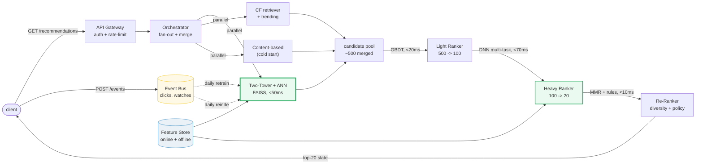
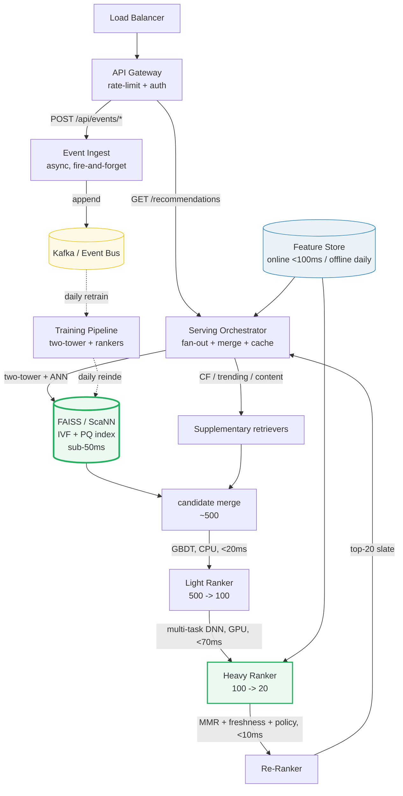

# Design a Recommender System

> **Companion code:** [`recommender_system.py`](https://github.com/quanhua92/tutorials/blob/main/systemdesign/recommender_system.py).
> **Live demo:** [`recommender_system.html`](https://github.com/quanhua92/tutorials/blob/main/systemdesign/recommender_system.html) — open in a browser.

---

## 0. TL;DR — the one idea

> **The analogy:** a recommender is a **multi-stage funnel** that throws a wide,
> cheap net over the whole catalog and then keeps paying more for finer judgment
> on fewer candidates. *Retrieve broadly, rank narrowly.* You can't run an
> expensive cross-encoder over 1B items per request, so every real system narrows
> `1B → 500 → 100 → 20 → final slate`, each stage a progressively costlier model.

Three retriever families feed the funnel, and the choice between them is the
central design tension:

- **Collaborative filtering (CF)** — "users who liked X also liked Y." Powerful
  taste signal, but blind to anything no one has rated yet (cold start, sparsity).
- **Content-based** — "items with similar features." Works for brand-new items,
  but can't see taste patterns the features don't capture.
- **Embedding retrieval (two-tower)** — learned dense vectors + approximate
  nearest-neighbor (ANN). The production standard at billion-item scale: it blends
  collaborative *and* content signals into one vector, then indexes them for
  sub-50ms lookup.



---

## 1. Requirements

### Functional
- **Generate personalized recommendations** per user per surface (home feed, up-next, email, sidebar).
- **Handle cold start** for new items and new users with no interaction history.
- **Update within a session** — real-time preference shift (user clicks a sci-fi trailer, feed adapts).
- **A/B test** ranking models and re-ranking strategies.
- **Explain** why an item was recommended; accept explicit feedback (not-interested, save).

### Non-Functional
- **End-to-end latency** p99 < 200ms (retrieval <50ms, light rank <20ms, heavy rank <70ms, re-rank <10ms).
- **Scale** to 1B+ items in the catalog with sub-50ms retrieval; 500M+ DAU.
- **Availability** 99.9% on the serving path (retrieval + ranking).
- **Offline metrics correlate with online** — NDCG@10 lift must translate to CTR / retention lift.

---

## 2. Scale Estimation

> From `recommender_system.py` **Section 6** (500M DAU, 1B catalog, 128-dim embeddings):

| Metric | Value |
|---|---|
| Daily active users | 500,000,000 |
| Catalog size | 1,000,000,000 items |
| Peak rec requests | 10,000 /s (cache-aided) |
| Interaction events / day (500M × 20) | 10,000,000,000 |
| Avg write QPS (event log) | 115,740 /s |
| Read : write ratio | ~1 : 12 (write-heavy event ingest) |

> From `recommender_system.py` **Section 6** — embedding index RAM:

| Index metric | Value |
|---|---|
| **Raw float32 item vectors (1B × 128 × 4)** | **512.00 GB** (untenable in RAM) |
| **PQ-compressed item index (1B × 8 B)** | **8.00 GB** (fits one node) |
| User embedding store (500M × 128 × 4) | 256.00 GB (offline features, daily refresh) |

> From `recommender_system.py` **Section 6** — event storage (~100 B / row):

| Storage metric | Value |
|---|---|
| Events / year | 3,650,000,000,000 (**3.65 T**) |
| Storage / year | 365.00 TB (archive to S3 Parquet) |

---

## 3. Architecture



### Key Components

| Component | Technology | Why |
|---|---|---|
| Serving Orchestrator | stateless Go/Java | Fans out to retrievers in parallel, merges candidates, calls the ranker cascade, caches the final slate. Horizontally scalable. |
| **Two-Tower + ANN** | **FAISS IVF + PQ / ScaNN** | **The retrieval core.** A user tower (online, ~5ms) and an item tower (precomputed offline) map to a shared embedding space; ANN lookup narrows 1B items to ~500 in <50ms. PQ compresses 512GB of raw vectors to 8GB. |
| Supplementary retrievers | CF, trending, content-based | Run in parallel with two-tower; merged before ranking. Content-based doubles as the cold-start fallback. |
| Light Ranker | GBDT (LightGBM/XGBoost) | CPU, ~20ms over 500 candidates using cheap features (IDs, rates, context). Reduces to ~100; ~95% recall@50 vs heavy-only. |
| **Heavy Ranker** | **Multi-task DNN (GPU)** | Scores ~100 candidates in ~70ms, jointly predicting click, watch-time, satisfaction, retention via a shared trunk + task heads. Weights are a *product* decision. |
| Re-Ranker | MMR / DPP + rules | Diversity (avoid near-duplicates), creator/category caps, freshness boost, content policy, promoted slots. Final slate in <10ms. |
| Feature Store | online (Redis, <100ms) + offline (daily) | Online: session context, recent clicks. Offline: historical rates, user/item embeddings. Same code path for train + serve (no skew). |
| Event Bus | Kafka / Redis Stream | Clicks, watches, skips — the training signal. ~10B events/day → 365TB/year archived to S3. |

---

## 4. Key Design Decisions

### 4.1 Retrieval: two-tower + ANN vs collaborative filtering

> From `recommender_system.py` **Section 1** (item-item CF cosine) + **Section 5** (two-tower + LSH ANN):

| Decision | Option A | Option B | Winner | Why |
|---|---|---|---|---|
| **Retrieval** | **Two-Tower + ANN** | Collaborative filtering (matrix factorization) | **Two-Tower + ANN** | CF is bounded by the interaction matrix — it can't retrieve items no one co-rated, and its similarity graph is O(items²) to maintain. Two-tower **blends collaborative and content signals into one vector**, then indexes 1B of them for sub-50ms ANN lookup. CF stays as a *supplementary* retriever, not the primary. |

- **Item-item CF demo** (from the simulation): cosine over co-rating users, with a
  **min-2-co-raters threshold** (a single co-rater always yields cosine 1.0 — pure
  noise). Reliable sims: Matrix↔Inception **0.9848** (3 co-raters), Superbad↔Hangover
  **0.9756** (2). Predicted u1→Interstellar = **4.50**; comedy items get **no signal**
  (no sci-fi fan co-rated them) — the sparsity hole CF is famous for.
- **Two-tower demo**: dense 4-dim item embeddings; brute kNN top-3 = `i1, i4, i2`
  (cosine 0.9998 / 0.9969 / 0.9950). LSH (2 random-projection planes) buckets the
  query into `10` → retrieves `i1,i2,i3,i4`: **recall@3 = 1.0** but with one **false
  positive** (i3, rank 4 by brute) — exactly why retrieval over-fetches and rankers
  filter.

### 4.2 Ranking: multi-stage vs single heavy ranker

> From `recommender_system.py` **Section 5** (retrieval funnel):

| Decision | Option A | Option B | Winner | Why |
|---|---|---|---|---|
| **Ranking** | **Multi-stage (light → heavy)** | Single heavy DNN over all 500 | **Multi-stage** | A single cross-encoder over 500 candidates blows the latency budget (~350ms). Cascade: GBDT filters 500→100 cheaply (CPU, 20ms), then the DNN scores only 100 (GPU, 70ms). ~95% recall@50 vs heavy-only at a fraction of the cost. Industry standard (YouTube, Netflix). |

- **Funnel reductions** (from the simulation): retrieval `1B → 500` (0.0000005%),
  light `500 → 100` (20%), heavy `100 → 20` (20%). Each stage is a *more expensive*
  model on *fewer* candidates.

### 4.3 Hybrid: blend CF + content

> From `recommender_system.py` **Section 3** (weighted hybrid, u5→Interstellar):

| Decision | Option A | Option B | Winner | Why |
|---|---|---|---|---|
| **Signal blend** | **Hybrid: w·CF + (1−w)·content** | Pure CF or pure content | **Hybrid** | CF captures taste clusters but has sparsity holes; content rescues cold-start and fills the holes. For u5→Interstellar: CF = **3.0** (pulled down by u5's low Matrix=3), content = **4.172** (Interstellar shares drama with LaLaLand=5); **w=0.5 hybrid = 3.586**. Tune w offline on NDCG@10. |

### 4.4 Cold start: popularity vs content-based fallback

> From `recommender_system.py` **Section 4**:

| Decision | Option A | Option B | Winner | Why |
|---|---|---|---|---|
| **New user** | **Popularity ranking** | Ask for onboarding preferences | **Popularity (first), then personalize fast** | A brand-new user has no history. Serve most-rated items (demo top = **Matrix, 4 ratings**) for the first few impressions, then switch to personalized retrieval within a session as clicks accumulate. Pure popularity alone concentrates on hits → feedback loop; cap it. |
| **New item** | **Content-based (inherit near-duplicate audience)** | Wait for interactions | **Content-based** | A brand-new item has zero ratings. Find existing items with similar features (demo: new "Dune" `[scifi,action]` is cosine-1.0 to Matrix → inherit audience **u1, u2, u6**). As clicks accumulate, CF takes over within hours/days. |

### 4.5 Exploration: epsilon-greedy vs pure exploitation

| Decision | Option A | Option B | Winner | Why |
|---|---|---|---|---|
| **Exploration** | **Epsilon-greedy (1–5%) + diversity caps** | Pure exploitation | **Explore** | Pure exploitation maximizes short-term CTR but creates feedback loops, filter bubbles, and popularity concentration. Replace 1–5% of slots with uncertain/random items; enforce diversity (MMR/DPP) and creator-exposure fairness (Gini < 0.75). |

---

## 5. Data Model

### Interaction events (the training signal)

| Column | Type | Notes |
|---|---|---|
| `user_id` | BIGINT | User identifier. |
| `item_id` | BIGINT | Item identifier. |
| `event_type` | ENUM | `click`, `watch`, `like`, `skip`, `dislike`. |
| `dwell_time_ms` | INT | Time spent on item. |
| `position` | INT | Slot shown (position-bias correction). |
| `surface` | ENUM | `home_feed`, `up_next`, `email`, `sidebar`. |
| `timestamp` | TIMESTAMP | Event time. |

### Embedding index (FAISS IVF + PQ)

| Store | Contents | Notes |
|---|---|---|
| item embedding index | 1B × 8B PQ codes | Reindexed daily from the latest two-tower item tower; ~8GB, fits one node with replicas. |
| user embeddings | 500M × 128 float32 | Computed online by the user tower (~5ms); cached in the feature store. |
| raw embeddings | 1B × 128 float32 | Training-time only; 512GB, never in the serving hot path. |

---

## 6. API Endpoints

| Method | Path | Response | Notes |
|---|---|---|---|
| `GET` | `/api/recommendations?surface=home&limit=20` | `[{item_id, score, reason}]` | Multi-stage funnel; cached slate per (user, surface). |
| `POST` | `/api/events/click` | `{ok}` | Async; appends to event bus for training. |
| `POST` | `/api/events/watch-time` | `{ok}` | Dwell-time / engagement signal. |
| `GET` | `/api/recommendations/explain?item_id=x` | `{features[], neighbors[]}` | Why was this recommended? |
| `POST` | `/api/recommendations/feedback` | `{ok}` | Explicit: not-interested, save. |

---

## 7. Deep dives

- **Negative sampling (the single biggest two-tower quality lever).** Random
  negatives are too easy; batch negatives introduce false negatives for popular
  items. **Hard negatives** — items retrieved but *not* engaged — force
  fine-grained discrimination. Typical ratio 1 positive : 1 batch : 4–8 hard.
- **Cold-start frontier (generative, 2024–2026).** Meta HSTU replaces the
  multi-stage funnel with one transformer over interaction sequences; Google TIGER
  uses semantic IDs from content embeddings to eliminate item cold start. Still
  needs a retrieval shortlist at billion-item scale; GPU serving cost is the
  bottleneck.
- **Feedback-loop mitigation.** A recommender trained on its own outputs
  concentrates engagement on the same items. Break the cycle with diversity
  constraints (MMR, DPP), creator-exposure fairness caps (Gini < 0.75), an
  exploration budget (2–5% of slots), and propensity-weighted training to correct
  exposure bias.
- **Offline-online metric gap.** NDCG@10 lift may not translate to retention lift.
  Root causes: train-serve skew, objective mismatch, feedback-loop effects.
  Mitigate with counterfactual logging, calibrated objectives, A/A sanity tests.
- **Multi-task ranking value model.** Weighted blend (e.g., 50% watch-time, 20%
  CTR, 20% satisfaction, 10% retention). The weights are a *product* decision, not
  a modeling one.

---

### Killer Gotchas

- **A single co-rater always yields cosine 1.0.** Item-item CF on sparse data is
  dominated by noise unless you enforce a **min-co-raters threshold** (≥2). Without
  it, every one-off coincidence looks like a perfect match. Demo: Matrix↔LaLaLand
  shows cosine 1.0 from a single user (u5) — meaningless.
- **Retrieval optimizes recall, not relevance.** ANN over-fetches (the demo bucket
  returned a rank-4 false positive alongside the true neighbors). That's by design:
  retrieve 500, let the rankers filter. Don't ship raw retrieval scores to users.
- **Popularity is a feedback-loop accelerant.** Serving most-rated items to new
  users concentrates impressions on a few hits, which makes them even more popular.
  Cap popularity's share; blend in exploration and diversity from impression one.
- **Raw embeddings don't fit in RAM.** 1B × 128 × 4 bytes = 512GB. Product
  quantization (8B/item) compresses to 8GB — the only way ANN stays sub-50ms on a
  single node. Reindex daily; never serve from raw vectors.
- **Train-serve skew silently degrades quality.** If the feature computation path
  differs between training and serving, the model sees different inputs at serve
  time. Use one shared feature library for both; A/A tests catch the drift.
- **Pure exploitation creates filter bubbles.** Maximizing short-term CTR
  concentrates on what the model already knows. An exploration budget (epsilon-greedy
  1–5%) + diversity constraints (MMR/DPP) + creator fairness caps are mandatory, not
  optional polish.

---

### Reproduce

```bash
python3 recommender_system.py          # prints all sections + [check] OK
```

> From `recommender_system.py` **Section 7 — GOLD CHECK** (values pinned for `recommender_system.html`):

```
cf_u1_inter_pred           = 4.5
cf_u5_inter_pred           = 3.0
content_u1_inter           = 4.5
content_u5_inter           = 4.172
hybrid_u5_inter_w05        = 3.586
cf_sim_matrix_inception    = 0.9848
cf_sim_superbad_hangover   = 0.9756
popularity_top_item        = Matrix
popularity_matrix_count    = 4
cold_item_dune_nearest     = Matrix
cold_item_dune_audience    = u1,u2,u6
emb_brute_top3             = i1,i4,i2
emb_brute_top1             = i1
emb_brute_top1_score       = 0.9998
emb_lsh_query_bucket       = 10
emb_lsh_ann_bucket         = i1,i2,i3,i4
emb_recall_at_3            = 1.0
scale_pq_index_gb          = 8.0
scale_raw_index_gb         = 512.0
scale_user_emb_gb          = 256.0
scale_events_year_t        = 3.65
```

`[check] GOLD reproduces from CF + content + embedding formulas? OK` — the gold
badge `check: OK` at the bottom of
[`recommender_system.html`](https://github.com/quanhua92/tutorials/blob/main/systemdesign/recommender_system.html)
re-implements the **item-item CF cosine**, **content-based weighted prediction**,
**hybrid blend**, **popularity/cold-start fallbacks**, **two-tower brute kNN**,
and **LSH random-projection ANN** in **pure JavaScript**, and confirms they match
the `.py` exactly (u1→Interstellar 4.50, Matrix↔Inception 0.9848, brute top-3
`i1,i4,i2`, LSH bucket `10` recall 1.0, PQ index 8GB).
