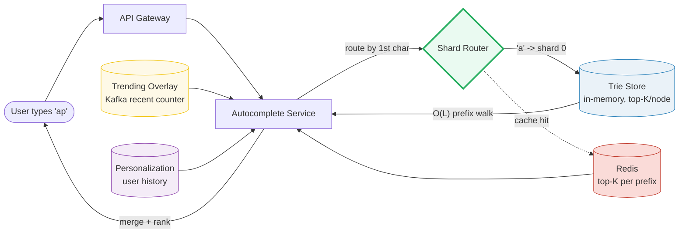
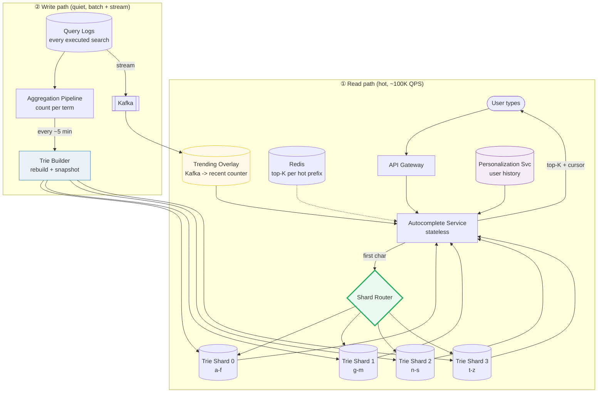

# Design a Search Autocomplete

> **Companion code:** [`search_autocomplete.py`](https://github.com/quanhua92/tutorials/blob/main/systemdesign/search_autocomplete.py).
> **Live demo:** [`search_autocomplete.html`](./search_autocomplete.html) — open in a browser.

---

## 0. TL;DR — the one idea

> **The analogy:** a search autocomplete is a librarian who, the instant you say
> the first few letters, shoves the 5 most likely completions across the desk.
> The interesting design questions are not "find words starting with these
> letters" (a **trie** does that in O(L)) but **(a)** which 5, **(b)** doing it
> in <50 ms for millions of simultaneous typists, and **(c)** keeping the
> suggestions **fresh** as the world's attention shifts.

The read path is everything: every keystroke (debounced ~100 ms) hits the
**Autocomplete Service**, which routes by first character to a **Trie shard**,
walks the prefix in O(L), reads the **cached top-K** at the landing node, then
merges the **real-time trending overlay** and the user's **personalization**
signals before returning. The write path is quiet (~10000:1 read:write) and runs
offline: query logs are aggregated into term frequencies and the trie is
**batch-rebuilt** every few minutes, with a streaming overlay closing the
freshness gap for breaking trends.

---

## 1. Requirements

### Functional
- Return the **top-K suggestions** for a typed prefix as the user types each
  character.
- **Prefix matching** — typing "ap" yields "apple", "application", "api".
- **Rank** suggestions by popularity, recency, and the user's own history.
- **Trending** topics appear within minutes (not the next batch rebuild).
- (Optional) **typo correction** / fuzzy matching ("did you mean…").

### Non-Functional
- **Ultra-low latency:** suggestions in **<50 ms** per keystroke (p99).
- **Read-heavy:** read:write ratio ≈ **10000:1** (keystrokes vs trie updates).
- **Scale:** ~500M DAU, ~100K autocomplete QPS peak, ~10M unique terms.
- **Freshness:** trending queries reflected within minutes; batch lag ≤ 5 min.
- **Availability:** 99.9%+; a trie-store failure degrades to cached/stale
  results rather than failing the search box.

---

## 2. Scale Estimation

> From `search_autocomplete.py` Section G:

| Metric | Value |
|---|---|
| Daily active users | 500,000,000 |
| Autocomplete QPS (peak) | 100,000 |
| Read : write ratio | 10,000 : 1 |
| Unique terms (corpus) | 10,000,000 |
| Avg term length | 8 chars |
| Top-K cached per node | 10 |
| **Autocomplete requests/day** (DAU × 10 × 8 keystrokes) | **40,000,000,000** |
| Autocomplete requests/sec (avg) | 462,963 |
| Trie nodes (80M chars ÷ 1.6 sharing) | 50,000,000 |
| Memory/node (children + top-10) | 256 B |
| **Total trie memory** | **~11.9 GB** |
| **Per shard (4 shards)** | **~3.0 GB** (fits comfortably in RAM) |
| Response size (top-5) | ~200 B |
| Peak bandwidth | ~160 Mbps (trivial) |

**The takeaway:** the entire index lives in RAM across a handful of boxes. The
bottleneck is **QPS and shard skew**, not storage. The memory driver is
**top-K stored at every node** — see the gotchas.

---

## 3. Architecture

### Key Components

| Component | Technology | Why |
|---|---|---|
| Autocomplete Service | stateless read tier | routes to the right shard, merges overlays, scales horizontally |
| Trie Store | **in-memory trie per shard** | O(L) prefix lookup; top-K cached at every node |
| Shard Router | first-character range map | O(1) routing; one trie cannot serve global QPS |
| Redis Cache | sorted set / KV per hot prefix | absorbs the long tail of repeated prefix reads (<1 ms) |
| Trending Overlay | **Kafka** stream → sliding-window counter | live recent-1h counts; spikes land in seconds |
| Personalization Service | Cassandra (by `user_id`) | per-user search history for blended ranking |
| Aggregation Pipeline | MapReduce / Spark batch | turns query logs into `(term, freq)` for trie rebuild |
| Trie Builder | offline job, snapshot + ship | rebuilds the full trie every few minutes |

### Request flows

**Read (hot path):**
1. User types "ap" → client debounces ~100 ms → `GET /suggest?q=ap`.
2. Autocomplete Service checks Redis for prefix "ap" → cache hit returns
   immediately.
3. On miss, route by first char ('a' → shard 0), walk `root→a→p` (O(L)), read
   the cached top-K at the "ap" node.
4. Merge the **trending overlay** (recent-1h counters for any candidate) and the
   **personalization** weight, re-sort, return top-K.

**Write (quiet path):**
1. Every executed search is appended to query logs.
2. **Batch:** every ~5 min the aggregation pipeline counts terms and the trie
   builder rebuilds + snapshots each shard.
3. **Stream:** the same logs flow through Kafka into the trending overlay's
   recent counter, so spikes surface in seconds.

---

## 4. Key Design Decisions

### 4a. Data structure for prefix search

> From `search_autocomplete.py` Section A (trie, top-K per node, O(L) lookup):

| Decision | Trie (top-K/node) | Redis sorted set | FST (Lucene) |
|---|---|---|---|
| **Lookup** | **O(L)** walk + read cached list | O(log N) per prefix (pre-zadd) | O(L) on compressed automaton |
| **Memory** | high (top-K at **every** node) | medium (key per prefix) | **low** (shared suffixes) |
| **Updates** | rebuild batch; overlay for live | incremental `ZINCRBY` | expensive to update live |
| **Freshness** | batch + real-time overlay | real-time | batch only |
| **Winner for** | **serving tier (the answer)** | long-tail cache | static corpora / offline index |

**Winner: Trie with top-K cached at every node.** The lookup cost is the
**prefix length** (a few characters), never the corpus size, because the ranking
work is done once at insert time and stored. Redis sorted sets back the cache
for hot prefixes; FST is the memory-compression play for static corpora.

> From `search_autocomplete.py` Section A: walking `a→p` for "ap" is **2 hops**
> and returns the cached `[app, apple, app store, application, api]` without
> scanning the subtree. The tradeoff: **top-K at every node dominates memory**
> (~256 B/node × 50M nodes ≈ 12 GB).

### 4b. Ranking — four layers

> From `search_autocomplete.py` Sections B–D:

| Decision | Frequency only | + Recency decay | + Trending overlay | + Personalization |
|---|---|---|---|---|
| **Signal** | all-time count | count × time-discount | + live recent-1h | + user's own history |
| **Captures** | popularity | staleness fades | **breaking trends** | **the individual** |
| **Freshness** | stale forever | daily drift | seconds | session-aware |
| **Cost** | trivial | cheap | Kafka stream | per-user store |
| **Winner for** | baseline batch trie | stable index | **trending tail** | **devs / power users** |

The score is built up in layers, each adding a signal:

| Layer | Formula | Source |
|---|---|---|
| 1. frequency | `freq` | offline batch (the trie's stored score) |
| 2. recency | `freq × 0.5 ** (age / 24h)` | half-life 24h — stale terms fade |
| 3. trending | `+ 2 × recent_1h` | Kafka sliding-window counter |
| 4. personal | `+ 200 × user_count` | per-user search history |

**The key ranking insight:** a trending spike overtakes a historically huge but
quiet term. "world cup" (freq 500, but 5000 searches in the last hour) scores
**10500** and jumps to #1, beating "weather" (freq 8000, now quiet) at **2040**
(`.py` Section C). The **batch trie alone cannot do this** — only the real-time
overlay closes the freshness gap.

### 4c. Update strategy

> From `search_autocomplete.py` Section F:

| Decision | Offline rebuild (batch) | Online (real-time) | **Hybrid** |
|---|---|---|---|
| Freshness lag | ≤ batch interval (5 min) | seconds | **seconds** |
| Accuracy | exact counts | approximate (lossy) | base exact + tail approx |
| Read concurrency | perfect (immutable snapshot) | hard (mutable trie) | **batch immutable + overlay read-merge** |
| Complexity | low | high | medium |
| **Winner** | — | — | **Hybrid — batch for the 99%, overlay for the hot 1%** |

**Winner: Hybrid.** Batch-rebuild the trie every ~5 min for the stable base,
and keep a small real-time overlay map (term → last-1h count) fed by Kafka for
trending. Freshness collapses from minutes to seconds **without making the whole
trie mutable** (which would wreck read concurrency).

### 4d. Sharding strategy

> From `search_autocomplete.py` Section E:

| Decision | First-char range (a-f, g-m, n-s, t-z) | Consistent hashing on prefix |
|---|---|---|
| Routing | **O(1)** range lookup | O(1) hash ring |
| Balance | **skew-prone** (load follows letter popularity) | even, but splits a letter across nodes |
| Reasoning | trivial; the classic interview answer | production for skew resilience |
| **Winner** | **default (simple, explainable)** | when 'a'/'s' shards melt |

**Winner: First-character range sharding** as the default — it routes in O(1)
and is trivial to reason about. The catch is **skew**: load follows letter
*popularity*, not letter *count*, so 'a'/'s'/'c' shards run hot while 'q'/'x'
idle (`.py` Section E: a-f carries 33.4% of frequency, n-s only 20.8%). When
skew bites, split hot ranges (`a` → `a`, `ap`, `ap…`) or move to consistent
hashing on the prefix.

---

## 5. Data Model

### Trie node (in-memory, per shard)

| Field | Type | Notes |
|---|---|---|
| `children` | MAP<char → node> | one edge per character; space is a valid edge for phrases |
| `suggestions` | LIST<(term, score)> | **top-K cached**, sorted desc — the whole O(L) lookup |

### Term corpus (offline, source of the batch rebuild)

| Column | Type | Notes |
|---|---|---|
| `term` | VARCHAR | PK — the query string |
| `frequency` | BIGINT | all-time search count (drives the batch trie) |
| `last_seen_at` | TIMESTAMP | drives recency decay |
| `category` | VARCHAR | optional locale/topic tag |

### Trending overlay (live, Redis / in-memory)

| Field | Type | Notes |
|---|---|---|
| `term` | VARCHAR | PK |
| `recent_1h` | INT | sliding-window count from Kafka; small hot map |

### User history (personalization, Cassandra by `user_id`)

| Column | Type | Notes |
|---|---|---|
| `user_id` | BIGINT | **partition key** |
| `term` | VARCHAR | clustering key |
| `count` | INT | personal search count → personalization weight |
| `last_at` | TIMESTAMP | for decay of personal signals |

---

## 6. API Endpoints

| Method | Path | Description |
|---|---|---|
| GET | `/api/suggest?q={prefix}&limit=5&locale=en` | autocomplete suggestions (read, ultra-high QPS) |
| GET | `/api/suggest/trending` | globally trending queries |
| POST | `/api/suggest/rankings` (internal) | update rankings from the aggregation pipeline |
| POST | `/api/admin/suggest/terms` | add / remove / block corpus terms |

**Query design:** the client debounces keystrokes (~100 ms) so each typed query
fires a handful of `GET /suggest` calls, not one per keypress. Responses are
small (~200 B for top-5) and aggressively CDN/edge-cached for hot prefixes.

---

## 7. Killer Gotchas

- **Top-K at EVERY node is the memory driver:** caching the top-K completions at
  each prefix node is what makes lookup O(L) instead of O(subtree), but it
  dominates the footprint (~256 B/node × 50M nodes ≈ 12 GB, `.py` Section G).
  Mitigation: store top-K only at high-traffic prefix depths, or use FST
  (Lucene) compression for the long tail.
- **Trending needs a SEPARATE real-time signal, not just decay:** pure
  `freq × decay(age)` cannot surface a spike — "world cup" (freq 500) stays
  below "weather" (freq 8000) under decay alone (`.py` Section C). You need a
  live recent counter blended on top; the batch trie rebuilds every ~5 min and
  is too slow for breaking news.
- **Shard skew follows letter popularity, not letter count:** range sharding
  is O(1) to route but 'a'/'s' shards melt while 'q'/'x' idle (`.py` Section E:
  a-f 33.4% vs n-s 20.8%). Split hot ranges or use consistent hashing on the
  prefix when skew bites.
- **Read concurrency forbids a mutable trie:** incrementally updating the trie
  on every query wrecks the read path (locks, fragmentation). Keep the serving
  trie immutable (snapshot-swap on rebuild) and put all liveness in the
  read-merged overlay.
- **Keystroke debounce is non-negotiable:** without ~100 ms client debounce, one
  typed query fires 8+ requests; the QPS budget evaporates. Debounce +
  cancel-in-flight on new keystrokes.
- **Cache the long tail, not just hot prefixes:** 80% of QPS hits ~20% of
  prefixes, but the long tail still floods the trie. Cache top-K per prefix in
  Redis with a short TTL; serve stale on miss rather than thundering the trie.
- **Personalization reorders the WHOLE list per user:** "api" is the crowd's #5
  but a developer's #1 (`.py` Section D). Without per-user blending you serve
  the crowd, not the person — but it must be done post-shard at the service
  tier (the sharded trie only knows the global score).
- **Graceful degradation on trie-store failure:** if a shard is unavailable,
  fall back to Redis cached results (possibly stale) rather than blanking the
  search box. Alert on freshness lag and cache-hit ratio, not just errors.
- **Offensive/spam terms must be filtered:** the pipeline must strip
  profanity/policy-violating terms before the rebuild, or they surface as
  suggestions. Maintain a blocklist applied at build time.

---

## 8. Follow-Up Questions

- **"Did you mean…"?** Run edit-distance (Levenshtein) / a BK-tree on candidates
  *after* the prefix match returns nothing, or maintain a phonetic index
  alongside the trie. Keep it on the miss path so it never slows hot lookups.
- **Multi-word phrase suggestions?** Treat the space as a valid trie edge so
  "new york" is reachable by typing "new y"; or run a separate n-gram model for
  next-word prediction and merge.
- **Commerce autocomplete (products, not queries)?** Rank by product
  attributes (sales, margin, inventory) rather than query frequency; the trie
  keys are product titles and the scorer is the ranking engine.
- **Sudden "World Cup" spike?** That is exactly the trending overlay's job
  (`.py` Section C): the Kafka-fed recent counter pushes it to #1 in seconds,
  ahead of the next batch rebuild.
- **Multi-language / locale?** Shard or namespace by locale; rank
  region-specific terms higher via a locale weight added to the score.
