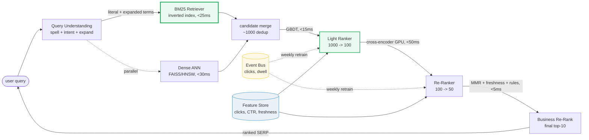
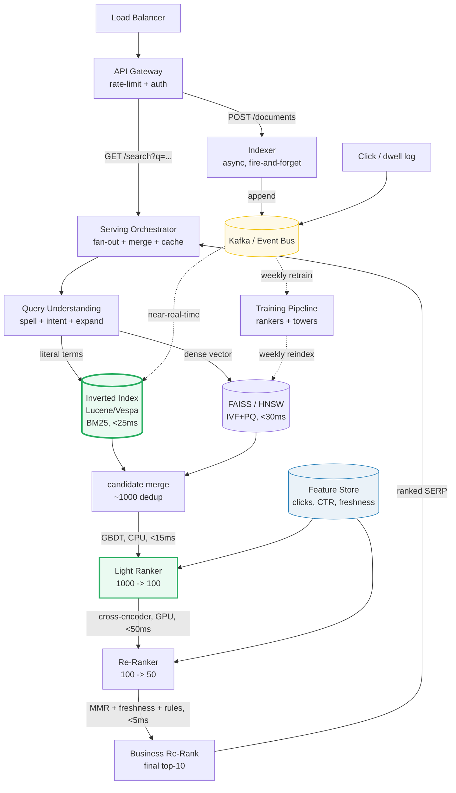

# Design a Search Ranking System

> **Companion code:** [`search_ranking.py`](https://github.com/quanhua92/tutorials/blob/main/systemdesign/search_ranking.py).
> **Live demo:** [`search_ranking.html`](https://github.com/quanhua92/tutorials/blob/main/systemdesign/search_ranking.html) — open in a browser.

---

## 0. TL;DR — the one idea

> **The analogy:** search ranking is a **relay race through a narrowing funnel**.
> Each leg uses a different signal and hands a smaller candidate set to the next:
> the *inverted index* finds what *could* match, *BM25* scores how well the text
> matches, *learning-to-rank* folds in what users actually clicked, and a
> *business re-ranker* enforces the last policy rules. *Retrieve for recall,
> rank for relevance, re-rank for policy.* You never run an expensive model over
> the whole corpus — you narrow first.

The central tension is **lexical vs semantic**:

- **BM25 / TF-IDF** — exact-text matching over an inverted index. Fast,
  explainable, unbeatable for brand names and identifiers. But blind to synonyms
  and paraphrases ("cancel membership" ≠ "unsubscribe"), and blind to what users
  actually want.
- **Learning-to-rank (LTR)** — a feature-based model (BM25 + clicks + CTR +
  freshness + title-match) that optimizes **NDCG**, not just text overlap. It
  fixes BM25's blind spots: when BM25 ranks a short off-topic doc above a longer
  on-topic one, the click/freshness features flip them back.
- **Query expansion** — bridges the lexical gap (dictionary synonyms + Rocchio
  pseudo-relevance feedback) so "machine learning" also surfaces "deep neural
  network training".



---

## 1. Requirements

### Functional
- **Accept free-text queries** and return a ranked list of results from a 100M+ document/product corpus.
- **Multi-stage ranking**: retrieval → ML ranking → business re-ranking, with a fallback chain on timeout.
- **Query understanding**: spell correction, intent classification, query expansion before retrieval.
- **Pagination / infinite scroll** through results; support multiple intents (navigational, informational, transactional).
- **Optionally** synthesize LLM-augmented answers (RAG) alongside the ranked links.

### Non-Functional
- **End-to-end latency** p99 < 150ms for traditional SERP (2–5s acceptable for streamed LLM answers).
- **Scale** to 100M–1B+ documents with near-real-time indexing; read-heavy workload (search ≫ ingestion).
- **High recall at retrieval, high precision at ranking.**
- **Graceful degradation**: if the cross-encoder times out → fall back to the light ranker → fall back to raw BM25.

---

## 2. Scale Estimation

> From `search_ranking.py` **Section 6** (100M docs, 500 tokens/doc, 768-dim embeddings):

| Metric | Value |
|---|---|
| Document corpus | 100,000,000 |
| Avg tokens / doc | 500 |
| Peak query QPS | 10,000 /s |
| Queries / day (10K × 86400) | 864,000,000 |
| Read : write ratio | ~100 : 1 (search ≫ indexing) |

> From `search_ranking.py` **Section 6** — index RAM:

| Index metric | Value |
|---|---|
| Raw text (100M × 500 × 6 B) | 300.00 GB |
| **Inverted index (30% after compression)** | **90.00 GB** (delta + varint postings) |
| Embeddings raw float32 (100M × 768 × 4) | 307.20 GB (training only, never served) |
| **Embeddings PQ (100M × 32 B)** | **3.20 GB** (served; FAISS IVF+PQ) |

> From `search_ranking.py` **Section 6** — latency budget (p99 < 150ms):

| Stage | Budget |
|---|---|
| Query understanding | < 5 ms |
| BM25 retrieval (inverted index) | < 25 ms |
| Dense ANN retrieval (parallel) | < 30 ms |
| Light ranker (GBDT, 1000→100) | < 15 ms |
| Cross-encoder re-rank (top-50, GPU) | < 50 ms |
| Business re-rank (MMR + rules) | < 5 ms |
| **Total** | **< 130 ms** (20ms slack) |

---

## 3. Architecture



### Key Components

| Component | Technology | Why |
|---|---|---|
| Serving Orchestrator | stateless Go/Java | Fans out to retrievers in parallel, merges ~1000 candidates, calls the ranker cascade, caches the SERP. Horizontally scalable. |
| Query Understanding | spell model + intent classifier + expansion dict | Normalizes the query before retrieval. Expansion (dictionary + Rocchio PRF, or learned SPLADE) bridges the lexical gap. |
| **Inverted Index / BM25** | **Lucene / Vespa / Elasticsearch** | **The lexical retrieval core.** Term → posting list; BM25 walks only the matching lists (O(matches), not O(corpus)), so 100M docs finish in <25ms. Irreplaceable for exact-match (brands, IDs). |
| Dense ANN | FAISS IVF+PQ / HNSW | Two-tower embeddings; semantic/paraphrase recall the inverted index can't see. Runs in parallel with BM25; results merged. |
| Light Ranker | GBDT (LightGBM / LambdaMART) | CPU, ~15ms over 1000 candidates on cheap features (BM25, clicks, CTR, freshness). Narrows to ~100. |
| Cross-Encoder Re-Ranker | BERT-style (GPU) | Scores top-50/100 jointly (~1ms each); the precision stage. Timeout → fall back to light ranker. |
| Business Re-Ranker | MMR/DPP + rule engine | Diversity, freshness boost, seller-fairness caps, out-of-stock demotion, promoted insertion. Decouples ML from policy. |
| Feature Store | online (Redis, <100ms) + offline (daily) | Clicks, CTR, freshness, dwell — the behavioral signals BM25 can't see. Same code path for train + serve (no skew). |
| Event Bus | Kafka / Redis Stream | Clicks and dwell → training signal; drives weekly retraining and drift alerts. |

---

## 4. Key Design Decisions

### 4.1 Scoring: TF-IDF vs BM25

> From `search_ranking.py` **Section 2** (TF-IDF tie) + **Section 3** (BM25 breaks it):

| Decision | Option A | Option B | Winner | Why |
|---|---|---|---|---|
| **Lexical scorer** | **BM25** | TF-IDF (vector space) | **BM25** | TF-IDF has no length normalization — two docs with the same term frequencies score identically. In the simulation, query `"machine learning"` **ties d1 = d2 = 1.5041** and **ties d3 = d6 = 0.4055**. BM25 adds **k1 = 1.2** (term-frequency saturation, kills keyword stuffing) and **b = 0.75** (document-length normalization) and breaks both ties. |

- **BM25 formula**: `idf · tf·(k1+1) / (tf + k1·(1−b + b·dl/avgdl))`, `idf = log(1 + (N−df+0.5)/(df+0.5))`.
- From the simulation (avgdl = 4.5): BM25 ranks **d2 (1.5415) > d1 (1.4075)** because d2 is shorter; **d6 (0.4629) > d3 (0.4226)** because d6 is shorter — *even though d3 is more relevant*. That last call is BM25's blind spot.

### 4.2 Retrieval: inverted index (BM25) + dense ANN — not either/or

> From `search_ranking.py` **Section 1** (posting lists) + **Section 4** (expansion):

| Decision | Option A | Option B | Winner | Why |
|---|---|---|---|---|
| **Retrieval** | **Hybrid: BM25 ∪ ANN ∪ SPLADE** | Replace BM25 with dense | **Hybrid (union + dedup)** | BM25 is irreplaceable for exact-match (brands, IDs, technical terms); dense ANN wins on synonyms/paraphrases. Production unions top-K from each, deduplicates, then ranks. The inverted index is also the only structure fast enough for 100M docs at <25ms — it never scans a doc that lacks the term. |

- **Posting-list merge** (simulation): query `"machine learning"` → `machine` postings `{d1,d2}` ∩ `learning` postings `{d1,d2,d3,d6}` = AND `{d1,d2}`; OR union `{d1,d2,d3,d6}` scored, zeros dropped.
- **Query expansion** bridges the lexical gap: dictionary `"learning" → [deep, neural, training]` + Rocchio PRF. Expanded query surfaces d3 (`"deep learning neural network training"`) which jumped from **rank 4 → rank 2** (score 0.4226 → 3.8658).

### 4.3 Ranking: learning-to-rank fixes BM25's blind spot

> From `search_ranking.py` **Section 5** (feature matrix + NDCG):

| Decision | Option A | Option B | Winner | Why |
|---|---|---|---|---|
| **Ranking** | **Learning-to-rank (feature model)** | Pure BM25 | **LTR** | BM25 ranks the short off-topic d6 (grade 1) above the longer on-topic d3 (grade 3) purely on length. LTR folds in clicks/CTR/freshness/title-match and flips them: ranking `d1,d2,d3,d6` matches human judgment. **NDCG@4 jumps 0.9854 → 1.0000.** |

- **LTR formulation**: pointwise (LightGBM baseline, fast/debuggable) → pairwise (RankNet, robust to label noise) → **listwise (LambdaMART, gold standard — optimizes NDCG directly)**.
- **Features** (normalized over the candidate set): `f_bm25`, `f_click`, `f_ctr`, `f_fresh`, `f_exact`. Default weights `0.35 / 0.30 / 0.15 / 0.10 / 0.10`. Drag them live in the companion HTML.

### 4.4 Re-ranking: decouple ML from business logic

| Decision | Option A | Option B | Winner | Why |
|---|---|---|---|---|
| **Business rules** | **Separate re-rank layer** | Bake rules into the ML model | **Separate layer** | Diversity (MMR/DPP), freshness boost, seller-fairness caps (min distinct sellers in top-10), out-of-stock demotion, and promoted insertion change on a *business* cadence, not a model cadence. Keeping them separate lets ML and policy iterate independently. Timeout fallback chain: cross-encoder → light ranker → raw BM25. |

---

## 5. Data Model

### Documents (indexed corpus)

| Column | Type | Notes |
|---|---|---|
| `doc_id` | BIGINT | PK. |
| `title` | TEXT | Consumed as the `f_exact` ranker feature (not indexed as body). |
| `content` | TEXT | Tokenized into the inverted index (postings). |
| `embedding` | VECTOR(768) | Dense two-tower vector for ANN. |
| `sparse_vector` | JSON | SPLADE learned-sparse expansion (inverted-index compatible). |
| `category` | VARCHAR | For diversity / fairness caps. |
| `freshness` | TIMESTAMP | Last updated; drives `f_fresh`. |
| `seller_id` | BIGINT | Seller/owner for fairness re-ranking. |
| `in_stock` | BOOLEAN | Availability flag (demotion signal). |

### Behavioral signals (the training signal)

| Store | Contents | Notes |
|---|---|---|
| inverted index | term → posting list | ~90GB compressed (delta + varint); near-real-time from Kafka. |
| ANN index | 100M × 32B PQ codes | ~3.2GB; reindexed weekly from the latest item tower. |
| feature store | clicks, CTR, freshness, dwell | Online (Redis, <100ms) + offline (daily). Same path for train + serve. |

---

## 6. API Endpoints

| Method | Path | Response | Notes |
|---|---|---|---|
| `GET` | `/api/search?q={query}&page={n}` | `[{doc_id, title, score}]` | Multi-stage funnel; cached SERP per (query, page). |
| `GET` | `/api/search/llm?q={query}` | `{answer, citations[], links[]}` | RAG-augmented; streamed, 2–5s. |
| `GET` | `/api/search/suggestions?q={prefix}` | `[{suggestion}]` | Trie-based autocomplete. |
| `POST` | `/api/documents` | `{doc_id, indexed}` | Async; appends to event bus for indexing. |
| `GET` | `/api/search/analytics?q={query}` | `{stages[{doc_id, score}]}` | Debug: per-stage retrieval + ranking scores. |

---

## 7. Deep dives

- **Position bias & label quality.** Click-derived labels inherit ranking position bias
  (users click the top result regardless of relevance). Mitigate with **Inverse
  Propensity Scoring (IPS)** and 5–10% exploration traffic (randomized results) to
  gather unbiased signal. Without this, the ranker trains on its own output →
  feedback loop.
- **Offline-online metric gap.** +2% NDCG@10 offline may show 0% online lift. Root
  causes: label coverage (<1% of query-doc pairs labeled), business-logic
  interference, position bias. The simulation keeps it honest: BM25's NDCG@4 is
  **0.9854**, LTR's is **1.0000**, on the same graded judgments.
- **Hard negative sampling.** For dense retrieval, random negatives are too easy;
  batch negatives create false negatives for popular items. Use BM25-retrieved-but-
  unclicked docs as hard negatives (typical ratio 1 positive : 4–8 hard).
- **Cold-start for new docs.** No click history → rely on content features and
  embedding similarity until behavioral signals accumulate. The `f_exact` title
  feature and `f_fresh` give new docs a fighting chance out of the gate.
- **LLM-augmented search (2024+).** Traditional SERP presents ranked links; RAG
  synthesizes answers from passage-level (200–1000 token) chunks with citations.
  Route: head queries with simple intent → cheap traditional SERP; long-form
  questions → expensive RAG pipeline (100–1000× the cost). New metrics: citation
  faithfulness, hallucination rate.

---

### Killer Gotchas

- **TF-IDF ties documents it shouldn't.** No length normalization means a terse doc
  and a verbose doc with the same term frequencies score identically (simulation:
  d1 = d2 = 1.5041). BM25's `b` knob exists precisely to break this — always reach
  for BM25 over raw TF-IDF in production.
- **BM25's length normalization can promote the wrong doc.** It ranked the short
  off-topic d6 above the longer on-topic d3 (0.4629 > 0.4226) purely on length.
  Lexical signals are blind to *relevance* — that's why an LTR stage with behavioral
  features is mandatory, not optional polish.
- **The inverted index is the only thing fast enough at 100M docs.** It walks posting
  lists (O(matches)), never scans the corpus. ANN over raw 307GB float32 vectors is
  impossible in RAM — PQ-compress to 3.2GB, reindex weekly, never serve raw vectors.
- **Don't ship raw retrieval scores to users.** Retrieval optimizes recall, not
  relevance — the union over-fetches and the rankers filter. Normalize scores inside
  the pipeline; show users only the final re-ranked order.
- **Train-serve skew silently degrades quality.** If feature computation differs
  between training and serving, the model sees different inputs at serve time. Use
  one shared feature library for both; A/A tests catch the drift.
- **Click labels are position-biased.** Training on raw clicks teaches the model the
  current ranking, not true relevance. IPS + exploration traffic are mandatory, or
  the ranker entrenches its own mistakes.

---

### Reproduce

```bash
python3 search_ranking.py          # prints all sections + [check] OK
```

> From `search_ranking.py` **Section 7 — GOLD CHECK** (values pinned for `search_ranking.html`):

```
avgdl                    = 4.5
df_machine               = 2
df_learning              = 4
idf_machine              = 1.0986
idf_learning             = 0.4055
tfidf_d1                 = 1.5041
tfidf_d2                 = 1.5041
tfidf_d3                 = 0.4055
tfidf_d6                 = 0.4055
bm25_d1                  = 1.4075
bm25_d2                  = 1.5415
bm25_d3                  = 0.4226
bm25_d6                  = 0.4629
bm25_order               = d2,d1,d6,d3
expanded_terms           = machine,learning,model,algorithm,deep,neural,training
expansion_d3_rank        = 2
expansion_d3_score       = 3.8658
ltr_order                = d1,d2,d3,d6
ltr_d1                   = 0.8511
ltr_d3                   = 0.2668
ltr_d6                   = 0.1036
ndcg_bm25_at4            = 0.9854
ndcg_ltr_at4             = 1.0
scale_inverted_gb        = 90.0
scale_emb_raw_gb         = 307.2
scale_emb_pq_gb          = 3.2
```

`[check] GOLD reproduces from index + TF-IDF + BM25 + expansion + LTR? OK` — the gold
badge `check: OK` at the bottom of
[`search_ranking.html`](https://github.com/quanhua92/tutorials/blob/main/systemdesign/search_ranking.html)
re-implements the **inverted index**, **TF-IDF**, **BM25**, **query expansion**,
**learning-to-rank**, and **NDCG@4** in **pure JavaScript**, and confirms they match
the `.py` exactly (BM25 order `d2,d1,d6,d3`, expansion lifts d3 to rank 2, LTR order
`d1,d2,d3,d6` at NDCG@4 = 1.0, PQ index 3.2GB).
