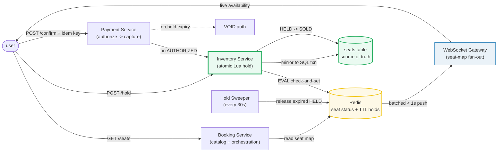
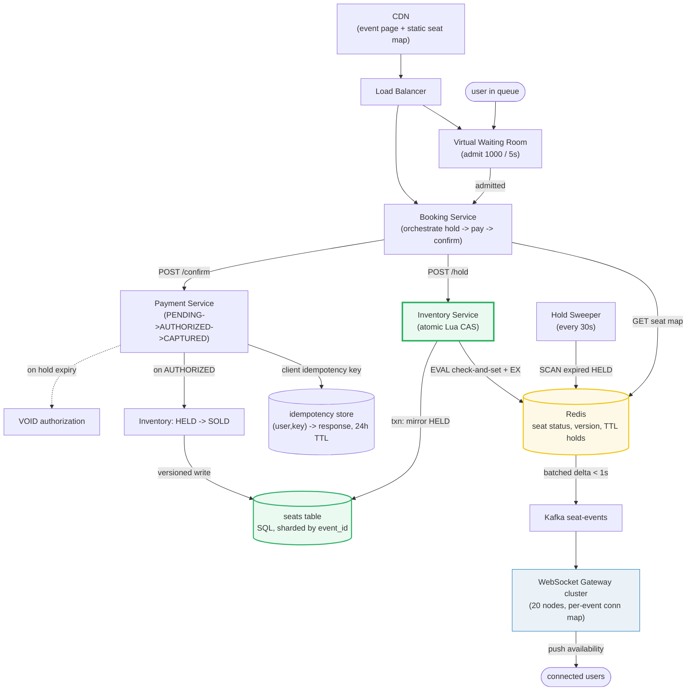

# Design a Ticket Booking System

> **Companion code:** [`ticket_booking.py`](https://github.com/quanhua92/tutorials/blob/main/systemdesign/ticket_booking.py).
> **Live demo:** [`ticket_booking.html`](https://github.com/quanhua92/tutorials/blob/main/systemdesign/ticket_booking.html) — open in a browser.

---

## 0. TL;DR — the one idea

> **The analogy:** a ticket booking system is a **two-phase hold-then-confirm state machine per
> seat**, guarded by an atomic inventory operation. Every seat lives as
> `AVAILABLE → HELD → SOLD` with a TTL; a Redis Lua script does the check-and-set so two users
> racing on the same seat never both win — exactly like an airline seat map, but the "lock" expires
> instead of persisting forever.

The whole system reduces to one hard problem: **accept concurrent holds on hot inventory, give
exactly one user each seat, and release unpaid seats back to the pool without overselling.**
Everything else (idempotency keys, the payment state machine, the virtual waiting room) hangs off
that single atomic-hold decision.



---

## 1. Requirements

### Functional
- **Browse events / seat map**: view available seats in real time (`p99 < 200 ms` for the seat map).
- **Hold seats temporarily**: reserve selected seats for a bounded window (5–10 min) while the user pays.
- **Confirm purchase**: convert a hold into a permanent booking once payment succeeds.
- **Auto-release on timeout**: expired holds return to the available pool (no manual cleanup).
- **Prevent overselling / double-booking**: under no circumstances may two users buy the same seat.
- **Waitlist for sold-out events**: notify users when better seats free up.

### Non-Functional
- **Latency**: seat-map read `p99 < 200 ms`; hold request `p99 < 300 ms`.
- **Consistency**: strong consistency on seat inventory — zero oversells, even under concurrent races.
- **Scale**: ~100 K concurrent users on a flash sale; ~100 K req/sec peak at on-sale open;
  ~50 K seats per large venue; ~100 M bookings/year.
- **Availability**: 99.99 % on the hold path during high-demand events (graceful degradation via queue).
- **Fairness**: prevent bots/scalpers from sweeping inventory (virtual waiting room + bot detection).

---

## 2. Scale Estimation

> From `ticket_booking.py` **Section 7** (50 K seats/venue, 100 K req/sec peak, 100 K concurrent
> users, 8-min hold, 30 % expiry, 4 seats/booking, 100 M bookings/year):

| Metric | Value |
|---|---|
| Seats / venue (flash event) | 50,000 |
| Concurrent users (flash sale) | 100,000 |
| Peak requests / sec (on-sale open) | 100,000 /s |
| Avg bookings / sec | 3.2 /s |
| Bookings / day | 273,972 |
| Bookings / year | 100,000,000 |
| Hold attempts / year (bookings / (1 − expiry)) | 142,857,142 |
| Hold window (TTL) | 480 sec (8 min) |
| Hold expiry rate | 30 % |
| Avg seats / booking | 4 |
| **Bookings storage / year** (256 B/record) | **25.60 GB** |
| Holds storage / year (128 B/record) | 18.29 GB |
| **Total storage / year** | **43.89 GB** |
| Waiting-room admit rate | 200 users/sec (1000 / 5 s) |
| Seats locked / sec (flash) | 800 |
| Venue sellout time (flash) | 62.5 sec |
| WebSocket gateways / connections per gateway | 20 / 5,000 |
| Hold sweeper cadence / max overdue | 30 s / 30 s |

> The headline insight: the **average load is tiny** (~3.2 bookings/sec) but a single flash sale
> spikes to **100 K req/sec on one event** — exactly where naive locking convoys and the virtual
> waiting room (absorbing the spike into a steady 200/sec) earns its keep.

---

## 3. Architecture



### Key Components

| Component | Technology | Why |
|---|---|---|
| CDN | Cloudflare / Fastly | Serves the static event page and venue seat-map layout. Absorbs the read spike so the backend only sees admitted users. |
| Virtual Waiting Room | in-memory queue + admit token | Admits users in batches (1000 / 5 s = 200/sec) so the backend inventory path never sees the raw 100 K req/sec spike. Users see a cached "you are #N in line" page. |
| Booking Service | stateless Go/Java | Orchestrates the hold → pay → confirm flow. Low QPS per request, fully horizontally scalable. |
| Inventory Service | stateless, talks to Redis | The **atomic hot path.** Runs a Redis Lua script that checks seat status and sets `HELD` + TTL in one single-threaded step — no lock wait, no double-book. |
| Redis | seat status + version + TTL | Source of fast truth for the hot path. `SEAT:{event}:{seat}` → `{status, held_by, version}` with `EX = hold_window`. The Lua CAS is atomic because Redis is single-threaded. |
| seats table (SQL) | Postgres / MySQL, sharded by `event_id` | Durable source of truth. Each atomic Redis hold is mirrored inside a SQL transaction (`version` optimistic guard) so a crash can be reconciled. |
| Payment Service | stateless + idempotency | Runs the payment state machine (`PENDING → AUTHORIZED → CAPTURED`). Authorizes on hold, captures on confirm, **voids** on hold expiry (user never charged for an unconfirmed seat). |
| idempotency store | Redis / SQL, 24 h TTL | Maps `(user_id, idempotency_key) → response`. Retries with the same key return the cached response with **zero side effects** — the card is charged exactly once. |
| Hold Sweeper | periodic job (every 30 s) | Scans for `HELD` keys past their TTL and releases them (also covered by Redis `EX`, but the sweeper is the safety net for the SQL mirror). Max overdue = 30 s. |
| WebSocket Gateway | Netty / Go, 20 nodes, 5 K conn each | Fans out seat-availability deltas to connected clients within 1 s. Batched (aggregate per 1–2 s, not per single seat change) to bound message rate. |

---

## 4. Key Design Decisions

### 4.1 Inventory concurrency (the central decision)

> From `ticket_booking.py` **Section 3** — two users race on seat S1 (AVAILABLE, v0). **Naive
> read-modify-write** lets Bob's stale v0 overwrite Alice's hold → both think they own it →
> **double-book**. **`SELECT FOR UPDATE`** is correct but Bob **blocks** waiting for Alice's
> transaction (convoy at 100 K req/sec). **Redis Lua CAS** runs check-and-set atomically → Alice
> wins, Bob gets an instant "already held" and picks another seat, **no lock wait**.

| Decision | Option A | Option B | Option C | Winner | Why |
|---|---|---|---|---|---|
| **Inventory concurrency** | Naive read-modify-write | Pessimistic lock (`SELECT FOR UPDATE`) | **Redis Lua atomic CAS** | **C (Lua CAS)** | Naive double-books under any concurrency (lost update on stale read). Pessimistic locking convoys under flash-sale contention and exhausts connection pools. The Lua script executes check-and-set in Redis's single thread — atomic, non-blocking, and the loser retries instantly. SQL mirrors the result in a transaction for durability. This is the Ticketmaster-scale answer. |

### 4.2 Hold-and-release mechanism

> From `ticket_booking.py` **Sections 1 & 2** — a seat is `AVAILABLE → HELD` with `EX = 480 s`;
> the sweeper (every 30 s) releases any `HELD` key past its TTL. Worst-case overdue = sweeper
> cadence = 30 s.

| Decision | Option A | Option B | Winner | Why |
|---|---|---|---|---|
| **Hold expiry** | TTL in Redis (`EX`) | Scheduled scan job | **Both (TTL + sweeper)** | Redis `EX` is the primary expiry (automatic, no DB load); the periodic sweeper is the safety net that also reconciles the SQL mirror. Either alone has a gap — `EX` alone can't clean the SQL row, the sweeper alone adds latency. Together they bound overdue to the sweeper cadence (30 s). |

### 4.3 Payment flow (hold funds, don't capture yet)

> From `ticket_booking.py` **Section 5** — `PENDING → AUTHORIZED` on hold (reserves funds),
> `AUTHORIZED → CAPTURED` on confirm (moves funds), `AUTHORIZED → VOIDED` on hold expiry (releases
> the reservation, user not charged).

| Decision | Option A | Option B | Winner | Why |
|---|---|---|---|---|
| **Payment timing** | Charge (capture) immediately on hold | **Authorize on hold, capture on confirm** | **Auth-then-capture** | Capturing immediately means refunding every user whose hold expires — high refund volume and a poor ledger. Authorizing reserves the funds; if the user never confirms, a `VOID` releases the reservation at zero cost. Capture only happens once the seat is permanently `SOLD`. |

### 4.4 Duplicate prevention (idempotency)

> From `ticket_booking.py` **Section 4** — one payment intent with `idempotency_key='abc-123'` is
> retried 4 times (network flakes + double-click). The store returns the cached response for 3 of
> them → **card charged exactly once**, all 4 responses identical (`BKG-7421`, `$200`).

| Decision | Option A | Option B | Winner | Why |
|---|---|---|---|---|
| **Duplicate prevention** | "Just don't retry" / dedup by request body | **Client-generated idempotency key, 24 h TTL** | **Idempotency key** | Network failures and user double-clicks are inevitable. A client-generated UUID per intent lets the server return the exact same response for every retry with zero side effects. Without it, each retry creates a new booking and a new charge. |

### 4.5 Flash-sale surge handling

> From `ticket_booking.py` **Section 6** — 100 K users on a 50 K-seat venue. **Virtual waiting
> room** admits 200/sec → 800 seats locked/sec → sellout in 62.5 s; the backend sees a steady
> 200 req/sec, never the 100 K spike.

| Decision | Option A | Option B | Option C | Winner | Why |
|---|---|---|---|---|---|
| **Flash-sale surge** | Request throttling (429 + retry) | Virtual waiting room (queue) | **Lottery / pre-sale** | **B (waiting room), C for the very hottest events** | Throttling rejects ~99 % and triggers retry storms. The waiting room absorbs the spike into a controlled admit rate and is fair (FIFO). For the very highest-demand events (e.g. finals tickets), a lottery eliminates the spike entirely by pre-selecting winners. Waiting room + CDN-cached seat map + pre-auth card-on-file is the production combo. |

---

## 5. Data Model

### `seats` (SQL — sharded by `event_id`) — source of truth

| Column | Type | Notes |
|---|---|---|
| `seat_id` | VARCHAR | **PK**, composite (`event_id + section + row + number`). |
| `event_id` | BIGINT | **Partition / shard key.** All seats of one event colocated. |
| `section` / `row` / `number` | VARCHAR | Seat coordinates for map rendering. |
| `status` | ENUM | AVAILABLE / HELD / SOLD. |
| `held_by` | VARCHAR | User / session holding the seat (null when AVAILABLE/SOLD). |
| `hold_expires_at` | TIMESTAMP | Hold TTL deadline. Sweeper releases rows past this. |
| `version` | INT | Optimistic concurrency guard for the SQL mirror write. |
| `price` | DECIMAL | Seat price. |

### Redis seat keys (hot path) — mirrors `seats`, with TTL

| Key | Value | TTL |
|---|---|---|
| `SEAT:{event}:{seat}` | `{status, held_by, version}` (or hash fields) | `EX = hold_window` when HELD |

### `holds` (SQL — audit of every hold attempt)

| Column | Type | Notes |
|---|---|---|
| `hold_id` | UUID | **PK.** Client-generated for idempotency. |
| `user_id` / `event_id` | VARCHAR / BIGINT | — |
| `seats_json` | JSON | `["A1","A2","A3"]`. |
| `created_at` / `expires_at` | TIMESTAMP | — |
| `status` | ENUM | ACTIVE / RELEASED / CONFIRMED / EXPIRED. |

### `bookings` (SQL — confirmed purchases)

| Column | Type | Notes |
|---|---|---|
| `booking_id` | UUID | **PK.** Returned to the client. |
| `user_id` / `event_id` | VARCHAR / BIGINT | — |
| `seats_json` | JSON | Confirmed seats. |
| `payment_id` | UUID | FK → payments. |
| `total_amount` | DECIMAL | Sum of seat prices. |
| `status` | ENUM | CONFIRMED / REFUNDED / CANCELLED. |

### `payments` (SQL — payment state machine)

| Column | Type | Notes |
|---|---|---|
| `payment_id` | UUID | **PK.** |
| `booking_id` | UUID | FK → bookings. |
| `amount` | DECIMAL | — |
| `status` | ENUM | PENDING / AUTHORIZED / CAPTURED / REFUNDED / VOIDED / FAILED. |
| `idempotency_key` | VARCHAR | Client-generated; unique per intent. |

### `idempotency` (Redis / SQL — 24 h TTL)

| Column / Key | Type | Notes |
|---|---|---|
| `(user_id, idempotency_key)` | PK | Compound key. |
| `response_json` | JSON | Cached response returned verbatim on replay. |
| `expires_at` | TIMESTAMP | 24 h; matches the payment retry window. |

---

## 6. API Endpoints

| Method | Path | Body / Response | Notes |
|---|---|---|---|
| `GET` | `/api/events` | → `[{id, name, date, venue, available_seats}]` | CDN-cacheable; low write rate. |
| `GET` | `/api/events/{id}/seats` | → `{sections:[...], seats:[{id, status, price}]}` | High read QPS; served from Redis. Pushes updates via WebSocket. |
| `POST` | `/api/events/{id}/hold` | `{hold_id, seats:["A1","A2"]}` → `{hold_id, expires_at, seats}` | Idempotent on `hold_id`; runs the Redis Lua CAS. Rejects already-held seats. |
| `POST` | `/api/events/{id}/confirm` | `{hold_id, payment_id, idempotency_key}` → `{booking_id, status:"confirmed"}` | Idempotent on `idempotency_key`; captures payment, converts HELD → SOLD. |
| `GET` | `/api/bookings/{id}` | → `{booking_id, status, seats, payment_id}` | Booking + ticket lookup. |
| `POST` | `/api/waitlist` | `{user_id, event_id}` → `{waitlist_id, position}` | Low QPS; notified when seats free. |
| `WS` | `/ws/events/{id}/seats` | push: `SeatHeld`, `SeatReleased`, `SeatSold` | Batched availability deltas (< 1 s). |

---

## 7. Deep dives

### Seat + hold state machine (`ticket_booking.py` Section 1)
> Three states: `AVAILABLE → HELD → SOLD`. The TTL drives `HELD → AVAILABLE` (release); confirm
> drives `HELD → SOLD`. `SOLD` is terminal. An **expired hold is reclaimable** — a new user can
> grab a seat whose previous holder timed out. A confirm attempted **after the hold window** is
> rejected (the seat is no longer reliably held).

### Concurrent booking conflict (`ticket_booking.py` Section 3)
> The same race resolved three ways: **naive read-modify-write** double-books (Bob's stale read
> overwrites Alice's hold — both believe they own S1); **`SELECT FOR UPDATE`** is correct but the
> loser blocks (convoy); **Redis Lua CAS** runs check-and-set atomically in Redis's single thread —
> Alice wins, Bob is rejected instantly with no lock wait. The SQL row is updated inside a
> transaction as the durable mirror.

### Idempotency keys (`ticket_booking.py` Section 4)
> One intent, four HTTP requests (first + 3 retries from network flakes and a double-click). The
> `(user, key)` store caches the first response; the three replays return it verbatim with zero side
> effects. The card is charged **exactly once** and every response carries the same `booking_id`.

### Payment flow (`ticket_booking.py` Section 5)
> Six states. Happy path: `PENDING → AUTHORIZED → CAPTURED`. Hold expiry: `AUTHORIZED → VOIDED`
> (user not charged). Decline: `PENDING → FAILED` (seats freed immediately). Refund:
> `CAPTURED → REFUNDED`. Illegal transitions (capture from PENDING, refund from AUTHORIZED) are
> rejected by guards. The key invariant: **a user is never charged for a seat they did not confirm.**

### Flash-sale surge (`ticket_booking.py` Section 6)
> The virtual waiting room admits 1000 users / 5 s (200/sec); each holds ~4 seats → 800 seats
> locked/sec → a 50 K-seat venue sells out in 62.5 s. The backend sees a steady 200 req/sec, never
> the 100 K spike. Combined with a CDN-cached seat map, pre-auth card-on-file, and bot detection,
> the inventory path stays well within its latency budget.

---

### Killer Gotchas

- **Naive read-modify-write double-books.** Two concurrent holds both read `AVAILABLE`, both write
  `HELD` — the second silently overwrites the first and both users think they own the seat. Always
  do the check-and-set **atomically** (Redis Lua / SQL row lock + version), never as separate
  read-then-write steps.
- **Authorize, don't capture, on hold.** Capturing immediately means refunding every user whose
  hold expires. Authorize reserves the funds; a `VOID` on expiry releases the reservation at zero
  cost. Capture only on confirmed `SOLD`.
- **The idempotency key is the only thing standing between you and N duplicate charges.** Network
  flakes and double-clicks are inevitable; without a client-generated key per intent, every retry
  creates a new booking and a new charge. Cache the response for 24 h.
- **A held seat must expire, not persist.** Without a TTL + sweeper, seats abandoned by users who
  never pay stay locked forever and the venue appears sold out. Bound the hold window (5–10 min)
  and run a sweeper as the safety net for the SQL mirror.
- **Confirm must check the holder AND the window.** `confirm(user, now)` succeeds only if
  `held_by == user` AND `now < hold_expires_at`. A late confirm after expiry is rejected — the seat
  may already have been reclaimed by someone else.
- **Mirror Redis to SQL inside a transaction.** Redis is the fast hot path, but it's in-memory. Every
  atomic hold is mirrored to the `seats` table in a transaction (with a `version` optimistic guard)
  so a crash or Redis flush can be reconciled from the durable source of truth.
- **Batch WebSocket availability pushes.** Pushing every single seat change floods connected clients
  during a flash sale. Aggregate deltas over 1–2 s and push batches — the map is eventually
  consistent on the display side, which is fine for "available / held" indicators.
- **The virtual waiting room protects the inventory path, not just the frontend.** Its job is to
  turn a 100 K req/sec spike into a steady 200 req/sec admit rate so the atomic-hold path never
  sees contention it can't handle. Without it, even the Lua CAS drowns under connection churn.

---

### Reproduce

```bash
python3 ticket_booking.py          # prints all sections + [check] OK
```

> From `ticket_booking.py` **Section 8 — GOLD CHECK** (values pinned for `ticket_booking.html`):

```
seats_per_venue                = 50000
peak_requests_per_sec          = 100000
concurrent_users_flash         = 100000
hold_window_seconds            = 480
hold_expiry_rate_pct           = 30
bookings_per_year              = 100000000
avg_bookings_per_sec           = 3.2
storage_bookings_year_gb       = 25.6
storage_total_year_gb          = 43.89
waiting_room_admit_rate        = 200
sellout_time_seconds           = 62.5
connections_per_gateway        = 5000
naive_double_book_count        = 1
redis_lua_winner               = Alice
idempotency_charge_count       = 1
payment_states_count           = 6
```

`[check] GOLD reproduces from scale constants + booking formulas? OK` — the gold badge
`check: OK` at the bottom of [`ticket_booking.html`](https://github.com/quanhua92/tutorials/blob/main/systemdesign/ticket_booking.html)
recomputes the seat state machine, hold-and-release, concurrent-conflict resolution, idempotency,
payment state machine, surge handling, and scale math in JavaScript and confirms it matches the
`.py` exactly.
