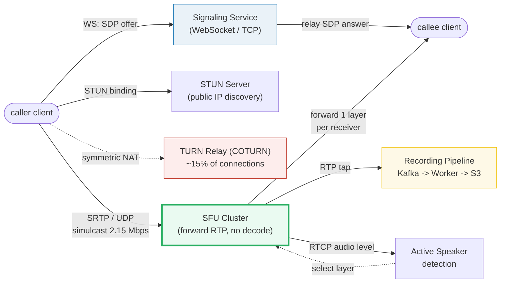
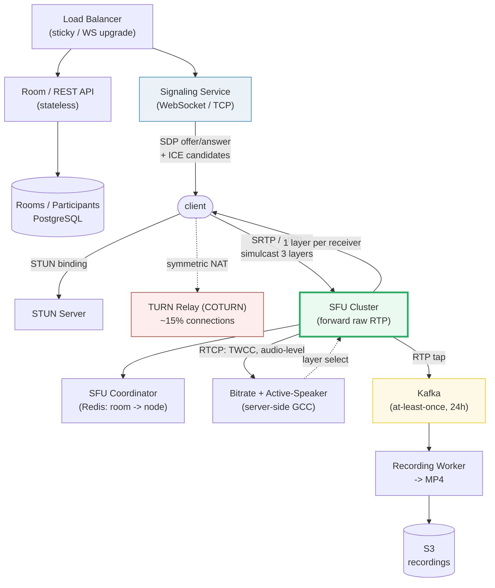

# Design a Video Conferencing System

> **Companion code:** [`video_conferencing.py`](https://github.com/quanhua92/tutorials/blob/main/systemdesign/video_conferencing.py).
> **Live demo:** [`video_conferencing.html`](https://github.com/quanhua92/tutorials/blob/main/systemdesign/video_conferencing.html) — open in a browser.

---

## 0. TL;DR — the one idea

> **The analogy:** a video call is a **post office that never opens your mail**. An **SFU**
> (Selective Forwarding Unit) reads only the envelope (RTP header: SSRC, sequence number,
> timestamp) and re-addresses each packet to the right recipients — it never decodes, composites,
> or re-encodes the video. That single design choice is why Zoom/Meet/Teams scale to 1000-person
> webinars while adding only 2–10 ms of latency.

The whole system reduces to three hard problems: **(1)** route one sender's media to N receivers
without melting client bandwidth (SFU beats P2P's O(n²) and MCU's CPU cost); **(2)** adapt each
receiver's stream to its own network (simulcast = 3 layers, SFU picks one); **(3)** punch through
NATs so UDP media actually reaches peers (ICE → STUN → TURN, where TURN is the expensive fallback).



---

## 1. Requirements

### Functional
- **Join / leave** video meetings with **audio + video** streams.
- Support meetings from **2-person calls up to 1000-person webinars**.
- **Screen sharing** as a separate video track.
- **Cloud recording** of meetings (async, decoupled from live media).
- **Active speaker detection** + adaptive gallery view (who's talking, at what resolution).
- Clients on **browser (WebRTC native)**, **mobile (iOS/Android SDK)**, and **desktop**.

### Non-Functional
- **Glass-to-glass latency** `< 150 ms` for meetings (`~300 ms` acceptable for webinars).
- **Media transport over UDP** (SRTP) — TCP retransmission delays are unacceptable.
- **Scale:** 300M daily participants, **~10M peak concurrent** (Zoom 2020 scale).
- Handle **~15–20% of connections requiring TURN relay** (symmetric NAT).
- **Availability:** recording failures must never affect live call quality.

---

## 2. Scale Estimation

> From `video_conferencing.py` **Section 7** (300M DAU, 10M peak concurrent, 2.15 Mbps simulcast
> upload, 2.40 Mbps gallery download, 15% TURN, 4 Gbps/SFU node w/ 10% headroom):

| Metric | Value |
|---|---|
| Daily participants | 300,000,000 |
| Peak concurrent participants | 10,000,000 |
| Simulcast upload / participant | 2.15 Mbps (1.5 + 0.5 + 0.15) |
| Gallery download / participant | 2.40 Mbps (1 high + 6 low) |
| **Peak ingress to SFUs** | **21.50 Tbps** |
| **Peak egress from SFUs** | **24.00 Tbps** |
| **SFU fleet (provisioned)** | **5,400 nodes** (6000 theoretical × 0.90 headroom) |
| TURN relay participants (15%) | 1,500,000 |
| TURN relay bandwidth | 6.8 Tbps (≈ 6.83 Tbps raw) |
| **TURN relay cost @ $0.0225/Mbps/hr** | **$153,000 / hr** (~$110M/month at peak) |
| Recording ingress (5% recorded) | 1.20 Tbps |

> From `video_conferencing.py` **Section 6** — per-room SFU egress and node packing:

| Room size | Room egress | Rooms per 4 Gbps SFU node |
|---|---|---|
| 4-person meeting | 9.60 Mbps | ~416 rooms/node |
| 50-person meeting | 120.00 Mbps | ~33 rooms/node |
| 1000-person webinar | 2.40 Gbps | ~1.7 rooms/node |

> A single 1000-person webinar nearly saturates a whole SFU node — big rooms land on dedicated
> nodes and use **cascaded SFUs** across regions.

---

## 3. Architecture



### Key Components

| Component | Technology | Why |
|---|---|---|
| **Signaling Service** | WebSocket over TCP | Reliable delivery for SDP offer/answer + ICE candidate exchange + room coordination. NOT on the media path. |
| **SFU (Selective Forwarding Unit)** | mediasoup / Janus / LiveKit | Forwards raw RTP packets — reads only headers (SSRC, seq, ts). No decode/encode. 2–10 ms added latency. Scales with bandwidth, not compute. |
| **STUN Server** | coturn / custun | Discovers the public IP:port (server-reflexive candidate). Resolves **~80–85%** of connections — cheap. |
| **TURN Relay (COTURN)** | coturn, deployed 20+ regions | Relays every media packet when direct UDP fails (symmetric NAT). **~15–20%** of connections — the expensive fallback (~$153K/hr at peak). |
| **SFU Coordinator** | Redis | Room-to-SFU assignment, health checks, failover. On node death → reassign rooms + ICE restart (new ice-ufrag/pwd), ~1 s frozen video. |
| **Bitrate + Active-Speaker** | TWCC + GCC + RTCP audio-level | Receivers report packet arrival timestamps every ~100 ms; SFU runs Google Congestion Control server-side. RTCP audio-level reports drive active-speaker selection. |
| **Recording Pipeline** | RTP tap → Kafka → Worker → S3 | Fully decoupled from the live media path. Kafka at-least-once + 24h retention; a crashed worker replays its partition from offset 0 idempotently. |

---

## 4. Key Design Decisions

### 4.1 Media routing topology

> From `video_conferencing.py` **Section 1** — at `n=10`, P2P upload/peer = **13.50 Mbps** (dead),
> MCU + SFU upload/peer = **1.50 Mbps** (flat); at `n=5` P2P already exceeds 5 Mbps home upload.

| Decision | Option A | Option B | Option C | Winner | Why |
|---|---|---|---|---|---|
| **Media routing** | **P2P mesh** (everyone → everyone) | **MCU** (server decodes+composites+encodes) | **SFU** (server forwards raw RTP) | **SFU** | P2P is O(n²) bandwidth, dead above ~4 participants. MCU keeps client bandwidth flat but is CPU-bound (O(n) decode+encode, +100–200 ms latency). SFU keeps client upload flat AND adds only 2–10 ms (no decode/encode) — the production standard for Zoom/Meet/Teams. |

**The crucial insight:** the SFU does **not** reduce total bandwidth — it **relocates** it from
clients (who can't afford the upload) to the datacenter (which can). At n=10, total media bytes =
135 Mbps either way; under P2P that's split across 10 home uplinks (impossible), under SFU it's the
server's 4 Gbps egress budget (fine). Simulcast (4.2) then turns relocation into a **real** reduction.

### 4.2 Adaptive bitrate via simulcast

> From `video_conferencing.py` **Section 2** — sender uploads **2.15 Mbps** (1.5 + 0.5 + 0.15) for
> all three layers; SFU forwards exactly ONE per receiver. In a 50-person room, mixed forwarding =
> **10.25 Mbps vs 75.00 Mbps forwarding high to all (7.3× less egress)**.

| Decision | Option A | Option B | Option C | Winner | Why |
|---|---|---|---|---|---|
| **Adaptive bitrate** | Server transcodes per receiver | Single stream + retransmit | **Simulcast** (sender encodes 3 layers, SFU picks one) | **Simulcast** | Transcoding is CPU-heavy (MCU-like). Single-stream can't adapt. Simulcast pushes the encode cost to the sender (cheap, local hardware) and keeps the SFU a pure router. Layer switch costs one RTCP PLI → IDR keyframe. |

| Layer | Resolution | Bitrate | Selected when receiver bandwidth… |
|---|---|---|---|
| high | 720p | 1.50 Mbps | ≥ 1.5 Mbps (active speaker) |
| medium | 360p | 0.50 Mbps | 0.5–1.5 Mbps (recent speaker) |
| low | 180p | 0.15 Mbps | 0.15–0.5 Mbps (gallery tile) |
| audio-only | — | ~0 | < 0.15 Mbps (bad network) |

### 4.3 Bandwidth estimation feedback

| Decision | Option A | Option B | Winner | Why |
|---|---|---|---|---|
| **Congestion feedback** | REMB (receiver-side estimate) | **TWCC** (transport-wide, receiver reports timestamps) | **TWCC** | TWCC sends raw packet-arrival timestamps every ~100 ms; the SFU runs GCC (Google Congestion Control) server-side. More accurate than legacy REMB, handles NAT path asymmetry. |

### 4.4 NAT traversal

> From `video_conferencing.py` **Sections 3 & 4** — ICE candidate split: host 3% / srflx (STUN)
> 82% / relay (TURN) 15%. TURN carries **both directions** at 4.55 Mbps/relay = **$153,000/hr** at peak.

| Decision | Option A | Option B | Winner | Why |
|---|---|---|---|---|
| **Candidate gathering** | Wait for all candidates, then connect | **Trickle ICE** (gather + check in parallel) | **Trickle ICE** | Candidates drip in over the WebSocket as found; setup drops from 2–5 s to 500 ms–1 s. |
| **Relay strategy** | Single centralized TURN | **Distributed COTURN in 20+ regions**, over-provisioned 3–4× | **Distributed** | TURN is the single largest cost line item. Corporate VPN/all-hands can push relay rates to 40–50%; cost scales linearly with relay fraction, so locality + headroom are mandatory. |

### 4.5 Active speaker + gallery view

| Decision | Option A | Option B | Winner | Why |
|---|---|---|---|---|
| **Who composites the gallery?** | Server composites (MCU-style) | **Client renders** from forwarded streams | **Client renders** | Server-side compositing reintroduces the MCU's CPU cost. The SFU forwards 1 high + ~6 low streams per receiver (2.40 Mbps) and each client tiles them locally. This is why a 1000-person room costs the server only ~7 streams/receiver, not 1000. |

---

## 5. Data Model

### `rooms` (PostgreSQL)

| Column | Type | Notes |
|---|---|---|
| `room_id` | UUID | **PK**, meeting identifier. |
| `host_id` | BIGINT | Meeting creator. |
| `status` | ENUM | `scheduled`, `active`, `ended`. |
| `max_participants` | INT | Capacity cap (e.g. 1000). |
| `recording_enabled` | BOOLEAN | Whether cloud recording is on. |
| `created_at` / `ended_at` | TIMESTAMP | Lifecycle. |

### `participants` (PostgreSQL)

| Column | Type | Notes |
|---|---|---|
| `participant_id` | BIGINT | **PK**. |
| `room_id` | UUID | **FK** → rooms. |
| `user_id` | BIGINT | **FK** → users. |
| `sfu_node` | VARCHAR | Assigned SFU node for media. |
| `joined_at` / `left_at` | TIMESTAMP | Presence history. |

### `sfu_assignment` (Redis — hot path)

| Key | Value | Notes |
|---|---|---|
| `room:{room_id}` | `sfu_node_id` | Fast room→node lookup + health/failover. |

### `recordings` (PostgreSQL + S3)

| Column | Type | Notes |
|---|---|---|
| `recording_id` | UUID | **PK**. |
| `room_id` | UUID | **FK** → rooms. |
| `s3_url` | VARCHAR | Final MP4 location. |
| `duration_sec` | INT | Recording length. |
| `status` | ENUM | `processing`, `ready`, `failed`. |

---

## 6. API Endpoints

| Method | Path | Body / Response | Notes |
|---|---|---|---|
| `POST` | `/api/rooms` | `{max_participants}` → `{room_id, join_url}` | Create a meeting (low QPS). |
| `GET` | `/api/rooms/{id}` | → `{room_id, status, participants[]}` | Room info + join token. |
| `WS` | `/api/signaling` | SDP offer/answer + ICE candidates | The entire WebRTC handshake (Section 3) flows here. |
| `POST` | `/api/rooms/{id}/recording/start` | → `{recording_id, status:"processing"}` | Taps RTP from SFU → Kafka. |
| `POST` | `/api/rooms/{id}/recording/stop` | → `{recording_id, status}` | Flushes Kafka partition. |
| `GET` | `/api/recordings/{id}` | → `{s3_url, duration_sec}` | Async; ready after worker assembles MP4. |

---

## 7. Deep dives

### The WebRTC handshake (Section 3)
> `createOffer → setLocalDescription → signaling relay → setRemoteDescription → createAnswer →
> ICE gathering (host/srflx/relay, trickled) → ICE connectivity checks → DTLS handshake → SRTP
> media → RTCP feedback (TWCC, PLI, audio-level)`. Media flows over **UDP/SRTP**; only the
> *setup* uses the reliable **WebSocket/TCP** signaling plane.

### NAT traversal economics (Section 4)
> STUN just discovers the public IP (cheap). TURN **relays every media packet** both directions —
> 4.55 Mbps per relayed participant (2.15 up + 2.40 down). At 15% of 10M concurrent that's
> **6.8 Tbps and $153,000/hr**. Over-provision COTURN 3–4×; corporate VPNs can push relay rates
> to 40–50% during all-hands meetings.

### Active speaker keeps download flat (Section 5)
> The SFU forwards **1 high (720p) + 6 low (180p) = 2.40 Mbps** per receiver regardless of room
> size. A 2-person call and a 1000-person webinar cost the *receiver* the same download. The
> server's per-receiver forwarding cost is ~7 streams, never proportional to participant count.

### Failure modes
- **SFU node failure:** coordinator detects missed heartbeats → reassigns rooms → **ICE restart**
  (new `ice-ufrag`/`ice-pwd`, preserves DTLS/SRTP state) → users see ~1 s frozen video, not a
  full reconnect.
- **Packet-loss cascade:** FEC (FlexFEC / RED+ULPFEC) adds 10–20% overhead but eliminates
  retransmission round-trips for isolated losses. Above ~5% loss, NACK retransmission storms
  cascade — switch to heavier FEC or lower layer.
- **Recording worker crash:** Kafka replay from offset 0; idempotent MP4 rebuild; the live call
  is unaffected because the RTP tap is read-only and decoupled.

---

### Killer Gotchas

- **SFU does NOT reduce total bandwidth — it relocates it.** P2P and SFU move the same number of
  bytes at n=10 (135 Mbps). The win is that the SFU's datacenter uplink can absorb it while 10 home
  uplinks cannot. Simulcast is what produces a *real* reduction (7.3× less egress in a 50-person room).
- **P2P dies at ~4 participants, not 10.** Each peer uploads `(n-1) × 1.5 Mbps`; at n=5 that's 6 Mbps,
  already over a typical 5 Mbps home upload. Don't propose mesh for anything beyond a 1:1 call.
- **TURN relays BOTH directions.** A relayed participant isn't 2.15 Mbps on the TURN server — it's
  2.15 up **and** 2.40 down = 4.55 Mbps. That's why 15% of traffic costs $153K/hr.
- **Media is UDP; signaling is TCP.** Mixing them up is the classic mistake. SDP/ICE setup tolerates
  TCP's retransmission; live RTP/RTCP cannot — a 200 ms head-of-line block from TCP retransmit
  wrecks the 150 ms glass-to-glass budget.
- **Layer switch needs an IDR keyframe.** Switching simulcast layers mid-stream can't resume on
  P-frames — the SFU sends an RTCP PLI so the sender emits an IDR. Budget for periodic keyframe spikes.
- **Big rooms are a different problem.** A 1000-person webinar's 2.4 Gbps egress nearly saturates one
  SFU node. Schedule big rooms onto dedicated nodes and use **cascaded SFUs** across regions rather
  than one mega-node.
- **SFU failover is an ICE restart, not a reconnect.** Reusing the DTLS/SRTP session (new ICE creds,
  same keys) turns a 5–10 s reconnect into ~1 s of frozen video. Forgetting this forces a full
  re-handshake on every node failure.
- **Recording must be off the live path.** A recording worker crash that blocks the SFU's media
  forwarding would drop the call. The RTP tap is one-way into Kafka; the live path never waits on it.

---

### Reproduce

```bash
python3 video_conferencing.py          # prints all sections + [check] OK
```

> From `video_conferencing.py` **Section 8 — GOLD CHECK** (values pinned for `video_conferencing.html`):

```
daily_participants             = 300000000
peak_concurrent                = 10000000
simulcast_upload_mbps          = 2.15
gallery_download_mbps          = 2.4
peak_ingress_tbps              = 21.5
peak_egress_tbps               = 24.0
stun_resolve_pct               = 82
turn_relay_pct                 = 15
relay_tbps                     = 6.8
turn_cost_usd_hr               = 153000
sfu_nodes_provisioned          = 5400
p2p_dead_above_participants    = 4
```

`[check] GOLD reproduces from topology + simulcast + scale constants? OK` — the gold badge
`check: OK` at the bottom of [`video_conferencing.html`](https://github.com/quanhua92/tutorials/blob/main/systemdesign/video_conferencing.html)
recomputes the topology bandwidth, simulcast layer selection, ICE split, TURN cost, and SFU fleet
math in JavaScript and confirms it matches the `.py` exactly.
