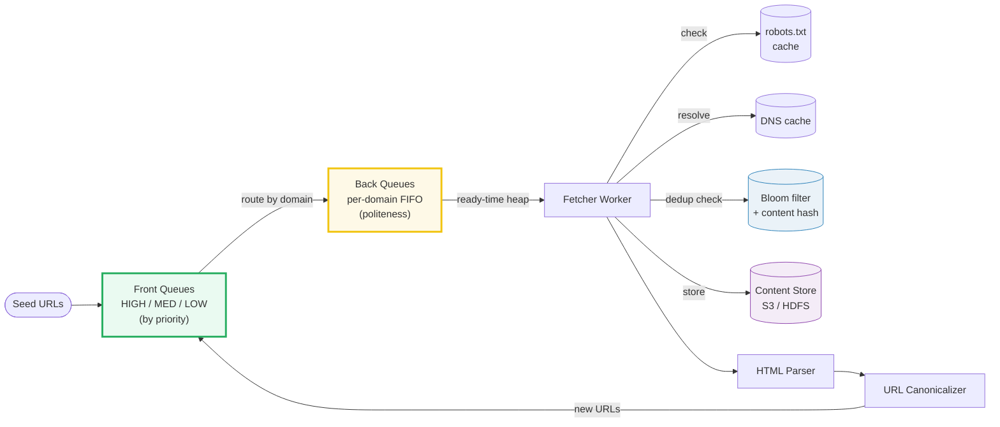
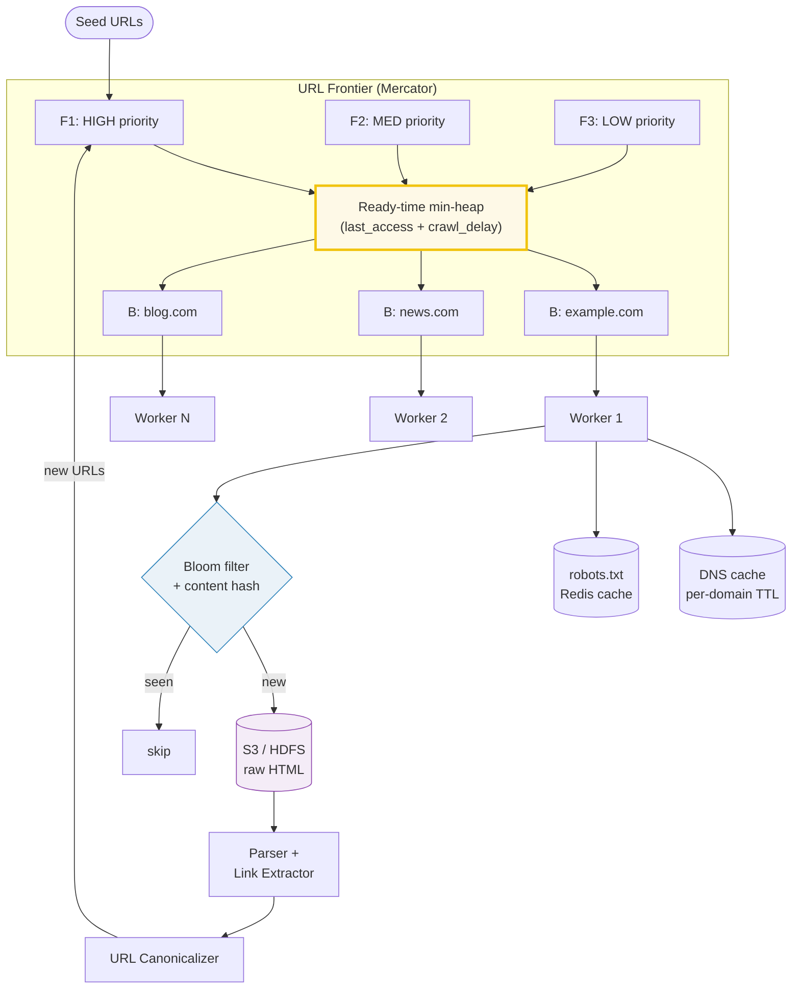

# Design a Web Crawler

> **Companion code:** [`web_crawler.py`](https://github.com/quanhua92/tutorials/blob/main/systemdesign/web_crawler.py).
> **Live demo:** [`web_crawler.html`](./web_crawler.html) — open in a browser.

---

## 0. TL;DR — the one idea

> **The analogy:** a web crawler is a library cataloguer with an infinitely
> growing to-read pile. You start with a few seed pages, fetch each one,
> extract the links, and add new ones to the pile. The hard part is
> **managing the pile**: what to crawl next (priority), when it's polite to
> fetch (per-domain rate limit), and how to avoid re-reading the same page
> (dedup). The **Mercator URL frontier** solves the first two by splitting
> the pile into **front queues** (priority) and **back queues** (one per
> domain), connected by a ready-time heap.

The Mercator design **decouples priority from politeness**: front queues
decide *what* matters (PageRank, freshness, user-submitted priority); back
queues decide *when* it's polite (per-domain crawl-delay). The ready-time
heap (`last_access + crawl_delay`) picks the domain whose next URL is most
ready. Different domains are fetched in **parallel**; same-domain fetches are
**serialized** by the back queue.

---

## 1. Requirements

### Functional
- Discover and fetch web pages starting from **seed URLs**.
- Parse pages and **extract links** for further crawling (BFS traversal).
- Store raw HTML + metadata (title, headers, fetch timestamp) for indexing.
- **Deduplicate** URLs (canonicalization + Bloom filter) and content (SHA-256 / SimHash).
- **Respect robots.txt** and per-domain **crawl-delay** (politeness).
- Re-crawl pages on a schedule for **freshness** (news sites daily, static pages monthly).

### Non-Functional
- **Scalability:** crawl **billions** of pages across **millions** of domains.
- **Politeness:** configurable per-domain crawl-delay; max concurrent connections per domain.
- **Fault tolerance:** tolerate worker failures, network errors, and malicious pages (at-least-once delivery, retry with backoff).
- **Freshness:** re-crawl important pages frequently, less important pages less often.
- **Extensibility:** support custom parsers for HTML, PDF, sitemaps, structured data.

---

## 2. Scale Estimation

> From `web_crawler.py` Section F:

| Metric | Value |
|---|---|
| Pages to crawl | 10,000,000,000 |
| Avg page size | 50 KB |
| Content storage | **466 TB** |
| URL frontier (URL + metadata, 100 B/URL) | **0.9 TB** |
| Peak fetch rate | 50,000 pages/sec |
| Bandwidth at peak | **20.5 Gbps** |
| Concurrent workers (~1 s/page) | ~50,000 |

**Bloom filter for URL dedup (10B URLs, 1% false-positive):**

| Parameter | Formula | Value |
|---|---|---|
| `m` (bits) | −n · ln(p) / (ln 2)² | 95,850,583,773 bits |
| **size** | m / 8 | **11.2 GB** |
| `k` (hash functions) | (m/n) · ln 2 | **7** |

**Freshness & politeness capacity:**

| Metric | Value |
|---|---|
| Re-crawl window | 30 days |
| Daily re-crawl volume | 333,333,333 pages/day |
| Re-crawl rate | 3,858 pages/sec |
| Politeness max (1M domains × avg delay 5 s) | 200,000 pages/sec |

---

## 3. Architecture

### Key Components

| Component | Technology | Why |
|---|---|---|
| URL Frontier | **Mercator design** (front + back queues + heap) | decouples priority from politeness; O(1) per-domain rate limiting |
| Front queues | Kafka topics partitioned by priority | horizontal scale; weighted consumer selection |
| Back queues | per-domain FIFO in worker memory | serialize same-domain fetches; enforce crawl-delay |
| Fetcher workers | async HTTP client (aiohttp, reqwest) | thousands of concurrent fetches per worker; I/O bound |
| DNS cache | local cache + Redis (per-domain TTL) | avoid 50 ms DNS lookup on repeat; ~67% time saved |
| robots.txt cache | Redis with TTL (per-domain) | fetch once, cache; respect Disallow/Allow/Crawl-delay |
| URL dedup | **Bloom filter** (11.2 GB @ 10B URLs) + URL DB | probabilistic negative check; zero false negatives |
| Content dedup | SHA-256 (exact) + SimHash (near-duplicate) | catch mirror pages, boilerplate, copied content |
| Content store | S3 / HDFS (object store) | cheap bulk storage for 466 TB of raw HTML |
| URL metadata DB | Cassandra (partitioned by domain) | high write throughput; domain-partitioned for politeness |

### Crawl flow (end-to-end)

1. **Seed** URLs enter the **front queues** by priority.
2. URLs are **routed to back queues** by domain (priority order preserved per domain).
3. The **ready-time heap** picks the back queue whose head URL is most ready (`now ≥ last_access + crawl_delay`).
4. **Fetcher worker** dequeues the URL, checks **robots.txt** cache, resolves **DNS**, fetches the page.
5. **Bloom filter** check: if URL was seen, skip; if new, compute **content hash**, check for near-duplicates.
6. If new content: store raw HTML to **S3**, parse links, **canonicalize** new URLs.
7. New canonical URLs go back to the **front queues** → cycle continues.

---

## 4. Key Design Decisions

> From `web_crawler.py` Section A (Mercator frontier) and Section B (BFS):

### 4a. Frontier architecture

| Decision | Single priority queue | Per-domain queues (Mercator) | Distributed (Kafka partitioned by domain hash) |
|---|---|---|---|
| **Politeness** | ❌ no domain awareness | ✅ one queue per domain | ✅ partition by domain |
| **Priority** | ✅ global ordering | ✅ front queues (HIGH/MED/LOW) | ⚠️ per-partition only |
| **Scalability** | ❌ single bottleneck | ⚠️ single machine | ✅ horizontal |
| **Complexity** | low | medium | high |

**Winner: Mercator (per-domain back queues) + Kafka at scale.** Partition
Kafka topics by domain hash so all URLs for one domain land on the same
consumer → politeness is automatic. Front queues provide priority within each
partition.

> From `web_crawler.py` Section A: 7 URLs across 3 domains. At t=0, three
> **different** domains are fetched in parallel. blog.com (delay=1s) →
> fetched at [0, 1]; example.com (delay=2s) → [0, 2, 4]; news.com (delay=5s)
> → [0, 5]. Total: 7 URLs in 5s, not 35s, because domain delays are
> independent.

### 4b. Traversal strategy

| Strategy | Coverage | Risk | Best for |
|---|---|---|---|
| **BFS** | broad (shallow first) | needs large frontier | general web crawl |
| DFS | deep (one site fully) | spider traps, misses breadth | single-site crawl |
| **Priority-based** | importance-first | needs PageRank/freshness signal | search engine indexing |

**Winner: BFS within each priority tier.** BFS gives broad coverage before
going deep. Priority (PageRank, freshness) is layered on top via front
queues. DFS is rejected because it risks getting trapped in deep sites.

> From `web_crawler.py` Section B: BFS on a 6-node graph. Crawl order
> A→B→C→D→E→F. Node D is a cross-link (discovered by both B and C); the
> **seen set** deduplicates it — 1 duplicate detected, 6 pages crawled.

### 4c. Deduplication strategy

| Layer | Mechanism | Cost | False negative | False positive |
|---|---|---|---|---|
| URL canonicalization | normalize host/query/fragment | ~0 | 0 | 0 (exact) |
| **Bloom filter** | probabilistic bit set | ~10 bits/URL | **0** | ~1% (tunable) |
| Content hash (SHA-256) | exact content fingerprint | 32 B/page | 0 | 0 (exact) |
| SimHash | near-duplicate fingerprint | 8 B/page | 0 | < 1% (Hamming distance) |

**Winner: three-layer pipeline.** Canonicalize → Bloom filter (fast negative
check) → content hash (catch mirrors). The Bloom filter has **zero false
negatives** (never misses a seen URL) and ~1% false positives (rarely
re-crawls an already-seen URL — acceptable). At 10B URLs it costs only
**11.2 GB** vs 0.9 TB for a full URL set.

> From `web_crawler.py` Section D: 4 URL variants
> (`Example.com/a?b=2&a=1`, `www.example.com/a?a=1&b=2`, `#fragment`,
> trailing `/`) all collapse to **one** canonical URL — 75% dedup rate.
> Bloom filter with m=958 bits, k=7: 0 false negatives on 50 inserted URLs.

### 4d. Distributed coordination

| Decision | Option A | Option B | Winner |
|---|---|---|---|
| **Frontier storage** | Kafka (partitioned by domain hash) | shared DB table | **Kafka** — domain partitioning gives free politeness |
| **DNS resolution** | per-worker local cache | shared DNS resolver service | **local cache** — DNS is per-domain, cacheable; avoids shared bottleneck |
| **robots.txt** | Redis cache (per-domain TTL) | fetch on every request | **Redis** — 1M domains, fetch once, cache 24h |

---

## 5. Data Model

### URL metadata (Cassandra — partitioned by domain)

| Column | Type | Notes |
|---|---|---|
| `domain` | VARCHAR | partition key (for politeness co-location) |
| `url_hash` | VARCHAR | SHA-256 of canonical URL, clustering key |
| `raw_url` | TEXT | original URL before canonicalization |
| `status` | VARCHAR | `pending`, `fetching`, `fetched`, `failed` |
| `priority` | INT | front-queue tier (0=HIGH, 1=MED, 2=LOW) |
| `crawl_depth` | INT | BFS depth from seed |
| `last_crawled_at` | TIMESTAMP | for freshness scheduling |
| `content_hash` | VARCHAR | SHA-256 of page content (dedup) |
| `http_status` | INT | last fetch HTTP status code |
| `retry_count` | INT | transient failure retries |

### Page content (S3 / HDFS)

| Key | Value | Notes |
|---|---|---|
| `{url_hash}.html` | raw HTML blob | ~50 KB average; gzip-compressed |
| `{url_hash}.meta` | JSON (title, headers, links) | extracted metadata |

### Domain politeness (Redis — per-domain, TTL)

| Key pattern | Type | Fields | TTL |
|---|---|---|---|
| `robots:{domain}` | String | raw robots.txt | 24 h |
| `delay:{domain}` | String | crawl_delay (seconds) | 24 h |
| `dns:{domain}` | String | resolved IP | 300 s |
| `lastaccess:{domain}` | String | last fetch timestamp | crawl_delay |

---

## 6. API Endpoints

| Method | Path | Description |
|---|---|---|
| POST | `/api/crawl/seed` | add seed URLs to the frontier |
| GET | `/api/crawl/status` | check crawl progress (queue depth, pages/sec, error rate) |
| POST | `/api/crawl/pause/{domain}` | pause crawling for a specific domain |
| GET | `/api/crawl/page/{url_hash}` | retrieve stored page content + metadata |
| PUT | `/api/crawl/priority/{url_hash}` | boost a URL's priority in the frontier |

---

## 7. Killer Gotchas

- **Spider traps (infinite URL spaces):** dynamic calendars, session-ID URLs,
  and auto-generated pagination create infinitely deep paths. The crawler
  loops forever within one site. **Fix:** enforce a max crawl-depth per domain,
  detect URL-pattern repetition (same path prefix with incrementing IDs), and
  cap URLs-per-domain. The Mercator back-queue design helps: a trapped domain
  only blocks its own back queue, not the whole crawl.
- **Politeness = per-domain, not global:** the biggest misconception is
  thinking crawl-delay slows the whole crawler. It only serializes fetches to
  the **same** domain. Different domains are fetched in parallel. At t=0, 3
  different domains fetch simultaneously (see `web_crawler.py` Section A).
- **Bloom filter false positives waste bandwidth (not correctness):** a 1% FP
  rate means ~1% of URLs are re-fetched unnecessarily. This is acceptable
  (idempotent) but tunable: lowering FP from 1% to 0.1% increases memory from
  11.2 GB to 16.8 GB. **Never** accept false negatives — the filter is a
  superset of the true seen-set.
- **robots.txt Crawl-delay vs custom delay:** some sites specify
  `Crawl-delay: 30` (30 seconds between requests). If you naively honor this,
  a single site with 10K pages takes 83 hours. **Fix:** cap the honored
  crawl-delay (e.g. max 10s) and use a global concurrency limit.
- **DNS as a hidden bottleneck:** each uncached DNS lookup is ~50 ms. With
  50K fetches/sec and no cache, that's 2,500 DNS lookups/sec — your resolver
  becomes the bottleneck. **Fix:** per-worker DNS cache with TTL (~300s).
  `web_crawler.py` Section C shows 67% time savings with caching.
- **Content churn defeats exact dedup:** pages with dynamic content (ads,
  timestamps, "X users online") produce different SHA-256 hashes every fetch,
  even though the page is effectively the same. **Fix:** use **SimHash**
  (64-bit fingerprint, Hamming distance ≤ 3 = near-duplicate) instead of
  exact SHA-256 for content dedup.
- **URL canonicalization edge cases:** stripping `www.` is usually correct but
  some sites serve different content on `www.` vs bare domain. Sorting query
  params breaks if a param is meaningful only in order. Always strip
  tracking params (`utm_*`, `fbclid`, `gclid`) before canonicalization.
- **Worker failure = at-least-once delivery:** a worker that crashes after
  fetching but before marking `fetched` will have its URL re-queued. The page
  gets fetched twice. This is acceptable (idempotent storage) but the content
  hash must be checked before storing to avoid duplicate entries.

---

## 8. Follow-Up Questions

- **Incremental crawling (re-crawl updated pages)?** Track `last_modified`
  header and `ETag` per URL. Prioritize re-crawl by change frequency: news
  sites daily, forums hourly, static pages monthly. Use the priority front
  queues — updated pages get HIGH priority.
- **Crawler traps detection?** Cap URLs-per-domain (e.g. 100K). Detect URL
  pattern repetition (path depth > 10, repeating path segments). Log domains
  that exceed the cap and quarantine them.
- **JavaScript-rendered pages?** Two-tier crawl: fast tier (static HTML with
  aiohttp) for 95% of pages, slow tier (headless Chrome / Puppeteer) for
  JS-heavy sites. The slow tier is throttled more aggressively (higher cost
  per page).
- **Prioritize re-crawl for freshness?** Priority signal = `change_frequency
  × importance`. Pages that change often (news) and are important (high
  PageRank) get re-crawled first. Store `avg_change_interval` per URL and
  schedule re-crawl at `last_crawled + avg_change_interval`.
