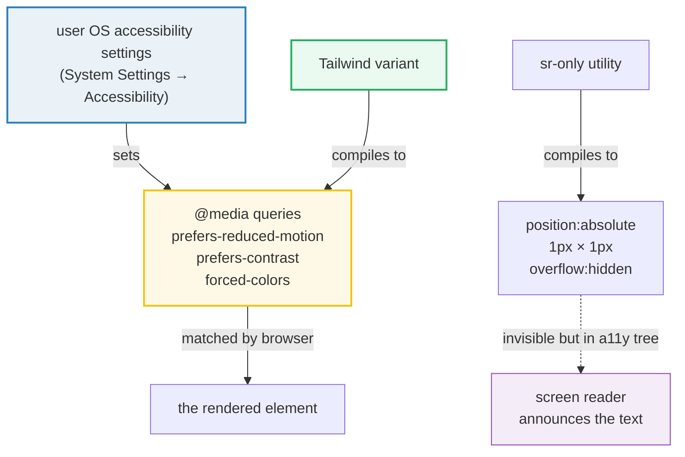

# Accessibility Variants

> **Companion demo:** [`a11y_variants.html`](./a11y_variants.html) — open in a browser.
> **Tailwind version:** v4.3.x via `@tailwindcss/browser@4` Play CDN.
> **Specs:** CSS Media Queries Level 5 (`prefers-reduced-motion`, `prefers-contrast`,
> `forced-colors`), CSS Selectors Level 4 (`:focus-visible`, `:focus-within`).

---

## 0. TL;DR — the one idea

> **Every a11y variant is a 1:1 wrapper around a real CSS `@media` query (or
> pseudo-class) the browser already honors from the user's OS accessibility
> settings.** Tailwind adds no magic — `motion-safe:animate-bounce` becomes
> `@media (prefers-reduced-motion: no-preference) { …animate-bounce… }`, so the
> keyframes simply *cease to exist* for users who enabled Reduce Motion. You get
> correct-by-default accessibility with zero JavaScript feature-detection.



| Variant / utility | Compiles to | Fires when… |
|-------------------|-------------|-------------|
| `motion-safe:`    | `@media (prefers-reduced-motion: no-preference)` | user has NOT enabled "Reduce Motion" — safe to animate |
| `motion-reduce:`  | `@media (prefers-reduced-motion: reduce)`        | user HAS enabled "Reduce Motion" — provide a still fallback |
| `contrast-more:`  | `@media (prefers-contrast: more)`                | user enabled "Increase Contrast" — add stronger borders/outlines |
| `forced-colors:`  | `@media (forced-colors: active)`                 | Windows High Contrast mode — palette overridden to a 16-color system set |
| `focus-visible:`  | `:focus-visible` pseudo-class                    | element focused AND browser heuristic says "show ring" (keyboard, not mouse) |
| `focus-within:`   | `:focus-within` pseudo-class                     | element OR any descendant has focus |
| `sr-only` (utility)    | `position:absolute; width:1px; height:1px; overflow:hidden; …` | always — visually hidden, still in the a11y tree |
| `not-sr-only` (utility)| undoes `sr-only` (resets position/size/overflow) | show-on-focus pattern: reveal a skip-link when it receives focus |

---

## 1. How it works — each variant in 30 seconds

### `motion-safe:` / `motion-reduce:` — the motion preference pair

```html
<!-- The bounce keyframes only EXIST when motion is OK. No JS feature-detect. -->
<div class="motion-safe:animate-bounce">Bouncing (if motion is OK)</div>

<!-- Pair with motion-reduce: for an explicit still fallback. -->
<a class="motion-safe:animate-pulse motion-reduce:underline">link</a>
```

The two are **mutually exclusive** complements of the same query:

- `motion-safe:`  → `@media (prefers-reduced-motion: no-preference)`
- `motion-reduce:` → `@media (prefers-reduced-motion: reduce)`

The third state (the user has *no preference set at all*) is grouped with
`motion-safe` — the spec defines `no-preference` as "user has not expressed a
reduction preference," which is the default. **Note:** there is no
`motion-only:` — if you want motion that *only* runs when the user explicitly
wants it, that does not exist in the platform; `motion-safe` is as close as it
gets (it runs unless the user opted out).

### `contrast-more:` — on-demand visual weight

```html
<div class="border border-slate-600
            contrast-more:border-2 contrast-more:border-black
            contrast-more:font-bold">
  Faint normally, bold + thick border when the user needs it.
</div>
```

Compiles to `@media (prefers-contrast: more)`. There is **no** `contrast-less:`
in v4 (it was proposed then dropped — the spec defines `prefers-contrast: less`
but Tailwind ships only `contrast-more`). Low-vision users get the upgrade only
when they asked for it; your default design stays untouched for everyone else.

### `forced-colors:` — Windows High Contrast mode

```html
<button class="forced-colors:border-CanvasText forced-colors:bg-ButtonFace">
  survives Windows High Contrast themes
</button>
```

Compiles to `@media (forced-colors: active)`. This is a **separate concern**
from `contrast-more`: High Contrast mode doesn't just darken things — it
**overrides your entire palette** to a fixed system color set (`CanvasText`,
`ButtonFace`, `WindowText`, …). Gradients vanish, `border-color: transparent`
becomes invisible, and SVG icons often disappear. Use `forced-colors:` to
restore the borders and fills that break.

### `focus-visible:` — the keyboard-only focus ring

```html
<button class="focus:outline-none focus-visible:ring-2 focus-visible:ring-cyan-400">
  Ring on Tab, no ring on click
</button>
```

This is the **a11y-correct focus pattern**. `focus:` matches *any* focus
(including a mouse click → ugly ring on every click). `focus-visible:` matches
only when the browser's heuristic decides the user is navigating by keyboard.
The `:focus-visible` heuristic is defined by the browser (roughly: was the last
input a key press? is this an always-focusable text field?), so you don't have
to guess. Always pair `focus:outline-none` with `focus-visible:ring-*` — never
kill outline without a visible replacement (WCAG 2.4.7).

### `focus-within:` — style a wrapper when a child is focused

```html
<label class="focus-within:border-cyan-400 focus-within:ring-2 focus-within:ring-cyan-400/30">
  Email <input type="email" class="outline-none" />
</label>
```

Compiles to `:focus-within`. Brilliant for form fields and search bars: ring the
*whole* label/wrapper (a bigger, clearer target) when the input inside it has
focus. See [`group_peer.html`](./group_peer.html) — `group-focus-within:` is the
named-group version of the same pseudo.

### `sr-only` / `not-sr-only` — visually hidden, screen-reader visible

```html
<!-- Icon button gets a name screen readers can announce -->
<button>
  <svg aria-hidden="true">…</svg>
  <span class="sr-only">Close</span>
</button>

<!-- Skip-link: hidden until Tab focuses it, then it pops in -->
<a href="#main" class="sr-only focus:not-sr-only focus:absolute focus:top-2 focus:left-2 …">
  skip to main content
</a>
```

`sr-only` is a **utility**, not a variant — it always applies. It clips text to
a 1×1 px absolutely-positioned box with `overflow:hidden` and `clip:rect(0,0,0,0)`,
so it is invisible on screen but still in the DOM and the accessibility tree.
`not-sr-only` is its inverse, used to *reveal* the element (typically on focus).

---

## 2. Mechanism / internals

### The `@media` queries Tailwind emits

```css
/* motion-safe:animate-bounce */
.motion-safe\:animate-bounce {
  @media (prefers-reduced-motion: no-preference) {
    animation: var(--animate-bounce);
  }
}

/* motion-reduce:underline */
.motion-reduce\:underline {
  @media (prefers-reduced-motion: reduce) {
    text-decoration-line: underline;
  }
}

/* contrast-more:border-2 */
.contrast-more\:border-2 {
  @media (prefers-contrast: more) {
    border-width: 2px;
  }
}

/* forced-colors:border-CanvasText */
.forced-colors\:border-CanvasText {
  @media (forced-colors: active) {
    border-color: CanvasText;
  }
}
```

These are Media Queries Level 5 user-preference features. The browser reads
them from the OS in real time — change **System Settings → Accessibility →
Display → Reduce motion** on macOS (or the Windows equivalent) and the page
re-evaluates the query **without a reload**. The demo's `matchMedia()` readout
proves this: it prints the live state and re-polls on the `change` event.

### The `:focus-visible` heuristic

The browser decides `:focus-visible` matches based on an **internal heuristic**,
not a simple "was the key pressed" flag. The spec's intent (paraphrased):

- A keyboard Tab onto a button/div → `:focus-visible` matches → ring shows.
- A mouse click on that same button → focus moves, but `:focus-visible` does
  **not** match → no ring.
- A text input/textarea/contenteditable focused by **any** means (mouse or
  keyboard) → always matches (these always need a caret indicator).

That heuristic cannot be reliably faked from JS. `el.focus({ focusVisible: true })`
is a **Chromium-only** non-standard option that forces keyboard-style focus;
Firefox and Safari ignore the option and gate on the real last-input-was-key.
This is why the demo's gold-check treats `focus-visible` as best-effort and
falls back to "press Tab" on non-Chromium browsers.

### The `sr-only` CSS — the exact box

```css
.sr-only {
  position: absolute;
  width: 1px;
  height: 1px;
  padding: 0;
  margin: -1px;
  overflow: hidden;
  clip: rect(0, 0, 0, 0);
  white-space: nowrap;
  border-width: 0;
}
```

Every declaration is load-bearing:

| declaration | why |
|---|---|
| `position: absolute`            | take it out of flow so the 1px box doesn't shift layout |
| `width/height: 1px`             | smallest non-zero size (0px can be pruned by some AT) |
| `padding: 0; border-width: 0`   | don't inflate the 1px box |
| `margin: -1px`                  | pull it off-screen so it can't catch a scroll/overflow edge |
| `overflow: hidden`              | clip any text that overflows the 1px box |
| `clip: rect(0,0,0,0)`           | legacy IE/Edge clip — modern browsers also get `clip-path: inset(50%)` |
| `white-space: nowrap`           | a wrapping label could expand the box vertically |

`not-sr-only` resets all of the above (`position: static; width: auto; height:
auto; overflow: visible; clip: auto; …`). The demo's gold-check asserts the
exact `position:absolute / 1px / 1px / overflow:hidden` box via `getComputedStyle`.

---

## 3. Killer Gotchas

| trap | symptom | fix |
|------|---------|-----|
| `focus:outline-none` **without** `focus-visible:` | keyboard users get no focus ring at all — WCAG 2.4.7 failure | always pair `focus:outline-none` with `focus-visible:ring-*` (never kill outline without a visible replacement) |
| `focus-visible:` "doesn't work" after `.focus()` | programmatic `el.focus()` doesn't trigger `:focus-visible` in Firefox/Safari (heuristic-gated) | use `el.focus({ focusVisible: true })` (Chromium only) or require a real Tab; don't gate tests on it |
| expecting `contrast-less:` | it doesn't exist in v4 — `prefers-contrast: less` is in the spec but Tailwind ships only `contrast-more:` | if you need it, define `@custom-variant contrast-less (@media (prefers-contrast: less));` |
| icon button with **no** `sr-only` text or `aria-label` | screen reader announces "button" with no name | add `<span class="sr-only">Label</span>` **or** `aria-label="Label"` (don't use both — they can conflict) |
| `sr-only` element on a **visually hidden** parent | if an ancestor has `display:none` or `visibility:hidden`, the sr-only text is also gone from the a11y tree | sr-only hides *visually*, not semantically; hide the parent with a different technique if the text must remain reachable |
| `motion-reduce:` used **alone** without `motion-safe:` | fine — but remember it only styles the reduce branch; the default (no-preference) branch needs its own rule | pair them when you want a different style for each branch |
| `forced-colors:` confused with `contrast-more:` | they are different queries — High Contrast overrides your whole palette; Increase Contrast just asks for more weight | test both separately; forced-colors needs system-color keywords (`CanvasText`, `ButtonFace`) |
| animating with raw `animate-*` and **no** `motion-safe:` | the animation runs even for Reduce-Motion users — vestibular harm | wrap every decorative animation: `motion-safe:animate-spin` |
| `focus-within:` on a `<div>` that isn't focusable itself | works, but keyboard users can't reach the inner control if the wrapper eats the Tab | keep the actual focusable element (`<input>`, `<a>`) inside — `focus-within` reads from it |
| toggling OS prefs in CI/automated tests | `matchMedia` reflects the OS, which headless browsers can't easily flip | inject a `@media` override stylesheet in tests, or assert the compiled CSS rather than the live match |

---

## Cheat sheet

```html
<!-- 1. Motion: animate only if the user hasn't opted out -->
<div class="motion-safe:animate-bounce">…</div>
<div class="motion-safe:animate-pulse motion-reduce:opacity-80">…</div>

<!-- 2. Keyboard-only focus ring (THE accessible pattern) -->
<button class="focus:outline-none focus-visible:ring-2 focus-visible:ring-cyan-400
               focus-visible:ring-offset-2 focus-visible:ring-offset-black">…</button>

<!-- 3. Wrap a field: ring the label when the input is focused -->
<label class="block focus-within:ring-2 focus-within:ring-cyan-400 rounded-md">
  Email <input class="outline-none" />
</label>

<!-- 4. Label an icon button for screen readers -->
<button>
  <svg aria-hidden="true">…</svg>
  <span class="sr-only">Delete</span>
</button>

<!-- 5. Skip-link: hidden until Tab focuses it -->
<a href="#main" class="sr-only focus:not-sr-only focus:absolute focus:top-2
                       focus:left-2 focus:z-50 focus:bg-cyan-500 focus:text-black">skip to content</a>

<!-- 6. On-demand high contrast -->
<div class="border border-slate-600
            contrast-more:border-2 contrast-more:border-black contrast-more:font-bold">…</div>

<!-- 7. Survive Windows High Contrast mode -->
<button class="forced-colors:border-CanvasText forced-colors:bg-ButtonFace">…</button>
```

```css
/* Custom variant: add the missing contrast-less: (spec-defined, not shipped) */
@custom-variant contrast-less (@media (prefers-contrast: less));

/* Custom variant: prefers-color-scheme dark (if you don't use the `dark:` built-in) */
@custom-variant dark (@media (prefers-color-scheme: dark));
```

---

## 🔗 Cross-references

- **[`directional_media`](./directional_media.html)** — the other "system-state"
  variant family: `rtl:` / `ltr:` (writing direction via `dir=`), `print:`
  (print stylesheet), `open:` (`<details>`/`<dialog>` open state). Same
  "wraps a real `@media` / attribute selector" model as the a11y variants here.
- **[`group_peer`](./group_peer.html)** — `group-focus-within:` is the named-group
  version of `:focus-within` shown here; `peer-focus-visible:` lets a sibling
  react to another element's keyboard focus. The combinator mechanics there
  compose with the pseudo-classes here.
- **[`form_state`](./form_state.html)** — `required:` / `valid:` / `invalid:` /
  `read-only:` variants. Pair `invalid:ring-red-500` with `contrast-more:` to
  make form errors legible for low-vision users, and always give invalid fields
  a `sr-only` error message.
- Companion onboarding: [`../frontend/tailwind/tailwind_responsive_variants.html`](../frontend/tailwind/tailwind_responsive_variants.html)
  — responsive variants (`sm:`/`md:`/`lg:`) react to the **viewport**; a11y
  variants react to the **user**. Same prefix syntax, different trigger source.

---

## Sources

1. **Tailwind CSS — Accessibility documentation** (v4, "Screen readers", "Reduced
   motion" sections): the canonical descriptions of `sr-only` / `not-sr-only`,
   `motion-safe` / `motion-reduce`, and the `focus-visible`-with-ring pattern.
   <https://tailwindcss.com/docs/screen-readers> · <https://tailwindcss.com/docs/hover-focus-and-other-states>
2. **MDN Web Docs — `:focus-visible`**: the browser heuristic, programmatic-focus
   behavior, and why it differs from `:focus` (Selecters Level 4).
   <https://developer.mozilla.org/en-US/docs/Web/CSS/:focus-visible>
3. **MDN Web Docs — Media Queries Level 5 user preferences**:
   `prefers-reduced-motion`, `prefers-contrast`, `forced-colors` — the underlying
   `@media` features every variant above wraps.
   <https://developer.mozilla.org/en-US/docs/Web/CSS/@media/prefers-reduced-motion> ·
   <https://developer.mozilla.org/en-US/docs/Web/CSS/@media/prefers-contrast> ·
   <https://developer.mozilla.org/en-US/docs/Web/CSS/@media/forced-colors>
4. **W3C WCAG 2.2 — Success Criteria 2.4.1 (Bypass Blocks) & 2.4.7 (Focus
   Visible)**: the regulatory reason the skip-link + `focus-visible:` ring
   patterns exist. <https://www.w3.org/WAI/WCAG22/quickref/>
