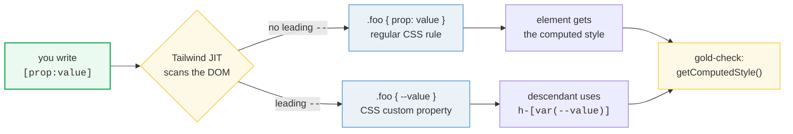
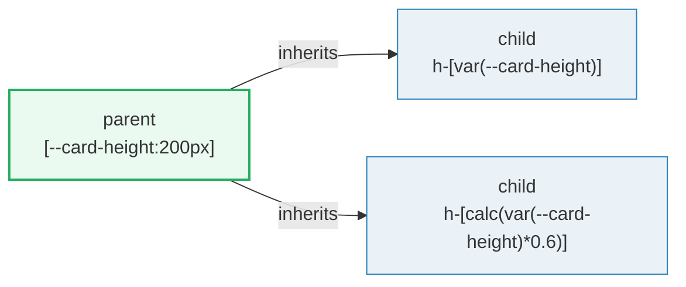

# Arbitrary Properties

> **Companion demo:** [`arbitrary_properties.html`](./arbitrary_properties.html) — open in a browser.
> The gold-check proves both `[text-wrap:balance]` and `[--card-height:200px]` land in `getComputedStyle()`.

---

## 0. TL;DR — the one idea

Tailwind ships thousands of utilities, but the CSS spec has thousands more
properties it will *never* cover — `mask-type`, `text-wrap`, `hyphens`,
`writing-mode`, `scroll-snap-type`, `caret-color`. Arbitrary **properties** are
the escape hatch: any CSS property, inline, with square brackets.



The syntactic landmark: the bracket **starts the token** (`[prop:…]`), unlike
arbitrary *values* which follow a utility prefix (`w-[17rem]`). That single
difference is the entire mental model.

---

## 1. Arbitrary VALUE vs arbitrary PROPERTY — the comparison

Both use square brackets and both go through the JIT, but they target different
layers of CSS. Getting this distinction right makes the entire bracket syntax
predictable.

| aspect | arbitrary **VALUE** `w-[17rem]` | arbitrary **PROPERTY** `[mask-type:luminance]` |
|---|---|---|
| shape | `utility-[value]` | `[property:value]` — note the leading `[` |
| what it does | feeds a custom value into a known utility (width, padding, color) | sets a CSS property that has **no** Tailwind utility |
| type hint | supported: `w-[length:17rem]`, `bg-[color:var(--x)]` | not used — the part before `:` IS the property name |
| generated CSS | `.w-\[17rem\] { width: 17rem }` | `.\[mask-type\:luminance\] { mask-type: luminance }` |
| set a CSS var? | read only — `bg-[var(--brand)]` | yes — `[--card-height:200px]` writes a custom property |
| variants | yes — `hover:w-[17rem]` | yes — `focus:[caret-color:#06b6d4]` |
| underscore→space | yes — `grid-cols-[1fr_2fr]` | yes — `[scroll-snap-type:y_mandatory]` |

**Rule of thumb:** if Tailwind already has a utility prefix for it (`w-`, `p-`,
`bg-`, `text-`, `grid-cols-`…), you want an arbitrary *value*. If you find
yourself wishing for a utility that doesn't exist (mask-type, text-wrap,
hyphens…), you want an arbitrary *property*.

---

## 2. How the JIT turns `[prop:value]` into CSS

1. The Play CDN / build-time JIT scans the DOM for class tokens matching `^\[([a-z-]+):(.+)\]$`.
2. If the captured property starts with `--`, it is emitted verbatim as a custom
   property declaration: `.--card-height\:200px { --card-height: 200px }`.
3. Otherwise the captured value has `_` replaced with a space and the pair is
   emitted as a normal declaration: `.\[text-wrap\:balance\] { text-wrap: balance }`.
4. The class itself is CSS-escaped (brackets, colons, `#`, etc. all backslashed),
   so the selector survives the DOM round-trip.

There is no allowlist — any syntactically valid CSS property name will compile.
The browser is the only thing that decides whether the rule has an effect.

---

## 3. The CSS custom property pattern

The form `[--name:value]` is sugar for declaring a CSS custom property on the
element. Combine it with an arbitrary **value** on a child and you have a
zero-config token bridge:

```html
<!-- Parent declares tokens inline -->
<div class="[--card-height:200px] [--card-accent:#06b6d4]">
  <!-- Children consume them -->
  <div class="h-[var(--card-height)] border-[color:var(--card-accent)]">
    A child whose height and border color come from the parent.
  </div>
  <div class="h-[calc(var(--card-height)*0.6)]">
    Arithmetic on the token via calc().
  </div>
</div>
```



Why use this instead of `@theme`? `@theme` is **global**. Inline custom
properties are **scoped** to the element — perfect for one-off cards, popover
panels, or any place a parent wants to feed a value into a child without
polluting the design system.

The gold-check in the demo asserts this pattern directly:

```js
// arbitrary property set on the host
getComputedStyle(cardHost).getPropertyValue('--card-height') === '200px'
// arbitrary value consuming it on a child
getComputedStyle(child).height === '200px'
```

---

## 4. Combining with variants

Arbitrary properties stack with variants exactly like any other utility —
prefix with the variant and a colon:

```html
<input class="focus:[caret-color:#06b6d4]" />
<div class="[@supports(text-wrap:balance)]:[text-wrap:balance]">…</div>
<li class="[:hover]:[text-decoration:underline]">…</li>
```

The variant prefix and the bracket token are independent — the JIT parses the
prefix first, then the bracket. See [`ARBITRARY_VARIANTS.md`](./ARBITRARY_VARIANTS.md)
for the full variant grammar.

---

## 5. Killer Gotchas

| trap | symptom | fix |
|---|---|---|
| `[hyphens:auto]` with no `lang=` | Rule is in the stylesheet but text never hyphenates — browser has no dictionary | Set `lang="en"` (or the relevant code) on the element or an ancestor |
| Forgetting underscore → space | `[scroll-snap-type:y mandatory]` (literal space) breaks the class token — Tailwind can't match it across whitespace | Use `_`: `[scroll-snap-type:y_mandatory]`. If you need a literal `_`, escape it: `\_` |
| Treating it like an arbitrary value | Writing `text-[text-wrap:balance]` and wondering why nothing applies — there is no `text-` utility that takes a property | The bracket must be FIRST: `[text-wrap:balance]` |
| Adding a type hint | `[length:mask-type:luminance]` — type hints are an arbitrary-*value* feature, they corrupt the property name here | Drop the hint. The hint lives after a utility prefix, not before a property |
| `text-wrap:balance` browser support | Nothing changes in older Safari / pre-114 Chrome | It degrades silently (greedy wrap). Either accept that or pair with `@supports` |
| Vendor prefix needed | `-webkit-line-clamp: 3` written as `[-webkit-line-clamp:3]` works, but `line-clamp:3` may not | Use the prefixed form; Tailwind does not auto-prefix arbitrary properties |
| Escaping `#` or `()` in URLs | `[mask-image:url(/x.png)]` is fine, but `[background:url('a b.png')]` (space in path) needs `_` or escaping | Replace spaces with `_` or URL-encode the path |

---

### Cheat sheet

```html
<!-- Set a property with no utility -->
<div class="[mask-type:luminance]"></div>
<h3 class="[text-wrap:balance]">Balanced headline</h3>
<div class="[writing-mode:vertical-rl]">Vertical text</div>
<p lang="en" class="[hyphens:auto]">Longwordsthatoverflow</p>

<!-- Multi-word value: underscore becomes a space -->
<div class="[scroll-snap-type:y_mandatory]"></div>

<!-- CSS custom property shorthand -->
<div class="[--card-height:200px]">
  <div class="h-[var(--card-height)]"></div>
</div>

<!-- Stack with variants -->
<input class="focus:[caret-color:#06b6d4]" />

<!-- Literal underscore: escape with backslash -->
<div class="[--my-var:foo\_bar]"></div>
```

---

## 🔗 Cross-references

- **[`ARBITRARY_VALUES.md`](./ARBITRARY_VALUES.md)** — the sibling concept. Custom
  *value* for an existing utility (`w-[17rem]`, `bg-[url(...)]`). Read this to
  nail the value-vs-property distinction.
- **[`ARBITRARY_VARIANTS.md`](./ARBITRARY_VARIANTS.md)** — variant grammar. Pair
  an arbitrary property with a variant: `focus:[caret-color:#06b6d4]`,
  `[:hover]:[text-wrap:balance]`.
- **[`FUNCTIONAL_UTILITY.md`](./FUNCTIONAL_UTILITY.md)** — when an inline value
  isn't enough and you want a reusable utility that takes arguments
  (`@utility --value(integer)`). The "graduate" path from arbitrary property to
  first-class utility.
- **[`PROPERTY_DIRECTIVE.md`](./PROPERTY_DIRECTIVE.md)** — `@property` lets you
  *type* a custom property (animation-friendly, inherits-bypassing). Combine with
  inline `[--my-var:…]` to set a typed, animatable token on the fly.
- **[Tailwind docs — arbitrary properties](https://tailwindcss.com/docs/adding-custom-styles#using-arbitrary-properties)**
  (canonical syntax reference).
- **[MDN — CSS custom properties](https://developer.mozilla.org/en-US/docs/Web/CSS/--*)**
  (mechanics of `--name: value`).

---

## Sources

- Tailwind CSS — *Adding Custom Styles → Using arbitrary properties*. <https://tailwindcss.com/docs/adding-custom-styles#using-arbitrary-properties>. Verified 2026-06.
- MDN Web Docs — *CSS custom properties (--*)*. <https://developer.mozilla.org/en-US/docs/Web/CSS/--*>. Verified 2026-06.
- Can I Use — *CSS text-wrap: balance*. <https://caniuse.com/css-text-wrap-balance>. Verified 2026-06 (Chrome 114+, Safari 17.5+, Firefox 121+).
- MDN Web Docs — *hyphens*. <https://developer.mozilla.org/en-US/docs/Web/CSS/hyphens>. Verified 2026-06 (requires `lang=`).
