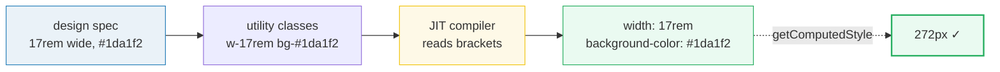
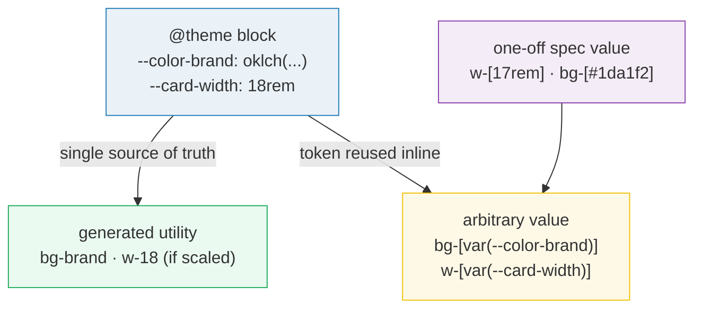
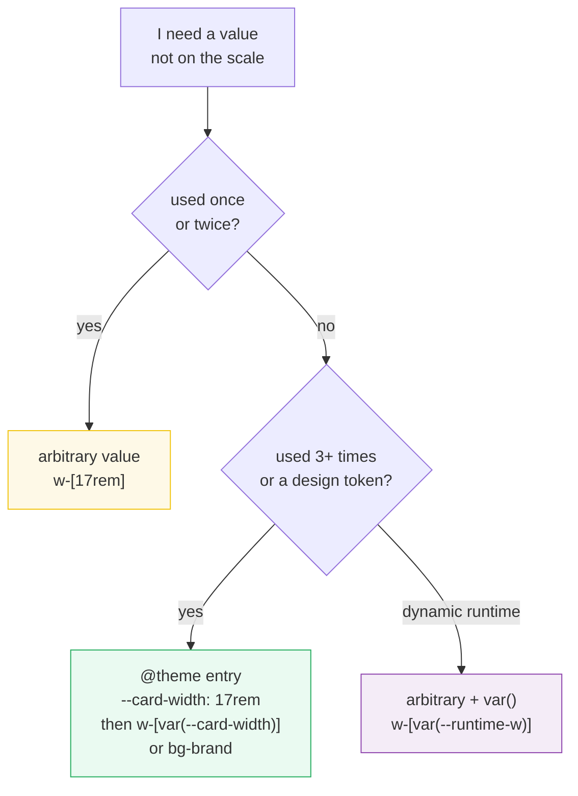

# Arbitrary Values

> **Companion demo:** [`arbitrary_values.html`](./arbitrary_values.html) — open in a browser.
> The gold-check proves `w-[17rem]` computes to `272px` (17 × 16).

---

## 0. TL;DR — the one idea

Tailwind ships a curated scale (`w-4`, `p-8`, `text-cyan-500`). Arbitrary values are
the **escape hatch**: any CSS value inline via square brackets — `w-[17rem]`,
`bg-[#1da1f2]`, `grid-cols-[1fr_2fr_1fr]`, `bg-[url('/hero.jpg')]`. No new utility,
no `@theme` entry, no plugin. The JIT compiler reads the brackets and emits exactly
one CSS rule.



**Use when:** a value is off the scale and you need it once. **Avoid when:** you use
the same value 3+ times — promote it to `@theme` and use the generated utility
(`bg-brand` beats `bg-[var(--brand)]` repeated everywhere).

---

## 1. How it works

Every Tailwind utility is a *function* of a value from a scale. `w-4` reads
`--spacing` (0.25rem) × 4. Arbitrary values bypass the scale and let you supply the
value directly, in brackets:

| syntax | example | compiled CSS |
|---|---|---|
| `[value]` | `w-[17rem]` | `width: 17rem` |
| `[type:value]` | `[color:#fff]` | `color: #fff` (type hint) |
| `[value/sub]` | `text-[#06b6d4]/40` | `color: rgb(6 182 212 / 0.4)` |
| `[_→space]` | `grid-cols-[1fr_2fr]` | `grid-template-columns: 1fr 2fr` |
| `[\_→_]` | `bg-[length:18px\_18px]` | `background-size: 18px 18px` |
| `[var(--x)]` | `bg-[var(--color-brand)]` | `background-color: var(--color-brand)` |
| `[url('…')]` | `bg-[url('/hero.jpg')]` | `background-image: url('/hero.jpg')` |

The brackets work on **any utility that accepts a value** — `w-`, `h-`, `p-`, `m-`,
`text-`, `bg-`, `border-`, `grid-cols-`, `z-`, `rotate-`, `content-`, `shadow-`, etc.

### Where arbitrary values sit in the system



Arbitrary values and `@theme` are **interoperable**, not competing: `@theme` defines
the source of truth; arbitrary-value utilities let you *use* that token anywhere a
utility is expected — or write a one-off value that doesn't deserve a token.

---

## 2. Syntax rules in depth

### 2a. Square brackets — the one-shot value

```html
<div class="w-[17rem] h-[350px] p-[13px] gap-[0.75rem]">
```

The JIT reads the bracket, validates the value fits the property, and emits one rule.
No theme entry, no plugin, no build config change.

### 2b. Type hints — disambiguating the compiler

Some values are ambiguous. `var(--x)` could be a color, a length, or anything. The
type hint prefix tells the JIT which CSS property to emit:

| hint | example | why you need it |
|---|---|---|
| `[color:…]` | `border-[color:var(--brand)]` | `border-[var(--brand)]` is ambiguous — could be `border-width` |
| `[length:…]` | `w-[length:var(--w)]` | force a length context for a `var()` |
| `[angle:…]` | `rotate-[angle:var(--spin)]` | `rotate-[45deg]` works, but `var()` needs the hint |
| `[url:…]` | `bg-[url('/x.jpg')]` | rare — usually the `url()` syntax is enough |

**Rule of thumb:** bare values (`#fff`, `17rem`, `45deg`) never need a hint. A bare
`var(--x)` almost always does, because the compiler can't infer the type from the
token name.

### 2c. Underscores → spaces

CSS class names can't contain spaces, but multi-value CSS properties need them. Inside
brackets, `_` becomes a space:

```html
<!-- grid-template-columns: 1fr 2fr 1fr -->
<div class="grid-cols-[1fr_2fr_1fr]">

<!-- transform: translateX(50%) rotate(45deg) -->
<div class="translate-x-1/2 rotate-45 ...">
<!-- or via arbitrary: -->
<div class="transform-[translateX(50%)_rotate(45deg)]">

<!-- box-shadow: 0 4px 12px rgba(0,0,0,.5) -->
<div class="shadow-[0_4px_12px_rgba(0,0,0,.5)]">
```

### 2d. Escaped underscores — literal `_`

When a value genuinely contains an underscore (a filename, a CSS keyword with
underscore), escape it with `\`:

```html
<!-- background-size: 18px 18px (underscore → space) -->
<div class="bg-[length:18px_18px]">

<!-- literal underscore in a URL or content string -->
<div class="content-['hello\_world']">
```

The `\` survives class-name parsing; the JIT unescapes it back to a literal `_`.

### 2e. CSS variable bridges

Reference any token defined in `@theme`, `:root`, or a parent — the same source of
truth the rest of your system uses:

```html
<style type="text/tailwindcss">
  @theme {
    --color-brand: oklch(0.72 0.17 230);
    --card-width: 18rem;
  }
</style>

<!-- Uses the @theme tokens via var() -->
<div class="bg-[var(--color-brand)] w-[var(--card-width)]">
```

**Why use this instead of `bg-brand`?** Two reasons:
1. The token isn't in Tailwind's default namespace (e.g. `--card-width` isn't a
   `--width-*` token, so no `w-card-width` utility is generated).
2. You want to reference a token *defined outside* `@theme` — e.g. a CSS var set by a
   framework, a runtime style, or a third-party stylesheet.

### 2f. URL background images

```html
<div class="bg-[url('/hero.jpg')] bg-cover bg-center">
```

The URL must be **quoted** (single quotes inside the brackets) so spaces and query
strings don't break parsing. Data URIs work too:
`bg-[url('data:image/svg+xml;utf8,…')]`.

---

## 3. When to use arbitrary values vs `@theme`

This is the #1 judgment call. Both approaches let you use a non-scale value — they
differ in **reusability** and **single source of truth**.



| criterion | arbitrary value | `@theme` |
|---|---|---|
| one-off spec value | ✅ `w-[17rem]` | ❌ overkill |
| brand color reused everywhere | ⚠️ works but repetitive | ✅ `--color-brand` → `bg-brand` |
| runtime/dynamic value (from JS, framework) | ✅ `w-[var(--x)]` | ❌ `@theme` is compile-time |
| needs to survive a purge/tree-shake | ✅ literal in markup | ✅ token-based |
| team-wide consistency | ❌ each dev writes their own | ✅ one token, many uses |

**Heuristic:** if you type the same bracket value three times, it wants to be a token.

---

## 4. Killer Gotchas

| trap | symptom | fix |
|---|---|---|
| **unquoted URL** | `bg-[url(/hero.jpg)]` silently fails to compile (path with spaces/query strings) | always single-quote: `bg-[url('/hero.jpg')]` |
| **bare `var()` with no hint** | `border-[var(--brand)]` emits `border-width: var(--brand)` (wrong property!) | add type hint: `border-[color:var(--brand)]` |
| **spaces in the bracket** | `grid-cols-[1fr 2fr]` → invalid class name, ignored | use underscores: `grid-cols-[1fr_2fr]` |
| **literal underscore needed** | `bg-[18px_18px]` becomes `18px 18px` (space) — wrong for filenames | escape: `bg-[18px\_18px]` |
| **opacity modifier on arbitrary color** | `bg-[#1da1f2]/40` works in v4, but `bg-[var(--brand)]/40` doesn't (var can't be color-mixed at parse time) | use `color-mix` directly or wrap: `bg-[color-mix(in_oklab,var(--brand)_40%,transparent)]` |
| **checking computed style too early** | `getComputedStyle()` right after class change returns the old value — JIT is async | poll via `requestAnimationFrame` (see demo gold-check) |
| **arbitrary value in `@theme` context** | `--color-my-brand: #1da1f2` doesn't auto-generate `bg-my-brand` unless it's in the right namespace | use the `--color-*` namespace for color utilities, `--spacing` for spacing, etc. |
| **purge/content detection misses dynamic brackets** | production build strips `w-[${w}rem]` (template literal) — Tailwind can't see the full class | always write the full literal class; generate variants upstream if needed |
| **negative arbitrary value** | `-mt-[13px]` works, but `mt-[-13px]` also works — pick one and be consistent | prefer `-mt-[13px]` (leading dash) for parity with `-mt-4` |

---

## 5. Cheat sheet

```html
<!-- LENGTHS -->
<div class="w-[17rem] h-[350px] p-[13px] m-[7px] gap-[0.75rem]">

<!-- COLORS (any CSS color syntax) -->
<div class="bg-[#1da1f2] text-[rgb(44,46,51)] border-[hsl(200,80%,40%)]">
<div class="bg-[oklch(0.7_0.2_230)] text-[oklch(0.9_0.02_230)]">

<!-- OPACITY MODIFIER -->
<div class="bg-[#06b6d4]/30 text-[#06b6d4]/70">

<!-- TYPE HINTS (for var() and ambiguous values) -->
<div class="border-[color:var(--brand)] w-[length:var(--w)] rotate-[angle:var(--spin)]">

<!-- MULTI-VALUE (underscores → spaces) -->
<div class="grid-cols-[1fr_2fr_1fr] grid-rows-[auto_1fr_auto]">
<div class="shadow-[0_4px_12px_rgba(0,0,0,.5)]">
<div class="translate-[50%_50%]">

<!-- ESCAPED UNDERSCORE (literal _) -->
<div class="bg-[length:18px\_18px] content-['hello\_world']">

<!-- CSS VARIABLE BRIDGE (to @theme or :root tokens) -->
<div class="bg-[var(--color-brand)] w-[var(--card-width)]">

<!-- URL BACKGROUND IMAGE (must be quoted) -->
<div class="bg-[url('/hero.jpg')] bg-cover bg-center">
<div class="bg-[url('data:image/svg+xml;utf8,…')]">

<!-- ANY VALUE-ACCEPTING UTILITY -->
<div class="z-[9999] content-['→'] rotate-[17deg] scale-[1.07] blur-[3px]">
<div class="text-[15px] leading-[1.45] tracking-[0.02em]">
```

### Type hints at a glance

| hint | use for | example |
|---|---|---|
| `[color:…]` | disambiguate a color `var()` on `border-` | `border-[color:var(--brand)]` |
| `[length:…]` | disambiguate a length `var()` | `w-[length:var(--w)]` |
| `[angle:…]` | disambiguate an angle `var()` | `rotate-[angle:var(--spin)]` |
| `[url:…]` | rare; `url('…')` syntax usually suffices | `bg-[url('/x.jpg')]` |
| `[number:…]` | rare; force numeric context | `font-[number:var(--weight)]` |
| `[percentage:…]` | rare | `w-[percentage:var(--half)]` |

---

## 🔗 Cross-references

- **Next:** [`arbitrary_variants.html`](./arbitrary_variants.html) — arbitrary
  *variants* `[&:nth-child(3)]:`, `[@supports(...)]:`, `[data-state]:` (brackets on
  the *selector* side, not the value side).
- **Next:** [`arbitrary_properties.html`](./arbitrary_properties.html) —
  `[--scroll-offset:7px]`, `[mask-type:luminance]` (set an arbitrary CSS *property*,
  not just a value).
- **Next:** [`functional_utility.html`](./functional_utility.html) — `@utility` with
  `--value(integer)`, `--modifier(n)` for when you need a *reusable* custom utility
  (vs the one-shot arbitrary value).
- **Foundation:** [`container_variants.html`](./container_variants.html) — variant
  stacking, which composes with arbitrary values: `@md:w-[17rem]`.
- **Companion:** [`../frontend/tailwind/tailwind_customization.html`](../frontend/tailwind/tailwind_customization.html) —
  the `@theme` system; arbitrary values are the escape hatch when no token fits.
- **Live demo:** [`arbitrary_values.html`](./arbitrary_values.html) — interactive
  playground with gold-check (`w-[17rem]` → `272px`).

---

## Sources

1. **Tailwind CSS v4 — Adding Custom Styles: Using arbitrary values** (official docs).
   <https://tcw4.bcb.gg/v4/adding-custom-styles#using-arbitrary-values> —
   canonical syntax, type hints, underscore-to-space rule, escaped underscores.
2. **Tailwind CSS v4 — Styling with utility classes: Arbitrary values** (official docs).
   <https://tcw4.bcb.gg/v4/styling-with-utility-classes#arbitrary-values> —
   the JIT-emits-one-rule model, opacity modifier on arbitrary colors.
3. **Tailwind CSS v4 — CSS variables / `@theme`** (official docs).
   <https://tcw4.bcb.gg/v4/css-variables> — how arbitrary-value `var()` bridges
   to design tokens defined in `@theme`.
4. **Tailwind CSS v3 → v4 migration — arbitrary values** (official upgrade guide).
   <https://tcw4.bcb.gg/v4/upgrade-guide> — type-hint requirements tightened in v4;
   bare `var()` on ambiguous properties now needs `[type:…]`.

> Verified 2026-06. CDN: `@tailwindcss/browser@4` (jsDelivr). Gold value: `w-[17rem]`
> computes to `272px` in `arbitrary_values.html`.
