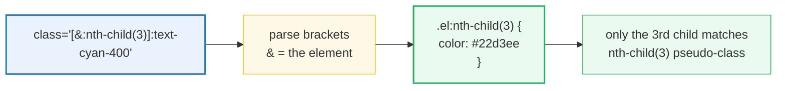

# Arbitrary Variants — `[&<selector>]:`

> **Companion demo:** [`arbitrary_variants.html`](./arbitrary_variants.html) — open in a browser.
> **Tailwind version:** v4.0+ via `@tailwindcss/browser@4` Play CDN.

---

## 0. TL;DR — the one idea

> **The analogy:** every Tailwind variant — `hover:`, `first:`, `supports-…`,
> `aria-pressed:` — is sugar over ONE mechanism: **append a CSS selector to the
> element wearing the class**. Arbitrary variants expose that mechanism raw.
> Write the selector yourself in square brackets, drop a **`&`** wherever the
> element should land, and Tailwind splices it into the compiled rule. No
> `@custom-variant`, no config — it works straight from HTML.



The `&` is the **same nesting placeholder** native CSS and Sass use — "the
element being styled". Its position decides the selector shape:

| you write | `&` position | compiles to |
|-----------|--------------|-------------|
| `[&:nth-child(3)]:` | after | `.el:nth-child(3)` |
| `[.parent_&]:` | before | `.parent .el` |
| `[&_.inner]:` | after, with descendant | `.el .inner` |
| `[&>div:first-child]:` | after, with child combinator | `.el > div:first-child` |

For at-rules — `[@supports(...)]`, `[@media(...)]` — the whole condition lives
inside the brackets and `&` is optional: Tailwind wraps the rule in the
at-rule block and inserts the element selector for you.

---

## 1. The syntax, end to end

An arbitrary variant is square brackets containing a **selector with an `&`**,
immediately followed by `:` and a utility:

```
[&<selector>]:<utility>
```

- The brackets hold everything that would normally come **after** the element
  in raw CSS.
- The `&` marks where the element goes — omit it only for at-rules.
- You can stack them with built-in variants (`md:`, `dark:`, `hover:`…) in any
  order, outermost first.

```html
<!-- pseudo-class: 3rd list item is cyan -->
<li class="[&:nth-child(3)]:text-cyan-400">third item</li>

<!-- pseudo-element: webkit range-input thumb -->
<input class="[&::-webkit-slider-thumb]:bg-cyan-500" />

<!-- attribute selector: only when aria-pressed is literally "true" -->
<button class="[&[aria-pressed=true]]:bg-cyan-600" aria-pressed="true">toggle</button>

<!-- descendant: every .inner inside this div -->
<div class="[&_.inner]:text-cyan-400">…</div>

<!-- feature query: use grid if the browser supports it -->
<div class="[@supports(display:grid)]:grid [@supports(not(display:grid))]:block">…</div>

<!-- media query: hide when printing -->
<div class="[@media(print)]:hidden">…</div>
```

### The four selector families

| family | example | compiles to |
|--------|---------|-------------|
| pseudo-class | `[&:nth-child(3)]:` | `.el:nth-child(3)` |
| pseudo-element | `[&::-webkit-slider-thumb]:` | `.el::-webkit-slider-thumb` |
| attribute | `[&[data-state=open]]:` | `.el[data-state=open]` |
| descendant / combinator | `[&_.inner]:` · `[&>div]:` | `.el .inner` · `.el > div` |
| at-rule | `[@supports(...)]:` · `[@media(...)]:` | `@supports (…) { .el {…} }` |

---

## 2. How the `&` compiles (internals)

Tailwind's variant system is a **selector transformer**. Every variant —
built-in or arbitrary — receives a "selector placeholder" and returns a new
selector wrapping it. For `hover:` that's `(s) => s + ":hover"`. For an
arbitrary variant `[X]` it's `(s) => X.replace("&", s)`.

```
arbitrary variant [&:nth-child(3)]:text-cyan-400

  utility selector   →  .text-cyan-400
  variant template   →  "&:nth-child(3)"
  splice & → utility →  .text-cyan-400:nth-child(3)
  escape for CSS     →  .\[\&\:nth-child\(3\)\]\:text-cyan-400:nth-child(3)

  final rule:
    .\[\&\:nth-child\(3\)\]\:text-cyan-400:nth-child(3) {
      color: oklch(0.715 0.143 215);
    }
```

Three properties make this work as a general-purpose escape hatch:

1. **The `&` can go anywhere.** `[&:hover]` (after), `[.dark_&]` (before),
   `[&>_.icon]` (with combinators) — Tailwind just does string substitution.
2. **At-rules need no `&`.** `[@supports(display:grid)]:grid` compiles to
   `@supports (display:grid) { .grid { display:grid } }` — the variant
   detects the leading `@` and wraps rather than splices.
3. **Specificity is just the selector's.** `[&:nth-child(3)]:` carries the
   specificity of `:nth-child(3)` (0,1,1) — no penalty beyond what you wrote.

### At-rule variants vs the named aliases

Tailwind ships friendlier aliases for the common at-rules:

| arbitrary | named alias | when to prefer |
|-----------|-------------|----------------|
| `[@supports(display:grid)]:` | `supports-[display:grid]:` | alias — terser, same output |
| `[@supports(not(display:grid))]:` | `not-supports-[display:grid]:` | alias |
| `supports-[backdrop-filter]:` | `supports-backdrop-filter:` | property-only check is shortest |
| `[@media(print)]:` | `print:` | alias — `print:` is built-in |
| `[@media(min-width:48rem)]:` | `md:` | responsive breakpoints are built-in |

Reach for the raw `[&…]`/`[@…]` form when no alias exists (slider thumbs,
scrollbars, vendor pseudo-elements, custom attribute values, exotic
combinators).

---

## 3. Pseudo-class & pseudo-element variants

These are the highest-volume use cases — selectors the framework doesn't ship
shorthands for.

### Pseudo-class: `[&:nth-child(N)]:`

`nth-3:` exists for the trivial case, but arbitrary covers
`:nth-child(2n+1)`, `:nth-last-child(3)`, `:nth-of-type(odd)` and anything
else:

```html
<ul>
  <li class="[&:nth-child(2n+1)]:bg-cyan-950/40">odd rows get a tint</li>
</ul>
```

Compiles to `.\[\&\:nth-child\(2n\+1\)\]\:…:nth-child(2n+1)`.

### Pseudo-element: `[&::-webkit-slider-thumb]:`

Range inputs, scrollbars, `::selection`, `::cue`, `::backdrop` — all
pseudo-elements. The classic one is the **cross-browser range thumb**, which
needs two vendor prefixes and so two arbitrary variants stacked:

```html
<input type="range"
  class="appearance-none
         [&::-webkit-slider-thumb]:appearance-none
         [&::-webkit-slider-thumb]:w-5
         [&::-webkit-slider-thumb]:h-5
         [&::-webkit-slider-thumb]:rounded-full
         [&::-webkit-slider-thumb]:bg-cyan-400
         [&::-moz-range-thumb]:w-5
         [&::-moz-range-thumb]:h-5
         [&::-moz-range-thumb]:rounded-full
         [&::-moz-range-thumb]:bg-cyan-400" />
```

Each browser silently ignores the prefix it doesn't understand — this is the
standard pattern, not a hack.

### Attribute selector: `[&[data-state=open]]:`

`aria-pressed:` only matches `aria-pressed="true"`. Arbitrary matches **any**
attribute, including custom `data-*`:

```html
<button class="[&[data-state=open]]:bg-cyan-600"
        data-state="open">I'm open</button>
<!-- → .el[data-state=open] { background: … } -->
```

> For project-wide data attributes, prefer `@custom-variant data-open
> (&[data-state=open])` then `data-open:bg-cyan-600` — see
> [data_attribute](./data_attribute.html).

---

## 4. Descendant & combinator variants

The `&` plus a CSS combinator (` `, `>`, `+`, `~`) reaches **into** the
element's subtree or siblings.

```html
<!-- descendant: any .inner at any depth -->
<div class="[&_.inner]:text-cyan-400">
  <p class="inner">cyan</p>          <!-- depth 1 -->
  <span><b class="inner">cyan</b></span>  <!-- depth 2 -->
</div>
<!-- → .el .inner { color: … } -->

<!-- direct child: only immediate <div> children -->
<div class="[&>div]:mt-0">
  <div>no top margin</div>           <!-- direct child -->
  <span><div>has top margin</div></span>  <!-- nested, unaffected -->
</div>
<!-- → .el > div { margin-top: 0 } -->
```

This is **parent-scoped styling** without `group-*` markers — the rule lives
on the container and reaches down. Contrast with `group-*`, where the
*reacting* element carries the variant; here the *containing* element does.

### Ancestor-scoped: `[.x_&]:` (element is INSIDE `.x`)

Putting the `&` *after* the selector flips the direction — style this element
only when it's nested inside an ancestor:

```html
<div class="sidebar">
  <button class="[.sidebar_&]:w-full">full-width only inside .sidebar</button>
</div>
<!-- → .sidebar .el { width: 100% } -->
```

This is exactly what `group-[.sidebar]:` does for `group-*` — arbitrary
variants make the unnamed version available on any element.

---

## 5. `@supports` & `@media` (at-rule) variants

When the brackets start with `@`, Tailwind treats the contents as an at-rule
condition and wraps the rule instead of splicing:

```html
<!-- feature detection: progressive enhancement -->
<div class="block
            [@supports(display:grid)]:grid
            [@supports(display:grid)]:grid-cols-3
            [@supports(not(display:grid))]:space-y-2">
  …
</div>
<!-- → @supports (display:grid) { .\[@supports…\]:grid { display:grid } } -->
<!-- → @supports not (display:grid) { …space-y-2 } -->

<!-- media query: print-only -->
<article class="[@media(print)]:hidden">don't waste ink on me</article>
<!-- → @media print { .\[@media…\]:hidden { display:none } } -->
```

For **property-only** checks (does the browser know `backdrop-filter` at all?),
use the `supports-<property>:` shorthand:

```html
<div class="bg-black/75 supports-backdrop-filter:bg-black/25
            supports-backdrop-filter:backdrop-blur" />
```

> At-rule variants are evaluated at **parse time**, not interactively — they
> don't flip on user input like `:hover`. `getComputedStyle()` reflects them
> immediately after the CDN compiles; no `requestAnimationFrame` polling for
> state changes is needed (though you still poll once for the CDN itself).

---

## 6. Stacking with built-in variants

Arbitrary variants compose with every other variant — chain left-to-right,
outermost first. Each variant wraps the next:

```html
<!-- nth-child only fires at the md breakpoint -->
<li class="md:[&:nth-child(3)]:bg-cyan-900">…</li>
<!-- → @media (min-width:48rem) { .el:nth-child(3) {…} } -->

<!-- webkit scrollbar, only in dark mode -->
<div class="dark:[&::-webkit-scrollbar]:w-2
              dark:[&::-webkit-scrollbar-thumb]:bg-cyan-500">…</div>
<!-- → @media (prefers-color-scheme:dark) { .el::-webkit-scrollbar {…} } -->

<!-- at-rules stack too: print + first-child -->
<section class="[@media(print)]:[&:first-child]:hidden">…</section>
<!-- → @media print { .el:first-child { display:none } } -->
```

| stack | compiles to | fires when |
|-------|-------------|------------|
| `md:[&:nth-child(3)]:` | `@media (min-width:48rem) { .el:nth-child(3) }` | 3rd child, ≥ 768px |
| `dark:[&::-webkit-scrollbar]:` | `@media (prefers-color-scheme:dark) { .el::-webkit-scrollbar }` | dark + webkit |
| `hover:[&_.tip]:` | `.el:hover .tip` | this element hovered, `.tip` inside reacts |
| `[@media(print)]:[&:first-child]:` | `@media print { .el:first-child }` | print + first child |

**Order matters.** `md:[&:nth-child(3)]:` ≠ `[&:nth-child(3)]:md:` is invalid
(arbitrary variants go outermost or before the utility they qualify) — keep
media/state variants leftmost.

---

## 7. Killer Gotchas

| Trap | Symptom | Fix |
|------|---------|-----|
| **Forgetting the `&`** — writing `[:nth-child(3)]:` instead of `[&:nth-child(3)]:` | Variant silently fails to compile; no CSS generated | Always include `&` for selector variants — it marks where the element lands. At-rules (`[@supports]`) are the only exception. |
| **Spaces inside the brackets** — `[&:nth-child(3) ]:` with a trailing space | Some compilers choke or produce an unexpected descendant combinator | Strip whitespace inside brackets; use `_` for a real space (e.g. `[&_.inner]` = `& .inner`). |
| **Underscore = space** — `[&_.inner]` means `& .inner`, not `&_.inner` | Surprised that `_.` becomes a descendant combinator | Intended behavior (matches arbitrary-values). For a literal underscore, escape it: `[\&\_x]`. |
| **Slider thumb needs `appearance-none` on the input** | `[&::-webkit-slider-thumb]:w-5` has no visible effect — default UA thumb overrides it | Add `appearance-none` to the `<input>` itself; then the pseudo-element rules apply. |
| **`@media`/`@supports` vs the named aliases** — writing `[@media(print)]:` when `print:` exists | Works but is verbose and inconsistent with the rest of your codebase | Use `print:`, `supports-[…]`, `not-supports-[…]` where they exist; reserve raw `[@…]` for cases with no alias. |
| **Specificity creep** — `[&:nth-child(3)]:bg-cyan-500` (0,2,0) beats `bg-slate-700` (0,1,0) | Later utility-class overrides mysteriously don't apply | That's correct CSS specificity. Reorder, or use `!` important (`![&:nth-child(3)]:…`) as a last resort. |
| **Testing too early** — `getComputedStyle()` before the CDN compiles returns UA defaults | Gold-check reports FAIL on a working variant | Poll via `requestAnimationFrame` (up to ~2s) until the baseline utility (e.g. a border) resolves — see [`HOW_TO_RESEARCH.md`](./HOW_TO_RESEARCH.md) §4. |
| **Nesting arbitrary variants in `@custom-variant`** — `@custom-variant foo (&[data-x])` then `[&:hover]:foo:` | Order ambiguity; some compositions don't compile | Register the custom variant and use `foo:hover:` instead of stacking raw arbitrary variants with named ones inside `@custom-variant`. |
| **Vendor-prefix pseudo-elements don't cascade** — `[&::-webkit-slider-thumb]:bg-cyan-400` won't inherit from the input | Thumb stays default color even though the rule compiled | Pseudo-elements are separate boxes — style them directly; don't rely on `inherit` from the host element. |
| **Escaping in selectors with `()` or `+`** — `[&:nth-child(2n+1)]:` | Works, but the generated class name is ugly and some linters complain | Cosmetic only — the CSS engine handles it. No action needed. |

### Cheat sheet

```html
<!-- 1. PSEUDO-CLASS: nth-child on the fly -->
<li class="[&:nth-child(3)]:text-cyan-400">3rd item is cyan</li>
<li class="[&:nth-child(2n+1)]:bg-cyan-950/40">odd rows tinted</li>

<!-- 2. PSEUDO-ELEMENT: cross-browser range thumb -->
<input type="range"
  class="appearance-none
         [&::-webkit-slider-thumb]:w-5 [&::-webkit-slider-thumb]:h-5
         [&::-webkit-slider-thumb]:rounded-full [&::-webkit-slider-thumb]:bg-cyan-400
         [&::-moz-range-thumb]:w-5 [&::-moz-range-thumb]:h-5
         [&::-moz-range-thumb]:rounded-full [&::-moz-range-thumb]:bg-cyan-400" />

<!-- 3. ATTRIBUTE SELECTOR: any attribute, any value -->
<button class="[&[aria-pressed=true]]:bg-cyan-600" aria-pressed="true">toggle</button>
<div    class="[&[data-state=open]]:block"        data-state="open">reveal</div>

<!-- 4. DESCENDANT: parent-scoped styling -->
<div class="[&_.inner]:text-cyan-400 [&_.inner]:font-semibold">
  <p class="inner">cyan at any depth</p>
</div>

<!-- 5. CHILD COMBINATOR: only direct children -->
<div class="[&>div:first-child]:mt-0">first direct-child div has no top margin</div>

<!-- 6. ANCESTOR-SCOPED: element is INSIDE .sidebar -->
<button class="[.sidebar_&]:w-full">full-width only in the sidebar</button>

<!-- 7. FEATURE QUERY: progressive enhancement -->
<div class="block
            [@supports(display:grid)]:grid
            [@supports(display:grid)]:grid-cols-3">
  grid if supported, block otherwise
</div>

<!-- 8. MEDIA QUERY: print-only -->
<article class="[@media(print)]:hidden">hidden on paper</article>

<!-- 9. STACKED: md + nth-child -->
<li class="md:[&:nth-child(3)]:bg-cyan-900">3rd row, ≥ 768px only</li>
```

---

## 🔗 Cross-references

- [arbitrary_values](/tailwind/arbitrary_values.html) — `[17rem]`, `[color:var(--x)]`, `bg-[url(...)]`: arbitrary **values** go *inside* a utility. Arbitrary **variants** go *before* the colon. Same bracket syntax, different slot — read this first to internalize the distinction.
- [arbitrary_properties](/tailwind/arbitrary_properties.html) — `[--scroll-offset:7px]`, `[mask-type:luminance]`: a third bracket form that sets a CSS property *on the element itself*. The trio: values (inside), variants (before `:`), properties (bare brackets).
- [data_attribute](/tailwind/data_attribute.html) — `data-[size=large]:`, `@custom-variant data-open`: the named-variant pattern for project-wide data attributes. Use it instead of raw `[&[data-state=open]]:` once a selector repeats more than twice.
- [functional_utility](/tailwind/functional_utility.html) — `@utility` with `--value(integer)`, `--modifier(n)`: the build-side complement. When arbitrary variants get repetitive, promote the selector to a named `@utility` or `@custom-variant`.
- [child_variants](/tailwind/child_variants.html) — `first:`, `last:`, `nth-3:`, `empty:`: the built-in structural pseudo-class shorthands. `[&:nth-child(3)]:` is the arbitrary fallback when no shorthand fits.
- [a11y_variants](/tailwind/a11y_variants.html) — `motion-safe:`, `forced-colors:`, `contrast-more:`: named aliases for the `@media` queries you'd otherwise write as `[@media(prefers-reduced-motion:no-preference)]:`.

---

## Sources

1. **Tailwind CSS — Using arbitrary variants**: https://tailwindcss.com/docs/hover-focus-and-other-states#using-arbitrary-variants (v4.x official docs — `[&<selector>]:` syntax, the `&` placeholder, stacking)
2. **Tailwind CSS — `@supports` variant**: https://tailwindcss.com/docs/hover-focus-and-other-states#supports (`supports-[…]`, `supports-<property>:`, `not-supports-[…]`, `@custom-variant supports-*`)
3. **Tailwind CSS — Arbitrary groups / peers**: https://tailwindcss.com/docs/hover-focus-and-other-states#arbitrary-groups (`group-[.x]:`, `peer-[.x]:`, the `&` positioning for ancestor/sibling selectors)
4. **MDN — CSS Nesting & the `&` nesting selector**: https://developer.mozilla.org/en-US/docs/Web/CSS/Nesting_selector (the `&` semantics that arbitrary variants mirror)
5. **MDN — `@supports` at-rule**: https://developer.mozilla.org/en-US/docs/Web/CSS/@supports (feature-query syntax that `[@supports(...)]:` wraps)
6. **MDN — `::-webkit-slider-thumb`**: https://developer.mozilla.org/en-US/docs/Web/CSS/::-webkit-slider-thumb (the pseudo-element pattern that motivated arbitrary variants — no built-in shorthand exists)
