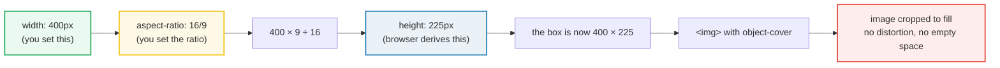

# Aspect Ratio & Object Sizing — Tailwind CSS 4

> **Companion demo:** [`aspect_ratio_object.html`](./aspect_ratio_object.html) — open in a browser.
> The demo's gold-check proves `aspect-square` → `aspect-ratio: 1 / 1`,
> `object-cover` → `object-fit: cover`, and `size-16` → a 64px square.

---

## 0. TL;DR — the one idea

`aspect-ratio` links **width** and **height** with a single number (the ratio),
so you only set one dimension and the browser derives the other. No padding-hack,
no JS. `object-fit` then decides what happens *inside* that box when an image's
intrinsic shape doesn't match: **cover** crops to fill, **contain** letterboxes to
fit. `size-*` (Tailwind v4) sets both `width` and `height` in one class.



The shape of the box is fixed; only its scale changes with the viewport. That is
the entire trick behind responsive thumbnails, avatars, and cinema strips.

---

## 1. How aspect-ratio works

`aspect-ratio: W / H` is a **hint**, not a hard constraint. The browser applies it
*only* when one of the two dimensions is **auto** (not explicitly set). The
precedence order is:

1. **Explicit size wins.** If you write `w-64 h-32`, both are set — `aspect-ratio`
   is ignored entirely.
2. **Intrinsic size wins for replaced elements.** A bare `` with no width has
   an intrinsic size from the file; `aspect-ratio` won't override it unless you
   also set `width` or wrap in a sized parent.
3. **aspect-ratio fills the gap.** Set width + aspect-ratio (height auto) → browser
   computes height. Set height + aspect-ratio (width auto) → browser computes width.

| class | generated CSS | why |
|---|---|---|
| `aspect-square` | `aspect-ratio: 1 / 1` | avatars, profile pics |
| `aspect-video` | `aspect-ratio: 16 / 9` | YouTube, hero thumbnails |
| `aspect-[4/3]` | `aspect-ratio: 4 / 3` | arbitrary — classic monitor ratio |
| `aspect-[2.39/1]` | `aspect-ratio: 2.39 / 1` | arbitrary — anamorphic cinema |
| `aspect-auto` | `aspect-ratio: auto` | let the element's intrinsic ratio win |

### The canonical pattern: wrapper + sized child

`aspect-ratio` is most reliable on a **wrapper `<div>`**, with the image inside set
to `w-full h-full`:

```html
<div class="aspect-video overflow-hidden">
  
</div>
```

The wrapper derives its height from the grid/flex column width; the image fills the
wrapper; `object-cover` decides the crop. This is the pattern the demo's Row A uses.

---

## 2. Mechanism — object-fit & object-position

`object-fit` applies **only to replaced elements** (`img`, `video`, `iframe`,
`embed`, `svg` with intrinsic size). It decides what happens when the element's
intrinsic size ≠ the box you sized it to.

| class | CSS | behaviour |
|---|---|---|
| `object-contain` | `object-fit: contain` | whole image visible, **letterboxed** (empty space around) |
| `object-cover` | `object-fit: cover` | fills box, overflow **cropped** — no empty space |
| `object-fill` | `object-fit: fill` | stretches — **distorts** the image (rarely what you want) |
| `object-none` | `object-fit: none` | shows at intrinsic size, cropped to box |
| `object-scale-down` | `object-fit: scale-down` | behaves as `contain` or `none`, whichever is smaller |

`object-position` picks the anchor point when the image is cropped (cover) or has
empty space (contain):

| class | CSS | use |
|---|---|---|
| `object-center` | `object-position: center` | default |
| `object-top` | `object-position: top` | portraits — keep the head, crop the feet |
| `object-bottom` | `object-position: bottom` | landscape horizons |
| `object-[center_top]` | `object-position: center top` | arbitrary — keyword mix |
| `object-[25%_75%]` | `object-position: 25% 75%` | off-center focal point (use `_` for spaces) |

### Why the box must be sized

`object-fit` needs a sized box to fit *into*. A bare
`` with no width/height is a no-op — the image just shows
at intrinsic size. Always pair it with either explicit sizing or a sized parent:

```html
<!-- works -->

<!-- also works — wrapper sets the box -->
<div class="aspect-video"></div>
<!-- no-op — nothing to fit into -->

```

---

## 3. The `size-*` shorthand (Tailwind v4)

New in v4: `size-N` sets **both** `width: N` and `height: N` in one class. It is
the modern way to size square elements — icons, avatars, tiles.

```html
<!-- old (v3) -->
<div class="w-16 h-16 rounded-full">…</div>
<!-- new (v4) -->
<div class="size-16 rounded-full">…</div>
```

| class | width + height |
|---|---|
| `size-4` | 1rem · 16px |
| `size-8` | 2rem · 32px |
| `size-12` | 3rem · 48px |
| `size-16` | 4rem · 64px |
| `size-20` | 5rem · 80px |
| `size-24` | 6rem · 96px |
| `size-32` | 8rem · 128px |
| `size-full` | `100%` × `100%` |
| `size-xs` / `size-sm` / `size-md` / `size-lg` / `size-xl` | named scale (theme-driven) |

`size-*` accepts the **same value scale** as `w-*`/`h-*` — spacing scale, fractions,
viewport units, `fit-content`, named theme tokens. The demo's Panel 4 renders six
square boxes from `size-8` through `size-32`; the gold-check confirms `size-16`
resolves to a 64px × 64px square.

---

## 4. All sizing utilities at a glance

| family | representative classes | CSS property | note |
|---|---|---|---|
| **width** | `w-4` `w-1/2` `w-full` `w-screen` `w-auto` `w-min` `w-max` `w-fit` | `width` | fractions, viewport, keywords |
| **height** | `h-4` `h-full` `h-screen` `h-dvh` `h-svh` `h-lvh` | `height` | `dvh`/`svh`/`lvh` are mobile-friendly viewport units |
| **size (v4)** | `size-4` `size-16` `size-full` | `width` + `height` | square in one class |
| **min-width** | `min-w-0` `min-w-full` `min-w-min` `min-w-max` `min-w-fit` | `min-width` | `min-w-0` is the classic flex/grid overflow fix |
| **min-height** | `min-h-0` `min-h-full` `min-h-screen` `min-h-dvh` | `min-height` | pair with `aspect-*` to prevent shrink below ratio |
| **max-width** | `max-w-sm` `max-w-md` `max-w-prose` `max-w-screen-xl` | `max-width` | readability caps (see presets) |
| **max-height** | `max-h-64` `max-h-screen` `max-h-full` | `max-height` | clamps tall content (modals, dropdowns) |

### `max-width` presets (readability & breakpoint caps)

| class | width | typical use |
|---|---|---|
| `max-w-xs` | 20rem · 320px | tooltips, small popovers |
| `max-w-sm` | 24rem · 384px | form inputs, narrow cards |
| `max-w-md` | 28rem · 448px | modal dialogs, alerts |
| `max-w-lg` | 32rem · 512px | wide cards |
| `max-w-xl` | 36rem · 576px | blog excerpts |
| `max-w-2xl` | 42rem · 672px | article body (narrow) |
| `max-w-3xl` | 48rem · 768px | article body |
| `max-w-4xl` | 56rem · 896px | wider article body |
| `max-w-prose` | 65ch | optimal line length (~65 characters) |
| `max-w-screen-sm` | 40rem · 640px | matches the `sm:` breakpoint |
| `max-w-screen-md` | 48rem · 768px | matches `md:` |
| `max-w-screen-lg` | 64rem · 1024px | matches `lg:` |
| `max-w-screen-xl` | 80rem · 1280px | matches `xl:` |
| `max-w-screen-2xl` | 96rem · 1536px | matches `2xl:` |

> **`max-w-prose` vs `max-w-3xl`:** `prose` is *character-based* (65ch) — it adapts
> to font size and keeps line length typographically optimal. `3xl` is *pixel-based*
> (48rem) — it does not adapt to font size. Use `prose` for long-form reading text;
> use the rem-based presets for layout shells.

---

## 5. Killer Gotchas

| trap | symptom | fix |
|---|---|---|
| **Bare ``** | image still shows at intrinsic size, no cropping | the img needs a sized box — use `w-full h-48 object-cover` or wrap in `aspect-video` + `w-full h-full` |
| **`aspect-ratio` ignored** | box doesn't take the ratio you asked for | you set both width AND height explicitly — explicit sizes always win. Remove one (let height go auto) |
| **`aspect-square` collapses to 0 height** | the box has 0 height | parent has no width (e.g. it's an inline `<span>`). The wrapper needs a width source — `w-full` or a grid/flex column |
| **`` overrides the wrapper's ratio** | the wrapper is `aspect-video` but the box still shows the image's native ratio | the img has no `w-full h-full` — its intrinsic size pushes the wrapper taller than the ratio dictates. Always pair `aspect-*` wrapper with `w-full h-full` child + `overflow-hidden` |
| **`max-w-prose` shrinks a layout grid** | grid columns compress to 65ch | `prose` caps *width* — wrap only the text element, not the grid container |
| **`size-*` on a flex parent** | the element grows anyway | flex items can stretch via `align-items`/`justify-items` — add `shrink-0` or `flex-none` to lock the size |
| **`object-cover` crops the face** | portrait heads get cut off | add `object-top` (or `object-[center_top]`) to anchor the crop on the head |
| **mobile address bar makes `h-screen` jump** | full-bleed hero bounces when scrolling on iOS | use `h-dvh` (dynamic viewport height) instead — it accounts for the address bar |
| **`aspect-[2.39/1]` written as `aspect-[2.39:1]`** | arbitrary value doesn't compile | use `/` not `:` — Tailwind uses the CSS syntax `2.39 / 1` |
| **checkerboard shows through** | empty bands appear around a `contain` image | that's letterboxing (expected) — switch to `object-cover` if you want fill |

---

## 6. Cheat sheet

| intent | pattern |
|---|---|
| responsive 16:9 thumbnail | `<div class="aspect-video"></div>` |
| square avatar (no distortion) | `class="size-12 rounded-full object-cover"` |
| whole logo, no crop | `class="size-16 object-contain"` |
| cinema strip | `class="aspect-[2.39/1] object-cover"` |
| readable article width | `class="max-w-prose"` (~65 chars/line) |
| portrait crop keeps the head | `class="h-full w-full object-cover object-top"` |
| flex child stops overflowing | `class="min-w-0"` |
| mobile full-bleed hero | `class="h-dvh"` |
| square icon button | `class="size-10 grid place-items-center"` |
| banner (3:1) | `class="aspect-[3/1] object-cover"` |
| off-center focal point | `class="object-[25%_75%]"` |
| prevent box shrinking below ratio | `class="aspect-video min-h-0"` |

---

## 🔗 Cross-references

- [`gap_spacing.html`](./gap_spacing.html) — `gap-*`, `space-x/y-*`, `divide-*`:
  how the gutters *between* sized boxes work. Pair with `size-*` for icon-button
  grids.
- [`container_patterns.html`](./container_patterns.html) — `@container` queries:
  when a sized box should adapt to its *parent's* width, not the viewport.
- [`arbitrary_values.html`](./arbitrary_values.html) — the `[value]` square-bracket
  syntax that powers `aspect-[2.39/1]`, `object-[center_top]`, `size-[117px]`.
- [`../frontend/foundations/box_model.html`](../frontend/foundations/box_model.html) —
  `width`/`height`/`padding`/`border`: `aspect-ratio` is the missing third dimension
  that *links* width and height without setting both.

---

## Sources

1. **MDN, "aspect-ratio"** — CSS property reference, precedence rules (explicit
   sizes override; intrinsic size wins for replaced elements).
   https://developer.mozilla.org/en-US/docs/Web/CSS/aspect-ratio
2. **MDN, "object-fit"** — replaced-element fit behaviour (contain, cover, fill,
   none, scale-down).
   https://developer.mozilla.org/en-US/docs/Web/CSS/object-fit
3. **Tailwind CSS v4 docs — Sizing** (`size-*`, `w-*`, `h-*`, `min-*`, `max-*`,
   `aspect-*`) — utility reference and v4 shorthand notes.
   https://tailwindcss.com/docs/aspect-ratio · https://tailwindcss.com/docs/size
4. **Can I Use — "aspect-ratio"** — browser support (baseline 2021+, all modern
   engines).
   https://caniuse.com/aspect-ratio
