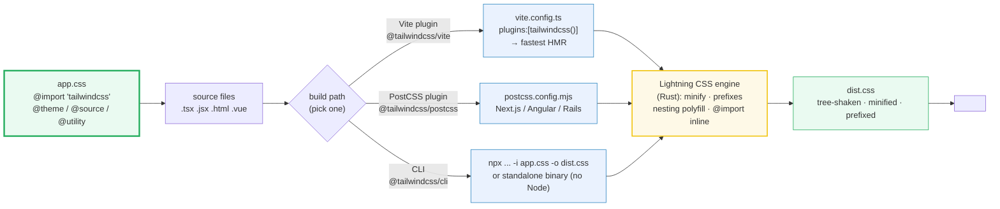

# Build Tooling — CLI, Vite, PostCSS & Lightning CSS

> **Companion demo:** [`build_tooling.html`](./build_tooling.html) — open in a browser.
> **Tailwind version:** v4.3.x. Every v4 project compiles through exactly one of
> three official paths, all powered by the same Lightning CSS engine.
> This guide is the *how*; [`source_detection`](./source_detection.html) is the *what*.

---

## 0. TL;DR — the one idea

> **The analogy:** v3 was "write a JS config, then run PostCSS." v4 is **"write
> CSS, then run one of three tools that all share the same engine."** The
> stylesheet is now the single source of truth — `@import "tailwindcss"` plus
> optional `@theme` / `@source` / `@utility` / `@plugin` directives. There is no
> `tailwind.config.js` at the root by default. Pick the build path that matches
> your bundler (Vite plugin, PostCSS plugin, or the standalone CLI) and you're
> done. Internally, all three hand off to **Lightning CSS** (a Rust-based CSS
> transformer) for minification, vendor prefixing, nesting polyfills, and
> `@import` inlining — replacing the old PostCSS + autoprefixer + cssnano stack.



The headline commands, side by side:

```bash
# CLI
npm install tailwindcss @tailwindcss/cli
npx @tailwindcss/cli -i ./src/app.css -o ./dist/output.css --watch --minify
```
```js
// Vite — vite.config.ts
import { defineConfig } from 'vite';
import tailwindcss from '@tailwindcss/vite';
export default defineConfig({ plugins: [tailwindcss()] });
```
```js
// PostCSS — postcss.config.mjs
export default { plugins: { '@tailwindcss/postcss': {} } };
```
```css
/* app.css — identical for ALL three paths */
@import "tailwindcss";
```

---

## 1. The CSS entry point (shared by all paths)

v4 inverts the config model. The compiler reads your CSS top-to-bottom; every
at-rule is an instruction. A realistic entry file:

```css
/* app.css — the ONLY file the build tool reads */
@import "tailwindcss";              /* Preflight + theme + utilities      */

@theme {                            /* design tokens → CSS variables      */
  --color-brand: oklch(0.7 0.15 250);
  --breakpoint-3xl: 120rem;
}

@source "../src/**/*.{tsx,jsx,html}"; /* add explicit source roots        */
@source "../node_modules/@acme/ui";   /* scan a gitignored dep            */
@source not "../legacy";              /* exclude a path                   */

@custom-variant pointer-coarse (@media (pointer: coarse));
@utility tab-4 { tab-size: 4; }
@plugin "../plugins/my-plugin.js";    /* JS plugin (legacy bridge)         */
@config "../tailwind.config.js";      /* legacy v3 JS config bridge        */
```

No `tailwind.config.js` is needed. `@config` exists **only** as a migration
escape hatch — it loads a v3-style JS config and merges it into the CSS-first
pipeline. Greenfield projects should never need it.

---

## 2. Path A — the CLI (`@tailwindcss/cli`)

The simplest path. No bundler, no framework — just a Node script (or a
standalone binary) that reads your CSS, scans sources, and writes a file.

```bash
npm install tailwindcss @tailwindcss/cli

# one-off build
npx @tailwindcss/cli -i ./src/app.css -o ./dist/output.css

# watch mode (dev)
npx @tailwindcss/cli -i ./src/app.css -o ./dist/output.css --watch

# production build (Lightning CSS minification)
npx @tailwindcss/cli -i ./src/app.css -o ./dist/output.css --minify
```

| Flag | Effect |
|---|---|
| `-i, --input` | entry CSS file (must contain `@import "tailwindcss"`) |
| `-o, --output` | where to write the compiled CSS |
| `-w, --watch` | rebuild on source change (polls the file system) |
| `-m, --minify` | run Lightning CSS minification (production) |
| `--content <paths>` | override source detection (escape hatch) |
| `-c, --config` | point at a legacy JS config (uses `@config` internally) |

**Standalone binary:** the same CLI ships as a single executable in every
[GitHub release](https://github.com/tailwindlabs/tailwindcss/releases/latest) —
no Node.js required. Same flags. Useful for Docker images, CI runners, or
locked-down environments.

Best for: static sites, server-rendered apps without a JS bundler, CI pipelines,
and no-Node environments.

---

## 3. Path B — the Vite plugin (`@tailwindcss/vite`)

The recommended path for any Vite-based app (SvelteKit, Laravel, React Router,
Nuxt, SolidJS, plain Vite). Tailwind is a **first-class Vite plugin**, not a
PostCSS step — so it integrates with Vite's module graph and gives the fastest
HMR of the three paths.

```bash
npm install tailwindcss @tailwindcss/vite
```
```ts
// vite.config.ts
import { defineConfig } from 'vite';
import tailwindcss from '@tailwindcss/vite';

export default defineConfig({
  plugins: [tailwindcss()],
});
```
```css
/* src/app.css */
@import "tailwindcss";
```

Zero-config beyond that. Vite picks up the CSS import, the plugin compiles on
every change, HMR pushes the diff. In production builds, Vite's own CSS
pipeline calls into Lightning CSS for the final minify.

Best for: anything already on Vite. If your `vite.config.ts` exists, use this.

---

## 4. Path C — the PostCSS plugin (`@tailwindcss/postcss`)

For frameworks that already run a PostCSS pipeline and don't expose Vite:
**Next.js, Angular, Rails, Symfony, AdonisJS**, or a hand-rolled webpack setup.

```bash
npm install tailwindcss @tailwindcss/postcss postcss
```
```js
// postcss.config.mjs
export default {
  plugins: {
    '@tailwindcss/postcss': {},
  },
};
```
```css
/* src/app.css */
@import "tailwindcss";
```

The plugin **is** the Tailwind compiler — it just runs inside PostCSS instead
of owning the pipeline. Output is identical to the other two paths.

> **Note for Next.js:** the App Router's built-in `postcss.config.mjs` already
> exists — just replace its `tailwindcss` entry with `"@tailwindcss/postcss"`
> (the old `tailwindcss` PostCSS plugin was the v3 one and is gone).

Best for: framework-locked PostCSS pipelines where you can't swap to Vite.

---

## 5. Lightning CSS internals — the engine inside all three

v4 replaced the v3 PostCSS plugin chain with **[Lightning CSS](https://lightningcss.dev/)**,
a Rust-based CSS transformer. You never invoke it directly — the CLI, the Vite
plugin, and the PostCSS plugin all call into it. It does four jobs the old
stack split across three tools:

| Job | v3 tool | v4 (Lightning CSS) |
|---|---|---|
| Minification | `cssnano` | built-in — smarter shorthand merging, removes redundant longhands |
| Vendor prefixes | `autoprefixer` | built-in — only emits prefixes your `browserslist` actually needs |
| Nesting polyfill | `postcss-nesting` | built-in — compiles native `&` nesting for older targets |
| `@import` inlining | `postcss-import` | built-in — resolves `@import "tailwindcss"` and any local imports |

### Browser targeting via `browserslist`

Lightning CSS reads the standard [`browserslist`](https://browsersl.ist/) field
in your `package.json` (or a `.browserslistrc` file) to decide what to polyfill
and prefix:

```json
{
  "browserslist": [
    "defaults and fully supports es6-module",
    "supports css-nesting",
    "Firefox ESR"
  ]
}
```

- Targeting modern browsers → no nesting polyfill, fewer prefixes, smaller output.
- Targeting old Safari / legacy Edge → Lightning CSS compiles nesting down to
  expanded selectors and adds `-webkit-` prefixes where needed.

This is also why v4's minified output is typically **~20-40% smaller** than v3
on real apps (representative: a ~200-utility marketing page gzips to ~3.2 KB in
v4 vs ~4.1 KB in v3). Your numbers depend on how many utilities `@source`
actually detected.

### What you DON'T configure

You don't pass options to Lightning CSS directly. The build tool wraps it with
sensible defaults. If you need custom transform options, you're outside the
happy path — usually that means a PostCSS plugin ordering issue or a
`browserslist` that's too aggressive.

---

## 6. Killer Gotchas

| Trap | Symptom | Fix |
|---|---|---|
| `@import "tailwindcss"` missing | Output CSS is empty / utilities don't appear | The import is mandatory — it's the entire entry. Without it the compiler has nothing to compile. |
| Wrong package for your path | `Cannot find module '@tailwindcss/vite'` (or similar) | Each path has its own package: `@tailwindcss/cli`, `@tailwindcss/vite`, `@tailwindcss/postcss`. The core `tailwindcss` package alone isn't enough. |
| Mixing v3 and v4 PostCSS plugins | Build hangs, duplicate output, or cryptic PostCSS errors | Remove the old `tailwindcss` PostCSS plugin entry — v4 uses `@tailwindcss/postcss`. Don't run both. |
| Play CDN shipped to production | Huge runtime cost, console warning "do not use in production" | The CDN compiles in the browser per page-load. Use it only for demos; ship a compiled `dist.css` for real apps. |
| `--watch` not picking up new files | Added a new utility, but it's missing from output | The CLI watch polls known roots. New files outside the auto-detected base may need an explicit `@source` in your CSS, or a watch restart. |
| `@config` left in after migration | Theme overrides mysteriously don't apply, or apply twice | `@config` is a bridge. Once your `@theme` tokens are in CSS, remove the `@config` line — leaving it can shadow CSS-first config. |
| Vite plugin + PostCSS plugin both installed | Double compilation, broken HMR | Pick one. If you're on Vite, use `@tailwindcss/vite` and remove `@tailwindcss/postcss` from `postcss.config.mjs`. |
| `browserslist` too broad | Output CSS balloons with polyfills you don't need | Scope `browserslist` to your actual audience. `defaults` is a sane starting point; don't add `ie 11` (unsupported anyway). |
| Standalone binary version drift | CLI flags behave differently across machines | Pin the binary version (download a specific release tag), same as you'd pin the npm package. |

---

## 7. Cheat sheet

```bash
# ── CLI ──────────────────────────────────────────────────────────────────
npx @tailwindcss/cli -i app.css -o dist.css            # one-off
npx @tailwindcss/cli -i app.css -o dist.css --watch    # dev
npx @tailwindcss/cli -i app.css -o dist.css --minify   # prod

# ── Vite ─────────────────────────────────────────────────────────────────
npm i tailwindcss @tailwindcss/vite
# vite.config.ts → plugins: [tailwindcss()]

# ── PostCSS ──────────────────────────────────────────────────────────────
npm i tailwindcss @tailwindcss/postcss postcss
# postcss.config.mjs → { plugins: { '@tailwindcss/postcss': {} } }

# ── entry CSS (identical for all three) ──────────────────────────────────
@import "tailwindcss";
@theme { --color-brand: oklch(0.7 0.15 250); }
@source "../src/**/*.{tsx,jsx}";

# ── no Node? standalone binary ───────────────────────────────────────────
# https://github.com/tailwindlabs/tailwindcss/releases/latest
```

| You are… | Use | Why |
|---|---|---|
| on Vite | `@tailwindcss/vite` | first-class plugin, fastest HMR |
| on Next.js / Angular / Rails | `@tailwindcss/postcss` | plugs into existing PostCSS |
| building a static site / no bundler | `@tailwindcss/cli` | one command, one file |
| in CI / locked-down env (no Node) | standalone CLI binary | single executable |
| prototyping in a single HTML file | `@tailwindcss/browser` (CDN) | compiles in-browser — **never prod** |
| migrating a v3 codebase | `@config` directive in CSS | bridges the legacy JS config |

---

## 🔗 Cross-references

- [source_detection](/tailwind/source_detection.html) — `@source`, auto-detection, `source(none)`, `@source inline()` safelisting. These build tools are what actually *perform* the source scan at compile time; that bundle is the *what to scan*, this one is the *how it compiles*.
- [preflight_reset](/tailwind/preflight_reset.html) — Preflight (the base reset layer) ships as the first thing `@import "tailwindcss"` emits. Every build path produces identical Preflight output.
- [production_optimization](/tailwind/production_optimization.html) — the downstream of this pipeline: tree-shaking, `--minify`, Lightning CSS output, and how `@source` detection keeps the bundle small.
- [plugins_ecosystem](/tailwind/plugins_ecosystem.html) — `@plugin` and `@config` are the directives that extend the compiled output; this bundle is the compiler that runs them.
- [tailwind_customization](/frontend/tailwind/tailwind_customization.html) — the `@theme` tokens the build pipeline emits as CSS custom properties. Frontend-track onboarding for the config-first model these tools consume.

---

## Sources

1. **Tailwind CSS — Installation (v4.3)**: https://tailwindcss.com/docs/installation — the canonical overview of the three build paths (Vite, PostCSS, CLI) plus the Play CDN, with the `@import "tailwindcss"` entry point shared by all.
2. **Tailwind CSS — Tailwind CLI**: https://tailwindcss.com/docs/installation/tailwind-cli — `@tailwindcss/cli` install, `-i`/`-o`/`--watch`/`--minify` flags, and the standalone executable reference.
3. **Tailwind CSS — Using Vite**: https://tailwindcss.com/docs/installation/using-vite — `@tailwindcss/vite` install, `vite.config.ts` plugin wiring, zero-config `@import`.
4. **Tailwind CSS — Using PostCSS**: https://tailwindcss.com/docs/installation/using-postcss — `@tailwindcss/postcss` install, `postcss.config.mjs` plugin entry, framework guidance (Next.js, Angular).
5. **Tailwind CSS — Upgrade guide (v3 → v4)**: https://tailwindcss.com/docs/upgrade-guide — documents the move from `tailwind.config.js` + PostCSS chain to the CSS-first model, the `@config` bridge, and the Lightning CSS engine replacing autoprefixer + cssnano + postcss-import.
6. **Lightning CSS**: https://lightningcss.dev/ — the Rust-based CSS transformer Tailwind v4 uses internally for minification, vendor prefixing, nesting polyfills, and `@import` inlining; reads `browserslist` for targeting.
