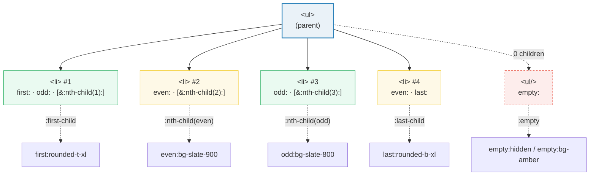
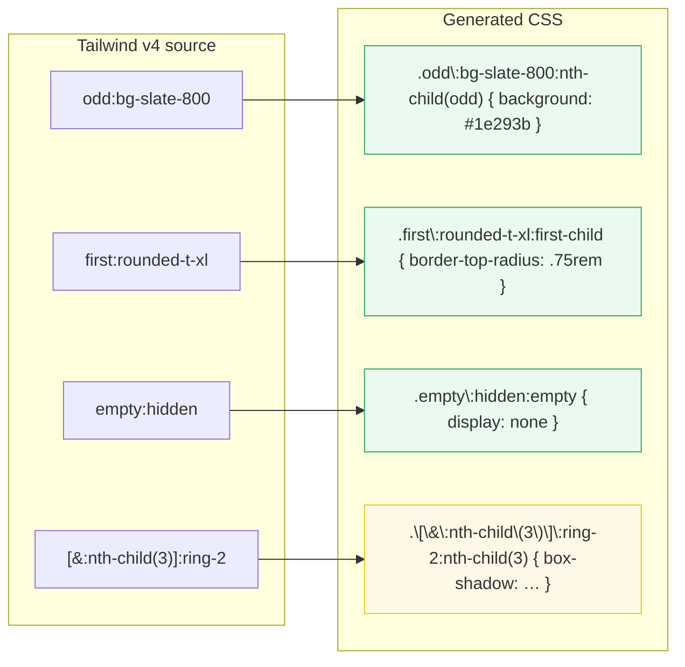

# Child-Index Variants

> **Companion demo:** [`child_variants.html`](./child_variants.html) — open in a browser.
> **Tailwind version:** v4.3.x via `@tailwindcss/browser@4` Play CDN.

---

## 0. TL;DR — the one idea

> **The analogy:** `group-*` / `peer-*` read an element's **STATE** (hovered,
> checked, focused). Child-index variants read an element's **POSITION** in the
> DOM tree — am I the first child? the last? an odd-numbered row? empty? Each
> one compiles to a CSS **structural pseudo-class** that the browser re-matches
> on every DOM mutation, so styling updates live without JavaScript.



The whole mechanism is the CSS pseudo-class Tailwind emits for you:

| Variant | Compiles to | Matches |
|---------|-------------|---------|
| `first:` | `:first-child` | the first child of its parent |
| `last:` | `:last-child` | the last child of its parent |
| `only:` | `:only-child` | has no siblings (first AND last) |
| `odd:` | `:nth-child(odd)` | positions 1, 3, 5, … |
| `even:` | `:nth-child(even)` | positions 2, 4, 6, … |
| `empty:` | `:empty` | no children at all (no elements, no text) |
| `not-first:` | `:not(:first-child)` | any child except the first |
| `not-last:` | `:not(:last-child)` | any child except the last |
| `[&:nth-child(n)]:` | `:nth-child(n)` | arbitrary — no built-in `nth-n:` |

---

## 1. How it works

### Zebra striping — the canonical case

```html
<ul>
  <li class="odd:bg-slate-800 even:bg-slate-900 px-4 py-2">Row 1 (odd → slate-800)</li>
  <li class="odd:bg-slate-800 even:bg-slate-900 px-4 py-2">Row 2 (even → slate-900)</li>
  <li class="odd:bg-slate-800 even:bg-slate-900 px-4 py-2">Row 3 (odd → slate-800)</li>
</ul>
```

`odd:bg-slate-800` compiles to `.\odd\:bg-slate-800:nth-child(odd)`. The browser
matches `:nth-child(odd)` against the **live** position, so adding a 4th `<li>`
automatically paints it slate-900 (even). No JS, no per-item class swap.

### First / last / only — corner rounding pattern

```html
<ul class="rounded-xl overflow-hidden border border-slate-700">
  <li class="first:rounded-t-xl last:rounded-b-xl px-4 py-3">…</li>
  <li class="first:rounded-t-xl last:rounded-b-xl px-4 py-3">…</li>
  <li class="first:rounded-t-xl last:rounded-b-xl px-4 py-3">…</li>
</ul>
```

The `<ul>` has `overflow-hidden` so child corners that poke past the parent's
`rounded-xl` get clipped. The first child gets only **top** corners rounded;
the last gets only **bottom** corners. If you delete items until one remains,
that single `<li>` is **both** first AND last — both rules fire and all four
corners round. For the explicit "alone" case use `only:rounded-xl`.

### Empty states

```html
<!-- Hide an element that has no children -->
<td class="empty:hidden">{{ maybe_empty_value }}</td>

<!-- Style an empty container with a fallback look -->
<ul class="empty:border-2 empty:border-dashed empty:border-amber-500 empty:p-8">
  <!-- no <li> yet → dashed amber border shows -->
</ul>
```

`:empty` matches only when the element has **zero** child nodes — including
text. Whitespace counts as a text node, so `<div class="empty:hidden"> </div>`
(with a space inside) is **not** empty. Comments do NOT count
(`<div><!-- hi --></div>` IS empty in modern browsers).

---

## 2. Mechanism — what Tailwind emits



Every built-in child variant is just shorthand for a pseudo-class. The
**arbitrary** form `[&:nth-child(n)]:` lets you reach any selector Tailwind
doesn't ship out of the box — including `:nth-of-type`, `:first-of-type`,
`:nth-child(3n+1)`, etc. The `&` inside the brackets is a placeholder for the
element the utility applies to.

### Arbitrary nth-child — every 3rd, 3n+1, etc.

```html
<!-- exactly the 3rd child -->
<li class="[&:nth-child(3)]:text-cyan-400">…</li>

<!-- every 3rd child (3, 6, 9, …) -->
<li class="[&:nth-child(3n)]:border-l-2">…</li>

<!-- first of its TYPE (not first child!) -->
<li class="[&:first-of-type]:font-bold">…</li>
```

The brackets accept any valid CSS selector. Tailwind substitutes the element
for `&` and emits the raw selector — `nth-child(3n+1)`, `nth-last-child(2)`,
`only-of-type`, all work.

---

## 3. Zebra striping patterns — decision guide

| Pattern | When to use | Notes |
|---------|-------------|-------|
| `odd:` / `even:` | Simple alternating rows | Re-evaluates live when items added/removed |
| `not-last:border-b` | Dividers between items (no trailing line) | Cleaner than `last:border-b-0` |
| `[&:nth-child(3n)]:` | Modular grid (every 3rd highlighted) | Use `3n+1` for offset |
| `divide-y divide-slate-700` | Borders between siblings (Tailwind utility) | Compiles to `:not(:last-child) > *` — separate mechanism |
| `first:pl-0 last:pr-0` | Remove outer gutters in a row | Common in horizontal menus |

> **`odd:`/`even:` vs `divide-*`:** both rely on structural pseudo-classes, but
> `divide-*` emits rules on the PARENT (`& > * + *`), while `odd:`/`even:`
> emits rules on each CHILD. You can stack them freely.

---

## Killer Gotchas

| Trap | Symptom | Fix |
|------|---------|-----|
| **Whitespace breaks `:empty`** | `empty:hidden` doesn't fire even though the element looks empty | A space or newline counts as a text node. The element must be literally `<div></div>` with nothing between the tags — no whitespace, no comments-only either |
| **Comment-only is still empty** (modern browsers) | `<div><!--x--></div>` matches `:empty` — surprising if you expected comments to count | Comments do NOT count as content per the HTML spec (since 2019). Don't rely on comment-only to defeat `:empty` |
| **Dynamic content from frameworks** | React/Vue interpolate `{value}` even when empty, leaving a whitespace text node | Use `{value || null}` / `v-if` so the framework renders no node, OR use `:not(:has(*))` arbitrary variant instead |
| **`odd:` is 1-indexed** | First item gets `odd:` not `even:` — devs expect 0-indexing | `:nth-child(odd)` matches positions 1, 3, 5 (position 1 is the first child). There is no 0th child |
| **No built-in `nth-3:`** | `nth-3:bg-red` doesn't exist | Use arbitrary: `[&:nth-child(3)]:bg-red-500`. Tailwind v4 ships `first`, `last`, `only`, `odd`, `even`, `empty`, and the `not-*` negations only |
| **`first:` ≠ `first-of-type:`** | `first:` doesn't fire when the element is preceded by a different-tag sibling | Tailwind's `first:` is `:first-child` (any-tag). For type-scoped use arbitrary `[&:first-of-type]:` |
| **Pseudo-class only matches among siblings of the SAME parent** | `odd:` on items in two different `<ul>`s resets per-list — each list has its own "first" | This is usually what you want (each list is independent). If you need global position, flatten into one parent |
| **Reordering vs re-rendering** | Reordering via `flex-row-reverse` does NOT change `:nth-child` (DOM order is unchanged) | `:nth-child` reads DOM source order, not visual order. Reverse in the DOM, or use CSS `order` + arbitrary `[&:nth-child()]:` combinations |
| **`only:` requires zero siblings** | A single visible child plus a hidden sibling (`hidden`) still counts — `:only-child` does NOT fire | `display:none` elements still exist in the DOM tree. Remove the sibling entirely (or use template wrappers) to trigger `:only-child` |
| **New DOM nodes need Tailwind re-scan** (Play CDN only) | Dynamically added `<li>` with brand-new classes doesn't get styled until MutationObserver runs | The Play CDN's MutationObserver picks up new classes within a frame or two. If you reuse the SAME class string on every item (recommended), no recompile happens — styling is instant |

### Cheat sheet

```html
<!-- 1. ZEBRA STRIPING (the classic) -->
<li class="odd:bg-slate-800 even:bg-slate-900 px-4 py-2">row</li>

<!-- 2. ROUND ONLY THE OUTER LIST CORNERS -->
<ul class="rounded-xl overflow-hidden border border-slate-700">
  <li class="first:rounded-t-xl last:rounded-b-xl">first (top rounded)</li>
  <li class="first:rounded-t-xl last:rounded-b-xl">middle</li>
  <li class="first:rounded-t-xl last:rounded-b-xl">last (bottom rounded)</li>
</ul>

<!-- 3. SOLE ITEM — full rounding when alone -->
<li class="only:rounded-xl">rounds all corners if I'm the only child</li>

<!-- 4. NEGATION — dividers without trailing line -->
<li class="not-last:border-b border-slate-700">dividers between, not after</li>

<!-- 5. HIDE EMPTY ELEMENTS -->
<td class="empty:hidden">{{ maybe_empty }}</td>
<div class="empty:border-dashed empty:border-amber-500 empty:p-8"></div>

<!-- 6. ARBITRARY NTH — every 3rd item -->
<li class="[&:nth-child(3n)]:text-cyan-400">every 3rd turns cyan</li>

<!-- 7. STACKING with state variants -->
<li class="odd:bg-slate-800 hover:odd:bg-slate-700">odd + hover</li>

<!-- 8. first-of-type (Tailwind has no built-in) -->
<li class="[&:first-of-type]:font-bold">first LI, ignoring earlier non-LI siblings</li>
```

---

## 🔗 Cross-references

- [group_peer](/tailwind/group_peer.html) — `group-*` / `peer-*` read element **state** (hover, checked, focus). This bundle reads element **position**. They stack: `odd:group-hover:bg-cyan-600` styles odd rows when the parent is hovered.
- [has_variant](/tailwind/has_variant.html) — `:has()` lets a parent react to having a matching CHILD. Useful when `empty:` is too coarse (you want "has a child matching X" rather than "has zero children").
- [form_state](/tailwind/form_state.html) — `required:`, `valid:`, `invalid:`, `autofill:`, `read-only:` — often combined with `empty:` on form fields (e.g. `empty:invalid:border-red-500`).
- [container_basics](/tailwind/container_basics.html) — container queries respond to parent SIZE; child variants respond to position. Both are "style me based on context, not my own props".
- [frontend/tailwind: responsive variants](/frontend/tailwind/tailwind_responsive_variants.html) — `md:`, `lg:` etc. respond to viewport. Stack freely with child variants: `md:odd:bg-slate-700`.

---

## Sources

1. **Tailwind CSS — Variants reference (`first`, `last`, `only`, `odd`, `even`, `empty`)**: https://tailwindcss.com/docs/hover-focus-and-other-states#available-variants (v4.3, official docs)
2. **Tailwind CSS — Styling elements based on sibling position**: https://tailwindcss.com/docs/hover-focus-and-other-states#using-the-first-and-last-child-pseudo-classes
3. **Tailwind CSS — Arbitrary variants (`[&:nth-child(n)]:`)**: https://tailwindcss.com/docs/hover-focus-and-other-states#using-arbitrary-variants
4. **MDN — `:nth-child()`**: https://developer.mozilla.org/en-US/docs/Web/CSS/:nth-child (1-indexed, accepts `odd`, `even`, `an+b` expressions)
5. **MDN — `:empty`**: https://developer.mozilla.org/en-US/docs/Web/CSS/:empty (matches elements with no child nodes — whitespace counts, comments do not since HTML spec update)
6. **MDN — `:only-child` vs `:first-child` + `:last-child`**: https://developer.mozilla.org/en-US/docs/Web/CSS/:only-child
