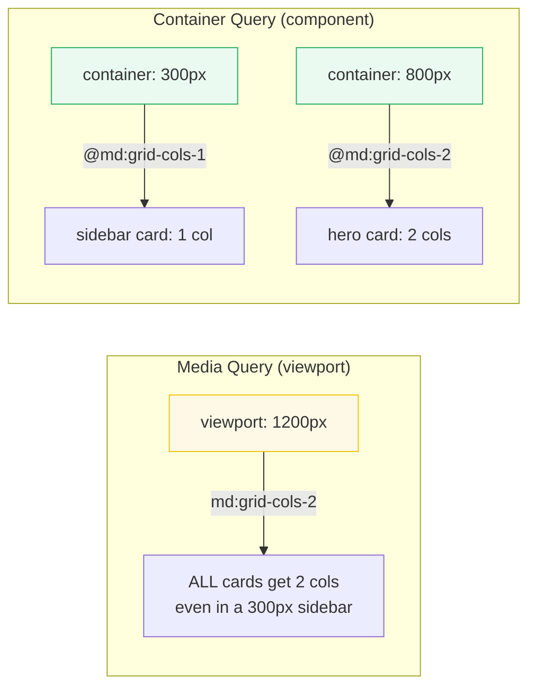

# Container Queries Basics

> **Companion demo:** [`container_basics.html`](./container_basics.html) — open in a browser.
> **Tailwind version:** v4.3.x via `@tailwindcss/browser@4` Play CDN.

---

## 0. TL;DR — the one idea

> **The analogy:** media queries ask "how wide is the window?" — container
> queries ask "how wide is my box?" A card in a sidebar and the same card in a
> hero section should look different. Container queries make components respond
> to their container, not the viewport.



---

## 1. How it works

### The two-step setup

**Step 1:** Mark the parent as a containment context:
```html
<div class="@container">
  <!-- children can now use @ variants -->
</div>
```
The `@container` class sets `container-type: inline-size` in CSS. This tells the
browser: "track the inline (horizontal) size of this element and let descendants
query it."

**Step 2:** Children use `@`-prefixed variants:
```html
<div class="@container">
  <div class="grid grid-cols-1 @md:grid-cols-2 @lg:grid-cols-3">
    <!-- 1 col by default, 2 cols when container ≥ 288px (@md), 3 cols ≥ 512px (@lg) -->
  </div>
</div>
```

### How it differs from media queries

| Aspect | Media Query (`md:`) | Container Query (`@md:`) |
|--------|--------------------|-----------------------|
| What triggers it | Browser window resize | Container element resize |
| Component portability | ❌ Same component looks same at same viewport size everywhere | ✅ Component adapts to WHERE it's placed |
| JS needed? | No | No |
| Use case | Page layout (sidebar visible/hidden) | Component layout (card stacks/spreads) |

---

## 2. The container breakpoint scale

Tailwind v4 defines container breakpoints in the `@theme` namespace `--container-*`:

| Variant | Default value | Pixel (root 16px) |
|---------|--------------|-------------------|
| `@xs:` | 20rem | 320px |
| `@sm:` | 24rem | 384px |
| `@md:` | 28rem | 448px |
| `@lg:` | 32rem | 512px |
| `@xl:` | 36rem | 576px |
| `@2xl:` | 42rem | 672px |
| `@3xl:` | 48rem | 768px |
| `@4xl:` | 56rem | 896px |
| `@5xl:` | 64rem | 1024px |
| `@6xl:` | 72rem | 1152px |
| `@7xl:` | 80rem | 1280px |

**Note:** These are DIFFERENT from viewport breakpoints (`sm:`, `md:`, etc.).
Container breakpoints use the `--container-*` namespace, viewport breakpoints use
`--breakpoint-*`.

---

## 3. The `container-type` CSS property

When you add `class="@container"`, Tailwind generates:
```css
.\@container {
  container-type: inline-size;
}
```

The three `container-type` values:

| Value | What it tracks | When to use |
|-------|---------------|-------------|
| `inline-size` | horizontal width (inline axis) | Most common — responsive layout |
| `size` | both width AND height | Rare — needs explicit height |
| `normal` | nothing (default) | Not a container |

**Why `inline-size` not `size`?** Using `size` requires the element to have an
explicit height — otherwise the container has no height to query. `inline-size`
only tracks width, which is almost always what you want.

---

## 4. Range queries (@max-)

Tailwind v4 also supports max-width container variants:
```html
<!-- Show only when container is NARROW (< 288px) -->
<div class="@max-md:hidden">Only visible in narrow containers</div>

<!-- Combine: between @sm and @lg -->
<div class="@sm:block @max-lg:hidden">Visible @sm to @lg</div>
```

---

## 5. Customizing container breakpoints

Override in your theme:
```css
@theme {
  --container-md: 20rem;  /* change @md: from 28rem to 20rem */
  --container-sidebar: 15rem;  /* custom named breakpoint */
}
```

---

## Killer Gotchas

| Trap | Symptom | Fix |
|------|---------|-----|
| **Forgot `@container` on parent** | `@md:` variants don't work — children don't respond | Add `class="@container"` to the parent element |
| **Using `size` instead of `inline-size`** | Container queries don't fire | Use `@container` (inline-size) unless you have explicit height |
| **Confusing @ breakpoints with viewport breakpoints** | `md:` and `@md:` are DIFFERENT thresholds | `md:` = 768px viewport, `@md:` = 28rem container |
| **No containment context in shadow DOM** | Container queries don't cross shadow boundaries | Define the container inside the shadow root |
| **Browser support** | Firefox < 110, Safari < 16 | All modern browsers (2023+) support it — check caniuse |
| **Performance** | Too many containers = layout thrashing | Use container queries on stable layout boundaries, not every div |

### Cheat sheet

```html
<!-- 1. Mark the container -->
<div class="@container">
  <!-- 2. Use @ variants on children -->
  <div class="grid grid-cols-1 @md:grid-cols-2 @lg:grid-cols-3">
    ...
  </div>
</div>

<!-- Named container -->
<div class="@container/sidebar">
  <div class="@sm/sidebar:flex-row">...</div>
</div>

<!-- Range: only when narrow -->
<div class="@max-md:hidden">Mobile-only content</div>
```

---

## 🔗 Cross-references

- [frontend/tailwind: Responsive Variants](/frontend/tailwind/tailwind_responsive_variants.html) — viewport breakpoints (sm:, md:, lg:) — the media query approach this evolves
- [container_named](/tailwind/container_named.html) — named containers for scoped component queries
- [container_variants](/tailwind/container_variants.html) — the full @sm:–@7xl: variant range + @max- queries
- [container_patterns](/tailwind/container_patterns.html) — real-world component-driven responsive patterns
- [arbitrary_values](/tailwind/arbitrary_values.html) — `@min-[400px]:` custom container thresholds

---

## Sources

1. **Tailwind CSS — Container Queries**: https://tailwindcss.com/docs/container-queries (v4.3, official docs)
2. **MDN — CSS Container Queries**: https://developer.mozilla.org/en-US/docs/Web/CSS/CSS_containment/Container_queries (container-type, @container)
3. **CSS-Tricks — Container Queries: a quick start guide**: https://css-tricks.com/css-container-queries/
4. **Chrome for Developers — Container Queries**: https://developer.chrome.com/docs/css-ui/container-queries
