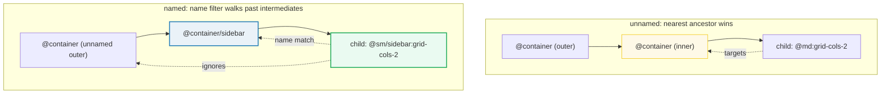
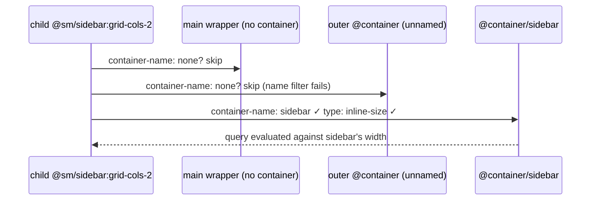
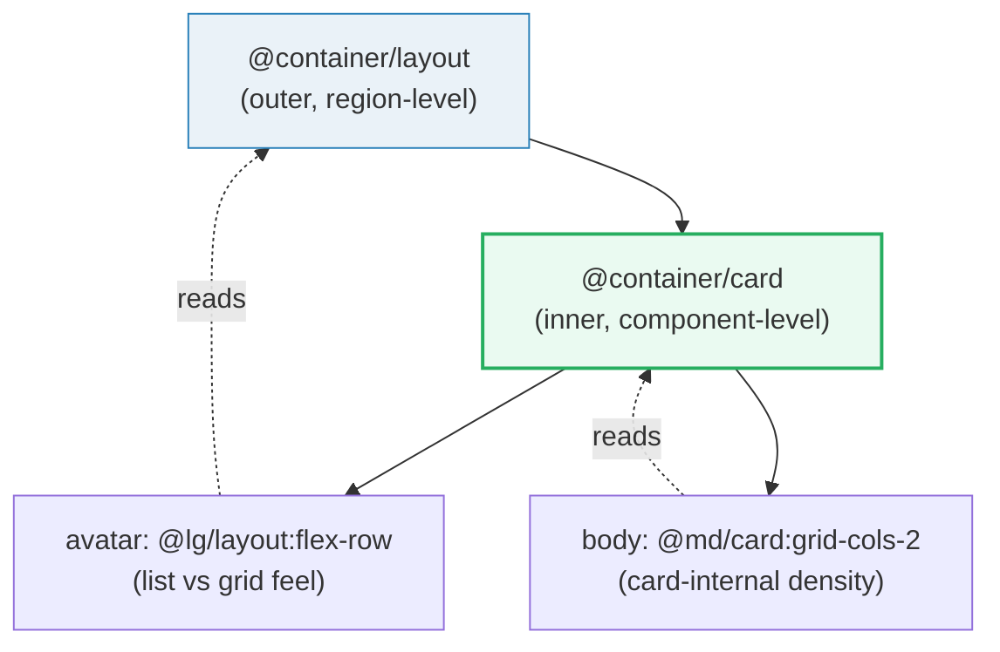

# Named Containers

> **Companion demo:** [`container_named.html`](./container_named.html) — open in a browser.
> Two independently-resizable named containers (`@container/sidebar` + `@container/main`) prove that `@sm/sidebar:` and `@md/main:` resolve to **different** ancestors.

---

## 0. TL;DR — the one idea

An unnamed container variant (`@md:grid-cols-2`) targets the **nearest** ancestor
with `class="@container"`. Once containers **nest**, "nearest" is ambiguous — a deep
child can't tell its sidebar container apart from a main container. **Naming** fixes it:



`@container/sidebar` sets **two** CSS properties on the element:

```css
.\@container\/sidebar {
  container-type: inline-size;
  container-name: sidebar;
}
```

The variant `@sm/sidebar:` then compiles to a query scoped to that **name**:

```css
@container sidebar (width >= 24rem) {
  .\@sm\/sidebar\:grid-cols-2 {
    grid-template-columns: repeat(2, minmax(0, 1fr));
  }
}
```

---

## 1. How named containers resolve

When the browser evaluates `@container sidebar (...)`, it walks **up** the ancestor
chain looking for the first element whose `container-name` **contains** `sidebar`
**and** whose `container-type` is queryable (`inline-size` or `size`). Every ancestor
that fails that filter is **transparent** to the query — it is skipped, not matched.



Resolution rules:

| rule | detail |
|---|---|
| **name match** | the query name must be **in** the element's `container-name` list (space-separated; one name is typical) |
| **type match** | the element must also set `container-type` to `inline-size` or `size` — a bare `container-name` without a type is **not** queryable |
| **nearest wins** | if two ancestors both carry the same name, the **innermost** one is used |
| **no match = dead** | if no ancestor carries the name, the variant never fires (no error, no fallback) |
| **case-sensitive** | `@container/Sidebar` and `@sm/sidebar:` do **not** match |

> **Verified live** in the demo: `getComputedStyle(el).getPropertyValue("container-name")`
> returns `sidebar` / `main` on the two containers, and each child's grid columns flip at
> the right width for **its** name only.

---

## 2. Named vs unnamed — comparison

| dimension | unnamed `@container` | named `@container/{name}` |
|---|---|---|
| **what it sets** | `container-type: inline-size` | `container-type: inline-size` **+** `container-name: {name}` |
| **child variant** | `@md:grid-cols-2` | `@md/sidebar:grid-cols-2` |
| **resolution** | nearest `@container` ancestor | nearest `@container/{name}` ancestor |
| **nested ambiguity** | ❌ child cannot choose between enclosing containers | ✅ targets exactly the named one |
| **dead-variant risk** | low (any `@container` works) | higher — a typo'd name silently matches nothing |
| **reusable component** | one variant set per nesting depth | one variant set works in any slot that names the container |
| **when to use** | single card/widget in one container | multi-region layouts, design-system components placed in varied slots |

### Side-by-side code

```html
<!-- UNNAMED: child responds to whichever @container is closest -->
<div class="@container">
  <div class="@md:grid-cols-2">…</div>
</div>

<!-- NAMED: child responds ONLY to the "sidebar" container, even if others enclose it -->
<div class="@container/sidebar">
  <div class="@sm/sidebar:grid-cols-2">…</div>
</div>
```

---

## 3. Nesting named containers

Names let you build **layered** responsive logic: an outer container drives one set of
variants, an inner named container drives another, and each child knows exactly which one
to listen to.



```html
<!-- Outer container drives LAYOUT decisions -->
<div class="@container/layout">
  <!-- Inner container drives CARD-INTERNAL decisions -->
  <div class="@container/card">
    <!-- @lg/layout: reads the OUTER container (does the row feel like a list or a grid?) -->
    <div class="@lg/layout:flex-row @md/card:grid-cols-2">
      <div class="avatar">…</div>
      <div class="body">…</div>
    </div>
  </div>
</div>
```

Key nesting behaviours:

- **Same name, twice** — if both an outer and inner container use `@container/card`, the
  inner one wins (nearest-with-name). Avoid reusing a name up and down the same branch.
- **Distinct names, layered** — the pattern above (`layout` + `card`) is idiomatic: outer
  name for macro layout, inner name for micro density. Each variant unambiguously targets
  its layer.
- **Unnamed between two named** — an unnamed `@container` sandwiched between two named
  ones does **not** steal named queries; it only catches unnamed `@md:`-style variants.

---

## 4. Killer Gotchas

| # | trap | symptom | fix |
|---|---|---|---|
| 1 | **Typo'd name** — `@container/sidebr` vs `@sm/sidebar:` | query never fires; child stays in base style, no error in console | keep names in a shared constant/theme; assert `container-name` via `getComputedStyle()` in tests (the demo does exactly this) |
| 2 | **Name without type** — hand-writing `container-name: sidebar` in custom CSS but forgetting `container-type` | ancestor is "named" but not queryable; variant stays dead | use Tailwind's `@container/{name}` (sets both) — don't roll your own partial declaration |
| 3 | **Case sensitivity** — `@container/Sidebar` + `@sm/sidebar:` | no match (CSS container names are case-sensitive) | use lowercase, kebab-case names everywhere |
| 4 | **Reusing one name on nested containers** | innermost wins, silently shadowing the outer; layout decisions you expected from the outer never apply | give each layer a distinct name (`layout`, `card`, `cell`) |
| 5 | **Expecting it to fire on viewport** | you resize the browser, nothing changes | named queries read the **container**, not the viewport — resize the container (the demo's sliders do this) |
| 6 | **CDN compile delay** — checking `container-name` synchronously on load | `getComputedStyle()` returns `none` right after the script tag loads | poll via `requestAnimationFrame` for ~2s (the demo's gold-check pattern) |
| 7 | **Range/max variants need the name too** — `@max-md:hidden` is unnamed; it won't scope to your container | max-width query targets the wrong (nearest unnamed) container | write `@max-md/sidebar:hidden` to keep the name |
| 8 | **Slashes in CSS escaping** — `@container/sidebar` becomes `.\@container\/sidebar` in compiled CSS | fine in Tailwind output, but if you hand-target the class in JS use `[class*="@container/sidebar"]` or `querySelector('.\\@container\\/sidebar')` | let Tailwind emit it; query by `id` or `[data-*]` in your own JS |

---

## Cheat sheet

```html
<!-- 1. Declare a named container -->
<div class="@container/sidebar">
  <!-- 2. Target it by name (breakpoint applies to THIS container's width) -->
  <div class="@sm/sidebar:grid-cols-2  @lg/sidebar:flex-row">…</div>
</div>

<!-- 3. Two regions, independently queryable -->
<aside class="@container/sidebar">  … @md/sidebar:… </aside>
<main  class="@container/main">     … @md/main:…    </main>

<!-- 4. Range query on a named container -->
<div class="@container/sidebar">
  <div class="@max-sm/sidebar:hidden">hide when sidebar &lt; 384px</div>
</div>

<!-- 5. Named SIZE container (for cqb/cqh block-axis units) -->
<div class="@container-size/hero">
  <div class="h-[50cqb]">half the hero's block size</div>
</div>
```

| variant | fires when | CSS equivalent |
|---|---|---|
| `@sm/sidebar:` | `@container/sidebar` width ≥ 24rem (384px) | `@container sidebar (width >= 24rem)` |
| `@md/main:` | `@container/main` width ≥ 28rem (448px) | `@container main (width >= 28rem)` |
| `@max-sm/sidebar:` | `@container/sidebar` width < 24rem (384px) | `@container sidebar (width < 24rem)` |
| `@min-[500px]/sidebar:` | arbitrary value, named | `@container sidebar (width >= 500px)` |

> Container sizes are the **same scale** whether named or not (`@3xs`=16rem … `@7xl`=80rem).
> Naming only changes **which ancestor** is measured, not the thresholds.

---

## 🔗 Cross-references

- **[`container_basics.html`](./container_basics.html)** / **[`CONTAINER_BASICS.md`](./CONTAINER_BASICS.md)** —
  the foundation: unnamed `@container`, `container-type: inline-size`, the viewport-vs-container mental model. Read first.
- **[`container_variants.html`](./container_variants.html)** —
  the full `@sm:` / `@md:` / `@lg:` breakpoint ladder, range queries (`@max-*`, `@sm:@max-md:`), arbitrary `@min-[…]`.
  Named containers reuse this exact ladder — just append `/{name}`.
- **[`container_patterns.html`](./container_patterns.html)** —
  component-driven responsive design patterns (card-in-sidebar, reused component in varied slots) — the *use cases* that make naming worthwhile.
- **[`../frontend/tailwind/tailwind_responsive_variants.html`](../frontend/tailwind/tailwind_responsive_variants.html)** —
  viewport breakpoints (`sm:`, `md:`). Container queries are the component-level evolution of these.

---

## Sources

1. **Tailwind CSS v4 — Responsive design › Named containers**
   <https://tailwindcss.com/docs/responsive-design#named-containers>
   (official syntax: `@container/{name}` declaration + `@sm/{name}:` variant)
2. **Tailwind CSS v4 — Responsive design › Container size reference**
   <https://tailwindcss.com/docs/responsive-design#container-size-reference>
   (the `@3xs`=16rem … `@7xl`=80rem scale used by named and unnamed variants alike)
3. **MDN — CSS Containment › Container name**
   <https://developer.mozilla.org/en-US/docs/Web/CSS/container-name>
   (the `container-name` property and nearest-named-ancestor resolution semantics)
