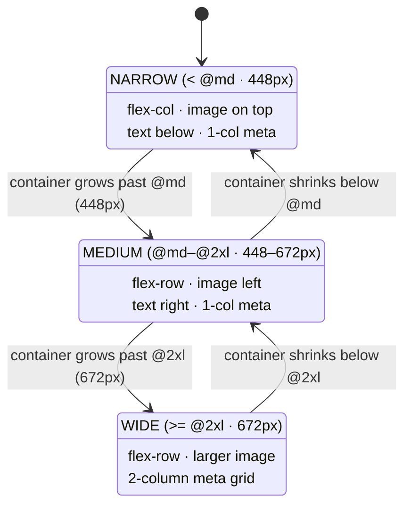

# Container Query Patterns — Component-Driven Responsive Design

> **Companion demo:** [`container_patterns.html`](./container_patterns.html) — open in a browser, drag the slider, watch the card reflow.

---

## 0. TL;DR — the one idea

Media queries ask **"how wide is the page?"**. Container queries ask **"how wide is my
slot?"**. The shift from *page-driven* to **component-driven** responsive design means a
single piece of component markup can be dropped into a sidebar, a grid cell, or a modal and
**reflow correctly in each** — with zero JavaScript and zero media queries.



The three states above are **one card**, one markup tree. The transitions fire on
**container** size changes — a sidebar toggle, a grid reflow, a modal opening — not on
viewport resize.

---

## 1. The adaptive card (Pattern 1)

The flagship pattern. A card whose outer layout, image size, and inner density all key off
its container.

```html
<div class="@container">                                  <!-- 1. mark the slot queryable -->
  <article class="flex flex-col @md:flex-row gap-4 p-4   <!-- 2. reflow on container width -->
                     bg-slate-800 rounded-xl border border-slate-700">
    <!-- 3. image: full-width on narrow, fixed on medium, larger on wide -->
    

    <div class="flex-1 min-w-0">
      <h3 class="text-base font-bold">Adaptive Card</h3>
      <p class="text-sm text-slate-400">Reflows on its container, not the viewport.</p>

      <!-- 4. inner density: 2 columns once there's room -->
      <div class="grid grid-cols-1 @2xl:grid-cols-2 gap-2 mt-3">
        <div class="rounded bg-slate-900/60 p-2">12.4k views</div>
        <div class="rounded bg-slate-900/60 p-2">2 days ago</div>
      </div>
    </div>
  </article>
</div>
```

**How the states map to breakpoints** (verified values, Tailwind v4):

| container width | state | `flex-direction` | image | meta grid |
|---|---|---|---|---|
| `< 448px` (`< @md`) | vertical stack | `column` | full-width, short | 1 column |
| `448–672px` (`@md`–`@2xl`) | horizontal | `row` | `w-36` (144px) | 1 column |
| `≥ 672px` (`≥ @2xl`) | expanded | `row` | `w-52` (208px) | 2 columns |

> The live demo proves this with `getComputedStyle()`: the gold-check asserts
> `container-type: inline-size` on the wrapper and `flex-direction` equal to the
> expected value (`column` < 448px, `row` ≥ 448px).

---

## 2. The sidebar toggle (Pattern 2)

A sidebar collapses via **JS state** (a toggle button), not via viewport resize. As it
collapses, the main column grows — and because the main column is a `@container`, its
children reflow **without any media query or resize listener**.

```html
<div class="flex">
  <!-- sidebar: 256px open, 0 collapsed (driven by a data attribute / class) -->
  <aside class="w-64" data-collapsed="false">…nav…</aside>

  <!-- main is the container: it widens automatically when the sidebar collapses -->
  <main class="@container flex-1">
    <!-- this toolbar switches to an overflow "more" menu when the main column is narrow -->
    <nav class="flex">
      <button class="@md:inline @max-md:hidden">Edit</button>
      <button class="@md:inline @max-md:hidden">Share</button>
      <button class="@md:inline @max-md:hidden">Export</button>
      <button class="@max-md:inline @md:hidden">More ▾</button>
    </nav>

    <section class="grid grid-cols-1 @md:grid-cols-2 @2xl:grid-cols-3 gap-4">
      …cards…
    </section>
  </main>
</div>
```

```js
// The ONLY JS: flip the sidebar. The container query does the rest.
sidebarToggle.addEventListener("click", () => {
  const aside = document.querySelector("aside");
  aside.classList.toggle("w-64");
  aside.classList.toggle("w-0");
});
```

The layout change is a **side-effect of the box model**, not a re-render driven by measured
pixels. Collapse the sidebar → `<main>` reflows → its `@container` children re-evaluate.
No `ResizeObserver`, no `matchMedia`, no re-render.

---

## 3. The component-library card (Pattern 3)

A design-system card that ships with **its own** `@container` wrapper, so consumers never
need to know the host context. Place it in a 3-column grid, a 280px sidebar, or a 600px
modal — it adapts to each automatically.

```html
<!-- The component owns its queryable wrapper. Consumers just drop it in. -->
<DesignSystemCard>
  <!-- internally: -->
  <div class="@container">
    <article class="flex flex-col @md:flex-row …">…</article>
  </div>
</DesignSystemCard>
```

```html
<!-- Host 1: dense grid → each cell ~320px → cards stack vertically -->
<div class="grid grid-cols-3 gap-4">
  <DesignSystemCard/> <DesignSystemCard/> <DesignSystemCard/>
</div>

<!-- Host 2: sidebar → ~280px → same vertical stack, automatically -->
<aside class="w-72"><DesignSystemCard/></aside>

<!-- Host 3: modal → ~600px → horizontal layout, automatically -->
<Modal><DesignSystemCard/></Modal>
```

This is the design-system payoff: **one component, every context**, because the responsive
logic lives with the component, not the page.

---

## 4. When to use container queries vs media queries

| Reach for… | When the layout decision depends on… | Example |
|---|---|---|
| **media query** (`md:`) | the **viewport** — page chrome, app shell, global grid columns | "on phones, show the bottom tab bar"; "on tablets, switch to a 2-column page layout" |
| **container query** (`@md:`) | the **component's available space** — reusable components, slots that resize independently of the viewport | "this card stacks in a sidebar, spreads in a hero"; "toolbar overflows to a menu when its column is narrow" |

**Rule of thumb:** if the same component can land in two places that have *different widths
at the same viewport size*, you need a container query. A media query cannot distinguish
"sidebar card" from "hero card" — both see the same viewport.

**Combine them:** use media queries for the *page shell* (sidebar visible on `lg:`) and
container queries for the *components inside it*. They compose cleanly — `@container` only
affects descendants that opt in.

---

## 5. Migrating from JS resize observers

The old way — measure a box and re-render — is brittle and expensive. Container queries
replace it with pure CSS.

| JS `ResizeObserver` approach | Container-query approach |
|---|---|
| Observe element, read `contentRect.width`, set a state/class, re-render | Add `@container` to the parent; use `@md:` / `@max-md:` variants |
| Re-renders, layout thrash, manual cleanup (`disconnect`) | Browser handles evaluation in the style phase — no JS, no re-render |
| Breakpoint logic duplicated in JS + CSS (drift risk) | Single source of truth in markup |
| Per-instance listeners scale poorly (many cards = many observers) | One declarative rule; the engine batches efficiently |

```js
// BEFORE: measure + re-render (delete this)
const ro = new ResizeObserver(([entry]) => {
  const w = entry.contentRect.width;
  card.classList.toggle("layout-row", w >= 448);
  card.classList.toggle("layout-expanded", w >= 672);
});
ro.observe(wrapper);

// AFTER: nothing. The @container + @md:/@2xl: classes do it all.
```

Keep `ResizeObserver` only when you need the **numeric width in JS** (e.g. canvas drawing,
virtualised lists). For *layout* decisions, container queries win.

---

## 6. Killer Gotchas

| trap | symptom | fix |
|---|---|---|
| **No `@container` on the parent** | `@md:` variants silently do nothing — children stay at the base layout | The *ancestor* that should be measured needs `class="@container"` (sets `container-type: inline-size`) |
| **Breakpoint value drift** | Gold-check fails; card flips at the "wrong" width | `@md` is **28rem = 448px** (not 288px — that's `@2xs`). Always verify against the [container size reference](https://tailwindcss.com/docs/responsive-design#container-size-reference) |
| **Checking styles too early** | `getComputedStyle()` returns UA defaults right after load | Tailwind's Play CDN compiles **async** — poll via `requestAnimationFrame` (~2s) before asserting |
| **`min-w-0` missing on flex text** | Long unbroken text overflows / pushes the image off-card in `flex-row` | Add `min-w-0` to the flex text child so it can shrink below its content size |
| **Container queries can't size themselves** | A `@container` element can't use `cqw`/`cqi` to size its *own* box (no self-reference) | Use units on **descendants**, or size the container via the host layout (flex/grid track) |
| **`size` vs `inline-size`** | `cqb`/`cqh` (block-axis units) resolve to 0 | `@container` = inline-size only; use `@container-size` when you need the block axis |
| **Nested containers target the nearest** | An inner `@md:` responds to the wrong ancestor | Use **named containers** (`@container/main` + `@md/main:`) to target a specific ancestor |
| **Mixing `rem` and `px` breakpoints** | Custom `--container-*` sorts in unexpected order; variants override each other | Define custom container sizes in **`rem`** to match the defaults |

---

### Cheat sheet

```html
<!-- mark a slot queryable -->
<div class="@container"> … </div>

<!-- reflow a card on container width -->
<article class="flex flex-col @md:flex-row"> … </article>

<!-- size per state -->


<!-- range: apply only BELOW a width -->
<div class="@max-md:flex-col"> … </div>

<!-- named container (disambiguate nested ones) -->
<div class="@container/main"> … <div class="@md/main:flex-row"> … </div> </div>

<!-- arbitrary one-off container size -->
<div class="@min-[475px]:flex-row"> … </div>

<!-- use the container's width as a unit on a descendant -->
<div class="@container"><div class="w-[50cqw]"> … </div></div>

<!-- customize a container breakpoint -->
<style type="text/tailwindcss">@theme{ --container-8xl: 96rem; }</style>
```

| intent | class |
|---|---|
| make a parent queryable | `@container` |
| flip layout by container | `flex-col @md:flex-row` |
| size per state | `w-full @md:w-36 @2xl:w-52` |
| below-a-width range | `@max-md:hidden` |
| single-breakpoint range | `@md:@max-lg:flex-row` |
| target a named container | `@md/main:` |
| arbitrary container size | `@min-[475px]:` |
| full-size container (block axis) | `@container-size` |

---

## 🔗 Cross-references

- [`container_basics.html`](./container_basics.html) / [`CONTAINER_BASICS.md`](./CONTAINER_BASICS.md) — the mechanics of `@container`, `container-type`, and the `@` variant ecosystem.
- [`container_variants.html`](./container_variants.html) — `@max-*` ranges, container-query unit variants (`cqw`/`cqb`), and stacking.
- [`container_named.html`](./container_named.html) — named containers (`@container/main`) for disambiguating nested contexts.
- [`/frontend/foundations/flexbox.html`](/frontend/foundations/flexbox.html) — the `flex-row` / `flex-col` the adaptive card flips between.
- [`/frontend/tailwind/tailwind_responsive_variants.html`](/frontend/tailwind/tailwind_responsive_variants.html) — viewport breakpoints; the page-level counterpart to these component-level queries.

---

## Sources

1. Tailwind CSS — *Responsive design · Container queries · Container size reference* (v4 docs). <https://tailwindcss.com/docs/responsive-design#container-size-reference>
2. MDN — *CSS Container Queries* (`container-type`, `@container`, container query length units). <https://developer.mozilla.org/en-US/docs/Web/CSS/CSS_containment/Container_queries>
3. Una Kravets — *Container Queries: a quick start guide* (CSS container-type & design-system implications). <https://developer.chrome.com/docs/css-ui/container-queries>
