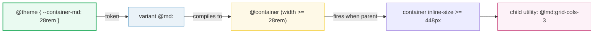

# Container Query Variants

> **Companion demo:** [`container_variants.html`](./container_variants.html) — open in a browser.
> **Tailwind version:** v4.3.x via `@tailwindcss/browser@4` Play CDN.

---

## 0. TL;DR — the one idea

> **A container variant `@md:` is a media query aimed at the container, not the
> window.** It fires when the container's inline-size is `>=` the
> `--container-md` theme token. Tailwind v4 ships **13** of them (`@3xs:` →
> `@7xl:`), plus `@max-*` range variants and arbitrary `@min-[400px]:`
> thresholds — all driven by the same `--container-*` namespace.

```mermaid
graph TB
    subgraph "The 13-breakpoint ladder (ascending)"
      A["@3xs 16rem/256"] --> B["@2xs 18rem/288"] --> C["@xs 20rem/320"]
      C --> D["@sm 24rem/384"] --> E["@md 28rem/448"] --> F["@lg 32rem/512"]
      F --> G["@xl 36rem/576"] --> H["@2xl 42rem/672"] --> I["@3xl 48rem/768"]
      I --> J["@4xl 56rem/896"] --> K["@5xl 64rem/1024"] --> L["@6xl 72rem/1152"]
      L --> M["@7xl 80rem/1280"]
    end
    style D fill:#eaf2f8,stroke:#2980b9
    style E fill:#eaf2f8,stroke:#2980b9
    style F fill:#eaf2f8,stroke:#2980b9
```





> Each rung is **independent** from the viewport ladder (`sm:`, `md:`, `lg:` use
> `--breakpoint-*`). Same nicknames, different namespace, different trigger.

---

## 1. How it works

### Setup (recap from `container_basics`)

1. Mark the parent: `class="@container"` → sets `container-type: inline-size`.
2. Children use `@`-prefixed variants that read `--container-*` tokens:

```html
<div class="@container">
  <div class="grid grid-cols-1 @sm:grid-cols-2 @lg:grid-cols-3">
    <!-- 1 col < 384px · 2 cols 384–511 · 3 cols >= 512 -->
  </div>
</div>
```

### What the variant compiles to

`@md:grid-cols-3` becomes (conceptually):

```css
.\@container { container-type: inline-size; }

@container (width >= 28rem) {
  .\@md\:grid-cols-3 { grid-template-columns: repeat(3, minmax(0, 1fr)); }
}
```

The `28rem` is **not** hardcoded — it is `var(--container-md)`. Change the token
and every `@md:` site moves with it. This is the whole reason the variant scale
lives in `@theme`.

---

## 2. The full `@`-variant scale (13 breakpoints)

Verified against [`theme.css`](https://github.com/tailwindlabs/tailwindcss/blob/master/packages/tailwindcss/theme.css) (`@theme default { --container-* … }`), 2026-06.

| Variant | Theme token | Default | px (root 16) | Fires when container… |
|---------|-------------|---------|--------------|----------------------|
| `@3xs:` | `--container-3xs` | 16rem | 256px | ≥ 256px |
| `@2xs:` | `--container-2xs` | 18rem | 288px | ≥ 288px |
| `@xs:`  | `--container-xs`  | 20rem | 320px | ≥ 320px |
| `@sm:`  | `--container-sm`  | 24rem | 384px | ≥ 384px |
| `@md:`  | `--container-md`  | 28rem | 448px | ≥ 448px |
| `@lg:`  | `--container-lg`  | 32rem | 512px | ≥ 512px |
| `@xl:`  | `--container-xl`  | 36rem | 576px | ≥ 576px |
| `@2xl:` | `--container-2xl` | 42rem | 672px | ≥ 672px |
| `@3xl:` | `--container-3xl` | 48rem | 768px | ≥ 768px |
| `@4xl:` | `--container-4xl` | 56rem | 896px | ≥ 896px |
| `@5xl:` | `--container-5xl` | 64rem | 1024px | ≥ 1024px |
| `@6xl:` | `--container-6xl` | 72rem | 1152px | ≥ 1152px |
| `@7xl:` | `--container-7xl` | 80rem | 1280px | ≥ 1280px |

> **Note the uneven spacing.** Container breakpoints are tuned for *component*
> widths, so they cluster densely at the low end (256/288/320/384 — widget &
> card sizes) and stretch out above 768px. Viewport breakpoints (`--breakpoint-*`)
> are coarser and start higher (`sm: 40rem`).

### `--container-*` does double duty

The same namespace also powers `max-w-*` (e.g. `max-w-md` reads
`--container-md`). So overriding `--container-md` shifts **both** the `@md:`
container variant *and* the `max-w-md` utility — usually what you want, but
worth knowing.

---

## 3. Range queries — `@max-*`

Min-width (`@md:`) asks "is the container **wide enough**?". Max-width
(`@max-md:`) asks "is it **narrow enough**?". Tailwind emits a strict
`width <` comparison so the two never overlap at the exact boundary:

| Variant | Fires when container… | Generated query (sketch) |
|---------|----------------------|--------------------------|
| `@md:block`    | ≥ 28rem | `@container (width >= 28rem)` |
| `@max-md:hidden` | < 28rem | `@container (width < 28rem)` |

### Combining into a band

Stack a min and a max to target a window of widths:

```html
<!-- visible only while container is between @sm and @lg (384–511px) -->
<div class="@sm:block @max-lg:hidden hidden">
  Shown @sm…@lg
</div>
<!-- visible everywhere except that band -->
<div class="@max-sm:block @lg:block hidden">
  Shown < @sm or >= @lg
</div>
```

The classic use case: a "compact mode" badge that appears only inside a
medium-width sidebar:

```html
<span class="@max-md:inline hidden">@max-md:inline · compact</span>
```

---

## 4. Arbitrary thresholds — `@min-[…]:` / `@max-[…]`

When none of the 13 named breakpoints fit, drop in a one-off pixel/rem value.
No theme edit required:

```html
<!-- switch to row layout at an unusual 400px threshold -->
<div class="flex flex-col @min-[400px]:flex-row">…</div>

<!-- hide a control above 640px container width -->
<button class="@max-[640px]:hidden">Condensed action</button>
```

These compile to literal container queries:
`@container (min-width: 400px)` and `@container (max-width: 640px)`.

> Prefer a named token if you reuse the threshold in 2+ places — add a
> `--container-*` entry instead of sprinkling magic numbers.

---

## 5. Stacking variants

Multiple `@`-variants stack on one element just like viewport ones. Each is an
**independent rule**; when both match, Tailwind resolves conflicts by **source
order** (variants are emitted ascending by breakpoint, so the wider one wins):

```html
<div class="@container">
  <!-- column on narrow, row from @sm, bigger gap from @lg -->
  <ul class="flex flex-col gap-2 @sm:flex-row @lg:gap-8">
    <li>A</li><li>B</li><li>C</li>
  </ul>
</div>
```

| Container width | `@sm:flex-row` | `@lg:gap-8` | Result |
|-----------------|----------------|-------------|--------|
| 300px | inactive | inactive | `flex-col gap-2` |
| 400px | **active** | inactive | `flex-row gap-2` |
| 520px | active | **active** | `flex-row gap-8` (`gap-8` overrides `gap-2`) |

Mix freely with non-container variants too — `md:@lg:grid-cols-4` means
"viewport ≥ 768 **and** container ≥ 512".

---

## 6. Overriding thresholds via `@theme`

Because every variant reads a `--container-*` token, you retune the whole scale
in one place:

```css
@theme {
  --container-md: 20rem;   /* @md: now fires at 320px instead of 448px */
  --container-sidebar: 15rem; /* custom named breakpoint → @sidebar: */
}
```

```html
<div class="@container">
  <p class="@sidebar:text-lg">Big text once the sidebar passes 240px</p>
</div>
```

- Named tokens (`--container-sidebar`) generate a matching `@sidebar:` variant.
- Remove a default entirely with `--container-md: initial;` to drop `@md:`.
- `@theme reference { … }` defines a token for `theme()` lookups **without**
  emitting a variant — useful when you want the value but not the utility.

---

## Killer Gotchas

| Trap | Symptom | Fix |
|------|---------|-----|
| **Parent missing `@container`** | No `@*:` variant ever fires | Add `class="@container"` to the ancestor that should be measured |
| **Confusing `@md:` with `md:`** | "It works when I resize the window, not the box" | `md:` = `--breakpoint-md` (48rem viewport); `@md:` = `--container-md` (28rem container). Different namespaces |
| **Stale px mental model** | You tune for "448px" but the user changed root font-size | Variants compare in **rem** against container inline-size. If the user bumps root font, every threshold moves with it |
| **Container has padding/border** | Breakpoint fires a few px "early/late" | `container-type: inline-size` measures the **content box**. With `box-sizing: border-box`, set width = border-box; content box is smaller by padding+border. Put padding on the *child*, not the `@container` element |
| **`@max-` boundary off-by-one** | Both `@sm:` and `@max-sm:` seem to apply at exactly 384px | They don't overlap — Tailwind uses strict `<` for max. Floating rounding can make it *look* borderline; nudge the value |
| **Overriding `--container-md` also moves `max-w-md`** | `max-w-md` width changed unexpectedly | The namespace is shared. If you must diverge, keep max-widths on default tokens and define a *separate* named token for the query |
| **Named container + wrong variant** | `@container/sidebar` ignores `@md:` | A named container needs the name suffix: `@md/sidebar:`. See [`container_named`](./container_named.html) |
| **Too many `@container` ancestors** | Layout thrash / jank on resize | Container queries re-evaluate on size change. Put containment on stable layout boundaries, not every `<div>` |

### Cheat sheet

```html
<!-- 1. mark the container -->
<div class="@container">

  <!-- 2. min-width ladder -->
  <div class="grid grid-cols-1 @sm:grid-cols-2 @lg:grid-cols-3 @2xl:grid-cols-4">…</div>

  <!-- 3. narrow-only (range) -->
  <span class="@max-sm:block hidden">compact badge</span>

  <!-- 4. band: @sm ≤ w < @lg -->
  <div class="@sm:block @max-lg:hidden hidden">medium-only</div>

  <!-- 5. arbitrary threshold -->
  <div class="flex flex-col @min-[400px]:flex-row">…</div>

  <!-- 6. stacking (wider wins) -->
  <ul class="flex flex-col gap-2 @sm:flex-row @lg:gap-8">…</ul>
</div>
```

```css
/* retune the scale */
@theme {
  --container-md: 20rem;        /* move @md: to 320px */
  --container-rail: 15rem;      /* → @rail: custom variant */
}
```

---

## 🔗 Cross-references

- [container_basics](/tailwind/container_basics.html) — the `@container` / `container-type` foundation this extends (start here)
- [container_named](/tailwind/container_named.html) — `@container/sidebar` + `@md/sidebar:` scoped queries
- [container_patterns](/tailwind/container_patterns.html) — real-world component-driven responsive patterns built on these variants
- [arbitrary_values](/tailwind/arbitrary_values.html) — `@min-[400px]:` is a special case of the arbitrary-value system
- [frontend/tailwind: Responsive Variants](/frontend/tailwind/tailwind_responsive_variants.html) — the viewport `sm:`/`md:` ladder these mirror at the component level

---

## Sources

1. **Tailwind CSS — Container Queries**: https://tailwindcss.com/docs/container-queries (official v4 docs; `@container`, `@sm:`–`@7xl:`, `@max-*`)
2. **Tailwind CSS — default theme (`theme.css`)**: https://github.com/tailwindlabs/tailwindcss/blob/master/packages/tailwindcss/theme.css (`--container-3xs`…`--container-7xl` token values, verified 2026-06)
3. **Tailwind CSS — CSS-first configuration**: https://tailwindcss.com/docs/theme (`--container-*` namespace → `max-w-*` + container variants)
4. **MDN — CSS Container Queries**: https://developer.mozilla.org/en-US/docs/Web/CSS/CSS_containment/Container_queries (`container-type`, `@container (width >= …)` syntax)
5. **Chrome for Developers — Container Queries**: https://developer.chrome.com/docs/css-ui/container-queries (range `<` vs `>=` semantics, containment cost)
